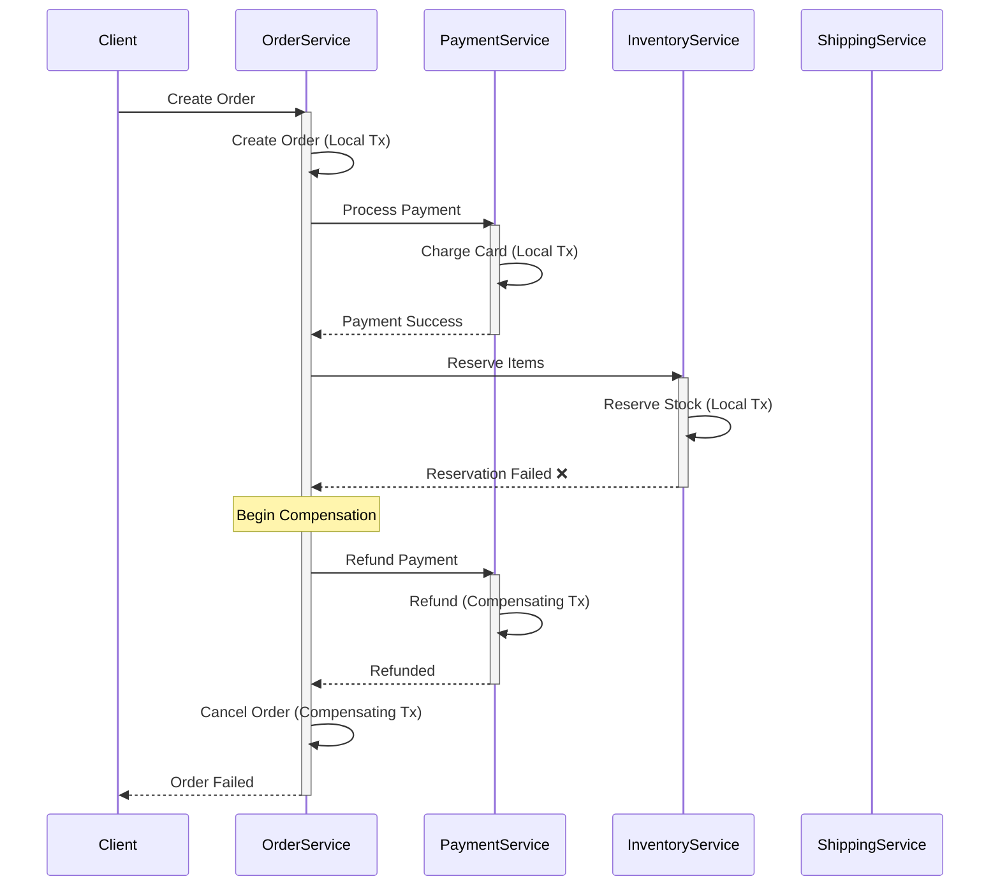
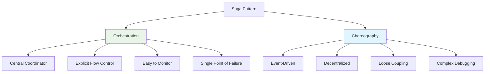

# System Design Fundamentals: Saga Pattern for Distributed Transactions

The Saga pattern manages distributed transactions across multiple services without requiring distributed locks. It breaks long-lived transactions into a series of local transactions, each with a compensating transaction to undo changes if needed.

## Saga Pattern Overview



## Saga Types



## Saga State Machine

```go
package main

import (
    "fmt"
    "sync"
    "time"
)

// SagaState represents the current state of a saga
type SagaState string

const (
    StateInitial     SagaState = "INITIAL"
    StateRunning     SagaState = "RUNNING"
    StateCompensating SagaState = "COMPENSATING"
    StateCompleted   SagaState = "COMPLETED"
    StateFailed      SagaState = "FAILED"
    StateAborted     SagaState = "ABORTED"
)

// Saga represents a distributed transaction
type Saga struct {
    ID               string
    State            SagaState
    Steps            []*SagaStep
    CompletedSteps   []string
    CurrentStepIndex int
    Error            error
    CreatedAt        time.Time
    CompletedAt      time.Time
    mutex            sync.RWMutex
}

// SagaStep represents a step in the saga
type SagaStep struct {
    Name        string
    Action      func() error
    Compensation func() error
    Status      StepStatus
    Error       error
    ExecutedAt  time.Time
}

type StepStatus string

const (
    StepPending      StepStatus = "PENDING"
    StepExecuting    StepStatus = "EXECUTING"
    StepCompleted    StepStatus = "COMPLETED"
    StepFailed       StepStatus = "FAILED"
    StepCompensating StepStatus = "COMPENSATING"
    StepCompensated  StepStatus = "COMPENSATED"
)

func NewSaga(id string) *Saga {
    return &Saga{
        ID:             id,
        State:          StateInitial,
        Steps:          make([]*SagaStep, 0),
        CompletedSteps: make([]string, 0),
        CreatedAt:      time.Now(),
    }
}

func (s *Saga) AddStep(name string, action, compensation func() error) {
    s.mutex.Lock()
    defer s.mutex.Unlock()
    
    step := &SagaStep{
        Name:         name,
        Action:       action,
        Compensation: compensation,
        Status:       StepPending,
    }
    
    s.Steps = append(s.Steps, step)
    
    fmt.Printf("➕ Added step to saga %s: %s\n", s.ID, name)
}

func (s *Saga) Execute() error {
    s.mutex.Lock()
    s.State = StateRunning
    s.mutex.Unlock()
    
    fmt.Printf("\n🚀 Executing saga: %s (%d steps)\n", s.ID, len(s.Steps))
    
    // Execute each step
    for i, step := range s.Steps {
        s.mutex.Lock()
        s.CurrentStepIndex = i
        step.Status = StepExecuting
        s.mutex.Unlock()
        
        fmt.Printf("\n▶️  Step %d: %s\n", i+1, step.Name)
        
        step.ExecutedAt = time.Now()
        err := step.Action()
        
        if err != nil {
            // Step failed - begin compensation
            s.mutex.Lock()
            step.Status = StepFailed
            step.Error = err
            s.Error = err
            s.State = StateCompensating
            s.mutex.Unlock()
            
            fmt.Printf("❌ Step failed: %s - %v\n", step.Name, err)
            
            // Compensate completed steps in reverse order
            if compErr := s.compensate(); compErr != nil {
                s.mutex.Lock()
                s.State = StateFailed
                s.mutex.Unlock()
                
                fmt.Printf("💥 Compensation failed: %v\n", compErr)
                return fmt.Errorf("saga failed and compensation failed: %w", compErr)
            }
            
            s.mutex.Lock()
            s.State = StateAborted
            s.CompletedAt = time.Now()
            s.mutex.Unlock()
            
            fmt.Printf("\n⚠️  Saga aborted: %s\n", s.ID)
            return err
        }
        
        s.mutex.Lock()
        step.Status = StepCompleted
        s.CompletedSteps = append(s.CompletedSteps, step.Name)
        s.mutex.Unlock()
        
        fmt.Printf("✅ Step completed: %s\n", step.Name)
    }
    
    s.mutex.Lock()
    s.State = StateCompleted
    s.CompletedAt = time.Now()
    s.mutex.Unlock()
    
    duration := s.CompletedAt.Sub(s.CreatedAt)
    fmt.Printf("\n🎉 Saga completed: %s (duration: %v)\n", s.ID, duration)
    
    return nil
}

func (s *Saga) compensate() error {
    fmt.Printf("\n🔄 Starting compensation for saga: %s\n", s.ID)
    
    // Compensate in reverse order
    for i := s.CurrentStepIndex; i >= 0; i-- {
        step := s.Steps[i]
        
        if step.Status != StepCompleted {
            continue
        }
        
        fmt.Printf("\n↩️  Compensating step %d: %s\n", i+1, step.Name)
        
        step.Status = StepCompensating
        
        if err := step.Compensation(); err != nil {
            fmt.Printf("❌ Compensation failed: %s - %v\n", step.Name, err)
            return fmt.Errorf("compensation failed for step %s: %w", step.Name, err)
        }
        
        step.Status = StepCompensated
        fmt.Printf("✅ Compensation completed: %s\n", step.Name)
    }
    
    fmt.Printf("\n✅ All compensations completed\n")
    
    return nil
}

func (s *Saga) GetStatus() (SagaState, []string, error) {
    s.mutex.RLock()
    defer s.mutex.RUnlock()
    
    return s.State, s.CompletedSteps, s.Error
}
```

## Orchestration-Based Saga

```go
// SagaOrchestrator manages saga execution centrally
type SagaOrchestrator struct {
    sagas map[string]*Saga
    mutex sync.RWMutex
}

func NewSagaOrchestrator() *SagaOrchestrator {
    return &SagaOrchestrator{
        sagas: make(map[string]*Saga),
    }
}

func (so *SagaOrchestrator) CreateSaga(id string) *Saga {
    so.mutex.Lock()
    defer so.mutex.Unlock()
    
    saga := NewSaga(id)
    so.sagas[id] = saga
    
    fmt.Printf("📋 Created saga: %s\n", id)
    
    return saga
}

func (so *SagaOrchestrator) ExecuteSaga(sagaID string) error {
    so.mutex.RLock()
    saga, exists := so.sagas[sagaID]
    so.mutex.RUnlock()
    
    if !exists {
        return fmt.Errorf("saga not found: %s", sagaID)
    }
    
    return saga.Execute()
}

func (so *SagaOrchestrator) GetSaga(sagaID string) (*Saga, error) {
    so.mutex.RLock()
    defer so.mutex.RUnlock()
    
    saga, exists := so.sagas[sagaID]
    if !exists {
        return nil, fmt.Errorf("saga not found: %s", sagaID)
    }
    
    return saga, nil
}

func (so *SagaOrchestrator) ListSagas() []*Saga {
    so.mutex.RLock()
    defer so.mutex.RUnlock()
    
    sagas := make([]*Saga, 0, len(so.sagas))
    for _, saga := range so.sagas {
        sagas = append(sagas, saga)
    }
    
    return sagas
}
```

## Order Saga Example

```go
// Order domain models
type Order struct {
    ID          string
    CustomerID  string
    Items       []OrderItem
    TotalAmount float64
    Status      OrderStatus
}

type OrderItem struct {
    ProductID string
    Quantity  int
    Price     float64
}

type OrderStatus string

const (
    OrderPending   OrderStatus = "PENDING"
    OrderConfirmed OrderStatus = "CONFIRMED"
    OrderCancelled OrderStatus = "CANCELLED"
)

// Service implementations
type OrderService struct {
    orders map[string]*Order
    mutex  sync.RWMutex
}

func NewOrderService() *OrderService {
    return &OrderService{
        orders: make(map[string]*Order),
    }
}

func (os *OrderService) CreateOrder(order *Order) error {
    os.mutex.Lock()
    defer os.mutex.Unlock()
    
    order.Status = OrderPending
    os.orders[order.ID] = order
    
    fmt.Printf("  📦 Order created: %s (amount: $%.2f)\n", order.ID, order.TotalAmount)
    
    return nil
}

func (os *OrderService) CancelOrder(orderID string) error {
    os.mutex.Lock()
    defer os.mutex.Unlock()
    
    order, exists := os.orders[orderID]
    if !exists {
        return fmt.Errorf("order not found: %s", orderID)
    }
    
    order.Status = OrderCancelled
    
    fmt.Printf("  ❌ Order cancelled: %s\n", orderID)
    
    return nil
}

func (os *OrderService) ConfirmOrder(orderID string) error {
    os.mutex.Lock()
    defer os.mutex.Unlock()
    
    order, exists := os.orders[orderID]
    if !exists {
        return fmt.Errorf("order not found: %s", orderID)
    }
    
    order.Status = OrderConfirmed
    
    fmt.Printf("  ✅ Order confirmed: %s\n", orderID)
    
    return nil
}

type PaymentService struct {
    payments map[string]float64
    mutex    sync.RWMutex
}

func NewPaymentService() *PaymentService {
    return &PaymentService{
        payments: make(map[string]float64),
    }
}

func (ps *PaymentService) ProcessPayment(orderID string, amount float64) error {
    ps.mutex.Lock()
    defer ps.mutex.Unlock()
    
    // Simulate payment processing
    time.Sleep(100 * time.Millisecond)
    
    ps.payments[orderID] = amount
    
    fmt.Printf("  💳 Payment processed: %s ($%.2f)\n", orderID, amount)
    
    return nil
}

func (ps *PaymentService) RefundPayment(orderID string) error {
    ps.mutex.Lock()
    defer ps.mutex.Unlock()
    
    amount, exists := ps.payments[orderID]
    if !exists {
        return fmt.Errorf("payment not found: %s", orderID)
    }
    
    delete(ps.payments, orderID)
    
    fmt.Printf("  💸 Payment refunded: %s ($%.2f)\n", orderID, amount)
    
    return nil
}

type InventoryService struct {
    stock        map[string]int
    reservations map[string][]OrderItem
    mutex        sync.RWMutex
}

func NewInventoryService() *InventoryService {
    return &InventoryService{
        stock:        make(map[string]int),
        reservations: make(map[string][]OrderItem),
    }
}

func (is *InventoryService) SetStock(productID string, quantity int) {
    is.mutex.Lock()
    defer is.mutex.Unlock()
    
    is.stock[productID] = quantity
}

func (is *InventoryService) ReserveItems(orderID string, items []OrderItem) error {
    is.mutex.Lock()
    defer is.mutex.Unlock()
    
    // Check availability
    for _, item := range items {
        available, exists := is.stock[item.ProductID]
        if !exists || available < item.Quantity {
            return fmt.Errorf("insufficient stock for product %s", item.ProductID)
        }
    }
    
    // Reserve items
    for _, item := range items {
        is.stock[item.ProductID] -= item.Quantity
    }
    
    is.reservations[orderID] = items
    
    fmt.Printf("  📦 Items reserved: %s (%d items)\n", orderID, len(items))
    
    return nil
}

func (is *InventoryService) ReleaseItems(orderID string) error {
    is.mutex.Lock()
    defer is.mutex.Unlock()
    
    items, exists := is.reservations[orderID]
    if !exists {
        return fmt.Errorf("reservation not found: %s", orderID)
    }
    
    // Release items back to stock
    for _, item := range items {
        is.stock[item.ProductID] += item.Quantity
    }
    
    delete(is.reservations, orderID)
    
    fmt.Printf("  ↩️  Items released: %s (%d items)\n", orderID, len(items))
    
    return nil
}

type ShippingService struct {
    shipments map[string]bool
    mutex     sync.RWMutex
}

func NewShippingService() *ShippingService {
    return &ShippingService{
        shipments: make(map[string]bool),
    }
}

func (ss *ShippingService) CreateShipment(orderID string) error {
    ss.mutex.Lock()
    defer ss.mutex.Unlock()
    
    ss.shipments[orderID] = true
    
    fmt.Printf("  🚚 Shipment created: %s\n", orderID)
    
    return nil
}

func (ss *ShippingService) CancelShipment(orderID string) error {
    ss.mutex.Lock()
    defer ss.mutex.Unlock()
    
    delete(ss.shipments, orderID)
    
    fmt.Printf("  ❌ Shipment cancelled: %s\n", orderID)
    
    return nil
}
```

## Order Saga Coordinator

```go
// OrderSagaCoordinator orchestrates the order creation saga
type OrderSagaCoordinator struct {
    orchestrator    *SagaOrchestrator
    orderService    *OrderService
    paymentService  *PaymentService
    inventoryService *InventoryService
    shippingService *ShippingService
}

func NewOrderSagaCoordinator(
    orderService *OrderService,
    paymentService *PaymentService,
    inventoryService *InventoryService,
    shippingService *ShippingService,
) *OrderSagaCoordinator {
    return &OrderSagaCoordinator{
        orchestrator:     NewSagaOrchestrator(),
        orderService:     orderService,
        paymentService:   paymentService,
        inventoryService: inventoryService,
        shippingService:  shippingService,
    }
}

func (osc *OrderSagaCoordinator) CreateOrderSaga(order *Order) error {
    sagaID := fmt.Sprintf("order-saga-%s", order.ID)
    saga := osc.orchestrator.CreateSaga(sagaID)
    
    // Step 1: Create Order
    saga.AddStep(
        "CreateOrder",
        func() error {
            return osc.orderService.CreateOrder(order)
        },
        func() error {
            return osc.orderService.CancelOrder(order.ID)
        },
    )
    
    // Step 2: Process Payment
    saga.AddStep(
        "ProcessPayment",
        func() error {
            return osc.paymentService.ProcessPayment(order.ID, order.TotalAmount)
        },
        func() error {
            return osc.paymentService.RefundPayment(order.ID)
        },
    )
    
    // Step 3: Reserve Inventory
    saga.AddStep(
        "ReserveInventory",
        func() error {
            return osc.inventoryService.ReserveItems(order.ID, order.Items)
        },
        func() error {
            return osc.inventoryService.ReleaseItems(order.ID)
        },
    )
    
    // Step 4: Create Shipment
    saga.AddStep(
        "CreateShipment",
        func() error {
            return osc.shippingService.CreateShipment(order.ID)
        },
        func() error {
            return osc.shippingService.CancelShipment(order.ID)
        },
    )
    
    // Step 5: Confirm Order
    saga.AddStep(
        "ConfirmOrder",
        func() error {
            return osc.orderService.ConfirmOrder(order.ID)
        },
        func() error {
            // No compensation needed - order already cancelled
            return nil
        },
    )
    
    // Execute saga
    return osc.orchestrator.ExecuteSaga(sagaID)
}
```

## Choreography-Based Saga

```go
// Event types for choreography
type EventType string

const (
    EventOrderCreated          EventType = "OrderCreated"
    EventPaymentProcessed      EventType = "PaymentProcessed"
    EventPaymentFailed         EventType = "PaymentFailed"
    EventInventoryReserved     EventType = "InventoryReserved"
    EventInventoryReservationFailed EventType = "InventoryReservationFailed"
    EventShipmentCreated       EventType = "ShipmentCreated"
    EventOrderConfirmed        EventType = "OrderConfirmed"
    EventOrderCancelled        EventType = "OrderCancelled"
)

type Event struct {
    Type      EventType
    OrderID   string
    Data      interface{}
    Timestamp time.Time
}

// EventBus for choreography
type EventBus struct {
    subscribers map[EventType][]chan Event
    mutex       sync.RWMutex
}

func NewEventBus() *EventBus {
    return &EventBus{
        subscribers: make(map[EventType][]chan Event),
    }
}

func (eb *EventBus) Subscribe(eventType EventType) chan Event {
    eb.mutex.Lock()
    defer eb.mutex.Unlock()
    
    ch := make(chan Event, 10)
    eb.subscribers[eventType] = append(eb.subscribers[eventType], ch)
    
    return ch
}

func (eb *EventBus) Publish(event Event) {
    eb.mutex.RLock()
    defer eb.mutex.RUnlock()
    
    event.Timestamp = time.Now()
    
    fmt.Printf("📢 Event published: %s (order: %s)\n", event.Type, event.OrderID)
    
    for _, ch := range eb.subscribers[event.Type] {
        go func(c chan Event) {
            c <- event
        }(ch)
    }
}

// Choreography participants
type PaymentServiceChoreography struct {
    service  *PaymentService
    eventBus *EventBus
}

func NewPaymentServiceChoreography(service *PaymentService, eventBus *EventBus) *PaymentServiceChoreography {
    psc := &PaymentServiceChoreography{
        service:  service,
        eventBus: eventBus,
    }
    
    // Subscribe to events
    orderCreated := eventBus.Subscribe(EventOrderCreated)
    
    // Handle events
    go func() {
        for event := range orderCreated {
            psc.handleOrderCreated(event)
        }
    }()
    
    return psc
}

func (psc *PaymentServiceChoreography) handleOrderCreated(event Event) {
    order := event.Data.(*Order)
    
    fmt.Printf("\n💳 Payment service handling OrderCreated: %s\n", order.ID)
    
    err := psc.service.ProcessPayment(order.ID, order.TotalAmount)
    
    if err != nil {
        psc.eventBus.Publish(Event{
            Type:    EventPaymentFailed,
            OrderID: order.ID,
            Data:    err,
        })
    } else {
        psc.eventBus.Publish(Event{
            Type:    EventPaymentProcessed,
            OrderID: order.ID,
            Data:    order,
        })
    }
}

type InventoryServiceChoreography struct {
    service  *InventoryService
    eventBus *EventBus
}

func NewInventoryServiceChoreography(service *InventoryService, eventBus *EventBus) *InventoryServiceChoreography {
    isc := &InventoryServiceChoreography{
        service:  service,
        eventBus: eventBus,
    }
    
    // Subscribe to events
    paymentProcessed := eventBus.Subscribe(EventPaymentProcessed)
    orderCancelled := eventBus.Subscribe(EventOrderCancelled)
    
    // Handle events
    go func() {
        for event := range paymentProcessed {
            isc.handlePaymentProcessed(event)
        }
    }()
    
    go func() {
        for event := range orderCancelled {
            isc.handleOrderCancelled(event)
        }
    }()
    
    return isc
}

func (isc *InventoryServiceChoreography) handlePaymentProcessed(event Event) {
    order := event.Data.(*Order)
    
    fmt.Printf("\n📦 Inventory service handling PaymentProcessed: %s\n", order.ID)
    
    err := isc.service.ReserveItems(order.ID, order.Items)
    
    if err != nil {
        isc.eventBus.Publish(Event{
            Type:    EventInventoryReservationFailed,
            OrderID: order.ID,
            Data:    err,
        })
    } else {
        isc.eventBus.Publish(Event{
            Type:    EventInventoryReserved,
            OrderID: order.ID,
            Data:    order,
        })
    }
}

func (isc *InventoryServiceChoreography) handleOrderCancelled(event Event) {
    orderID := event.OrderID
    
    fmt.Printf("\n📦 Inventory service compensating: %s\n", orderID)
    
    isc.service.ReleaseItems(orderID)
}
```

## Complete Demo

```go
func main() {
    fmt.Println("🚀 Starting Saga Pattern Demo\n")
    
    // Initialize services
    orderService := NewOrderService()
    paymentService := NewPaymentService()
    inventoryService := NewInventoryService()
    shippingService := NewShippingService()
    
    // Set up inventory
    inventoryService.SetStock("product-1", 10)
    inventoryService.SetStock("product-2", 5)
    inventoryService.SetStock("product-3", 2)
    
    fmt.Println("=== Orchestration-Based Saga ===")
    
    coordinator := NewOrderSagaCoordinator(
        orderService,
        paymentService,
        inventoryService,
        shippingService,
    )
    
    // Test 1: Successful order
    fmt.Println("\n--- Test 1: Successful Order ---")
    
    order1 := &Order{
        ID:          "order-1",
        CustomerID:  "customer-1",
        TotalAmount: 150.00,
        Items: []OrderItem{
            {ProductID: "product-1", Quantity: 2, Price: 50.00},
            {ProductID: "product-2", Quantity: 1, Price: 50.00},
        },
    }
    
    err := coordinator.CreateOrderSaga(order1)
    if err != nil {
        fmt.Printf("❌ Order failed: %v\n", err)
    }
    
    // Test 2: Failed order (insufficient inventory)
    fmt.Println("\n--- Test 2: Failed Order (Insufficient Inventory) ---")
    
    order2 := &Order{
        ID:          "order-2",
        CustomerID:  "customer-2",
        TotalAmount: 300.00,
        Items: []OrderItem{
            {ProductID: "product-3", Quantity: 5, Price: 60.00}, // Not enough stock!
        },
    }
    
    err = coordinator.CreateOrderSaga(order2)
    if err != nil {
        fmt.Printf("Expected failure: %v\n", err)
    }
    
    // Test 3: Choreography-based saga
    fmt.Println("\n\n=== Choreography-Based Saga ===")
    
    eventBus := NewEventBus()
    
    // Initialize choreography services
    NewPaymentServiceChoreography(paymentService, eventBus)
    NewInventoryServiceChoreography(inventoryService, eventBus)
    
    // Subscribe to final events
    orderConfirmed := eventBus.Subscribe(EventOrderConfirmed)
    orderCancelled := eventBus.Subscribe(EventOrderCancelled)
    inventoryReserved := eventBus.Subscribe(EventInventoryReserved)
    inventoryFailed := eventBus.Subscribe(EventInventoryReservationFailed)
    
    go func() {
        for event := range inventoryReserved {
            fmt.Printf("\n✅ Choreography: Order completed successfully: %s\n", event.OrderID)
        }
    }()
    
    go func() {
        for event := range inventoryFailed {
            fmt.Printf("\n❌ Choreography: Inventory reservation failed: %s\n", event.OrderID)
            // Trigger compensation
            eventBus.Publish(Event{
                Type:    EventOrderCancelled,
                OrderID: event.OrderID,
            })
        }
    }()
    
    // Test choreography with successful order
    fmt.Println("\n--- Test 3: Choreography Success ---")
    
    order3 := &Order{
        ID:          "order-3",
        CustomerID:  "customer-3",
        TotalAmount: 100.00,
        Items: []OrderItem{
            {ProductID: "product-1", Quantity: 1, Price: 100.00},
        },
    }
    
    eventBus.Publish(Event{
        Type:    EventOrderCreated,
        OrderID: order3.ID,
        Data:    order3,
    })
    
    time.Sleep(500 * time.Millisecond)
    
    fmt.Println("\n✅ Saga Pattern Demo completed!")
}
```

## Orchestration vs Choreography

| Aspect | Orchestration | Choreography |
|--------|--------------|--------------|
| **Control** | Central coordinator | Distributed |
| **Coupling** | Tighter coupling | Loose coupling |
| **Complexity** | Simpler to understand | Complex interactions |
| **Debugging** | Easier to trace | Harder to debug |
| **Scalability** | Single point of failure | Better scalability |
| **Monitoring** | Centralized visibility | Distributed monitoring |
| **Use Case** | Complex workflows | Event-driven systems |

## Best Practices

### 1. Idempotency
```go
// Ensure operations are idempotent
func (ps *PaymentService) ProcessPayment(orderID string, amount float64) error {
    // Check if already processed
    if _, exists := ps.payments[orderID]; exists {
        return nil // Already processed
    }
    
    // Process payment
    ps.payments[orderID] = amount
    return nil
}
```

### 2. Compensation Logic
```go
// Always implement compensation for each step
saga.AddStep(
    "ProcessPayment",
    func() error {
        return paymentService.ProcessPayment(orderID, amount)
    },
    func() error {
        // Compensation: refund payment
        return paymentService.RefundPayment(orderID)
    },
)
```

### 3. Saga State Persistence
```go
// Persist saga state for recovery
type SagaPersistence struct {
    db map[string]*Saga
}

func (sp *SagaPersistence) Save(saga *Saga) error {
    // Serialize and save to database
    sp.db[saga.ID] = saga
    return nil
}

func (sp *SagaPersistence) Load(sagaID string) (*Saga, error) {
    saga, exists := sp.db[sagaID]
    if !exists {
        return nil, fmt.Errorf("saga not found")
    }
    return saga, nil
}
```

### 4. Timeout Handling
```go
// Add timeouts to prevent hanging sagas
func (s *Saga) ExecuteWithTimeout(timeout time.Duration) error {
    done := make(chan error, 1)
    
    go func() {
        done <- s.Execute()
    }()
    
    select {
    case err := <-done:
        return err
    case <-time.After(timeout):
        s.State = StateFailed
        return fmt.Errorf("saga timeout exceeded")
    }
}
```

## When to Use Saga Pattern

### Good Use Cases
- **Microservices transactions**: Order processing across services
- **Long-running workflows**: Multi-step business processes
- **Eventual consistency**: Can tolerate temporary inconsistency
- **Cross-domain transactions**: Spanning multiple bounded contexts

### Not Recommended For
- Single service transactions (use local ACID transactions)
- Real-time consistency required
- Simple CRUD operations
- Read-only operations

## Conclusion

The Saga pattern enables distributed transactions without distributed locks:

- **Orchestration**: Central coordinator, easier debugging
- **Choreography**: Event-driven, better scalability
- **Compensation**: Rollback through compensating transactions
- **Resilience**: Handle failures gracefully

Key considerations: implement idempotent operations, design proper compensation logic, persist saga state for recovery, add timeouts and monitoring. Choose orchestration for complex workflows and choreography for loosely-coupled event-driven systems.
