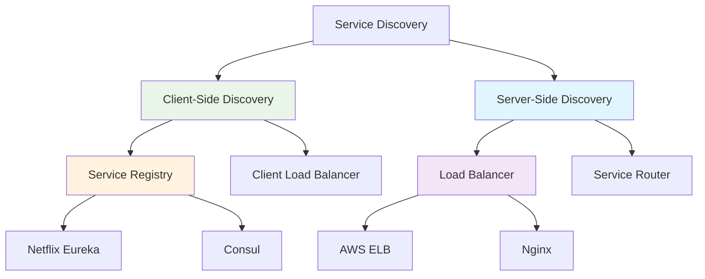

# System Design Fundamentals: Service Discovery

Service discovery enables microservices to dynamically locate and communicate with each other without hardcoding network locations.

## Service Discovery Patterns



## Service Registry Implementation

```go
// Service Registry Implementation
package main

import (
    "fmt"
    "sync"
    "time"
)

type ServiceInstance struct {
    ID          string
    ServiceName string
    Host        string
    Port        int
    Metadata    map[string]string
    Status      HealthStatus
    LastHeartbeat time.Time
    RegisteredAt  time.Time
}

type HealthStatus int

const (
    StatusHealthy HealthStatus = iota
    StatusUnhealthy
    StatusUnknown
)

func (s HealthStatus) String() string {
    switch s {
    case StatusHealthy:
        return "HEALTHY"
    case StatusUnhealthy:
        return "UNHEALTHY"
    default:
        return "UNKNOWN"
    }
}

type ServiceRegistry struct {
    services map[string]map[string]*ServiceInstance // serviceName -> instanceID -> instance
    mutex    sync.RWMutex
    ttl      time.Duration
}

func NewServiceRegistry(ttl time.Duration) *ServiceRegistry {
    sr := &ServiceRegistry{
        services: make(map[string]map[string]*ServiceInstance),
        ttl:      ttl,
    }
    
    // Start background health check
    go sr.healthCheckLoop()
    
    return sr
}

func (sr *ServiceRegistry) Register(instance *ServiceInstance) error {
    sr.mutex.Lock()
    defer sr.mutex.Unlock()
    
    if _, exists := sr.services[instance.ServiceName]; !exists {
        sr.services[instance.ServiceName] = make(map[string]*ServiceInstance)
    }
    
    instance.Status = StatusHealthy
    instance.LastHeartbeat = time.Now()
    instance.RegisteredAt = time.Now()
    
    sr.services[instance.ServiceName][instance.ID] = instance
    
    fmt.Printf("✅ Registered service: %s (ID: %s, Address: %s:%d)\n",
        instance.ServiceName, instance.ID, instance.Host, instance.Port)
    
    return nil
}

func (sr *ServiceRegistry) Deregister(serviceName, instanceID string) error {
    sr.mutex.Lock()
    defer sr.mutex.Unlock()
    
    if instances, exists := sr.services[serviceName]; exists {
        if _, found := instances[instanceID]; found {
            delete(instances, instanceID)
            
            fmt.Printf("🗑️  Deregistered service: %s (ID: %s)\n", serviceName, instanceID)
            
            if len(instances) == 0 {
                delete(sr.services, serviceName)
            }
            
            return nil
        }
    }
    
    return fmt.Errorf("service instance not found")
}

func (sr *ServiceRegistry) Heartbeat(serviceName, instanceID string) error {
    sr.mutex.Lock()
    defer sr.mutex.Unlock()
    
    if instances, exists := sr.services[serviceName]; exists {
        if instance, found := instances[instanceID]; found {
            instance.LastHeartbeat = time.Now()
            instance.Status = StatusHealthy
            
            return nil
        }
    }
    
    return fmt.Errorf("service instance not found")
}

func (sr *ServiceRegistry) GetInstances(serviceName string) []*ServiceInstance {
    sr.mutex.RLock()
    defer sr.mutex.RUnlock()
    
    instances := make([]*ServiceInstance, 0)
    
    if serviceInstances, exists := sr.services[serviceName]; exists {
        for _, instance := range serviceInstances {
            if instance.Status == StatusHealthy {
                instances = append(instances, instance)
            }
        }
    }
    
    return instances
}

func (sr *ServiceRegistry) GetAllServices() map[string]int {
    sr.mutex.RLock()
    defer sr.mutex.RUnlock()
    
    services := make(map[string]int)
    
    for serviceName, instances := range sr.services {
        healthyCount := 0
        for _, instance := range instances {
            if instance.Status == StatusHealthy {
                healthyCount++
            }
        }
        services[serviceName] = healthyCount
    }
    
    return services
}

func (sr *ServiceRegistry) healthCheckLoop() {
    ticker := time.NewTicker(5 * time.Second)
    defer ticker.Stop()
    
    for range ticker.C {
        sr.checkHealth()
    }
}

func (sr *ServiceRegistry) checkHealth() {
    sr.mutex.Lock()
    defer sr.mutex.Unlock()
    
    now := time.Now()
    
    for serviceName, instances := range sr.services {
        for instanceID, instance := range instances {
            // Check if instance has missed heartbeat
            if now.Sub(instance.LastHeartbeat) > sr.ttl {
                oldStatus := instance.Status
                instance.Status = StatusUnhealthy
                
                if oldStatus != StatusUnhealthy {
                    fmt.Printf("⚠️  Service unhealthy: %s (ID: %s) - missed heartbeat\n",
                        serviceName, instanceID)
                }
                
                // Remove if unhealthy for too long (2x TTL)
                if now.Sub(instance.LastHeartbeat) > sr.ttl*2 {
                    delete(instances, instanceID)
                    fmt.Printf("🗑️  Removed unhealthy service: %s (ID: %s)\n",
                        serviceName, instanceID)
                }
            }
        }
    }
}

func (sr *ServiceRegistry) PrintStatus() {
    sr.mutex.RLock()
    defer sr.mutex.RUnlock()
    
    fmt.Println("\n📊 Service Registry Status:")
    fmt.Printf("Total Services: %d\n\n", len(sr.services))
    
    for serviceName, instances := range sr.services {
        fmt.Printf("Service: %s (%d instances)\n", serviceName, len(instances))
        for _, instance := range instances {
            fmt.Printf("  - %s @ %s:%d [%s] (last heartbeat: %v ago)\n",
                instance.ID,
                instance.Host,
                instance.Port,
                instance.Status,
                time.Since(instance.LastHeartbeat).Round(time.Second))
        }
    }
    fmt.Println()
}
```

## Client-Side Service Discovery

```go
// Client-Side Service Discovery with Load Balancing
package main

import (
    "fmt"
    "hash/fnv"
    "math/rand"
    "sync/atomic"
)

type LoadBalancingStrategy int

const (
    RoundRobin LoadBalancingStrategy = iota
    Random
    LeastConnections
    IPHash
)

type ServiceDiscoveryClient struct {
    registry *ServiceRegistry
    strategy LoadBalancingStrategy
    counters map[string]*uint64 // For round-robin
    connections map[string]map[string]int // serviceName -> instanceID -> connections
    mutex    sync.RWMutex
}

func NewServiceDiscoveryClient(registry *ServiceRegistry, strategy LoadBalancingStrategy) *ServiceDiscoveryClient {
    return &ServiceDiscoveryClient{
        registry:    registry,
        strategy:    strategy,
        counters:    make(map[string]*uint64),
        connections: make(map[string]map[string]int),
    }
}

func (sdc *ServiceDiscoveryClient) DiscoverService(serviceName string, clientIP string) (*ServiceInstance, error) {
    instances := sdc.registry.GetInstances(serviceName)
    
    if len(instances) == 0 {
        return nil, fmt.Errorf("no healthy instances found for service: %s", serviceName)
    }
    
    var selected *ServiceInstance
    
    switch sdc.strategy {
    case RoundRobin:
        selected = sdc.selectRoundRobin(serviceName, instances)
    case Random:
        selected = sdc.selectRandom(instances)
    case LeastConnections:
        selected = sdc.selectLeastConnections(serviceName, instances)
    case IPHash:
        selected = sdc.selectIPHash(clientIP, instances)
    default:
        selected = instances[0]
    }
    
    fmt.Printf("🔍 Discovered service: %s -> %s:%d (strategy: %v)\n",
        serviceName, selected.Host, selected.Port, sdc.strategy)
    
    return selected, nil
}

func (sdc *ServiceDiscoveryClient) selectRoundRobin(serviceName string, instances []*ServiceInstance) *ServiceInstance {
    sdc.mutex.Lock()
    defer sdc.mutex.Unlock()
    
    if _, exists := sdc.counters[serviceName]; !exists {
        var counter uint64 = 0
        sdc.counters[serviceName] = &counter
    }
    
    counter := sdc.counters[serviceName]
    index := atomic.AddUint64(counter, 1) % uint64(len(instances))
    
    return instances[index]
}

func (sdc *ServiceDiscoveryClient) selectRandom(instances []*ServiceInstance) *ServiceInstance {
    index := rand.Intn(len(instances))
    return instances[index]
}

func (sdc *ServiceDiscoveryClient) selectLeastConnections(serviceName string, instances []*ServiceInstance) *ServiceInstance {
    sdc.mutex.Lock()
    defer sdc.mutex.Unlock()
    
    if _, exists := sdc.connections[serviceName]; !exists {
        sdc.connections[serviceName] = make(map[string]int)
    }
    
    minConnections := int(^uint(0) >> 1) // Max int
    var selected *ServiceInstance
    
    for _, instance := range instances {
        connections := sdc.connections[serviceName][instance.ID]
        
        if connections < minConnections {
            minConnections = connections
            selected = instance
        }
    }
    
    if selected == nil {
        selected = instances[0]
    }
    
    sdc.connections[serviceName][selected.ID]++
    
    return selected
}

func (sdc *ServiceDiscoveryClient) selectIPHash(clientIP string, instances []*ServiceInstance) *ServiceInstance {
    h := fnv.New32a()
    h.Write([]byte(clientIP))
    hash := h.Sum32()
    
    index := int(hash) % len(instances)
    return instances[index]
}

func (sdc *ServiceDiscoveryClient) ReleaseConnection(serviceName, instanceID string) {
    sdc.mutex.Lock()
    defer sdc.mutex.Unlock()
    
    if serviceConnections, exists := sdc.connections[serviceName]; exists {
        if serviceConnections[instanceID] > 0 {
            serviceConnections[instanceID]--
        }
    }
}
```

## Health Check System

```go
// Health Check System
package main

import (
    "context"
    "fmt"
    "net/http"
    "sync"
    "time"
)

type HealthChecker struct {
    registry        *ServiceRegistry
    checkInterval   time.Duration
    checkTimeout    time.Duration
    stopChan        chan struct{}
    wg              sync.WaitGroup
}

func NewHealthChecker(registry *ServiceRegistry, interval, timeout time.Duration) *HealthChecker {
    return &HealthChecker{
        registry:      registry,
        checkInterval: interval,
        checkTimeout:  timeout,
        stopChan:      make(chan struct{}),
    }
}

func (hc *HealthChecker) Start() {
    hc.wg.Add(1)
    go hc.run()
    
    fmt.Printf("🏥 Health checker started (interval: %v, timeout: %v)\n",
        hc.checkInterval, hc.checkTimeout)
}

func (hc *HealthChecker) Stop() {
    close(hc.stopChan)
    hc.wg.Wait()
    
    fmt.Println("🏥 Health checker stopped")
}

func (hc *HealthChecker) run() {
    defer hc.wg.Done()
    
    ticker := time.NewTicker(hc.checkInterval)
    defer ticker.Stop()
    
    for {
        select {
        case <-ticker.C:
            hc.checkAllServices()
        case <-hc.stopChan:
            return
        }
    }
}

func (hc *HealthChecker) checkAllServices() {
    services := hc.registry.GetAllServices()
    
    for serviceName := range services {
        instances := hc.registry.GetInstances(serviceName)
        
        for _, instance := range instances {
            go hc.checkInstance(instance)
        }
    }
}

func (hc *HealthChecker) checkInstance(instance *ServiceInstance) {
    ctx, cancel := context.WithTimeout(context.Background(), hc.checkTimeout)
    defer cancel()
    
    healthURL := fmt.Sprintf("http://%s:%d/health", instance.Host, instance.Port)
    
    req, err := http.NewRequestWithContext(ctx, "GET", healthURL, nil)
    if err != nil {
        hc.markUnhealthy(instance, err)
        return
    }
    
    resp, err := http.DefaultClient.Do(req)
    if err != nil {
        hc.markUnhealthy(instance, err)
        return
    }
    defer resp.Body.Close()
    
    if resp.StatusCode == http.StatusOK {
        hc.markHealthy(instance)
    } else {
        hc.markUnhealthy(instance, fmt.Errorf("unhealthy status: %d", resp.StatusCode))
    }
}

func (hc *HealthChecker) markHealthy(instance *ServiceInstance) {
    oldStatus := instance.Status
    instance.Status = StatusHealthy
    instance.LastHeartbeat = time.Now()
    
    if oldStatus != StatusHealthy {
        fmt.Printf("✅ Service recovered: %s (ID: %s)\n",
            instance.ServiceName, instance.ID)
    }
}

func (hc *HealthChecker) markUnhealthy(instance *ServiceInstance, err error) {
    oldStatus := instance.Status
    instance.Status = StatusUnhealthy
    
    if oldStatus != StatusUnhealthy {
        fmt.Printf("❌ Service unhealthy: %s (ID: %s) - %v\n",
            instance.ServiceName, instance.ID, err)
    }
}
```

## DNS-Based Service Discovery

```go
// DNS-Based Service Discovery
package main

import (
    "fmt"
    "net"
    "sync"
    "time"
)

type DNSServiceDiscovery struct {
    cache     map[string][]net.IP
    cacheTTL  time.Duration
    cacheTime map[string]time.Time
    mutex     sync.RWMutex
}

func NewDNSServiceDiscovery(cacheTTL time.Duration) *DNSServiceDiscovery {
    return &DNSServiceDiscovery{
        cache:     make(map[string][]net.IP),
        cacheTTL:  cacheTTL,
        cacheTime: make(map[string]time.Time),
    }
}

func (dsd *DNSServiceDiscovery) Resolve(serviceName string) ([]net.IP, error) {
    // Check cache
    if ips := dsd.getFromCache(serviceName); ips != nil {
        fmt.Printf("🔍 DNS cache hit: %s -> %v\n", serviceName, ips)
        return ips, nil
    }
    
    // Perform DNS lookup
    fmt.Printf("🔍 DNS lookup: %s\n", serviceName)
    
    ips, err := net.LookupIP(serviceName)
    if err != nil {
        return nil, fmt.Errorf("DNS lookup failed: %v", err)
    }
    
    // Update cache
    dsd.updateCache(serviceName, ips)
    
    fmt.Printf("✅ DNS resolved: %s -> %v\n", serviceName, ips)
    
    return ips, nil
}

func (dsd *DNSServiceDiscovery) getFromCache(serviceName string) []net.IP {
    dsd.mutex.RLock()
    defer dsd.mutex.RUnlock()
    
    if cacheTime, exists := dsd.cacheTime[serviceName]; exists {
        if time.Since(cacheTime) < dsd.cacheTTL {
            return dsd.cache[serviceName]
        }
    }
    
    return nil
}

func (dsd *DNSServiceDiscovery) updateCache(serviceName string, ips []net.IP) {
    dsd.mutex.Lock()
    defer dsd.mutex.Unlock()
    
    dsd.cache[serviceName] = ips
    dsd.cacheTime[serviceName] = time.Now()
}

func (dsd *DNSServiceDiscovery) InvalidateCache(serviceName string) {
    dsd.mutex.Lock()
    defer dsd.mutex.Unlock()
    
    delete(dsd.cache, serviceName)
    delete(dsd.cacheTime, serviceName)
    
    fmt.Printf("🗑️  Invalidated DNS cache: %s\n", serviceName)
}
```

## Service Mesh Integration

```go
// Service Mesh Discovery (Sidecar Pattern)
package main

import (
    "fmt"
    "sync"
)

type SidecarProxy struct {
    instanceID    string
    serviceName   string
    registry      *ServiceRegistry
    localCache    map[string][]*ServiceInstance
    cacheMutex    sync.RWMutex
    cacheValidity time.Duration
    lastUpdated   map[string]time.Time
}

func NewSidecarProxy(instanceID, serviceName string, registry *ServiceRegistry) *SidecarProxy {
    sp := &SidecarProxy{
        instanceID:    instanceID,
        serviceName:   serviceName,
        registry:      registry,
        localCache:    make(map[string][]*ServiceInstance),
        lastUpdated:   make(map[string]time.Time),
        cacheValidity: 10 * time.Second,
    }
    
    // Start cache refresh
    go sp.refreshCacheLoop()
    
    return sp
}

func (sp *SidecarProxy) GetService(targetService string) (*ServiceInstance, error) {
    // Check local cache
    instances := sp.getFromLocalCache(targetService)
    
    if len(instances) == 0 {
        // Refresh from registry
        instances = sp.registry.GetInstances(targetService)
        sp.updateLocalCache(targetService, instances)
    }
    
    if len(instances) == 0 {
        return nil, fmt.Errorf("no instances available for service: %s", targetService)
    }
    
    // Simple round-robin
    instance := instances[rand.Intn(len(instances))]
    
    fmt.Printf("🔗 Sidecar proxy [%s] routing to: %s @ %s:%d\n",
        sp.serviceName, targetService, instance.Host, instance.Port)
    
    return instance, nil
}

func (sp *SidecarProxy) getFromLocalCache(serviceName string) []*ServiceInstance {
    sp.cacheMutex.RLock()
    defer sp.cacheMutex.RUnlock()
    
    if lastUpdate, exists := sp.lastUpdated[serviceName]; exists {
        if time.Since(lastUpdate) < sp.cacheValidity {
            return sp.localCache[serviceName]
        }
    }
    
    return nil
}

func (sp *SidecarProxy) updateLocalCache(serviceName string, instances []*ServiceInstance) {
    sp.cacheMutex.Lock()
    defer sp.cacheMutex.Unlock()
    
    sp.localCache[serviceName] = instances
    sp.lastUpdated[serviceName] = time.Now()
}

func (sp *SidecarProxy) refreshCacheLoop() {
    ticker := time.NewTicker(5 * time.Second)
    defer ticker.Stop()
    
    for range ticker.C {
        sp.refreshAllCaches()
    }
}

func (sp *SidecarProxy) refreshAllCaches() {
    sp.cacheMutex.RLock()
    services := make([]string, 0, len(sp.localCache))
    for serviceName := range sp.localCache {
        services = append(services, serviceName)
    }
    sp.cacheMutex.RUnlock()
    
    for _, serviceName := range services {
        instances := sp.registry.GetInstances(serviceName)
        sp.updateLocalCache(serviceName, instances)
    }
}
```

## Complete Demo

```go
func main() {
    fmt.Println("🚀 Starting Service Discovery Demo\n")
    
    // 1. Create Service Registry
    fmt.Println("=== Service Registry ===")
    registry := NewServiceRegistry(15 * time.Second)
    
    // Register services
    registry.Register(&ServiceInstance{
        ID:          "user-service-1",
        ServiceName: "user-service",
        Host:        "192.168.1.10",
        Port:        8080,
        Metadata:    map[string]string{"version": "1.0", "region": "us-east"},
    })
    
    registry.Register(&ServiceInstance{
        ID:          "user-service-2",
        ServiceName: "user-service",
        Host:        "192.168.1.11",
        Port:        8080,
        Metadata:    map[string]string{"version": "1.0", "region": "us-west"},
    })
    
    registry.Register(&ServiceInstance{
        ID:          "order-service-1",
        ServiceName: "order-service",
        Host:        "192.168.1.20",
        Port:        8081,
        Metadata:    map[string]string{"version": "2.0"},
    })
    
    time.Sleep(1 * time.Second)
    registry.PrintStatus()
    
    // 2. Client-Side Service Discovery with Round-Robin
    fmt.Println("=== Client-Side Discovery (Round-Robin) ===")
    client := NewServiceDiscoveryClient(registry, RoundRobin)
    
    for i := 0; i < 5; i++ {
        instance, err := client.DiscoverService("user-service", "")
        if err != nil {
            fmt.Printf("Discovery failed: %v\n", err)
        } else {
            fmt.Printf("Request %d routed to: %s:%d\n", i+1, instance.Host, instance.Port)
        }
        time.Sleep(200 * time.Millisecond)
    }
    
    // 3. Client-Side Discovery with IP Hash
    fmt.Println("\n=== Client-Side Discovery (IP Hash) ===")
    clientIPHash := NewServiceDiscoveryClient(registry, IPHash)
    
    clientIPs := []string{"10.0.0.1", "10.0.0.2", "10.0.0.1"}
    for _, ip := range clientIPs {
        instance, _ := clientIPHash.DiscoverService("user-service", ip)
        fmt.Printf("Client %s -> %s:%d\n", ip, instance.Host, instance.Port)
    }
    
    // 4. Heartbeat Mechanism
    fmt.Println("\n=== Heartbeat Mechanism ===")
    
    // Simulate heartbeats
    go func() {
        ticker := time.NewTicker(3 * time.Second)
        defer ticker.Stop()
        
        for i := 0; i < 3; i++ {
            <-ticker.C
            registry.Heartbeat("user-service", "user-service-1")
            registry.Heartbeat("user-service", "user-service-2")
            registry.Heartbeat("order-service", "order-service-1")
            fmt.Println("💓 Heartbeats sent")
        }
    }()
    
    time.Sleep(10 * time.Second)
    
    // 5. Service Deregistration
    fmt.Println("\n=== Service Deregistration ===")
    registry.Deregister("user-service", "user-service-2")
    
    time.Sleep(1 * time.Second)
    registry.PrintStatus()
    
    // 6. Health Checker
    fmt.Println("=== Health Checker ===")
    healthChecker := NewHealthChecker(registry, 5*time.Second, 2*time.Second)
    healthChecker.Start()
    
    time.Sleep(6 * time.Second)
    healthChecker.Stop()
    
    // 7. Sidecar Proxy
    fmt.Println("\n=== Sidecar Proxy ===")
    sidecar := NewSidecarProxy("app-1", "frontend-service", registry)
    
    for i := 0; i < 3; i++ {
        sidecar.GetService("user-service")
        time.Sleep(500 * time.Millisecond)
    }
    
    // Final status
    fmt.Println("\n=== Final Registry Status ===")
    services := registry.GetAllServices()
    fmt.Printf("Total Services: %d\n", len(services))
    for serviceName, count := range services {
        fmt.Printf("  %s: %d healthy instances\n", serviceName, count)
    }
    
    fmt.Println("\n✅ Demo completed!")
}
```

## Service Discovery Patterns Comparison

| Pattern | Pros | Cons | Use Case |
|---------|------|------|----------|
| **Client-Side** | No single point of failure, lower latency | Client complexity, version management | Microservices with smart clients |
| **Server-Side** | Simple clients, centralized logic | Load balancer as bottleneck | Simple clients, centralized control |
| **DNS** | Standard protocol, simple | Limited metadata, caching issues | Legacy systems, simple setups |
| **Service Mesh** | Advanced features, observability | Infrastructure complexity | Large-scale microservices |

## Best Practices

### 1. Implement Health Checks
```go
// HTTP health endpoint
func healthHandler(w http.ResponseWriter, r *http.Request) {
    // Check dependencies
    if db.Ping() != nil {
        w.WriteHeader(http.StatusServiceUnavailable)
        return
    }
    
    w.WriteHeader(http.StatusOK)
    json.NewEncoder(w).Encode(map[string]string{
        "status": "healthy",
        "version": "1.0.0",
    })
}
```

### 2. Cache Service Locations
```go
// Cache with TTL
cache := NewServiceCache(30 * time.Second)
instances := cache.GetOrRefresh("user-service", func() []*ServiceInstance {
    return registry.GetInstances("user-service")
})
```

### 3. Handle Failures Gracefully
```go
// Retry with exponential backoff
func discoverWithRetry(client *ServiceDiscoveryClient, serviceName string) (*ServiceInstance, error) {
    for i := 0; i < 3; i++ {
        instance, err := client.DiscoverService(serviceName, "")
        if err == nil {
            return instance, nil
        }
        
        time.Sleep(time.Duration(math.Pow(2, float64(i))) * time.Second)
    }
    
    return nil, fmt.Errorf("service discovery failed after retries")
}
```

## Conclusion

Service discovery is essential for:
- **Dynamic service location** in microservices
- **Load distribution** across instances
- **Automatic failover** when services fail
- **Zero-downtime deployments**

Choose client-side for control, server-side for simplicity, or service mesh for advanced features.