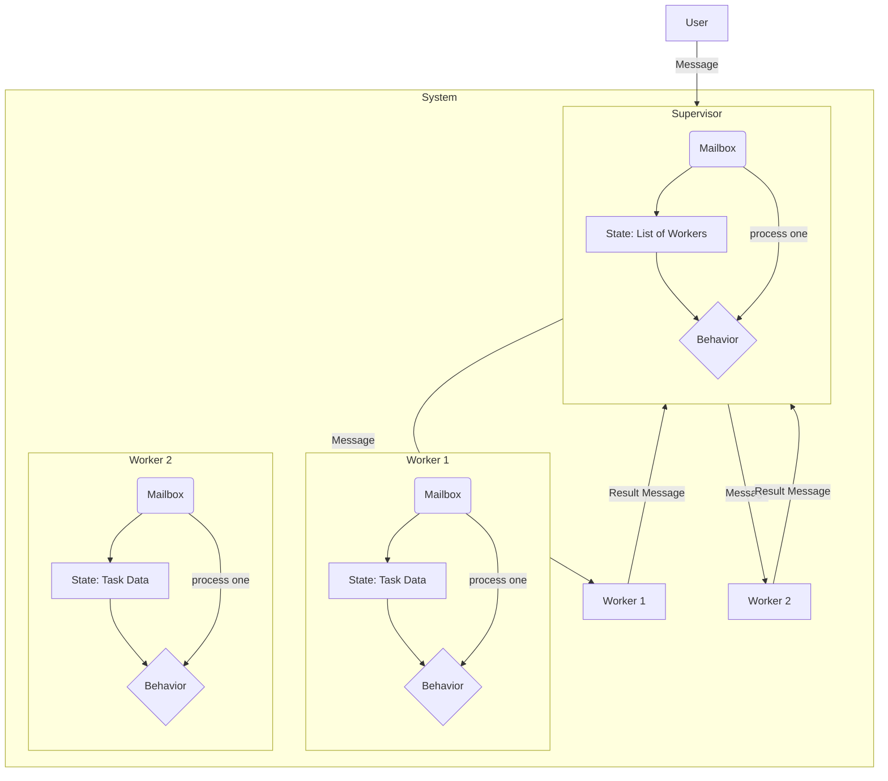

## System Design: The Actor Model of Concurrency

Most mainstream concurrency models are based on shared memory. Multiple threads or goroutines access the same data, and we use synchronization primitives like mutexes and locks to prevent them from corrupting that data. This approach, while powerful, is fraught with peril: race conditions, deadlocks, and complex reasoning about memory access.

The **Actor Model** proposes a fundamentally different approach to concurrency. Instead of sharing memory, it relies on message passing. It's a conceptual model for building concurrent systems based on a few simple principles:

1.  **Everything is an Actor:** An actor is the fundamental unit of computation. It's a lightweight process that encapsulates both state and behavior.
2.  **Isolated State:** An actor's internal state is private and can never be accessed directly by another actor. This is the "share memory by communicating" philosophy, the inverse of traditional models.
3.  **Asynchronous Message Passing:** Actors communicate exclusively by sending and receiving asynchronous messages. When an actor receives a message, it can do one of three things:
    -   Create more actors.
    -   Send messages to other actors.
    -   Change its own internal state.

This model was pioneered by languages like Erlang and is the foundation for highly reliable, distributed systems like telephone switches and messaging platforms (e.g., WhatsApp).

### The Core Components of an Actor

-   **State:** The private variables and data that the actor protects.
-   **Behavior:** The code that defines how the actor reacts to incoming messages.
-   **Mailbox:** A queue where incoming messages are stored before the actor processes them. An actor processes messages from its mailbox one at a time, sequentially.

This "one message at a time" processing is key. Since an actor only ever does one thing at a time, and its state is never touched by anyone else, there is no need for locks or mutexes within the actor itself. Concurrency is achieved by having many actors running at once, all communicating via messages.

### Visualizing Actor Communication

Imagine a system where a `Supervisor` actor manages several `Worker` actors.


In this diagram, the `User` sends a message to the `Supervisor`. The `Supervisor` processes this message and decides to delegate the work by sending messages to `Worker 1` and `Worker 2`. The workers process their messages independently and send their results back to the `Supervisor`. All communication is asynchronous, and no actor ever directly accesses another's state.

### Implementing the Actor Model in Go

While Go's primary concurrency model is based on CSP (Communicating Sequential Processes) with goroutines and channels, it's perfectly suited for implementing the actor model.

-   A **goroutine** can represent the actor's running process.
-   A **channel** can serve as the actor's mailbox.
-   The actor's **state** can be encapsulated within the goroutine's function closure.

Here is a conceptual example of a "counter" actor in Go.

```go
package main

import (
	"fmt"
	"sync"
	"time"
)

// --- Message Types ---
// We use structs to define the messages our actor can receive.
type GetCountMsg struct {
	Response chan int
}

type IncrementMsg struct {
	Amount int
}

// --- The Actor ---

// CounterActor is a struct that holds the actor's mailbox channel.
type CounterActor struct {
	mailbox chan interface{}
}

// NewCounterActor creates and starts a new counter actor.
func NewCounterActor(initialState int) *CounterActor {
	actor := &CounterActor{
		mailbox: make(chan interface{}, 100), // Buffered channel for the mailbox
	}

	// The main actor loop runs in its own goroutine.
	go actor.run(initialState)

	return actor
}

// The run method is the heart of the actor. It's an infinite loop
// that processes messages from the mailbox sequentially.
func (actor *CounterActor) run(state int) {
	for msg := range actor.mailbox {
		switch m := msg.(type) {
		case IncrementMsg:
			// When we get an IncrementMsg, we update our internal state.
			state += m.Amount
			fmt.Printf("Actor state incremented. New state: %d\n", state)

		case GetCountMsg:
			// When we get a GetCountMsg, we send the current state
			// back on the response channel provided by the caller.
			m.Response <- state
		
		case "stop":
			// A message to terminate the actor.
			close(actor.mailbox)
			return
		}
	}
}

// --- Public Methods to Interact with the Actor ---

func (actor *CounterActor) Increment(amount int) {
	// To interact, we send a message to the mailbox. This is asynchronous.
	actor.mailbox <- IncrementMsg{Amount: amount}
}

func (actor *CounterActor) GetCount() int {
	// For messages that need a response, we include a channel for the reply.
	responseChan := make(chan int)
	actor.mailbox <- GetCountMsg{Response: responseChan}
	
	// We then block, waiting for the actor to send the response.
	return <-responseChan
}

func (actor *CounterActor) Stop() {
	actor.mailbox <- "stop"
}


func main() {
	counter := NewCounterActor(0)
	defer counter.Stop()

	var wg sync.WaitGroup
	wg.Add(2)

	// Goroutine 1: Increments the counter
	go func() {
		defer wg.Done()
		for i := 0; i < 5; i++ {
			counter.Increment(1)
			time.Sleep(100 * time.Millisecond)
		}
	}()

	// Goroutine 2: Reads the counter value
	go func() {
		defer wg.Done()
		for i := 0; i < 5; i++ {
			fmt.Printf("Reading count: %d\n", counter.GetCount())
			time.Sleep(200 * time.Millisecond)
		}
	}()

	wg.Wait()
	fmt.Printf("\nFinal count: %d\n", counter.GetCount())
}
```
In this example, the `state` variable is completely confined to the `run` goroutine. The only way to modify or read it is by sending messages. This eliminates the need for mutexes and makes reasoning about the state much simpler.

### Benefits of the Actor Model

-   **No Race Conditions or Deadlocks:** By avoiding shared state and locks, the most common concurrency bugs are eliminated by design.
-   **High Scalability:** Since actors are independent and don't block each other, systems built with them can scale massively across many CPU cores.
-   **Fault Tolerance:** The model lends itself well to building fault-tolerant systems. A "supervisor" actor can monitor other actors and restart them if they fail, without bringing down the whole system. This is a cornerstone of Erlang's famous "nine nines" (99.9999999%) reliability.
-   **Location Transparency:** Because all communication is via messages, it doesn't matter if an actor is in the same process, on a different machine, or across the world. This makes it a natural fit for distributed systems.

### Conclusion

The Actor Model provides a powerful and robust alternative to shared-memory concurrency. By encapsulating state and enforcing communication through asynchronous messages, it forces a discipline that eliminates entire classes of concurrency bugs. While not the default model in mainstream languages like Go, its principles can be implemented to build highly concurrent, scalable, and fault-tolerant systems. It encourages you to think about concurrency not in terms of shared data, but in terms of independent entities collaborating through a clean, message-based protocol.
---
