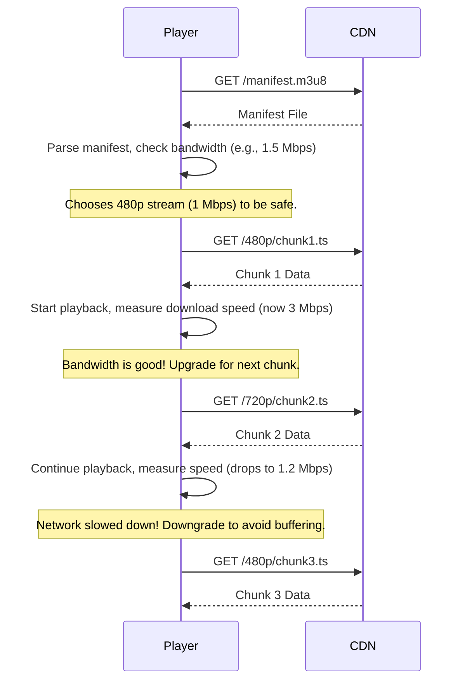

Have you ever watched a YouTube or Netflix video where the quality suddenly drops for a few seconds and then becomes crystal clear again? That's not a bug; it's a feature. This seamless adjustment is the magic of **Adaptive Bitrate Streaming (ABR)**, the core technology that enables smooth, buffer-free video playback across a wide range of devices and network conditions.

ABR is the solution to a fundamental problem: how do you deliver the best possible video quality to every user when you have no control over their device, screen size, or internet speed? The answer is to not send a single video stream, but to offer a menu of options and let the client choose the best one for itself, moment by moment.

### The Problem: One Size Fits None

Imagine you have a high-quality 4K video file.
*   If you send this massive file to a user on a smartphone with a slow 3G connection, they will spend most of their time staring at a buffering icon.
*   If you send a low-quality 360p file to a user with a gigabit fiber connection and a 4K TV, they will be disappointed by the blurry, pixelated image.

The "one size fits all" approach fails everyone. ABR solves this by creating multiple versions of the source video and letting the player intelligently switch between them.

### How Adaptive Bitrate Streaming Works

The ABR process involves two main stages: **server-side preparation (transcoding)** and **client-side logic (the player)**.

#### 1. Server-Side: Preparing the Video Content

As discussed in the video streaming architecture, the process starts with transcoding. For ABR, this involves two key steps:

**A) Encoding into Multiple Bitrates and Resolutions**
The original high-quality source video is encoded into several different versions, called "renditions" or "representations." Each rendition has a different bitrate (the amount of data used to represent one second of video) and often a different resolution.

A typical set of renditions might look like this:
*   1920x1080 (1080p) at 5 Mbps (for high-speed connections)
*   1280x720 (720p) at 2.5 Mbps
*   854x480 (480p) at 1 Mbps
*   640x360 (360p) at 500 Kbps (for slow mobile networks)

**B) Chunking the Video**
Each of these renditions is then broken down into small, independent video segments or "chunks," typically 2 to 10 seconds in length.

**C) Creating a Manifest File**
Finally, a **manifest file** is generated. This is a small text file that acts as a table of contents for the video. It contains metadata about all the available renditions and the URLs for each corresponding video chunk.
*   For **HLS (HTTP Live Streaming)**, this is the `.m3u8` file.
*   For **DASH (Dynamic Adaptive Streaming over HTTP)**, this is the `.mpd` file.

**Visualizing the Prepared Content:**
```mermaid
graph TD
    Source[Source Video<br/>(4K, 50 Mbps)] --> Transcoder{Transcoding Engine}

    subgraph Renditions
        R1[1080p @ 5Mbps]
        R2[720p @ 2.5Mbps]
        R3[480p @ 1Mbps]
    end

    Transcoder --> R1 & R2 & R3

    subgraph Chunking
        C1[1080p Chunks<br/>(c1.ts, c2.ts, ...)]
        C2[720p Chunks<br/>(c1.ts, c2.ts, ...)]
        C3[480p Chunks<br/>(c1.ts, c2.ts, ...)]
    end

    R1 --> C1
    R2 --> C2
    R3 --> C3

    Manifest[Manifest File<br/>(playlist.m3u8)]

    Transcoder --> Manifest
    C1 & C2 & C3 -- "Listed in" --> Manifest
```

#### 2. Client-Side: The Intelligent Video Player

All the magic of ABR happens in the video player running on the user's device (in the browser or a native app).

**The Playback Logic:**
1.  **Fetch the Manifest**: The player's first action is to download the manifest file.
2.  **Initial Assessment**: The player analyzes the manifest to see all available quality levels. It then measures the user's current network bandwidth.
3.  **Choose the First Chunk**: Based on the initial bandwidth measurement, the player makes a conservative choice. It might start by requesting the first chunk of a medium-quality stream (e.g., 480p) to ensure playback starts quickly.
4.  **Download and Play**: The player downloads the first few chunks, buffers them, and starts playing the video.
5.  **Monitor and Adapt**: This is the core ABR loop. While the video is playing, the player is constantly doing two things in the background:
    *   **Measuring Throughput**: It calculates the actual download speed based on how long it took to download the last few chunks.
    *   **Monitoring Buffer Health**: It keeps an eye on how many seconds of video it has buffered ahead of the current playback position.
6.  **The Switching Decision**: Before requesting the next chunk, the player uses this information to make a decision:
    *   **Upgrade**: "My bandwidth is high, and the buffer is full. I can safely switch to a higher quality stream (e.g., 720p) for the next chunk."
    *   **Downgrade**: "My bandwidth has dropped, and the buffer is draining. I must switch to a lower quality stream (e.g., 360p) immediately to avoid a stall."
    *   **Stay**: "Conditions are stable. I'll continue downloading chunks from the current quality level."

This process repeats for every single chunk, allowing the player to adapt to changing network conditions in near real-time.

**Sequence Diagram of ABR in Action:**


### Key Benefits of ABR

*   **Improved User Experience**: Drastically reduces buffering and playback stalls.
*   **Quicker Start Time**: The player can start with a low-quality segment to begin playback almost instantly, then ramp up the quality.
*   **Optimized for Everyone**: Delivers the best possible quality for each user's specific context.
*   **Efficient Bandwidth Usage**: Avoids sending unnecessarily high-quality video to devices that can't display it or networks that can't handle it.

### Go Example: Generating an HLS Manifest

While transcoding itself is a heavy process often done with tools like FFmpeg, we can use Go to generate the `.m3u8` manifest file. This example shows how to create a simple manifest for a video with three different quality levels.

```go
package main

import (
    "fmt"
    "log"
    "os"
    "strings"
)

// Rendition represents a specific quality level of the video.
type Rendition struct {
    Bandwidth  int    // in bits per second
    Resolution string // e.g., "1920x1080"
    Playlist   string // filename of the sub-playlist
}

// generateMasterManifest creates the main .m3u8 file that points to the individual stream playlists.
func generateMasterManifest(renditions []Rendition) string {
    var builder strings.Builder

    // HLS manifest header
    builder.WriteString("#EXTM3U\n")
    builder.WriteString("#EXT-X-VERSION:3\n")

    // For each rendition, add a stream info tag and the playlist URL
    for _, r := range renditions {
        builder.WriteString(fmt.Sprintf("#EXT-X-STREAM-INF:BANDWIDTH=%d,RESOLUTION=%s\n", r.Bandwidth, r.Resolution))
        builder.WriteString(fmt.Sprintf("%s\n", r.Playlist))
    }

    return builder.String()
}

// generateMediaPlaylist creates a sub-playlist for a specific rendition's chunks.
func generateMediaPlaylist(chunkDuration float64, numChunks int) string {
    var builder strings.Builder

    builder.WriteString("#EXTM3U\n")
    builder.WriteString("#EXT-X-VERSION:3\n")
    builder.WriteString(fmt.Sprintf("#EXT-X-TARGETDURATION:%.0f\n", chunkDuration))
    builder.WriteString("#EXT-X-MEDIA-SEQUENCE:0\n")

    for i := 0; i < numChunks; i++ {
        builder.WriteString(fmt.Sprintf("#EXTINF:%.3f,\n", chunkDuration))
        builder.WriteString(fmt.Sprintf("chunk_%03d.ts\n", i))
    }

    builder.WriteString("#EXT-X-ENDLIST\n")
    return builder.String()
}

func main() {
    // Define the renditions we created during transcoding
    renditions := []Rendition{
        {Bandwidth: 5000000, Resolution: "1920x1080", Playlist: "1080p.m3u8"},
        {Bandwidth: 2500000, Resolution: "1280x720", Playlist: "720p.m3u8"},
        {Bandwidth: 1000000, Resolution: "854x480", Playlist: "480p.m3u8"},
    }

    // Generate the master manifest
    masterManifestContent := generateMasterManifest(renditions)
    err := os.WriteFile("master.m3u8", []byte(masterManifestContent), 0644)
    if err != nil {
        log.Fatalf("Failed to write master manifest: %v", err)
    }
    fmt.Println("Generated master.m3u8:")
    fmt.Println(masterManifestContent)

    // Generate a media playlist for one of the renditions (e.g., 1080p)
    // Assuming 10-second chunks for a 5-minute (300-second) video
    mediaPlaylistContent := generateMediaPlaylist(10.0, 30)
    err = os.WriteFile("1080p.m3u8", []byte(mediaPlaylistContent), 0644)
    if err != nil {
        log.Fatalf("Failed to write media playlist: %v", err)
    }
    fmt.Println("\nGenerated 1080p.m3u8:")
    fmt.Println(mediaPlaylistContent)
}
```

### Conclusion

Adaptive Bitrate Streaming is a cornerstone of modern media delivery. By shifting the decision-making logic to the client, it creates a resilient and user-friendly viewing experience that gracefully handles the unpredictability of the internet. The server's job is to prepare a comprehensive "menu" of video renditions and chunks, and the player's job is to act as an intelligent diner, ordering the best possible "meal" chunk by chunk based on its current appetite (bandwidth). This client-driven approach is what makes high-quality, buffer-free streaming a reality for millions of users worldwide.