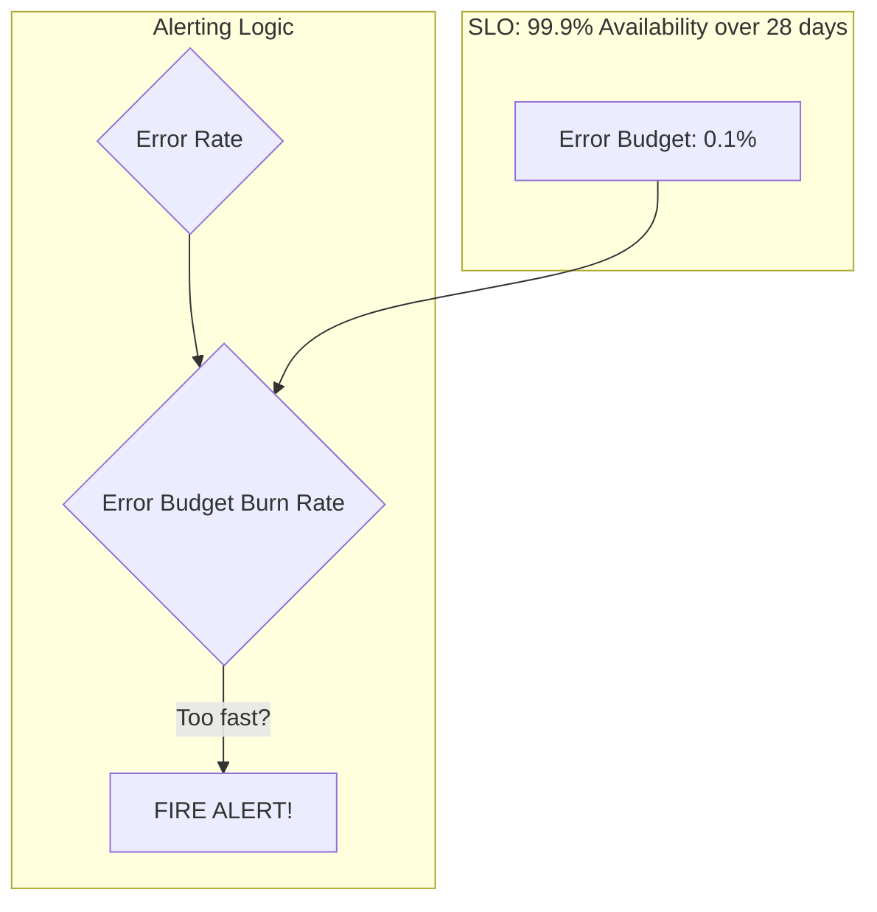

## System Design: Effective Alerting Strategies to Avoid Fatigue

In the world of observability, collecting metrics, logs, and traces is only half the battle. The data is useless if it doesn't empower you to act. **Alerting** is the mechanism that turns observability data into action, notifying you when your system is unhealthy or is about to become unhealthy.

However, poorly designed alerting can be worse than no alerting at all. A constant stream of noisy, irrelevant, or unactionable alerts leads to **alert fatigue**—a state where engineers become desensitized and start ignoring notifications, including the critical ones.

Effective alerting is not about monitoring everything; it's about monitoring the *right* things. It's about creating high-signal, low-noise alerts that are directly tied to user experience.

### The Problem with Traditional Alerting

A common but flawed approach is to set simple static thresholds on resource metrics. For example:
-   "Alert me if CPU utilization is above 90% for 5 minutes."
-   "Alert me if memory usage is above 85%."

Why is this problematic?
-   **It's not tied to user impact.** Is a high CPU actually affecting users? A batch processing service might run at 100% CPU by design, and this would be a false positive. Conversely, a service could be failing all requests due to a bug while its CPU usage remains low.
-   **It's not actionable.** What should an on-call engineer *do* at 3 AM when the CPU is at 91%? If the system is still serving users correctly, the answer is often "nothing." This is a classic noisy alert.

### A Better Approach: Symptom-Based Alerting with SLOs

Modern Site Reliability Engineering (SRE) practices advocate for **symptom-based alerting**. Instead of alerting on a *cause* (like high CPU), you alert on a *symptom* of user pain. The most effective way to define user pain is through **Service Level Objectives (SLOs)** and **Service Level Indicators (SLIs)**.

-   **Service Level Indicator (SLI):** A quantitative measure of some aspect of your service. It's what you measure.
    -   *Example:* The percentage of successful HTTP requests (availability).
    -   *Example:* The percentage of requests that complete in under 300ms (latency).

-   **Service Level Objective (SLO):** A target value or range for an SLI over a specific period. It's the goal you want to achieve.
    -   *Example:* 99.9% of HTTP requests will be successful over a rolling 28-day period.
    -   *Example:* 99% of homepage requests will be served in under 300ms over a rolling 28-day period.

-   **Error Budget:** The inverse of your SLO. If your availability SLO is 99.9%, your error budget is 0.1%. This budget represents the acceptable amount of failure. You can "spend" this budget on risky deployments, planned maintenance, or unavoidable failures.

**Alerting on SLOs means you alert when your error budget is burning too quickly.**



An alert based on error budget burn rate might sound like this:
> "If we continue to burn our error budget at the current rate, we will violate our 28-day availability SLO in just 2 days."

This is a powerful alert. It's directly tied to user impact (the SLO) and creates a sense of urgency and clarity. It tells the on-call engineer *why* they need to act.

### Designing Actionable Alerts

An alert should be a notification that a human needs to do something *right now*. Every alert should answer three questions:
1.  **What is broken?** (The system or feature that is impacted).
2.  **What is the impact?** (How are users being affected? e.g., "5% of users are seeing 500 errors on checkout").
3.  **What should I do?** (Link to a playbook or runbook with diagnostic steps).

A good alert notification might look like this:
```
[CRITICAL] High Error Rate on Checkout Service

- What: The checkout service is returning 5xx errors for 5% of requests over the last 15 minutes.
- Impact: Users are unable to complete purchases. We are burning our monthly error budget at a rate that will exhaust it in 4 hours.
- Playbook: https://internal-wiki.com/runbooks/checkout-service-errors
```

### Alert Levels: Not Everything is a 3 AM Pager-Storm

Not all issues require immediate, urgent attention. Categorizing alerts by severity is crucial for avoiding fatigue.

-   **Level 1: Page / Critical Alert**
    -   **Meaning:** User-visible, system-wide impact is happening *now* or is imminent. Requires immediate human intervention.
    -   **Example:** The site is down. The error budget will be exhausted in the next 6 hours.
    -   **Action:** Page the on-call engineer. This should wake someone up.

-   **Level 2: Ticket / Warning Alert**
    -   **Meaning:** The system is degraded, or a trend is developing that could lead to a critical issue, but it doesn't require an immediate fix.
    -   **Example:** A database's disk space will be full in 7 days. The error budget will be exhausted in 3-4 days.
    -   **Action:** Automatically create a ticket in a system like Jira or ServiceNow. This should be reviewed during business hours.

-   **Level 3: Log / Info**
    -   **Meaning:** An event occurred that might be of interest but is not an issue.
    -   **Example:** A deployment finished successfully. A non-critical service restarted.
    -   **Action:** Just log it. No notification needed.

### Conclusion

Effective alerting is a discipline. It requires moving away from simple, noisy resource-based thresholds and embracing a user-centric approach based on SLOs and error budgets. By focusing on symptoms rather than causes, creating actionable notifications, and using tiered alert levels, you can build a monitoring system that your team trusts. The goal is not to eliminate all problems but to ensure that when an engineer is woken up at 3 AM, it's for a problem that truly matters and one they are empowered to solve.
---
