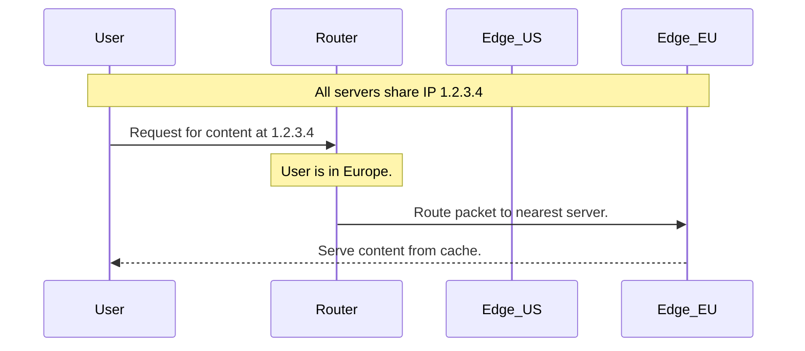

## System Design: The Magic of Anycast Routing

Imagine you could announce a single IP address from multiple locations around the world, and the internet would automatically figure out how to send each user's traffic to the location closest to them. This isn't magic; it's **Anycast**.

Anycast is a powerful networking and routing method where the same IP address is advertised from two or more different servers, typically in geographically separate locations. The network infrastructure then takes care of routing a user's request to the "nearest" server that is advertising that IP.

### Unicast vs. Anycast

To understand Anycast, let's first look at the standard model of the internet: **Unicast**.
-   **Unicast:** One IP address corresponds to one specific server. There is a one-to-one relationship. Every packet sent to that IP goes to that single destination.

**Anycast** breaks this model.
-   **Anycast:** One IP address corresponds to a group of servers. There is a one-to-many relationship. Packets sent to that IP are routed to just one of the servers in the group—whichever one is "closest" from the network's perspective.

The "closest" is determined by the Border Gateway Protocol (BGP), the routing protocol of the internet. BGP routers choose the path with the fewest network "hops" or the shortest autonomous system (AS) path.

```mermaid
graph TD
    subgraph Unicast
        U1(User) --> S1[Server (1.1.1.1)]
        U2(User) --> S1
    end

    subgraph Anycast
        U_EU[User in Europe] --> R_EU(EU Router)
        U_US[User in USA] --> R_US(US Router)

        R_EU -- "Shortest path to 2.2.2.2" --> Any_EU[Server in EU (2.2.2.2)]
        R_US -- "Shortest path to 2.2.2.2" --> Any_US[Server in USA (2.2.2.2)]
        
        Any_AS[Server in Asia (2.2.2.2)]
    end
```
In the Anycast diagram, servers in the EU, USA, and Asia all share the IP `2.2.2.2`. The internet's routing fabric automatically directs the European user to the EU server and the US user to the US server because each is the "closest" destination for them.

### How is Anycast Different from GSLB?

Anycast and [Global Server Load Balancing (GSLB)](/blog/system-design/system-design-global-server-load-balancing-gslb) both aim to direct users to the best server, but they operate at different layers.

-   **GSLB is a DNS-level solution.** It gives different users different IP addresses based on logic at the DNS server (e.g., the user's location). The intelligence is at the application layer (DNS).
-   **Anycast is a network-level solution.** It gives every user the *same* IP address. The intelligence is built into the internet's routing protocol (BGP), which finds the most efficient path to that IP.

| Feature      | GSLB (DNS-based)                               | Anycast (BGP-based)                                |
|--------------|------------------------------------------------|----------------------------------------------------|
| **Layer**    | Application Layer (DNS)                        | **Network Layer** (IP/BGP)                         |
| **Decision** | DNS server decides which IP to give the user.  | **Routers decide** the best path to a single IP.   |
| **IP Address**| Different users get different IPs.             | All users get the **same IP**.                     |

### Key Use Cases for Anycast

Anycast is exceptionally well-suited for services that are stateless and widely distributed.

#### 1. DNS Services

This is the most common and critical use case. Root DNS servers, the backbone of the internet's DNS, use Anycast. When your computer needs to resolve a domain, it queries a root server. Thanks to Anycast, your request automatically goes to a nearby root server replica, making DNS lookups incredibly fast and resilient.

Many public DNS resolvers, like Cloudflare's `1.1.1.1` and Google's `8.8.8.8`, are Anycast addresses. This is why you can use the same simple IP address no matter where you are in the world and still get a fast response.

#### 2. Content Delivery Networks (CDNs)

CDNs use Anycast to route users to the nearest edge server (Point of Presence - PoP). When a user requests a static asset (like an image or CSS file) from a CDN, their request is sent to the Anycast IP of the CDN. BGP routes the request to the closest PoP, which can then serve the content from its cache, dramatically reducing latency.



#### 3. DDoS Mitigation

Anycast is a powerful tool for absorbing and mitigating Distributed Denial of Service (DDoS) attacks. An attacker trying to flood an Anycast IP with traffic will find their attack traffic is distributed across all the locations advertising that IP.

Instead of a single server or data center having to withstand the entire attack, the load is spread globally. Each individual location only has to handle a fraction of the attack traffic, making it much harder for the attacker to overwhelm the service.

### Advantages of Anycast

-   **Lower Latency:** By automatically routing users to the nearest server, Anycast reduces the round-trip time (RTT), resulting in a faster, more responsive user experience.
-   **Improved Availability and Resilience:** If one server or data center goes down, BGP automatically re-routes traffic to the next-closest healthy server. This failover is transparent to the user and happens at the network level.
-   **Simplified Configuration:** Users and applications only need to know a single IP address. There's no need for different configurations for different regions.
-   **Load Distribution:** It naturally distributes traffic based on geographic user density, helping to prevent hotspots.

### Disadvantages and Challenges

-   **Stateless Applications Required:** Anycast is not suitable for stateful applications (like a typical database connection). Because network conditions can change, a user's route to the Anycast IP could suddenly shift mid-session to a different server. If the session state is stored on the first server, it will be lost. This is why it's perfect for stateless services like DNS and static content caching.
-   **Complex to Implement and Debug:** Setting up and managing BGP peering to announce Anycast IPs requires significant networking expertise and cooperation with ISPs. Debugging routing issues can be very difficult, as you can't easily "ping" a specific server—you can only ping the closest one.
-   **No Application-Level Control:** The routing decisions are made by BGP, not your application. You can't use application-level logic (like user identity or device type) to influence routing, which is something GSLB can do.

### Conclusion

Anycast is a foundational technology of the modern internet that enables speed, resilience, and massive scale for global services. By cleverly using a one-to-many mapping of a single IP address, it allows network routers to do what they do best: find the most efficient path. While it's not a solution for every problem, its impact is felt every time you resolve a domain name or load content from a global CDN. For stateless, distributed services, Anycast provides an elegant and powerful method for directing traffic and delivering a superior user experience.
---
