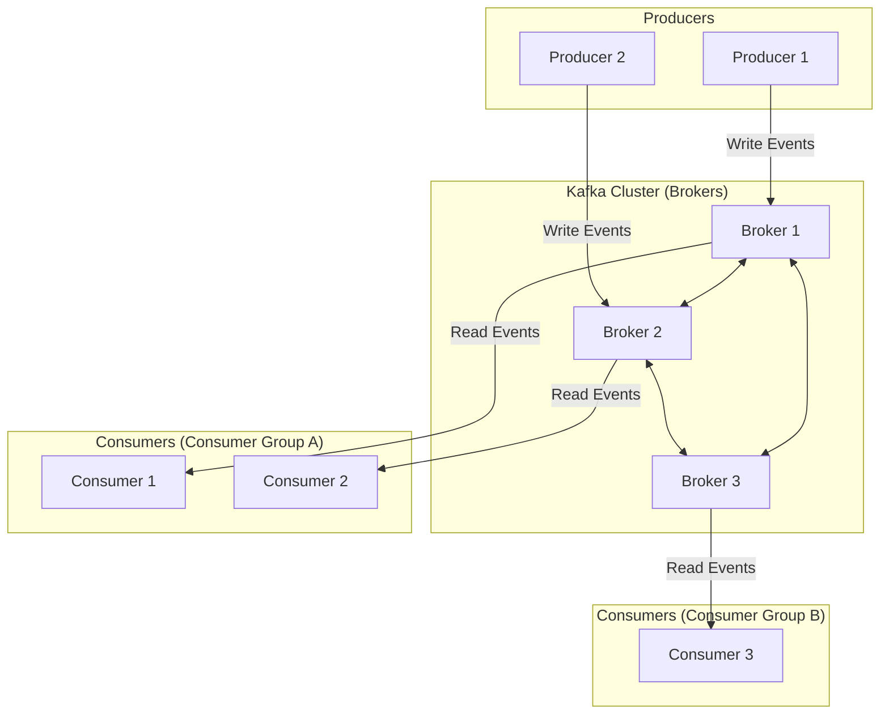

## Introduction: The King of Event Streaming

Apache Kafka is more than just a message queue; it's a distributed event streaming platform. Originally developed at LinkedIn to handle high-throughput activity data, it has become the backbone of thousands of companies for building real-time data pipelines and streaming applications.

What makes Kafka so powerful is its unique architecture, which is designed from the ground up for scalability, durability, and high performance. To understand Kafka, you need to understand its core components and how they work together.

## Core Components of Kafka

At its heart, Kafka has a simple, elegant architecture consisting of Producers, Consumers, and Brokers.



Let's break down the key concepts.

### 1. Topics, Partitions, and Offsets

*   **Topic:** A topic is a logical category or feed name to which records are published. For example, you might have a `user_clicks` topic or a `payments` topic.
*   **Partition:** A topic is split into multiple **partitions**. A partition is an ordered, immutable sequence of records. Partitions are the fundamental unit of parallelism in Kafka. Each partition can be hosted on a different server, allowing a topic's data to be spread across the cluster.
*   **Offset:** Each record within a partition is assigned a sequential ID number called an **offset**. This offset uniquely identifies a record within its partition.

This partitioned structure is Kafka's secret to scalability. It allows multiple consumers to read from a topic in parallel, with each consumer responsible for one or more partitions.

### 2. The Commit Log

The most fundamental concept in Kafka is the **distributed commit log**. Each partition is essentially a log file. When a producer publishes a record to a topic, it is appended to the end of one of the topic's partitions.

This append-only log structure is extremely fast. Data is written sequentially to disk, which is much more efficient than random-access writes. Records in the log are retained for a configurable amount of time (e.g., 7 days) or until a size limit is reached, regardless of whether they have been consumed.

### 3. Brokers

A Kafka cluster is composed of one or more servers called **brokers**. Each broker hosts a set of partitions. To ensure fault tolerance, Kafka replicates partitions across multiple brokers.

*   **Leader and Followers:** For each partition, one broker is elected as the **leader**. The leader handles all read and write requests for that partition. The other brokers that host replicas of the partition are called **followers**.
*   **Replication:** Followers passively replicate the leader's log. If the leader fails, one of the followers is automatically promoted to be the new leader. This ensures that there is no data loss and the system remains available.

### 4. Producers

Producers are client applications that write (publish) events to Kafka topics. The producer is responsible for choosing which partition to send a record to. This can be done in a few ways:
*   **Round-Robin:** The producer cycles through the partitions.
*   **Key-Based:** If a record includes a key (e.g., a `user_id`), the producer will hash the key to select a partition. This guarantees that all records with the same key will always land in the same partition, preserving their order.

### 5. Consumers and Consumer Groups

Consumers are clients that read (subscribe to) records from topics. To enable parallel processing, consumers operate in **consumer groups**.

*   Each consumer in a group is assigned a subset of the partitions for a topic.
*   Kafka guarantees that a partition is only ever consumed by **one consumer** within its group at any given time.
*   This allows you to scale processing by adding more consumers to a group. If you have a topic with 4 partitions, you can have up to 4 consumers in a group, each handling one partition.

A key feature is that multiple consumer groups can subscribe to the same topic independently. This allows a `payments` topic to be read by a fraud detection service, a real-time analytics service, and an archiving service, all without interfering with each other. Each group tracks its own offsets.

### 6. ZooKeeper / KRaft

Historically, Kafka used **Apache ZooKeeper** for cluster coordination—tracking which brokers are alive, electing partition leaders, and storing configuration metadata.

However, starting with version 2.8, Kafka introduced its own built-in consensus protocol called **KRaft** (Kafka Raft). In KRaft mode, a few brokers are designated as "controllers" and manage this metadata themselves, removing the dependency on a separate ZooKeeper cluster. This simplifies deployment and improves performance.

## Go Example: A Simple Producer and Consumer

This example uses the popular `segmentio/kafka-go` library to demonstrate the basic producer/consumer flow.

```go
// Make sure to have Kafka running, e.g., via Docker:
// docker-compose -f docker-compose.yml up -d

package main

import (
	"context"
	"fmt"
	"log"
	"time"

	"github.com/segmentio/kafka-go"
)

const (
	topic         = "my-kafka-topic"
	brokerAddress = "localhost:9092"
)

func main() {
	// Create the topic if it doesn't exist
	createTopic()

	// Start a consumer in a separate goroutine
	go consume()

	// Start producing messages
	produce()

	// Let it run for a bit
	time.Sleep(10 * time.Second)
}

func createTopic() {
	conn, err := kafka.Dial("tcp", brokerAddress)
	if err != nil {
		panic(err.Error())
	}
	defer conn.Close()

	controller, err := conn.Controller()
	if err != nil {
		panic(err.Error())
	}

	controllerConn, err := kafka.Dial("tcp", fmt.Sprintf("%s:%d", controller.Host, controller.Port))
	if err != nil {
		panic(err.Error())
	}
	defer controllerConn.Close()

	topicConfigs := []kafka.TopicConfig{
		{
			Topic:             topic,
			NumPartitions:     3, // Create a topic with 3 partitions
			ReplicationFactor: 1,
		},
	}

	err = controllerConn.CreateTopics(topicConfigs...)
	if err != nil {
		log.Println("Topic already exists or error creating:", err)
	} else {
		log.Println("Topic created successfully")
	}
}

func produce() {
	// Configure writer
	w := &kafka.Writer{
		Addr:     kafka.TCP(brokerAddress),
		Topic:    topic,
		Balancer: &kafka.LeastBytes{}, // Distribute messages evenly
	}

	log.Println("Producing messages...")
	for i := 0; i < 10; i++ {
		err := w.WriteMessages(context.Background(),
			kafka.Message{
				// Use a key to ensure messages for the same entity go to the same partition
				Key:   []byte(fmt.Sprintf("Key-%d", i%3)),
				Value: []byte(fmt.Sprintf("Hello Kafka! Message #%d", i)),
			},
		)
		if err != nil {
			log.Fatal("failed to write messages:", err)
		}
		time.Sleep(500 * time.Millisecond)
	}

	if err := w.Close(); err != nil {
		log.Fatal("failed to close writer:", err)
	}
	log.Println("Producer finished.")
}

func consume() {
	// Configure reader
	r := kafka.NewReader(kafka.ReaderConfig{
		Brokers:   []string{brokerAddress},
		Topic:     topic,
		GroupID:   "my-consumer-group", // All instances with this ID are in the same group
		MinBytes:  10e3,                // 10KB
		MaxBytes:  10e6,                // 10MB
	})

	log.Println("Consumer started...")
	for {
		m, err := r.ReadMessage(context.Background())
		if err != nil {
			break
		}
		fmt.Printf("Consumer received message from partition %d at offset %d: %s = %s\n", m.Partition, m.Offset, string(m.Key), string(m.Value))
	}

	if err := r.Close(); err != nil {
		log.Fatal("failed to close reader:", err)
	}
}
```

## Conclusion

Apache Kafka's architecture is a masterclass in distributed systems design. By combining a partitioned, replicated commit log with a decoupled producer/consumer model, it achieves a rare combination of features:

*   **High Throughput:** Can handle millions of messages per second.
*   **Scalability:** Scale horizontally by adding more brokers and consumers.
*   **Durability and Fault Tolerance:** Data is safely replicated to survive machine failures.
*   **Decoupling:** Producers and consumers are completely independent and can evolve at their own pace.

This powerful foundation makes Kafka the ideal platform for building event-driven architectures, real-time analytics systems, and any application that needs to process a continuous stream of data reliably and at scale.
