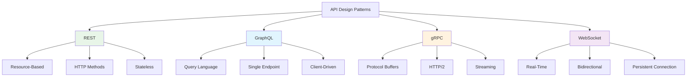

# System Design Fundamentals: API Design Patterns

APIs (Application Programming Interfaces) are the contracts between services in distributed systems. Well-designed APIs are crucial for system scalability, maintainability, and developer experience.

## API Design Paradigms



## RESTful API Implementation

```go
// Complete REST API Implementation
package main

import (
    "encoding/json"
    "fmt"
    "net/http"
    "strings"
    "sync"
    "time"
)

// Domain Models
type User struct {
    ID        string    `json:"id"`
    Username  string    `json:"username"`
    Email     string    `json:"email"`
    CreatedAt time.Time `json:"created_at"`
    UpdatedAt time.Time `json:"updated_at"`
}

type Product struct {
    ID          string    `json:"id"`
    Name        string    `json:"name"`
    Description string    `json:"description"`
    Price       float64   `json:"price"`
    Stock       int       `json:"stock"`
    CreatedAt   time.Time `json:"created_at"`
}

// Repository Pattern
type UserRepository struct {
    users map[string]*User
    mutex sync.RWMutex
}

func NewUserRepository() *UserRepository {
    return &UserRepository{
        users: make(map[string]*User),
    }
}

func (r *UserRepository) Create(user *User) error {
    r.mutex.Lock()
    defer r.mutex.Unlock()
    
    if _, exists := r.users[user.ID]; exists {
        return fmt.Errorf("user already exists")
    }
    
    user.CreatedAt = time.Now()
    user.UpdatedAt = time.Now()
    r.users[user.ID] = user
    
    return nil
}

func (r *UserRepository) GetByID(id string) (*User, error) {
    r.mutex.RLock()
    defer r.mutex.RUnlock()
    
    user, exists := r.users[id]
    if !exists {
        return nil, fmt.Errorf("user not found")
    }
    
    return user, nil
}

func (r *UserRepository) GetAll(limit, offset int) ([]*User, int) {
    r.mutex.RLock()
    defer r.mutex.RUnlock()
    
    users := make([]*User, 0, len(r.users))
    for _, user := range r.users {
        users = append(users, user)
    }
    
    total := len(users)
    
    // Apply pagination
    start := offset
    end := offset + limit
    
    if start > total {
        return []*User{}, total
    }
    if end > total {
        end = total
    }
    
    return users[start:end], total
}

func (r *UserRepository) Update(id string, updates map[string]interface{}) error {
    r.mutex.Lock()
    defer r.mutex.Unlock()
    
    user, exists := r.users[id]
    if !exists {
        return fmt.Errorf("user not found")
    }
    
    // Apply updates
    if username, ok := updates["username"].(string); ok {
        user.Username = username
    }
    if email, ok := updates["email"].(string); ok {
        user.Email = email
    }
    
    user.UpdatedAt = time.Now()
    
    return nil
}

func (r *UserRepository) Delete(id string) error {
    r.mutex.Lock()
    defer r.mutex.Unlock()
    
    if _, exists := r.users[id]; !exists {
        return fmt.Errorf("user not found")
    }
    
    delete(r.users, id)
    return nil
}

// API Response Types
type APIResponse struct {
    Success bool        `json:"success"`
    Data    interface{} `json:"data,omitempty"`
    Error   *APIError   `json:"error,omitempty"`
    Meta    *Meta       `json:"meta,omitempty"`
}

type APIError struct {
    Code    string `json:"code"`
    Message string `json:"message"`
}

type Meta struct {
    Total      int `json:"total"`
    Page       int `json:"page"`
    PerPage    int `json:"per_page"`
    TotalPages int `json:"total_pages"`
}

// REST API Handler
type RESTAPIHandler struct {
    userRepo *UserRepository
}

func NewRESTAPIHandler(userRepo *UserRepository) *RESTAPIHandler {
    return &RESTAPIHandler{
        userRepo: userRepo,
    }
}

func (h *RESTAPIHandler) ServeHTTP(w http.ResponseWriter, r *http.Request) {
    w.Header().Set("Content-Type", "application/json")
    
    // CORS headers
    w.Header().Set("Access-Control-Allow-Origin", "*")
    w.Header().Set("Access-Control-Allow-Methods", "GET, POST, PUT, PATCH, DELETE, OPTIONS")
    w.Header().Set("Access-Control-Allow-Headers", "Content-Type, Authorization")
    
    if r.Method == "OPTIONS" {
        w.WriteHeader(http.StatusOK)
        return
    }
    
    // Route handling
    path := strings.TrimPrefix(r.URL.Path, "/api/v1")
    
    switch {
    case strings.HasPrefix(path, "/users"):
        h.handleUsers(w, r, path)
    case strings.HasPrefix(path, "/health"):
        h.handleHealth(w, r)
    default:
        h.sendError(w, http.StatusNotFound, "NOT_FOUND", "Endpoint not found")
    }
}

func (h *RESTAPIHandler) handleUsers(w http.ResponseWriter, r *http.Request, path string) {
    // Extract user ID if present
    pathParts := strings.Split(strings.TrimPrefix(path, "/users"), "/")
    var userID string
    if len(pathParts) > 1 && pathParts[1] != "" {
        userID = pathParts[1]
    }
    
    switch r.Method {
    case "GET":
        if userID != "" {
            h.getUser(w, r, userID)
        } else {
            h.listUsers(w, r)
        }
    case "POST":
        h.createUser(w, r)
    case "PUT", "PATCH":
        if userID != "" {
            h.updateUser(w, r, userID)
        } else {
            h.sendError(w, http.StatusBadRequest, "BAD_REQUEST", "User ID required")
        }
    case "DELETE":
        if userID != "" {
            h.deleteUser(w, r, userID)
        } else {
            h.sendError(w, http.StatusBadRequest, "BAD_REQUEST", "User ID required")
        }
    default:
        h.sendError(w, http.StatusMethodNotAllowed, "METHOD_NOT_ALLOWED", "Method not allowed")
    }
}

func (h *RESTAPIHandler) getUser(w http.ResponseWriter, r *http.Request, id string) {
    user, err := h.userRepo.GetByID(id)
    if err != nil {
        h.sendError(w, http.StatusNotFound, "USER_NOT_FOUND", err.Error())
        return
    }
    
    h.sendSuccess(w, http.StatusOK, user, nil)
}

func (h *RESTAPIHandler) listUsers(w http.ResponseWriter, r *http.Request) {
    // Parse query parameters
    query := r.URL.Query()
    page := 1
    perPage := 10
    
    if p := query.Get("page"); p != "" {
        fmt.Sscanf(p, "%d", &page)
    }
    if pp := query.Get("per_page"); pp != "" {
        fmt.Sscanf(pp, "%d", &perPage)
    }
    
    offset := (page - 1) * perPage
    users, total := h.userRepo.GetAll(perPage, offset)
    
    totalPages := (total + perPage - 1) / perPage
    
    meta := &Meta{
        Total:      total,
        Page:       page,
        PerPage:    perPage,
        TotalPages: totalPages,
    }
    
    h.sendSuccess(w, http.StatusOK, users, meta)
}

func (h *RESTAPIHandler) createUser(w http.ResponseWriter, r *http.Request) {
    var user User
    if err := json.NewDecoder(r.Body).Decode(&user); err != nil {
        h.sendError(w, http.StatusBadRequest, "INVALID_JSON", "Invalid request body")
        return
    }
    
    // Generate ID
    user.ID = fmt.Sprintf("user-%d", time.Now().UnixNano())
    
    if err := h.userRepo.Create(&user); err != nil {
        h.sendError(w, http.StatusConflict, "USER_EXISTS", err.Error())
        return
    }
    
    h.sendSuccess(w, http.StatusCreated, user, nil)
}

func (h *RESTAPIHandler) updateUser(w http.ResponseWriter, r *http.Request, id string) {
    var updates map[string]interface{}
    if err := json.NewDecoder(r.Body).Decode(&updates); err != nil {
        h.sendError(w, http.StatusBadRequest, "INVALID_JSON", "Invalid request body")
        return
    }
    
    if err := h.userRepo.Update(id, updates); err != nil {
        h.sendError(w, http.StatusNotFound, "USER_NOT_FOUND", err.Error())
        return
    }
    
    user, _ := h.userRepo.GetByID(id)
    h.sendSuccess(w, http.StatusOK, user, nil)
}

func (h *RESTAPIHandler) deleteUser(w http.ResponseWriter, r *http.Request, id string) {
    if err := h.userRepo.Delete(id); err != nil {
        h.sendError(w, http.StatusNotFound, "USER_NOT_FOUND", err.Error())
        return
    }
    
    h.sendSuccess(w, http.StatusNoContent, nil, nil)
}

func (h *RESTAPIHandler) handleHealth(w http.ResponseWriter, r *http.Request) {
    health := map[string]interface{}{
        "status":    "healthy",
        "timestamp": time.Now(),
        "version":   "1.0.0",
    }
    
    h.sendSuccess(w, http.StatusOK, health, nil)
}

func (h *RESTAPIHandler) sendSuccess(w http.ResponseWriter, status int, data interface{}, meta *Meta) {
    response := APIResponse{
        Success: true,
        Data:    data,
        Meta:    meta,
    }
    
    w.WriteHeader(status)
    json.NewEncoder(w).Encode(response)
}

func (h *RESTAPIHandler) sendError(w http.ResponseWriter, status int, code, message string) {
    response := APIResponse{
        Success: false,
        Error: &APIError{
            Code:    code,
            Message: message,
        },
    }
    
    w.WriteHeader(status)
    json.NewEncoder(w).Encode(response)
}
```

## GraphQL API Implementation

```go
// GraphQL API Implementation
package main

import (
    "context"
    "encoding/json"
    "fmt"
    "net/http"
    "strings"
)

// GraphQL Schema Types
type GraphQLSchema struct {
    userRepo *UserRepository
}

type GraphQLRequest struct {
    Query     string                 `json:"query"`
    Variables map[string]interface{} `json:"variables"`
}

type GraphQLResponse struct {
    Data   interface{}            `json:"data,omitempty"`
    Errors []GraphQLError         `json:"errors,omitempty"`
}

type GraphQLError struct {
    Message string   `json:"message"`
    Path    []string `json:"path,omitempty"`
}

func NewGraphQLSchema(userRepo *UserRepository) *GraphQLSchema {
    return &GraphQLSchema{
        userRepo: userRepo,
    }
}

func (s *GraphQLSchema) Execute(ctx context.Context, query string, variables map[string]interface{}) *GraphQLResponse {
    // Parse query (simplified parser)
    query = strings.TrimSpace(query)
    
    // Detect query type
    if strings.Contains(query, "query") {
        return s.executeQuery(ctx, query, variables)
    } else if strings.Contains(query, "mutation") {
        return s.executeMutation(ctx, query, variables)
    }
    
    return &GraphQLResponse{
        Errors: []GraphQLError{{Message: "Invalid query"}},
    }
}

func (s *GraphQLSchema) executeQuery(ctx context.Context, query string, variables map[string]interface{}) *GraphQLResponse {
    // Simplified query execution
    if strings.Contains(query, "user(id:") {
        // Single user query
        id := s.extractID(query)
        user, err := s.userRepo.GetByID(id)
        if err != nil {
            return &GraphQLResponse{
                Errors: []GraphQLError{{Message: err.Error()}},
            }
        }
        
        return &GraphQLResponse{
            Data: map[string]interface{}{"user": user},
        }
    } else if strings.Contains(query, "users") {
        // List users query
        limit := 10
        offset := 0
        
        if l, ok := variables["limit"].(float64); ok {
            limit = int(l)
        }
        if o, ok := variables["offset"].(float64); ok {
            offset = int(o)
        }
        
        users, total := s.userRepo.GetAll(limit, offset)
        
        return &GraphQLResponse{
            Data: map[string]interface{}{
                "users": map[string]interface{}{
                    "nodes": users,
                    "total": total,
                },
            },
        }
    }
    
    return &GraphQLResponse{
        Errors: []GraphQLError{{Message: "Unknown query"}},
    }
}

func (s *GraphQLSchema) executeMutation(ctx context.Context, query string, variables map[string]interface{}) *GraphQLResponse {
    if strings.Contains(query, "createUser") {
        // Create user mutation
        username, _ := variables["username"].(string)
        email, _ := variables["email"].(string)
        
        user := &User{
            ID:       fmt.Sprintf("user-%d", time.Now().UnixNano()),
            Username: username,
            Email:    email,
        }
        
        if err := s.userRepo.Create(user); err != nil {
            return &GraphQLResponse{
                Errors: []GraphQLError{{Message: err.Error()}},
            }
        }
        
        return &GraphQLResponse{
            Data: map[string]interface{}{"createUser": user},
        }
    } else if strings.Contains(query, "updateUser") {
        // Update user mutation
        id, _ := variables["id"].(string)
        updates := make(map[string]interface{})
        
        if username, ok := variables["username"].(string); ok {
            updates["username"] = username
        }
        if email, ok := variables["email"].(string); ok {
            updates["email"] = email
        }
        
        if err := s.userRepo.Update(id, updates); err != nil {
            return &GraphQLResponse{
                Errors: []GraphQLError{{Message: err.Error()}},
            }
        }
        
        user, _ := s.userRepo.GetByID(id)
        
        return &GraphQLResponse{
            Data: map[string]interface{}{"updateUser": user},
        }
    }
    
    return &GraphQLResponse{
        Errors: []GraphQLError{{Message: "Unknown mutation"}},
    }
}

func (s *GraphQLSchema) extractID(query string) string {
    // Simplified ID extraction
    start := strings.Index(query, "id:")
    if start == -1 {
        return ""
    }
    start += 3
    
    end := strings.IndexAny(query[start:], " )")
    if end == -1 {
        return ""
    }
    
    id := strings.Trim(query[start:start+end], `"`)
    return id
}

// GraphQL HTTP Handler
type GraphQLHandler struct {
    schema *GraphQLSchema
}

func NewGraphQLHandler(schema *GraphQLSchema) *GraphQLHandler {
    return &GraphQLHandler{
        schema: schema,
    }
}

func (h *GraphQLHandler) ServeHTTP(w http.ResponseWriter, r *http.Request) {
    w.Header().Set("Content-Type", "application/json")
    
    if r.Method != "POST" {
        http.Error(w, "Method not allowed", http.StatusMethodNotAllowed)
        return
    }
    
    var req GraphQLRequest
    if err := json.NewDecoder(r.Body).Decode(&req); err != nil {
        response := GraphQLResponse{
            Errors: []GraphQLError{{Message: "Invalid request body"}},
        }
        json.NewEncoder(w).Encode(response)
        return
    }
    
    response := h.schema.Execute(r.Context(), req.Query, req.Variables)
    json.NewEncoder(w).Encode(response)
}
```

## gRPC API Implementation

```go
// gRPC Service Implementation
package main

import (
    "context"
    "fmt"
    "time"
)

// Protocol Buffer Message Definitions (simulated)
type CreateUserRequest struct {
    Username string
    Email    string
}

type UpdateUserRequest struct {
    Id       string
    Username string
    Email    string
}

type GetUserRequest struct {
    Id string
}

type ListUsersRequest struct {
    PageSize  int32
    PageToken string
}

type UserResponse struct {
    Id        string
    Username  string
    Email     string
    CreatedAt int64
    UpdatedAt int64
}

type ListUsersResponse struct {
    Users         []*UserResponse
    NextPageToken string
    TotalSize     int32
}

type DeleteUserRequest struct {
    Id string
}

type Empty struct{}

// gRPC Service Interface
type UserServiceServer interface {
    CreateUser(context.Context, *CreateUserRequest) (*UserResponse, error)
    GetUser(context.Context, *GetUserRequest) (*UserResponse, error)
    UpdateUser(context.Context, *UpdateUserRequest) (*UserResponse, error)
    DeleteUser(context.Context, *DeleteUserRequest) (*Empty, error)
    ListUsers(context.Context, *ListUsersRequest) (*ListUsersResponse, error)
}

// gRPC Service Implementation
type UserServiceImpl struct {
    userRepo *UserRepository
}

func NewUserServiceImpl(userRepo *UserRepository) *UserServiceImpl {
    return &UserServiceImpl{
        userRepo: userRepo,
    }
}

func (s *UserServiceImpl) CreateUser(ctx context.Context, req *CreateUserRequest) (*UserResponse, error) {
    user := &User{
        ID:       fmt.Sprintf("user-%d", time.Now().UnixNano()),
        Username: req.Username,
        Email:    req.Email,
    }
    
    if err := s.userRepo.Create(user); err != nil {
        return nil, fmt.Errorf("failed to create user: %w", err)
    }
    
    return s.userToResponse(user), nil
}

func (s *UserServiceImpl) GetUser(ctx context.Context, req *GetUserRequest) (*UserResponse, error) {
    user, err := s.userRepo.GetByID(req.Id)
    if err != nil {
        return nil, fmt.Errorf("user not found: %w", err)
    }
    
    return s.userToResponse(user), nil
}

func (s *UserServiceImpl) UpdateUser(ctx context.Context, req *UpdateUserRequest) (*UserResponse, error) {
    updates := make(map[string]interface{})
    if req.Username != "" {
        updates["username"] = req.Username
    }
    if req.Email != "" {
        updates["email"] = req.Email
    }
    
    if err := s.userRepo.Update(req.Id, updates); err != nil {
        return nil, fmt.Errorf("failed to update user: %w", err)
    }
    
    user, _ := s.userRepo.GetByID(req.Id)
    return s.userToResponse(user), nil
}

func (s *UserServiceImpl) DeleteUser(ctx context.Context, req *DeleteUserRequest) (*Empty, error) {
    if err := s.userRepo.Delete(req.Id); err != nil {
        return nil, fmt.Errorf("failed to delete user: %w", err)
    }
    
    return &Empty{}, nil
}

func (s *UserServiceImpl) ListUsers(ctx context.Context, req *ListUsersRequest) (*ListUsersResponse, error) {
    pageSize := int(req.PageSize)
    if pageSize == 0 {
        pageSize = 10
    }
    
    offset := 0
    // In real implementation, decode pageToken to get offset
    
    users, total := s.userRepo.GetAll(pageSize, offset)
    
    responses := make([]*UserResponse, len(users))
    for i, user := range users {
        responses[i] = s.userToResponse(user)
    }
    
    return &ListUsersResponse{
        Users:         responses,
        NextPageToken: fmt.Sprintf("token-%d", offset+pageSize),
        TotalSize:     int32(total),
    }, nil
}

func (s *UserServiceImpl) userToResponse(user *User) *UserResponse {
    return &UserResponse{
        Id:        user.ID,
        Username:  user.Username,
        Email:     user.Email,
        CreatedAt: user.CreatedAt.Unix(),
        UpdatedAt: user.UpdatedAt.Unix(),
    }
}

// gRPC Streaming Implementation
type StreamingService struct {
    userRepo *UserRepository
}

func NewStreamingService(userRepo *UserRepository) *StreamingService {
    return &StreamingService{
        userRepo: userRepo,
    }
}

// Server Streaming: Watch user updates
func (s *StreamingService) WatchUsers(ctx context.Context, req *Empty, stream chan *UserResponse) error {
    ticker := time.NewTicker(1 * time.Second)
    defer ticker.Stop()
    
    for {
        select {
        case <-ctx.Done():
            return ctx.Err()
        case <-ticker.C:
            // Get all users and stream them
            users, _ := s.userRepo.GetAll(100, 0)
            for _, user := range users {
                select {
                case stream <- (&UserServiceImpl{}).userToResponse(user):
                case <-ctx.Done():
                    return ctx.Err()
                }
            }
        }
    }
}

// Bidirectional Streaming: Chat-like updates
type UserUpdate struct {
    UserId string
    Field  string
    Value  string
}

func (s *StreamingService) StreamUserUpdates(ctx context.Context, updates chan *UserUpdate, responses chan *UserResponse) error {
    for {
        select {
        case <-ctx.Done():
            return ctx.Err()
        case update := <-updates:
            // Apply update
            updateMap := map[string]interface{}{
                update.Field: update.Value,
            }
            
            if err := s.userRepo.Update(update.UserId, updateMap); err != nil {
                continue
            }
            
            // Send back updated user
            user, err := s.userRepo.GetByID(update.UserId)
            if err != nil {
                continue
            }
            
            select {
            case responses <- (&UserServiceImpl{}).userToResponse(user):
            case <-ctx.Done():
                return ctx.Err()
            }
        }
    }
}
```

## WebSocket API Implementation

```go
// WebSocket Real-Time API
package main

import (
    "encoding/json"
    "fmt"
    "net/http"
    "sync"
    "time"
)

// WebSocket Connection (simplified)
type WebSocketConnection struct {
    ID       string
    UserID   string
    send     chan []byte
    hub      *WebSocketHub
    mutex    sync.Mutex
}

type WebSocketHub struct {
    connections map[string]*WebSocketConnection
    broadcast   chan *WebSocketMessage
    register    chan *WebSocketConnection
    unregister  chan *WebSocketConnection
    mutex       sync.RWMutex
}

type WebSocketMessage struct {
    Type      string                 `json:"type"`
    Payload   map[string]interface{} `json:"payload"`
    Timestamp time.Time              `json:"timestamp"`
}

func NewWebSocketHub() *WebSocketHub {
    hub := &WebSocketHub{
        connections: make(map[string]*WebSocketConnection),
        broadcast:   make(chan *WebSocketMessage, 256),
        register:    make(chan *WebSocketConnection),
        unregister:  make(chan *WebSocketConnection),
    }
    
    go hub.run()
    
    return hub
}

func (h *WebSocketHub) run() {
    for {
        select {
        case conn := <-h.register:
            h.mutex.Lock()
            h.connections[conn.ID] = conn
            h.mutex.Unlock()
            
            fmt.Printf("🔌 WebSocket connected: %s (total: %d)\n", conn.ID, len(h.connections))
            
            // Send welcome message
            welcome := &WebSocketMessage{
                Type: "connected",
                Payload: map[string]interface{}{
                    "connection_id": conn.ID,
                    "timestamp":     time.Now(),
                },
                Timestamp: time.Now(),
            }
            conn.send <- h.messageToBytes(welcome)
            
        case conn := <-h.unregister:
            h.mutex.Lock()
            if _, ok := h.connections[conn.ID]; ok {
                delete(h.connections, conn.ID)
                close(conn.send)
            }
            h.mutex.Unlock()
            
            fmt.Printf("🔌 WebSocket disconnected: %s (total: %d)\n", conn.ID, len(h.connections))
            
        case message := <-h.broadcast:
            h.mutex.RLock()
            connections := make([]*WebSocketConnection, 0, len(h.connections))
            for _, conn := range h.connections {
                connections = append(connections, conn)
            }
            h.mutex.RUnlock()
            
            messageBytes := h.messageToBytes(message)
            
            for _, conn := range connections {
                select {
                case conn.send <- messageBytes:
                default:
                    // Connection buffer full, close it
                    h.unregister <- conn
                }
            }
        }
    }
}

func (h *WebSocketHub) messageToBytes(msg *WebSocketMessage) []byte {
    bytes, _ := json.Marshal(msg)
    return bytes
}

func (h *WebSocketHub) BroadcastUserUpdate(userID string, action string, data interface{}) {
    message := &WebSocketMessage{
        Type: "user_update",
        Payload: map[string]interface{}{
            "user_id": userID,
            "action":  action,
            "data":    data,
        },
        Timestamp: time.Now(),
    }
    
    h.broadcast <- message
}

func (h *WebSocketHub) SendToUser(userID string, messageType string, payload map[string]interface{}) {
    h.mutex.RLock()
    defer h.mutex.RUnlock()
    
    message := &WebSocketMessage{
        Type:      messageType,
        Payload:   payload,
        Timestamp: time.Now(),
    }
    
    messageBytes := h.messageToBytes(message)
    
    for _, conn := range h.connections {
        if conn.UserID == userID {
            select {
            case conn.send <- messageBytes:
            default:
            }
        }
    }
}

// WebSocket HTTP Handler
type WebSocketHandler struct {
    hub *WebSocketHub
}

func NewWebSocketHandler(hub *WebSocketHub) *WebSocketHandler {
    return &WebSocketHandler{
        hub: hub,
    }
}

func (h *WebSocketHandler) ServeHTTP(w http.ResponseWriter, r *http.Request) {
    // In real implementation, upgrade to WebSocket connection
    connID := fmt.Sprintf("conn-%d", time.Now().UnixNano())
    userID := r.URL.Query().Get("user_id")
    
    conn := &WebSocketConnection{
        ID:     connID,
        UserID: userID,
        send:   make(chan []byte, 256),
        hub:    h.hub,
    }
    
    h.hub.register <- conn
    
    // Simulate connection
    fmt.Fprintf(w, "WebSocket connection established: %s\n", connID)
}
```

## API Versioning Strategies

```go
// API Versioning Implementation
package main

import (
    "fmt"
    "net/http"
    "strings"
)

type APIVersion string

const (
    V1 APIVersion = "v1"
    V2 APIVersion = "v2"
    V3 APIVersion = "v3"
)

// Version Router
type VersionRouter struct {
    handlers map[APIVersion]http.Handler
}

func NewVersionRouter() *VersionRouter {
    return &VersionRouter{
        handlers: make(map[APIVersion]http.Handler),
    }
}

func (vr *VersionRouter) Register(version APIVersion, handler http.Handler) {
    vr.handlers[version] = handler
    fmt.Printf("📌 Registered API version: %s\n", version)
}

func (vr *VersionRouter) ServeHTTP(w http.ResponseWriter, r *http.Request) {
    // Strategy 1: URL Path versioning (/api/v1/users)
    version := vr.extractVersionFromPath(r.URL.Path)
    
    // Strategy 2: Header versioning (Accept: application/vnd.api.v1+json)
    if version == "" {
        version = vr.extractVersionFromHeader(r.Header.Get("Accept"))
    }
    
    // Strategy 3: Query parameter (?version=v1)
    if version == "" {
        version = APIVersion(r.URL.Query().Get("version"))
    }
    
    // Default to latest version
    if version == "" {
        version = V3
    }
    
    handler, exists := vr.handlers[version]
    if !exists {
        http.Error(w, fmt.Sprintf("API version %s not supported", version), http.StatusNotFound)
        return
    }
    
    // Add version header to response
    w.Header().Set("X-API-Version", string(version))
    
    handler.ServeHTTP(w, r)
}

func (vr *VersionRouter) extractVersionFromPath(path string) APIVersion {
    parts := strings.Split(strings.Trim(path, "/"), "/")
    for _, part := range parts {
        if strings.HasPrefix(part, "v") && len(part) == 2 {
            return APIVersion(part)
        }
    }
    return ""
}

func (vr *VersionRouter) extractVersionFromHeader(accept string) APIVersion {
    // Parse Accept header like: application/vnd.api.v1+json
    if strings.Contains(accept, "vnd.api.") {
        parts := strings.Split(accept, ".")
        for _, part := range parts {
            if strings.HasPrefix(part, "v") {
                version := strings.Split(part, "+")[0]
                return APIVersion(version)
            }
        }
    }
    return ""
}
```

## API Documentation

```go
// OpenAPI/Swagger Documentation Generator
package main

import (
    "encoding/json"
    "fmt"
)

type OpenAPISpec struct {
    OpenAPI string                 `json:"openapi"`
    Info    OpenAPIInfo            `json:"info"`
    Servers []OpenAPIServer        `json:"servers"`
    Paths   map[string]OpenAPIPath `json:"paths"`
}

type OpenAPIInfo struct {
    Title       string `json:"title"`
    Description string `json:"description"`
    Version     string `json:"version"`
}

type OpenAPIServer struct {
    URL         string `json:"url"`
    Description string `json:"description"`
}

type OpenAPIPath struct {
    Get    *OpenAPIOperation `json:"get,omitempty"`
    Post   *OpenAPIOperation `json:"post,omitempty"`
    Put    *OpenAPIOperation `json:"put,omitempty"`
    Delete *OpenAPIOperation `json:"delete,omitempty"`
}

type OpenAPIOperation struct {
    Summary     string                        `json:"summary"`
    Description string                        `json:"description"`
    Tags        []string                      `json:"tags"`
    Parameters  []OpenAPIParameter            `json:"parameters,omitempty"`
    RequestBody *OpenAPIRequestBody           `json:"requestBody,omitempty"`
    Responses   map[string]OpenAPIResponse    `json:"responses"`
}

type OpenAPIParameter struct {
    Name        string `json:"name"`
    In          string `json:"in"`
    Description string `json:"description"`
    Required    bool   `json:"required"`
    Schema      Schema `json:"schema"`
}

type OpenAPIRequestBody struct {
    Description string                `json:"description"`
    Required    bool                  `json:"required"`
    Content     map[string]MediaType  `json:"content"`
}

type OpenAPIResponse struct {
    Description string               `json:"description"`
    Content     map[string]MediaType `json:"content,omitempty"`
}

type MediaType struct {
    Schema Schema `json:"schema"`
}

type Schema struct {
    Type       string            `json:"type"`
    Properties map[string]Schema `json:"properties,omitempty"`
    Items      *Schema           `json:"items,omitempty"`
}

func GenerateOpenAPISpec() *OpenAPISpec {
    spec := &OpenAPISpec{
        OpenAPI: "3.0.0",
        Info: OpenAPIInfo{
            Title:       "User API",
            Description: "RESTful API for user management",
            Version:     "1.0.0",
        },
        Servers: []OpenAPIServer{
            {
                URL:         "http://localhost:8080/api/v1",
                Description: "Development server",
            },
        },
        Paths: make(map[string]OpenAPIPath),
    }
    
    // Define /users endpoint
    spec.Paths["/users"] = OpenAPIPath{
        Get: &OpenAPIOperation{
            Summary:     "List users",
            Description: "Get a paginated list of users",
            Tags:        []string{"users"},
            Parameters: []OpenAPIParameter{
                {
                    Name:        "page",
                    In:          "query",
                    Description: "Page number",
                    Required:    false,
                    Schema:      Schema{Type: "integer"},
                },
                {
                    Name:        "per_page",
                    In:          "query",
                    Description: "Items per page",
                    Required:    false,
                    Schema:      Schema{Type: "integer"},
                },
            },
            Responses: map[string]OpenAPIResponse{
                "200": {
                    Description: "Successful response",
                    Content: map[string]MediaType{
                        "application/json": {
                            Schema: Schema{
                                Type: "object",
                                Properties: map[string]Schema{
                                    "success": {Type: "boolean"},
                                    "data": {
                                        Type: "array",
                                        Items: &Schema{Type: "object"},
                                    },
                                },
                            },
                        },
                    },
                },
            },
        },
        Post: &OpenAPIOperation{
            Summary:     "Create user",
            Description: "Create a new user",
            Tags:        []string{"users"},
            RequestBody: &OpenAPIRequestBody{
                Description: "User object",
                Required:    true,
                Content: map[string]MediaType{
                    "application/json": {
                        Schema: Schema{
                            Type: "object",
                            Properties: map[string]Schema{
                                "username": {Type: "string"},
                                "email":    {Type: "string"},
                            },
                        },
                    },
                },
            },
            Responses: map[string]OpenAPIResponse{
                "201": {
                    Description: "User created successfully",
                },
            },
        },
    }
    
    return spec
}

func (spec *OpenAPISpec) ToJSON() string {
    bytes, _ := json.MarshalIndent(spec, "", "  ")
    return string(bytes)
}
```

## API Best Practices

### 1. Consistent Error Handling

```go
// Standardized Error Responses
type StandardError struct {
    Code       string                 `json:"code"`
    Message    string                 `json:"message"`
    Details    map[string]interface{} `json:"details,omitempty"`
    Timestamp  time.Time              `json:"timestamp"`
    RequestID  string                 `json:"request_id"`
}

func NewStandardError(code, message string) *StandardError {
    return &StandardError{
        Code:      code,
        Message:   message,
        Timestamp: time.Now(),
        RequestID: generateRequestID(),
    }
}

func generateRequestID() string {
    return fmt.Sprintf("req-%d", time.Now().UnixNano())
}
```

### 2. Rate Limiting

```go
// API Rate Limiter (covered in detail in rate limiting post)
type APIRateLimiter struct {
    requests map[string][]time.Time
    limit    int
    window   time.Duration
    mutex    sync.RWMutex
}

func NewAPIRateLimiter(limit int, window time.Duration) *APIRateLimiter {
    return &APIRateLimiter{
        requests: make(map[string][]time.Time),
        limit:    limit,
        window:   window,
    }
}

func (rl *APIRateLimiter) Allow(clientID string) bool {
    rl.mutex.Lock()
    defer rl.mutex.Unlock()
    
    now := time.Now()
    cutoff := now.Add(-rl.window)
    
    // Get client's request history
    requests := rl.requests[clientID]
    
    // Filter out old requests
    valid := make([]time.Time, 0)
    for _, reqTime := range requests {
        if reqTime.After(cutoff) {
            valid = append(valid, reqTime)
        }
    }
    
    // Check if limit exceeded
    if len(valid) >= rl.limit {
        rl.requests[clientID] = valid
        return false
    }
    
    // Add current request
    valid = append(valid, now)
    rl.requests[clientID] = valid
    
    return true
}
```

### 3. API Security

```go
// API Authentication Middleware
type AuthMiddleware struct {
    secretKey string
}

func NewAuthMiddleware(secretKey string) *AuthMiddleware {
    return &AuthMiddleware{
        secretKey: secretKey,
    }
}

func (am *AuthMiddleware) Authenticate(next http.Handler) http.Handler {
    return http.HandlerFunc(func(w http.ResponseWriter, r *http.Request) {
        // Extract token from Authorization header
        authHeader := r.Header.Get("Authorization")
        if authHeader == "" {
            http.Error(w, "Missing authorization header", http.StatusUnauthorized)
            return
        }
        
        // Validate token (simplified)
        token := strings.TrimPrefix(authHeader, "Bearer ")
        if !am.validateToken(token) {
            http.Error(w, "Invalid token", http.StatusUnauthorized)
            return
        }
        
        next.ServeHTTP(w, r)
    })
}

func (am *AuthMiddleware) validateToken(token string) bool {
    // Simplified token validation
    return token != ""
}
```

## API Comparison

| Feature | REST | GraphQL | gRPC | WebSocket |
|---------|------|---------|------|-----------|
| Protocol | HTTP | HTTP | HTTP/2 | WebSocket |
| Data Format | JSON | JSON | Protobuf | JSON/Binary |
| Paradigm | Resource-based | Query-based | RPC | Event-based |
| Performance | Good | Good | Excellent | Excellent |
| Real-time | No | Subscriptions | Streaming | Yes |
| Browser Support | Excellent | Excellent | Limited | Good |
| Caching | Easy | Complex | N/A | N/A |
| Best For | CRUD operations | Flexible queries | Microservices | Real-time apps |

## Conclusion

**Choose REST when:**
- Building public APIs
- Simple CRUD operations
- Need caching
- Wide client support required

**Choose GraphQL when:**
- Clients need flexible queries
- Mobile/bandwidth constraints
- Rapid frontend iteration
- Complex data relationships

**Choose gRPC when:**
- Microservices communication
- Performance critical
- Type safety important
- Streaming required

**Choose WebSocket when:**
- Real-time bidirectional communication
- Live updates/notifications
- Chat/collaboration features
- Game development

Design APIs with consistency, documentation, versioning, and security in mind from day one.