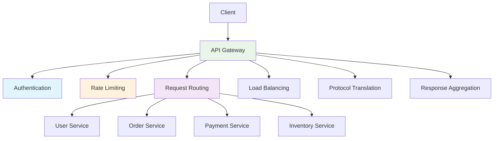

# System Design Fundamentals: API Gateway Pattern

An API Gateway provides a single entry point for clients, handling routing, authentication, rate limiting, and protocol translation across microservices.

## API Gateway Architecture



## Core API Gateway Implementation

```go
// API Gateway Implementation
package main

import (
    "bytes"
    "context"
    "encoding/json"
    "fmt"
    "io"
    "net/http"
    "net/http/httputil"
    "net/url"
    "strings"
    "sync"
    "time"
)

type Route struct {
    Path        string
    Method      string
    Backend     string
    Middlewares []Middleware
}

type Middleware func(http.Handler) http.Handler

type APIGateway struct {
    routes          []Route
    defaultBackend  string
    rateLimiter     *RateLimiter
    authenticator   *Authenticator
    loadBalancer    *LoadBalancer
    mutex           sync.RWMutex
}

func NewAPIGateway(defaultBackend string) *APIGateway {
    return &APIGateway{
        routes:         make([]Route, 0),
        defaultBackend: defaultBackend,
        rateLimiter:    NewRateLimiter(100, time.Minute),
        authenticator:  NewAuthenticator(),
        loadBalancer:   NewLoadBalancer(),
    }
}

func (gw *APIGateway) AddRoute(route Route) {
    gw.mutex.Lock()
    defer gw.mutex.Unlock()
    
    gw.routes = append(gw.routes, route)
    
    fmt.Printf("📋 Registered route: %s %s -> %s\n", route.Method, route.Path, route.Backend)
}

func (gw *APIGateway) ServeHTTP(w http.ResponseWriter, r *http.Request) {
    start := time.Now()
    
    fmt.Printf("\n🌐 Incoming request: %s %s\n", r.Method, r.URL.Path)
    
    // Find matching route
    route := gw.findRoute(r.Method, r.URL.Path)
    
    if route == nil {
        http.Error(w, "Route not found", http.StatusNotFound)
        fmt.Printf("❌ Route not found: %s %s\n", r.Method, r.URL.Path)
        return
    }
    
    // Create handler chain
    handler := gw.createHandler(route)
    
    // Apply middlewares
    for i := len(route.Middlewares) - 1; i >= 0; i-- {
        handler = route.Middlewares[i](handler)
    }
    
    // Execute request
    handler.ServeHTTP(w, r)
    
    duration := time.Since(start)
    fmt.Printf("✅ Request completed in %v\n", duration)
}

func (gw *APIGateway) findRoute(method, path string) *Route {
    gw.mutex.RLock()
    defer gw.mutex.RUnlock()
    
    for _, route := range gw.routes {
        if gw.matchRoute(route, method, path) {
            return &route
        }
    }
    
    return nil
}

func (gw *APIGateway) matchRoute(route Route, method, path string) bool {
    if route.Method != method {
        return false
    }
    
    // Simple prefix matching
    return strings.HasPrefix(path, route.Path)
}

func (gw *APIGateway) createHandler(route *Route) http.Handler {
    return http.HandlerFunc(func(w http.ResponseWriter, r *http.Request) {
        // Get backend URL
        backendURL := route.Backend
        
        // Select backend instance using load balancer
        if instances := gw.loadBalancer.GetInstances(route.Backend); len(instances) > 0 {
            instance := gw.loadBalancer.SelectInstance(route.Backend)
            backendURL = instance
        }
        
        // Proxy request
        gw.proxyRequest(w, r, backendURL)
    })
}

func (gw *APIGateway) proxyRequest(w http.ResponseWriter, r *http.Request, backendURL string) {
    targetURL, err := url.Parse(backendURL)
    if err != nil {
        http.Error(w, "Invalid backend URL", http.StatusInternalServerError)
        return
    }
    
    fmt.Printf("  → Proxying to: %s\n", backendURL)
    
    // Create reverse proxy
    proxy := httputil.NewSingleHostReverseProxy(targetURL)
    
    // Customize director
    originalDirector := proxy.Director
    proxy.Director = func(req *http.Request) {
        originalDirector(req)
        req.Host = targetURL.Host
        req.URL.Path = strings.TrimPrefix(r.URL.Path, "/api")
        
        // Add headers
        req.Header.Set("X-Forwarded-For", r.RemoteAddr)
        req.Header.Set("X-Gateway", "custom-gateway")
    }
    
    // Serve request
    proxy.ServeHTTP(w, r)
}

func (gw *APIGateway) Start(port string) error {
    fmt.Printf("🚀 API Gateway starting on port %s\n\n", port)
    return http.ListenAndServe(":"+port, gw)
}
```

## Authentication Middleware

```go
// Authentication Middleware
package main

import (
    "crypto/sha256"
    "encoding/hex"
    "fmt"
    "net/http"
    "strings"
    "sync"
    "time"
)

type Authenticator struct {
    apiKeys map[string]*APIKey
    tokens  map[string]*Token
    mutex   sync.RWMutex
}

type APIKey struct {
    Key       string
    ClientID  string
    CreatedAt time.Time
    Active    bool
}

type Token struct {
    Value     string
    UserID    string
    ExpiresAt time.Time
}

func NewAuthenticator() *Authenticator {
    return &Authenticator{
        apiKeys: make(map[string]*APIKey),
        tokens:  make(map[string]*Token),
    }
}

func (a *Authenticator) CreateAPIKey(clientID string) string {
    a.mutex.Lock()
    defer a.mutex.Unlock()
    
    // Generate API key
    hash := sha256.Sum256([]byte(fmt.Sprintf("%s-%d", clientID, time.Now().UnixNano())))
    key := hex.EncodeToString(hash[:])
    
    a.apiKeys[key] = &APIKey{
        Key:       key,
        ClientID:  clientID,
        CreatedAt: time.Now(),
        Active:    true,
    }
    
    fmt.Printf("🔑 Created API key for client: %s\n", clientID)
    
    return key
}

func (a *Authenticator) CreateToken(userID string, duration time.Duration) string {
    a.mutex.Lock()
    defer a.mutex.Unlock()
    
    // Generate token
    hash := sha256.Sum256([]byte(fmt.Sprintf("%s-%d", userID, time.Now().UnixNano())))
    token := hex.EncodeToString(hash[:])
    
    a.tokens[token] = &Token{
        Value:     token,
        UserID:    userID,
        ExpiresAt: time.Now().Add(duration),
    }
    
    fmt.Printf("🎫 Created token for user: %s (expires: %v)\n", userID, duration)
    
    return token
}

func (a *Authenticator) ValidateAPIKey(key string) (string, bool) {
    a.mutex.RLock()
    defer a.mutex.RUnlock()
    
    apiKey, exists := a.apiKeys[key]
    
    if !exists || !apiKey.Active {
        return "", false
    }
    
    return apiKey.ClientID, true
}

func (a *Authenticator) ValidateToken(token string) (string, bool) {
    a.mutex.RLock()
    defer a.mutex.RUnlock()
    
    t, exists := a.tokens[token]
    
    if !exists {
        return "", false
    }
    
    if time.Now().After(t.ExpiresAt) {
        return "", false
    }
    
    return t.UserID, true
}

func (a *Authenticator) Middleware() Middleware {
    return func(next http.Handler) http.Handler {
        return http.HandlerFunc(func(w http.ResponseWriter, r *http.Request) {
            // Check API key
            apiKey := r.Header.Get("X-API-Key")
            if apiKey != "" {
                if clientID, valid := a.ValidateAPIKey(apiKey); valid {
                    fmt.Printf("  ✅ Authenticated via API key: %s\n", clientID)
                    r.Header.Set("X-Client-ID", clientID)
                    next.ServeHTTP(w, r)
                    return
                }
            }
            
            // Check Bearer token
            authHeader := r.Header.Get("Authorization")
            if strings.HasPrefix(authHeader, "Bearer ") {
                token := strings.TrimPrefix(authHeader, "Bearer ")
                
                if userID, valid := a.ValidateToken(token); valid {
                    fmt.Printf("  ✅ Authenticated via token: %s\n", userID)
                    r.Header.Set("X-User-ID", userID)
                    next.ServeHTTP(w, r)
                    return
                }
            }
            
            fmt.Println("  ❌ Authentication failed")
            http.Error(w, "Unauthorized", http.StatusUnauthorized)
        })
    }
}
```

## Rate Limiting Middleware

```go
// Rate Limiting Middleware
package main

import (
    "fmt"
    "net/http"
    "sync"
    "time"
)

type RateLimiter struct {
    requests map[string][]time.Time
    limit    int
    window   time.Duration
    mutex    sync.RWMutex
}

func NewRateLimiter(limit int, window time.Duration) *RateLimiter {
    rl := &RateLimiter{
        requests: make(map[string][]time.Time),
        limit:    limit,
        window:   window,
    }
    
    // Start cleanup routine
    go rl.cleanup()
    
    return rl
}

func (rl *RateLimiter) Allow(clientID string) bool {
    rl.mutex.Lock()
    defer rl.mutex.Unlock()
    
    now := time.Now()
    cutoff := now.Add(-rl.window)
    
    // Get client's request history
    requests := rl.requests[clientID]
    
    // Remove old requests
    validRequests := make([]time.Time, 0)
    for _, reqTime := range requests {
        if reqTime.After(cutoff) {
            validRequests = append(validRequests, reqTime)
        }
    }
    
    // Check limit
    if len(validRequests) >= rl.limit {
        fmt.Printf("  ⚠️  Rate limit exceeded for client: %s (%d/%d)\n", 
            clientID, len(validRequests), rl.limit)
        return false
    }
    
    // Add current request
    validRequests = append(validRequests, now)
    rl.requests[clientID] = validRequests
    
    return true
}

func (rl *RateLimiter) cleanup() {
    ticker := time.NewTicker(1 * time.Minute)
    defer ticker.Stop()
    
    for range ticker.C {
        rl.mutex.Lock()
        
        cutoff := time.Now().Add(-rl.window * 2)
        
        for clientID, requests := range rl.requests {
            validRequests := make([]time.Time, 0)
            
            for _, reqTime := range requests {
                if reqTime.After(cutoff) {
                    validRequests = append(validRequests, reqTime)
                }
            }
            
            if len(validRequests) == 0 {
                delete(rl.requests, clientID)
            } else {
                rl.requests[clientID] = validRequests
            }
        }
        
        rl.mutex.Unlock()
    }
}

func (rl *RateLimiter) Middleware() Middleware {
    return func(next http.Handler) http.Handler {
        return http.HandlerFunc(func(w http.ResponseWriter, r *http.Request) {
            // Get client identifier
            clientID := r.Header.Get("X-Client-ID")
            if clientID == "" {
                clientID = r.RemoteAddr
            }
            
            if !rl.Allow(clientID) {
                w.Header().Set("Retry-After", fmt.Sprintf("%d", int(rl.window.Seconds())))
                http.Error(w, "Rate limit exceeded", http.StatusTooManyRequests)
                return
            }
            
            next.ServeHTTP(w, r)
        })
    }
}
```

## Load Balancer

```go
// Load Balancer for Backend Services
package main

import (
    "hash/fnv"
    "sync"
    "sync/atomic"
)

type LoadBalancer struct {
    backends map[string][]string
    counters map[string]*uint64
    mutex    sync.RWMutex
}

func NewLoadBalancer() *LoadBalancer {
    return &LoadBalancer{
        backends: make(map[string][]string),
        counters: make(map[string]*uint64),
    }
}

func (lb *LoadBalancer) RegisterBackend(serviceName, instance string) {
    lb.mutex.Lock()
    defer lb.mutex.Unlock()
    
    if _, exists := lb.backends[serviceName]; !exists {
        lb.backends[serviceName] = make([]string, 0)
        var counter uint64 = 0
        lb.counters[serviceName] = &counter
    }
    
    lb.backends[serviceName] = append(lb.backends[serviceName], instance)
    
    fmt.Printf("🔗 Registered backend: %s -> %s\n", serviceName, instance)
}

func (lb *LoadBalancer) GetInstances(serviceName string) []string {
    lb.mutex.RLock()
    defer lb.mutex.RUnlock()
    
    return lb.backends[serviceName]
}

func (lb *LoadBalancer) SelectInstance(serviceName string) string {
    lb.mutex.RLock()
    defer lb.mutex.RUnlock()
    
    instances := lb.backends[serviceName]
    
    if len(instances) == 0 {
        return ""
    }
    
    // Round-robin selection
    counter := lb.counters[serviceName]
    index := atomic.AddUint64(counter, 1) % uint64(len(instances))
    
    return instances[index]
}

func (lb *LoadBalancer) SelectInstanceByKey(serviceName, key string) string {
    lb.mutex.RLock()
    defer lb.mutex.RUnlock()
    
    instances := lb.backends[serviceName]
    
    if len(instances) == 0 {
        return ""
    }
    
    // Consistent hashing
    h := fnv.New32a()
    h.Write([]byte(key))
    hash := h.Sum32()
    
    index := int(hash) % len(instances)
    
    return instances[index]
}
```

## Request/Response Transformation

```go
// Request/Response Transformation
package main

import (
    "bytes"
    "encoding/json"
    "fmt"
    "io"
    "net/http"
)

type Transformer struct {
    requestTransforms  map[string]func(map[string]interface{}) map[string]interface{}
    responseTransforms map[string]func(map[string]interface{}) map[string]interface{}
}

func NewTransformer() *Transformer {
    return &Transformer{
        requestTransforms:  make(map[string]func(map[string]interface{}) map[string]interface{}),
        responseTransforms: make(map[string]func(map[string]interface{}) map[string]interface{}),
    }
}

func (t *Transformer) RegisterRequestTransform(path string, fn func(map[string]interface{}) map[string]interface{}) {
    t.requestTransforms[path] = fn
}

func (t *Transformer) RegisterResponseTransform(path string, fn func(map[string]interface{}) map[string]interface{}) {
    t.responseTransforms[path] = fn
}

func (t *Transformer) TransformRequest(path string, body []byte) ([]byte, error) {
    if transform, exists := t.requestTransforms[path]; exists {
        var data map[string]interface{}
        
        if err := json.Unmarshal(body, &data); err != nil {
            return body, err
        }
        
        transformed := transform(data)
        
        return json.Marshal(transformed)
    }
    
    return body, nil
}

func (t *Transformer) Middleware() Middleware {
    return func(next http.Handler) http.Handler {
        return http.HandlerFunc(func(w http.ResponseWriter, r *http.Request) {
            // Transform request body
            if r.Body != nil && r.Method != "GET" {
                body, err := io.ReadAll(r.Body)
                r.Body.Close()
                
                if err == nil {
                    transformed, _ := t.TransformRequest(r.URL.Path, body)
                    r.Body = io.NopCloser(bytes.NewBuffer(transformed))
                    r.ContentLength = int64(len(transformed))
                }
            }
            
            // Create response writer wrapper
            rw := &responseWriter{
                ResponseWriter: w,
                body:           &bytes.Buffer{},
                transformer:    t,
                path:           r.URL.Path,
            }
            
            next.ServeHTTP(rw, r)
        })
    }
}

type responseWriter struct {
    http.ResponseWriter
    body        *bytes.Buffer
    transformer *Transformer
    path        string
}

func (rw *responseWriter) Write(b []byte) (int, error) {
    return rw.body.Write(b)
}

func (rw *responseWriter) WriteHeader(statusCode int) {
    rw.ResponseWriter.WriteHeader(statusCode)
}
```

## Response Aggregation

```go
// Response Aggregation (Fan-out/Fan-in)
package main

import (
    "context"
    "encoding/json"
    "fmt"
    "net/http"
    "sync"
    "time"
)

type Aggregator struct {
    client *http.Client
}

func NewAggregator(timeout time.Duration) *Aggregator {
    return &Aggregator{
        client: &http.Client{
            Timeout: timeout,
        },
    }
}

type AggregatedRequest struct {
    Name string
    URL  string
}

func (agg *Aggregator) Aggregate(ctx context.Context, requests []AggregatedRequest) map[string]interface{} {
    results := make(map[string]interface{})
    var mutex sync.Mutex
    var wg sync.WaitGroup
    
    fmt.Printf("  🔀 Aggregating %d requests\n", len(requests))
    
    for _, req := range requests {
        wg.Add(1)
        
        go func(name, url string) {
            defer wg.Done()
            
            start := time.Now()
            
            httpReq, err := http.NewRequestWithContext(ctx, "GET", url, nil)
            if err != nil {
                mutex.Lock()
                results[name] = map[string]interface{}{"error": err.Error()}
                mutex.Unlock()
                return
            }
            
            resp, err := agg.client.Do(httpReq)
            if err != nil {
                mutex.Lock()
                results[name] = map[string]interface{}{"error": err.Error()}
                mutex.Unlock()
                return
            }
            defer resp.Body.Close()
            
            var data interface{}
            json.NewDecoder(resp.Body).Decode(&data)
            
            mutex.Lock()
            results[name] = data
            mutex.Unlock()
            
            fmt.Printf("    ✅ %s completed in %v\n", name, time.Since(start))
        }(req.Name, req.URL)
    }
    
    wg.Wait()
    
    fmt.Printf("  ✅ Aggregation completed\n")
    
    return results
}

func (agg *Aggregator) AggregateHandler(requests []AggregatedRequest) http.HandlerFunc {
    return func(w http.ResponseWriter, r *http.Request) {
        ctx, cancel := context.WithTimeout(r.Context(), 5*time.Second)
        defer cancel()
        
        results := agg.Aggregate(ctx, requests)
        
        w.Header().Set("Content-Type", "application/json")
        json.NewEncoder(w).Encode(results)
    }
}
```

## Logging Middleware

```go
// Logging Middleware
package main

import (
    "fmt"
    "net/http"
    "time"
)

type LoggingMiddleware struct {
    logger Logger
}

type Logger interface {
    Log(level, message string, fields map[string]interface{})
}

type ConsoleLogger struct{}

func (cl *ConsoleLogger) Log(level, message string, fields map[string]interface{}) {
    fmt.Printf("[%s] %s %v\n", level, message, fields)
}

func NewLoggingMiddleware(logger Logger) *LoggingMiddleware {
    return &LoggingMiddleware{
        logger: logger,
    }
}

func (lm *LoggingMiddleware) Middleware() Middleware {
    return func(next http.Handler) http.Handler {
        return http.HandlerFunc(func(w http.ResponseWriter, r *http.Request) {
            start := time.Now()
            
            // Create response writer wrapper
            rw := &statusRecorder{
                ResponseWriter: w,
                statusCode:     http.StatusOK,
            }
            
            // Call next handler
            next.ServeHTTP(rw, r)
            
            duration := time.Since(start)
            
            // Log request
            lm.logger.Log("INFO", "Request completed", map[string]interface{}{
                "method":      r.Method,
                "path":        r.URL.Path,
                "status":      rw.statusCode,
                "duration_ms": duration.Milliseconds(),
                "client":      r.RemoteAddr,
                "user_agent":  r.UserAgent(),
            })
        })
    }
}

type statusRecorder struct {
    http.ResponseWriter
    statusCode int
}

func (sr *statusRecorder) WriteHeader(code int) {
    sr.statusCode = code
    sr.ResponseWriter.WriteHeader(code)
}
```

## Complete Demo

```go
func main() {
    fmt.Println("🚀 Starting API Gateway Demo\n")
    
    // 1. Create API Gateway
    gateway := NewAPIGateway("http://localhost:9000")
    
    // 2. Register backend services
    gateway.loadBalancer.RegisterBackend("user-service", "http://localhost:8001")
    gateway.loadBalancer.RegisterBackend("user-service", "http://localhost:8002")
    gateway.loadBalancer.RegisterBackend("order-service", "http://localhost:8003")
    gateway.loadBalancer.RegisterBackend("payment-service", "http://localhost:8004")
    
    // 3. Create API keys and tokens
    apiKey := gateway.authenticator.CreateAPIKey("mobile-app")
    token := gateway.authenticator.CreateToken("user123", 1*time.Hour)
    
    fmt.Printf("\n📝 Test Credentials:\n")
    fmt.Printf("  API Key: %s\n", apiKey)
    fmt.Printf("  Token: %s\n\n", token)
    
    // 4. Register routes with middlewares
    
    // Public route (no auth)
    gateway.AddRoute(Route{
        Path:    "/api/health",
        Method:  "GET",
        Backend: "user-service",
        Middlewares: []Middleware{
            gateway.rateLimiter.Middleware(),
            NewLoggingMiddleware(&ConsoleLogger{}).Middleware(),
        },
    })
    
    // Protected route (auth + rate limiting)
    gateway.AddRoute(Route{
        Path:    "/api/users",
        Method:  "GET",
        Backend: "user-service",
        Middlewares: []Middleware{
            gateway.authenticator.Middleware(),
            gateway.rateLimiter.Middleware(),
            NewLoggingMiddleware(&ConsoleLogger{}).Middleware(),
        },
    })
    
    gateway.AddRoute(Route{
        Path:    "/api/orders",
        Method:  "POST",
        Backend: "order-service",
        Middlewares: []Middleware{
            gateway.authenticator.Middleware(),
            gateway.rateLimiter.Middleware(),
            NewLoggingMiddleware(&ConsoleLogger{}).Middleware(),
        },
    })
    
    gateway.AddRoute(Route{
        Path:    "/api/payments",
        Method:  "POST",
        Backend: "payment-service",
        Middlewares: []Middleware{
            gateway.authenticator.Middleware(),
            gateway.rateLimiter.Middleware(),
            NewLoggingMiddleware(&ConsoleLogger{}).Middleware(),
        },
    })
    
    // 5. Aggregation endpoint
    aggregator := NewAggregator(5 * time.Second)
    
    http.HandleFunc("/api/dashboard", aggregator.AggregateHandler([]AggregatedRequest{
        {Name: "user", URL: "http://localhost:8001/user/profile"},
        {Name: "orders", URL: "http://localhost:8003/orders/recent"},
        {Name: "balance", URL: "http://localhost:8004/wallet/balance"},
    }))
    
    fmt.Println("📋 Registered Routes:")
    fmt.Println("  GET  /api/health")
    fmt.Println("  GET  /api/users")
    fmt.Println("  POST /api/orders")
    fmt.Println("  POST /api/payments")
    fmt.Println("  GET  /api/dashboard (aggregated)")
    fmt.Println()
    
    // 6. Start gateway
    fmt.Println("Gateway is ready to accept requests!")
    fmt.Println("Test with:")
    fmt.Printf("  curl -H 'X-API-Key: %s' http://localhost:8080/api/users\n", apiKey)
    fmt.Printf("  curl -H 'Authorization: Bearer %s' http://localhost:8080/api/orders\n\n", token)
    
    // Note: In production, you'd start actual backend services
    // For demo purposes, we'll just show the gateway setup
    
    fmt.Println("✅ Demo setup completed!")
}
```

## API Gateway Patterns Comparison

| Pattern | Description | Use Case |
|---------|-------------|----------|
| **Backend for Frontend** | Separate gateway per client type | Mobile vs Web different needs |
| **Micro Gateway** | Gateway per service/domain | Large microservices architecture |
| **Unified Gateway** | Single entry point for all | Simple architecture, small scale |
| **Service Mesh** | Sidecar proxies | Advanced routing, observability |

## Best Practices

### 1. Implement Circuit Breakers
```go
// Protect gateway from failing backends
circuitBreaker := NewCircuitBreaker(Config{
    FailureThreshold: 5,
    Timeout:          30 * time.Second,
})

handler := circuitBreaker.Wrap(backendHandler)
```

### 2. Cache Responses
```go
// Cache GET requests
cache := NewResponseCache(5 * time.Minute)

if cachedResponse := cache.Get(r.URL.Path); cachedResponse != nil {
    w.Write(cachedResponse)
    return
}
```

### 3. Implement Request Timeouts
```go
// Always use context with timeout
ctx, cancel := context.WithTimeout(r.Context(), 10*time.Second)
defer cancel()

req = req.WithContext(ctx)
```

### 4. Add Monitoring
```go
// Track metrics
metrics.Increment("api_gateway.requests", []string{
    "path:" + r.URL.Path,
    "method:" + r.Method,
    "status:" + strconv.Itoa(statusCode),
})
```

## Conclusion

API Gateways provide:
- **Single entry point** for all services
- **Authentication & authorization** centralization
- **Rate limiting & throttling**
- **Request routing & load balancing**
- **Protocol translation** (HTTP, gRPC, WebSocket)
- **Response aggregation** for efficiency

Essential for microservices architectures to manage cross-cutting concerns and provide a unified API interface.