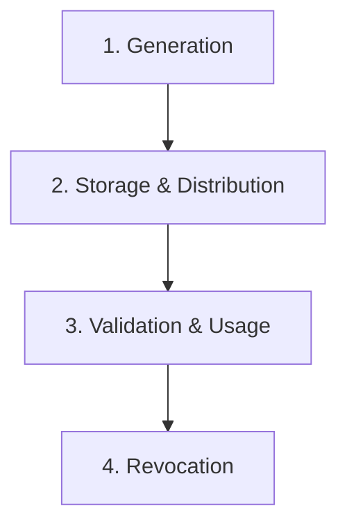

## System Design: Robust API Key Management

While [OAuth 2.0](/blog/system-design/system-design-oauth-2-flow-deep-dive) is the standard for user-delegated authorization, not all API access is on behalf of a user. Often, you need to grant access to a machine, a service, or a third-party organization. This is where **API keys** come in.

An API key is a simple, secret token that a client provides when making API calls. It's used to identify the calling application, track usage, and apply policies like rate limiting. Designing a robust system for managing these keys is a critical aspect of API security and administration. This post covers the entire lifecycle of an API key: generation, storage, validation, and revocation.

### What is an API Key?

At its core, an API key is just a long, random string that is unique to each client. Unlike a JWT, an API key is typically **opaque**—it doesn't contain any claims or user information. It's simply an identifier.

When a client makes a request, they usually include the key in a custom HTTP header, like `X-API-Key`.

`GET /v1/data`
`X-API-Key: a_very_long_and_random_string_12345`

The server's job is to take this key, look it up in a database, and determine who the client is and what they are allowed to do.

### The API Key Lifecycle

A complete management system must address four key stages.



#### 1. Generation

API keys must be unique and unpredictable. They should be generated using a cryptographically secure random number generator. A common practice is to generate a certain number of random bytes and then encode them into a human-readable format like Base64 or Hex.

-   **Prefixes:** It's a good practice to add a short, non-secret prefix to your keys (e.g., `sk_live_` for a Stripe live key). This makes keys identifiable, helping with debugging and preventing users from accidentally using a test key in production.

#### 2. Storage and Distribution

-   **Storage:** You must **never** store API keys in plaintext in your database. If your database is compromised, all your clients' keys will be exposed. The standard practice is to store a **hash** of the API key, using a strong, salted hashing algorithm like SHA-256 or Argon2.

    When a request comes in with an API key, you hash the incoming key and compare it to the stored hash. This way, you can verify the key without ever storing the raw secret.

-   **Distribution:** Because you only store a hash, the raw API key can **only be shown to the user once**, immediately after it's generated. The user is responsible for storing it securely. If they lose it, they must generate a new one. This is the same model used by services like AWS, Stripe, and GitHub.

#### 3. Validation and Usage

When a request arrives at your API gateway or backend:
1.  **Extract the Key:** Get the key from the request header.
2.  **Hash the Key:** Apply the same hashing algorithm you used during storage.
3.  **Look Up the Hash:** Query your database (e.g., an `api_keys` table) for a matching hash. This lookup should be fast, so the hash column must be indexed.
4.  **Check Status:** Once you've identified the client, check the key's status. Is it active? Has it expired? Has it been revoked?
5.  **Apply Policies:** If the key is valid, apply any associated policies.
    -   **Rate Limiting:** Check if the client has exceeded their request quota for the current time window.
    -   **Permissions/Scopes:** Check if the key has the necessary permissions to access the requested resource or perform the requested action.

#### 4. Revocation

A user must be able to revoke an API key at any time, for example, if it's accidentally leaked. Revocation can be implemented in a few ways:
-   **Hard Delete:** Simply delete the key's record from the database. This is simple but loses audit information.
-   **Soft Delete:** Add a `status` column (`active`, `revoked`) or a `revoked_at` timestamp to the `api_keys` table. When a user revokes a key, you update its status. This is the preferred method as it preserves the key for auditing and historical tracking.

### Go Implementation Example

Let's build a simple API key management system in Go. We'll create an endpoint to generate a key and a middleware to validate it.

```go
package main

import (
	"crypto/rand"
	"crypto/sha256"
	"encoding/base64"
	"encoding/json"
	"fmt"
	"log"
	"net/http"
	"sync"
	"time"
)

// --- In-Memory Storage (for demonstration) ---
// In a real app, this would be a database table.
type ApiKeyData struct {
	HashedKey  string    `json:"-"` // The SHA-256 hash of the key
	OwnerID    string    `json:"ownerId"`
	Prefix     string    `json:"prefix"`
	CreatedAt  time.Time `json:"createdAt"`
	IsRevoked  bool      `json:"isRevoked"`
}

var keyStore = struct {
	sync.RWMutex
	keys map[string]ApiKeyData // Maps key hash to its data
}{keys: make(map[string]ApiKeyData)}

// --- Key Generation ---
func generateAPIKey(prefix string, length int) (string, string, error) {
	bytes := make([]byte, length)
	if _, err := rand.Read(bytes); err != nil {
		return "", "", err
	}
	key := base64.URLEncoding.EncodeToString(bytes)
	fullKey := prefix + "_" + key

	hash := sha256.Sum256([]byte(fullKey))
	hashedKey := fmt.Sprintf("%x", hash)

	return fullKey, hashedKey, nil
}

func generateKeyHandler(w http.ResponseWriter, r *http.Request) {
	ownerID := "user-123" // In a real app, get this from the authenticated session.
	prefix := "sk_live"

	apiKey, hashedKey, err := generateAPIKey(prefix, 32)
	if err != nil {
		http.Error(w, "Failed to generate key", http.StatusInternalServerError)
		return
	}

	// Store the hashed key and its metadata.
	keyStore.Lock()
	keyStore.keys[hashedKey] = ApiKeyData{
		HashedKey: hashedKey,
		OwnerID:   ownerID,
		Prefix:    prefix,
		CreatedAt: time.Now(),
		IsRevoked: false,
	}
	keyStore.Unlock()

	// IMPORTANT: Show the raw key to the user only once.
	response := map[string]string{
		"message": "API key generated successfully. Please save it securely.",
		"apiKey":  apiKey,
	}
	json.NewEncoder(w).Encode(response)
}

// --- Middleware for Key Validation ---
func authMiddleware(next http.Handler) http.Handler {
	return http.HandlerFunc(func(w http.ResponseWriter, r *http.Request) {
		apiKey := r.Header.Get("X-API-Key")
		if apiKey == "" {
			http.Error(w, "API key required", http.StatusUnauthorized)
			return
		}

		// Hash the incoming key to find it in the store.
		hash := sha256.Sum256([]byte(apiKey))
		hashedKey := fmt.Sprintf("%x", hash)

		keyStore.RLock()
		keyData, ok := keyStore.keys[hashedKey]
		keyStore.RUnlock()

		if !ok || keyData.IsRevoked {
			http.Error(w, "Invalid or revoked API key", http.StatusUnauthorized)
			return
		}

		// Key is valid. Proceed to the next handler.
		// You could add the ownerID to the request context here.
		next.ServeHTTP(w, r)
	})
}

func protectedHandler(w http.ResponseWriter, r *http.Request) {
	fmt.Fprint(w, "Welcome! You have accessed the protected resource.")
}

func main() {
	http.HandleFunc("/generate-key", generateKeyHandler)
	http.Handle("/protected", authMiddleware(http.HandlerFunc(protectedHandler)))

	fmt.Println("Server starting on port 8080...")
	log.Fatal(http.ListenAndServe(":8080", nil))
}
```
**How to use it:**
1.  **Generate a key:** `curl -X POST http://localhost:8080/generate-key`
    -   Save the `apiKey` from the response.
2.  **Access the protected endpoint:** `curl http://localhost:8080/protected -H "X-API-Key: <your_saved_api_key>"`

### Additional Considerations

-   **Rate Limiting:** Your API gateway should use the client ID associated with the key to enforce rate limits. A common approach is the [token bucket algorithm](https://en.wikipedia.org/wiki/Token_bucket), often implemented using an in-memory store like Redis.
-   **Usage Monitoring:** Log each request associated with an API key. This is crucial for auditing, security analysis (detecting unusual activity), and billing.
-   **Key Rotation:** Encourage or enforce periodic key rotation to limit the lifespan of any single key, reducing the risk if one is compromised.

### Conclusion

API keys are a simple yet effective way to authenticate and manage machine-to-machine access to your API. A robust management system is not just about generating a random string; it's a complete lifecycle process that includes secure generation, hashed storage, efficient validation, and timely revocation. By implementing these patterns, you can provide a secure, scalable, and auditable way for clients to interact with your services.

In the final post of this batch, we'll explore **Multi-Factor Authentication (MFA)**, a critical security layer for protecting user accounts from unauthorized access.
---
