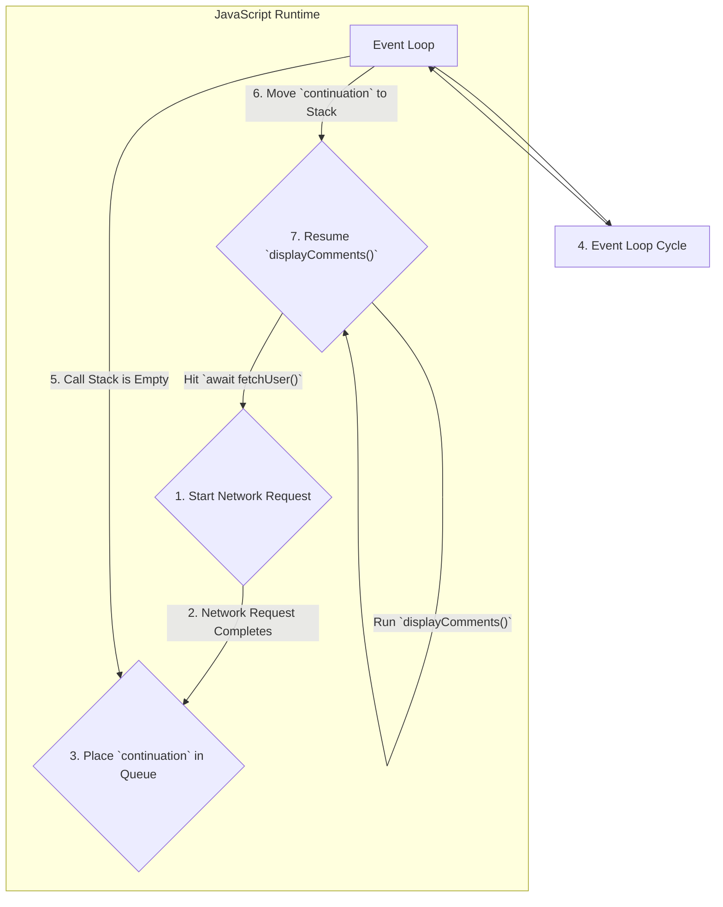

## System Design: Understanding Async/Await Patterns

Asynchronous programming is essential for building responsive and efficient applications, especially those that involve I/O operations like network requests or file access. Traditionally, this was handled with callbacks, which often led to deeply nested, hard-to-read code known as "callback hell."

**Async/Await** is a language feature, first popularized by C# and now common in languages like JavaScript, Python, and Rust, that provides syntactic sugar over asynchronous operations. It allows developers to write non-blocking code that looks and behaves like synchronous, blocking code, making it much easier to write and reason about.

### The Problem: Callback Hell

Before async/await, if you needed to perform a sequence of asynchronous operations, you would nest callbacks inside each other.

Imagine you need to:
1.  Fetch user data from an API.
2.  Then, use the user ID to fetch their posts.
3.  Then, use the post IDs to fetch comments.

With callbacks, the code might look like this (JavaScript example):
```javascript
fetchUser('userId', function(err, user) {
    if (err) {
        handleError(err);
    } else {
        fetchPosts(user.id, function(err, posts) {
            if (err) {
                handleError(err);
            } else {
                fetchComments(posts[0].id, function(err, comments) {
                    if (err) {
                        handleError(err);
                    } else {
                        console.log(comments);
                    }
                });
            }
        });
    }
});
```
This "pyramid of doom" is difficult to read, debug, and maintain. Error handling is repetitive and clunky.

### The Solution: Async/Await

Async/await cleans this up beautifully.

-   **`async` function:** The `async` keyword is used to declare a function that performs asynchronous operations. An `async` function always implicitly returns a `Promise` (or a `Future`/`Task` in other languages).
-   **`await` operator:** The `await` keyword can only be used inside an `async` function. It pauses the execution of the function until the `Promise` it's waiting on is resolved or rejected. While paused, it **does not block the main thread**. It yields control back to the event loop, allowing other tasks to run.

Here is the same logic using async/await:
```javascript
async function displayComments() {
    try {
        const user = await fetchUser('userId');
        const posts = await fetchPosts(user.id);
        const comments = await fetchComments(posts[0].id);
        console.log(comments);
    } catch (err) {
        handleError(err);
    }
}
```
This code is flat, readable, and looks just like synchronous code. The `try...catch` block provides a clean, standard way to handle errors from any of the `await`-ed operations.

### How Does it Work? The Event Loop

The "magic" of async/await is powered by the **event loop**. This is a core concept in runtimes like Node.js and browser JavaScript.

1.  **Call Stack:** This is where function calls are pushed. When a function is called, it's added to the top of the stack. When it returns, it's popped off.
2.  **Event Loop:** A constantly running process that checks if the call stack is empty.
3.  **Task Queue (or Callback Queue):** When an asynchronous operation (like a network request) completes, its callback function is placed in the task queue.
4.  **The Cycle:** The event loop's job is to take the first item from the task queue and push it onto the call stack, but **only when the call stack is empty**.

When an `async` function hits an `await`, it does not block. Instead, it tells the event loop, "I'm waiting for this operation to finish. When it's done, please continue my execution." The function is effectively suspended, and the event loop is free to run other code (like UI updates or other tasks). When the awaited promise resolves, the event loop schedules the rest of the `async` function to continue its execution.



### Simulating Async/Await in Go

Go does not have `async`/`await` keywords because its concurrency model is different. Go uses goroutines, which are lightweight threads managed by the Go runtime, not a single-threaded event loop.

However, we can simulate the *pattern* of async/await using goroutines and channels to achieve a similar developer experience. The core idea is to have a function that starts a long-running task in a goroutine and immediately returns a channel. The caller can then read from this channel to get the result, which will naturally block until the goroutine has finished its work and sent the result to the channel.

This Go code simulates the same user->posts->comments fetching logic.

```go
package main

import (
	"fmt"
	"time"
)

// --- Mock API Functions ---

// fetchUser starts a goroutine to fetch a user and returns a channel for the result.
func fetchUser(userID string) <-chan string {
	resultChan := make(chan string, 1) // Buffered channel of 1
	go func() {
		fmt.Println("Fetching user...")
		time.Sleep(100 * time.Millisecond)
		resultChan <- "User-" + userID
	}()
	return resultChan
}

// fetchPosts starts a goroutine to fetch posts and returns a channel.
func fetchPosts(user string) <-chan string {
	resultChan := make(chan string, 1)
	go func() {
		fmt.Printf("Fetching posts for %s...\n", user)
		time.Sleep(150 * time.Millisecond)
		resultChan <- "Post-123"
	}()
	return resultChan
}

// fetchComments starts a goroutine to fetch comments and returns a channel.
func fetchComments(post string) <-chan string {
	resultChan := make(chan string, 1)
	go func() {
		fmt.Printf("Fetching comments for %s...\n", post)
		time.Sleep(200 * time.Millisecond)
		resultChan <- "Here are the comments."
	}()
	return resultChan
}

// --- The "Async" Function ---

// displayComments simulates an async function.
func displayComments() {
	fmt.Println("Starting the process...")

	// 1. Call fetchUser. It returns a channel immediately.
	userChan := fetchUser("test-user")

	// 2. "await" the result by reading from the channel. This blocks.
	user := <-userChan
	fmt.Printf("Got user: %s\n", user)

	// 3. Call fetchPosts with the user result.
	postsChan := fetchPosts(user)

	// 4. "await" the posts.
	post := <-postsChan
	fmt.Printf("Got post: %s\n", post)

	// 5. Call fetchComments with the post result.
	commentsChan := fetchComments(post)

	// 6. "await" the comments.
	comments := <-commentsChan
	fmt.Printf("Got comments: %s\n", comments)

	fmt.Println("Process finished.")
}

func main() {
	displayComments()
}
```
While this Go code is more verbose than the JavaScript version, the structure is identical. Each `<-channel` read acts as our `await`, pausing the `displayComments` function until the asynchronous work being done in the background goroutine is complete. This achieves the same goal of writing sequential-looking code that performs non-blocking operations.

### Conclusion

Async/await is a powerful language pattern that dramatically simplifies asynchronous programming. By abstracting away the complexities of callbacks and promises, it allows developers to write clean, readable, and maintainable non-blocking code. While the underlying mechanism—be it an event loop or a system of lightweight threads—may differ between languages, the core benefit is the same: it provides a synchronous-like workflow for an asynchronous world, making complex concurrent operations much more manageable.
---
