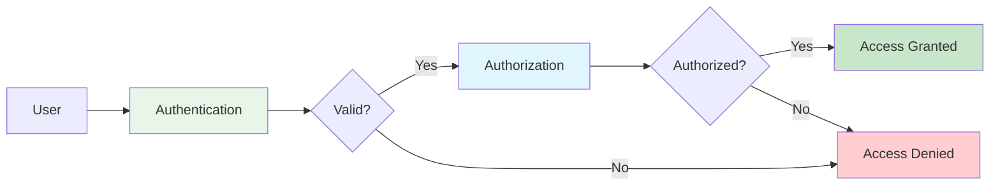

# System Design Fundamentals: Authentication & Authorization

Authentication (who you are) and authorization (what you can do) are critical security components in modern distributed systems. This guide covers industry-standard approaches and implementations.

## Authentication vs Authorization



## JWT (JSON Web Tokens) Implementation

```go
// JWT Authentication System
package main

import (
    "crypto/hmac"
    "crypto/sha256"
    "encoding/base64"
    "encoding/json"
    "fmt"
    "strings"
    "sync"
    "time"
)

// JWT Components
type JWTHeader struct {
    Algorithm string `json:"alg"`
    Type      string `json:"typ"`
}

type JWTClaims struct {
    UserID    string   `json:"user_id"`
    Username  string   `json:"username"`
    Email     string   `json:"email"`
    Roles     []string `json:"roles"`
    IssuedAt  int64    `json:"iat"`
    ExpiresAt int64    `json:"exp"`
    Issuer    string   `json:"iss"`
}

type JWT struct {
    Header    JWTHeader
    Claims    JWTClaims
    Signature string
}

// JWT Service
type JWTService struct {
    secretKey       []byte
    issuer          string
    expirationTime  time.Duration
    refreshDuration time.Duration
    blacklist       map[string]time.Time
    mutex           sync.RWMutex
}

func NewJWTService(secretKey, issuer string, expiration time.Duration) *JWTService {
    service := &JWTService{
        secretKey:       []byte(secretKey),
        issuer:          issuer,
        expirationTime:  expiration,
        refreshDuration: expiration * 2,
        blacklist:       make(map[string]time.Time),
    }
    
    // Start cleanup goroutine
    go service.cleanupBlacklist()
    
    return service
}

func (js *JWTService) GenerateToken(userID, username, email string, roles []string) (string, error) {
    now := time.Now()
    
    claims := JWTClaims{
        UserID:    userID,
        Username:  username,
        Email:     email,
        Roles:     roles,
        IssuedAt:  now.Unix(),
        ExpiresAt: now.Add(js.expirationTime).Unix(),
        Issuer:    js.issuer,
    }
    
    header := JWTHeader{
        Algorithm: "HS256",
        Type:      "JWT",
    }
    
    // Encode header
    headerJSON, _ := json.Marshal(header)
    headerEncoded := base64.RawURLEncoding.EncodeToString(headerJSON)
    
    // Encode claims
    claimsJSON, _ := json.Marshal(claims)
    claimsEncoded := base64.RawURLEncoding.EncodeToString(claimsJSON)
    
    // Create signature
    message := headerEncoded + "." + claimsEncoded
    signature := js.createSignature(message)
    signatureEncoded := base64.RawURLEncoding.EncodeToString(signature)
    
    token := message + "." + signatureEncoded
    
    fmt.Printf("🔐 Generated JWT for user: %s (expires: %v)\n", username, time.Unix(claims.ExpiresAt, 0))
    
    return token, nil
}

func (js *JWTService) ValidateToken(tokenString string) (*JWTClaims, error) {
    // Check blacklist
    if js.isBlacklisted(tokenString) {
        return nil, fmt.Errorf("token has been revoked")
    }
    
    parts := strings.Split(tokenString, ".")
    if len(parts) != 3 {
        return nil, fmt.Errorf("invalid token format")
    }
    
    headerEncoded, claimsEncoded, signatureEncoded := parts[0], parts[1], parts[2]
    
    // Verify signature
    message := headerEncoded + "." + claimsEncoded
    expectedSignature := js.createSignature(message)
    expectedSignatureEncoded := base64.RawURLEncoding.EncodeToString(expectedSignature)
    
    if signatureEncoded != expectedSignatureEncoded {
        return nil, fmt.Errorf("invalid signature")
    }
    
    // Decode claims
    claimsJSON, err := base64.RawURLEncoding.DecodeString(claimsEncoded)
    if err != nil {
        return nil, fmt.Errorf("invalid claims encoding")
    }
    
    var claims JWTClaims
    if err := json.Unmarshal(claimsJSON, &claims); err != nil {
        return nil, fmt.Errorf("invalid claims format")
    }
    
    // Check expiration
    if time.Now().Unix() > claims.ExpiresAt {
        return nil, fmt.Errorf("token has expired")
    }
    
    // Verify issuer
    if claims.Issuer != js.issuer {
        return nil, fmt.Errorf("invalid issuer")
    }
    
    return &claims, nil
}

func (js *JWTService) RefreshToken(oldToken string) (string, error) {
    claims, err := js.ValidateToken(oldToken)
    if err != nil {
        return "", fmt.Errorf("cannot refresh invalid token: %w", err)
    }
    
    // Blacklist old token
    js.RevokeToken(oldToken)
    
    // Generate new token
    return js.GenerateToken(claims.UserID, claims.Username, claims.Email, claims.Roles)
}

func (js *JWTService) RevokeToken(token string) {
    js.mutex.Lock()
    defer js.mutex.Unlock()
    
    js.blacklist[token] = time.Now().Add(js.expirationTime)
    
    fmt.Printf("🚫 Token revoked\n")
}

func (js *JWTService) isBlacklisted(token string) bool {
    js.mutex.RLock()
    defer js.mutex.RUnlock()
    
    _, exists := js.blacklist[token]
    return exists
}

func (js *JWTService) createSignature(message string) []byte {
    mac := hmac.New(sha256.New, js.secretKey)
    mac.Write([]byte(message))
    return mac.Sum(nil)
}

func (js *JWTService) cleanupBlacklist() {
    ticker := time.NewTicker(1 * time.Hour)
    defer ticker.Stop()
    
    for range ticker.C {
        js.mutex.Lock()
        now := time.Now()
        for token, expiry := range js.blacklist {
            if now.After(expiry) {
                delete(js.blacklist, token)
            }
        }
        js.mutex.Unlock()
    }
}
```

## OAuth 2.0 Implementation

```go
// OAuth 2.0 Authorization Server
package main

import (
    "crypto/rand"
    "encoding/hex"
    "fmt"
    "sync"
    "time"
)

// OAuth 2.0 Grant Types
type GrantType string

const (
    AuthorizationCode GrantType = "authorization_code"
    ClientCredentials GrantType = "client_credentials"
    ResourceOwner     GrantType = "password"
    RefreshToken      GrantType = "refresh_token"
)

// OAuth Client
type OAuthClient struct {
    ClientID     string
    ClientSecret string
    RedirectURIs []string
    Scopes       []string
    GrantTypes   []GrantType
    CreatedAt    time.Time
}

// OAuth Token
type OAuthToken struct {
    AccessToken  string
    RefreshToken string
    TokenType    string
    ExpiresIn    int64
    Scopes       []string
    UserID       string
    ClientID     string
    CreatedAt    time.Time
}

// Authorization Code
type AuthorizationCode struct {
    Code        string
    ClientID    string
    UserID      string
    RedirectURI string
    Scopes      []string
    ExpiresAt   time.Time
    Used        bool
}

// OAuth Authorization Server
type OAuthServer struct {
    clients    map[string]*OAuthClient
    codes      map[string]*AuthorizationCode
    tokens     map[string]*OAuthToken
    refreshMap map[string]string // refresh token -> access token
    mutex      sync.RWMutex
}

func NewOAuthServer() *OAuthServer {
    server := &OAuthServer{
        clients:    make(map[string]*OAuthClient),
        codes:      make(map[string]*AuthorizationCode),
        tokens:     make(map[string]*OAuthToken),
        refreshMap: make(map[string]string),
    }
    
    // Start cleanup
    go server.cleanup()
    
    return server
}

func (s *OAuthServer) RegisterClient(redirectURIs, scopes []string, grantTypes []GrantType) (*OAuthClient, error) {
    clientID := generateRandomString(32)
    clientSecret := generateRandomString(64)
    
    client := &OAuthClient{
        ClientID:     clientID,
        ClientSecret: clientSecret,
        RedirectURIs: redirectURIs,
        Scopes:       scopes,
        GrantTypes:   grantTypes,
        CreatedAt:    time.Now(),
    }
    
    s.mutex.Lock()
    s.clients[clientID] = client
    s.mutex.Unlock()
    
    fmt.Printf("📝 Registered OAuth client: %s\n", clientID)
    
    return client, nil
}

func (s *OAuthServer) AuthorizeRequest(clientID, redirectURI, scope, state, userID string) (string, error) {
    s.mutex.RLock()
    client, exists := s.clients[clientID]
    s.mutex.RUnlock()
    
    if !exists {
        return "", fmt.Errorf("invalid client")
    }
    
    // Verify redirect URI
    validURI := false
    for _, uri := range client.RedirectURIs {
        if uri == redirectURI {
            validURI = true
            break
        }
    }
    if !validURI {
        return "", fmt.Errorf("invalid redirect URI")
    }
    
    // Generate authorization code
    code := generateRandomString(32)
    scopes := parseScopes(scope)
    
    authCode := &AuthorizationCode{
        Code:        code,
        ClientID:    clientID,
        UserID:      userID,
        RedirectURI: redirectURI,
        Scopes:      scopes,
        ExpiresAt:   time.Now().Add(10 * time.Minute),
        Used:        false,
    }
    
    s.mutex.Lock()
    s.codes[code] = authCode
    s.mutex.Unlock()
    
    fmt.Printf("🔑 Generated authorization code for user: %s\n", userID)
    
    return code, nil
}

func (s *OAuthServer) ExchangeCodeForToken(code, clientID, clientSecret, redirectURI string) (*OAuthToken, error) {
    s.mutex.Lock()
    defer s.mutex.Unlock()
    
    // Verify client credentials
    client, exists := s.clients[clientID]
    if !exists || client.ClientSecret != clientSecret {
        return nil, fmt.Errorf("invalid client credentials")
    }
    
    // Verify authorization code
    authCode, exists := s.codes[code]
    if !exists {
        return nil, fmt.Errorf("invalid authorization code")
    }
    
    if authCode.Used {
        return nil, fmt.Errorf("authorization code already used")
    }
    
    if time.Now().After(authCode.ExpiresAt) {
        return nil, fmt.Errorf("authorization code expired")
    }
    
    if authCode.ClientID != clientID {
        return nil, fmt.Errorf("client mismatch")
    }
    
    if authCode.RedirectURI != redirectURI {
        return nil, fmt.Errorf("redirect URI mismatch")
    }
    
    // Mark code as used
    authCode.Used = true
    
    // Generate tokens
    token := s.generateToken(authCode.UserID, clientID, authCode.Scopes)
    
    fmt.Printf("✅ Exchanged code for access token: %s\n", token.AccessToken)
    
    return token, nil
}

func (s *OAuthServer) ClientCredentialsGrant(clientID, clientSecret string, scopes []string) (*OAuthToken, error) {
    s.mutex.RLock()
    client, exists := s.clients[clientID]
    s.mutex.RUnlock()
    
    if !exists || client.ClientSecret != clientSecret {
        return nil, fmt.Errorf("invalid client credentials")
    }
    
    // Verify grant type is allowed
    allowed := false
    for _, gt := range client.GrantTypes {
        if gt == ClientCredentials {
            allowed = true
            break
        }
    }
    if !allowed {
        return nil, fmt.Errorf("grant type not allowed")
    }
    
    s.mutex.Lock()
    token := s.generateToken("", clientID, scopes)
    s.mutex.Unlock()
    
    fmt.Printf("🔐 Client credentials token issued: %s\n", clientID)
    
    return token, nil
}

func (s *OAuthServer) RefreshAccessToken(refreshToken, clientID, clientSecret string) (*OAuthToken, error) {
    s.mutex.Lock()
    defer s.mutex.Unlock()
    
    // Verify client
    client, exists := s.clients[clientID]
    if !exists || client.ClientSecret != clientSecret {
        return nil, fmt.Errorf("invalid client credentials")
    }
    
    // Find access token by refresh token
    accessTokenID, exists := s.refreshMap[refreshToken]
    if !exists {
        return nil, fmt.Errorf("invalid refresh token")
    }
    
    oldToken, exists := s.tokens[accessTokenID]
    if !exists {
        return nil, fmt.Errorf("token not found")
    }
    
    // Generate new tokens
    newToken := s.generateToken(oldToken.UserID, clientID, oldToken.Scopes)
    
    // Revoke old tokens
    delete(s.tokens, accessTokenID)
    delete(s.refreshMap, refreshToken)
    
    fmt.Printf("🔄 Refreshed access token for client: %s\n", clientID)
    
    return newToken, nil
}

func (s *OAuthServer) ValidateAccessToken(accessToken string) (*OAuthToken, error) {
    s.mutex.RLock()
    defer s.mutex.RUnlock()
    
    token, exists := s.tokens[accessToken]
    if !exists {
        return nil, fmt.Errorf("invalid access token")
    }
    
    // Check expiration
    expiresAt := token.CreatedAt.Add(time.Duration(token.ExpiresIn) * time.Second)
    if time.Now().After(expiresAt) {
        return nil, fmt.Errorf("access token expired")
    }
    
    return token, nil
}

func (s *OAuthServer) generateToken(userID, clientID string, scopes []string) *OAuthToken {
    accessToken := generateRandomString(64)
    refreshToken := generateRandomString(64)
    
    token := &OAuthToken{
        AccessToken:  accessToken,
        RefreshToken: refreshToken,
        TokenType:    "Bearer",
        ExpiresIn:    3600, // 1 hour
        Scopes:       scopes,
        UserID:       userID,
        ClientID:     clientID,
        CreatedAt:    time.Now(),
    }
    
    s.tokens[accessToken] = token
    s.refreshMap[refreshToken] = accessToken
    
    return token
}

func (s *OAuthServer) cleanup() {
    ticker := time.NewTicker(1 * time.Minute)
    defer ticker.Stop()
    
    for range ticker.C {
        s.mutex.Lock()
        now := time.Now()
        
        // Cleanup expired codes
        for code, authCode := range s.codes {
            if now.After(authCode.ExpiresAt) || authCode.Used {
                delete(s.codes, code)
            }
        }
        
        // Cleanup expired tokens
        for tokenID, token := range s.tokens {
            expiresAt := token.CreatedAt.Add(time.Duration(token.ExpiresIn) * time.Second)
            if now.After(expiresAt) {
                delete(s.tokens, tokenID)
                delete(s.refreshMap, token.RefreshToken)
            }
        }
        
        s.mutex.Unlock()
    }
}

func generateRandomString(length int) string {
    bytes := make([]byte, length/2)
    rand.Read(bytes)
    return hex.EncodeToString(bytes)
}

func parseScopes(scope string) []string {
    if scope == "" {
        return []string{}
    }
    return strings.Split(scope, " ")
}
```

## SAML 2.0 (Simplified Implementation)

```go
// SAML 2.0 Service Provider
package main

import (
    "encoding/xml"
    "fmt"
    "time"
)

// SAML Request
type SAMLRequest struct {
    XMLName      xml.Name `xml:"AuthnRequest"`
    ID           string   `xml:"ID,attr"`
    Version      string   `xml:"Version,attr"`
    IssueInstant string   `xml:"IssueInstant,attr"`
    Destination  string   `xml:"Destination,attr"`
    Issuer       string   `xml:"Issuer"`
    NameIDPolicy NameIDPolicy
}

type NameIDPolicy struct {
    XMLName     xml.Name `xml:"NameIDPolicy"`
    Format      string   `xml:"Format,attr"`
    AllowCreate bool     `xml:"AllowCreate,attr"`
}

// SAML Response
type SAMLResponse struct {
    XMLName      xml.Name `xml:"Response"`
    ID           string   `xml:"ID,attr"`
    Version      string   `xml:"Version,attr"`
    IssueInstant string   `xml:"IssueInstant,attr"`
    Destination  string   `xml:"Destination,attr"`
    InResponseTo string   `xml:"InResponseTo,attr"`
    Status       Status
    Assertion    Assertion
}

type Status struct {
    XMLName    xml.Name `xml:"Status"`
    StatusCode StatusCode
}

type StatusCode struct {
    XMLName xml.Name `xml:"StatusCode"`
    Value   string   `xml:"Value,attr"`
}

type Assertion struct {
    XMLName            xml.Name `xml:"Assertion"`
    ID                 string   `xml:"ID,attr"`
    Version            string   `xml:"Version,attr"`
    IssueInstant       string   `xml:"IssueInstant,attr"`
    Issuer             string   `xml:"Issuer"`
    Subject            Subject
    Conditions         Conditions
    AttributeStatement AttributeStatement
}

type Subject struct {
    XMLName xml.Name `xml:"Subject"`
    NameID  NameID
}

type NameID struct {
    XMLName xml.Name `xml:"NameID"`
    Format  string   `xml:"Format,attr"`
    Value   string   `xml:",chardata"`
}

type Conditions struct {
    XMLName      xml.Name `xml:"Conditions"`
    NotBefore    string   `xml:"NotBefore,attr"`
    NotOnOrAfter string   `xml:"NotOnOrAfter,attr"`
}

type AttributeStatement struct {
    XMLName    xml.Name    `xml:"AttributeStatement"`
    Attributes []Attribute `xml:"Attribute"`
}

type Attribute struct {
    XMLName        xml.Name `xml:"Attribute"`
    Name           string   `xml:"Name,attr"`
    AttributeValue string   `xml:"AttributeValue"`
}

// SAML Service Provider
type SAMLServiceProvider struct {
    entityID              string
    assertionConsumerURL  string
    identityProviderURL   string
    certificates          map[string]string
}

func NewSAMLServiceProvider(entityID, acsURL, idpURL string) *SAMLServiceProvider {
    return &SAMLServiceProvider{
        entityID:             entityID,
        assertionConsumerURL: acsURL,
        identityProviderURL:  idpURL,
        certificates:         make(map[string]string),
    }
}

func (sp *SAMLServiceProvider) GenerateAuthRequest() (*SAMLRequest, error) {
    request := &SAMLRequest{
        ID:           generateRandomString(32),
        Version:      "2.0",
        IssueInstant: time.Now().UTC().Format(time.RFC3339),
        Destination:  sp.identityProviderURL,
        Issuer:       sp.entityID,
        NameIDPolicy: NameIDPolicy{
            Format:      "urn:oasis:names:tc:SAML:1.1:nameid-format:emailAddress",
            AllowCreate: true,
        },
    }
    
    fmt.Printf("📤 Generated SAML AuthnRequest: %s\n", request.ID)
    
    return request, nil
}

func (sp *SAMLServiceProvider) ValidateResponse(response *SAMLResponse) (map[string]string, error) {
    // Validate status
    if response.Status.StatusCode.Value != "urn:oasis:names:tc:SAML:2.0:status:Success" {
        return nil, fmt.Errorf("authentication failed")
    }
    
    // Validate destination
    if response.Destination != sp.assertionConsumerURL {
        return nil, fmt.Errorf("invalid destination")
    }
    
    // Validate conditions
    notBefore, _ := time.Parse(time.RFC3339, response.Assertion.Conditions.NotBefore)
    notOnOrAfter, _ := time.Parse(time.RFC3339, response.Assertion.Conditions.NotOnOrAfter)
    now := time.Now()
    
    if now.Before(notBefore) || now.After(notOnOrAfter) {
        return nil, fmt.Errorf("assertion expired or not yet valid")
    }
    
    // Extract attributes
    attributes := make(map[string]string)
    for _, attr := range response.Assertion.AttributeStatement.Attributes {
        attributes[attr.Name] = attr.AttributeValue
    }
    
    attributes["nameID"] = response.Assertion.Subject.NameID.Value
    
    fmt.Printf("✅ SAML response validated for user: %s\n", attributes["nameID"])
    
    return attributes, nil
}
```

## Session Management

```go
// Session Management System
package main

import (
    "crypto/rand"
    "encoding/hex"
    "fmt"
    "sync"
    "time"
)

type Session struct {
    ID        string
    UserID    string
    Data      map[string]interface{}
    CreatedAt time.Time
    ExpiresAt time.Time
    LastSeen  time.Time
}

type SessionStore struct {
    sessions map[string]*Session
    mutex    sync.RWMutex
    timeout  time.Duration
}

func NewSessionStore(timeout time.Duration) *SessionStore {
    store := &SessionStore{
        sessions: make(map[string]*Session),
        timeout:  timeout,
    }
    
    go store.cleanup()
    
    return store
}

func (ss *SessionStore) Create(userID string) (*Session, error) {
    sessionID, err := generateSessionID()
    if err != nil {
        return nil, err
    }
    
    now := time.Now()
    session := &Session{
        ID:        sessionID,
        UserID:    userID,
        Data:      make(map[string]interface{}),
        CreatedAt: now,
        ExpiresAt: now.Add(ss.timeout),
        LastSeen:  now,
    }
    
    ss.mutex.Lock()
    ss.sessions[sessionID] = session
    ss.mutex.Unlock()
    
    fmt.Printf("🎫 Created session: %s for user: %s\n", sessionID, userID)
    
    return session, nil
}

func (ss *SessionStore) Get(sessionID string) (*Session, error) {
    ss.mutex.RLock()
    session, exists := ss.sessions[sessionID]
    ss.mutex.RUnlock()
    
    if !exists {
        return nil, fmt.Errorf("session not found")
    }
    
    if time.Now().After(session.ExpiresAt) {
        ss.Destroy(sessionID)
        return nil, fmt.Errorf("session expired")
    }
    
    // Update last seen
    ss.mutex.Lock()
    session.LastSeen = time.Now()
    session.ExpiresAt = time.Now().Add(ss.timeout) // Sliding expiration
    ss.mutex.Unlock()
    
    return session, nil
}

func (ss *SessionStore) Update(sessionID string, key string, value interface{}) error {
    ss.mutex.Lock()
    defer ss.mutex.Unlock()
    
    session, exists := ss.sessions[sessionID]
    if !exists {
        return fmt.Errorf("session not found")
    }
    
    session.Data[key] = value
    session.LastSeen = time.Now()
    
    return nil
}

func (ss *SessionStore) Destroy(sessionID string) error {
    ss.mutex.Lock()
    defer ss.mutex.Unlock()
    
    if _, exists := ss.sessions[sessionID]; !exists {
        return fmt.Errorf("session not found")
    }
    
    delete(ss.sessions, sessionID)
    
    fmt.Printf("🗑️  Destroyed session: %s\n", sessionID)
    
    return nil
}

func (ss *SessionStore) DestroyUserSessions(userID string) {
    ss.mutex.Lock()
    defer ss.mutex.Unlock()
    
    for sessionID, session := range ss.sessions {
        if session.UserID == userID {
            delete(ss.sessions, sessionID)
        }
    }
    
    fmt.Printf("🗑️  Destroyed all sessions for user: %s\n", userID)
}

func (ss *SessionStore) cleanup() {
    ticker := time.NewTicker(1 * time.Minute)
    defer ticker.Stop()
    
    for range ticker.C {
        ss.mutex.Lock()
        now := time.Now()
        for sessionID, session := range ss.sessions {
            if now.After(session.ExpiresAt) {
                delete(ss.sessions, sessionID)
            }
        }
        ss.mutex.Unlock()
    }
}

func generateSessionID() (string, error) {
    bytes := make([]byte, 32)
    if _, err := rand.Read(bytes); err != nil {
        return "", err
    }
    return hex.EncodeToString(bytes), nil
}
```

## Role-Based Access Control (RBAC)

```go
// RBAC Authorization System
package main

import (
    "fmt"
    "sync"
)

type Permission string

const (
    ReadPermission   Permission = "read"
    WritePermission  Permission = "write"
    DeletePermission Permission = "delete"
    AdminPermission  Permission = "admin"
)

type Resource string

const (
    UserResource    Resource = "users"
    ProductResource Resource = "products"
    OrderResource   Resource = "orders"
)

type Role struct {
    Name        string
    Permissions map[Resource][]Permission
}

type RBACSystem struct {
    roles     map[string]*Role
    userRoles map[string][]string // userID -> role names
    mutex     sync.RWMutex
}

func NewRBACSystem() *RBACSystem {
    system := &RBACSystem{
        roles:     make(map[string]*Role),
        userRoles: make(map[string][]string),
    }
    
    // Define default roles
    system.defineDefaultRoles()
    
    return system
}

func (rbac *RBACSystem) defineDefaultRoles() {
    // Admin role - full access
    rbac.CreateRole("admin", map[Resource][]Permission{
        UserResource:    {ReadPermission, WritePermission, DeletePermission, AdminPermission},
        ProductResource: {ReadPermission, WritePermission, DeletePermission, AdminPermission},
        OrderResource:   {ReadPermission, WritePermission, DeletePermission, AdminPermission},
    })
    
    // Manager role
    rbac.CreateRole("manager", map[Resource][]Permission{
        UserResource:    {ReadPermission, WritePermission},
        ProductResource: {ReadPermission, WritePermission, DeletePermission},
        OrderResource:   {ReadPermission, WritePermission},
    })
    
    // User role - basic access
    rbac.CreateRole("user", map[Resource][]Permission{
        UserResource:    {ReadPermission},
        ProductResource: {ReadPermission},
        OrderResource:   {ReadPermission, WritePermission},
    })
    
    // Guest role - read only
    rbac.CreateRole("guest", map[Resource][]Permission{
        ProductResource: {ReadPermission},
    })
}

func (rbac *RBACSystem) CreateRole(name string, permissions map[Resource][]Permission) {
    rbac.mutex.Lock()
    defer rbac.mutex.Unlock()
    
    rbac.roles[name] = &Role{
        Name:        name,
        Permissions: permissions,
    }
    
    fmt.Printf("👤 Created role: %s\n", name)
}

func (rbac *RBACSystem) AssignRole(userID, roleName string) error {
    rbac.mutex.Lock()
    defer rbac.mutex.Unlock()
    
    if _, exists := rbac.roles[roleName]; !exists {
        return fmt.Errorf("role not found: %s", roleName)
    }
    
    rbac.userRoles[userID] = append(rbac.userRoles[userID], roleName)
    
    fmt.Printf("✅ Assigned role %s to user %s\n", roleName, userID)
    
    return nil
}

func (rbac *RBACSystem) RevokeRole(userID, roleName string) error {
    rbac.mutex.Lock()
    defer rbac.mutex.Unlock()
    
    roles := rbac.userRoles[userID]
    newRoles := make([]string, 0)
    
    for _, r := range roles {
        if r != roleName {
            newRoles = append(newRoles, r)
        }
    }
    
    rbac.userRoles[userID] = newRoles
    
    fmt.Printf("🚫 Revoked role %s from user %s\n", roleName, userID)
    
    return nil
}

func (rbac *RBACSystem) CheckPermission(userID string, resource Resource, permission Permission) bool {
    rbac.mutex.RLock()
    defer rbac.mutex.RUnlock()
    
    roles := rbac.userRoles[userID]
    
    for _, roleName := range roles {
        role, exists := rbac.roles[roleName]
        if !exists {
            continue
        }
        
        permissions, hasResource := role.Permissions[resource]
        if !hasResource {
            continue
        }
        
        for _, p := range permissions {
            if p == permission || p == AdminPermission {
                return true
            }
        }
    }
    
    return false
}

func (rbac *RBACSystem) GetUserPermissions(userID string) map[Resource][]Permission {
    rbac.mutex.RLock()
    defer rbac.mutex.RUnlock()
    
    allPermissions := make(map[Resource][]Permission)
    roles := rbac.userRoles[userID]
    
    for _, roleName := range roles {
        role, exists := rbac.roles[roleName]
        if !exists {
            continue
        }
        
        for resource, permissions := range role.Permissions {
            existing := allPermissions[resource]
            
            // Merge permissions (avoid duplicates)
            permSet := make(map[Permission]bool)
            for _, p := range existing {
                permSet[p] = true
            }
            for _, p := range permissions {
                permSet[p] = true
            }
            
            merged := make([]Permission, 0, len(permSet))
            for p := range permSet {
                merged = append(merged, p)
            }
            
            allPermissions[resource] = merged
        }
    }
    
    return allPermissions
}
```

## Multi-Factor Authentication (MFA)

```go
// MFA System with TOTP
package main

import (
    "crypto/hmac"
    "crypto/sha1"
    "encoding/base32"
    "encoding/binary"
    "fmt"
    "math"
    "time"
)

type MFAService struct {
    issuer string
}

type MFASecret struct {
    Secret string
    QRCode string
}

func NewMFAService(issuer string) *MFAService {
    return &MFAService{
        issuer: issuer,
    }
}

func (mfa *MFAService) GenerateSecret(accountName string) (*MFASecret, error) {
    secret := generateRandomString(16)
    secretBase32 := base32.StdEncoding.EncodeToString([]byte(secret))
    
    // Generate provisioning URI for QR code
    uri := fmt.Sprintf("otpauth://totp/%s:%s?secret=%s&issuer=%s",
        mfa.issuer, accountName, secretBase32, mfa.issuer)
    
    fmt.Printf("🔐 Generated MFA secret for: %s\n", accountName)
    
    return &MFASecret{
        Secret: secretBase32,
        QRCode: uri,
    }, nil
}

func (mfa *MFAService) GenerateTOTP(secret string) (string, error) {
    secretBytes, err := base32.StdEncoding.DecodeString(secret)
    if err != nil {
        return "", err
    }
    
    // Get current time counter (30-second intervals)
    counter := time.Now().Unix() / 30
    
    return mfa.generateHOTP(secretBytes, counter)
}

func (mfa *MFAService) ValidateTOTP(secret, token string) bool {
    secretBytes, err := base32.StdEncoding.DecodeString(secret)
    if err != nil {
        return false
    }
    
    // Check current time window and adjacent windows
    counter := time.Now().Unix() / 30
    
    for i := -1; i <= 1; i++ {
        expectedToken, err := mfa.generateHOTP(secretBytes, counter+int64(i))
        if err != nil {
            continue
        }
        
        if expectedToken == token {
            fmt.Printf("✅ TOTP validated successfully\n")
            return true
        }
    }
    
    fmt.Printf("❌ TOTP validation failed\n")
    return false
}

func (mfa *MFAService) generateHOTP(secret []byte, counter int64) (string, error) {
    // Convert counter to bytes
    buf := make([]byte, 8)
    binary.BigEndian.PutUint64(buf, uint64(counter))
    
    // Generate HMAC-SHA1
    mac := hmac.New(sha1.New, secret)
    mac.Write(buf)
    hash := mac.Sum(nil)
    
    // Dynamic truncation
    offset := hash[len(hash)-1] & 0x0F
    truncated := binary.BigEndian.Uint32(hash[offset:offset+4]) & 0x7FFFFFFF
    
    // Generate 6-digit code
    code := truncated % uint32(math.Pow10(6))
    
    return fmt.Sprintf("%06d", code), nil
}
```

## Complete Demo

```go
func main() {
    fmt.Println("🚀 Starting Authentication & Authorization Demo\n")
    
    // 1. JWT Authentication
    fmt.Println("=== JWT Authentication ===")
    jwtService := NewJWTService("my-secret-key", "my-app", 1*time.Hour)
    
    token, _ := jwtService.GenerateToken("user-123", "john_doe", "john@example.com", []string{"user", "admin"})
    fmt.Printf("Token: %s...\n\n", token[:50])
    
    claims, err := jwtService.ValidateToken(token)
    if err == nil {
        fmt.Printf("Validated user: %s (roles: %v)\n\n", claims.Username, claims.Roles)
    }
    
    // 2. OAuth 2.0
    fmt.Println("=== OAuth 2.0 Flow ===")
    oauthServer := NewOAuthServer()
    
    client, _ := oauthServer.RegisterClient(
        []string{"http://localhost:8080/callback"},
        []string{"read", "write"},
        []GrantType{AuthorizationCode, ClientCredentials},
    )
    
    // Authorization code flow
    code, _ := oauthServer.AuthorizeRequest(
        client.ClientID,
        "http://localhost:8080/callback",
        "read write",
        "state123",
        "user-456",
    )
    
    oauthToken, _ := oauthServer.ExchangeCodeForToken(
        code,
        client.ClientID,
        client.ClientSecret,
        "http://localhost:8080/callback",
    )
    fmt.Printf("Access token: %s...\n\n", oauthToken.AccessToken[:30])
    
    // 3. Session Management
    fmt.Println("=== Session Management ===")
    sessionStore := NewSessionStore(30 * time.Minute)
    
    session, _ := sessionStore.Create("user-789")
    sessionStore.Update(session.ID, "preferences", map[string]string{"theme": "dark"})
    
    retrieved, _ := sessionStore.Get(session.ID)
    fmt.Printf("Session data: %v\n\n", retrieved.Data)
    
    // 4. RBAC Authorization
    fmt.Println("=== RBAC Authorization ===")
    rbac := NewRBACSystem()
    
    rbac.AssignRole("user-123", "admin")
    rbac.AssignRole("user-456", "user")
    
    canDelete := rbac.CheckPermission("user-123", ProductResource, DeletePermission)
    fmt.Printf("User-123 can delete products: %v\n", canDelete)
    
    canDelete = rbac.CheckPermission("user-456", ProductResource, DeletePermission)
    fmt.Printf("User-456 can delete products: %v\n\n", canDelete)
    
    // 5. MFA
    fmt.Println("=== Multi-Factor Authentication ===")
    mfaService := NewMFAService("MyApp")
    
    mfaSecret, _ := mfaService.GenerateSecret("john@example.com")
    fmt.Printf("MFA Secret: %s\n", mfaSecret.Secret[:20]+"...")
    fmt.Printf("QR Code URI: %s\n\n", mfaSecret.QRCode[:50]+"...")
    
    // Generate and validate TOTP
    totp, _ := mfaService.GenerateTOTP(mfaSecret.Secret)
    fmt.Printf("Current TOTP: %s\n", totp)
    
    isValid := mfaService.ValidateTOTP(mfaSecret.Secret, totp)
    fmt.Printf("TOTP validation result: %v\n", isValid)
    
    fmt.Println("\n✅ Demo completed!")
}
```

## Security Best Practices

### 1. Password Security

```go
// Secure Password Hashing
import (
    "golang.org/x/crypto/bcrypt"
)

func HashPassword(password string) (string, error) {
    bytes, err := bcrypt.GenerateFromPassword([]byte(password), 14)
    return string(bytes), err
}

func CheckPasswordHash(password, hash string) bool {
    err := bcrypt.CompareHashAndPassword([]byte(hash), []byte(password))
    return err == nil
}
```

### 2. Token Storage

- **Access tokens**: Store in memory (never localStorage in browsers)
- **Refresh tokens**: HttpOnly secure cookies
- **Session IDs**: HttpOnly secure cookies
- **API keys**: Environment variables or secret managers

### 3. Transport Security

- Always use HTTPS/TLS
- Implement certificate pinning
- Use secure headers (HSTS, CSP)

## Conclusion

Authentication and authorization are foundational to secure systems. Choose the right approach based on your needs:

- **JWT**: Stateless, scalable, good for microservices
- **OAuth 2.0**: Third-party access, API authorization
- **SAML**: Enterprise SSO, federated identity
- **Sessions**: Traditional web apps, full server control
- **RBAC**: Flexible permission management

Always implement defense in depth with MFA, secure storage, and proper session management.