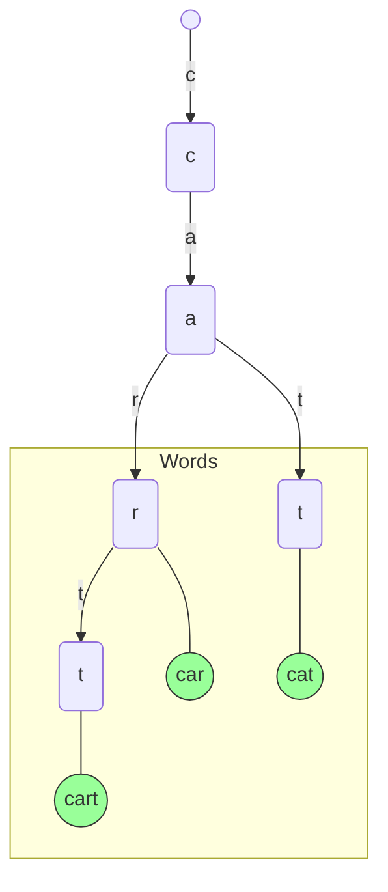

Autocomplete, also known as type-ahead search, is a feature that predicts the rest of a word or phrase a user is typing and offers suggestions in real-time. It's a fundamental component of modern search engines, e-commerce sites, and applications, designed to improve user experience by making searching faster and more convenient.

Building a high-performance autocomplete system that can serve millions of queries with low latency is a fascinating system design challenge. It requires a specialized data structure for efficient prefix matching, a robust indexing pipeline, and intelligent ranking algorithms. This article explores the design of such a system, with a focus on the **Trie** data structure.

### Core Requirements

*   **Low Latency**: Suggestions must appear almost instantly as the user types, typically within 50-100ms.
*   **Relevance**: The suggestions should be relevant to the user's query and ranked in a meaningful order (e.g., by popularity).
*   **Scalability**: The system must handle a high volume of queries and a large dictionary of terms.
*   **Prefix Matching**: The core functionality is to find all terms that start with a given prefix.

### The Wrong Approach: Using a Relational Database

A naive approach would be to store all possible search terms in a relational database table and use the `LIKE` operator for matching.

```sql
SELECT term FROM search_terms WHERE term LIKE 'pre%';
```

**Why this fails:**
*   **Performance**: A `LIKE 'prefix%'` query requires a full table scan or, at best, a B-Tree index scan. This is far too slow for the real-time latency requirements of an autocomplete system, especially with millions of terms.
*   **Ranking**: Simple alphabetical sorting from the database is not sufficient. We need to rank suggestions by popularity or other relevance signals.

### The Right Data Structure: The Trie (Prefix Tree)

A **Trie** is a tree-like data structure perfect for solving prefix-based search problems. Each node in the Trie represents a single character of a term. A path from the root to a node represents a prefix.

**How it works:**
*   The root represents an empty string.
*   Each node has children, typically an array or map, where each child corresponds to a character in the alphabet.
*   To insert a word, you traverse the tree from the root, creating new nodes for characters that don't exist.
*   A special marker (e.g., a boolean flag `isEndOfWord`) on a node indicates that the path to it forms a complete word in the dictionary.

**Example Trie with "car", "cat", and "cart":**



**Searching for a prefix (e.g., "ca"):**
1.  Start at the root.
2.  Traverse to the 'c' node.
3.  From 'c', traverse to the 'a' node.
4.  You have now reached the node corresponding to the prefix "ca".
5.  Perform a traversal (like a Depth-First Search) from this node to find all descendant nodes that are marked as `isEndOfWord`. In this case, you would find "r" (leading to "car"), "t" (leading to "cart"), and "t" (leading to "cat").

*   **Pros**:
    *   **Extremely Fast**: Searching for a prefix of length `k` takes O(k) time, regardless of the size of the dictionary. This is a huge improvement over a database query.
    *   **Space-Efficient**: Common prefixes are shared among multiple words, saving space.

### System Architecture

A complete autocomplete system involves more than just the Trie. It requires a pipeline to build and update the data, and a service to handle queries.

```mermaid
graph TD
    subgraph "Offline Indexing Pipeline"
        A[Raw Data (Search Logs, Documents)] --> B{Data Cleaning & Processing};
        B --> C{Frequency Calculation};
        C --> D[Trie Construction];
        D --> E[Serialized Trie File];
    end

    subgraph "Online Serving System"
        F[API Server]
        G[Trie loaded in memory]
        H[User]
    end

    E -- "Load at startup" --> G
    H -- "GET /autocomplete?q=pre" --> F
    F -- "Search prefix" --> G
    G -- "Return suggestions" --> F
    F -- "Ranked results" --> H
```

**1. Offline Indexing Pipeline:**
This is a background process that runs periodically (e.g., daily) to build the Trie.
*   **Data Source**: The raw data can come from various sources, such as historical user search queries, product catalogs, or document repositories.
*   **Processing**: The data is cleaned, normalized (e.g., converted to lowercase), and tokenized into individual terms.
*   **Frequency Calculation**: The system calculates the frequency of each term. This is crucial for ranking.
*   **Trie Construction**: A Trie is built in memory, and each node that marks the end of a word also stores its frequency (or other ranking score).
*   **Serialization**: The final Trie is serialized to a file. This file is a snapshot of the autocomplete data structure.

**2. Online Serving System:**
This is the live service that handles user requests.
*   **API Server**: A lightweight server that exposes an endpoint like `/autocomplete`.
*   **In-Memory Trie**: At startup, the API server loads the serialized Trie file into memory. All queries are served directly from this in-memory data structure to ensure the lowest possible latency.
*   **Query Handling**: When a request with a prefix `q` comes in, the server searches the Trie for that prefix and finds all matching terms.
*   **Ranking**: The retrieved suggestions are then sorted based on the frequency data stored in the Trie nodes before being returned to the user.

### Ranking and Personalization

Simply returning alphabetical suggestions is not enough. The best suggestions should be at the top.
*   **Global Ranking**: Store the overall popularity (search frequency) of each term in the Trie. When retrieving suggestions, sort them by this frequency score in descending order.
*   **Personalized Ranking**: For logged-in users, you can blend global popularity with personal search history. If a user frequently searches for "Go programming," you can boost the ranking of suggestions starting with "go" for that specific user. This requires maintaining a separate, smaller, personalized Trie for each user or using a hybrid scoring model.

### Go Example: A Simple Trie Implementation

This example shows how to build a Trie in Go, insert words with frequencies, and retrieve ranked suggestions for a given prefix.

```go
package main

import (
	"fmt"
	"sort"
)

// TrieNode represents a single node in the Trie.
type TrieNode struct {
	children   map[rune]*TrieNode
	isEndOfWord bool
	frequency   int
}

// Trie represents the entire prefix tree.
type Trie struct {
	root *TrieNode
}

// NewTrieNode creates a new Trie node.
func NewTrieNode() *TrieNode {
	return &TrieNode{
		children: make(map[rune]*TrieNode),
	}
}

// NewTrie creates a new Trie.
func NewTrie() *Trie {
	return &Trie{root: NewTrieNode()}
}

// Insert adds a word to the Trie with its frequency.
func (t *Trie) Insert(word string, frequency int) {
	node := t.root
	for _, char := range word {
		if _, ok := node.children[char]; !ok {
			node.children[char] = NewTrieNode()
		}
		node = node.children[char]
	}
	node.isEndOfWord = true
	node.frequency = frequency
}

// Suggest returns ranked suggestions for a given prefix.
func (t *Trie) Suggest(prefix string) []string {
	node := t.root
	for _, char := range prefix {
		if _, ok := node.children[char]; !ok {
			return []string{} // No suggestions found
		}
		node = node.children[char]
	}

	// At this point, 'node' is the node corresponding to the prefix.
	// Now, find all words from this node downwards.
	var suggestions []struct {
		word      string
		frequency int
	}
	t.collectSuggestions(node, prefix, &suggestions)

	// Rank suggestions by frequency
	sort.Slice(suggestions, func(i, j int) bool {
		return suggestions[i].frequency > suggestions[j].frequency
	})

	// Extract just the words
	result := make([]string, len(suggestions))
	for i, s := range suggestions {
		result[i] = s.word
	}
	return result
}

// collectSuggestions performs a DFS from the prefix node to find all words.
func (t *Trie) collectSuggestions(node *TrieNode, currentPrefix string, suggestions *[]struct{word string; frequency int}) {
	if node.isEndOfWord {
		*suggestions = append(*suggestions, struct {
			word      string
			frequency int
		}{word: currentPrefix, frequency: node.frequency})
	}

	// Iterate over children in a sorted order for consistent (alphabetical) results before ranking
	var sortedChars []rune
	for char := range node.children {
		sortedChars = append(sortedChars, char)
	}
	sort.Slice(sortedChars, func(i, j int) bool { return sortedChars[i] < sortedChars[j] })

	for _, char := range sortedChars {
		t.collectSuggestions(node.children[char], currentPrefix+string(char), suggestions)
	}
}

func main() {
	trie := NewTrie()

	// Insert some sample terms with frequencies
	trie.Insert("car", 80)
	trie.Insert("cat", 100)
	trie.Insert("cart", 60)
	trie.Insert("case", 90)
	trie.Insert("dog", 120)
	trie.Insert("go", 200)
	trie.Insert("golang", 180)

	fmt.Println("--- Suggestions for 'c' ---")
	suggestionsC := trie.Suggest("c")
	fmt.Println(suggestionsC) // Expected: [cat, case, car, cart]

	fmt.Println("\n--- Suggestions for 'ca' ---")
	suggestionsCa := trie.Suggest("ca")
	fmt.Println(suggestionsCa) // Expected: [cat, case, car, cart]

	fmt.Println("\n--- Suggestions for 'g' ---")
	suggestionsG := trie.Suggest("g")
	fmt.Println(suggestionsG) // Expected: [go, golang]
	
	fmt.Println("\n--- Suggestions for 'xyz' ---")
	suggestionsXyz := trie.Suggest("xyz")
	fmt.Println(suggestionsXyz) // Expected: []
}
```

### Conclusion

Designing a high-performance autocomplete system is a perfect example of choosing the right data structure for the job. While a traditional database fails to meet the low-latency requirements, a **Trie** provides an optimal solution for prefix-based searching. By combining an in-memory Trie with an offline indexing pipeline for construction and ranking, you can build a system that is both incredibly fast and highly scalable. Further enhancements, such as personalization and sharding the Trie for massive datasets, can be built on top of this core architecture.