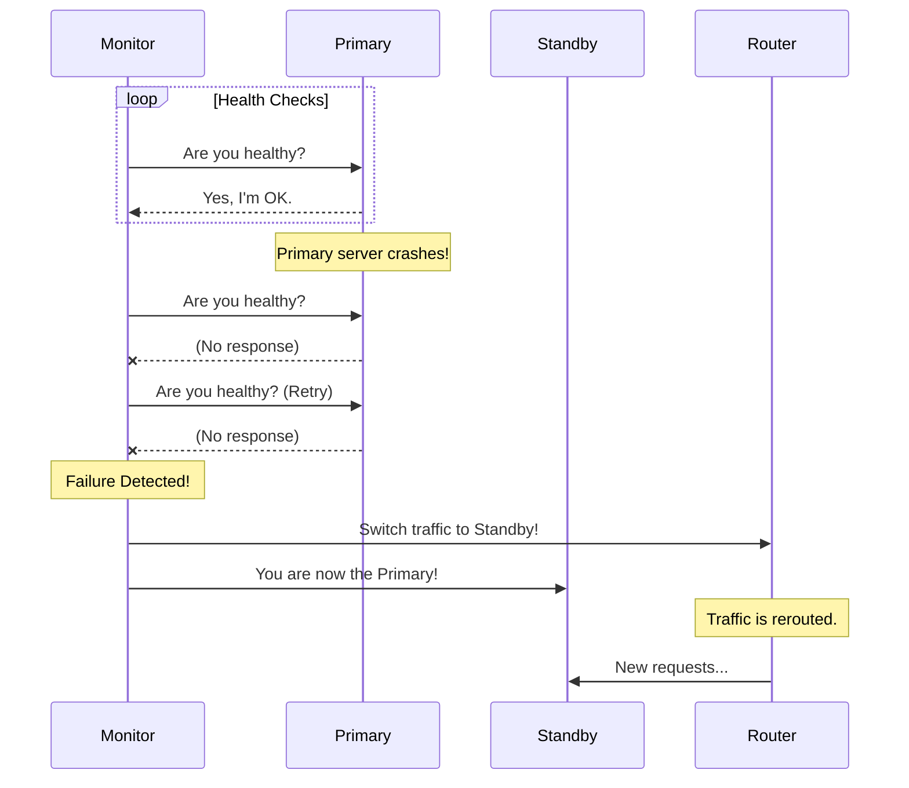
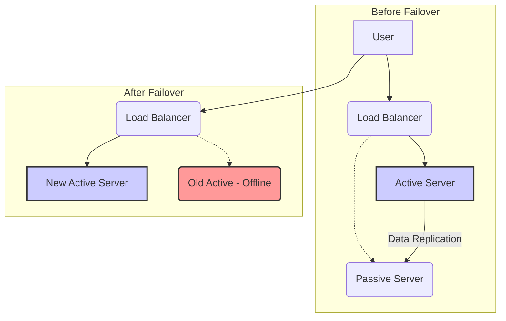
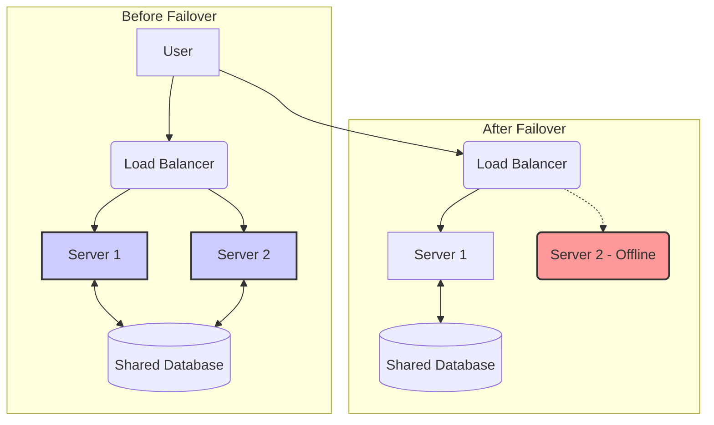

## System Design: Automatic Failover Strategies for High Availability

In a perfect world, servers would run forever without issue. In the real world, hardware fails, networks drop, and software crashes. For any critical system, simply hoping for the best is not a strategy. To build highly available services that can withstand such failures, you need **Automatic Failover**.

Automatic failover is the process by which a system automatically detects the failure of a component and switches to a redundant or standby component without any human intervention. The goal is to minimize downtime and maintain service continuity.

### The Core Components of Automatic Failover

Any automatic failover system consists of two key parts:

1.  **Failure Detection:** How does the system know that a component has failed? This is typically done through **health checks**. A monitoring system constantly pings the primary component. If it fails to respond correctly after a certain number of attempts, it's declared "unhealthy."
2.  **Failover Mechanism:** Once a failure is detected, what happens next? The system must have a way to reroute traffic or promote a standby component to take over the primary's responsibilities.



### Strategy 1: Active-Passive Failover

This is the most common and straightforward failover strategy. It's also known as "Primary-Backup" or "Master-Slave."

-   **Active (Primary) Server:** Handles all incoming traffic.
-   **Passive (Standby) Server:** Sits idle, ready to take over. It does not handle any traffic but is kept up-to-date with the primary server, often through data replication.

When the primary server fails, the failover mechanism promotes the passive server to become the new active server and redirects all traffic to it.



**Pros:**
-   **Simplicity:** Relatively easy to understand and implement.
-   **No Data Conflicts:** Since only one server is writing data at any given time, there are no risks of data conflicts.

**Cons:**
-   **Wasted Resources:** The passive server is idle most of the time, which can be costly. You are paying for hardware that isn't actively serving users.
-   **Failover Time:** There can be a small delay (from seconds to minutes) during the failover process as the standby server is promoted and traffic is rerouted.

### Strategy 2: Active-Active Failover

In an active-active setup, there is no concept of a "standby" server. All servers are active and are simultaneously handling a portion of the traffic.

-   **Multiple Active Servers:** A load balancer distributes traffic across all available servers.
-   **Shared State:** All servers must be able to access and update a shared state, typically through a distributed database or a replicated data store.

If one server fails, the load balancer simply stops sending traffic to it. The remaining active servers absorb the failed server's share of the load.



**Pros:**
-   **High Efficiency:** All resources are actively used, providing better value for money.
-   **Instant Failover:** Failover is typically seamless and instantaneous from the user's perspective, as the load balancer just needs to adjust the traffic distribution.
-   **Improved Performance:** Having multiple active servers can improve overall application performance and latency.

**Cons:**
-   **Complexity:** Significantly more complex to design and manage. Ensuring data consistency across all active nodes is a major challenge.
-   **Risk of Cascading Failures:** If one server fails, the load on the remaining servers increases. If they are not sufficiently over-provisioned, this could lead to a chain reaction of failures.

### Go Example: Simple Active-Passive Failover Logic

This example simulates a simple monitoring system that performs health checks and triggers a failover. It doesn't involve real servers but demonstrates the core logic.

```go
package main

import (
	"fmt"
	"sync"
	"time"
)

// Server represents a server that can be healthy or unhealthy.
type Server struct {
	Name      string
	IsHealthy bool
	mu        sync.RWMutex
}

// HealthCheck simulates checking the server's health.
func (s *Server) HealthCheck() bool {
	s.mu.RLock()
	defer s.mu.RUnlock()
	return s.IsHealthy
}

// SetHealth changes the server's health status.
func (s *Server) SetHealth(status bool) {
	s.mu.Lock()
	s.IsHealthy = status
	s.mu.Unlock()
	fmt.Printf("Server '%s' is now %s\n", s.Name, map[bool]string{true: "Healthy", false: "Unhealthy"}[status])
}

// Cluster manages the active and passive servers.
type Cluster struct {
	Active  *Server
	Passive *Server
	mu      sync.Mutex
}

// Failover promotes the passive server to active.
func (c *Cluster) Failover() {
	c.mu.Lock()
	defer c.mu.Unlock()

	if c.Active.HealthCheck() {
		// Active server is fine, no need to failover.
		return
	}

	fmt.Println("!!! Failure Detected! Initiating failover... !!!")
	c.Active, c.Passive = c.Passive, c.Active
	fmt.Printf("'%s' is now the ACTIVE server.\n", c.Active.Name)
}

func main() {
	primary := &Server{Name: "Server-A", IsHealthy: true}
	standby := &Server{Name: "Server-B", IsHealthy: true}

	cluster := &Cluster{
		Active:  primary,
		Passive: standby,
	}

	// Start a monitor goroutine
	go func() {
		for {
			time.Sleep(2 * time.Second)
			fmt.Printf("Monitoring... Active server is '%s'. Checking health...\n", cluster.Active.Name)
			if !cluster.Active.HealthCheck() {
				cluster.Failover()
			}
		}
	}()

	// --- Simulate a failure ---
	fmt.Printf("Initial state: Active is '%s'\n", cluster.Active.Name)
	time.Sleep(5 * time.Second)

	fmt.Println("\n--- SIMULATING PRIMARY SERVER FAILURE ---")
	primary.SetHealth(false)

	// The monitor will detect the failure and trigger a failover.
	time.Sleep(5 * time.Second)
	fmt.Printf("Current state: Active is '%s'\n", cluster.Active.Name)

	// --- Simulate recovery ---
	fmt.Println("\n--- SIMULATING ORIGINAL SERVER RECOVERY ---")
	primary.SetHealth(true)
	// In a real system, you might have a "failback" process,
	// but often the new primary remains active to avoid another disruption.
	fmt.Printf("'%s' is healthy again, but remains the passive server.\n", primary.Name)

	time.Sleep(5 * time.Second)
}
```

### Conclusion

Automatic failover is not a luxury; it's a necessity for any system that requires high availability. The choice between an **active-passive** and an **active-active** strategy depends on your specific needs for cost, performance, and complexity.

-   **Active-passive** is simpler and safer, making it a great starting point for many applications.
-   **Active-active** offers superior performance and resource utilization but requires careful design to handle the complexities of distributed state.

Regardless of the strategy, a robust health checking and monitoring system is the foundation upon which any successful failover mechanism is built.
---
