## Introduction: The Engine Under the Hood

Every database needs a storage engine—the underlying component responsible for storing, retrieving, and managing data on disk. For decades, the **B-Tree** has been the undisputed champion, powering nearly every relational database from MySQL to PostgreSQL to SQL Server.

However, the rise of Big Data and write-intensive workloads led to the development of an alternative: the **Log-Structured Merge-Tree (LSM-Tree)**. Today, LSM-Trees power many of the world's largest NoSQL databases, including Cassandra, RocksDB, and Bigtable.

Understanding the fundamental differences between these two data structures is key to choosing the right database for your workload. This is a battle of two different philosophies: in-place updates vs. append-only logs.

## The B-Tree: Optimized for Reads

A B-Tree is a self-balancing tree data structure that keeps data sorted and allows for efficient lookups, insertions, deletions, and sequential access. It's the workhorse of traditional relational databases.

### How it Works

*   **Structure:** Data is stored in fixed-size blocks or **pages**. The tree has a root page, internal pages (which contain pointers to other pages), and leaf pages (which contain the actual data).
*   **In-Place Updates:** When you write or update data, the B-Tree finds the specific page on disk where the data should live and modifies it directly. If a page becomes full, it is split into two pages, and the parent page is updated to point to both.
*   **Read Path:** To find a piece of data, you traverse the tree from the root down to the correct leaf page. This is very efficient, typically requiring only a few disk seeks.

```mermaid
flowchart TD
    %% Improved B-Tree read flow for key lookup (key=65)
    subgraph BT["B-Tree Structure"]
        style BT fill:#f8f9fb,stroke:#cfd8e3,stroke-width:2
        Root(("Root\n[separator keys: 50]"))
        P1(["Page 1\n(keys 1–49)"])
        P2(["Page 2\n(keys 50–100)"])
        Root -->|keys &lt; 50| P1
        Root -->|keys ≥ 50| P2
    end

    subgraph FLOW["Lookup Process for key 65"]
        style FLOW fill:#fffdfa,stroke:#f0d9c8,stroke-width:2
        Start(["🔍 Request: GET key=65"])
        Start -->|1. Start at root| Root
        Root -->|2. Compare 65 ≥ 50| P2["🎯 Navigate to Page 2\n(keys 50–100)"]
        P2 -->|3. Scan page for key 65| Found["✅ Found key 65\nReturn value"]
    end

    subgraph RESULT["Outcome"]
        style RESULT fill:#f0faf4,stroke:#a3c7a8
        Found -->|4. Response| Response["📄 Value returned to client"]
    end
```



The B-Tree's design is heavily optimized for **read performance**. Finding a single key or scanning a range of keys is extremely fast. However, its reliance on in-place updates makes writes more complex and slower.

## The LSM-Tree: Optimized for Writes

As we saw with log-structured storage, an LSM-Tree is designed for one primary goal: to make writes as fast as possible by avoiding random disk I/O.

### How it Works

*   **Structure:** An LSM-Tree consists of multiple components.
    1.  **Memtable:** An in-memory balanced tree (like a Red-Black Tree) that receives all new writes.
    2.  **Write-Ahead Log (WAL):** A log file on disk where every write is immediately appended for durability.
    3.  **SSTables (Sorted String Tables):** When the Memtable reaches a certain size, it is flushed to disk as a new, immutable, sorted file called an SSTable.
*   **Append-Only Writes:** All writes go directly to the in-memory Memtable and the WAL. This is extremely fast.
*   **Compaction:** In the background, a **compaction** process continuously merges smaller SSTables into larger ones, cleaning up obsolete data (updated or deleted records) in the process.
*   **Read Path:** To find a key, the database must check the Memtable first, and then search through the hierarchy of SSTables on disk (from newest to oldest), as the key could be in any of them.


## Head-to-Head Comparison

| Aspect | B-Tree | LSM-Tree | Winner |
| :--- | :--- | :--- | :--- |
| **Write Performance** | Slower. Requires random I/O to find and update pages. Can cause cascading page splits. | **Blazing fast.** All writes are sequential appends to a log and writes to memory. | **LSM-Tree** |
| **Read Performance** | **Excellent.** Point reads are very fast (logarithmic time). Range scans are efficient as data is sorted in leaf pages. | Slower. A single read might have to check multiple files (Memtable + several SSTables) on disk. | **B-Tree** |
| **Storage Amplification** | Low. Data is generally stored once. | High. The same key can exist in multiple SSTables until compaction cleans it up. This is called **space amplification**. | **B-Tree** |
| **Write Amplification** | High. A single small update might cause a cascade of page splits and re-writes (read-modify-write). | Low write amplification at ingest, but high during compaction. The same data gets re-written many times as it's merged into new SSTables. | **It's complicated** |
| **Compaction** | Not required in the same way. Page splits and merges happen on the fly. | **Essential but expensive.** Compaction runs in the background and consumes significant I/O and CPU, which can impact foreground performance. | **B-Tree** |
| **Use Case** | Read-heavy workloads. Traditional relational databases (OLTP). | Write-heavy workloads. Big Data, time-series, logging, analytics. | **Depends** |

### The Amplification Problem

*   **Read Amplification (LSM-Tree):** One logical read from the database may require multiple physical reads from disk to find the key. Bloom filters are often used to mitigate this by quickly checking if a key *might* exist in an SSTable.
*   **Write Amplification (B-Tree & LSM-Tree):** One logical write from the application results in multiple physical writes to storage. In B-Trees, it's due to page splits. In LSM-Trees, it's due to compaction. This is a major concern for SSDs, which have a finite number of write cycles.
*   **Space Amplification (LSM-Tree):** The database uses more disk space than the logical size of the data due to obsolete records waiting for compaction.

## Which One Should You Choose?

The choice depends entirely on your application's workload.

*   **Choose a B-Tree-based database (like PostgreSQL, MySQL, Oracle) if:**
    *   Your workload is **read-heavy**.
    *   You need strong transactional guarantees and consistency (OLTP systems).
    *   You have a predictable data size and low write volume.
    *   You frequently perform range scans on sorted data.

*   **Choose an LSM-Tree-based database (like Cassandra, ScyllaDB, RocksDB, InfluxDB) if:**
    *   Your workload is **write-heavy**.
    *   You are ingesting a high volume of data, such as logs, metrics, or IoT sensor data.
    *   Read performance is less critical, or reads are mostly for recent data.
    *   You can tolerate higher read latency and eventual consistency.

## Go Example: Conceptual Write Path Difference

This code doesn't implement the full data structures but illustrates the philosophical difference in the write path.

```go
package main

import "fmt"

// --- B-Tree Conceptual Write ---
type BTreePage struct {
	data map[string]string
}

func (p *BTreePage) write(key, value string) {
	fmt.Printf("B-TREE: Seeking to page, performing in-place update for key '%s'.\n", key)
	p.data[key] = value // Simplified: this is a random write
}

// --- LSM-Tree Conceptual Write ---
type LSMTree struct {
	memtable map[string]string
	wal      *WAL // Write-Ahead Log
}

func (l *LSMTree) write(key, value string) {
	fmt.Printf("LSM-TREE: Writing key '%s' to in-memory memtable and appending to WAL.\n", key)
	l.wal.append(key, value) // Sequential write
	l.memtable[key] = value  // In-memory write
}

// --- Dummy WAL for illustration ---
type WAL struct{}
func (w *WAL) append(k, v string) {}


func main() {
	// B-Tree write involves finding the right spot on "disk" and updating it.
	bpage := &BTreePage{data: make(map[string]string)}
	bpage.write("user:123", "Alice")
	bpage.write("user:123", "Alicia") // Overwrites the same conceptual location

	fmt.Println("---")

	// LSM-Tree write is always to memory and an append-only log.
	lsm := &LSMTree{memtable: make(map[string]string), wal: &WAL{}}
	lsm.write("user:123", "Alice")
	lsm.write("user:123", "Alicia") // Writes a new version, old one is still in the log (until compaction)
}
```

## Conclusion

The B-Tree and the LSM-Tree represent two brilliant but fundamentally different solutions to the problem of data storage. B-Trees are reliable, read-optimized workhorses that excel in the world of transactional, relational data. LSM-Trees are write-optimized powerhouses designed for the scale and velocity of modern Big Data. There is no single "better" data structure; there is only the right data structure for the job.
