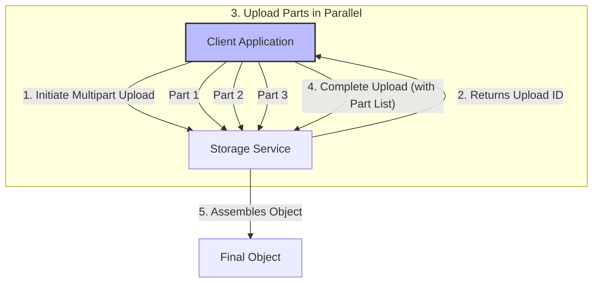
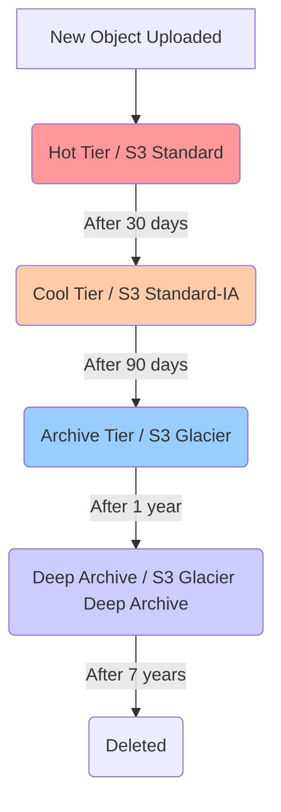
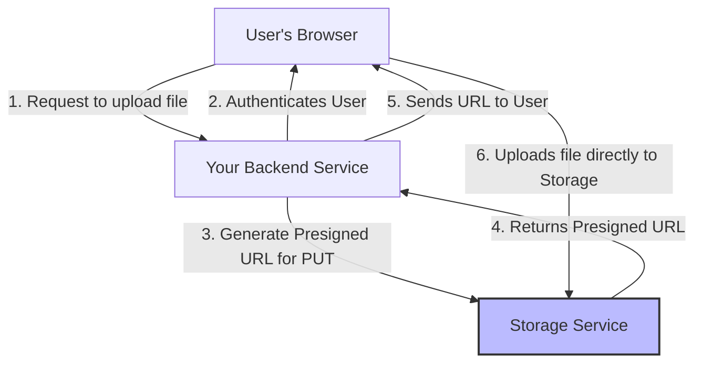

While "object storage" describes the overall architecture, the term **"Blob Storage"** is often used to refer to the actual data being stored—the **B**inary **L**arge **Ob**jects. Blobs are the files, images, videos, backups, and logs that make up the bulk of the world's unstructured data.

Effectively using blob storage (like Amazon S3, Azure Blob Storage, or Google Cloud Storage) involves more than just uploading files. Several common patterns have emerged to handle large files efficiently, optimize for cost, and serve data to users in a scalable way.

### 1. Pattern: Multipart Upload for Large Files

Uploading a multi-gigabyte file as a single stream is risky. A small network interruption could force you to restart the entire upload from the beginning. The **Multipart Upload** pattern solves this by breaking a large file into smaller, independent chunks.

**How it works:**

1.  **Initiate**: Your application tells the storage service that it wants to start a multipart upload. The service responds with a unique `Upload ID`.
2.  **Upload Parts**: Your application uploads the file in smaller, numbered parts (e.g., 10MB chunks). Each part is uploaded independently, and you can even upload them in parallel to maximize bandwidth. If a single part fails, you only need to retry that specific chunk.
3.  **Complete**: Once all parts are uploaded, your application sends a "complete" request to the service, providing the `Upload ID` and the list of part numbers and their corresponding ETags (a hash of the part's content).
4.  **Assemble**: The storage service then assembles these parts on the backend to create the final object.

**Diagram: Multipart Upload Process**



**Benefits:**
*   **Resilience**: Recovers easily from network errors.
*   **Performance**: Parallel uploads can significantly speed up the process.
*   **Pause and Resume**: You can pause and resume uploads by saving the state of which parts have been successfully uploaded.

### 2. Pattern: Tiered Storage for Cost Optimization

Not all data is accessed with the same frequency. Storing rarely accessed archival data on the same high-performance storage tier as frequently accessed "hot" data is not cost-effective. All major cloud providers offer different **storage tiers** or **storage classes**.

*   **Hot Tier (Standard)**: For frequently accessed data. Offers the lowest latency but has the highest storage cost. Examples: S3 Standard, Azure Hot.
*   **Cool Tier (Infrequent Access)**: For data that is accessed less frequently but requires immediate retrieval when needed. Has a lower storage cost but a per-GB data retrieval fee. Examples: S3 Standard-IA, Azure Cool.
*   **Archive Tier**: For long-term archival and digital preservation. Extremely low storage cost, but data retrieval is not instant and can take several minutes to hours. Examples: S3 Glacier, Azure Archive.
*   **Deep Archive Tier**: The absolute lowest storage cost, but retrieval can take 12 hours or more. Example: S3 Glacier Deep Archive.

**Lifecycle Policies:**
The real power of tiered storage comes from **lifecycle policies**. These are rules you configure at the bucket level to automatically transition objects between tiers based on their age.

**Diagram: Automatic Tiering with Lifecycle Policies**



This pattern automates cost savings by ensuring you only pay for high-performance storage when you actually need it.

### 3. Pattern: Generating Presigned URLs for Secure Access

A common requirement is to allow a user to temporarily access a private object without making the object public or managing complex access credentials on the client side. For example, allowing a user to download a receipt they purchased or upload a profile picture.

A **presigned URL** is a URL that provides temporary access to a specific object. It's generated by an authenticated backend service and signed with its security credentials. The URL includes a signature and an expiration time. Anyone with the URL can access the object with the permissions of the service that created it, but only until it expires.

**Diagram: Secure Upload/Download with Presigned URLs**



This pattern is secure and scalable because the data transfer happens directly between the client and the storage service, bypassing your backend and offloading the bandwidth burden.

### Conceptual Go Example: Uploading a File to S3

This example demonstrates a simple file upload using the official AWS SDK for Go. It doesn't implement multipart upload for simplicity, but the SDK has high-level managers that can handle that for you automatically.

```go
package main

import (
	"context"
	"fmt"
	"os"

	"github.com/aws/aws-sdk-go-v2/aws"
	"github.com/aws/aws-sdk-go-v2/config"
	"github.com/aws/aws-sdk-go-v2/service/s3"
)

// UploadFile uploads a file to an S3 bucket.
func UploadFile(cfg aws.Config, bucketName, objectKey, filePath string) error {
	// Open the file for reading.
	file, err := os.Open(filePath)
	if err != nil {
		return fmt.Errorf("couldn't open file %v: %v", filePath, err)
	}
	defer file.Close()

	// Create an S3 client.
	client := s3.NewFromConfig(cfg)

	// Upload the file.
	_, err = client.PutObject(context.TODO(), &s3.PutObjectInput{
		Bucket: aws.String(bucketName),
		Key:    aws.String(objectKey),
		Body:   file,
	})
	if err != nil {
		return fmt.Errorf("couldn't upload file %v: %v", filePath, err)
	}

	return nil
}

func main() {
	// --- Configuration ---
	bucketName := "my-unique-bucket-name" // Change to your bucket name
	objectKey := "my-test-file.txt"      // The key (name) for the object in S3
	filePath := "hello.txt"              // The local file to upload
	awsRegion := "us-east-1"             // Change to your desired region

	// Create a dummy file to upload.
	if err := os.WriteFile(filePath, []byte("Hello, Blob Storage!"), 0644); err != nil {
		fmt.Printf("Couldn't create dummy file: %v\n", err)
		return
	}
	defer os.Remove(filePath)

	// Load the AWS configuration from environment variables or ~/.aws/credentials.
	cfg, err := config.LoadDefaultConfig(context.TODO(), config.WithRegion(awsRegion))
	if err != nil {
		fmt.Printf("Unable to load AWS config: %v\n", err)
		return
	}

	fmt.Printf("Uploading %s to S3 bucket %s with key %s...\n", filePath, bucketName, objectKey)

	err = UploadFile(cfg, bucketName, objectKey, filePath)
	if err != nil {
		fmt.Printf("Error uploading file: %v\n", err)
		return
	}

	fmt.Println("Upload successful!")
}
```

### Conclusion

Blob storage is a simple yet powerful service for handling vast amounts of unstructured data. By applying patterns like multipart uploads for large files, tiered storage for cost management, and presigned URLs for secure access, you can build highly scalable, resilient, and cost-effective applications. These patterns abstract away the complexity of distributed storage, allowing developers to interact with a seemingly infinite and durable data store through a simple API.