# System Design Fundamentals: Cache Invalidation Strategies Explained

Cache invalidation is one of the hardest problems in computer science. Stale data in cache can cause bugs, while aggressive invalidation hurts performance. Let's explore strategies to keep cache fresh while maintaining high hit rates.

## Why Cache Invalidation Matters

**Without Proper Invalidation:**


**With Proper Invalidation:**

```mermaid
sequenceDiagram
    participant Admin as Admin
    participant App as Application
    participant Cache as Cache
    participant DB as Database
    participant User as User
    
    Note over DB: Price: $100
    
    Admin->>App: Update Price → $75
    App->>DB: Write $75
    DB-->>App: Success
    
    App->>Cache: Invalidate "product:123"
    Cache->>Cache: Remove entry
    Cache-->>App: Invalidated
    
    User->>Cache: Get Product Price
    Cache->>DB: Cache miss → Load
    DB-->>Cache: $75
    Cache-->>User: ✅ $75 (FRESH!)
```



## Invalidation Strategies Overview


## Basic Types

```go
package main

import (
    "context"
    "errors"
    "fmt"
    "strings"
    "sync"
    "sync/atomic"
    "time"
)

// CacheEntry represents a cached item with expiration
type CacheEntry struct {
    Key        string
    Value      interface{}
    CreatedAt  time.Time
    ExpiresAt  time.Time
    AccessedAt time.Time
    AccessCount int64
    Tags       []string
}

// InvalidationStats tracks invalidation metrics
type InvalidationStats struct {
    TTLExpirations      int64
    ManualInvalidations int64
    PatternInvalidations int64
    EventInvalidations  int64
    RefreshAhead        int64
    TotalEntries        int64
}

// InvalidationEvent represents a cache invalidation event
type InvalidationEvent struct {
    Keys      []string
    Pattern   string
    Tags      []string
    Timestamp time.Time
    Reason    string
}
```

## Strategy 1: TTL-Based Invalidation

**How it works:** Entries automatically expire after time-to-live duration.


```go
// TTLCache implements time-to-live based expiration
type TTLCache struct {
    cache          map[string]*CacheEntry
    defaultTTL     time.Duration
    cleanupInterval time.Duration
    stopCleanup    chan struct{}
    mutex          sync.RWMutex
    stats          InvalidationStats
}

func NewTTLCache(defaultTTL, cleanupInterval time.Duration) *TTLCache {
    tc := &TTLCache{
        cache:          make(map[string]*CacheEntry),
        defaultTTL:     defaultTTL,
        cleanupInterval: cleanupInterval,
        stopCleanup:    make(chan struct{}),
    }
    
    // Start active expiration
    go tc.activeExpiration()
    
    return tc
}

// Set adds entry with TTL
func (tc *TTLCache) Set(key string, value interface{}, ttl time.Duration) {
    if ttl == 0 {
        ttl = tc.defaultTTL
    }
    
    tc.mutex.Lock()
    defer tc.mutex.Unlock()
    
    now := time.Now()
    entry := &CacheEntry{
        Key:        key,
        Value:      value,
        CreatedAt:  now,
        ExpiresAt:  now.Add(ttl),
        AccessedAt: now,
        AccessCount: 0,
    }
    
    tc.cache[key] = entry
    atomic.AddInt64(&tc.stats.TotalEntries, 1)
    
    fmt.Printf("TTL Cache: Set '%s' (expires in %v)\n", key, ttl)
}

// Get retrieves entry with passive expiration check
func (tc *TTLCache) Get(key string) (interface{}, bool) {
    tc.mutex.RLock()
    entry, exists := tc.cache[key]
    tc.mutex.RUnlock()
    
    if !exists {
        return nil, false
    }
    
    // Passive expiration: check on access
    if time.Now().After(entry.ExpiresAt) {
        tc.mutex.Lock()
        delete(tc.cache, key)
        atomic.AddInt64(&tc.stats.TTLExpirations, 1)
        atomic.AddInt64(&tc.stats.TotalEntries, -1)
        tc.mutex.Unlock()
        
        fmt.Printf("TTL Cache: Passive expiration of '%s'\n", key)
        return nil, false
    }
    
    // Update access stats
    tc.mutex.Lock()
    entry.AccessedAt = time.Now()
    atomic.AddInt64(&entry.AccessCount, 1)
    tc.mutex.Unlock()
    
    return entry.Value, true
}

// activeExpiration periodically removes expired entries
func (tc *TTLCache) activeExpiration() {
    ticker := time.NewTicker(tc.cleanupInterval)
    defer ticker.Stop()
    
    for {
        select {
        case <-ticker.C:
            tc.cleanupExpired()
            
        case <-tc.stopCleanup:
            return
        }
    }
}

// cleanupExpired removes all expired entries
func (tc *TTLCache) cleanupExpired() {
    tc.mutex.Lock()
    defer tc.mutex.Unlock()
    
    now := time.Now()
    expired := make([]string, 0)
    
    for key, entry := range tc.cache {
        if now.After(entry.ExpiresAt) {
            expired = append(expired, key)
        }
    }
    
    for _, key := range expired {
        delete(tc.cache, key)
        atomic.AddInt64(&tc.stats.TTLExpirations, 1)
        atomic.AddInt64(&tc.stats.TotalEntries, -1)
    }
    
    if len(expired) > 0 {
        fmt.Printf("TTL Cache: Active expiration removed %d entries\n", len(expired))
    }
}

// Stop stops background cleanup
func (tc *TTLCache) Stop() {
    close(tc.stopCleanup)
}
```

**TTL Behavior:**

```
Timeline:

T0:   Set("user:1", data, 5min) → Expires at T5
T1:   Get("user:1") → ✅ Valid (4min remaining)
T3:   Get("user:1") → ✅ Valid (2min remaining)
T5:   [EXPIRATION]
T6:   Get("user:1") → ❌ Expired (passive check)
      → Remove from cache
      → Load from database

Background Cleanup (every 1 min):
T1: Scan → No expired entries
T2: Scan → No expired entries
T5: Scan → Found expired "user:1" → Remove (active cleanup)
```

## Strategy 2: Event-Based Invalidation

**How it works:** Invalidate cache when data changes in database.

```mermaid
sequenceDiagram
    participant App as Application
    participant Cache as Cache
    participant DB as Database
    participant Event as Event Bus
    
    Note over App,Event: Update Flow
    
    App->>DB: Update user:1
    DB-->>App: Success
    
    App->>Event: Publish "user.updated"
    Event->>Cache: Invalidate user:1
    
    Cache->>Cache: Remove entry
    Cache-->>Event: Invalidated
    
    Note over App,Cache: Next read will fetch<br/>fresh data from DB
    
    App->>Cache: Get user:1
    Cache->>Cache: Cache miss
    Cache->>DB: Load fresh data
    DB-->>Cache: Latest data
    Cache-->>App: ✅ Fresh data
```



```go
// EventBasedCache invalidates on events
type EventBasedCache struct {
    *TTLCache
    eventBus      *EventBus
    subscriptions map[string][]string // event -> keys to invalidate
    subMutex      sync.RWMutex
}

type EventBus struct {
    subscribers map[string][]chan InvalidationEvent
    mutex       sync.RWMutex
}

func NewEventBus() *EventBus {
    return &EventBus{
        subscribers: make(map[string][]chan InvalidationEvent),
    }
}

func (eb *EventBus) Subscribe(eventType string) chan InvalidationEvent {
    eb.mutex.Lock()
    defer eb.mutex.Unlock()
    
    ch := make(chan InvalidationEvent, 10)
    eb.subscribers[eventType] = append(eb.subscribers[eventType], ch)
    
    return ch
}

func (eb *EventBus) Publish(eventType string, event InvalidationEvent) {
    eb.mutex.RLock()
    defer eb.mutex.RUnlock()
    
    if subscribers, exists := eb.subscribers[eventType]; exists {
        for _, ch := range subscribers {
            select {
            case ch <- event:
            default:
                // Skip if channel full
            }
        }
    }
}

func NewEventBasedCache(defaultTTL, cleanupInterval time.Duration) *EventBasedCache {
    ebc := &EventBasedCache{
        TTLCache:      NewTTLCache(defaultTTL, cleanupInterval),
        eventBus:      NewEventBus(),
        subscriptions: make(map[string][]string),
    }
    
    // Start event listener
    go ebc.listenForEvents()
    
    return ebc
}

// SetWithEvent registers entry with event-based invalidation
func (ebc *EventBasedCache) SetWithEvent(key string, value interface{}, ttl time.Duration, eventType string) {
    ebc.TTLCache.Set(key, value, ttl)
    
    // Register event subscription
    ebc.subMutex.Lock()
    ebc.subscriptions[eventType] = append(ebc.subscriptions[eventType], key)
    ebc.subMutex.Unlock()
    
    fmt.Printf("Event Cache: Set '%s' (invalidates on '%s' event)\n", key, eventType)
}

// InvalidateByEvent triggers invalidation for event
func (ebc *EventBasedCache) InvalidateByEvent(eventType string, reason string) {
    event := InvalidationEvent{
        Timestamp: time.Now(),
        Reason:    reason,
    }
    
    ebc.eventBus.Publish(eventType, event)
    fmt.Printf("Event Cache: Published '%s' event (%s)\n", eventType, reason)
}

// listenForEvents handles invalidation events
func (ebc *EventBasedCache) listenForEvents() {
    // Subscribe to all event types
    channels := make(map[string]chan InvalidationEvent)
    
    for {
        time.Sleep(100 * time.Millisecond)
        
        ebc.subMutex.RLock()
        for eventType := range ebc.subscriptions {
            if _, exists := channels[eventType]; !exists {
                channels[eventType] = ebc.eventBus.Subscribe(eventType)
                
                // Listen on channel
                go func(et string, ch chan InvalidationEvent) {
                    for event := range ch {
                        ebc.handleInvalidationEvent(et, event)
                    }
                }(eventType, channels[eventType])
            }
        }
        ebc.subMutex.RUnlock()
    }
}

// handleInvalidationEvent processes invalidation
func (ebc *EventBasedCache) handleInvalidationEvent(eventType string, event InvalidationEvent) {
    ebc.subMutex.RLock()
    keys := ebc.subscriptions[eventType]
    ebc.subMutex.RUnlock()
    
    ebc.mutex.Lock()
    for _, key := range keys {
        if _, exists := ebc.cache[key]; exists {
            delete(ebc.cache, key)
            atomic.AddInt64(&ebc.stats.EventInvalidations, 1)
            atomic.AddInt64(&ebc.stats.TotalEntries, -1)
            
            fmt.Printf("Event Cache: Invalidated '%s' (event: %s, reason: %s)\n",
                key, eventType, event.Reason)
        }
    }
    ebc.mutex.Unlock()
}

// InvalidateKey manually invalidates specific key
func (ebc *EventBasedCache) InvalidateKey(key string) {
    ebc.mutex.Lock()
    defer ebc.mutex.Unlock()
    
    if _, exists := ebc.cache[key]; exists {
        delete(ebc.cache, key)
        atomic.AddInt64(&ebc.stats.ManualInvalidations, 1)
        atomic.AddInt64(&ebc.stats.TotalEntries, -1)
        
        fmt.Printf("Event Cache: Manually invalidated '%s'\n", key)
    }
}
```

**Event-Based Example:**

```
Cache State:
  user:1 → {name: "Alice"} [subscribes to "user.updated"]
  user:2 → {name: "Bob"}   [subscribes to "user.updated"]
  post:1 → {title: "..."}  [subscribes to "post.updated"]

Event Flow:
  1. Database: UPDATE users SET name='Alice Smith' WHERE id=1
  2. Application: Publish event "user.updated"
  3. Cache: Receives event → Invalidate user:1, user:2
  4. Next Get(user:1) → Cache miss → Load fresh data
```

## Strategy 3: Pattern-Based Invalidation

**How it works:** Invalidate multiple keys matching pattern.


```go
// PatternCache supports pattern-based invalidation
type PatternCache struct {
    *TTLCache
}

func NewPatternCache(defaultTTL, cleanupInterval time.Duration) *PatternCache {
    return &PatternCache{
        TTLCache: NewTTLCache(defaultTTL, cleanupInterval),
    }
}

// SetWithTags stores entry with tags
func (pc *PatternCache) SetWithTags(key string, value interface{}, ttl time.Duration, tags []string) {
    if ttl == 0 {
        ttl = pc.defaultTTL
    }
    
    pc.mutex.Lock()
    defer pc.mutex.Unlock()
    
    now := time.Now()
    entry := &CacheEntry{
        Key:        key,
        Value:      value,
        CreatedAt:  now,
        ExpiresAt:  now.Add(ttl),
        AccessedAt: now,
        Tags:       tags,
    }
    
    pc.cache[key] = entry
    atomic.AddInt64(&pc.stats.TotalEntries, 1)
    
    fmt.Printf("Pattern Cache: Set '%s' with tags %v\n", key, tags)
}

// InvalidatePattern removes entries matching pattern
func (pc *PatternCache) InvalidatePattern(pattern string) int {
    pc.mutex.Lock()
    defer pc.mutex.Unlock()
    
    matched := make([]string, 0)
    
    for key := range pc.cache {
        if pc.matchesPattern(key, pattern) {
            matched = append(matched, key)
        }
    }
    
    for _, key := range matched {
        delete(pc.cache, key)
        atomic.AddInt64(&pc.stats.PatternInvalidations, 1)
        atomic.AddInt64(&pc.stats.TotalEntries, -1)
    }
    
    fmt.Printf("Pattern Cache: Invalidated %d entries matching '%s'\n", len(matched), pattern)
    return len(matched)
}

// InvalidateByTag removes entries with specific tag
func (pc *PatternCache) InvalidateByTag(tag string) int {
    pc.mutex.Lock()
    defer pc.mutex.Unlock()
    
    matched := make([]string, 0)
    
    for key, entry := range pc.cache {
        for _, entryTag := range entry.Tags {
            if entryTag == tag {
                matched = append(matched, key)
                break
            }
        }
    }
    
    for _, key := range matched {
        delete(pc.cache, key)
        atomic.AddInt64(&pc.stats.PatternInvalidations, 1)
        atomic.AddInt64(&pc.stats.TotalEntries, -1)
    }
    
    fmt.Printf("Pattern Cache: Invalidated %d entries with tag '%s'\n", len(matched), tag)
    return len(matched)
}

// matchesPattern checks if key matches wildcard pattern
func (pc *PatternCache) matchesPattern(key, pattern string) bool {
    // Simple wildcard matching: "user:*" matches "user:1", "user:2", etc.
    if strings.HasSuffix(pattern, "*") {
        prefix := strings.TrimSuffix(pattern, "*")
        return strings.HasPrefix(key, prefix)
    }
    
    // Exact match
    return key == pattern
}

// InvalidateByPrefix removes all keys with prefix
func (pc *PatternCache) InvalidateByPrefix(prefix string) int {
    return pc.InvalidatePattern(prefix + "*")
}
```

**Pattern Invalidation Examples:**

```
Cache Contents:
  user:1        → {name: "Alice"}
  user:2        → {name: "Bob"}
  user:profile:1 → {bio: "..."}
  session:abc   → {data: "..."}
  session:xyz   → {data: "..."}
  product:10    → {price: 99} [tags: ["product", "category:electronics"]]
  product:11    → {price: 149} [tags: ["product", "category:electronics"]]

Pattern Invalidations:
  InvalidatePattern("user:*")
    → Removes: user:1, user:2, user:profile:1

  InvalidatePrefix("session:")
    → Removes: session:abc, session:xyz

  InvalidateByTag("category:electronics")
    → Removes: product:10, product:11
```

## Strategy 4: Refresh-Ahead Cache

**How it works:** Proactively refresh cache before expiration.

```mermaid
sequenceDiagram
    participant User as User
    participant Cache as Cache<br/>+ Refresher
    participant BG as Background<br/>Refresher
    participant DB as Database
    
    Note over Cache: Entry expires in 5 min
    
    User->>Cache: Get("user:1")
    Cache-->>User: Data (TTL: 5 min)
    
    Note over Cache: After 4 min<br/>(80% of TTL)
    
    Cache->>BG: Schedule refresh
    
    BG->>DB: Load fresh data
    DB-->>BG: Latest data
    BG->>Cache: Update cache
    
    Note over Cache: Entry refreshed<br/>New TTL: 5 min
    
    User->>Cache: Get("user:1")
    Cache-->>User: ✅ Fresh data<br/>(no DB hit!)
```



```go
// RefreshAheadCache proactively refreshes entries
type RefreshAheadCache struct {
    *TTLCache
    loader          DataLoader
    refreshThreshold float64 // e.g., 0.8 = refresh at 80% of TTL
    refreshQueue    chan string
    stopRefresh     chan struct{}
}

type DataLoader func(key string) (interface{}, error)

func NewRefreshAheadCache(defaultTTL, cleanupInterval time.Duration, loader DataLoader) *RefreshAheadCache {
    rac := &RefreshAheadCache{
        TTLCache:         NewTTLCache(defaultTTL, cleanupInterval),
        loader:           loader,
        refreshThreshold: 0.8, // Refresh at 80% of TTL
        refreshQueue:     make(chan string, 100),
        stopRefresh:      make(chan struct{}),
    }
    
    // Start refresh workers
    for i := 0; i < 3; i++ {
        go rac.refreshWorker()
    }
    
    return rac
}

// Get with refresh-ahead
func (rac *RefreshAheadCache) Get(key string) (interface{}, bool) {
    rac.mutex.RLock()
    entry, exists := rac.cache[key]
    rac.mutex.RUnlock()
    
    if !exists {
        return nil, false
    }
    
    // Check if expired
    now := time.Now()
    if now.After(entry.ExpiresAt) {
        rac.mutex.Lock()
        delete(rac.cache, key)
        atomic.AddInt64(&rac.stats.TTLExpirations, 1)
        atomic.AddInt64(&rac.stats.TotalEntries, -1)
        rac.mutex.Unlock()
        
        return nil, false
    }
    
    // Check if should refresh ahead
    ttlRemaining := entry.ExpiresAt.Sub(now)
    totalTTL := entry.ExpiresAt.Sub(entry.CreatedAt)
    ttlUsed := float64(totalTTL-ttlRemaining) / float64(totalTTL)
    
    if ttlUsed >= rac.refreshThreshold {
        // Schedule refresh
        select {
        case rac.refreshQueue <- key:
            fmt.Printf("Refresh-Ahead: Scheduled refresh for '%s' (%.0f%% TTL used)\n",
                key, ttlUsed*100)
        default:
            // Queue full, skip
        }
    }
    
    // Update access stats
    rac.mutex.Lock()
    entry.AccessedAt = now
    atomic.AddInt64(&entry.AccessCount, 1)
    rac.mutex.Unlock()
    
    return entry.Value, true
}

// refreshWorker processes refresh queue
func (rac *RefreshAheadCache) refreshWorker() {
    for {
        select {
        case key := <-rac.refreshQueue:
            rac.refreshEntry(key)
            
        case <-rac.stopRefresh:
            return
        }
    }
}

// refreshEntry reloads data from source
func (rac *RefreshAheadCache) refreshEntry(key string) {
    fmt.Printf("Refresh-Ahead: Refreshing '%s'...\n", key)
    
    // Load fresh data
    value, err := rac.loader(key)
    if err != nil {
        fmt.Printf("Refresh-Ahead: Failed to refresh '%s': %v\n", key, err)
        return
    }
    
    // Update cache with fresh data
    rac.mutex.Lock()
    defer rac.mutex.Unlock()
    
    if entry, exists := rac.cache[key]; exists {
        now := time.Now()
        entry.Value = value
        entry.ExpiresAt = now.Add(rac.defaultTTL) // Reset TTL
        
        atomic.AddInt64(&rac.stats.RefreshAhead, 1)
        
        fmt.Printf("Refresh-Ahead: Refreshed '%s' (new TTL: %v)\n", key, rac.defaultTTL)
    }
}

// StopRefresh stops background refresh workers
func (rac *RefreshAheadCache) StopRefresh() {
    close(rac.stopRefresh)
}
```

**Refresh-Ahead Timeline:**

```
Entry Lifecycle with Refresh-Ahead:

T0:  Set("user:1", data) → TTL: 5 min → Expires at T5

T1:  Get("user:1") → ✅ Data (80% TTL remaining)
T2:  Get("user:1") → ✅ Data (60% TTL remaining)
T3:  Get("user:1") → ✅ Data (40% TTL remaining)
T4:  Get("user:1") → ✅ Data (20% TTL remaining)
     → Threshold reached (80% TTL used)
     → Schedule background refresh

T4.5: [BACKGROUND REFRESH]
      → Load fresh data from database
      → Update cache
      → Reset TTL to 5 min (expires at T9.5)

T5:  Original expiration time passed, but entry already refreshed!
T6:  Get("user:1") → ✅ Fresh data (no DB hit!)

Result: User never experiences cache miss or latency!
```

## Complete Demo

```go
// Mock data loader
func mockDataLoader(key string) (interface{}, error) {
    time.Sleep(50 * time.Millisecond) // Simulate DB latency
    return map[string]interface{}{
        "key":       key,
        "loaded_at": time.Now(),
    }, nil
}

func main() {
    fmt.Println("🚀 Starting Cache Invalidation Demo\n")
    
    fmt.Println("=== 1. TTL-Based Invalidation ===\n")
    
    ttlCache := NewTTLCache(2*time.Second, 1*time.Second)
    
    // Set entries with different TTLs
    ttlCache.Set("short", "data1", 2*time.Second)
    ttlCache.Set("long", "data2", 5*time.Second)
    
    fmt.Println("\n--- Immediate access ---")
    if val, exists := ttlCache.Get("short"); exists {
        fmt.Printf("✅ Got 'short': %v\n", val)
    }
    
    fmt.Println("\n--- Wait 3 seconds for expiration ---")
    time.Sleep(3 * time.Second)
    
    if val, exists := ttlCache.Get("short"); !exists {
        fmt.Println("❌ 'short' expired (passive check)")
    }
    
    if val, exists := ttlCache.Get("long"); exists {
        fmt.Printf("✅ 'long' still valid: %v\n", val)
    }
    
    ttlCache.Stop()
    
    fmt.Println("\n\n=== 2. Event-Based Invalidation ===\n")
    
    eventCache := NewEventBasedCache(5*time.Minute, 1*time.Minute)
    
    // Set entries with event subscriptions
    eventCache.SetWithEvent("user:1", "Alice", 5*time.Minute, "user.updated")
    eventCache.SetWithEvent("user:2", "Bob", 5*time.Minute, "user.updated")
    eventCache.SetWithEvent("post:1", "Post data", 5*time.Minute, "post.updated")
    
    time.Sleep(500 * time.Millisecond)
    
    fmt.Println("\n--- Trigger user.updated event ---")
    eventCache.InvalidateByEvent("user.updated", "User data changed")
    
    time.Sleep(500 * time.Millisecond)
    
    fmt.Println("\n--- Check cache state ---")
    if _, exists := eventCache.Get("user:1"); !exists {
        fmt.Println("✅ user:1 invalidated by event")
    }
    if _, exists := eventCache.Get("post:1"); exists {
        fmt.Println("✅ post:1 still cached (different event)")
    }
    
    eventCache.Stop()
    
    fmt.Println("\n\n=== 3. Pattern-Based Invalidation ===\n")
    
    patternCache := NewPatternCache(5*time.Minute, 1*time.Minute)
    
    // Set entries with patterns
    patternCache.Set("user:1", "Alice", 5*time.Minute)
    patternCache.Set("user:2", "Bob", 5*time.Minute)
    patternCache.Set("user:profile:1", "Alice Profile", 5*time.Minute)
    patternCache.Set("session:abc", "Session A", 5*time.Minute)
    patternCache.Set("session:xyz", "Session B", 5*time.Minute)
    
    // Set with tags
    patternCache.SetWithTags("product:10", "Product 10", 5*time.Minute, 
        []string{"product", "category:electronics"})
    patternCache.SetWithTags("product:11", "Product 11", 5*time.Minute,
        []string{"product", "category:electronics"})
    
    fmt.Println("\n--- Invalidate by pattern: user:* ---")
    count := patternCache.InvalidatePattern("user:*")
    fmt.Printf("Invalidated %d entries\n", count)
    
    fmt.Println("\n--- Invalidate by prefix: session: ---")
    count = patternCache.InvalidateByPrefix("session:")
    fmt.Printf("Invalidated %d entries\n", count)
    
    fmt.Println("\n--- Invalidate by tag: category:electronics ---")
    count = patternCache.InvalidateByTag("category:electronics")
    fmt.Printf("Invalidated %d entries\n", count)
    
    patternCache.Stop()
    
    fmt.Println("\n\n=== 4. Refresh-Ahead Cache ===\n")
    
    refreshCache := NewRefreshAheadCache(5*time.Second, 1*time.Second, mockDataLoader)
    
    // Set entry
    refreshCache.Set("user:1", map[string]interface{}{"name": "Alice", "version": 1}, 5*time.Second)
    
    fmt.Println("\n--- Access at different TTL stages ---")
    
    // Access at 0%, 50%, 85%, 90% of TTL
    delays := []time.Duration{0, 2500 * time.Millisecond, 4250 * time.Millisecond, 4500 * time.Millisecond}
    
    for i, delay := range delays {
        time.Sleep(delay)
        if val, exists := refreshCache.Get("user:1"); exists {
            percentage := float64(delay) / float64(5*time.Second) * 100
            fmt.Printf("Access %d (%.0f%% TTL): %v\n", i+1, percentage, val)
        }
        
        if i == 0 {
            time.Sleep(100 * time.Millisecond) // Reset for next
        }
    }
    
    // Wait for refresh to complete
    time.Sleep(1 * time.Second)
    
    fmt.Println("\n--- Stats ---")
    stats := refreshCache.stats
    fmt.Printf("Refresh-Ahead Refreshes: %d\n", stats.RefreshAhead)
    
    refreshCache.StopRefresh()
    refreshCache.Stop()
    
    fmt.Println("\n✅ Cache Invalidation Demo completed!")
}
```

## Strategy Comparison

| Strategy | Pros | Cons | Best For |
|----------|------|------|----------|
| **TTL** | Simple, automatic | May serve stale data | Time-sensitive data |
| **Event-Based** | Immediate consistency | Complex setup | Critical data |
| **Pattern** | Bulk operations | Expensive scans | Related data groups |
| **Refresh-Ahead** | No cache misses | Extra load | Hot data |

## Best Practices

### 1. Combine Multiple Strategies
```go
// Use TTL as fallback + events for precision
cache.SetWithEvent("user:1", data, 10*time.Minute, "user.updated")
// TTL ensures cleanup, events ensure freshness
```

### 2. Set Appropriate TTL
```go
// Frequently changing data: short TTL
sessionCache.Set("session:123", data, 15*time.Minute)

// Rarely changing data: long TTL
configCache.Set("config:app", data, 24*time.Hour)

// Static data: very long TTL
staticCache.Set("country:US", data, 7*24*time.Hour)
```

### 3. Use Tags for Related Data
```go
// Invalidate all user-related entries at once
cache.SetWithTags("user:1:profile", data, 1*time.Hour, []string{"user:1"})
cache.SetWithTags("user:1:settings", data, 1*time.Hour, []string{"user:1"})
cache.SetWithTags("user:1:posts", data, 1*time.Hour, []string{"user:1"})

// Invalidate all in one call
cache.InvalidateByTag("user:1")
```

### 4. Monitor Invalidation Rate
```go
stats := cache.GetStats()
invalidationRate := float64(stats.TTLExpirations + stats.ManualInvalidations) / 
                   float64(stats.TotalEntries)

if invalidationRate > 0.5 {
    log.Warn("High invalidation rate: %.1f%% - adjust TTL", invalidationRate*100)
}
```

## Conclusion

Cache invalidation requires balancing freshness with performance:

- **TTL**: Automatic time-based expiration (passive + active)
- **Event-Based**: Immediate invalidation on data changes
- **Pattern**: Bulk invalidation by wildcard or tags
- **Refresh-Ahead**: Proactive refresh before expiration

Choose strategies based on data characteristics. Use TTL as baseline, add events for critical data, patterns for related data, and refresh-ahead for hot paths. Monitor hit rates and invalidation patterns to optimize TTL values.
