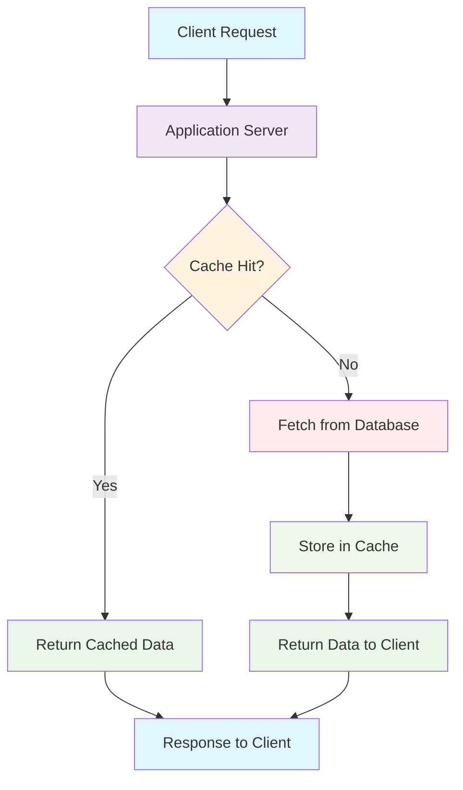
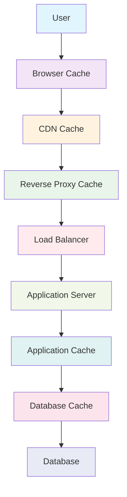
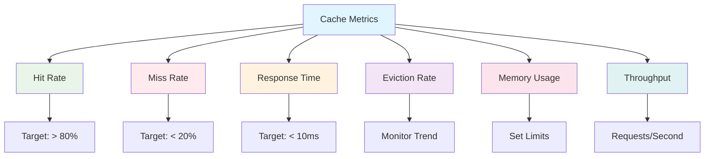

# System Design Fundamentals: Caching

Caching is the practice of storing frequently accessed data in a fast storage layer to reduce response time and system load. It's one of the most effective techniques for improving system performance and scalability.

## What is Caching?

Caching temporarily stores copies of data in locations that are faster to access than the original source. This reduces the time needed to serve requests and decreases load on backend systems.



## Cache Levels

### 1. Browser Cache
Client-side caching in web browsers

### 2. CDN (Content Delivery Network)
Geographically distributed cache servers

### 3. Reverse Proxy Cache
Caching layer between clients and servers

### 4. Application Cache
In-memory cache within application servers

### 5. Database Cache
Cache within database systems



## Caching Strategies

### 1. Cache-Aside (Lazy Loading)

Application manages the cache directly. Data is loaded into cache only when needed.

```python
# Cache-Aside implementation in Python with Redis
import redis
import json
import time
from typing import Optional, Any
from functools import wraps

class CacheAside:
    def __init__(self, redis_client: redis.Redis, default_ttl: int = 3600):
        self.redis = redis_client
        self.default_ttl = default_ttl
    
    def get(self, key: str) -> Optional[Any]:
        """Get data from cache"""
        try:
            data = self.redis.get(key)
            if data:
                return json.loads(data)
            return None
        except Exception as e:
            print(f"Cache get error: {e}")
            return None
    
    def set(self, key: str, value: Any, ttl: Optional[int] = None) -> bool:
        """Set data in cache"""
        try:
            ttl = ttl or self.default_ttl
            serialized_value = json.dumps(value)
            return self.redis.setex(key, ttl, serialized_value)
        except Exception as e:
            print(f"Cache set error: {e}")
            return False
    
    def delete(self, key: str) -> bool:
        """Delete data from cache"""
        try:
            return self.redis.delete(key) > 0
        except Exception as e:
            print(f"Cache delete error: {e}")
            return False
    
    def exists(self, key: str) -> bool:
        """Check if key exists in cache"""
        try:
            return self.redis.exists(key) > 0
        except Exception as e:
            print(f"Cache exists error: {e}")
            return False

# Database simulation
class UserDatabase:
    def __init__(self):
        # Simulate database with some delay
        self.users = {
            "1": {"id": "1", "name": "Alice", "email": "alice@example.com"},
            "2": {"id": "2", "name": "Bob", "email": "bob@example.com"},
            "3": {"id": "3", "name": "Charlie", "email": "charlie@example.com"},
        }
    
    def get_user(self, user_id: str) -> Optional[dict]:
        """Simulate database query with delay"""
        print(f"Database query for user {user_id}")
        time.sleep(0.1)  # Simulate database latency
        return self.users.get(user_id)
    
    def update_user(self, user_id: str, user_data: dict) -> bool:
        """Update user in database"""
        print(f"Database update for user {user_id}")
        time.sleep(0.05)  # Simulate update latency
        if user_id in self.users:
            self.users[user_id].update(user_data)
            return True
        return False

# Service layer implementing cache-aside pattern
class UserService:
    def __init__(self, cache: CacheAside, db: UserDatabase):
        self.cache = cache
        self.db = db
    
    def get_user(self, user_id: str) -> Optional[dict]:
        """Get user with cache-aside pattern"""
        cache_key = f"user:{user_id}"
        
        # Try to get from cache first
        user = self.cache.get(cache_key)
        if user:
            print(f"Cache HIT for user {user_id}")
            return user
        
        print(f"Cache MISS for user {user_id}")
        
        # Get from database
        user = self.db.get_user(user_id)
        if user:
            # Store in cache for future requests
            self.cache.set(cache_key, user, ttl=1800)  # 30 minutes
            return user
        
        return None
    
    def update_user(self, user_id: str, user_data: dict) -> bool:
        """Update user and invalidate cache"""
        success = self.db.update_user(user_id, user_data)
        if success:
            # Invalidate cache to ensure consistency
            cache_key = f"user:{user_id}"
            self.cache.delete(cache_key)
            print(f"Cache invalidated for user {user_id}")
        return success

# Usage example
def demonstrate_cache_aside():
    redis_client = redis.Redis(host='localhost', port=6379, db=0, decode_responses=True)
    cache = CacheAside(redis_client)
    db = UserDatabase()
    service = UserService(cache, db)
    
    # First access - cache miss
    print("=== First Access ===")
    user = service.get_user("1")
    print(f"User: {user}\n")
    
    # Second access - cache hit
    print("=== Second Access ===")
    user = service.get_user("1")
    print(f"User: {user}\n")
    
    # Update user - cache invalidation
    print("=== Update User ===")
    service.update_user("1", {"name": "Alice Smith"})
    
    # Access after update - cache miss again
    print("=== Access After Update ===")
    user = service.get_user("1")
    print(f"User: {user}")

# Decorator for automatic caching
def cache_result(cache_instance: CacheAside, key_prefix: str = "", ttl: int = 3600):
    def decorator(func):
        @wraps(func)
        def wrapper(*args, **kwargs):
            # Generate cache key based on function name and arguments
            cache_key = f"{key_prefix}:{func.__name__}:{hash(str(args) + str(sorted(kwargs.items())))}"
            
            # Try to get from cache
            result = cache_instance.get(cache_key)
            if result is not None:
                print(f"Cache HIT for {func.__name__}")
                return result
            
            print(f"Cache MISS for {func.__name__}")
            
            # Execute function and cache result
            result = func(*args, **kwargs)
            cache_instance.set(cache_key, result, ttl)
            
            return result
        return wrapper
    return decorator

# Example using decorator
redis_client = redis.Redis(host='localhost', port=6379, db=0, decode_responses=True)
cache = CacheAside(redis_client)

@cache_result(cache, key_prefix="expensive_calc", ttl=600)
def expensive_calculation(x: int, y: int) -> int:
    """Simulate expensive calculation"""
    print(f"Performing expensive calculation: {x} + {y}")
    time.sleep(1)  # Simulate processing time
    return x + y
```

### 2. Write-Through Cache

Data is written to both cache and database simultaneously.

```go
// Write-Through Cache implementation in Go
package main

import (
    "encoding/json"
    "fmt"
    "log"
    "sync"
    "time"
    
    "github.com/go-redis/redis/v8"
    "context"
)

type User struct {
    ID    string `json:"id"`
    Name  string `json:"name"`
    Email string `json:"email"`
}

type Database interface {
    GetUser(id string) (*User, error)
    SaveUser(user *User) error
}

type Cache interface {
    Get(key string) (string, error)
    Set(key string, value string, ttl time.Duration) error
    Delete(key string) error
}

// Mock database implementation
type MockDB struct {
    users map[string]*User
    mutex sync.RWMutex
}

func NewMockDB() *MockDB {
    return &MockDB{
        users: make(map[string]*User),
    }
}

func (db *MockDB) GetUser(id string) (*User, error) {
    db.mutex.RLock()
    defer db.mutex.RUnlock()
    
    // Simulate database latency
    time.Sleep(50 * time.Millisecond)
    
    user, exists := db.users[id]
    if !exists {
        return nil, fmt.Errorf("user not found")
    }
    
    log.Printf("Database: Retrieved user %s", id)
    return user, nil
}

func (db *MockDB) SaveUser(user *User) error {
    db.mutex.Lock()
    defer db.mutex.Unlock()
    
    // Simulate database write latency
    time.Sleep(100 * time.Millisecond)
    
    db.users[user.ID] = user
    log.Printf("Database: Saved user %s", user.ID)
    return nil
}

// Redis cache wrapper
type RedisCache struct {
    client *redis.Client
    ctx    context.Context
}

func NewRedisCache(addr string) *RedisCache {
    rdb := redis.NewClient(&redis.Options{
        Addr: addr,
    })
    
    return &RedisCache{
        client: rdb,
        ctx:    context.Background(),
    }
}

func (r *RedisCache) Get(key string) (string, error) {
    val, err := r.client.Get(r.ctx, key).Result()
    if err != nil {
        return "", err
    }
    log.Printf("Cache: Retrieved key %s", key)
    return val, nil
}

func (r *RedisCache) Set(key string, value string, ttl time.Duration) error {
    err := r.client.Set(r.ctx, key, value, ttl).Err()
    if err == nil {
        log.Printf("Cache: Set key %s", key)
    }
    return err
}

func (r *RedisCache) Delete(key string) error {
    err := r.client.Del(r.ctx, key).Err()
    if err == nil {
        log.Printf("Cache: Deleted key %s", key)
    }
    return err
}

// Write-Through Cache Service
type WriteThroughUserService struct {
    cache Cache
    db    Database
    ttl   time.Duration
}

func NewWriteThroughUserService(cache Cache, db Database, ttl time.Duration) *WriteThroughUserService {
    return &WriteThroughUserService{
        cache: cache,
        db:    db,
        ttl:   ttl,
    }
}

func (s *WriteThroughUserService) cacheKey(userID string) string {
    return fmt.Sprintf("user:%s", userID)
}

func (s *WriteThroughUserService) GetUser(userID string) (*User, error) {
    cacheKey := s.cacheKey(userID)
    
    // Try cache first
    cachedData, err := s.cache.Get(cacheKey)
    if err == nil {
        var user User
        if json.Unmarshal([]byte(cachedData), &user) == nil {
            log.Printf("Cache HIT for user %s", userID)
            return &user, nil
        }
    }
    
    log.Printf("Cache MISS for user %s", userID)
    
    // Get from database
    user, err := s.db.GetUser(userID)
    if err != nil {
        return nil, err
    }
    
    // Store in cache for next time
    userData, _ := json.Marshal(user)
    s.cache.Set(cacheKey, string(userData), s.ttl)
    
    return user, nil
}

func (s *WriteThroughUserService) SaveUser(user *User) error {
    // Write-through: write to both cache and database
    cacheKey := s.cacheKey(user.ID)
    
    // Write to database first
    err := s.db.SaveUser(user)
    if err != nil {
        return fmt.Errorf("database write failed: %w", err)
    }
    
    // Write to cache
    userData, _ := json.Marshal(user)
    err = s.cache.Set(cacheKey, string(userData), s.ttl)
    if err != nil {
        log.Printf("Warning: Cache write failed for user %s: %v", user.ID, err)
        // Note: In write-through, we might choose to fail the entire operation
        // if cache write fails, depending on consistency requirements
    }
    
    log.Printf("Write-through completed for user %s", user.ID)
    return nil
}

func (s *WriteThroughUserService) DeleteUser(userID string) error {
    cacheKey := s.cacheKey(userID)
    
    // Delete from cache
    s.cache.Delete(cacheKey)
    
    // In a real implementation, you'd also delete from database
    log.Printf("User %s deleted from cache", userID)
    return nil
}

// Demonstration
func main() {
    // Initialize cache and database
    cache := NewRedisCache("localhost:6379")
    db := NewMockDB()
    service := NewWriteThroughUserService(cache, db, 30*time.Minute)
    
    // Create test user
    user := &User{
        ID:    "123",
        Name:  "John Doe",
        Email: "john@example.com",
    }
    
    fmt.Println("=== Write-Through Cache Demo ===")
    
    // Save user (writes to both cache and DB)
    fmt.Println("\n1. Saving user...")
    err := service.SaveUser(user)
    if err != nil {
        log.Fatal(err)
    }
    
    // First read (should hit cache)
    fmt.Println("\n2. First read (cache hit expected)...")
    retrievedUser, err := service.GetUser("123")
    if err != nil {
        log.Fatal(err)
    }
    fmt.Printf("Retrieved: %+v\n", retrievedUser)
    
    // Update user
    fmt.Println("\n3. Updating user...")
    user.Name = "John Smith"
    err = service.SaveUser(user)
    if err != nil {
        log.Fatal(err)
    }
    
    // Read updated user
    fmt.Println("\n4. Reading updated user...")
    updatedUser, err := service.GetUser("123")
    if err != nil {
        log.Fatal(err)
    }
    fmt.Printf("Updated user: %+v\n", updatedUser)
}
```

### 3. Write-Behind (Write-Back) Cache

Data is written to cache immediately and to database asynchronously.

```python
# Write-Behind Cache implementation in Python
import asyncio
import threading
import time
import json
import queue
from typing import Dict, Any, Optional
from dataclasses import dataclass, asdict
from enum import Enum

class Operation(Enum):
    CREATE = "create"
    UPDATE = "update"
    DELETE = "delete"

@dataclass
class WriteOperation:
    operation: Operation
    key: str
    data: Any
    timestamp: float
    retries: int = 0

class WriteBehindCache:
    def __init__(self, batch_size: int = 100, flush_interval: int = 5, max_retries: int = 3):
        self.cache: Dict[str, Any] = {}
        self.dirty_keys: set = set()
        self.write_queue: queue.Queue = queue.Queue()
        self.batch_size = batch_size
        self.flush_interval = flush_interval
        self.max_retries = max_retries
        self.running = False
        self.background_thread = None
        
        # Simulate database
        self.database: Dict[str, Any] = {}
        
    def start(self):
        """Start the background write process"""
        self.running = True
        self.background_thread = threading.Thread(target=self._background_writer, daemon=True)
        self.background_thread.start()
        print("Write-behind cache started")
    
    def stop(self):
        """Stop the background write process"""
        self.running = False
        if self.background_thread:
            self.background_thread.join()
        print("Write-behind cache stopped")
    
    def get(self, key: str) -> Optional[Any]:
        """Get data from cache"""
        if key in self.cache:
            print(f"Cache HIT for key: {key}")
            return self.cache[key]
        
        # Cache miss - check database
        print(f"Cache MISS for key: {key}")
        data = self._read_from_database(key)
        if data is not None:
            self.cache[key] = data
        return data
    
    def set(self, key: str, value: Any) -> None:
        """Set data in cache and mark for async write"""
        old_value = self.cache.get(key)
        self.cache[key] = value
        self.dirty_keys.add(key)
        
        # Determine operation type
        operation = Operation.UPDATE if old_value is not None else Operation.CREATE
        
        # Queue for background write
        write_op = WriteOperation(
            operation=operation,
            key=key,
            data=value,
            timestamp=time.time()
        )
        self.write_queue.put(write_op)
        
        print(f"Cache SET for key: {key} (queued for write)")
    
    def delete(self, key: str) -> bool:
        """Delete data from cache and mark for async deletion"""
        if key in self.cache:
            del self.cache[key]
            self.dirty_keys.discard(key)
            
            # Queue for background delete
            write_op = WriteOperation(
                operation=Operation.DELETE,
                key=key,
                data=None,
                timestamp=time.time()
            )
            self.write_queue.put(write_op)
            
            print(f"Cache DELETE for key: {key} (queued for deletion)")
            return True
        return False
    
    def flush(self) -> None:
        """Force flush all pending writes"""
        operations = []
        
        # Collect all pending operations
        while not self.write_queue.empty():
            try:
                op = self.write_queue.get_nowait()
                operations.append(op)
            except queue.Empty:
                break
        
        if operations:
            self._batch_write_to_database(operations)
            print(f"Force flushed {len(operations)} operations")
    
    def _background_writer(self):
        """Background thread for writing to database"""
        while self.running:
            operations = self._collect_operations()
            
            if operations:
                self._batch_write_to_database(operations)
            
            time.sleep(self.flush_interval)
        
        # Final flush when stopping
        self.flush()
    
    def _collect_operations(self) -> list:
        """Collect operations for batch processing"""
        operations = []
        end_time = time.time() + self.flush_interval
        
        while len(operations) < self.batch_size and time.time() < end_time:
            try:
                op = self.write_queue.get(timeout=1)
                operations.append(op)
            except queue.Empty:
                break
        
        return operations
    
    def _batch_write_to_database(self, operations: list) -> None:
        """Write batch of operations to database"""
        successful_ops = []
        failed_ops = []
        
        print(f"Processing batch of {len(operations)} operations...")
        
        for op in operations:
            try:
                if op.operation == Operation.CREATE or op.operation == Operation.UPDATE:
                    self._write_to_database(op.key, op.data)
                elif op.operation == Operation.DELETE:
                    self._delete_from_database(op.key)
                
                successful_ops.append(op)
                
            except Exception as e:
                print(f"Database operation failed for key {op.key}: {e}")
                op.retries += 1
                
                if op.retries < self.max_retries:
                    # Requeue for retry
                    failed_ops.append(op)
                else:
                    print(f"Max retries exceeded for key {op.key}, dropping operation")
        
        # Requeue failed operations
        for op in failed_ops:
            self.write_queue.put(op)
        
        print(f"Batch completed: {len(successful_ops)} successful, {len(failed_ops)} failed")
    
    def _read_from_database(self, key: str) -> Optional[Any]:
        """Simulate database read"""
        time.sleep(0.01)  # Simulate DB latency
        data = self.database.get(key)
        if data:
            print(f"Database READ for key: {key}")
        return data
    
    def _write_to_database(self, key: str, data: Any) -> None:
        """Simulate database write"""
        time.sleep(0.05)  # Simulate DB write latency
        self.database[key] = data
        print(f"Database WRITE for key: {key}")
    
    def _delete_from_database(self, key: str) -> None:
        """Simulate database delete"""
        time.sleep(0.02)  # Simulate DB delete latency
        if key in self.database:
            del self.database[key]
            print(f"Database DELETE for key: {key}")
    
    def get_stats(self) -> Dict[str, Any]:
        """Get cache statistics"""
        return {
            'cache_size': len(self.cache),
            'dirty_keys': len(self.dirty_keys),
            'pending_writes': self.write_queue.qsize(),
            'database_size': len(self.database)
        }

# Advanced Write-Behind with Coalescing
class CoalescingWriteBehindCache(WriteBehindCache):
    def __init__(self, *args, **kwargs):
        super().__init__(*args, **kwargs)
        self.pending_operations: Dict[str, WriteOperation] = {}
    
    def set(self, key: str, value: Any) -> None:
        """Set with operation coalescing"""
        old_value = self.cache.get(key)
        self.cache[key] = value
        self.dirty_keys.add(key)
        
        # Coalesce operations - only keep the latest for each key
        operation = Operation.UPDATE if old_value is not None else Operation.CREATE
        
        write_op = WriteOperation(
            operation=operation,
            key=key,
            data=value,
            timestamp=time.time()
        )
        
        # Replace any existing pending operation for this key
        self.pending_operations[key] = write_op
        
        print(f"Cache SET for key: {key} (coalesced for write)")
    
    def _collect_operations(self) -> list:
        """Collect coalesced operations"""
        operations = list(self.pending_operations.values())
        
        # Take up to batch_size operations
        batch_operations = operations[:self.batch_size]
        
        # Remove processed operations from pending
        for op in batch_operations:
            self.pending_operations.pop(op.key, None)
        
        return batch_operations

# Usage example and demonstration
def demonstrate_write_behind():
    print("=== Write-Behind Cache Demo ===\n")
    
    # Regular write-behind cache
    cache = WriteBehindCache(batch_size=3, flush_interval=2, max_retries=2)
    cache.start()
    
    try:
        # Perform multiple operations
        print("1. Setting multiple values...")
        cache.set("user:1", {"name": "Alice", "email": "alice@example.com"})
        cache.set("user:2", {"name": "Bob", "email": "bob@example.com"})
        cache.set("user:3", {"name": "Charlie", "email": "charlie@example.com"})
        
        # Show cache stats
        print(f"Stats: {cache.get_stats()}\n")
        
        # Read values (immediate from cache)
        print("2. Reading values...")
        user1 = cache.get("user:1")
        print(f"User 1: {user1}")
        
        # Update existing user
        print("\n3. Updating user...")
        cache.set("user:1", {"name": "Alice Smith", "email": "alice.smith@example.com"})
        
        # Wait for background writes
        print("\n4. Waiting for background writes...")
        time.sleep(6)
        
        # Delete user
        print("\n5. Deleting user...")
        cache.delete("user:2")
        
        # Final stats
        print(f"\nFinal stats: {cache.get_stats()}")
        
        # Force flush remaining operations
        cache.flush()
        
    finally:
        cache.stop()

def demonstrate_coalescing_cache():
    print("\n=== Coalescing Write-Behind Cache Demo ===\n")
    
    cache = CoalescingWriteBehindCache(batch_size=5, flush_interval=3)
    cache.start()
    
    try:
        # Rapidly update the same key multiple times
        print("1. Rapidly updating same key...")
        for i in range(5):
            cache.set("counter", {"value": i, "timestamp": time.time()})
            time.sleep(0.1)
        
        print(f"Stats after rapid updates: {cache.get_stats()}")
        
        # Wait for coalesced write
        print("\n2. Waiting for coalesced write...")
        time.sleep(5)
        
        # Check final value
        final_value = cache.get("counter")
        print(f"Final counter value: {final_value}")
        
        print(f"Final stats: {cache.get_stats()}")
        
    finally:
        cache.stop()

if __name__ == "__main__":
    demonstrate_write_behind()
    demonstrate_coalescing_cache()
```

## Cache Invalidation Strategies

### 1. TTL (Time To Live)

```go
// TTL-based cache invalidation
package main

import (
    "fmt"
    "sync"
    "time"
)

type CacheItem struct {
    Value     interface{}
    ExpiresAt time.Time
}

func (ci *CacheItem) IsExpired() bool {
    return time.Now().After(ci.ExpiresAt)
}

type TTLCache struct {
    items map[string]*CacheItem
    mutex sync.RWMutex
}

func NewTTLCache() *TTLCache {
    cache := &TTLCache{
        items: make(map[string]*CacheItem),
    }
    
    // Start cleanup goroutine
    go cache.cleanupExpired()
    
    return cache
}

func (c *TTLCache) Set(key string, value interface{}, ttl time.Duration) {
    c.mutex.Lock()
    defer c.mutex.Unlock()
    
    c.items[key] = &CacheItem{
        Value:     value,
        ExpiresAt: time.Now().Add(ttl),
    }
}

func (c *TTLCache) Get(key string) (interface{}, bool) {
    c.mutex.RLock()
    defer c.mutex.RUnlock()
    
    item, exists := c.items[key]
    if !exists || item.IsExpired() {
        return nil, false
    }
    
    return item.Value, true
}

func (c *TTLCache) Delete(key string) bool {
    c.mutex.Lock()
    defer c.mutex.Unlock()
    
    _, exists := c.items[key]
    if exists {
        delete(c.items, key)
    }
    
    return exists
}

func (c *TTLCache) cleanupExpired() {
    ticker := time.NewTicker(1 * time.Minute)
    defer ticker.Stop()
    
    for range ticker.C {
        c.mutex.Lock()
        
        for key, item := range c.items {
            if item.IsExpired() {
                delete(c.items, key)
            }
        }
        
        c.mutex.Unlock()
    }
}

func (c *TTLCache) Size() int {
    c.mutex.RLock()
    defer c.mutex.RUnlock()
    return len(c.items)
}

// Usage example
func main() {
    cache := NewTTLCache()
    
    // Set items with different TTLs
    cache.Set("short", "This expires quickly", 2*time.Second)
    cache.Set("medium", "This lasts longer", 5*time.Second)
    cache.Set("long", "This stays around", 10*time.Second)
    
    fmt.Printf("Initial cache size: %d\n", cache.Size())
    
    // Test retrieval at different times
    for i := 0; i < 12; i++ {
        time.Sleep(1 * time.Second)
        
        fmt.Printf("\nAfter %d seconds:\n", i+1)
        
        if val, exists := cache.Get("short"); exists {
            fmt.Printf("  short: %v\n", val)
        } else {
            fmt.Printf("  short: EXPIRED\n")
        }
        
        if val, exists := cache.Get("medium"); exists {
            fmt.Printf("  medium: %v\n", val)
        } else {
            fmt.Printf("  medium: EXPIRED\n")
        }
        
        if val, exists := cache.Get("long"); exists {
            fmt.Printf("  long: %v\n", val)
        } else {
            fmt.Printf("  long: EXPIRED\n")
        }
        
        fmt.Printf("  Cache size: %d\n", cache.Size())
    }
}
```

### 2. Event-Based Invalidation

```python
# Event-based cache invalidation
import threading
import time
from typing import Dict, Set, Callable, Any
from enum import Enum

class EventType(Enum):
    USER_UPDATED = "user_updated"
    USER_DELETED = "user_deleted"
    PRODUCT_UPDATED = "product_updated"
    PRODUCT_DELETED = "product_deleted"
    ORDER_CREATED = "order_created"

class CacheInvalidationEvent:
    def __init__(self, event_type: EventType, entity_id: str, data: Any = None):
        self.event_type = event_type
        self.entity_id = entity_id
        self.data = data
        self.timestamp = time.time()

class EventDrivenCache:
    def __init__(self):
        self.cache: Dict[str, Any] = {}
        self.key_patterns: Dict[str, Set[str]] = {}  # pattern -> set of keys
        self.event_handlers: Dict[EventType, list] = {}
        self.lock = threading.RLock()
    
    def set(self, key: str, value: Any, tags: Set[str] = None) -> None:
        """Set cache value with optional tags for invalidation"""
        with self.lock:
            self.cache[key] = value
            
            if tags:
                for tag in tags:
                    if tag not in self.key_patterns:
                        self.key_patterns[tag] = set()
                    self.key_patterns[tag].add(key)
    
    def get(self, key: str) -> Any:
        """Get value from cache"""
        with self.lock:
            return self.cache.get(key)
    
    def delete(self, key: str) -> bool:
        """Delete specific key from cache"""
        with self.lock:
            if key in self.cache:
                del self.cache[key]
                
                # Remove from all patterns
                for tag, keys in self.key_patterns.items():
                    keys.discard(key)
                
                return True
            return False
    
    def invalidate_by_tag(self, tag: str) -> int:
        """Invalidate all keys associated with a tag"""
        with self.lock:
            if tag not in self.key_patterns:
                return 0
            
            keys_to_remove = self.key_patterns[tag].copy()
            count = 0
            
            for key in keys_to_remove:
                if key in self.cache:
                    del self.cache[key]
                    count += 1
            
            # Clear the tag pattern
            self.key_patterns[tag].clear()
            
            print(f"Invalidated {count} keys for tag: {tag}")
            return count
    
    def register_event_handler(self, event_type: EventType, handler: Callable):
        """Register handler for specific event type"""
        if event_type not in self.event_handlers:
            self.event_handlers[event_type] = []
        self.event_handlers[event_type].append(handler)
    
    def publish_event(self, event: CacheInvalidationEvent) -> None:
        """Publish event to trigger cache invalidation"""
        print(f"Event published: {event.event_type.value} for entity {event.entity_id}")
        
        if event.event_type in self.event_handlers:
            for handler in self.event_handlers[event.event_type]:
                try:
                    handler(event)
                except Exception as e:
                    print(f"Error in event handler: {e}")
    
    def get_stats(self) -> Dict[str, int]:
        """Get cache statistics"""
        with self.lock:
            return {
                'cache_size': len(self.cache),
                'pattern_count': len(self.key_patterns),
                'total_tagged_keys': sum(len(keys) for keys in self.key_patterns.values())
            }

# Example application using event-driven cache
class UserService:
    def __init__(self, cache: EventDrivenCache):
        self.cache = cache
        self.setup_event_handlers()
    
    def setup_event_handlers(self):
        """Setup event handlers for cache invalidation"""
        self.cache.register_event_handler(
            EventType.USER_UPDATED, 
            self.handle_user_updated
        )
        self.cache.register_event_handler(
            EventType.USER_DELETED, 
            self.handle_user_deleted
        )
    
    def get_user(self, user_id: str) -> Dict[str, Any]:
        """Get user with caching"""
        cache_key = f"user:{user_id}"
        
        # Try cache first
        user = self.cache.get(cache_key)
        if user:
            print(f"Cache HIT for user {user_id}")
            return user
        
        # Simulate database fetch
        print(f"Cache MISS for user {user_id} - fetching from database")
        time.sleep(0.1)  # Simulate DB latency
        
        user = {
            "id": user_id,
            "name": f"User {user_id}",
            "email": f"user{user_id}@example.com",
            "profile": {"age": 25, "city": "New York"}
        }
        
        # Cache with tags
        tags = {f"user:{user_id}", "users", f"user_profile:{user_id}"}
        self.cache.set(cache_key, user, tags)
        
        return user
    
    def get_user_profile(self, user_id: str) -> Dict[str, Any]:
        """Get user profile with separate caching"""
        cache_key = f"user_profile:{user_id}"
        
        profile = self.cache.get(cache_key)
        if profile:
            print(f"Cache HIT for user profile {user_id}")
            return profile
        
        # Get full user and extract profile
        user = self.get_user(user_id)
        profile = user["profile"]
        
        # Cache profile separately
        tags = {f"user:{user_id}", f"user_profile:{user_id}"}
        self.cache.set(cache_key, profile, tags)
        
        return profile
    
    def update_user(self, user_id: str, updates: Dict[str, Any]):
        """Update user and trigger cache invalidation"""
        print(f"Updating user {user_id} with: {updates}")
        
        # Simulate database update
        time.sleep(0.05)
        
        # Publish event to invalidate cache
        event = CacheInvalidationEvent(
            EventType.USER_UPDATED,
            user_id,
            updates
        )
        self.cache.publish_event(event)
    
    def delete_user(self, user_id: str):
        """Delete user and trigger cache invalidation"""
        print(f"Deleting user {user_id}")
        
        # Simulate database deletion
        time.sleep(0.05)
        
        # Publish event to invalidate cache
        event = CacheInvalidationEvent(
            EventType.USER_DELETED,
            user_id
        )
        self.cache.publish_event(event)
    
    def handle_user_updated(self, event: CacheInvalidationEvent):
        """Handle user updated event"""
        user_id = event.entity_id
        
        # Invalidate all cache entries related to this user
        self.cache.invalidate_by_tag(f"user:{user_id}")
        self.cache.invalidate_by_tag(f"user_profile:{user_id}")
    
    def handle_user_deleted(self, event: CacheInvalidationEvent):
        """Handle user deleted event"""
        user_id = event.entity_id
        
        # Invalidate all cache entries related to this user
        self.cache.invalidate_by_tag(f"user:{user_id}")
        self.cache.invalidate_by_tag(f"user_profile:{user_id}")

# Demonstration
def demonstrate_event_driven_cache():
    print("=== Event-Driven Cache Invalidation Demo ===\n")
    
    cache = EventDrivenCache()
    user_service = UserService(cache)
    
    # Initial cache population
    print("1. Getting user data (cache population)...")
    user1 = user_service.get_user("123")
    profile1 = user_service.get_user_profile("123")
    user2 = user_service.get_user("456")
    
    print(f"Cache stats: {cache.get_stats()}\n")
    
    # Subsequent reads (cache hits)
    print("2. Reading same data again (cache hits)...")
    user1_cached = user_service.get_user("123")
    profile1_cached = user_service.get_user_profile("123")
    
    print(f"Cache stats: {cache.get_stats()}\n")
    
    # Update user (triggers invalidation)
    print("3. Updating user (triggers cache invalidation)...")
    user_service.update_user("123", {"name": "Updated User 123"})
    
    print(f"Cache stats after invalidation: {cache.get_stats()}\n")
    
    # Read after update (cache miss)
    print("4. Reading after update (cache miss expected)...")
    user1_updated = user_service.get_user("123")
    
    print(f"Final cache stats: {cache.get_stats()}")

if __name__ == "__main__":
    demonstrate_event_driven_cache()
```

## Cache Patterns and Best Practices

### 1. Cache Warming

```python
# Cache warming implementation
import asyncio
import concurrent.futures
from typing import List, Dict, Any, Callable
import time

class CacheWarmer:
    def __init__(self, cache, data_loader: Callable, batch_size: int = 50):
        self.cache = cache
        self.data_loader = data_loader
        self.batch_size = batch_size
    
    async def warm_cache_async(self, keys: List[str]) -> Dict[str, bool]:
        """Warm cache asynchronously with batch processing"""
        results = {}
        
        # Process keys in batches
        for i in range(0, len(keys), self.batch_size):
            batch = keys[i:i + self.batch_size]
            batch_results = await self._warm_batch_async(batch)
            results.update(batch_results)
        
        return results
    
    async def _warm_batch_async(self, keys: List[str]) -> Dict[str, bool]:
        """Warm a batch of keys asynchronously"""
        tasks = []
        
        for key in keys:
            task = asyncio.create_task(self._warm_single_key(key))
            tasks.append((key, task))
        
        results = {}
        for key, task in tasks:
            try:
                success = await task
                results[key] = success
            except Exception as e:
                print(f"Error warming key {key}: {e}")
                results[key] = False
        
        return results
    
    async def _warm_single_key(self, key: str) -> bool:
        """Warm a single cache key"""
        try:
            # Check if already in cache
            if self.cache.get(key) is not None:
                return True
            
            # Load data
            data = await self._load_data_async(key)
            if data is not None:
                self.cache.set(key, data)
                return True
            
            return False
        
        except Exception as e:
            print(f"Error warming cache for key {key}: {e}")
            return False
    
    async def _load_data_async(self, key: str) -> Any:
        """Load data asynchronously"""
        # Run the synchronous data loader in a thread pool
        loop = asyncio.get_event_loop()
        with concurrent.futures.ThreadPoolExecutor() as executor:
            return await loop.run_in_executor(executor, self.data_loader, key)
    
    def warm_cache_sync(self, keys: List[str]) -> Dict[str, bool]:
        """Warm cache synchronously"""
        results = {}
        
        for key in keys:
            try:
                if self.cache.get(key) is None:
                    data = self.data_loader(key)
                    if data is not None:
                        self.cache.set(key, data)
                        results[key] = True
                    else:
                        results[key] = False
                else:
                    results[key] = True
            except Exception as e:
                print(f"Error warming key {key}: {e}")
                results[key] = False
        
        return results

# Example usage
class ProductCache:
    def __init__(self):
        self.cache = {}
        self.database = {
            f"product:{i}": {
                "id": i,
                "name": f"Product {i}",
                "price": 10.0 + i,
                "category": "electronics" if i % 2 == 0 else "books"
            }
            for i in range(1, 1001)  # 1000 products
        }
    
    def set(self, key: str, value: Any) -> None:
        self.cache[key] = value
    
    def get(self, key: str) -> Any:
        return self.cache.get(key)
    
    def load_product(self, key: str) -> Any:
        """Simulate database load with latency"""
        time.sleep(0.01)  # Simulate DB latency
        return self.database.get(key)

async def demonstrate_cache_warming():
    print("=== Cache Warming Demo ===\n")
    
    product_cache = ProductCache()
    warmer = CacheWarmer(product_cache, product_cache.load_product, batch_size=20)
    
    # Keys to warm
    keys_to_warm = [f"product:{i}" for i in range(1, 101)]  # First 100 products
    
    print("1. Warming cache asynchronously...")
    start_time = time.time()
    
    results = await warmer.warm_cache_async(keys_to_warm)
    
    elapsed_time = time.time() - start_time
    successful_warms = sum(1 for success in results.values() if success)
    
    print(f"Warmed {successful_warms}/{len(keys_to_warm)} keys in {elapsed_time:.2f} seconds")
    
    # Test cache hit rate
    print("\n2. Testing cache hit rate...")
    cache_hits = 0
    
    for key in keys_to_warm[:10]:  # Test first 10 keys
        value = product_cache.get(key)
        if value is not None:
            cache_hits += 1
            print(f"Cache HIT for {key}: {value['name']}")
        else:
            print(f"Cache MISS for {key}")
    
    print(f"\nCache hit rate: {cache_hits}/10 ({cache_hits * 10}%)")

if __name__ == "__main__":
    asyncio.run(demonstrate_cache_warming())
```

### 2. Cache Partitioning

```go
// Cache partitioning for better performance and scalability
package main

import (
    "fmt"
    "hash/fnv"
    "sync"
    "time"
)

type Partition struct {
    cache map[string]interface{}
    mutex sync.RWMutex
}

func NewPartition() *Partition {
    return &Partition{
        cache: make(map[string]interface{}),
    }
}

func (p *Partition) Set(key string, value interface{}) {
    p.mutex.Lock()
    defer p.mutex.Unlock()
    p.cache[key] = value
}

func (p *Partition) Get(key string) (interface{}, bool) {
    p.mutex.RLock()
    defer p.mutex.RUnlock()
    value, exists := p.cache[key]
    return value, exists
}

func (p *Partition) Delete(key string) bool {
    p.mutex.Lock()
    defer p.mutex.Unlock()
    _, exists := p.cache[key]
    if exists {
        delete(p.cache, key)
    }
    return exists
}

func (p *Partition) Size() int {
    p.mutex.RLock()
    defer p.mutex.RUnlock()
    return len(p.cache)
}

type PartitionedCache struct {
    partitions    []*Partition
    numPartitions int
}

func NewPartitionedCache(numPartitions int) *PartitionedCache {
    partitions := make([]*Partition, numPartitions)
    for i := 0; i < numPartitions; i++ {
        partitions[i] = NewPartition()
    }
    
    return &PartitionedCache{
        partitions:    partitions,
        numPartitions: numPartitions,
    }
}

func (pc *PartitionedCache) hash(key string) uint32 {
    h := fnv.New32a()
    h.Write([]byte(key))
    return h.Sum32()
}

func (pc *PartitionedCache) getPartition(key string) *Partition {
    hash := pc.hash(key)
    partitionIndex := int(hash) % pc.numPartitions
    return pc.partitions[partitionIndex]
}

func (pc *PartitionedCache) Set(key string, value interface{}) {
    partition := pc.getPartition(key)
    partition.Set(key, value)
}

func (pc *PartitionedCache) Get(key string) (interface{}, bool) {
    partition := pc.getPartition(key)
    return partition.Get(key)
}

func (pc *PartitionedCache) Delete(key string) bool {
    partition := pc.getPartition(key)
    return partition.Delete(key)
}

func (pc *PartitionedCache) Stats() map[string]interface{} {
    stats := make(map[string]interface{})
    
    totalSize := 0
    partitionSizes := make([]int, pc.numPartitions)
    
    for i, partition := range pc.partitions {
        size := partition.Size()
        partitionSizes[i] = size
        totalSize += size
    }
    
    stats["total_size"] = totalSize
    stats["num_partitions"] = pc.numPartitions
    stats["partition_sizes"] = partitionSizes
    stats["avg_partition_size"] = float64(totalSize) / float64(pc.numPartitions)
    
    // Calculate distribution variance
    avgSize := float64(totalSize) / float64(pc.numPartitions)
    variance := 0.0
    for _, size := range partitionSizes {
        diff := float64(size) - avgSize
        variance += diff * diff
    }
    variance /= float64(pc.numPartitions)
    stats["distribution_variance"] = variance
    
    return stats
}

// Concurrent cache operations test
func benchmarkPartitionedCache(cache *PartitionedCache, numOperations int, numWorkers int) time.Duration {
    var wg sync.WaitGroup
    start := time.Now()
    
    operationsPerWorker := numOperations / numWorkers
    
    for i := 0; i < numWorkers; i++ {
        wg.Add(1)
        go func(workerID int) {
            defer wg.Done()
            
            for j := 0; j < operationsPerWorker; j++ {
                key := fmt.Sprintf("worker%d_key%d", workerID, j)
                value := fmt.Sprintf("value_%d_%d", workerID, j)
                
                // Set operation
                cache.Set(key, value)
                
                // Get operation
                cache.Get(key)
                
                // Delete some keys (every 10th)
                if j%10 == 0 {
                    cache.Delete(key)
                }
            }
        }(i)
    }
    
    wg.Wait()
    return time.Since(start)
}

func main() {
    fmt.Println("=== Partitioned Cache Demo ===")
    
    // Create partitioned cache
    cache := NewPartitionedCache(8) // 8 partitions
    
    // Test basic operations
    fmt.Println("\n1. Basic operations...")
    cache.Set("user:123", "Alice")
    cache.Set("user:456", "Bob")
    cache.Set("product:789", "Laptop")
    
    if value, exists := cache.Get("user:123"); exists {
        fmt.Printf("Retrieved: %v\n", value)
    }
    
    // Show initial stats
    fmt.Println("\n2. Initial stats:")
    stats := cache.Stats()
    for key, value := range stats {
        fmt.Printf("  %s: %v\n", key, value)
    }
    
    // Load test with many concurrent operations
    fmt.Println("\n3. Load testing...")
    numOperations := 10000
    numWorkers := 20
    
    duration := benchmarkPartitionedCache(cache, numOperations, numWorkers)
    
    fmt.Printf("Completed %d operations with %d workers in %v\n", 
        numOperations, numWorkers, duration)
    
    // Final stats
    fmt.Println("\n4. Final stats:")
    finalStats := cache.Stats()
    for key, value := range finalStats {
        fmt.Printf("  %s: %v\n", key, value)
    }
    
    // Test distribution quality
    partitionSizes := finalStats["partition_sizes"].([]int)
    fmt.Println("\n5. Partition distribution:")
    for i, size := range partitionSizes {
        fmt.Printf("  Partition %d: %d items\n", i, size)
    }
    
    variance := finalStats["distribution_variance"].(float64)
    fmt.Printf("\nDistribution variance: %.2f\n", variance)
    
    if variance < 100 { // Arbitrary threshold
        fmt.Println("✅ Good distribution across partitions")
    } else {
        fmt.Println("⚠️  Uneven distribution detected")
    }
}
```

## Cache Performance Metrics

### Key Metrics to Monitor



## Conclusion

Caching is essential for building high-performance systems. Key takeaways:

- **Choose the right strategy**: Cache-aside for flexibility, write-through for consistency, write-behind for performance
- **Plan for invalidation**: Use TTL, event-driven, or manual invalidation strategies
- **Monitor performance**: Track hit rates, response times, and memory usage
- **Consider cache levels**: Browser, CDN, application, and database caches serve different purposes
- **Handle cache failures**: Always have fallback mechanisms when cache is unavailable
- **Scale appropriately**: Use partitioning and distributed caching for large-scale systems

Effective caching can dramatically improve system performance, but it requires careful design and monitoring to ensure data consistency and optimal hit rates.