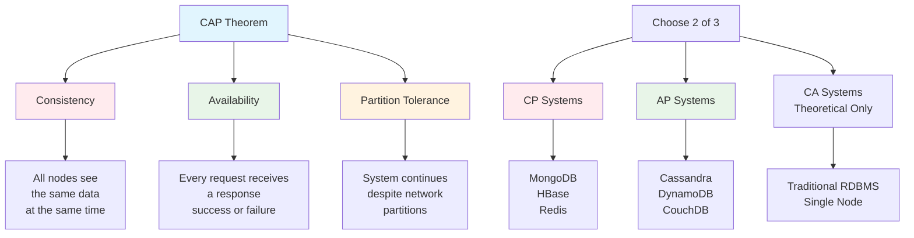

# System Design Fundamentals: CAP Theorem

The CAP theorem, also known as Brewer's theorem, states that in a distributed data store, it is impossible to simultaneously provide all three of the following guarantees: Consistency, Availability, and Partition Tolerance.

## Understanding the Three Properties



## CAP Theorem Simulator

```go
// CAP Theorem Demonstration System
package main

import (
    "fmt"
    "sync"
    "time"
)

type NodeStatus string

const (
    NodeHealthy      NodeStatus = "healthy"
    NodePartitioned  NodeStatus = "partitioned"
    NodeDown         NodeStatus = "down"
)

type Node struct {
    ID               string
    Data             map[string]interface{}
    Version          int
    Status           NodeStatus
    PartitionedFrom  map[string]bool
    mutex            sync.RWMutex
}

func NewNode(id string) *Node {
    return &Node{
        ID:              id,
        Data:            make(map[string]interface{}),
        Version:         0,
        Status:          NodeHealthy,
        PartitionedFrom: make(map[string]bool),
    }
}

func (n *Node) CanCommunicateWith(otherID string) bool {
    n.mutex.RLock()
    defer n.mutex.RUnlock()
    
    if n.Status != NodeHealthy {
        return false
    }
    
    return !n.PartitionedFrom[otherID]
}

func (n *Node) Write(key string, value interface{}) {
    n.mutex.Lock()
    defer n.mutex.Unlock()
    
    n.Data[key] = value
    n.Version++
    
    fmt.Printf("Node %s: WRITE key=%s value=%v version=%d\n", 
        n.ID, key, value, n.Version)
}

func (n *Node) Read(key string) (interface{}, int, bool) {
    n.mutex.RLock()
    defer n.mutex.RUnlock()
    
    value, exists := n.Data[key]
    return value, n.Version, exists
}

func (n *Node) CreatePartition(otherNodeID string) {
    n.mutex.Lock()
    defer n.mutex.Unlock()
    
    n.PartitionedFrom[otherNodeID] = true
    fmt.Printf("⚠️  Node %s partitioned from Node %s\n", n.ID, otherNodeID)
}

func (n *Node) HealPartition(otherNodeID string) {
    n.mutex.Lock()
    defer n.mutex.Unlock()
    
    delete(n.PartitionedFrom, otherNodeID)
    fmt.Printf("✅ Node %s healed partition with Node %s\n", n.ID, otherNodeID)
}

// CP System - Consistency + Partition Tolerance
type CPSystem struct {
    nodes           []*Node
    quorumSize      int
    mutex           sync.RWMutex
}

func NewCPSystem(numNodes int) *CPSystem {
    nodes := make([]*Node, numNodes)
    for i := 0; i < numNodes; i++ {
        nodes[i] = NewNode(fmt.Sprintf("node-%d", i))
    }
    
    return &CPSystem{
        nodes:      nodes,
        quorumSize: numNodes/2 + 1,
    }
}

func (cp *CPSystem) Write(key string, value interface{}) error {
    fmt.Printf("\n[CP System] Write Request: key=%s value=%v\n", key, value)
    
    // Check if we can reach quorum
    reachableNodes := cp.getReachableNodes()
    
    if len(reachableNodes) < cp.quorumSize {
        fmt.Printf("❌ [CP System] REJECTED - Cannot reach quorum (%d/%d nodes)\n", 
            len(reachableNodes), cp.quorumSize)
        return fmt.Errorf("cannot reach quorum: availability sacrificed for consistency")
    }
    
    // Write to all reachable nodes
    var wg sync.WaitGroup
    for _, node := range reachableNodes {
        wg.Add(1)
        go func(n *Node) {
            defer wg.Done()
            n.Write(key, value)
        }(node)
    }
    wg.Wait()
    
    fmt.Printf("✅ [CP System] Write succeeded (%d/%d nodes updated)\n", 
        len(reachableNodes), len(cp.nodes))
    return nil
}

func (cp *CPSystem) Read(key string) (interface{}, error) {
    fmt.Printf("\n[CP System] Read Request: key=%s\n", key)
    
    reachableNodes := cp.getReachableNodes()
    
    if len(reachableNodes) < cp.quorumSize {
        fmt.Printf("❌ [CP System] REJECTED - Cannot reach quorum (%d/%d nodes)\n", 
            len(reachableNodes), cp.quorumSize)
        return nil, fmt.Errorf("cannot reach quorum: availability sacrificed for consistency")
    }
    
    // Read from quorum and return most recent version
    type ReadResult struct {
        Value   interface{}
        Version int
    }
    
    results := make(chan ReadResult, len(reachableNodes))
    var wg sync.WaitGroup
    
    for _, node := range reachableNodes {
        wg.Add(1)
        go func(n *Node) {
            defer wg.Done()
            value, version, exists := n.Read(key)
            if exists {
                results <- ReadResult{Value: value, Version: version}
            }
        }(node)
    }
    
    wg.Wait()
    close(results)
    
    // Get most recent version
    var mostRecent ReadResult
    for result := range results {
        if result.Version > mostRecent.Version {
            mostRecent = result
        }
    }
    
    if mostRecent.Version > 0 {
        fmt.Printf("✅ [CP System] Read succeeded: value=%v version=%d\n", 
            mostRecent.Value, mostRecent.Version)
        return mostRecent.Value, nil
    }
    
    return nil, fmt.Errorf("key not found")
}

func (cp *CPSystem) getReachableNodes() []*Node {
    reachable := make([]*Node, 0)
    for _, node := range cp.nodes {
        if node.Status == NodeHealthy {
            reachable = append(reachable, node)
        }
    }
    return reachable
}

// AP System - Availability + Partition Tolerance
type APSystem struct {
    nodes           []*Node
    mutex           sync.RWMutex
}

func NewAPSystem(numNodes int) *APSystem {
    nodes := make([]*Node, numNodes)
    for i := 0; i < numNodes; i++ {
        nodes[i] = NewNode(fmt.Sprintf("node-%d", i))
    }
    
    return &APSystem{
        nodes: nodes,
    }
}

func (ap *APSystem) Write(key string, value interface{}) error {
    fmt.Printf("\n[AP System] Write Request: key=%s value=%v\n", key, value)
    
    // Write to all available nodes, even if partitioned
    reachableNodes := ap.getAvailableNodes()
    
    if len(reachableNodes) == 0 {
        fmt.Printf("❌ [AP System] No nodes available\n")
        return fmt.Errorf("no nodes available")
    }
    
    var wg sync.WaitGroup
    for _, node := range reachableNodes {
        wg.Add(1)
        go func(n *Node) {
            defer wg.Done()
            n.Write(key, value)
        }(node)
    }
    wg.Wait()
    
    if len(reachableNodes) < len(ap.nodes) {
        fmt.Printf("⚠️  [AP System] Write succeeded but inconsistent (%d/%d nodes updated)\n", 
            len(reachableNodes), len(ap.nodes))
        fmt.Println("    Consistency sacrificed for availability")
    } else {
        fmt.Printf("✅ [AP System] Write succeeded (%d/%d nodes updated)\n", 
            len(reachableNodes), len(ap.nodes))
    }
    
    return nil
}

func (ap *APSystem) Read(key string) (interface{}, error) {
    fmt.Printf("\n[AP System] Read Request: key=%s\n", key)
    
    // Read from any available node
    availableNodes := ap.getAvailableNodes()
    
    if len(availableNodes) == 0 {
        fmt.Printf("❌ [AP System] No nodes available\n")
        return nil, fmt.Errorf("no nodes available")
    }
    
    // Read from first available node
    node := availableNodes[0]
    value, version, exists := node.Read(key)
    
    if !exists {
        return nil, fmt.Errorf("key not found")
    }
    
    if len(availableNodes) < len(ap.nodes) {
        fmt.Printf("⚠️  [AP System] Read from Node %s: value=%v version=%d\n", 
            node.ID, value, version)
        fmt.Println("    Data may be stale (consistency sacrificed for availability)")
    } else {
        fmt.Printf("✅ [AP System] Read from Node %s: value=%v version=%d\n", 
            node.ID, value, version)
    }
    
    return value, nil
}

func (ap *APSystem) getAvailableNodes() []*Node {
    available := make([]*Node, 0)
    for _, node := range ap.nodes {
        if node.Status != NodeDown {
            available = append(available, node)
        }
    }
    return available
}

// Anti-entropy process for eventual consistency in AP systems
func (ap *APSystem) RunAntiEntropy() {
    fmt.Println("\n[AP System] Running anti-entropy process...")
    
    for i := 0; i < len(ap.nodes); i++ {
        for j := i + 1; j < len(ap.nodes); j++ {
            node1 := ap.nodes[i]
            node2 := ap.nodes[j]
            
            if node1.CanCommunicateWith(node2.ID) && node2.CanCommunicateWith(node1.ID) {
                ap.synchronizeNodes(node1, node2)
            }
        }
    }
    
    fmt.Println("✅ [AP System] Anti-entropy complete")
}

func (ap *APSystem) synchronizeNodes(node1, node2 *Node) {
    node1.mutex.Lock()
    node2.mutex.Lock()
    defer node1.mutex.Unlock()
    defer node2.mutex.Unlock()
    
    // Merge data from both nodes
    allKeys := make(map[string]bool)
    for key := range node1.Data {
        allKeys[key] = true
    }
    for key := range node2.Data {
        allKeys[key] = true
    }
    
    synced := 0
    for key := range allKeys {
        val1, exists1 := node1.Data[key]
        val2, exists2 := node2.Data[key]
        
        if !exists1 {
            node1.Data[key] = val2
            synced++
        } else if !exists2 {
            node2.Data[key] = val1
            synced++
        }
        // For simplicity, using last-write-wins based on version
    }
    
    if synced > 0 {
        fmt.Printf("  Synchronized %d keys between Node %s and Node %s\n", 
            synced, node1.ID, node2.ID)
    }
}

func main() {
    fmt.Println("=== CAP Theorem Demonstration ===\n")
    
    // Scenario 1: CP System under partition
    fmt.Println("━━━━━━━━━━━━━━━━━━━━━━━━━━━━━━━━━━━━")
    fmt.Println("Scenario 1: CP System (Consistency + Partition Tolerance)")
    fmt.Println("━━━━━━━━━━━━━━━━━━━━━━━━━━━━━━━━━━━━\n")
    
    cpSystem := NewCPSystem(5)
    
    // Normal operation
    fmt.Println("Phase 1: Normal Operation")
    cpSystem.Write("balance", 1000)
    cpSystem.Read("balance")
    
    // Create network partition
    fmt.Println("\nPhase 2: Network Partition (3 nodes isolated)")
    cpSystem.nodes[0].Status = NodePartitioned
    cpSystem.nodes[1].Status = NodePartitioned
    cpSystem.nodes[2].Status = NodePartitioned
    
    time.Sleep(100 * time.Millisecond)
    
    // Try to write during partition
    err := cpSystem.Write("balance", 2000)
    if err != nil {
        fmt.Printf("Expected behavior: %v\n", err)
    }
    
    // Try to read during partition
    _, err = cpSystem.Read("balance")
    if err != nil {
        fmt.Printf("Expected behavior: %v\n", err)
    }
    
    // Heal partition
    fmt.Println("\nPhase 3: Partition Healed")
    cpSystem.nodes[0].Status = NodeHealthy
    cpSystem.nodes[1].Status = NodeHealthy
    cpSystem.nodes[2].Status = NodeHealthy
    
    cpSystem.Write("balance", 2000)
    cpSystem.Read("balance")
    
    // Scenario 2: AP System under partition
    fmt.Println("\n━━━━━━━━━━━━━━━━━━━━━━━━━━━━━━━━━━━━")
    fmt.Println("Scenario 2: AP System (Availability + Partition Tolerance)")
    fmt.Println("━━━━━━━━━━━━━━━━━━━━━━━━━━━━━━━━━━━━\n")
    
    apSystem := NewAPSystem(5)
    
    // Normal operation
    fmt.Println("Phase 1: Normal Operation")
    apSystem.Write("user:name", "Alice")
    apSystem.Read("user:name")
    
    // Create network partition
    fmt.Println("\nPhase 2: Network Partition")
    apSystem.nodes[0].CreatePartition(apSystem.nodes[3].ID)
    apSystem.nodes[0].CreatePartition(apSystem.nodes[4].ID)
    apSystem.nodes[1].CreatePartition(apSystem.nodes[3].ID)
    apSystem.nodes[1].CreatePartition(apSystem.nodes[4].ID)
    apSystem.nodes[2].CreatePartition(apSystem.nodes[3].ID)
    apSystem.nodes[2].CreatePartition(apSystem.nodes[4].ID)
    
    time.Sleep(100 * time.Millisecond)
    
    // Write to different partitions (creates inconsistency)
    fmt.Println("\nConcurrent writes to partitioned nodes:")
    go apSystem.nodes[0].Write("user:name", "Bob")
    time.Sleep(50 * time.Millisecond)
    go apSystem.nodes[4].Write("user:name", "Charlie")
    time.Sleep(100 * time.Millisecond)
    
    // Reads from different partitions show different values
    fmt.Println("\nReads from partitioned nodes:")
    val1, _, _ := apSystem.nodes[0].Read("user:name")
    fmt.Printf("  Partition 1 sees: %v\n", val1)
    val2, _, _ := apSystem.nodes[4].Read("user:name")
    fmt.Printf("  Partition 2 sees: %v\n", val2)
    
    // Heal partition and run anti-entropy
    fmt.Println("\nPhase 3: Partition Healed")
    apSystem.nodes[0].HealPartition(apSystem.nodes[3].ID)
    apSystem.nodes[0].HealPartition(apSystem.nodes[4].ID)
    apSystem.nodes[1].HealPartition(apSystem.nodes[3].ID)
    apSystem.nodes[1].HealPartition(apSystem.nodes[4].ID)
    apSystem.nodes[2].HealPartition(apSystem.nodes[3].ID)
    apSystem.nodes[2].HealPartition(apSystem.nodes[4].ID)
    
    apSystem.RunAntiEntropy()
}
```

## Real-World Trade-off Examples

### CP System Example: Banking System

```go
// Banking System - CP Implementation
package main

import (
    "fmt"
    "sync"
    "time"
)

type BankAccount struct {
    AccountID string
    Balance   int64
    Version   int
}

type BankingCluster struct {
    nodes           []*BankNode
    quorumSize      int
    mutex           sync.RWMutex
}

type BankNode struct {
    ID          string
    Accounts    map[string]*BankAccount
    IsReachable bool
    mutex       sync.RWMutex
}

func NewBankNode(id string) *BankNode {
    return &BankNode{
        ID:          id,
        Accounts:    make(map[string]*BankAccount),
        IsReachable: true,
    }
}

func NewBankingCluster(numNodes int) *BankingCluster {
    nodes := make([]*BankNode, numNodes)
    for i := 0; i < numNodes; i++ {
        nodes[i] = NewBankNode(fmt.Sprintf("bank-node-%d", i))
    }
    
    return &BankingCluster{
        nodes:      nodes,
        quorumSize: numNodes/2 + 1,
    }
}

func (bc *BankingCluster) CreateAccount(accountID string, initialBalance int64) error {
    fmt.Printf("\n[Banking] Creating account %s with balance $%d\n", accountID, initialBalance)
    
    reachableNodes := bc.getReachableNodes()
    
    if len(reachableNodes) < bc.quorumSize {
        return fmt.Errorf("cannot create account: cluster unavailable (safety first)")
    }
    
    account := &BankAccount{
        AccountID: accountID,
        Balance:   initialBalance,
        Version:   1,
    }
    
    var wg sync.WaitGroup
    for _, node := range reachableNodes {
        wg.Add(1)
        go func(n *BankNode) {
            defer wg.Done()
            n.mutex.Lock()
            n.Accounts[accountID] = account
            n.mutex.Unlock()
        }(node)
    }
    wg.Wait()
    
    fmt.Printf("✅ Account created on %d/%d nodes\n", len(reachableNodes), len(bc.nodes))
    return nil
}

func (bc *BankingCluster) Transfer(fromAccount, toAccount string, amount int64) error {
    fmt.Printf("\n[Banking] Transfer $%d from %s to %s\n", amount, fromAccount, toAccount)
    
    reachableNodes := bc.getReachableNodes()
    
    if len(reachableNodes) < bc.quorumSize {
        fmt.Println("❌ Transfer REJECTED: Cannot reach quorum")
        fmt.Println("   → System maintains consistency by rejecting operation")
        return fmt.Errorf("cluster unavailable: cannot guarantee consistency")
    }
    
    // Read current balances from quorum
    var fromBalance, toBalance int64
    var fromVersion, toVersion int
    
    for _, node := range reachableNodes[:bc.quorumSize] {
        node.mutex.RLock()
        if acc, exists := node.Accounts[fromAccount]; exists {
            if acc.Version > fromVersion {
                fromBalance = acc.Balance
                fromVersion = acc.Version
            }
        }
        if acc, exists := node.Accounts[toAccount]; exists {
            if acc.Version > toVersion {
                toBalance = acc.Balance
                toVersion = acc.Version
            }
        }
        node.mutex.RUnlock()
    }
    
    // Validate transfer
    if fromBalance < amount {
        fmt.Printf("❌ Transfer REJECTED: Insufficient funds ($%d < $%d)\n", fromBalance, amount)
        return fmt.Errorf("insufficient funds")
    }
    
    // Execute transfer on quorum
    var wg sync.WaitGroup
    for _, node := range reachableNodes {
        wg.Add(1)
        go func(n *BankNode) {
            defer wg.Done()
            n.mutex.Lock()
            defer n.mutex.Unlock()
            
            if acc, exists := n.Accounts[fromAccount]; exists {
                acc.Balance -= amount
                acc.Version++
            }
            if acc, exists := n.Accounts[toAccount]; exists {
                acc.Balance += amount
                acc.Version++
            }
        }(node)
    }
    wg.Wait()
    
    fmt.Printf("✅ Transfer succeeded (quorum: %d/%d nodes)\n", 
        len(reachableNodes), len(bc.nodes))
    fmt.Printf("   New balances: %s=$%d, %s=$%d\n", 
        fromAccount, fromBalance-amount, toAccount, toBalance+amount)
    
    return nil
}

func (bc *BankingCluster) GetBalance(accountID string) (int64, error) {
    reachableNodes := bc.getReachableNodes()
    
    if len(reachableNodes) < bc.quorumSize {
        return 0, fmt.Errorf("cluster unavailable: cannot guarantee consistency")
    }
    
    // Read from quorum
    var latestBalance int64
    var latestVersion int
    
    for _, node := range reachableNodes[:bc.quorumSize] {
        node.mutex.RLock()
        if acc, exists := node.Accounts[accountID]; exists {
            if acc.Version > latestVersion {
                latestBalance = acc.Balance
                latestVersion = acc.Version
            }
        }
        node.mutex.RUnlock()
    }
    
    return latestBalance, nil
}

func (bc *BankingCluster) getReachableNodes() []*BankNode {
    reachable := make([]*BankNode, 0)
    for _, node := range bc.nodes {
        if node.IsReachable {
            reachable = append(reachable, node)
        }
    }
    return reachable
}

func (bc *BankingCluster) SimulatePartition(nodeIndices []int) {
    for _, idx := range nodeIndices {
        bc.nodes[idx].IsReachable = false
        fmt.Printf("⚠️  Node %s partitioned\n", bc.nodes[idx].ID)
    }
}

func (bc *BankingCluster) HealPartition() {
    for _, node := range bc.nodes {
        node.IsReachable = true
    }
    fmt.Println("✅ All nodes healed")
}
```

### AP System Example: Social Media Feed

```go
// Social Media System - AP Implementation
package main

import (
    "fmt"
    "sync"
    "time"
)

type Post struct {
    ID        string
    UserID    string
    Content   string
    Timestamp time.Time
    Likes     int
}

type SocialMediaNode struct {
    ID      string
    Posts   map[string]*Post
    IsAlive bool
    mutex   sync.RWMutex
}

func NewSocialMediaNode(id string) *SocialMediaNode {
    return &SocialMediaNode{
        ID:      id,
        Posts:   make(map[string]*Post),
        IsAlive: true,
    }
}

type SocialMediaCluster struct {
    nodes []*SocialMediaNode
    mutex sync.RWMutex
}

func NewSocialMediaCluster(numNodes int) *SocialMediaCluster {
    nodes := make([]*SocialMediaNode, numNodes)
    for i := 0; i < numNodes; i++ {
        nodes[i] = NewSocialMediaNode(fmt.Sprintf("social-node-%d", i))
    }
    
    return &SocialMediaCluster{
        nodes: nodes,
    }
}

func (smc *SocialMediaCluster) CreatePost(userID, content string) (string, error) {
    postID := fmt.Sprintf("post-%d", time.Now().UnixNano())
    
    fmt.Printf("\n[Social Media] User %s creating post: %s\n", userID, content)
    
    post := &Post{
        ID:        postID,
        UserID:    userID,
        Content:   content,
        Timestamp: time.Now(),
        Likes:     0,
    }
    
    // Write to all available nodes (best effort)
    availableNodes := smc.getAvailableNodes()
    
    if len(availableNodes) == 0 {
        return "", fmt.Errorf("no nodes available")
    }
    
    var wg sync.WaitGroup
    successCount := 0
    var countMutex sync.Mutex
    
    for _, node := range availableNodes {
        wg.Add(1)
        go func(n *SocialMediaNode) {
            defer wg.Done()
            n.mutex.Lock()
            n.Posts[postID] = post
            n.mutex.Unlock()
            
            countMutex.Lock()
            successCount++
            countMutex.Unlock()
        }(node)
    }
    wg.Wait()
    
    if successCount < len(smc.nodes) {
        fmt.Printf("⚠️  Post created on %d/%d nodes (eventual consistency)\n", 
            successCount, len(smc.nodes))
        fmt.Println("   → System prioritizes availability over immediate consistency")
    } else {
        fmt.Printf("✅ Post created on all %d nodes\n", successCount)
    }
    
    return postID, nil
}

func (smc *SocialMediaCluster) LikePost(postID string) error {
    fmt.Printf("\n[Social Media] Liking post %s\n", postID)
    
    availableNodes := smc.getAvailableNodes()
    
    if len(availableNodes) == 0 {
        return fmt.Errorf("no nodes available")
    }
    
    // Increment likes on all available nodes
    var wg sync.WaitGroup
    successCount := 0
    var countMutex sync.Mutex
    
    for _, node := range availableNodes {
        wg.Add(1)
        go func(n *SocialMediaNode) {
            defer wg.Done()
            n.mutex.Lock()
            if post, exists := n.Posts[postID]; exists {
                post.Likes++
                countMutex.Lock()
                successCount++
                countMutex.Unlock()
            }
            n.mutex.Unlock()
        }(node)
    }
    wg.Wait()
    
    if successCount > 0 {
        fmt.Printf("✅ Like registered on %d/%d available nodes\n", 
            successCount, len(availableNodes))
        if successCount < len(smc.nodes) {
            fmt.Println("   → Like counts may be temporarily inconsistent across regions")
        }
        return nil
    }
    
    return fmt.Errorf("post not found")
}

func (smc *SocialMediaCluster) GetFeed(userID string, limit int) []*Post {
    fmt.Printf("\n[Social Media] Loading feed for user %s\n", userID)
    
    // Read from any available node (stale reads acceptable)
    availableNodes := smc.getAvailableNodes()
    
    if len(availableNodes) == 0 {
        fmt.Println("❌ No nodes available")
        return nil
    }
    
    // Use first available node
    node := availableNodes[0]
    node.mutex.RLock()
    defer node.mutex.RUnlock()
    
    posts := make([]*Post, 0, limit)
    for _, post := range node.Posts {
        posts = append(posts, post)
        if len(posts) >= limit {
            break
        }
    }
    
    if len(availableNodes) < len(smc.nodes) {
        fmt.Printf("⚠️  Feed loaded from node %s (%d posts)\n", node.ID, len(posts))
        fmt.Println("   → Data might be slightly stale, but user can still browse")
    } else {
        fmt.Printf("✅ Feed loaded from node %s (%d posts)\n", node.ID, len(posts))
    }
    
    return posts
}

func (smc *SocialMediaCluster) getAvailableNodes() []*SocialMediaNode {
    available := make([]*SocialMediaNode, 0)
    for _, node := range smc.nodes {
        if node.IsAlive {
            available = append(available, node)
        }
    }
    return available
}

func (smc *SocialMediaCluster) SimulateRegionalOutage(nodeIndices []int) {
    for _, idx := range nodeIndices {
        smc.nodes[idx].IsAlive = false
        fmt.Printf("⚠️  Node %s went down (regional outage)\n", smc.nodes[idx].ID)
    }
}

func (smc *SocialMediaCluster) RecoverNodes() {
    for _, node := range smc.nodes {
        node.IsAlive = true
    }
    fmt.Println("✅ All nodes recovered")
}

// Demonstrate both systems
func main() {
    fmt.Println("=== Real-World CAP Trade-offs ===\n")
    
    // Banking System (CP)
    fmt.Println("━━━━━━━━━━━━━━━━━━━━━━━━━━━━━━━━━━━━")
    fmt.Println("Banking System (CP - Consistency Priority)")
    fmt.Println("━━━━━━━━━━━━━━━━━━━━━━━━━━━━━━━━━━━━")
    
    bank := NewBankingCluster(5)
    
    bank.CreateAccount("alice", 1000)
    bank.CreateAccount("bob", 500)
    
    // Normal operation
    bank.Transfer("alice", "bob", 200)
    
    // Simulate partition
    fmt.Println("\n--- Network Partition Occurs ---")
    bank.SimulatePartition([]int{3, 4})
    
    // Try transfer during partition - will fail
    time.Sleep(100 * time.Millisecond)
    bank.Transfer("alice", "bob", 100)
    
    // Heal and retry
    fmt.Println("\n--- Partition Healed ---")
    bank.HealPartition()
    bank.Transfer("alice", "bob", 100)
    
    // Social Media System (AP)
    fmt.Println("\n━━━━━━━━━━━━━━━━━━━━━━━━━━━━━━━━━━━━")
    fmt.Println("Social Media System (AP - Availability Priority)")
    fmt.Println("━━━━━━━━━━━━━━━━━━━━━━━━━━━━━━━━━━━━")
    
    social := NewSocialMediaCluster(5)
    
    // Normal operation
    postID, _ := social.CreatePost("user123", "Hello World!")
    social.LikePost(postID)
    social.GetFeed("user123", 10)
    
    // Simulate regional outage
    fmt.Println("\n--- Regional Outage (2 nodes down) ---")
    social.SimulateRegionalOutage([]int{3, 4})
    
    // System remains available
    time.Sleep(100 * time.Millisecond)
    postID2, _ := social.CreatePost("user456", "Still posting during outage!")
    social.LikePost(postID)
    social.GetFeed("user123", 10)
    
    fmt.Println("\n--- Nodes Recovered ---")
    social.RecoverNodes()
    social.LikePost(postID2)
}
```

## PACELC Extension

PACELC extends CAP to account for behavior during normal operation (no partition):
- **P**artition: Choose between **A**vailability and **C**onsistency
- **E**lse (no partition): Choose between **L**atency and **C**onsistency

```go
// PACELC Demonstration
package main

import (
    "fmt"
    "time"
)

type PACELCSystem struct {
    name                  string
    duringPartition       string // "A" or "C"
    duringNormalOperation string // "L" or "C"
}

func (p *PACELCSystem) Describe() {
    fmt.Printf("\n=== %s ===\n", p.name)
    fmt.Printf("During Partition: Prioritize %s\n", p.duringPartition)
    fmt.Printf("Normal Operation: Prioritize %s\n", p.duringNormalOperation)
    
    if p.duringPartition == "C" && p.duringNormalOperation == "C" {
        fmt.Println("Classification: PC/EC (Strong Consistency Always)")
        fmt.Println("Examples: HBase, MongoDB (strong consistency mode)")
    } else if p.duringPartition == "A" && p.duringNormalOperation == "L" {
        fmt.Println("Classification: PA/EL (Availability + Low Latency)")
        fmt.Println("Examples: Cassandra, DynamoDB")
    } else if p.duringPartition == "A" && p.duringNormalOperation == "C" {
        fmt.Println("Classification: PA/EC (Available but Eventually Consistent)")
        fmt.Println("Examples: Riak")
    } else if p.duringPartition == "C" && p.duringNormalOperation == "L" {
        fmt.Println("Classification: PC/EL (Consistent during partition, low latency otherwise)")
        fmt.Println("Examples: MongoDB (default), Cosmos DB")
    }
}

func (p *PACELCSystem) SimulateOperation(isPartitioned bool) time.Duration {
    if isPartitioned {
        if p.duringPartition == "C" {
            fmt.Println("⏸  Operation blocked - ensuring consistency")
            return 0 // Operation rejected
        } else {
            fmt.Println("✅ Operation completed - may be inconsistent")
            return 50 * time.Millisecond
        }
    } else {
        if p.duringNormalOperation == "C" {
            fmt.Println("✅ Operation completed - strong consistency")
            return 200 * time.Millisecond // Higher latency for consistency
        } else {
            fmt.Println("✅ Operation completed - low latency")
            return 20 * time.Millisecond // Lower latency
        }
    }
}

func main() {
    fmt.Println("=== PACELC Classification ===")
    
    systems := []PACELCSystem{
        {
            name:                  "Cassandra",
            duringPartition:       "A",
            duringNormalOperation: "L",
        },
        {
            name:                  "HBase",
            duringPartition:       "C",
            duringNormalOperation: "C",
        },
        {
            name:                  "MongoDB",
            duringPartition:       "C",
            duringNormalOperation: "L",
        },
        {
            name:                  "DynamoDB",
            duringPartition:       "A",
            duringNormalOperation: "L",
        },
    }
    
    for _, sys := range systems {
        sys.Describe()
        
        fmt.Println("\nNormal Operation:")
        latency := sys.SimulateOperation(false)
        if latency > 0 {
            fmt.Printf("Latency: %v\n", latency)
        }
        
        fmt.Println("\nDuring Partition:")
        latency = sys.SimulateOperation(true)
        if latency > 0 {
            fmt.Printf("Latency: %v\n", latency)
        }
    }
}
```

## Practical Decision Framework

```go
// CAP Decision Framework
package main

import "fmt"

type SystemRequirements struct {
    FinancialTransactions    bool
    GlobalDistribution       bool
    HighWriteVolume          bool
    StaleReadsAcceptable     bool
    RequiresStrictOrdering   bool
    MaxAcceptableLatencyMs   int
    RegulatoryConcerns       bool
}

func RecommendCAPStrategy(req SystemRequirements) {
    fmt.Println("\n=== CAP Strategy Recommendation ===\n")
    
    fmt.Println("Requirements Analysis:")
    fmt.Printf("  Financial Transactions: %v\n", req.FinancialTransactions)
    fmt.Printf("  Global Distribution: %v\n", req.GlobalDistribution)
    fmt.Printf("  High Write Volume: %v\n", req.HighWriteVolume)
    fmt.Printf("  Stale Reads Acceptable: %v\n", req.StaleReadsAcceptable)
    fmt.Printf("  Requires Strict Ordering: %v\n", req.RequiresStrictOrdering)
    fmt.Printf("  Max Latency: %dms\n", req.MaxAcceptableLatencyMs)
    fmt.Printf("  Regulatory Concerns: %v\n\n", req.RegulatoryConcerns)
    
    // Decision logic
    if req.FinancialTransactions || req.RegulatoryConcerns {
        fmt.Println("✅ Recommendation: CP System")
        fmt.Println("\nReasoning:")
        fmt.Println("  • Financial correctness is non-negotiable")
        fmt.Println("  • Regulatory compliance requires auditability")
        fmt.Println("  • Better to reject operations than risk inconsistency")
        fmt.Println("\nSuggested Technologies:")
        fmt.Println("  • Google Spanner (global strong consistency)")
        fmt.Println("  • CockroachDB (distributed SQL)")
        fmt.Println("  • MongoDB with majority write concern")
        fmt.Println("\nTrade-offs:")
        fmt.Println("  ⚠️  Reduced availability during network partitions")
        fmt.Println("  ⚠️  Higher latency for global consistency")
        return
    }
    
    if req.GlobalDistribution && req.StaleReadsAcceptable {
        fmt.Println("✅ Recommendation: AP System")
        fmt.Println("\nReasoning:")
        fmt.Println("  • Global users need low latency")
        fmt.Println("  • Application can handle eventual consistency")
        fmt.Println("  • Availability is critical for user experience")
        fmt.Println("\nSuggested Technologies:")
        fmt.Println("  • Cassandra (multi-datacenter replication)")
        fmt.Println("  • DynamoDB (global tables)")
        fmt.Println("  • Riak (highly available)")
        fmt.Println("\nTrade-offs:")
        fmt.Println("  ⚠️  Temporary inconsistencies possible")
        fmt.Println("  ⚠️  Need conflict resolution strategies")
        fmt.Println("  ⚠️  Complex to reason about application state")
        return
    }
    
    if !req.GlobalDistribution && req.RequiresStrictOrdering {
        fmt.Println("✅ Recommendation: Single-Region CP System")
        fmt.Println("\nReasoning:")
        fmt.Println("  • Limited distribution reduces partition risk")
        fmt.Println("  • Strong consistency is achievable with good availability")
        fmt.Println("  • Strict ordering requirements met")
        fmt.Println("\nSuggested Technologies:")
        fmt.Println("  • PostgreSQL with synchronous replication")
        fmt.Println("  • MySQL Group Replication")
        fmt.Println("  • etcd/ZooKeeper for coordination")
        return
    }
    
    fmt.Println("✅ Recommendation: Hybrid Approach")
    fmt.Println("\nReasoning:")
    fmt.Println("  • Requirements don't clearly favor CP or AP")
    fmt.Println("  • Different data types may need different guarantees")
    fmt.Println("\nSuggested Strategy:")
    fmt.Println("  • Critical data: CP system (e.g., account balances)")
    fmt.Println("  • Non-critical data: AP system (e.g., user preferences)")
    fmt.Println("  • Use eventual consistency with compensating transactions")
    fmt.Println("\nSuggested Technologies:")
    fmt.Println("  • MongoDB with tunable consistency")
    fmt.Println("  • Cosmos DB with multiple consistency levels")
    fmt.Println("  • Event sourcing for audit trail")
}

func main() {
    // Example 1: Banking System
    bankingReq := SystemRequirements{
        FinancialTransactions:  true,
        GlobalDistribution:     false,
        HighWriteVolume:        false,
        StaleReadsAcceptable:   false,
        RequiresStrictOrdering: true,
        MaxAcceptableLatencyMs: 1000,
        RegulatoryConcerns:     true,
    }
    
    fmt.Println("SCENARIO 1: Banking System")
    RecommendCAPStrategy(bankingReq)
    
    // Example 2: Social Media
    socialReq := SystemRequirements{
        FinancialTransactions:  false,
        GlobalDistribution:     true,
        HighWriteVolume:        true,
        StaleReadsAcceptable:   true,
        RequiresStrictOrdering: false,
        MaxAcceptableLatencyMs: 100,
        RegulatoryConcerns:     false,
    }
    
    fmt.Println("\n" + "═"*50)
    fmt.Println("SCENARIO 2: Social Media Platform")
    RecommendCAPStrategy(socialReq)
    
    // Example 3: E-commerce
    ecommerceReq := SystemRequirements{
        FinancialTransactions:  true,
        GlobalDistribution:     true,
        HighWriteVolume:        true,
        StaleReadsAcceptable:   false,
        RequiresStrictOrdering: false,
        MaxAcceptableLatencyMs: 500,
        RegulatoryConcerns:     true,
    }
    
    fmt.Println("\n" + "═"*50)
    fmt.Println("SCENARIO 3: E-commerce Platform")
    RecommendCAPStrategy(ecommerceReq)
}
```

## Common Misconceptions

### Myth 1: "You can only choose 2 out of 3"

**Reality**: You don't "choose" - partitions happen whether you want them or not. The real choice is between Consistency and Availability **when partitions occur**.

### Myth 2: "CA systems exist"

**Reality**: In distributed systems, network partitions are inevitable. True CA systems only exist in single-node deployments.

### Myth 3: "NoSQL databases are always AP"

**Reality**: Many modern databases offer tunable consistency. MongoDB, Cassandra, and Cosmos DB can be configured for different CAP trade-offs.

## Best Practices

1. **Understand your requirements**: Don't blindly choose CP or AP
2. **Partition tolerance is mandatory**: Focus on the C vs A trade-off
3. **Consider PACELC**: Think about normal operation, not just partitions
4. **Use hybrid approaches**: Different data may need different guarantees
5. **Design for failure**: Always test partition scenarios
6. **Monitor partition events**: Track network issues and system behavior
7. **Implement graceful degradation**: Have fallback strategies

## Conclusion

The CAP theorem is not about choosing technologies but understanding trade-offs:

- **CP Systems**: Financial systems, inventory management, distributed locks
- **AP Systems**: Social media, caching, content delivery, analytics
- **Hybrid**: E-commerce (CP for payments, AP for recommendations)

Modern systems often provide tunable consistency, allowing you to choose different guarantees for different operations. Understanding CAP helps you make informed decisions about when to prioritize consistency versus availability.