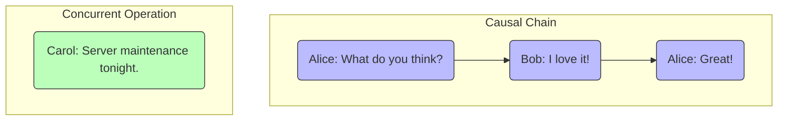

Between the strict guarantees of strong consistency and the relaxed nature of eventual consistency lies a spectrum of intermediate models. **Causal consistency** is one of the most intuitive and useful of these models. It is stronger than eventual consistency but weaker than sequential consistency, and it strikes a practical balance for many modern applications.

The model is based on the idea of causality: if one operation **causes** another, then everyone in the system should see those two operations in the correct order. For operations that are not causally related, the system makes no guarantees about their ordering.

### What is a Causal Relationship?

In a distributed system, we can say that operation A *causally precedes* operation B if:

1.  **Same Process Order**: Operation A and operation B are executed by the same client (or process), and A occurs before B. For example, a user first writes a comment, then edits it. The edit is causally dependent on the original write.
2.  **Read-then-Write**: A client reads a value, and then performs a write operation B based on that read. The write (B) is causally dependent on the earlier write that produced the value that was read. For example, you read a comment and then write a reply. Your reply is causally dependent on the original comment.
3.  **Transitivity**: If A causally precedes B, and B causally precedes C, then A causally precedes C.

If two operations are not linked by this chain of events, they are considered **concurrent** (or causally independent).

Causal consistency guarantees that all clients will see causally related operations in the same order. However, they may disagree on the order of concurrent operations.

### A Classic Example: The Chat Application

Causal consistency is easiest to understand in the context of a chat application or a comment thread.

Imagine two users, Alice and Bob.

1.  **Alice writes**: "What do you think of the new design?" (Operation A)
2.  **Bob reads** Alice's message and **replies**: "I love it!" (Operation B). Operation B is causally dependent on Operation A.
3.  **Alice reads** Bob's reply and **comments**: "Great!" (Operation C). Operation C is causally dependent on Operation B.

The causal chain is `A -> B -> C`.

**What Causal Consistency Guarantees:**
Every user in the system who sees operation C ("Great!") must have also seen operation B ("I love it!"). And anyone who sees operation B must have also seen operation A ("What do you think..."). It would be impossible for a user to see the chat messages appear out of their logical, causal order.

**What it DOES NOT Guarantee:**
Now, imagine a third user, Carol, is typing at the same time.

*   **Carol writes**: "By the way, the server will be down for maintenance tonight." (Operation D)

Operation D is not causally related to A, B, or C. It is **concurrent**.

A user viewing the chat might see the messages in one of two valid orders:
*   Order 1: A, B, **D**, C
*   Order 2: A, **D**, B, C

Both are valid under causal consistency because the causal chain (`A -> B -> C`) is preserved. The system is free to interleave the concurrent operation (D) anywhere it likes, and different users might see it appear at different times. This is something we experience intuitively in chat apps all the time.

**Diagram: Causal vs. Concurrent Operations**

A system that was only eventually consistent might show Bob's reply *before* Alice's original question, which would be confusing and illogical. Causal consistency prevents this.

### How is Causal Consistency Implemented?

Implementing causal consistency typically involves tracking the "causal history" of operations. This is often done using **vector clocks**. A vector clock is a data structure that each client maintains to keep track of the logical timestamps of events in the system.

When a client performs an operation, it includes its current vector clock. When another client receives this operation, it updates its own clock to reflect that it has "seen" the state of the system up to that point. By comparing vector clocks, the system can determine if one operation causally precedes another or if they are concurrent.

If a node receives an operation whose vector clock indicates a "gap" in its causal history (i.e., it's missing a preceding operation), it can delay processing the new operation until the missing one arrives.

### Causal Consistency vs. Other Models

*   **Stronger than Eventual Consistency**: Eventual consistency provides no ordering guarantees at all, only that data will converge eventually. Causal consistency adds the crucial guarantee of preserving logical order.
*   **Weaker than Sequential Consistency**: Sequential consistency requires all clients to agree on a single, total ordering of *all* operations, including concurrent ones. Causal consistency allows different clients to see concurrent operations in different orders. This makes it more available and performant during network partitions.
*   **Weaker than Linearizability**: Linearizability is even stricter, requiring the single, total order to match the real-time order of operations.

### When to Use Causal Consistency

Causal consistency is an excellent fit for applications where preserving the logical flow of information is important for user experience, but a strict, total ordering of all events is not necessary.

*   **Collaborative Applications**: Chat apps, comment threads, and collaborative document editing (like Google Docs) all rely on causality to make sense.
*   **Social Media Feeds**: Ensuring you don't see a reply to a post before the post itself.
*   **Distributed Databases**: Some modern databases, like MongoDB, offer causal consistency as a read concern, providing a good balance between strong consistency and high availability.

### Conclusion

Causal consistency is a powerful "sweet spot" in the landscape of consistency models. It avoids the confusing, out-of-order anomalies that can occur with simple eventual consistency, while also avoiding the high latency and low availability costs associated with strong consistency. By focusing on what truly matters for a logical user experience—the chain of cause and effect—it provides a practical and intuitive model for building responsive, scalable, and coherent distributed systems.