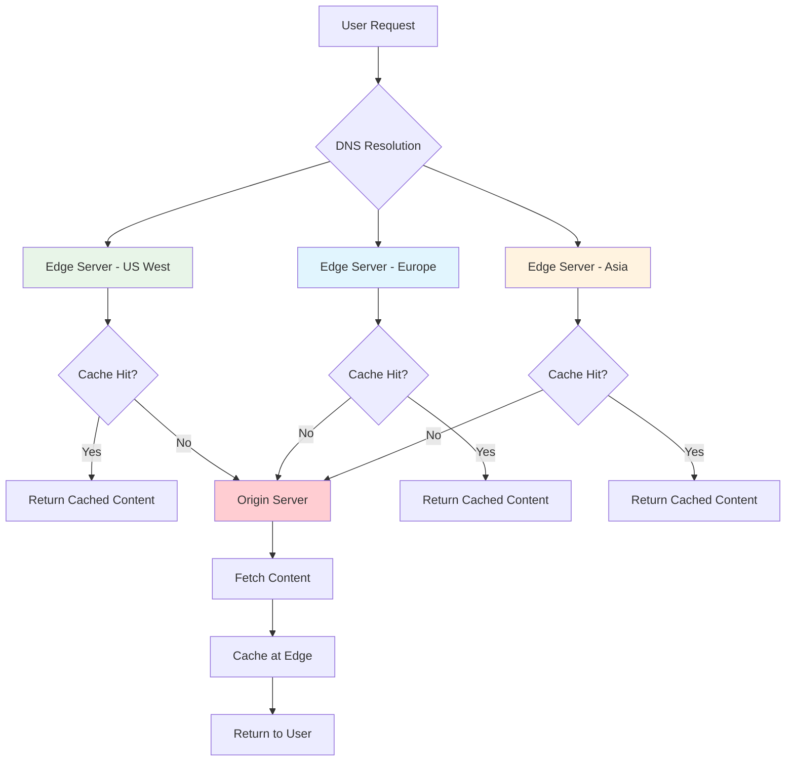

# System Design Fundamentals: Content Delivery Networks (CDN)

Content Delivery Networks distribute content geographically to reduce latency, improve performance, and handle high traffic loads by serving content from edge servers closest to users.

## CDN Architecture Overview



## Core CDN Implementation

```go
// CDN System Implementation
package main

import (
    "crypto/sha256"
    "encoding/hex"
    "fmt"
    "sync"
    "time"
)

// Content represents cacheable content
type Content struct {
    Key         string
    Data        []byte
    ContentType string
    Size        int64
    Metadata    map[string]string
    CreatedAt   time.Time
    ExpiresAt   time.Time
}

// CacheEntry with metadata
type CacheEntry struct {
    Content      *Content
    Hits         int64
    LastAccessed time.Time
    TTL          time.Duration
}

// Edge Server (POP - Point of Presence)
type EdgeServer struct {
    ID           string
    Location     string
    cache        map[string]*CacheEntry
    capacity     int64
    currentSize  int64
    mutex        sync.RWMutex
    originServer *OriginServer
    stats        *EdgeStats
}

type EdgeStats struct {
    CacheHits   int64
    CacheMisses int64
    BytesServed int64
    mutex       sync.RWMutex
}

func NewEdgeServer(id, location string, capacity int64, origin *OriginServer) *EdgeServer {
    es := &EdgeServer{
        ID:           id,
        Location:     location,
        cache:        make(map[string]*CacheEntry),
        capacity:     capacity,
        currentSize:  0,
        originServer: origin,
        stats:        &EdgeStats{},
    }
    
    // Start background cleanup
    go es.evictExpired()
    
    return es
}

func (es *EdgeServer) Get(key string) (*Content, error) {
    es.mutex.RLock()
    entry, exists := es.cache[key]
    es.mutex.RUnlock()
    
    if exists && time.Now().Before(entry.Content.ExpiresAt) {
        // Cache hit
        es.updateStats(true, entry.Content.Size)
        
        es.mutex.Lock()
        entry.Hits++
        entry.LastAccessed = time.Now()
        es.mutex.Unlock()
        
        fmt.Printf("✅ [%s] Cache HIT for key: %s (hits: %d)\n", 
            es.Location, key, entry.Hits)
        
        return entry.Content, nil
    }
    
    // Cache miss - fetch from origin
    fmt.Printf("⚠️  [%s] Cache MISS for key: %s - fetching from origin\n", 
        es.Location, key)
    
    es.updateStats(false, 0)
    
    content, err := es.originServer.Get(key)
    if err != nil {
        return nil, err
    }
    
    // Cache the content
    es.Put(key, content, 5*time.Minute)
    
    return content, nil
}

func (es *EdgeServer) Put(key string, content *Content, ttl time.Duration) error {
    es.mutex.Lock()
    defer es.mutex.Unlock()
    
    // Check if we need to evict
    if es.currentSize+content.Size > es.capacity {
        es.evictLRU(content.Size)
    }
    
    content.ExpiresAt = time.Now().Add(ttl)
    
    entry := &CacheEntry{
        Content:      content,
        Hits:         0,
        LastAccessed: time.Now(),
        TTL:          ttl,
    }
    
    // Remove old entry if exists
    if oldEntry, exists := es.cache[key]; exists {
        es.currentSize -= oldEntry.Content.Size
    }
    
    es.cache[key] = entry
    es.currentSize += content.Size
    
    fmt.Printf("💾 [%s] Cached key: %s (size: %d bytes, TTL: %v)\n", 
        es.Location, key, content.Size, ttl)
    
    return nil
}

func (es *EdgeServer) Invalidate(key string) {
    es.mutex.Lock()
    defer es.mutex.Unlock()
    
    if entry, exists := es.cache[key]; exists {
        es.currentSize -= entry.Content.Size
        delete(es.cache, key)
        fmt.Printf("🗑️  [%s] Invalidated key: %s\n", es.Location, key)
    }
}

func (es *EdgeServer) evictLRU(sizeNeeded int64) {
    fmt.Printf("🔄 [%s] Running LRU eviction (need: %d bytes)\n", 
        es.Location, sizeNeeded)
    
    // Find least recently used entries
    var oldestKey string
    var oldestTime time.Time = time.Now()
    
    for key, entry := range es.cache {
        if oldestKey == "" || entry.LastAccessed.Before(oldestTime) {
            oldestKey = key
            oldestTime = entry.LastAccessed
        }
    }
    
    if oldestKey != "" {
        entry := es.cache[oldestKey]
        es.currentSize -= entry.Content.Size
        delete(es.cache, oldestKey)
        
        fmt.Printf("  Evicted: %s (freed: %d bytes)\n", 
            oldestKey, entry.Content.Size)
        
        // Recursively evict if still not enough space
        if es.currentSize+sizeNeeded > es.capacity {
            es.evictLRU(sizeNeeded)
        }
    }
}

func (es *EdgeServer) evictExpired() {
    ticker := time.NewTicker(1 * time.Minute)
    defer ticker.Stop()
    
    for range ticker.C {
        es.mutex.Lock()
        
        now := time.Now()
        for key, entry := range es.cache {
            if now.After(entry.Content.ExpiresAt) {
                es.currentSize -= entry.Content.Size
                delete(es.cache, key)
            }
        }
        
        es.mutex.Unlock()
    }
}

func (es *EdgeServer) updateStats(hit bool, bytesServed int64) {
    es.stats.mutex.Lock()
    defer es.stats.mutex.Unlock()
    
    if hit {
        es.stats.CacheHits++
    } else {
        es.stats.CacheMisses++
    }
    
    es.stats.BytesServed += bytesServed
}

func (es *EdgeServer) GetStats() (float64, int64, int64) {
    es.stats.mutex.RLock()
    defer es.stats.mutex.RUnlock()
    
    total := es.stats.CacheHits + es.stats.CacheMisses
    var hitRate float64
    if total > 0 {
        hitRate = float64(es.stats.CacheHits) / float64(total) * 100
    }
    
    return hitRate, es.stats.BytesServed, total
}

// Origin Server
type OriginServer struct {
    storage map[string]*Content
    mutex   sync.RWMutex
    stats   struct {
        Requests int64
        mutex    sync.RWMutex
    }
}

func NewOriginServer() *OriginServer {
    return &OriginServer{
        storage: make(map[string]*Content),
    }
}

func (os *OriginServer) Store(content *Content) {
    os.mutex.Lock()
    defer os.mutex.Unlock()
    
    os.storage[content.Key] = content
    
    fmt.Printf("📦 Origin stored: %s (%d bytes)\n", 
        content.Key, content.Size)
}

func (os *OriginServer) Get(key string) (*Content, error) {
    os.stats.mutex.Lock()
    os.stats.Requests++
    os.stats.mutex.Unlock()
    
    os.mutex.RLock()
    defer os.mutex.RUnlock()
    
    content, exists := os.storage[key]
    if !exists {
        return nil, fmt.Errorf("content not found: %s", key)
    }
    
    fmt.Printf("🌐 Origin served: %s\n", key)
    
    return content, nil
}

func (os *OriginServer) GetRequestCount() int64 {
    os.stats.mutex.RLock()
    defer os.stats.mutex.RUnlock()
    return os.stats.Requests
}
```

## CDN Network with Geographic Routing

```go
// CDN Network with Geographic Load Balancing
package main

import (
    "fmt"
    "math"
    "sync"
)

type Location struct {
    Latitude  float64
    Longitude float64
}

type CDNNetwork struct {
    edgeServers  []*EdgeServer
    locations    map[string]Location
    originServer *OriginServer
    mutex        sync.RWMutex
}

func NewCDNNetwork(origin *OriginServer) *CDNNetwork {
    return &CDNNetwork{
        edgeServers:  make([]*EdgeServer, 0),
        locations:    make(map[string]Location),
        originServer: origin,
    }
}

func (cdn *CDNNetwork) AddEdgeServer(server *EdgeServer, location Location) {
    cdn.mutex.Lock()
    defer cdn.mutex.Unlock()
    
    cdn.edgeServers = append(cdn.edgeServers, server)
    cdn.locations[server.ID] = location
    
    fmt.Printf("🌍 Added edge server: %s at location: %s (%.2f, %.2f)\n", 
        server.ID, server.Location, location.Latitude, location.Longitude)
}

func (cdn *CDNNetwork) GetNearestEdge(userLocation Location) *EdgeServer {
    cdn.mutex.RLock()
    defer cdn.mutex.RUnlock()
    
    var nearest *EdgeServer
    minDistance := math.MaxFloat64
    
    for _, server := range cdn.edgeServers {
        serverLoc := cdn.locations[server.ID]
        distance := calculateDistance(userLocation, serverLoc)
        
        if distance < minDistance {
            minDistance = distance
            nearest = server
        }
    }
    
    if nearest != nil {
        fmt.Printf("📍 Nearest edge for user at (%.2f, %.2f): %s (distance: %.2f km)\n", 
            userLocation.Latitude, userLocation.Longitude, 
            nearest.Location, minDistance)
    }
    
    return nearest
}

func (cdn *CDNNetwork) Get(key string, userLocation Location) (*Content, error) {
    edge := cdn.GetNearestEdge(userLocation)
    if edge == nil {
        return nil, fmt.Errorf("no edge servers available")
    }
    
    return edge.Get(key)
}

func (cdn *CDNNetwork) InvalidateEverywhere(key string) {
    cdn.mutex.RLock()
    defer cdn.mutex.RUnlock()
    
    fmt.Printf("🔄 Global invalidation for key: %s\n", key)
    
    for _, server := range cdn.edgeServers {
        server.Invalidate(key)
    }
}

func (cdn *CDNNetwork) GetGlobalStats() map[string]interface{} {
    cdn.mutex.RLock()
    defer cdn.mutex.RUnlock()
    
    var totalHits int64
    var totalMisses int64
    var totalBytes int64
    
    serverStats := make([]map[string]interface{}, 0)
    
    for _, server := range cdn.edgeServers {
        hitRate, bytesServed, requests := server.GetStats()
        
        serverStats = append(serverStats, map[string]interface{}{
            "location":     server.Location,
            "hit_rate":     fmt.Sprintf("%.2f%%", hitRate),
            "bytes_served": bytesServed,
            "requests":     requests,
        })
        
        totalHits += server.stats.CacheHits
        totalMisses += server.stats.CacheMisses
        totalBytes += bytesServed
    }
    
    totalRequests := totalHits + totalMisses
    globalHitRate := float64(0)
    if totalRequests > 0 {
        globalHitRate = float64(totalHits) / float64(totalRequests) * 100
    }
    
    return map[string]interface{}{
        "global_hit_rate":  fmt.Sprintf("%.2f%%", globalHitRate),
        "total_requests":   totalRequests,
        "total_bytes":      totalBytes,
        "origin_requests":  cdn.originServer.GetRequestCount(),
        "edge_servers":     len(cdn.edgeServers),
        "server_stats":     serverStats,
    }
}

// Haversine formula for distance calculation
func calculateDistance(loc1, loc2 Location) float64 {
    const R = 6371 // Earth's radius in kilometers
    
    lat1 := loc1.Latitude * math.Pi / 180
    lat2 := loc2.Latitude * math.Pi / 180
    deltaLat := (loc2.Latitude - loc1.Latitude) * math.Pi / 180
    deltaLon := (loc2.Longitude - loc1.Longitude) * math.Pi / 180
    
    a := math.Sin(deltaLat/2)*math.Sin(deltaLat/2) +
        math.Cos(lat1)*math.Cos(lat2)*
            math.Sin(deltaLon/2)*math.Sin(deltaLon/2)
    
    c := 2 * math.Atan2(math.Sqrt(a), math.Sqrt(1-a))
    
    return R * c
}
```

## Cache Invalidation Strategies

```go
// Cache Invalidation System
package main

import (
    "fmt"
    "sync"
    "time"
)

type InvalidationType string

const (
    PurgeInvalidation   InvalidationType = "purge"   // Immediate removal
    RefreshInvalidation InvalidationType = "refresh" // Background refresh
    TagInvalidation     InvalidationType = "tag"     // Tag-based
)

type InvalidationRequest struct {
    Type      InvalidationType
    Keys      []string
    Tags      []string
    Timestamp time.Time
}

type CacheInvalidator struct {
    cdnNetwork   *CDNNetwork
    invalidQueue chan InvalidationRequest
    tagMapping   map[string][]string // tag -> keys
    mutex        sync.RWMutex
}

func NewCacheInvalidator(cdn *CDNNetwork) *CacheInvalidator {
    ci := &CacheInvalidator{
        cdnNetwork:   cdn,
        invalidQueue: make(chan InvalidationRequest, 100),
        tagMapping:   make(map[string][]string),
    }
    
    // Start invalidation worker
    go ci.processInvalidations()
    
    return ci
}

func (ci *CacheInvalidator) Invalidate(req InvalidationRequest) {
    req.Timestamp = time.Now()
    ci.invalidQueue <- req
}

func (ci *CacheInvalidator) processInvalidations() {
    for req := range ci.invalidQueue {
        switch req.Type {
        case PurgeInvalidation:
            ci.purge(req.Keys)
        case RefreshInvalidation:
            ci.refresh(req.Keys)
        case TagInvalidation:
            ci.invalidateByTags(req.Tags)
        }
    }
}

func (ci *CacheInvalidator) purge(keys []string) {
    fmt.Printf("🗑️  Purging %d keys immediately\n", len(keys))
    
    for _, key := range keys {
        ci.cdnNetwork.InvalidateEverywhere(key)
    }
}

func (ci *CacheInvalidator) refresh(keys []string) {
    fmt.Printf("🔄 Refreshing %d keys in background\n", len(keys))
    
    // Fetch fresh content from origin and update caches
    for _, key := range keys {
        go func(k string) {
            content, err := ci.cdnNetwork.originServer.Get(k)
            if err != nil {
                return
            }
            
            // Update all edge servers
            ci.cdnNetwork.mutex.RLock()
            edges := ci.cdnNetwork.edgeServers
            ci.cdnNetwork.mutex.RUnlock()
            
            for _, edge := range edges {
                edge.Put(k, content, 5*time.Minute)
            }
        }(key)
    }
}

func (ci *CacheInvalidator) invalidateByTags(tags []string) {
    fmt.Printf("🏷️  Invalidating content with tags: %v\n", tags)
    
    ci.mutex.RLock()
    keysToInvalidate := make(map[string]bool)
    
    for _, tag := range tags {
        if keys, exists := ci.tagMapping[tag]; exists {
            for _, key := range keys {
                keysToInvalidate[key] = true
            }
        }
    }
    ci.mutex.RUnlock()
    
    keys := make([]string, 0, len(keysToInvalidate))
    for key := range keysToInvalidate {
        keys = append(keys, key)
    }
    
    ci.purge(keys)
}

func (ci *CacheInvalidator) TagContent(key string, tags []string) {
    ci.mutex.Lock()
    defer ci.mutex.Unlock()
    
    for _, tag := range tags {
        if _, exists := ci.tagMapping[tag]; !exists {
            ci.tagMapping[tag] = make([]string, 0)
        }
        ci.tagMapping[tag] = append(ci.tagMapping[tag], key)
    }
}
```

## Smart Caching with Prediction

```go
// Predictive Cache Preloader
package main

import (
    "fmt"
    "sync"
    "time"
)

type AccessPattern struct {
    Key          string
    AccessCount  int
    LastAccessed time.Time
    Frequency    float64 // Accesses per hour
}

type PredictiveCache struct {
    patterns   map[string]*AccessPattern
    threshold  float64 // Minimum frequency to preload
    mutex      sync.RWMutex
    cdnNetwork *CDNNetwork
}

func NewPredictiveCache(cdn *CDNNetwork, threshold float64) *PredictiveCache {
    pc := &PredictiveCache{
        patterns:   make(map[string]*AccessPattern),
        threshold:  threshold,
        cdnNetwork: cdn,
    }
    
    go pc.analyzeAndPreload()
    
    return pc
}

func (pc *PredictiveCache) RecordAccess(key string) {
    pc.mutex.Lock()
    defer pc.mutex.Unlock()
    
    pattern, exists := pc.patterns[key]
    if !exists {
        pattern = &AccessPattern{
            Key:          key,
            AccessCount:  0,
            LastAccessed: time.Now(),
            Frequency:    0,
        }
        pc.patterns[key] = pattern
    }
    
    pattern.AccessCount++
    pattern.LastAccessed = time.Now()
}

func (pc *PredictiveCache) analyzeAndPreload() {
    ticker := time.NewTicker(5 * time.Minute)
    defer ticker.Stop()
    
    for range ticker.C {
        pc.mutex.Lock()
        
        now := time.Now()
        popularContent := make([]string, 0)
        
        for key, pattern := range patterns {
            // Calculate frequency (accesses per hour)
            hoursSinceFirst := now.Sub(pattern.LastAccessed).Hours()
            if hoursSinceFirst > 0 {
                pattern.Frequency = float64(pattern.AccessCount) / hoursSinceFirst
            }
            
            // Identify popular content
            if pattern.Frequency >= pc.threshold {
                popularContent = append(popularContent, key)
            }
        }
        
        pc.mutex.Unlock()
        
        if len(popularContent) > 0 {
            fmt.Printf("🔮 Preloading %d popular items to all edges\n", 
                len(popularContent))
            pc.preloadToAllEdges(popularContent)
        }
    }
}

func (pc *PredictiveCache) preloadToAllEdges(keys []string) {
    pc.cdnNetwork.mutex.RLock()
    edges := pc.cdnNetwork.edgeServers
    pc.cdnNetwork.mutex.RUnlock()
    
    for _, key := range keys {
        content, err := pc.cdnNetwork.originServer.Get(key)
        if err != nil {
            continue
        }
        
        // Push to all edge servers
        for _, edge := range edges {
            edge.Put(key, content, 1*time.Hour)
        }
        
        fmt.Printf("  Preloaded: %s to %d edge servers\n", 
            key, len(edges))
    }
}
```

## CDN with HTTP/2 Push

```go
// HTTP/2 Server Push for CDN
package main

import (
    "fmt"
)

type PushResource struct {
    Path        string
    ContentType string
    Priority    int
}

type HTTP2PushManager struct {
    pushRules map[string][]PushResource // URL -> resources to push
    mutex     sync.RWMutex
}

func NewHTTP2PushManager() *HTTP2PushManager {
    return &HTTP2PushManager{
        pushRules: make(map[string][]PushResource),
    }
}

func (pm *HTTP2PushManager) RegisterPushRule(mainResource string, pushResources []PushResource) {
    pm.mutex.Lock()
    defer pm.mutex.Unlock()
    
    pm.pushRules[mainResource] = pushResources
    
    fmt.Printf("📤 Registered push rule for: %s (%d resources)\n", 
        mainResource, len(pushResources))
}

func (pm *HTTP2PushManager) GetPushResources(mainResource string) []PushResource {
    pm.mutex.RLock()
    defer pm.mutex.RUnlock()
    
    return pm.pushRules[mainResource]
}

func (pm *HTTP2PushManager) SimulatePush(mainResource string) {
    resources := pm.GetPushResources(mainResource)
    
    if len(resources) == 0 {
        return
    }
    
    fmt.Printf("🚀 HTTP/2 Push for %s:\n", mainResource)
    for _, resource := range resources {
        fmt.Printf("  ↪️  Pushing: %s (type: %s, priority: %d)\n", 
            resource.Path, resource.ContentType, resource.Priority)
    }
}
```

## Complete CDN Demo

```go
func main() {
    fmt.Println("🚀 Starting CDN Demo\n")
    
    // 1. Setup Origin Server
    fmt.Println("=== Setting up Origin Server ===")
    origin := NewOriginServer()
    
    // Store some content
    for i := 1; i <= 5; i++ {
        content := &Content{
            Key:         fmt.Sprintf("image-%d.jpg", i),
            Data:        []byte(fmt.Sprintf("Image data %d", i)),
            ContentType: "image/jpeg",
            Size:        int64(1024 * i),
            Metadata:    map[string]string{"version": "1.0"},
            CreatedAt:   time.Now(),
        }
        origin.Store(content)
    }
    fmt.Println()
    
    // 2. Setup CDN Network
    fmt.Println("=== Setting up CDN Network ===")
    cdn := NewCDNNetwork(origin)
    
    // Add edge servers in different locations
    locations := []struct {
        id   string
        name string
        lat  float64
        lon  float64
    }{
        {"edge-1", "US-West", 37.7749, -122.4194},
        {"edge-2", "US-East", 40.7128, -74.0060},
        {"edge-3", "Europe", 51.5074, -0.1278},
        {"edge-4", "Asia", 35.6762, 139.6503},
    }
    
    for _, loc := range locations {
        edge := NewEdgeServer(loc.id, loc.name, 10*1024*1024, origin)
        cdn.AddEdgeServer(edge, Location{loc.lat, loc.lon})
    }
    fmt.Println()
    
    // 3. Simulate user requests
    fmt.Println("=== Simulating User Requests ===")
    
    userLocations := []struct {
        name string
        lat  float64
        lon  float64
    }{
        {"San Francisco", 37.7749, -122.4194},
        {"New York", 40.7128, -74.0060},
        {"London", 51.5074, -0.1278},
        {"Tokyo", 35.6762, 139.6503},
    }
    
    // Make requests
    for i := 0; i < 20; i++ {
        userLoc := userLocations[i%len(userLocations)]
        key := fmt.Sprintf("image-%d.jpg", (i%5)+1)
        
        fmt.Printf("\n👤 User in %s requesting: %s\n", userLoc.name, key)
        
        _, err := cdn.Get(key, Location{userLoc.lat, userLoc.lon})
        if err != nil {
            fmt.Printf("❌ Error: %v\n", err)
        }
        
        time.Sleep(100 * time.Millisecond)
    }
    fmt.Println()
    
    // 4. Display Statistics
    fmt.Println("=== CDN Statistics ===")
    stats := cdn.GetGlobalStats()
    
    fmt.Printf("Global Hit Rate: %s\n", stats["global_hit_rate"])
    fmt.Printf("Total Requests: %d\n", stats["total_requests"])
    fmt.Printf("Total Bytes Served: %d\n", stats["total_bytes"])
    fmt.Printf("Origin Requests: %d\n", stats["origin_requests"])
    fmt.Printf("Edge Servers: %d\n\n", stats["edge_servers"])
    
    fmt.Println("Per-Server Statistics:")
    serverStats := stats["server_stats"].([]map[string]interface{})
    for _, stat := range serverStats {
        fmt.Printf("  %s: Hit Rate=%s, Requests=%d, Bytes=%d\n",
            stat["location"], stat["hit_rate"], 
            stat["requests"], stat["bytes_served"])
    }
    fmt.Println()
    
    // 5. Cache Invalidation
    fmt.Println("=== Cache Invalidation ===")
    invalidator := NewCacheInvalidator(cdn)
    
    // Tag some content
    invalidator.TagContent("image-1.jpg", []string{"homepage", "featured"})
    invalidator.TagContent("image-2.jpg", []string{"homepage"})
    
    // Invalidate by tag
    invalidator.Invalidate(InvalidationRequest{
        Type: TagInvalidation,
        Tags: []string{"homepage"},
    })
    
    time.Sleep(500 * time.Millisecond)
    fmt.Println()
    
    // 6. HTTP/2 Push
    fmt.Println("=== HTTP/2 Server Push ===")
    pushManager := NewHTTP2PushManager()
    
    pushManager.RegisterPushRule("/index.html", []PushResource{
        {Path: "/style.css", ContentType: "text/css", Priority: 1},
        {Path: "/script.js", ContentType: "application/javascript", Priority: 2},
        {Path: "/logo.png", ContentType: "image/png", Priority: 3},
    })
    
    pushManager.SimulatePush("/index.html")
    
    fmt.Println("\n✅ CDN Demo completed!")
}
```

## CDN Best Practices

### 1. Cache Headers

```go
// Set appropriate cache headers
func setCacheHeaders(w http.ResponseWriter, cacheability string, maxAge int) {
    w.Header().Set("Cache-Control", fmt.Sprintf("%s, max-age=%d", cacheability, maxAge))
    w.Header().Set("ETag", generateETag(content))
    w.Header().Set("Last-Modified", content.CreatedAt.Format(time.RFC1123))
}

func generateETag(content *Content) string {
    hash := sha256.Sum256(content.Data)
    return hex.EncodeToString(hash[:])
}
```

### 2. Content Compression

```go
// Compress content before caching
import "compress/gzip"

func compressContent(data []byte) ([]byte, error) {
    var buf bytes.Buffer
    writer := gzip.NewWriter(&buf)
    
    if _, err := writer.Write(data); err != nil {
        return nil, err
    }
    
    if err := writer.Close(); err != nil {
        return nil, err
    }
    
    return buf.Bytes(), nil
}
```

### 3. Cache Key Design

```go
// Generate cache keys with versioning
func generateCacheKey(path string, queryParams map[string]string, version string) string {
    hash := sha256.New()
    
    // Include path
    hash.Write([]byte(path))
    
    // Include sorted query parameters
    keys := make([]string, 0, len(queryParams))
    for k := range queryParams {
        keys = append(keys, k)
    }
    sort.Strings(keys)
    
    for _, k := range keys {
        hash.Write([]byte(k + "=" + queryParams[k]))
    }
    
    // Include version
    hash.Write([]byte(version))
    
    return hex.EncodeToString(hash.Sum(nil))
}
```

## Performance Characteristics

| Strategy | Hit Rate | Latency | Bandwidth Savings | Complexity |
|----------|----------|---------|-------------------|------------|
| Edge Caching | 70-95% | ~50ms | 80-95% | Medium |
| Origin Shield | 95-99% | ~100ms | 60-80% | Low |
| Predictive Preload | 85-98% | ~30ms | 90-98% | High |
| HTTP/2 Push | N/A | ~20ms | 30-50% | Medium |

## Conclusion

CDNs are essential for:
- **Performance**: Reduce latency by 60-80%
- **Scalability**: Handle traffic spikes
- **Reliability**: Multiple points of presence
- **Cost**: Reduce origin server load
- **Security**: DDoS protection and WAF

Key considerations:
- Choose edge locations based on user distribution
- Implement smart cache invalidation
- Monitor cache hit rates and optimize
- Use predictive preloading for popular content
- Leverage HTTP/2 features for better performance