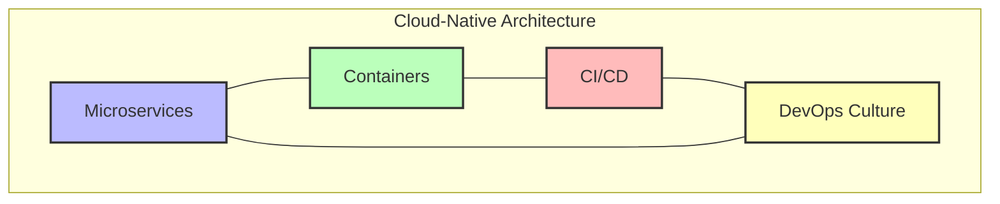
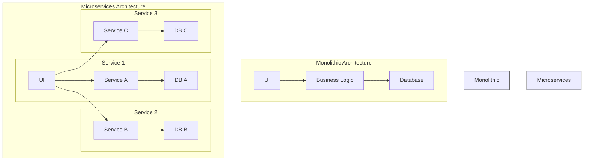
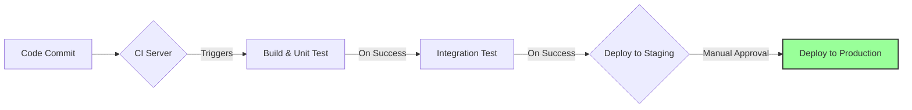

The term "cloud-native" is more than just a buzzword for applications running in the cloud. It represents a fundamental shift in how we design, build, deploy, and operate software. A cloud-native architecture is an approach that leverages the full power of cloud computing to create applications that are **scalable, resilient, and agile**.

This architectural style is not about *where* an application lives, but *how* it is constructed and managed. It's built on a foundation of core principles and technologies that enable rapid development and reliable operation in modern, dynamic environments like public, private, and hybrid clouds.

The Cloud Native Computing Foundation (CNCF) defines it as follows:

> "Cloud native technologies empower organizations to build and run scalable applications in modern, dynamic environments... These techniques enable loosely coupled systems that are resilient, manageable, and observable. Combined with robust automation, they allow engineers to make high-impact changes frequently and predictably with minimal toil."

Let's break down the key pillars of this approach.

### The Core Pillars of Cloud-Native Architecture

Cloud-native architecture is typically characterized by four main pillars: **Microservices**, **Containers**, **Continuous Integration/Continuous Delivery (CI/CD)**, and **DevOps**.

#### 1. Microservices

Instead of building a single, large monolithic application, cloud-native systems are composed of small, independent services. Each microservice is responsible for a specific business capability, has its own database, and can be developed, deployed, and scaled independently.

*   **Why it's Cloud-Native**: This architectural style is a natural fit for the cloud's elastic nature. If one part of your application (e.g., the payment service) experiences high load, you can scale just that one service without affecting the others. This fine-grained scalability is both efficient and cost-effective.

**Diagram: Monolith vs. Microservices**

#### 2. Containers

Containers, with Docker being the most well-known technology, provide a lightweight, portable, and consistent execution environment for applications. A container packages an application's code along with all its dependencies (libraries, configuration files, etc.) into a single, isolated unit.

*   **Why it's Cloud-Native**: Containers abstract the application from the underlying infrastructure. A containerized application will run the same way on a developer's laptop, a testing server, or a production cloud instance. This consistency eliminates the "it works on my machine" problem. Container orchestrators like **Kubernetes** take this a step further by automating the deployment, scaling, and management of containerized applications at scale.

#### 3. Continuous Integration/Continuous Delivery (CI/CD)

CI/CD is a practice that automates the software delivery pipeline.

*   **Continuous Integration (CI)**: Developers frequently merge their code changes into a central repository, after which automated builds and tests are run.
*   **Continuous Delivery (CD)**: After the CI stage passes, code changes are automatically prepared for a release to a production environment. A further step, Continuous Deployment, automatically deploys every passed change to production.

*   **Why it's Cloud-Native**: Automation is key to managing the complexity of a distributed system. CI/CD pipelines enable teams to release new features and bug fixes rapidly and reliably. In a cloud-native world, you can deploy changes to individual microservices multiple times a day without downtime, allowing for faster innovation and feedback cycles.

**Diagram: A Simple CI/CD Pipeline**

#### 4. DevOps Culture

DevOps is a cultural and organizational shift that brings development (Dev) and operations (Ops) teams together. Instead of working in silos, teams take shared ownership of the entire application lifecycle, from design and development to production support.

*   **Why it's Cloud-Native**: A DevOps culture is essential for the success of a cloud-native architecture. The principles of automation, shared responsibility, and rapid feedback loops that define DevOps are the same principles that underpin cloud-native applications. Teams that build a service are also responsible for running it, leading to higher quality and more resilient systems.

### Benefits of Cloud-Native Architecture

Adopting a cloud-native approach provides significant advantages:

1.  **Scalability**: Applications can be scaled horizontally with ease, adding or removing instances of services in response to demand.
2.  **Resilience**: The distributed nature of microservices means that the failure of one component does not bring down the entire system. The application can degrade gracefully.
3.  **Agility and Speed**: With independent services and automated pipelines, teams can develop and deploy features faster, leading to a shorter time-to-market.
4.  **Cost-Effectiveness**: The pay-as-you-go model of the cloud, combined with the efficient resource utilization of containers and microservices, can lead to significant cost savings.
5.  **No Vendor Lock-in**: By building on open standards and technologies promoted by the CNCF (like Kubernetes and Prometheus), organizations can avoid being tied to a single cloud provider's proprietary services.

### Conclusion

Cloud-native architecture is not just a technical choice; it's a strategic one. It's an approach designed to capitalize on the advantages of the cloud computing model to deliver applications that are flexible, reliable, and can evolve at the speed of business. By embracing microservices, containers, CI/CD, and a DevOps culture, organizations can build systems that are not just *in* the cloud, but are truly *of* the cloud.