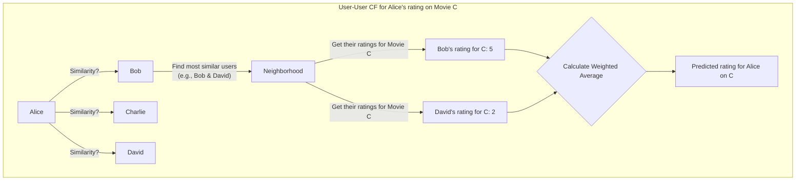

Collaborative filtering is one of the most powerful and widely used techniques for building recommendation systems. It's the engine behind features like "Customers who bought this also bought..." on Amazon and "Because you watched..." on Netflix. The core idea is simple yet profound: **to make recommendations for a user, find users with similar tastes and recommend items they liked.**

This method doesn't require any knowledge about the items themselves (like their genre, brand, or description). It relies solely on past user behavior (ratings, purchases, clicks) to find patterns. This article explores the main types of collaborative filtering, the underlying techniques like matrix factorization, and the common challenges faced when implementing it at scale.

### The Core Idea: The User-Item Interaction Matrix

Imagine a large matrix where every row represents a user and every column represents an item. The cells of this matrix contain the user's rating for that item, or a 1 if they've interacted with it (e.g., purchased or watched it). Most of this matrix will be empty (sparse) because a single user has only interacted with a tiny fraction of the total available items.

The goal of collaborative filtering is to **predict the missing values** in this matrix. A high predicted rating for an item a user hasn't seen before becomes a recommendation.

**Example User-Item Matrix (Ratings 1-5):**

| User | Movie A | Movie B | Movie C | Movie D |
| :--- | :---: | :---: | :---: | :---: |
| Alice | 5 | 4 | ? | 1 |
| Bob | 4 | ? | 5 | 2 |
| Charlie| ? | 4 | 1 | 5 |
| David | 5 | 4 | 2 | ? |

Looking at this matrix, Alice and David seem to have similar tastes (they both loved Movie A and liked Movie B). Since David gave Movie D a low rating, we might predict that Alice would also dislike it. Conversely, since Alice liked Movie B, we might recommend it to Bob. This is the essence of collaborative filtering.

### Two Main Approaches

There are two primary ways to use the user-item matrix to make predictions.

#### 1. Memory-Based: User-User and Item-Item Collaborative Filtering

This approach works directly with the user-item matrix to find neighbors.

**a) User-User Collaborative Filtering**

*   **Idea**: To predict a rating for User U on Item I, find a set of "neighbor" users who are most similar to User U and have rated Item I. The prediction is the weighted average of their ratings.
*   **Steps**:
    1.  Find the similarity between the target user (Alice) and all other users. Common similarity metrics include **Cosine Similarity** or **Pearson Correlation**.
    2.  Select the top N most similar users (the "neighborhood").
    3.  For the target item (Movie C), take the ratings from these neighbors and compute a weighted average (weighted by their similarity score). This average is the predicted rating for Alice.



*   **Pros**: Easy to understand and explain.
*   **Cons**: Doesn't scale well. Finding similar users in a system with millions of users is computationally expensive and needs to be done for every prediction.

**b) Item-Item Collaborative Filtering**

*   **Idea**: Instead of finding similar users, find similar *items*. To predict User U's rating for Item I, find other items that User U has already rated and are most similar to Item I. The prediction is a weighted average of the user's ratings on these similar items.
*   **Steps**:
    1.  Build an **item-item similarity matrix**. For every pair of items, calculate how similar they are based on how users have rated them. Two items are similar if the same users tend to rate them similarly.
    2.  To predict Alice's rating for Movie C, look at the other movies she has rated (Movie A, B, D).
    3.  Find which of these are most similar to Movie C from the pre-computed similarity matrix.
    4.  Calculate a weighted average of Alice's ratings on these similar movies.

*   **Pros**: The item-item similarity matrix can be pre-computed offline. This makes generating recommendations much faster than the user-user approach, as you don't need to find neighbors at request time. This is why Amazon uses this for "Customers who bought this also bought...".
*   **Cons**: The similarity matrix can be very large (N x N, where N is the number of items).

#### 2. Model-Based: Matrix Factorization

This is the modern, more scalable approach. Instead of working with the full, sparse matrix, matrix factorization techniques decompose it into smaller, dense matrices that represent latent (hidden) features.

*   **Idea**: The core idea is that user tastes and item attributes can be described by a small number of hidden "factors." For movies, these factors might represent genres like "comedy," "action," or more abstract concepts like "quirky storyline" or "big-budget spectacle."
*   **The Math**: The goal is to find two smaller matrices, a **user-factor matrix (P)** and an **item-factor matrix (Q)**, whose product approximates the original user-item rating matrix (R).
    *   `R (m x n) ≈ P (m x k) * Q^T (k x n)`
    *   `m` = number of users
    *   `n` = number of items
    *   `k` = number of latent factors (a hyperparameter, e.g., 50-100)

Each row in `P` is a vector representing a user in terms of the `k` latent factors. Each row in `Q` is a vector representing an item in terms of the same `k` factors.

**The predicted rating of user `u` for item `i` is simply the dot product of their vectors: `prediction(u, i) = P_u · Q_i`**

*   **How it's done**: Techniques like **Singular Value Decomposition (SVD)** or, more commonly, machine learning algorithms like **Alternating Least Squares (ALS)** or **Stochastic Gradient Descent (SGD)** are used to find the optimal P and Q matrices that minimize the prediction error on the known ratings.

*   **Pros**:
    *   **Scalable**: It handles sparse data well and is much more memory-efficient than memory-based methods. The model (P and Q matrices) is much smaller than the full user-item matrix.
    *   **Good Predictive Power**: It can predict ratings for any user-item pair, even if no similar users have rated that item yet. It "generalizes" from the latent features.

### Common Challenges

1.  **The Cold Start Problem**:
    *   **New User**: A new user has no ratings. The system doesn't know their tastes and can't find similar users or build a factor vector for them.
    *   **New Item**: A new item has no ratings. The system can't recommend it because it doesn't know who might like it.
    *   **Solution**: This is the biggest weakness of pure collaborative filtering. The system must fall back to other methods, like showing the most popular items globally or asking the new user to rate a few items to bootstrap their profile. This is where **hybrid models** (combining with content-based filtering) are essential.

2.  **Data Sparsity**: Even popular items are only rated by a small percentage of users. This makes it hard to find users with overlapping ratings, which is necessary for calculating similarity. Matrix factorization handles sparsity better than memory-based methods.

3.  **Scalability**: As the number of users and items grows into the millions, the computation becomes immense.
    *   For memory-based methods, finding neighbors is O(m*n).
    *   For model-based methods, training the model is computationally expensive. This is typically done offline in a batch process using distributed computing frameworks like Apache Spark.

### Go Example: Simple User-User Similarity

This example demonstrates the core logic of finding similar users based on cosine similarity. It's a simplified, in-memory version of the user-user approach.

```go
package main

import (
	"fmt"
	"math"
)

// UserRatings represents a user's ratings for various items.
type UserRatings map[string]float64

// The main data: a map of userID to their ratings.
var ratings = map[string]UserRatings{
	"Alice":   {"Movie A": 5.0, "Movie B": 4.0, "Movie D": 1.0},
	"Bob":     {"Movie A": 4.0, "Movie C": 5.0, "Movie D": 2.0},
	"Charlie": {"Movie B": 4.0, "Movie C": 1.0, "Movie D": 5.0},
	"David":   {"Movie A": 5.0, "Movie B": 4.0, "Movie C": 2.0},
}

// cosineSimilarity calculates the similarity between two users.
func cosineSimilarity(userA, userB UserRatings) float64 {
	// Find common items
	commonItems := make(map[string]bool)
	for item := range userA {
		if _, ok := userB[item]; ok {
			commonItems[item] = true
		}
	}

	if len(commonItems) == 0 {
		return 0.0
	}

	var dotProduct, magA, magB float64
	for item := range commonItems {
		dotProduct += userA[item] * userB[item]
	}

	for _, rating := range userA {
		magA += rating * rating
	}
	magA = math.Sqrt(magA)

	for _, rating := range userB {
		magB += rating * rating
	}
	magB = math.Sqrt(magB)

	if magA == 0 || magB == 0 {
		return 0.0
	}

	return dotProduct / (magA * magB)
}

// findSimilarUsers finds the top N most similar users to a target user.
func findSimilarUsers(targetUserID string) {
	targetRatings, ok := ratings[targetUserID]
	if !ok {
		fmt.Println("Target user not found.")
		return
	}

	fmt.Printf("Finding users similar to %s...\n", targetUserID)
	for userID, userRatings := range ratings {
		if userID == targetUserID {
			continue
		}
		similarity := cosineSimilarity(targetRatings, userRatings)
		fmt.Printf("- Similarity with %s: %.4f\n", userID, similarity)
	}
}

func main() {
	// Let's find users similar to Alice.
	// We expect David to be the most similar.
	findSimilarUsers("Alice")
}
```

### Conclusion

Collaborative filtering is a powerful technique for generating personalized recommendations based on the "wisdom of the crowd." The choice between **memory-based** (user-user, item-item) and **model-based** (matrix factorization) approaches depends on the specific use case and scale. While memory-based methods are intuitive, matrix factorization is generally more scalable and robust for large, sparse datasets. However, the Achilles' heel of pure collaborative filtering is the **cold start problem**, which necessitates a hybrid approach that can incorporate content-based features for new users and items.