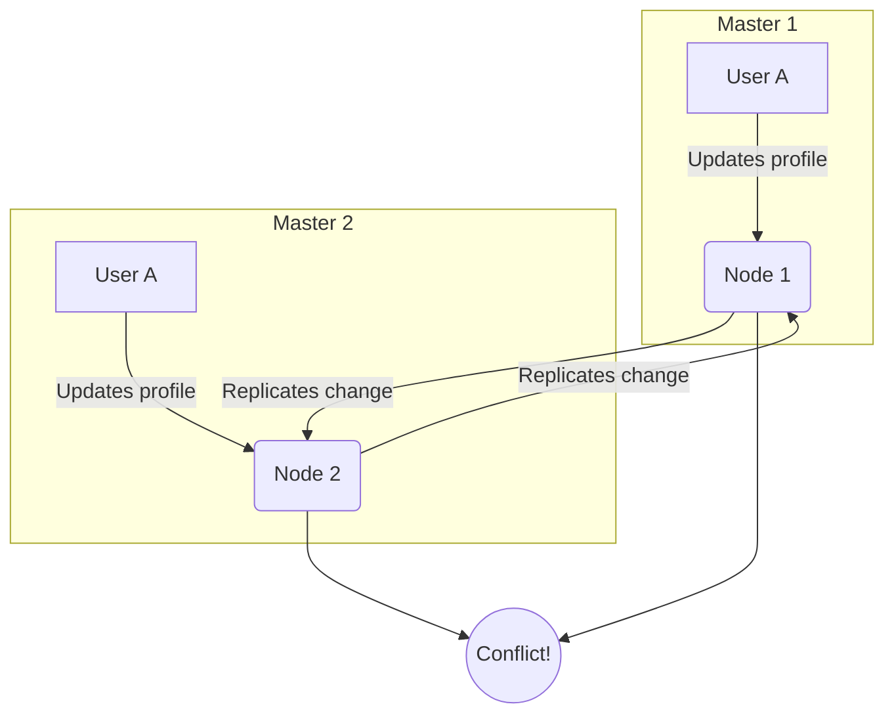

## The Inevitability of Conflicts

In any distributed system where data is replicated across multiple nodes, conflicts are not just a possibility; they are an inevitability. This is especially true in multi-master replication setups, where multiple nodes can accept writes.

### What is a Conflict?

A conflict occurs when two or more concurrent operations on different replicas of the data are incompatible. The most common type of conflict is a **write conflict**, where the same piece of data is modified on two different nodes at the same time.



### Why Do Conflicts Happen?

Conflicts arise from the combination of concurrency and data replication. In a distributed system, there's no single, global clock that can be used to order all operations. Network latency means that by the time a change from one node reaches another, the data on the second node may have already been changed.

## Strategies for Conflict Resolution

There are two main approaches to dealing with conflicts: **avoidance** and **resolution**.

### Conflict Avoidance

The best way to handle a conflict is to prevent it from happening in the first place. This can be done by:

*   **Directing all writes for a particular piece of data to a single master.** For example, you could decide that all updates for a user's profile go to the master in the user's home region.
*   **Using data structures that are designed to be conflict-free.** These are known as Conflict-Free Replicated Data Types (CRDTs).

### Conflict Resolution

When conflicts are unavoidable, you need a strategy for resolving them. Here are some common techniques:

#### Last Write Wins (LWW)

This is the simplest conflict resolution strategy. Each write operation is tagged with a timestamp, and the write with the latest timestamp is the one that "wins."

*   **Pros:** Simple to implement.
*   **Cons:** Can lead to data loss if the "losing" write contained important information. It also relies on all nodes having synchronized clocks, which is a hard problem in itself.

#### Vector Clocks

Vector clocks are a more sophisticated way of tracking the causal relationships between operations. Each node maintains a vector of logical clocks, one for each node in the system. When a conflict is detected, the vector clocks can be used to determine which operation happened "before" the other.

```mermaid
graph TD
    A[Node A: {A:1, B:0}] -- Write --> B[Node A: {A:2, B:0}];
    B -- Replicates --> C[Node B: {A:2, B:1}];
    D[Node B: {A:0, B:1}] -- Write --> C;
```

In this example, the final state at Node B is `{A:2, B:1}`. The vector clock shows that the write from Node A happened without knowledge of the write at Node B, and vice-versa, indicating a conflict.

#### Custom Logic (Application-Specific)

Sometimes, the best way to resolve a conflict is to use logic that's specific to your application. For example, in a collaborative document editing application, you might merge the conflicting changes instead of choosing one over the other.

## Implementing Last Write Wins in Go

Let's extend our previous multi-master example to include LWW conflict resolution.

```go
package main

import (
    "fmt"
    "sync"
    "time"
)

type Change struct {
    Key       string
    Value     string
    Timestamp int64
}

type Master struct {
    ID       int
    Data     map[string]string
    Timestamps map[string]int64
    mut      sync.RWMutex
    InChan   chan Change
    OutChans []chan Change
}

func (m *Master) Set(key, value string) {
    ts := time.Now().UnixNano()
    m.mut.Lock()
    m.Data[key] = value
    m.Timestamps[key] = ts
    m.mut.Unlock()

    change := Change{Key: key, Value: value, Timestamp: ts}
    for _, ch := range m.OutChans {
        ch <- change
    }
}

func (m *Master) Start() {
    for change := range m.InChan {
        m.mut.Lock()
        currentTS, ok := m.Timestamps[change.Key]
        if !ok || change.Timestamp > currentTS {
            m.Data[change.Key] = change.Value
            m.Timestamps[change.Key] = change.Timestamp
            fmt.Printf("Master %d: Updated %s (new timestamp: %d)\n", m.ID, change.Key, change.Timestamp)
        } else {
            fmt.Printf("Master %d: Ignored update for %s (old timestamp: %d)\n", m.ID, change.Key, change.Timestamp)
        }
        m.mut.Unlock()
    }
}

func main() {
    chan1 := make(chan Change, 100)
    chan2 := make(chan Change, 100)

    master1 := &Master{
        ID:         1,
        Data:       make(map[string]string),
        Timestamps: make(map[string]int64),
        InChan:     chan1,
        OutChans:   []chan Change{chan2},
    }

    master2 := &Master{
        ID:         2,
        Data:       make(map[string]string),
        Timestamps: make(map[string]int64),
        InChan:     chan2,
        OutChans:   []chan Change{chan1},
    }

    go master1.Start()
    go master2.Start()

    // Simulate a conflict
    master1.Set("conflict_key", "value from master 1")
    time.Sleep(10 * time.Millisecond) // Ensure timestamps are different
    master2.Set("conflict_key", "value from master 2")

    time.Sleep(100 * time.Millisecond) // Allow time for replication

    fmt.Printf("Master 1 has value: %s\n", master1.Data["conflict_key"])
    fmt.Printf("Master 2 has value: %s\n", master2.Data["conflict_key"])
}
```

In this example, the value from `master2` will "win" because it has a later timestamp.

## Conclusion

Conflict resolution is one of the hardest problems in distributed systems. There's no single solution that works for every situation. The best approach depends on the specific requirements of your application. By understanding the different strategies and their trade-offs, you can choose the one that provides the right balance of consistency, performance, and complexity for your system.
