# System Design Fundamentals: Connection Pooling Patterns Explained

Connection pooling reuses established connections instead of creating new ones for each request. This dramatically improves performance by avoiding the overhead of connection establishment, authentication, and teardown.

## Why Connection Pooling?

**Without Pool:**


**With Pool:**


## Connection Pool Architecture

```mermaid
graph TB
    subgraph "Application Layer"
    App1[Request 1]
    App2[Request 2]
    App3[Request 3]
    App4[Request 4]
    end
    
    subgraph "Connection Pool"
    Pool[Pool Manager<br/>Min: 5, Max: 20<br/>Current: 12]
    
    Idle[Idle Connections<br/>Ready to use]
    Active[Active Connections<br/>In use]
    
    C1[Conn 1 ✅ Idle]
    C2[Conn 2 🔵 Active]
    C3[Conn 3 ✅ Idle]
    C4[Conn 4 🔵 Active]
    C5[Conn 5 ✅ Idle]
    
    Pool --> Idle
    Pool --> Active
    Idle --> C1
    Idle --> C3
    Idle --> C5
    Active --> C2
    Active --> C4
    end
    
    subgraph "Database"
    DB[(Database<br/>Max Connections: 100)]
    end
    
    App1 --> Pool
    App2 --> Pool
    App3 --> Pool
    App4 --> Pool
    
    C1 --> DB
    C2 --> DB
    C3 --> DB
    C4 --> DB
    C5 --> DB
    
    style Pool fill:#e8f5e8
    style C1 fill:#e8f5e8
    style C3 fill:#e8f5e8
    style C5 fill:#e8f5e8
    style C2 fill:#e3f2fd
    style C4 fill:#e3f2fd
```



## Basic Types

```go
package main

import (
    "errors"
    "fmt"
    "sync"
    "sync/atomic"
    "time"
)

// Connection represents a database connection
type Connection struct {
    ID              int
    CreatedAt       time.Time
    LastUsed        time.Time
    TimesUsed       int64
    IsHealthy       bool
    InUse           bool
    FailureCount    int
    mutex           sync.RWMutex
}

func NewConnection(id int) *Connection {
    conn := &Connection{
        ID:        id,
        CreatedAt: time.Now(),
        LastUsed:  time.Now(),
        IsHealthy: true,
        InUse:     false,
    }
    
    fmt.Printf("🔌 Created connection: ID=%d\n", id)
    
    return conn
}

func (c *Connection) Execute(query string) error {
    c.mutex.Lock()
    c.LastUsed = time.Now()
    atomic.AddInt64(&c.TimesUsed, 1)
    c.mutex.Unlock()
    
    // Simulate query execution
    time.Sleep(10 * time.Millisecond)
    
    fmt.Printf("  ⚡ Conn %d executed query: %s\n", c.ID, query)
    
    return nil
}

func (c *Connection) IsStale(maxIdleTime time.Duration) bool {
    c.mutex.RLock()
    defer c.mutex.RUnlock()
    
    return time.Since(c.LastUsed) > maxIdleTime
}

func (c *Connection) MarkUnhealthy() {
    c.mutex.Lock()
    defer c.mutex.Unlock()
    
    c.IsHealthy = false
    c.FailureCount++
}

func (c *Connection) Close() {
    fmt.Printf("❌ Closed connection: ID=%d (used %d times)\n", c.ID, c.TimesUsed)
}

// PoolStats tracks pool statistics
type PoolStats struct {
    TotalConnections   int
    IdleConnections    int
    ActiveConnections  int
    WaitingRequests    int
    TotalAcquired      int64
    TotalReleased      int64
    TotalCreated       int64
    TotalClosed        int64
    AcquireWaitTime    time.Duration
}
```

## Connection Pool Implementation

```go
// ConnectionPool manages a pool of database connections
type ConnectionPool struct {
    minSize         int
    maxSize         int
    connections     chan *Connection
    activeConns     map[int]*Connection
    nextID          int
    totalCreated    int64
    totalClosed     int64
    totalAcquired   int64
    totalReleased   int64
    mutex           sync.RWMutex
    closed          bool
    maxIdleTime     time.Duration
    maxConnLifetime time.Duration
}

func NewConnectionPool(minSize, maxSize int) *ConnectionPool {
    if minSize > maxSize {
        minSize = maxSize
    }
    
    pool := &ConnectionPool{
        minSize:         minSize,
        maxSize:         maxSize,
        connections:     make(chan *Connection, maxSize),
        activeConns:     make(map[int]*Connection),
        maxIdleTime:     5 * time.Minute,
        maxConnLifetime: 30 * time.Minute,
    }
    
    // Initialize with minimum connections
    for i := 0; i < minSize; i++ {
        conn := pool.createConnection()
        pool.connections <- conn
    }
    
    fmt.Printf("✅ Connection pool created: min=%d, max=%d\n", minSize, maxSize)
    
    // Start maintenance goroutine
    go pool.maintainPool()
    
    return pool
}

func (p *ConnectionPool) createConnection() *Connection {
    p.mutex.Lock()
    p.nextID++
    connID := p.nextID
    p.mutex.Unlock()
    
    conn := NewConnection(connID)
    atomic.AddInt64(&p.totalCreated, 1)
    
    return conn
}
```

**How Acquire Works:**


```go
// Acquire gets a connection from the pool
func (p *ConnectionPool) Acquire() (*Connection, error) {
    if p.closed {
        return nil, errors.New("pool is closed")
    }
    
    startTime := time.Now()
    atomic.AddInt64(&p.totalAcquired, 1)
    
    // Try to get from pool
    select {
    case conn := <-p.connections:
        // Got an idle connection
        if !conn.IsHealthy {
            // Connection unhealthy, try another
            fmt.Printf("⚠️  Conn %d unhealthy, getting another...\n", conn.ID)
            conn.Close()
            atomic.AddInt64(&p.totalClosed, 1)
            return p.Acquire() // Recursive retry
        }
        
        p.mutex.Lock()
        conn.InUse = true
        p.activeConns[conn.ID] = conn
        p.mutex.Unlock()
        
        waitTime := time.Since(startTime)
        fmt.Printf("📤 Acquired conn %d (waited: %v)\n", conn.ID, waitTime)
        
        return conn, nil
        
    default:
        // No idle connections, check if we can create new one
        p.mutex.RLock()
        currentSize := len(p.connections) + len(p.activeConns)
        p.mutex.RUnlock()
        
        if currentSize < p.maxSize {
            // Create new connection
            conn := p.createConnection()
            
            p.mutex.Lock()
            conn.InUse = true
            p.activeConns[conn.ID] = conn
            p.mutex.Unlock()
            
            fmt.Printf("➕ Created and acquired new conn %d\n", conn.ID)
            
            return conn, nil
        }
        
        // Pool is full, wait for available connection
        fmt.Printf("⏳ Pool full, waiting for available connection...\n")
        
        timer := time.NewTimer(10 * time.Second)
        defer timer.Stop()
        
        select {
        case conn := <-p.connections:
            if !conn.IsHealthy {
                conn.Close()
                atomic.AddInt64(&p.totalClosed, 1)
                return p.Acquire()
            }
            
            p.mutex.Lock()
            conn.InUse = true
            p.activeConns[conn.ID] = conn
            p.mutex.Unlock()
            
            waitTime := time.Since(startTime)
            fmt.Printf("📤 Acquired conn %d after wait (waited: %v)\n", conn.ID, waitTime)
            
            return conn, nil
            
        case <-timer.C:
            return nil, errors.New("timeout waiting for connection")
        }
    }
}
```

**How Release Works:**


```go
// Release returns a connection to the pool
func (p *ConnectionPool) Release(conn *Connection) error {
    if conn == nil {
        return errors.New("cannot release nil connection")
    }
    
    atomic.AddInt64(&p.totalReleased, 1)
    
    p.mutex.Lock()
    delete(p.activeConns, conn.ID)
    conn.InUse = false
    p.mutex.Unlock()
    
    // If pool is closed, close the connection
    if p.closed {
        conn.Close()
        atomic.AddInt64(&p.totalClosed, 1)
        return nil
    }
    
    // Check if connection is still healthy
    if !conn.IsHealthy {
        fmt.Printf("🗑️  Conn %d unhealthy, closing instead of returning\n", conn.ID)
        conn.Close()
        atomic.AddInt64(&p.totalClosed, 1)
        return nil
    }
    
    // Check if connection is stale
    if conn.IsStale(p.maxIdleTime) {
        fmt.Printf("⏰ Conn %d stale, closing instead of returning\n", conn.ID)
        conn.Close()
        atomic.AddInt64(&p.totalClosed, 1)
        return nil
    }
    
    // Return to pool
    select {
    case p.connections <- conn:
        fmt.Printf("📥 Released conn %d back to pool\n", conn.ID)
        return nil
    default:
        // Pool is full, close excess connection
        fmt.Printf("♻️  Pool full, closing excess conn %d\n", conn.ID)
        conn.Close()
        atomic.AddInt64(&p.totalClosed, 1)
        return nil
    }
}

// maintainPool performs periodic maintenance
func (p *ConnectionPool) maintainPool() {
    ticker := time.NewTicker(30 * time.Second)
    defer ticker.Stop()
    
    for range ticker.C {
        if p.closed {
            return
        }
        
        p.cleanupStaleConnections()
        p.ensureMinimumSize()
    }
}

func (p *ConnectionPool) cleanupStaleConnections() {
    // Check idle connections for staleness
    idleCount := len(p.connections)
    
    for i := 0; i < idleCount; i++ {
        select {
        case conn := <-p.connections:
            if conn.IsStale(p.maxIdleTime) {
                fmt.Printf("🧹 Cleanup: closing stale conn %d\n", conn.ID)
                conn.Close()
                atomic.AddInt64(&p.totalClosed, 1)
            } else {
                // Put back if not stale
                p.connections <- conn
            }
        default:
            return
        }
    }
}

func (p *ConnectionPool) ensureMinimumSize() {
    p.mutex.RLock()
    currentSize := len(p.connections) + len(p.activeConns)
    p.mutex.RUnlock()
    
    if currentSize < p.minSize {
        needed := p.minSize - currentSize
        fmt.Printf("➕ Ensuring minimum pool size: creating %d connections\n", needed)
        
        for i := 0; i < needed; i++ {
            conn := p.createConnection()
            p.connections <- conn
        }
    }
}

// GetStats returns current pool statistics
func (p *ConnectionPool) GetStats() PoolStats {
    p.mutex.RLock()
    defer p.mutex.RUnlock()
    
    return PoolStats{
        TotalConnections:  len(p.connections) + len(p.activeConns),
        IdleConnections:   len(p.connections),
        ActiveConnections: len(p.activeConns),
        TotalAcquired:     atomic.LoadInt64(&p.totalAcquired),
        TotalReleased:     atomic.LoadInt64(&p.totalReleased),
        TotalCreated:      atomic.LoadInt64(&p.totalCreated),
        TotalClosed:       atomic.LoadInt64(&p.totalClosed),
    }
}

// Close closes the pool and all connections
func (p *ConnectionPool) Close() {
    p.mutex.Lock()
    p.closed = true
    p.mutex.Unlock()
    
    // Close all idle connections
    close(p.connections)
    for conn := range p.connections {
        conn.Close()
        atomic.AddInt64(&p.totalClosed, 1)
    }
    
    // Close all active connections
    p.mutex.Lock()
    for _, conn := range p.activeConns {
        conn.Close()
        atomic.AddInt64(&p.totalClosed, 1)
    }
    p.mutex.Unlock()
    
    fmt.Println("🔒 Connection pool closed")
}
```

## Pool Lifecycle Visualization


## Advanced Pool with Health Checks

```go
// HealthCheckingPool adds health checking capabilities
type HealthCheckingPool struct {
    *ConnectionPool
    healthCheckInterval time.Duration
    healthCheckTimeout  time.Duration
    stopHealthCheck     chan bool
}

func NewHealthCheckingPool(minSize, maxSize int) *HealthCheckingPool {
    pool := &HealthCheckingPool{
        ConnectionPool:      NewConnectionPool(minSize, maxSize),
        healthCheckInterval: 1 * time.Minute,
        healthCheckTimeout:  5 * time.Second,
        stopHealthCheck:     make(chan bool),
    }
    
    // Start health checker
    go pool.runHealthChecker()
    
    return pool
}

func (p *HealthCheckingPool) runHealthChecker() {
    ticker := time.NewTicker(p.healthCheckInterval)
    defer ticker.Stop()
    
    for {
        select {
        case <-ticker.C:
            p.checkAllConnections()
        case <-p.stopHealthCheck:
            return
        }
    }
}

func (p *HealthCheckingPool) checkAllConnections() {
    fmt.Println("\n🏥 Running health checks...")
    
    // Check idle connections
    idleCount := len(p.connections)
    healthy := 0
    unhealthy := 0
    
    for i := 0; i < idleCount; i++ {
        select {
        case conn := <-p.connections:
            if p.healthCheck(conn) {
                healthy++
                p.connections <- conn // Return healthy connection
            } else {
                unhealthy++
                conn.MarkUnhealthy()
                conn.Close()
                atomic.AddInt64(&p.totalClosed, 1)
                
                // Create replacement
                newConn := p.createConnection()
                p.connections <- newConn
            }
        default:
            break
        }
    }
    
    fmt.Printf("  ✅ Healthy: %d, ❌ Unhealthy: %d\n", healthy, unhealthy)
}

func (p *HealthCheckingPool) healthCheck(conn *Connection) bool {
    // Simulate health check (ping database)
    err := conn.Execute("SELECT 1")
    return err == nil
}

func (p *HealthCheckingPool) CloseWithHealthCheck() {
    p.stopHealthCheck <- true
    p.Close()
}
```

## Pool Sizing Strategy

```go
// PoolSizer calculates optimal pool size
type PoolSizer struct {
    targetLatency    time.Duration
    avgQueryTime     time.Duration
    requestsPerSecond int
}

func NewPoolSizer(targetLatency, avgQueryTime time.Duration, rps int) *PoolSizer {
    return &PoolSizer{
        targetLatency:    targetLatency,
        avgQueryTime:     avgQueryTime,
        requestsPerSecond: rps,
    }
}

func (ps *PoolSizer) CalculateOptimalSize() (min, max int) {
    // Little's Law: L = λ × W
    // L = number of items in system (pool size)
    // λ = arrival rate (requests per second)
    // W = average time in system (query time)
    
    avgRequired := float64(ps.requestsPerSecond) * ps.avgQueryTime.Seconds()
    
    // Add 20% buffer for variance
    min = int(avgRequired * 0.5)
    max = int(avgRequired * 1.5)
    
    // Ensure reasonable bounds
    if min < 5 {
        min = 5
    }
    if max < min*2 {
        max = min * 2
    }
    if max > 100 {
        max = 100
    }
    
    fmt.Printf("📊 Pool sizing calculation:\n")
    fmt.Printf("  Target latency: %v\n", ps.targetLatency)
    fmt.Printf("  Avg query time: %v\n", ps.avgQueryTime)
    fmt.Printf("  Requests/sec: %d\n", ps.requestsPerSecond)
    fmt.Printf("  Recommended min: %d, max: %d\n", min, max)
    
    return min, max
}
```

**Pool Sizing Formula:**

```
Optimal Pool Size = (Requests/Second) × (Avg Query Time)

Example:
- 100 requests/second
- 50ms average query time
- Optimal = 100 × 0.05 = 5 concurrent connections

Add buffer for peaks:
- Min = 5 × 0.5 = 2-3 connections
- Max = 5 × 1.5 = 7-8 connections
```

## Complete Demo

```go
func main() {
    fmt.Println("🚀 Starting Connection Pool Demo\n")
    
    fmt.Println("=== 1. Basic Connection Pool ===\n")
    
    // Create pool
    pool := NewConnectionPool(3, 10)
    defer pool.Close()
    
    // Show initial stats
    stats := pool.GetStats()
    fmt.Printf("\nInitial stats:\n")
    fmt.Printf("  Total: %d, Idle: %d, Active: %d\n", 
        stats.TotalConnections, stats.IdleConnections, stats.ActiveConnections)
    
    // Simulate concurrent requests
    fmt.Println("\n--- Simulating 5 concurrent requests ---\n")
    
    var wg sync.WaitGroup
    
    for i := 1; i <= 5; i++ {
        wg.Add(1)
        
        go func(reqID int) {
            defer wg.Done()
            
            // Acquire connection
            conn, err := pool.Acquire()
            if err != nil {
                fmt.Printf("❌ Request %d failed: %v\n", reqID, err)
                return
            }
            
            // Use connection
            query := fmt.Sprintf("SELECT * FROM users WHERE id = %d", reqID)
            conn.Execute(query)
            
            // Simulate work
            time.Sleep(100 * time.Millisecond)
            
            // Release connection
            pool.Release(conn)
        }(i)
        
        time.Sleep(20 * time.Millisecond)
    }
    
    wg.Wait()
    
    // Show final stats
    stats = pool.GetStats()
    fmt.Printf("\nFinal stats:\n")
    fmt.Printf("  Total: %d, Idle: %d, Active: %d\n", 
        stats.TotalConnections, stats.IdleConnections, stats.ActiveConnections)
    fmt.Printf("  Acquired: %d, Released: %d\n", 
        stats.TotalAcquired, stats.TotalReleased)
    fmt.Printf("  Created: %d, Closed: %d\n", 
        stats.TotalCreated, stats.TotalClosed)
    
    fmt.Println("\n\n=== 2. Health Checking Pool ===\n")
    
    healthPool := NewHealthCheckingPool(2, 5)
    defer healthPool.CloseWithHealthCheck()
    
    // Simulate some requests
    for i := 1; i <= 3; i++ {
        conn, err := healthPool.Acquire()
        if err != nil {
            continue
        }
        
        conn.Execute(fmt.Sprintf("Query %d", i))
        healthPool.Release(conn)
    }
    
    // Wait for health check
    time.Sleep(2 * time.Second)
    
    fmt.Println("\n\n=== 3. Pool Sizing Strategy ===\n")
    
    sizer := NewPoolSizer(
        100*time.Millisecond, // target latency
        50*time.Millisecond,  // avg query time
        100,                  // requests per second
    )
    
    min, max := sizer.CalculateOptimalSize()
    
    fmt.Printf("\nCreating optimally-sized pool (min=%d, max=%d)\n", min, max)
    optimalPool := NewConnectionPool(min, max)
    defer optimalPool.Close()
    
    fmt.Println("\n✅ Connection Pool Demo completed!")
}
```

## Best Practices

### 1. Set Appropriate Sizes
```go
// Too small: requests wait, poor throughput
// Too large: wasted resources, DB overload
// Rule of thumb: min = expected concurrent, max = 2-3× min

pool := NewConnectionPool(
    10,  // min: handle normal load
    30,  // max: handle peaks
)
```

### 2. Always Release Connections
```go
// Use defer to ensure release
conn, err := pool.Acquire()
if err != nil {
    return err
}
defer pool.Release(conn)

// Use connection...
```

### 3. Implement Timeouts
```go
// Don't wait forever for connection
ctx, cancel := context.WithTimeout(context.Background(), 5*time.Second)
defer cancel()

conn, err := pool.AcquireWithContext(ctx)
```

### 4. Monitor Pool Metrics
```go
// Track pool utilization
stats := pool.GetStats()
utilizationPercent := float64(stats.ActiveConnections) / float64(stats.TotalConnections) * 100

if utilizationPercent > 80 {
    log.Warn("Pool utilization high: %f%%", utilizationPercent)
}
```

## Common Patterns

### Pattern 1: Connection Wrapper
```go
// Automatically release on function return
func WithConnection(pool *ConnectionPool, fn func(*Connection) error) error {
    conn, err := pool.Acquire()
    if err != nil {
        return err
    }
    defer pool.Release(conn)
    
    return fn(conn)
}

// Usage
err := WithConnection(pool, func(conn *Connection) error {
    return conn.Execute("SELECT * FROM users")
})
```

### Pattern 2: Pool per Database
```go
// Separate pools for different databases
type DatabasePools struct {
    userDB    *ConnectionPool
    productDB *ConnectionPool
    orderDB   *ConnectionPool
}
```

### Pattern 3: Warm-up Pool
```go
// Pre-warm connections on startup
func (p *ConnectionPool) Warmup() {
    for i := 0; i < p.minSize; i++ {
        conn, _ := p.Acquire()
        conn.Execute("SELECT 1") // Prime connection
        p.Release(conn)
    }
}
```

## Conclusion

Connection pooling is essential for performance:

- **Reuse Connections**: Avoid establishment overhead
- **Limit Concurrency**: Protect database from overload
- **Health Checking**: Detect and replace bad connections
- **Right Sizing**: Balance resource usage and performance

Key metrics to monitor: pool utilization, wait times, connection lifetime, and error rates. Properly configured pools can improve application performance by 10-100x compared to creating connections per request.
