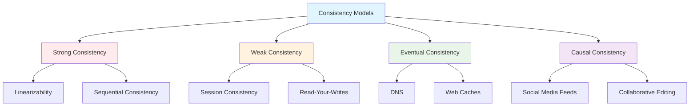
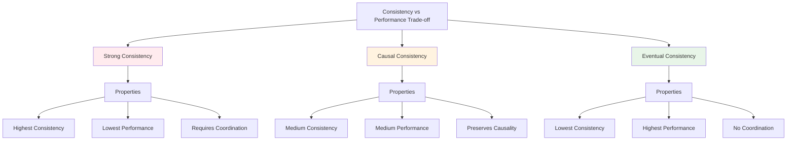

# System Design Fundamentals: Consistency Models

Consistency models define the rules for how and when updates to data become visible across a distributed system. Understanding these models is crucial for designing reliable distributed applications.

## What is Consistency?

In distributed systems, consistency refers to the guarantee that all nodes see the same data at the same time. Different consistency models offer different trade-offs between performance, availability, and correctness.



## Strong Consistency

Strong consistency guarantees that all reads return the most recent write. Once a write completes, all subsequent reads will see that value.

```go
// Strong Consistency Implementation using Paxos-like approach
package main

import (
    "fmt"
    "sync"
    "time"
)

type ProposalID struct {
    Number    int
    ProposerID string
}

func (p ProposalID) GreaterThan(other ProposalID) bool {
    if p.Number != other.Number {
        return p.Number > other.Number
    }
    return p.ProposerID > other.ProposerID
}

type Acceptor struct {
    id              string
    promisedID      *ProposalID
    acceptedID      *ProposalID
    acceptedValue   interface{}
    mutex           sync.RWMutex
}

func NewAcceptor(id string) *Acceptor {
    return &Acceptor{
        id: id,
    }
}

func (a *Acceptor) Prepare(proposalID ProposalID) (bool, *ProposalID, interface{}) {
    a.mutex.Lock()
    defer a.mutex.Unlock()
    
    // If we haven't promised anything or this proposal is higher
    if a.promisedID == nil || proposalID.GreaterThan(*a.promisedID) {
        a.promisedID = &proposalID
        fmt.Printf("Acceptor %s: PROMISE for proposal %d from %s\n", 
            a.id, proposalID.Number, proposalID.ProposerID)
        return true, a.acceptedID, a.acceptedValue
    }
    
    fmt.Printf("Acceptor %s: REJECT prepare for proposal %d (promised to %d)\n", 
        a.id, proposalID.Number, a.promisedID.Number)
    return false, nil, nil
}

func (a *Acceptor) Accept(proposalID ProposalID, value interface{}) bool {
    a.mutex.Lock()
    defer a.mutex.Unlock()
    
    // Accept if we haven't promised to a higher proposal
    if a.promisedID == nil || 
       proposalID.Number >= a.promisedID.Number {
        a.promisedID = &proposalID
        a.acceptedID = &proposalID
        a.acceptedValue = value
        fmt.Printf("Acceptor %s: ACCEPT proposal %d with value: %v\n", 
            a.id, proposalID.Number, value)
        return true
    }
    
    fmt.Printf("Acceptor %s: REJECT accept for proposal %d\n", a.id, proposalID.Number)
    return false
}

type Proposer struct {
    id              string
    proposalNumber  int
    acceptors       []*Acceptor
    mutex           sync.Mutex
}

func NewProposer(id string, acceptors []*Acceptor) *Proposer {
    return &Proposer{
        id:        id,
        acceptors: acceptors,
    }
}

func (p *Proposer) Propose(value interface{}) (bool, interface{}) {
    p.mutex.Lock()
    p.proposalNumber++
    proposalID := ProposalID{
        Number:     p.proposalNumber,
        ProposerID: p.id,
    }
    p.mutex.Unlock()
    
    fmt.Printf("\n🚀 Proposer %s: Starting proposal %d with value: %v\n", 
        p.id, proposalID.Number, value)
    
    // Phase 1: Prepare
    promises := 0
    var highestAcceptedID *ProposalID
    var highestAcceptedValue interface{}
    
    var wg sync.WaitGroup
    var mu sync.Mutex
    
    for _, acceptor := range p.acceptors {
        wg.Add(1)
        go func(acc *Acceptor) {
            defer wg.Done()
            
            ok, acceptedID, acceptedValue := acc.Prepare(proposalID)
            
            mu.Lock()
            defer mu.Unlock()
            
            if ok {
                promises++
                
                // Track highest accepted proposal
                if acceptedID != nil && 
                   (highestAcceptedID == nil || acceptedID.GreaterThan(*highestAcceptedID)) {
                    highestAcceptedID = acceptedID
                    highestAcceptedValue = acceptedValue
                }
            }
        }(acceptor)
    }
    
    wg.Wait()
    
    // Need majority to proceed
    majority := len(p.acceptors)/2 + 1
    if promises < majority {
        fmt.Printf("❌ Proposer %s: Failed to get majority in prepare phase (%d/%d)\n", 
            p.id, promises, majority)
        return false, nil
    }
    
    fmt.Printf("✅ Proposer %s: Got majority promises (%d/%d)\n", 
        p.id, promises, len(p.acceptors))
    
    // If any acceptor already accepted a value, use that
    proposedValue := value
    if highestAcceptedValue != nil {
        proposedValue = highestAcceptedValue
        fmt.Printf("⚠️  Using previously accepted value: %v\n", proposedValue)
    }
    
    // Phase 2: Accept
    accepts := 0
    
    for _, acceptor := range p.acceptors {
        wg.Add(1)
        go func(acc *Acceptor) {
            defer wg.Done()
            
            if acc.Accept(proposalID, proposedValue) {
                mu.Lock()
                accepts++
                mu.Unlock()
            }
        }(acceptor)
    }
    
    wg.Wait()
    
    if accepts >= majority {
        fmt.Printf("✅ Proposer %s: Value %v COMMITTED (%d/%d accepts)\n\n", 
            p.id, proposedValue, accepts, len(p.acceptors))
        return true, proposedValue
    }
    
    fmt.Printf("❌ Proposer %s: Failed to get majority in accept phase (%d/%d)\n\n", 
        p.id, accepts, majority)
    return false, nil
}

// Strongly Consistent Key-Value Store
type StronglyConsistentStore struct {
    data      map[string]interface{}
    acceptors []*Acceptor
    proposer  *Proposer
    mutex     sync.RWMutex
}

func NewStronglyConsistentStore(numAcceptors int, proposerID string) *StronglyConsistentStore {
    acceptors := make([]*Acceptor, numAcceptors)
    for i := 0; i < numAcceptors; i++ {
        acceptors[i] = NewAcceptor(fmt.Sprintf("acceptor-%d", i))
    }
    
    return &StronglyConsistentStore{
        data:      make(map[string]interface{}),
        acceptors: acceptors,
        proposer:  NewProposer(proposerID, acceptors),
    }
}

type WriteOperation struct {
    Key   string
    Value interface{}
}

func (s *StronglyConsistentStore) Write(key string, value interface{}) error {
    op := WriteOperation{Key: key, Value: value}
    
    success, _ := s.proposer.Propose(op)
    if !success {
        return fmt.Errorf("failed to reach consensus for write")
    }
    
    s.mutex.Lock()
    s.data[key] = value
    s.mutex.Unlock()
    
    return nil
}

func (s *StronglyConsistentStore) Read(key string) (interface{}, bool) {
    s.mutex.RLock()
    defer s.mutex.RUnlock()
    
    value, exists := s.data[key]
    return value, exists
}

func main() {
    fmt.Println("=== Strong Consistency Demo (Paxos-like) ===\n")
    
    store := NewStronglyConsistentStore(5, "proposer-1")
    
    // Write with strong consistency
    err := store.Write("user:1:balance", 1000)
    if err != nil {
        fmt.Printf("Write failed: %v\n", err)
        return
    }
    
    // Read returns the committed value
    if value, exists := store.Read("user:1:balance"); exists {
        fmt.Printf("Read value: %v\n", value)
    }
    
    // Another write
    err = store.Write("user:1:balance", 1500)
    if err != nil {
        fmt.Printf("Write failed: %v\n", err)
    }
}
```

## Eventual Consistency

Eventual consistency guarantees that if no new updates are made, all replicas will eventually converge to the same value.

```go
// Eventual Consistency with Vector Clocks
package main

import (
    "fmt"
    "sync"
    "time"
)

type VectorClock map[string]int

func (vc VectorClock) Copy() VectorClock {
    copy := make(VectorClock)
    for k, v := range vc {
        copy[k] = v
    }
    return copy
}

func (vc VectorClock) Increment(nodeID string) {
    vc[nodeID]++
}

func (vc VectorClock) Merge(other VectorClock) {
    for nodeID, timestamp := range other {
        if vc[nodeID] < timestamp {
            vc[nodeID] = timestamp
        }
    }
}

func (vc VectorClock) HappensBefore(other VectorClock) bool {
    lessOrEqual := false
    strictlyLess := false
    
    allNodes := make(map[string]bool)
    for k := range vc {
        allNodes[k] = true
    }
    for k := range other {
        allNodes[k] = true
    }
    
    for nodeID := range allNodes {
        thisTime := vc[nodeID]
        otherTime := other[nodeID]
        
        if thisTime > otherTime {
            return false
        }
        if thisTime < otherTime {
            strictlyLess = true
        }
        if thisTime <= otherTime {
            lessOrEqual = true
        }
    }
    
    return lessOrEqual && strictlyLess
}

func (vc VectorClock) ConcurrentWith(other VectorClock) bool {
    return !vc.HappensBefore(other) && !other.HappensBefore(vc)
}

type VersionedValue struct {
    Value  interface{}
    Clock  VectorClock
    NodeID string
    Time   time.Time
}

type EventuallyConsistentNode struct {
    nodeID    string
    data      map[string][]VersionedValue
    clock     VectorClock
    peers     []*EventuallyConsistentNode
    mutex     sync.RWMutex
}

func NewEventuallyConsistentNode(nodeID string) *EventuallyConsistentNode {
    return &EventuallyConsistentNode{
        nodeID: nodeID,
        data:   make(map[string][]VersionedValue),
        clock:  make(VectorClock),
        peers:  make([]*EventuallyConsistentNode, 0),
    }
}

func (n *EventuallyConsistentNode) AddPeer(peer *EventuallyConsistentNode) {
    n.peers = append(n.peers, peer)
}

func (n *EventuallyConsistentNode) Write(key string, value interface{}) {
    n.mutex.Lock()
    defer n.mutex.Unlock()
    
    // Increment local clock
    n.clock.Increment(n.nodeID)
    
    versionedValue := VersionedValue{
        Value:  value,
        Clock:  n.clock.Copy(),
        NodeID: n.nodeID,
        Time:   time.Now(),
    }
    
    // Add to local store (keep all versions)
    n.data[key] = []VersionedValue{versionedValue}
    
    fmt.Printf("Node %s: WRITE key=%s value=%v clock=%v\n", 
        n.nodeID, key, value, versionedValue.Clock)
    
    // Asynchronously replicate to peers
    go n.replicateToPeers(key, versionedValue)
}

func (n *EventuallyConsistentNode) replicateToPeers(key string, value VersionedValue) {
    time.Sleep(50 * time.Millisecond) // Simulate network delay
    
    for _, peer := range n.peers {
        peer.ReceiveReplica(key, value)
    }
}

func (n *EventuallyConsistentNode) ReceiveReplica(key string, value VersionedValue) {
    n.mutex.Lock()
    defer n.mutex.Unlock()
    
    // Merge vector clocks
    n.clock.Merge(value.Clock)
    
    // Get existing versions
    existingVersions := n.data[key]
    
    // Check if this version is obsolete
    isObsolete := false
    for _, existing := range existingVersions {
        if value.Clock.HappensBefore(existing.Clock) {
            isObsolete = true
            break
        }
    }
    
    if isObsolete {
        fmt.Printf("Node %s: IGNORE obsolete version for key=%s\n", n.nodeID, key)
        return
    }
    
    // Remove versions that are obsoleted by this new version
    newVersions := make([]VersionedValue, 0)
    for _, existing := range existingVersions {
        if !existing.Clock.HappensBefore(value.Clock) {
            newVersions = append(newVersions, existing)
        }
    }
    
    // Add the new version
    newVersions = append(newVersions, value)
    n.data[key] = newVersions
    
    if len(newVersions) > 1 {
        fmt.Printf("Node %s: CONFLICT detected for key=%s (%d versions)\n", 
            n.nodeID, key, len(newVersions))
    } else {
        fmt.Printf("Node %s: REPLICATE key=%s value=%v clock=%v\n", 
            n.nodeID, key, value.Value, value.Clock)
    }
}

func (n *EventuallyConsistentNode) Read(key string) []VersionedValue {
    n.mutex.RLock()
    defer n.mutex.RUnlock()
    
    versions := n.data[key]
    if len(versions) == 0 {
        fmt.Printf("Node %s: READ key=%s -> NOT FOUND\n", n.nodeID, key)
        return nil
    }
    
    fmt.Printf("Node %s: READ key=%s -> %d version(s)\n", n.nodeID, key, len(versions))
    return versions
}

// Last-Write-Wins conflict resolution
func (n *EventuallyConsistentNode) ReadLWW(key string) (interface{}, bool) {
    n.mutex.RLock()
    defer n.mutex.RUnlock()
    
    versions := n.data[key]
    if len(versions) == 0 {
        return nil, false
    }
    
    // Find version with latest timestamp
    latest := versions[0]
    for _, v := range versions[1:] {
        if v.Time.After(latest.Time) {
            latest = v
        }
    }
    
    fmt.Printf("Node %s: READ-LWW key=%s -> value=%v (timestamp=%v)\n", 
        n.nodeID, key, latest.Value, latest.Time)
    return latest.Value, true
}

// Application-specific conflict resolution
func (n *EventuallyConsistentNode) ReadWithResolver(key string, resolver func([]VersionedValue) interface{}) (interface{}, bool) {
    n.mutex.RLock()
    versions := n.data[key]
    n.mutex.RUnlock()
    
    if len(versions) == 0 {
        return nil, false
    }
    
    if len(versions) == 1 {
        return versions[0].Value, true
    }
    
    // Multiple versions - use resolver
    resolved := resolver(versions)
    fmt.Printf("Node %s: RESOLVED conflict for key=%s -> value=%v\n", 
        n.nodeID, key, resolved)
    return resolved, true
}

func main() {
    fmt.Println("=== Eventual Consistency Demo ===\n")
    
    // Create a cluster of 3 nodes
    node1 := NewEventuallyConsistentNode("node-1")
    node2 := NewEventuallyConsistentNode("node-2")
    node3 := NewEventuallyConsistentNode("node-3")
    
    // Connect nodes as peers
    node1.AddPeer(node2)
    node1.AddPeer(node3)
    node2.AddPeer(node1)
    node2.AddPeer(node3)
    node3.AddPeer(node1)
    node3.AddPeer(node2)
    
    // Concurrent writes to different nodes
    fmt.Println("--- Concurrent writes to same key ---")
    node1.Write("counter", 10)
    node2.Write("counter", 20)
    
    // Give time for replication
    time.Sleep(200 * time.Millisecond)
    
    // Read from all nodes - may see conflicts
    fmt.Println("\n--- Reading from all nodes ---")
    node1.Read("counter")
    node2.Read("counter")
    node3.Read("counter")
    
    // Resolve conflicts using Last-Write-Wins
    fmt.Println("\n--- Resolving conflicts with LWW ---")
    node1.ReadLWW("counter")
    node2.ReadLWW("counter")
    node3.ReadLWW("counter")
    
    // Custom resolver - sum all values
    fmt.Println("\n--- Custom conflict resolution (sum) ---")
    sumResolver := func(versions []VersionedValue) interface{} {
        sum := 0
        for _, v := range versions {
            if val, ok := v.Value.(int); ok {
                sum += val
            }
        }
        return sum
    }
    
    node1.ReadWithResolver("counter", sumResolver)
}
```

## Causal Consistency

Causal consistency ensures that operations that are causally related are seen in the same order by all processes.

```go
// Causal Consistency Implementation
package main

import (
    "fmt"
    "sync"
    "time"
)

type CausalClock map[string]int

func (cc CausalClock) Copy() CausalClock {
    copy := make(CausalClock)
    for k, v := range cc {
        copy[k] = v
    }
    return copy
}

func (cc CausalClock) Increment(nodeID string) {
    cc[nodeID]++
}

func (cc CausalClock) Update(other CausalClock) {
    for nodeID, timestamp := range other {
        if cc[nodeID] < timestamp {
            cc[nodeID] = timestamp
        }
    }
}

func (cc CausalClock) CanDeliver(messageID string, messageClock CausalClock) bool {
    for nodeID, timestamp := range messageClock {
        if nodeID == messageID {
            // For the sender, we need exactly the next message
            if timestamp != cc[nodeID]+1 {
                return false
            }
        } else {
            // For others, we need to have seen all their prior messages
            if cc[nodeID] < timestamp {
                return false
            }
        }
    }
    return true
}

type CausalMessage struct {
    ID        string
    SenderID  string
    Content   interface{}
    Clock     CausalClock
    Timestamp time.Time
}

type CausalConsistentNode struct {
    nodeID         string
    clock          CausalClock
    deliveredMsgs  []CausalMessage
    pendingMsgs    []CausalMessage
    peers          []*CausalConsistentNode
    mutex          sync.RWMutex
    deliveryBuffer chan CausalMessage
}

func NewCausalConsistentNode(nodeID string) *CausalConsistentNode {
    node := &CausalConsistentNode{
        nodeID:         nodeID,
        clock:          make(CausalClock),
        deliveredMsgs:  make([]CausalMessage, 0),
        pendingMsgs:    make([]CausalMessage, 0),
        peers:          make([]*CausalConsistentNode, 0),
        deliveryBuffer: make(chan CausalMessage, 100),
    }
    
    // Start delivery processor
    go node.processDeliveries()
    
    return node
}

func (n *CausalConsistentNode) AddPeer(peer *CausalConsistentNode) {
    n.peers = append(n.peers, peer)
}

func (n *CausalConsistentNode) Send(content interface{}) string {
    n.mutex.Lock()
    defer n.mutex.Unlock()
    
    // Increment local clock
    n.clock.Increment(n.nodeID)
    
    msgID := fmt.Sprintf("%s-%d", n.nodeID, n.clock[n.nodeID])
    
    msg := CausalMessage{
        ID:        msgID,
        SenderID:  n.nodeID,
        Content:   content,
        Clock:     n.clock.Copy(),
        Timestamp: time.Now(),
    }
    
    // Immediately deliver to self
    n.deliveredMsgs = append(n.deliveredMsgs, msg)
    
    fmt.Printf("Node %s: SEND msg=%s content=%v clock=%v\n", 
        n.nodeID, msgID, content, msg.Clock)
    
    // Asynchronously broadcast to peers
    go n.broadcastToPeers(msg)
    
    return msgID
}

func (n *CausalConsistentNode) broadcastToPeers(msg CausalMessage) {
    // Simulate network delay
    time.Sleep(time.Duration(50+n.nodeID[len(n.nodeID)-1]) * time.Millisecond)
    
    for _, peer := range n.peers {
        peer.Receive(msg)
    }
}

func (n *CausalConsistentNode) Receive(msg CausalMessage) {
    n.deliveryBuffer <- msg
}

func (n *CausalConsistentNode) processDeliveries() {
    ticker := time.NewTicker(10 * time.Millisecond)
    defer ticker.Stop()
    
    for {
        select {
        case msg := <-n.deliveryBuffer:
            n.mutex.Lock()
            n.pendingMsgs = append(n.pendingMsgs, msg)
            n.tryDeliverPending()
            n.mutex.Unlock()
            
        case <-ticker.C:
            n.mutex.Lock()
            n.tryDeliverPending()
            n.mutex.Unlock()
        }
    }
}

func (n *CausalConsistentNode) tryDeliverPending() {
    // Try to deliver pending messages in causal order
    delivered := true
    for delivered {
        delivered = false
        
        for i := 0; i < len(n.pendingMsgs); i++ {
            msg := n.pendingMsgs[i]
            
            if n.clock.CanDeliver(msg.SenderID, msg.Clock) {
                // Can deliver this message
                n.deliver(msg)
                
                // Remove from pending
                n.pendingMsgs = append(n.pendingMsgs[:i], n.pendingMsgs[i+1:]...)
                delivered = true
                break
            }
        }
    }
}

func (n *CausalConsistentNode) deliver(msg CausalMessage) {
    // Update clock
    n.clock.Update(msg.Clock)
    n.clock[msg.SenderID] = msg.Clock[msg.SenderID]
    
    // Add to delivered messages
    n.deliveredMsgs = append(n.deliveredMsgs, msg)
    
    fmt.Printf("Node %s: DELIVER msg=%s content=%v clock=%v\n", 
        n.nodeID, msg.ID, msg.Content, n.clock)
}

func (n *CausalConsistentNode) GetDeliveredMessages() []CausalMessage {
    n.mutex.RLock()
    defer n.mutex.RUnlock()
    
    return append([]CausalMessage{}, n.deliveredMsgs...)
}

func (n *CausalConsistentNode) GetPendingCount() int {
    n.mutex.RLock()
    defer n.mutex.RUnlock()
    
    return len(n.pendingMsgs)
}

// Causal Key-Value Store
type CausalKVStore struct {
    node  *CausalConsistentNode
    data  map[string]interface{}
    mutex sync.RWMutex
}

func NewCausalKVStore(nodeID string) *CausalKVStore {
    store := &CausalKVStore{
        node: NewCausalConsistentNode(nodeID),
        data: make(map[string]interface{}),
    }
    
    // Process delivered messages
    go store.processMessages()
    
    return store
}

func (s *CausalKVStore) processMessages() {
    ticker := time.NewTicker(50 * time.Millisecond)
    defer ticker.Stop()
    
    lastProcessed := 0
    
    for range ticker.C {
        messages := s.node.GetDeliveredMessages()
        
        if len(messages) > lastProcessed {
            s.mutex.Lock()
            for i := lastProcessed; i < len(messages); i++ {
                msg := messages[i]
                if op, ok := msg.Content.(map[string]interface{}); ok {
                    key := op["key"].(string)
                    value := op["value"]
                    s.data[key] = value
                }
            }
            lastProcessed = len(messages)
            s.mutex.Unlock()
        }
    }
}

func (s *CausalKVStore) Put(key string, value interface{}) {
    op := map[string]interface{}{
        "type":  "put",
        "key":   key,
        "value": value,
    }
    
    s.node.Send(op)
    
    // Update local data
    s.mutex.Lock()
    s.data[key] = value
    s.mutex.Unlock()
}

func (s *CausalKVStore) Get(key string) (interface{}, bool) {
    s.mutex.RLock()
    defer s.mutex.RUnlock()
    
    value, exists := s.data[key]
    return value, exists
}

func (s *CausalKVStore) AddPeer(peer *CausalKVStore) {
    s.node.AddPeer(peer.node)
}

func main() {
    fmt.Println("=== Causal Consistency Demo ===\n")
    
    // Create three nodes
    store1 := NewCausalKVStore("store-1")
    store2 := NewCausalKVStore("store-2")
    store3 := NewCausalKVStore("store-3")
    
    // Connect as peers
    store1.AddPeer(store2)
    store1.AddPeer(store3)
    store2.AddPeer(store1)
    store2.AddPeer(store3)
    store3.AddPeer(store1)
    store3.AddPeer(store2)
    
    // Causally related writes
    fmt.Println("--- Causally related operations ---")
    store1.Put("post:1", "Hello World")        // A
    time.Sleep(100 * time.Millisecond)
    store2.Put("comment:1", "Nice post!")      // B (causally depends on A)
    
    // Give time for causal delivery
    time.Sleep(500 * time.Millisecond)
    
    fmt.Println("\n--- Final state on all stores ---")
    if val, ok := store1.Get("post:1"); ok {
        fmt.Printf("Store1 - post:1: %v\n", val)
    }
    if val, ok := store1.Get("comment:1"); ok {
        fmt.Printf("Store1 - comment:1: %v\n", val)
    }
    
    fmt.Printf("\nStore1 pending: %d\n", store1.node.GetPendingCount())
    fmt.Printf("Store2 pending: %d\n", store2.node.GetPendingCount())
    fmt.Printf("Store3 pending: %d\n", store3.node.GetPendingCount())
}
```

## Session Consistency

Session consistency guarantees that within a single session, reads reflect all writes performed in that session.

```go
// Session Consistency Implementation
package main

import (
    "fmt"
    "sync"
    "time"
)

type SessionID string

type WriteOperation struct {
    Key       string
    Value     interface{}
    SessionID SessionID
    Timestamp time.Time
    Version   int
}

type SessionConsistentStore struct {
    data            map[string]interface{}
    versions        map[string]int
    sessionWrites   map[SessionID][]WriteOperation
    globalVersion   int
    mutex           sync.RWMutex
    replicaMutex    sync.RWMutex
    replicationLog  []WriteOperation
}

func NewSessionConsistentStore() *SessionConsistentStore {
    return &SessionConsistentStore{
        data:          make(map[string]interface{}),
        versions:      make(map[string]int),
        sessionWrites: make(map[SessionID][]WriteOperation),
        replicationLog: make([]WriteOperation, 0),
    }
}

func (s *SessionConsistentStore) CreateSession() SessionID {
    sessionID := SessionID(fmt.Sprintf("session-%d", time.Now().UnixNano()))
    
    s.mutex.Lock()
    s.sessionWrites[sessionID] = make([]WriteOperation, 0)
    s.mutex.Unlock()
    
    fmt.Printf("Created session: %s\n", sessionID)
    return sessionID
}

func (s *SessionConsistentStore) Write(sessionID SessionID, key string, value interface{}) error {
    s.mutex.Lock()
    defer s.mutex.Unlock()
    
    s.globalVersion++
    
    op := WriteOperation{
        Key:       key,
        Value:     value,
        SessionID: sessionID,
        Timestamp: time.Now(),
        Version:   s.globalVersion,
    }
    
    // Apply locally
    s.data[key] = value
    s.versions[key] = s.globalVersion
    
    // Track in session
    if _, exists := s.sessionWrites[sessionID]; !exists {
        s.sessionWrites[sessionID] = make([]WriteOperation, 0)
    }
    s.sessionWrites[sessionID] = append(s.sessionWrites[sessionID], op)
    
    // Add to replication log
    s.replicationLog = append(s.replicationLog, op)
    
    fmt.Printf("Session %s: WRITE key=%s value=%v version=%d\n", 
        sessionID, key, value, s.globalVersion)
    
    return nil
}

func (s *SessionConsistentStore) Read(sessionID SessionID, key string) (interface{}, bool, error) {
    s.mutex.RLock()
    defer s.mutex.RUnlock()
    
    // Check if this session has any writes for this key
    if sessionWrites, exists := s.sessionWrites[sessionID]; exists {
        // Find the latest write to this key in this session
        for i := len(sessionWrites) - 1; i >= 0; i-- {
            if sessionWrites[i].Key == key {
                fmt.Printf("Session %s: READ key=%s value=%v (session write, v%d)\n", 
                    sessionID, key, sessionWrites[i].Value, sessionWrites[i].Version)
                return sessionWrites[i].Value, true, nil
            }
        }
    }
    
    // Otherwise read from global store
    value, exists := s.data[key]
    version := s.versions[key]
    
    if exists {
        fmt.Printf("Session %s: READ key=%s value=%v (global store, v%d)\n", 
            sessionID, key, value, version)
    } else {
        fmt.Printf("Session %s: READ key=%s -> NOT FOUND\n", sessionID, key)
    }
    
    return value, exists, nil
}

func (s *SessionConsistentStore) CloseSession(sessionID SessionID) {
    s.mutex.Lock()
    defer s.mutex.Unlock()
    
    delete(s.sessionWrites, sessionID)
    fmt.Printf("Closed session: %s\n", sessionID)
}

// Read-Your-Writes consistency
type ReadYourWritesStore struct {
    data          map[string]interface{}
    versions      map[string]int
    globalVersion int
    mutex         sync.RWMutex
}

func NewReadYourWritesStore() *ReadYourWritesStore {
    return &ReadYourWritesStore{
        data:     make(map[string]interface{}),
        versions: make(map[string]int),
    }
}

type ClientSession struct {
    clientID      string
    store         *ReadYourWritesStore
    lastReadVer   map[string]int
    lastWriteVer  map[string]int
    mutex         sync.RWMutex
}

func (s *ReadYourWritesStore) NewClient(clientID string) *ClientSession {
    return &ClientSession{
        clientID:     clientID,
        store:        s,
        lastReadVer:  make(map[string]int),
        lastWriteVer: make(map[string]int),
    }
}

func (c *ClientSession) Write(key string, value interface{}) error {
    c.store.mutex.Lock()
    defer c.store.mutex.Unlock()
    
    c.store.globalVersion++
    version := c.store.globalVersion
    
    c.store.data[key] = value
    c.store.versions[key] = version
    
    c.mutex.Lock()
    c.lastWriteVer[key] = version
    c.mutex.Unlock()
    
    fmt.Printf("Client %s: WRITE key=%s value=%v version=%d\n", 
        c.clientID, key, value, version)
    
    return nil
}

func (c *ClientSession) Read(key string) (interface{}, bool) {
    c.mutex.RLock()
    requiredVersion := c.lastWriteVer[key]
    c.mutex.RUnlock()
    
    // Wait until the required version is available
    for {
        c.store.mutex.RLock()
        currentVersion := c.store.versions[key]
        value, exists := c.store.data[key]
        c.store.mutex.RUnlock()
        
        if currentVersion >= requiredVersion {
            c.mutex.Lock()
            c.lastReadVer[key] = currentVersion
            c.mutex.Unlock()
            
            fmt.Printf("Client %s: READ key=%s value=%v version=%d (required=%d)\n", 
                c.clientID, key, value, currentVersion, requiredVersion)
            return value, exists
        }
        
        // Version not yet available, wait
        fmt.Printf("Client %s: WAITING for key=%s version=%d (current=%d)\n", 
            c.clientID, key, requiredVersion, currentVersion)
        time.Sleep(50 * time.Millisecond)
    }
}

func main() {
    fmt.Println("=== Session Consistency Demo ===\n")
    
    store := NewSessionConsistentStore()
    
    // Create sessions
    session1 := store.CreateSession()
    session2 := store.CreateSession()
    
    // Session 1 writes
    store.Write(session1, "user:1:name", "Alice")
    store.Write(session1, "user:1:email", "alice@example.com")
    
    // Session 1 reads - should see its own writes
    store.Read(session1, "user:1:name")
    store.Read(session1, "user:1:email")
    
    // Session 2 reads - may not see session 1's writes immediately
    time.Sleep(100 * time.Millisecond)
    store.Read(session2, "user:1:name")
    
    // Session 2 writes
    store.Write(session2, "user:2:name", "Bob")
    
    // Session 2 reads its own write
    store.Read(session2, "user:2:name")
    
    store.CloseSession(session1)
    store.CloseSession(session2)
    
    fmt.Println("\n=== Read-Your-Writes Demo ===\n")
    
    rywStore := NewReadYourWritesStore()
    
    client1 := rywStore.NewClient("client-1")
    client2 := rywStore.NewClient("client-2")
    
    // Client 1 writes and reads
    client1.Write("config:theme", "dark")
    client1.Read("config:theme") // Guaranteed to see "dark"
    
    // Client 2 reads - may or may not see client 1's write
    client2.Read("config:theme")
    
    // Client 2 writes and reads
    client2.Write("config:theme", "light")
    client2.Read("config:theme") // Guaranteed to see "light"
}
```

## Consistency Model Comparison



## Choosing the Right Consistency Model

```go
// Consistency Model Decision Helper
package main

import "fmt"

type ApplicationRequirements struct {
    RequiresStrongConsistency bool
    ToleratesStaleReads       bool
    NeedsCausalOrdering       bool
    HighAvailabilityRequired  bool
    GlobalDistribution        bool
    WriteHeavyWorkload        bool
}

type ConsistencyRecommendation struct {
    Model           string
    Confidence      float64
    Reasoning       []string
    Considerations  []string
}

func RecommendConsistencyModel(req ApplicationRequirements) ConsistencyRecommendation {
    reasoning := make([]string, 0)
    considerations := make([]string, 0)
    
    // Strong consistency check
    if req.RequiresStrongConsistency {
        reasoning = append(reasoning, "Application requires strong consistency guarantees")
        considerations = append(considerations, "May impact availability during network partitions")
        considerations = append(considerations, "Higher latency due to coordination overhead")
        
        return ConsistencyRecommendation{
            Model:          "Strong Consistency (Linearizable)",
            Confidence:     0.9,
            Reasoning:      reasoning,
            Considerations: considerations,
        }
    }
    
    // Causal consistency check
    if req.NeedsCausalOrdering && !req.ToleratesStaleReads {
        reasoning = append(reasoning, "Application needs to preserve causal relationships")
        reasoning = append(reasoning, "Cannot tolerate seeing effects before causes")
        considerations = append(considerations, "Better performance than strong consistency")
        considerations = append(considerations, "More complex implementation")
        
        return ConsistencyRecommendation{
            Model:          "Causal Consistency",
            Confidence:     0.85,
            Reasoning:      reasoning,
            Considerations: considerations,
        }
    }
    
    // Eventual consistency with session guarantees
    if req.ToleratesStaleReads && !req.NeedsCausalOrdering {
        reasoning = append(reasoning, "Application can tolerate stale reads")
        
        if req.HighAvailabilityRequired {
            reasoning = append(reasoning, "High availability is a priority")
        }
        
        if req.GlobalDistribution {
            reasoning = append(reasoning, "Global distribution benefits from eventual consistency")
        }
        
        considerations = append(considerations, "Consider session consistency for better UX")
        considerations = append(considerations, "Implement conflict resolution strategies")
        considerations = append(considerations, "Best performance and availability")
        
        return ConsistencyRecommendation{
            Model:          "Eventual Consistency",
            Confidence:     0.8,
            Reasoning:      reasoning,
            Considerations: considerations,
        }
    }
    
    // Default recommendation
    reasoning = append(reasoning, "Requirements don't clearly favor one model")
    considerations = append(considerations, "Start with causal consistency as a middle ground")
    
    return ConsistencyRecommendation{
        Model:          "Causal Consistency",
        Confidence:     0.6,
        Reasoning:      reasoning,
        Considerations: considerations,
    }
}

func main() {
    fmt.Println("=== Consistency Model Recommendation System ===\n")
    
    // Example 1: Banking application
    bankingReqs := ApplicationRequirements{
        RequiresStrongConsistency: true,
        ToleratesStaleReads:       false,
        NeedsCausalOrdering:       true,
        HighAvailabilityRequired:  false,
        GlobalDistribution:        false,
        WriteHeavyWorkload:        false,
    }
    
    fmt.Println("Banking Application:")
    rec := RecommendConsistencyModel(bankingReqs)
    printRecommendation(rec)
    
    // Example 2: Social media feed
    socialReqs := ApplicationRequirements{
        RequiresStrongConsistency: false,
        ToleratesStaleReads:       true,
        NeedsCausalOrdering:       true,
        HighAvailabilityRequired:  true,
        GlobalDistribution:        true,
        WriteHeavyWorkload:        true,
    }
    
    fmt.Println("\nSocial Media Application:")
    rec = RecommendConsistencyModel(socialReqs)
    printRecommendation(rec)
    
    // Example 3: Collaborative editing
    collabReqs := ApplicationRequirements{
        RequiresStrongConsistency: false,
        ToleratesStaleReads:       false,
        NeedsCausalOrdering:       true,
        HighAvailabilityRequired:  true,
        GlobalDistribution:        false,
        WriteHeavyWorkload:        true,
    }
    
    fmt.Println("\nCollaborative Editing Application:")
    rec = RecommendConsistencyModel(collabReqs)
    printRecommendation(rec)
}

func printRecommendation(rec ConsistencyRecommendation) {
    fmt.Printf("  Recommended Model: %s\n", rec.Model)
    fmt.Printf("  Confidence: %.0f%%\n\n", rec.Confidence*100)
    
    fmt.Println("  Reasoning:")
    for _, reason := range rec.Reasoning {
        fmt.Printf("    • %s\n", reason)
    }
    
    fmt.Println("\n  Considerations:")
    for _, consideration := range rec.Considerations {
        fmt.Printf("    ⚠️  %s\n", consideration)
    }
}
```

## Best Practices

1. **Choose Based on Requirements**: Don't default to strong consistency - it's expensive
2. **Use Session Consistency**: Provides good UX while maintaining performance
3. **Implement Conflict Resolution**: For eventual consistency, have clear resolution strategies
4. **Monitor Consistency Lag**: Track replication delays in eventually consistent systems
5. **Design for Idempotency**: Operations should be safe to retry
6. **Version Your Data**: Use vector clocks or version numbers for conflict detection
7. **Test Partition Scenarios**: Verify behavior during network partitions

## Conclusion

Consistency models represent fundamental trade-offs in distributed systems:

- **Strong Consistency**: Best for financial systems, inventory management
- **Causal Consistency**: Ideal for social networks, collaborative applications
- **Eventual Consistency**: Perfect for caches, DNS, content delivery
- **Session Consistency**: Great balance for web applications

Choose based on your specific requirements, understanding that different parts of your system can use different models.