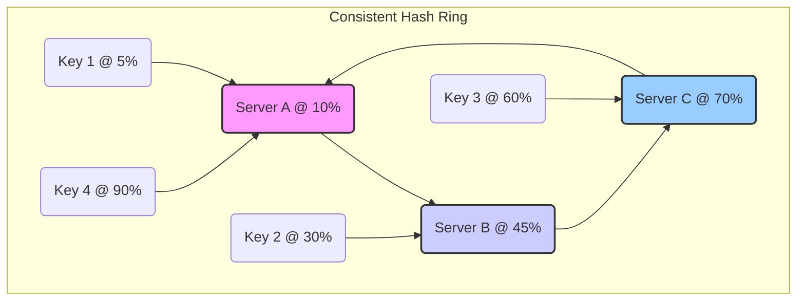
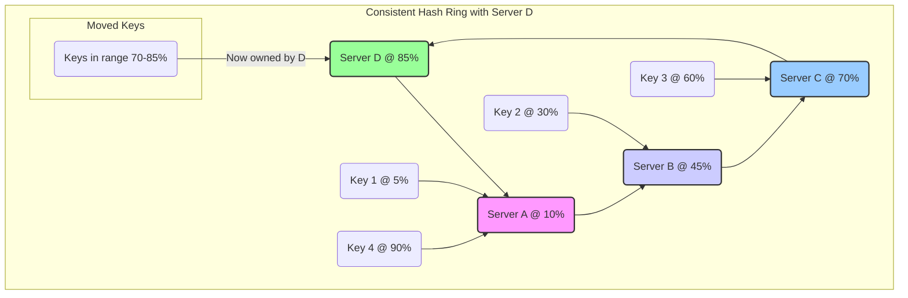
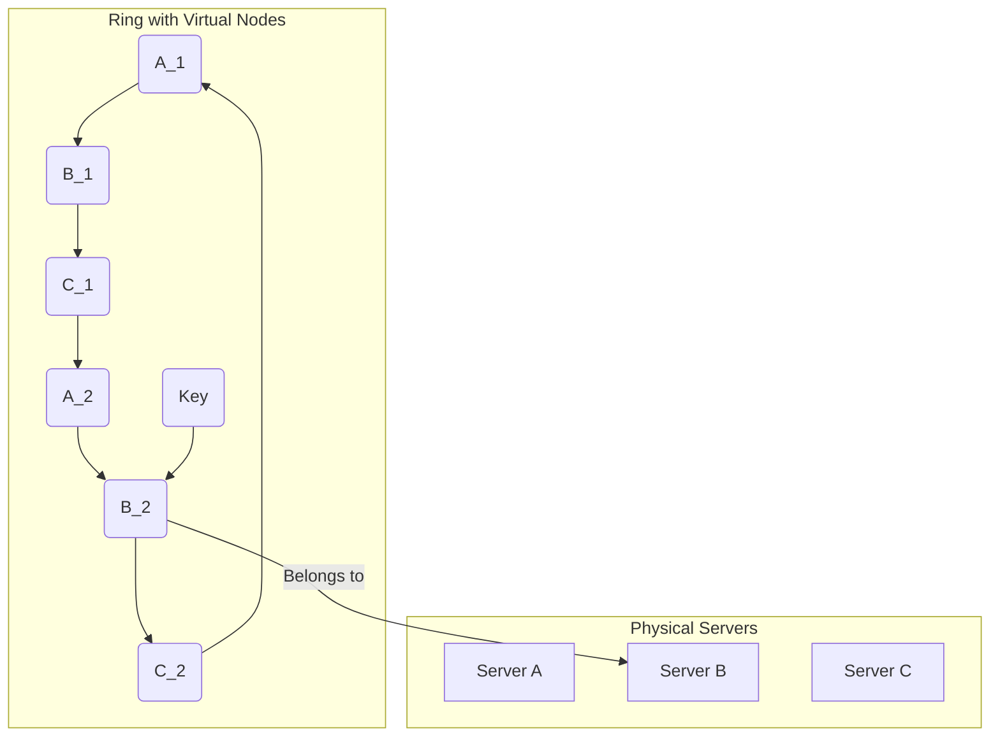

## Introduction: The Problem with Modulo Hashing

In our previous discussions on hash-based partitioning, we used a simple `hash(key) % N` formula, where `N` is the number of shards. This approach works well for distributing data evenly, but it has a catastrophic flaw when `N` changes.

Imagine you have a caching system with 4 servers. When you add a 5th server, `N` changes from 4 to 5. The result of the modulo operation changes for nearly every key.

*   `hash(key) % 4` is completely different from `hash(key) % 5`.

This means that when you add or remove a server, almost all of your data needs to be moved to a new server. This is called a **massive reshuffle**. During this period, your cache is largely invalidated, and your database gets hammered with requests, potentially leading to a system-wide outage.

**Consistent Hashing** is the solution to this problem. It's a hashing strategy that dramatically minimizes the amount of data that needs to be moved when the number of servers changes.

## How Consistent Hashing Works: The Hash Ring

Consistent hashing maps both servers and keys onto a conceptual circle called a **hash ring**. The ring represents the entire range of possible hash values (e.g., from 0 to 2^32 - 1).

Here's the process:

1.  **Map Servers to the Ring:** Each server is assigned a position on the ring by hashing its name or IP address.
2.  **Map Keys to the Ring:** To figure out where a piece of data lives, you hash its key to get a position on the same ring.
3.  **Find the "Next" Server:** From the key's position on the ring, you move clockwise until you find the first server. That server is the owner of the key.



### Adding a Server

Now, let's see the magic. We add a new server, **Server D**, which hashes to a position at 85% on the ring.

*   **Before:** Keys between C (70%) and A (10%) belonged to Server A. This includes Key 4.
*   **After:** Server D now sits between C and A. Keys between C (70%) and D (85%) still go to D's clockwise neighbor, A. But keys between D (85%) and A (10%) now belong to Server A. The keys between C (70%) and D (85%) now belong to D.

The only keys that needed to move were the ones in the range `(70%, 85%]`. All other keys (K1, K2, K3) stayed exactly where they were! We only had to reshuffle a small fraction of the data.



### Removing a Server

The same logic applies when a server is removed. If Server B fails, its keys are automatically reassigned to its clockwise neighbor, Server C. Again, only the keys owned by Server B are affected.

## The Problem of Uneven Distribution and Virtual Nodes

The basic approach has a flaw: if servers are placed randomly on the ring, they might end up close together, resulting in an uneven distribution of keys. One server might get a huge arc of the ring, while another gets a tiny one.

The solution is to use **virtual nodes** (or replicas). Instead of mapping each server to just one point on the ring, we map it to multiple points.

*   Server A might be mapped to `A_1`, `A_2`, `A_3`...
*   Server B might be mapped to `B_1`, `B_2`, `B_3`...

Now, when we place a key, we still walk clockwise, but we find the first *virtual* node. The key is then assigned to the physical server that owns that virtual node.

By adding many virtual nodes for each server, we smooth out the distribution. The more virtual nodes, the more even the load will be, at the cost of slightly more memory to store the ring's metadata.



## Go Example: Implementing a Consistent Hash Ring

Let's build a simple consistent hashing implementation in Go. We'll need a way to store the sorted hash values of the virtual nodes on the ring and a map to connect those hashes back to the physical server names.

```go
package main

import (
	"fmt"
	"hash/fnv"
	"sort"
	"strconv"
)

type Ring struct {
	Nodes        map[uint32]string
	SortedHashes []uint32
	ReplicaCount int
}

func NewRing(replicaCount int) *Ring {
	return &Ring{
		Nodes:        make(map[uint32]string),
		SortedHashes: []uint32{},
		ReplicaCount: replicaCount,
	}
}

func (r *Ring) hash(key string) uint32 {
	h := fnv.New32a()
	h.Write([]byte(key))
	return h.Sum32()
}

// AddNode adds a physical node (server) to the ring.
func (r *Ring) AddNode(node string) {
	for i := 0; i < r.ReplicaCount; i++ {
		// Create a unique string for each virtual node
		virtualNodeKey := node + ":" + strconv.Itoa(i)
		hashValue := r.hash(virtualNodeKey)
		r.Nodes[hashValue] = node
		r.SortedHashes = append(r.SortedHashes, hashValue)
	}
	// Keep the ring sorted
	sort.Slice(r.SortedHashes, func(i, j int) bool {
		return r.SortedHashes[i] < r.SortedHashes[j]
	})
}

// GetNode finds the physical node responsible for a given key.
func (r *Ring) GetNode(key string) string {
	if len(r.Nodes) == 0 {
		return ""
	}

	hashValue := r.hash(key)

	// Use binary search to find the first virtual node with a hash >= key's hash
	idx := sort.Search(len(r.SortedHashes), func(i int) bool {
		return r.SortedHashes[i] >= hashValue
	})

	// If we're at the end of the ring, wrap around to the first node
	if idx == len(r.SortedHashes) {
		idx = 0
	}

	return r.Nodes[r.SortedHashes[idx]]
}

func main() {
	// Create a ring with 100 virtual nodes per physical server
	ring := NewRing(100)

	// Add our servers
	ring.AddNode("cache-server-1")
	ring.AddNode("cache-server-2")
	ring.AddNode("cache-server-3")

	// Find where some keys should be stored
	keys := []string{"user:123", "product:456", "session:789", "user:profile:abc"}
	for _, key := range keys {
		node := ring.GetNode(key)
		fmt.Printf("Key '%s' is assigned to node '%s'\n", key, node)
	}

	fmt.Println("\n--- Adding a new server: cache-server-4 ---")
	ring.AddNode("cache-server-4")

	// Check assignments again. Only a fraction of keys should have moved.
	for _, key := range keys {
		node := ring.GetNode(key)
		fmt.Printf("Key '%s' is now assigned to node '%s'\n", key, node)
	}
}
```

## Conclusion

Consistent hashing is a fundamental technique in distributed systems, used in everything from caches (like Memcached) to databases (like DynamoDB and Cassandra) and load balancers.

By mapping both servers and keys to a ring and using virtual nodes to ensure an even distribution, it solves the critical problem of data reshuffling. It allows systems to scale horizontally—adding or removing nodes—without causing massive disruption, ensuring high availability and performance.
