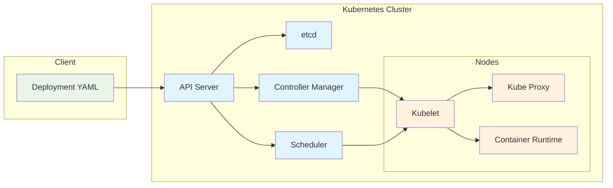

# System Design: Container Orchestration with Kubernetes

Container orchestration is the automated process of managing, deploying, scaling, and networking containerized applications. Kubernetes, the leading container orchestration platform, provides a robust framework for managing containerized workloads across clusters of hosts. Understanding Kubernetes architecture and design patterns is essential for building scalable, resilient, and maintainable applications in modern distributed systems.

## Introduction to Container Orchestration

Container orchestration addresses the challenges of managing containers at scale, including:

- **Scheduling**: Automatically placing containers on appropriate nodes
- **Scaling**: Dynamically adjusting the number of container instances
- **Health Management**: Monitoring and automatically restarting failed containers
- **Service Discovery**: Connecting containers that need to communicate
- **Load Balancing**: Distributing traffic across multiple container instances
- **Rolling Updates**: Deploying new versions without downtime



## Kubernetes Architecture

Kubernetes follows a master-worker architecture with several key components:

### Control Plane Components

#### API Server
The API server is the front end of the Kubernetes control plane, exposing the Kubernetes API and serving as the central management point for the cluster. It validates and configures data for API objects like Pods, Services, and Deployments.

#### etcd
etcd is a consistent and highly-available key-value store used as Kubernetes' backing store for all cluster data. It stores the cluster state, including configuration data, state of nodes, and service discovery information.

#### Controller Manager
The controller manager runs controller processes that regulate the state of the cluster. Controllers include node controllers, replication controllers, and endpoints controllers that ensure the desired state matches the current state.

#### Scheduler
The scheduler watches for newly created Pods that have no assigned node and selects a node for them to run on based on resource requirements, policies, and constraints.

### Node Components

#### Kubelet
The Kubelet is an agent that runs on each node in the cluster, ensuring that containers are running in a Pod. It takes a set of PodSpecs and ensures that the described containers are running and healthy.

#### Kube Proxy
Kube Proxy runs on each node and maintains network rules to allow Pods to communicate with each other and the outside world. It implements the Kubernetes Service concept by load balancing network traffic.

#### Container Runtime
The container runtime is the software responsible for running containers, such as Docker, containerd, or CRI-O.

## Kubernetes Objects and Design Patterns

### Pods
A Pod is the smallest deployable unit in Kubernetes, representing one or more containers that share storage, network, and specifications for how to run the containers.

```yaml
# Pod configuration example
apiVersion: v1
kind: Pod
metadata:
  name: my-app-pod
  labels:
    app: my-app
    version: v1
spec:
  containers:
  - name: my-app-container
    image: my-app:1.0
    ports:
    - containerPort: 8080
    env:
    - name: DATABASE_URL
      valueFrom:
        secretKeyRef:
          name: db-secret
          key: url
    resources:
      requests:
        memory: "64Mi"
        cpu: "250m"
      limits:
        memory: "128Mi"
        cpu: "500m"
    readinessProbe:
      httpGet:
        path: /health
        port: 8080
      initialDelaySeconds: 5
      periodSeconds: 10
    livenessProbe:
      httpGet:
        path: /health
        port: 8080
      initialDelaySeconds: 15
      periodSeconds: 20
```

### Deployments
Deployments provide declarative updates for Pods and ReplicaSets, enabling rolling updates and rollbacks.

```yaml
# Deployment configuration example
apiVersion: apps/v1
kind: Deployment
metadata:
  name: my-app-deployment
spec:
  replicas: 3
  selector:
    matchLabels:
      app: my-app
  template:
    metadata:
      labels:
        app: my-app
    spec:
      containers:
      - name: my-app
        image: my-app:1.0
        ports:
        - containerPort: 8080
        env:
        - name: ENVIRONMENT
          value: "production"
        resources:
          requests:
            memory: "128Mi"
            cpu: "100m"
          limits:
            memory: "256Mi"
            cpu: "200m"
```

### Services
Services provide stable networking for Pods, creating a single IP address and DNS name to access a set of Pods.

```yaml
# Service configuration example
apiVersion: v1
kind: Service
metadata:
  name: my-app-service
spec:
  selector:
    app: my-app
  ports:
    - protocol: TCP
      port: 80
      targetPort: 8080
  type: ClusterIP  # or LoadBalancer, NodePort
```

### ConfigMaps and Secrets
ConfigMaps store non-confidential configuration data, while Secrets store sensitive information like passwords and API keys.

```yaml
# ConfigMap example
apiVersion: v1
kind: ConfigMap
metadata:
  name: app-config
data:
  database-host: "db.example.com"
  database-port: "5432"
  log-level: "info"

---
# Secret example
apiVersion: v1
kind: Secret
metadata:
  name: db-secret
type: Opaque
data:
  username: bXl1c2Vy  # base64 encoded
  password: bXlwYXNz  # base64 encoded
```

## Designing for Kubernetes

### 1. Twelve-Factor App Principles in Kubernetes

Kubernetes naturally supports many Twelve-Factor App principles:

- **Codebase**: Container images encapsulate the application code
- **Dependencies**: Dependencies are packaged with the application
- **Config**: Configuration is externalized via ConfigMaps and Secrets
- **Backing Services**: Services are accessed through environment variables
- **Build, Release, Run**: CI/CD pipelines handle the build-release-run cycle
- **Processes**: Each container represents a stateless process
- **Port Binding**: Applications bind to ports as specified
- **Concurrency**: Scaling is handled by Kubernetes
- **Disposability**: Fast startup and graceful shutdown are essential
- **Dev/Prod Parity**: The same container images run across environments
- **Logs**: Logs are treated as event streams
- **Admin Processes**: One-off admin tasks are run as jobs

### 2. Health Checks and Readiness

Implement proper health checks to ensure Kubernetes can manage your applications effectively:

```go
// Example application with health endpoints
package main

import (
    "encoding/json"
    "fmt"
    "log"
    "net/http"
    "time"
)

type HealthStatus struct {
    Status    string    `json:"status"`
    Timestamp time.Time `json:"timestamp"`
    Details   string    `json:"details,omitempty"`
}

func healthHandler(w http.ResponseWriter, r *http.Request) {
    // Perform actual health checks here (DB connectivity, etc.)
    status := HealthStatus{
        Status:    "healthy",
        Timestamp: time.Now(),
    }
    
    w.Header().Set("Content-Type", "application/json")
    json.NewEncoder(w).Encode(status)
}

func readinessHandler(w http.ResponseWriter, r *http.Request) {
    // Check if the application is ready to serve traffic
    // e.g., database connections established, caches warmed up
    isReady := true // Implement your readiness logic
    
    if isReady {
        w.WriteHeader(http.StatusOK)
        fmt.Fprint(w, "ready")
    } else {
        w.WriteHeader(http.StatusServiceUnavailable)
        fmt.Fprint(w, "not ready")
    }
}

func main() {
    http.HandleFunc("/health", healthHandler)
    http.HandleFunc("/ready", readinessHandler)
    
    // Main application endpoint
    http.HandleFunc("/", func(w http.ResponseWriter, r *http.Request) {
        fmt.Fprintf(w, "Hello from Kubernetes Pod! Time: %s\n", time.Now())
    })
    
    log.Println("Server starting on :8080")
    log.Fatal(http.ListenAndServe(":8080", nil))
}
```

### 3. Resource Management

Properly configure resource requests and limits to ensure efficient scheduling and prevent resource exhaustion:

```yaml
# Resource management configuration
apiVersion: apps/v1
kind: Deployment
metadata:
  name: resource-managed-app
spec:
  replicas: 3
  selector:
    matchLabels:
      app: resource-managed-app
  template:
    metadata:
      labels:
        app: resource-managed-app
    spec:
      containers:
      - name: app
        image: my-app:latest
        resources:
          # Minimum resources guaranteed
          requests:
            memory: "128Mi"
            cpu: "100m"
            # ephemeral-storage: "1Gi"  # For storage limits
          
          # Maximum resources allowed
          limits:
            memory: "256Mi"
            cpu: "200m"
            
        # Configure resource limits for critical pods
        # Use PriorityClass for critical applications
---
apiVersion: scheduling.k8s.io/v1
kind: PriorityClass
metadata:
  name: high-priority
value: 1000000
globalDefault: false
description: "High priority for critical applications"
```

### 4. ConfigMaps and Secrets Best Practices

```yaml
# Example of proper configuration management
apiVersion: v1
kind: ConfigMap
metadata:
  name: app-config
data:
  app.properties: |
    server.port=8080
    logging.level=INFO
    cache.ttl=300
---
apiVersion: v1
kind: Secret
metadata:
  name: db-credentials
type: Opaque
stringData:
  username: "myuser"
  password: "mypassword"  # Kubernetes will auto-encode
---
apiVersion: apps/v1
kind: Deployment
metadata:
  name: app-with-config
spec:
  replicas: 2
  selector:
    matchLabels:
      app: app-with-config
  template:
    metadata:
      labels:
        app: app-with-config
    spec:
      containers:
      - name: app
        image: my-app:latest
        env:
        - name: DATABASE_URL
          valueFrom:
            secretKeyRef:
              name: db-credentials
              key: url
        - name: LOG_LEVEL
          valueFrom:
            configMapKeyRef:
              name: app-config
              key: log-level
        volumeMounts:
        - name: config-volume
          mountPath: /app/config
        - name: secret-volume
          mountPath: /app/secrets
          readOnly: true
      volumes:
      - name: config-volume
        configMap:
          name: app-config
      - name: secret-volume
        secret:
          secretName: db-credentials
```

## Kubernetes Design Patterns

### 1. Sidecar Pattern
The Sidecar pattern extends and enhances the main application container without changing it.

```yaml
# Sidecar pattern: Application with logging sidecar
apiVersion: apps/v1
kind: Deployment
metadata:
  name: app-with-sidecar
spec:
  replicas: 1
  selector:
    matchLabels:
      app: app-with-sidecar
  template:
    metadata:
      labels:
        app: app-with-sidecar
    spec:
      containers:
      - name: app
        image: my-app:latest
        ports:
        - containerPort: 8080
        volumeMounts:
        - name: shared-logs
          mountPath: /app/logs
      - name: log-shipper
        image: fluentd:latest
        volumeMounts:
        - name: shared-logs
          mountPath: /var/log
      volumes:
      - name: shared-logs
        emptyDir: {}
```

### 2. Adapter Pattern
The Adapter pattern normalizes the output of the application to a standard format.

```yaml
# Adapter pattern: Normalizing application metrics
apiVersion: apps/v1
kind: Deployment
metadata:
  name: app-with-adapter
spec:
  replicas: 1
  selector:
    matchLabels:
      app: app-with-adapter
  template:
    metadata:
      labels:
        app: app-with-adapter
    spec:
      containers:
      - name: app
        image: legacy-app:latest
        # Exposes metrics in legacy format
        ports:
        - containerPort: 8080
      - name: metrics-adapter
        image: prometheus-adapter:latest
        # Converts legacy metrics to Prometheus format
        ports:
        - containerPort: 9090
```

### 3. Ambassador Pattern
The Ambassador pattern provides a proxy for network connections to or from the main application.

```yaml
# Ambassador pattern: Database proxy sidecar
apiVersion: apps/v1
kind: Deployment
metadata:
  name: app-with-proxy
spec:
  replicas: 1
  selector:
    matchLabels:
      app: app-with-proxy
  template:
    metadata:
      labels:
        app: app-with-proxy
    spec:
      containers:
      - name: app
        image: my-app:latest
        env:
        - name: DATABASE_URL
          value: "localhost:5432"  # Connect to localhost via proxy
      - name: db-proxy
        image: postgres-proxy:latest
        ports:
        - containerPort: 5432
        env:
        - name: REMOTE_DB_HOST
          value: "production-db.example.com"
        - name: REMOTE_DB_PORT
          value: "5432"
```

## Scaling Strategies in Kubernetes

### Horizontal Pod Autoscaling (HPA)

```yaml
# Horizontal Pod Autoscaling configuration
apiVersion: autoscaling/v2
kind: HorizontalPodAutoscaler
metadata:
  name: my-app-hpa
spec:
  scaleTargetRef:
    apiVersion: apps/v1
    kind: Deployment
    name: my-app-deployment
  minReplicas: 2
  maxReplicas: 10
  metrics:
  - type: Resource
    resource:
      name: cpu
      target:
        type: Utilization
        averageUtilization: 70
  - type: Resource
    resource:
      name: memory
      target:
        type: Utilization
        averageUtilization: 80
  behavior:
    scaleDown:
      stabilizationWindowSeconds: 300
      policies:
      - type: Percent
        value: 10
        periodSeconds: 60
    scaleUp:
      stabilizationWindowSeconds: 60
      policies:
      - type: Percent
        value: 50
        periodSeconds: 60
```

### Vertical Pod Autoscaling (VPA)

```yaml
# Vertical Pod Autoscaling configuration
apiVersion: autoscaling.k8s.io/v1
kind: VerticalPodAutoscaler
metadata:
  name: my-app-vpa
spec:
  targetRef:
    apiVersion: apps/v1
    kind: Deployment
    name: my-app-deployment
  updatePolicy:
    updateMode: "Auto"
  resourcePolicy:
    containerPolicies:
    - containerName: my-app
      maxAllowed:
        cpu: 2
        memory: 2Gi
      minAllowed:
        cpu: 100m
        memory: 128Mi
```

### Cluster Autoscaling

Cluster autoscaling automatically adjusts the size of the node pool based on resource demands:

```go
// Simulated cluster autoscaling decision logic
package main

import (
    "fmt"
    "math"
)

type ClusterStatus struct {
    NodeCount       int
    TotalCapacity   ResourceCapacity
    RequestedUsage  ResourceCapacity
    PendingPods     int
}

type ResourceCapacity struct {
    CPU    float64 // in cores
    Memory float64 // in GB
}

type ClusterAutoscaler struct {
    minNodes int
    maxNodes int
    threshold float64
}

func NewClusterAutoscaler(minNodes, maxNodes int) *ClusterAutoscaler {
    return &ClusterAutoscaler{
        minNodes: minNodes,
        maxNodes: maxNodes,
        threshold: 0.7, // 70% utilization threshold
    }
}

func (ca *ClusterAutoscaler) ShouldScale(cluster ClusterStatus) (scaleUp, scaleDown bool, newCount int) {
    // Calculate current utilization
    cpuUtilization := cluster.RequestedUsage.CPU / cluster.TotalCapacity.CPU
    memoryUtilization := cluster.RequestedUsage.Memory / cluster.TotalCapacity.Memory
    
    // If utilization is high or there are pending pods, scale up
    highUtilization := cpuUtilization > ca.threshold || memoryUtilization > ca.threshold
    if highUtilization || cluster.PendingPods > 0 {
        // Calculate required additional capacity
        additionalCPU := cluster.RequestedUsage.CPU - (cluster.TotalCapacity.CPU * ca.threshold)
        additionalMemory := cluster.RequestedUsage.Memory - (cluster.TotalCapacity.Memory * ca.threshold)
        
        // Assume each node provides 4 CPU cores and 16 GB memory
        additionalNodesCPU := int(math.Ceil(additionalCPU / 4.0))
        additionalNodesMemory := int(math.Ceil(additionalMemory / 16.0))
        
        requestedNodes := cluster.NodeCount + max(additionalNodesCPU, additionalNodesMemory)
        newCount = max(cluster.NodeCount+1, min(requestedNodes, ca.maxNodes))
        return true, false, newCount
    }
    
    // If utilization is low and we can scale down
    lowUtilization := cpuUtilization < 0.3 && memoryUtilization < 0.3
    if lowUtilization && cluster.NodeCount > ca.minNodes {
        // Scale down gradually
        newCount = max(ca.minNodes, cluster.NodeCount-1)
        return false, true, newCount
    }
    
    return false, false, cluster.NodeCount
}

func max(a, b int) int {
    if a > b {
        return a
    }
    return b
}

func min(a, b int) int {
    if a < b {
        return a
    }
    return b
}

func main() {
    autoscaler := NewClusterAutoscaler(3, 20)
    
    // Simulate cluster with 5 nodes, high utilization
    cluster := ClusterStatus{
        NodeCount: 5,
        TotalCapacity: ResourceCapacity{
            CPU: 20.0,    // 5 nodes * 4 CPU cores
            Memory: 80.0, // 5 nodes * 16 GB
        },
        RequestedUsage: ResourceCapacity{
            CPU: 15.0,   // 75% CPU utilization
            Memory: 60.0, // 75% memory utilization
        },
        PendingPods: 3,
    }
    
    shouldScaleUp, shouldScaleDown, newCount := autoscaler.ShouldScale(cluster)
    
    fmt.Printf("Current nodes: %d\n", cluster.NodeCount)
    fmt.Printf("Scale up: %t, Scale down: %t, New count: %d\n", 
               shouldScaleUp, shouldScaleDown, newCount)
}
```

## Service Discovery and Load Balancing

### Internal Service Discovery

```yaml
# Service for internal communication
apiVersion: v1
kind: Service
metadata:
  name: user-service
  namespace: backend
spec:
  selector:
    app: user-service
  ports:
    - protocol: TCP
      port: 80
      targetPort: 8080
  type: ClusterIP

---
# Another service that needs to communicate with user-service
apiVersion: apps/v1
kind: Deployment
metadata:
  name: order-service
spec:
  replicas: 2
  selector:
    matchLabels:
      app: order-service
  template:
    metadata:
      labels:
        app: order-service
    spec:
      containers:
      - name: order-service
        image: order-service:latest
        env:
        - name: USER_SERVICE_URL
          value: "http://user-service.backend.svc.cluster.local:80"  # Kubernetes DNS
```

### External Load Balancing

```yaml
# LoadBalancer service for external access
apiVersion: v1
kind: Service
metadata:
  name: web-service
spec:
  selector:
    app: web-app
  ports:
    - protocol: TCP
      port: 80
      targetPort: 8080
  type: LoadBalancer  # Creates external load balancer

---
# Ingress for HTTP/HTTPS routing
apiVersion: networking.k8s.io/v1
kind: Ingress
metadata:
  name: web-ingress
  annotations:
    nginx.ingress.kubernetes.io/rewrite-target: /
spec:
  rules:
  - host: myapp.example.com
    http:
      paths:
      - path: /
        pathType: Prefix
        backend:
          service:
            name: web-service
            port:
              number: 80
```

## Security in Kubernetes

### Network Policies

```yaml
# Network policy example
apiVersion: networking.k8s.io/v1
kind: NetworkPolicy
metadata:
  name: web-allow-external
spec:
  podSelector:
    matchLabels:
      app: web-app
  policyTypes:
  - Ingress
  ingress:
  - from: []  # Allow traffic from all sources
    ports:
    - protocol: TCP
      port: 8080
---
apiVersion: networking.k8s.io/v1
kind: NetworkPolicy
metadata:
  name: db-allow-only-app
spec:
  podSelector:
    matchLabels:
      app: database
  policyTypes:
  - Ingress
  ingress:
  - from:
    - podSelector:
        matchLabels:
          app: app-server
    ports:
    - protocol: TCP
      port: 5432
```

### RBAC Configuration

```yaml
# Role-based access control example
apiVersion: v1
kind: ServiceAccount
metadata:
  name: app-service-account
  namespace: production

---
apiVersion: rbac.authorization.k8s.io/v1
kind: Role
metadata:
  namespace: production
  name: pod-reader
rules:
- apiGroups: [""]
  resources: ["pods"]
  verbs: ["get", "watch", "list"]

---
apiVersion: rbac.authorization.k8s.io/v1
kind: RoleBinding
metadata:
  name: read-pods
  namespace: production
subjects:
- kind: ServiceAccount
  name: app-service-account
  apiGroup: ""
roleRef:
  kind: Role
  name: pod-reader
  apiGroup: ""
```

## Monitoring and Observability

### Prometheus Monitoring Configuration

```yaml
# ServiceMonitor for Prometheus
apiVersion: monitoring.coreos.com/v1
kind: ServiceMonitor
metadata:
  name: my-app-monitor
  labels:
    app: my-app
spec:
  selector:
    matchLabels:
      app: my-app
  endpoints:
  - port: metrics
    interval: 30s
    path: /metrics
```

### Log Aggregation

```yaml
# Fluentd DaemonSet for log collection
apiVersion: apps/v1
kind: DaemonSet
metadata:
  name: fluentd
  namespace: kube-system
spec:
  selector:
    matchLabels:
      name: fluentd
  template:
    metadata:
      labels:
        name: fluentd
    spec:
      serviceAccount: fluentd
      containers:
      - name: fluentd
        image: fluent/fluentd-kubernetes-daemonset
        volumeMounts:
        - name: varlog
          mountPath: /var/log
        - name: varlibdockercontainers
          mountPath: /var/lib/docker/containers
          readOnly: true
      volumes:
      - name: varlog
        hostPath:
          path: /var/log
      - name: varlibdockercontainers
        hostPath:
          path: /var/lib/docker/containers
```

## Deployment Strategies

### Blue-Green Deployment

```yaml
# Blue-green deployment configuration
apiVersion: apps/v1
kind: Deployment
metadata:
  name: my-app-blue
spec:
  replicas: 3
  selector:
    matchLabels:
      app: my-app
      version: blue
  template:
    metadata:
      labels:
        app: my-app
        version: blue
    spec:
      containers:
      - name: app
        image: my-app:blue

---
apiVersion: apps/v1
kind: Deployment
metadata:
  name: my-app-green
spec:
  replicas: 3
  selector:
    matchLabels:
      app: my-app
      version: green
  template:
    metadata:
      labels:
        app: my-app
        version: green
    spec:
      containers:
      - name: app
        image: my-app:green

---
apiVersion: v1
kind: Service
metadata:
  name: my-app-service
spec:
  selector:
    app: my-app
    version: blue  # Switch to "green" to route traffic to green deployment
  ports:
  - protocol: TCP
    port: 80
    targetPort: 8080
```

### Canary Deployment

```yaml
# Canary deployment with Istio (Service Mesh)
apiVersion: networking.istio.io/v1beta1
kind: VirtualService
metadata:
  name: my-app-canary
spec:
  http:
  - match:
    - headers:
        canary:
          exact: "true"
    route:
    - destination:
        host: my-app
        subset: v2
      weight: 100
  - route:
    - destination:
        host: my-app
        subset: v1
      weight: 90
    - destination:
        host: my-app
        subset: v2
      weight: 10
```

## Conclusion

Kubernetes provides a powerful platform for container orchestration, enabling the deployment and management of containerized applications at scale. Understanding Kubernetes architecture, design patterns, and best practices is crucial for building robust, scalable systems.

Key takeaways for Kubernetes-based system design include:

1. **Design for statelessness**: Applications should be stateless with externalized configuration
2. **Use declarative configurations**: Define desired state in YAML manifests
3. **Implement proper health checks**: Enable Kubernetes to manage your applications effectively
4. **Configure resource management**: Set appropriate requests and limits
5. **Plan for security**: Use RBAC, network policies, and secrets management
6. **Monitor and observe**: Implement proper logging, metrics, and monitoring
7. **Plan deployment strategies**: Choose appropriate deployment patterns for your use case

Kubernetes enables organizations to achieve greater deployment velocity, improved resource utilization, and better application resilience when implemented with proper design principles and operational practices.