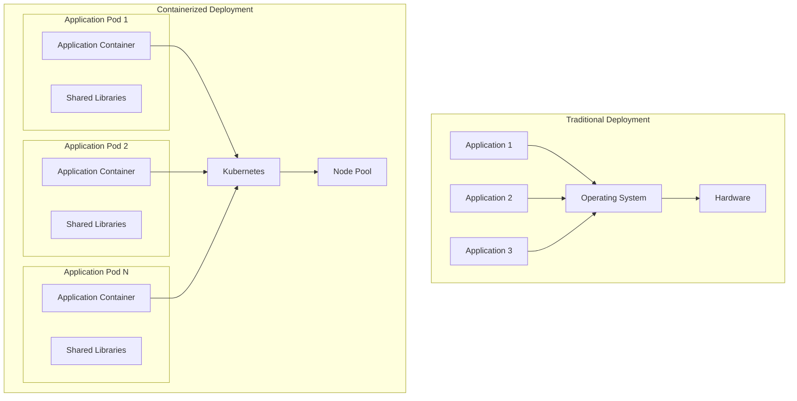
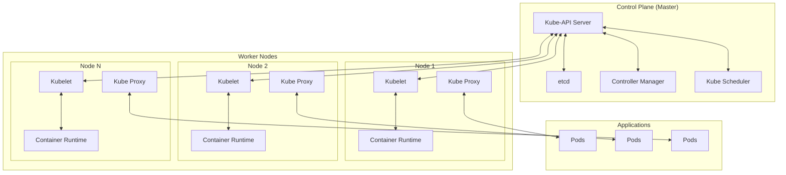

System Design: Kubernetes Architecture - Container Orchestration at Scale

Introduction

Kubernetes, often abbreviated as K8s, is an open-source container orchestration platform that automates deployment, scaling, and management of containerized applications. Originally designed by Google and now maintained by the Cloud Native Computing Foundation (CNCF), Kubernetes has become the de facto standard for container orchestration in modern cloud-native environments.

Kubernetes addresses the challenges of running containerized applications at scale by providing a platform for automating deployment, scaling, and operations of application containers across clusters of hosts. It abstracts away the underlying infrastructure complexity, allowing developers to focus on building applications while the platform handles resource allocation, load balancing, scaling, and failure recovery.

This comprehensive guide explores Kubernetes architecture, covering everything from basic concepts to advanced orchestration patterns, with practical Go code examples demonstrating real-world implementations.

Table of Contents

1. Understanding Kubernetes (#understanding-kubernetes)
2. Kubernetes Architecture Components (#kubernetes-architecture-components)
3. Control Plane Components (#control-plane-components)
4. Node Components (#node-components)
5. Kubernetes Objects and Resources (#kubernetes-objects-and-resources)
6. Networking in Kubernetes (#networking-in-kubernetes)
7. Storage in Kubernetes (#storage-in-kubernetes)
8. Security in Kubernetes (#security-in-kubernetes)
9. Scaling and Auto-scaling (#scaling-and-auto-scaling)
10. Real-World Examples (#real-world-examples)

Understanding Kubernetes {#understanding-kubernetes}

Kubernetes is a Greek word meaning "helmsman" or "pilot," reflecting its role in navigating complex containerized applications. At its core, Kubernetes provides a platform for managing containerized workloads and services, offering declarative configuration and automation capabilities.

Key Concepts

Clusters
A Kubernetes cluster consists of a set of worker machines, called nodes, that run containerized applications. Every cluster has at least one worker node and typically includes a master node that manages the worker nodes and the pods running on them.

Pods
The smallest deployable units in Kubernetes, pods represent one or more containers that share storage and network resources. Pods are ephemeral and can be created, destroyed, and replaced as needed.

Nodes
Physical or virtual machines that serve as workers in a Kubernetes cluster. Each node runs the necessary services to manage pod execution, including the container runtime, kubelet, and kube-proxy.

Control Plane
The container orchestration layer that maintains the desired state of the cluster, managing workload scheduling, scaling, and communication between components.

Kubernetes vs Traditional Deployment


```mermaid
graph TB
    subgraph "Traditional Deployment"
        A[Application 1]
        B[Application 2]
        C[Application 3]
        OS[Operating System]
        Hardware[Hardware]
        
        A --> OS
        B --> OS
        C --> OS
        OS --> Hardware
    end
    
    subgraph "Containerized Deployment"
        subgraph "Application Pod 1"
            App1[Application Container]
            Lib1[Shared Libraries]
        end
        subgraph "Application Pod 2"
            App2[Application Container]
            Lib2[Shared Libraries]
        end
        subgraph "Application Pod N"
            AppN[Application Container]
            LibN[Shared Libraries]
        end
        Kube[Kubernetes]
        Nodes[Node Pool]
        
        App1 --> Kube
        App2 --> Kube
        AppN --> Kube
        Kube --> Nodes
    end
```

Key Benefits of Kubernetes

- Abstraction: Hides infrastructure complexity behind a clean API
- Automation: Automates deployment, scaling, and operations of applications
- Scalability: Handles applications from single-node to thousands of nodes
- Portability: Runs consistently across different cloud providers and on-premises
- Ecosystem: Rich ecosystem of tools and extensions

Kubernetes Architecture Components {#kubernetes-architecture-components}

Kubernetes follows a master-worker architecture with distinct control plane and node components that work together to manage containerized applications.

High-Level Architecture


```mermaid
graph TB
    subgraph "Control Plane (Master)"
        APIServer[Kube-API Server]
        ETCD[etcd]
        ControllerManager[Controller Manager]
        Scheduler[Kube Scheduler]
    end
    
    subgraph "Worker Nodes"
        subgraph "Node 1"
            Kubelet1[Kubelet]
            KubeProxy1[Kube Proxy]
            ContainerRuntime1[Container Runtime]
        end
        
        subgraph "Node 2"
            Kubelet2[Kubelet]
            KubeProxy2[Kube Proxy]
            ContainerRuntime2[Container Runtime]
        end
        
        subgraph "Node N"
            KubeletN[Kubelet]
            KubeProxyN[Kube Proxy]
            ContainerRuntimeN[Container Runtime]
        end
    end
    
    subgraph "Applications"
        Pods1[Pods]
        Pods2[Pods]
        PodsN[Pods]
    end
    
    APIServer <--> ETCD
    APIServer <--> ControllerManager
    APIServer <--> Scheduler
    APIServer <--> Kubelet1
    APIServer <--> Kubelet2
    APIServer <--> KubeletN
    Kubelet1 <--> ContainerRuntime1
    Kubelet2 <--> ContainerRuntime2
    KubeletN <--> ContainerRuntimeN
    KubeProxy1 <--> Pods1
    KubeProxy2 <--> Pods2
    KubeProxyN <--> PodsN
```

Control Plane Components {#control-plane-components}

The control plane components make global decisions about the cluster and detect and respond to cluster events. These components can run on any machine in the cluster, though they're typically run on dedicated master nodes.

1. Kubernetes API Server

The Kubernetes API server validates and configures data for the API objects including pods, services, replication controllers, and others. It serves as the front-end for the Kubernetes control plane.

```go
package main

import (
    "context"
    "fmt"
    "log"
    "time"

    metav1 "k8s.io/apimachinery/pkg/apis/meta/v1"
    "k8s.io/client-go/kubernetes"
    "k8s.io/client-go/tools/clientcmd"
)

// APIServerManager handles interactions with the Kubernetes API server
type APIServerManager struct {
    clientset *kubernetes.Clientset
}

// NewAPIServerManager creates a new API server manager
func NewAPIServerManager(kubeconfigPath string) (*APIServerManager, error) {
    // Load kubeconfig
    config, err := clientcmd.BuildConfigFromFlags("", kubeconfigPath)
    if err != nil {
        return nil, fmt.Errorf("failed to load kubeconfig: %w", err)
    }

    // Create clientset
    clientset, err := kubernetes.NewForConfig(config)
    if err != nil {
        return nil, fmt.Errorf("failed to create clientset: %w", err)
    }

    return &APIServerManager{
        clientset: clientset,
    }, nil
}

// GetClusterInfo retrieves cluster information
func (asm *APIServerManager) GetClusterInfo() error {
    ctx := context.Background()

    // Get server version
    version, err := asm.clientset.Discovery().ServerVersion()
    if err != nil {
        return fmt.Errorf("failed to get server version: %w", err)
    }

    // List namespaces
    namespaces, err := asm.clientset.CoreV1().Namespaces().List(ctx, metav1.ListOptions{})
    if err != nil {
        return fmt.Errorf("failed to list namespaces: %w", err)
    }

    fmt.Printf("Kubernetes Server Version: %s\n", version.String())
    fmt.Printf("Number of Namespaces: %d\n", len(namespaces.Items))

    for _, ns := range namespaces.Items {
        fmt.Printf("  - %s (Status: %s)\n", ns.Name, ns.Status.Phase)
    }

    return nil
}

// WatchEvents watches for cluster events
func (asm *APIServerManager) WatchEvents(namespace string) error {
    ctx := context.Background()

    // Create a watcher for events
    watcher, err := asm.clientset.CoreV1().Events(namespace).Watch(ctx, metav1.ListOptions{})
    if err != nil {
        return fmt.Errorf("failed to create event watcher: %w", err)
    }
    defer watcher.Stop()

    fmt.Printf("Watching events in namespace: %s\n", namespace)
    fmt.Println("Press Ctrl+C to stop...")

    for event := range watcher.ResultChan() {
        switch obj := event.Object.(type) {
        case *metav1.Event:
            fmt.Printf("[%s] %s: %s - %s\n",
                obj.FirstTimestamp.Format(time.RFC3339),
                obj.InvolvedObject.Kind,
                obj.Reason,
                obj.Message)
        }
    }

    return nil
}

func main() {
    // Initialize API server manager
    // Note: You'll need to provide the path to your kubeconfig file
    asm, err := NewAPIServerManager("~/.kube/config")
    if err != nil {
        log.Fatalf("Failed to create API server manager: %v", err)
    }

    // Get cluster information
    if err := asm.GetClusterInfo(); err != nil {
        log.Printf("Error getting cluster info: %v", err)
    }

    // Watch events in default namespace
    if err := asm.WatchEvents("default"); err != nil {
        log.Printf("Error watching events: %v", err)
    }
}
```

2. etcd

etcd is a consistent and highly-available key-value store used as Kubernetes' backing store for all cluster data. It stores the configuration information, state, and metadata of the cluster.

```go
package main

import (
    "context"
    "fmt"
    "log"
    "time"

    clientv3 "go.etcd.io/etcd/client/v3"
)

// EtcdManager handles interactions with etcd
type EtcdManager struct {
    client *clientv3.Client
}

// NewEtcdManager creates a new etcd manager
func NewEtcdManager(endpoints []string) (*EtcdManager, error) {
    cfg := clientv3.Config{
        Endpoints:   endpoints,
        DialTimeout: 5 * time.Second,
    }

    client, err := clientv3.New(cfg)
    if err != nil {
        return nil, fmt.Errorf("failed to create etcd client: %w", err)
    }

    return &EtcdManager{
        client: client,
    }, nil
}

// Put stores a key-value pair in etcd
func (em *EtcdManager) Put(key, value string) error {
    ctx, cancel := context.WithTimeout(context.Background(), 5*time.Second)
    defer cancel()

    _, err := em.client.Put(ctx, key, value)
    if err != nil {
        return fmt.Errorf("failed to put key-value: %w", err)
    }

    fmt.Printf("Successfully stored: %s = %s\n", key, value)
    return nil
}

// Get retrieves a value from etcd
func (em *EtcdManager) Get(key string) (string, error) {
    ctx, cancel := context.WithTimeout(context.Background(), 5*time.Second)
    defer cancel()

    resp, err := em.client.Get(ctx, key)
    if err != nil {
        return "", fmt.Errorf("failed to get key: %w", err)
    }

    if len(resp.Kvs) == 0 {
        return "", fmt.Errorf("key not found: %s", key)
    }

    value := string(resp.Kvs[0].Value)
    fmt.Printf("Retrieved: %s = %s\n", key, value)
    return value, nil
}

// Watch watches for changes to a key
func (em *EtcdManager) Watch(key string) error {
    fmt.Printf("Watching for changes to key: %s\n", key)
    fmt.Println("Press Ctrl+C to stop...")

    watchCh := em.client.Watch(context.Background(), key)
    for watchResp := range watchCh {
        for _, ev := range watchResp.Events {
            fmt.Printf("Event: %s %q : %q\n", ev.Type, ev.Kv.Key, ev.Kv.Value)
        }
    }

    return nil
}

// ListKeys lists all keys with a given prefix
func (em *EtcdManager) ListKeys(prefix string) error {
    ctx, cancel := context.WithTimeout(context.Background(), 5*time.Second)
    defer cancel()

    resp, err := em.client.Get(ctx, prefix, clientv3.WithPrefix())
    if err != nil {
        return fmt.Errorf("failed to list keys: %w", err)
    }

    fmt.Printf("Keys with prefix '%s':\n", prefix)
    for _, kv := range resp.Kvs {
        fmt.Printf("  %s = %s\n", string(kv.Key), string(kv.Value))
    }

    return nil
}

func main() {
    // Initialize etcd manager
    // Note: You'll need to provide the correct etcd endpoints
    endpoints := []string{"localhost:2379"}
    em, err := NewEtcdManager(endpoints)
    if err != nil {
        log.Fatalf("Failed to create etcd manager: %v", err)
    }
    defer em.client.Close()

    // Example operations
    key := "/kubernetes/cluster-info"
    value := `{"version": "v1.28.0", "nodes": 3, "pods": 15}`

    // Store cluster info
    if err := em.Put(key, value); err != nil {
        log.Printf("Error storing cluster info: %v", err)
    }

    // Retrieve cluster info
    retrievedValue, err := em.Get(key)
    if err != nil {
        log.Printf("Error retrieving cluster info: %v", err)
    } else {
        fmt.Printf("Cluster info: %s\n", retrievedValue)
    }

    // List keys with prefix
    if err := em.ListKeys("/kubernetes/"); err != nil {
        log.Printf("Error listing keys: %v", err)
    }
}
```

3. Controller Manager

The controller manager runs controller processes that regulate the state of the cluster. Controllers include node controller, replication controller, endpoints controller, and service account/token controllers.

```go
package main

import (
    "context"
    "fmt"
    "log"
    "time"

    appsv1 "k8s.io/api/apps/v1"
    corev1 "k8s.io/api/core/v1"
    metav1 "k8s.io/apimachinery/pkg/apis/meta/v1"
    "k8s.io/apimachinery/pkg/fields"
    "k8s.io/client-go/kubernetes"
    "k8s.io/client-go/tools/cache"
    "k8s.io/client-go/tools/clientcmd"
)

// ControllerManager simulates Kubernetes controller manager functionality
type ControllerManager struct {
    clientset *kubernetes.Clientset
}

// NewControllerManager creates a new controller manager
func NewControllerManager(kubeconfigPath string) (*ControllerManager, error) {
    config, err := clientcmd.BuildConfigFromFlags("", kubeconfigPath)
    if err != nil {
        return nil, fmt.Errorf("failed to load kubeconfig: %w", err)
    }

    clientset, err := kubernetes.NewForConfig(config)
    if err != nil {
        return nil, fmt.Errorf("failed to create clientset: %w", err)
    }

    return &ControllerManager{
        clientset: clientset,
    }, nil
}

// ReplicaSetController manages replica sets
func (cm *ControllerManager) ReplicaSetController() error {
    ctx := context.Background()

    // Create a shared informer for ReplicaSets
    rsInformer := cache.NewSharedIndexInformer(
        cache.NewListWatchFromClient(
            cm.clientset.AppsV1().RESTClient(),
            "replicasets",
            corev1.NamespaceAll,
            fields.Everything(),
        ),
        &appsv1.ReplicaSet{},
        time.Minute*5,
        cache.Indexers{},
    )

    // Add event handlers
    rsInformer.AddEventHandler(cache.ResourceEventHandlerFuncs{
        AddFunc: func(obj interface{}) {
            rs := obj.(*appsv1.ReplicaSet)
            fmt.Printf("ReplicaSet added: %s/%s\n", rs.Namespace, rs.Name)
            cm.ensureReplicaSetDesiredState(ctx, rs)
        },
        UpdateFunc: func(oldObj, newObj interface{}) {
            oldRS := oldObj.(*appsv1.ReplicaSet)
            newRS := newObj.(*appsv1.ReplicaSet)
            
            if oldRS.Spec.Replicas != newRS.Spec.Replicas {
                fmt.Printf("ReplicaSet updated: %s/%s (replicas: %d -> %d)\n",
                    newRS.Namespace, newRS.Name,
                    *oldRS.Spec.Replicas, *newRS.Spec.Replicas)
                cm.ensureReplicaSetDesiredState(ctx, newRS)
            }
        },
        DeleteFunc: func(obj interface{}) {
            rs := obj.(*appsv1.ReplicaSet)
            fmt.Printf("ReplicaSet deleted: %s/%s\n", rs.Namespace, rs.Name)
        },
    })

    // Start the informer
    fmt.Println("Starting ReplicaSet controller...")
    go rsInformer.Run(ctx.Done())

    // Wait forever
    select {}
}

// ensureReplicaSetDesiredState ensures the replica set has the desired number of pods
func (cm *ControllerManager) ensureReplicaSetDesiredState(ctx context.Context, rs *appsv1.ReplicaSet) {
    desiredReplicas := int32(1)
    if rs.Spec.Replicas != nil {
        desiredReplicas = *rs.Spec.Replicas
    }

    // List pods matching the replica set selector
    labelSelector := ""
    for k, v := range rs.Spec.Selector.MatchLabels {
        if labelSelector != "" {
            labelSelector += ","
        }
        labelSelector += fmt.Sprintf("%s=%s", k, v)
    }

    pods, err := cm.clientset.CoreV1().Pods(rs.Namespace).List(ctx, metav1.ListOptions{
        LabelSelector: labelSelector,
    })
    if err != nil {
        log.Printf("Error listing pods for ReplicaSet %s/%s: %v", rs.Namespace, rs.Name, err)
        return
    }

    currentReplicas := int32(len(pods.Items))

    fmt.Printf("ReplicaSet %s/%s: desired=%d, current=%d\n",
        rs.Namespace, rs.Name, desiredReplicas, currentReplicas)

    // Scale up if needed
    if currentReplicas < desiredReplicas {
        diff := desiredReplicas - currentReplicas
        fmt.Printf("Scaling up ReplicaSet %s/%s by %d replicas\n", rs.Namespace, rs.Name, diff)
        // In a real controller, we would create new pods here
    } else if currentReplicas > desiredReplicas {
        diff := currentReplicas - desiredReplicas
        fmt.Printf("Scaling down ReplicaSet %s/%s by %d replicas\n", rs.Namespace, rs.Name, diff)
        // In a real controller, we would delete excess pods here
    }
}

// NodeController manages nodes
func (cm *ControllerManager) NodeController() error {
    ctx := context.Background()

    // Create a shared informer for Nodes
    nodeInformer := cache.NewSharedIndexInformer(
        cache.NewListWatchFromClient(
            cm.clientset.CoreV1().RESTClient(),
            "nodes",
            corev1.NamespaceAll,
            fields.Everything(),
        ),
        &corev1.Node{},
        time.Minute*5,
        cache.Indexers{},
    )

    // Add event handlers
    nodeInformer.AddEventHandler(cache.ResourceEventHandlerFuncs{
        AddFunc: func(obj interface{}) {
            node := obj.(*corev1.Node)
            fmt.Printf("Node added: %s (Ready: %s)\n", node.Name, getNodeConditionStatus(node, corev1.NodeReady))
        },
        UpdateFunc: func(oldObj, newObj interface{}) {
            oldNode := oldObj.(*corev1.Node)
            newNode := newObj.(*corev1.Node)
            
            oldReady := getNodeConditionStatus(oldNode, corev1.NodeReady)
            newReady := getNodeConditionStatus(newNode, corev1.NodeReady)
            
            if oldReady != newReady {
                fmt.Printf("Node %s status changed: %s -> %s\n", 
                    newNode.Name, oldReady, newReady)
                
                if newReady == corev1.ConditionFalse {
                    // Node is not ready, potentially evict pods
                    cm.handleNodeNotReady(ctx, newNode)
                }
            }
        },
        DeleteFunc: func(obj interface{}) {
            node := obj.(*corev1.Node)
            fmt.Printf("Node deleted: %s\n", node.Name)
        },
    })

    // Start the informer
    fmt.Println("Starting Node controller...")
    go nodeInformer.Run(ctx.Done())

    // Wait forever
    select {}
}

// getNodeConditionStatus gets the status of a specific condition
func getNodeConditionStatus(node *corev1.Node, conditionType corev1.NodeConditionType) corev1.ConditionStatus {
    for _, condition := range node.Status.Conditions {
        if condition.Type == conditionType {
            return condition.Status
        }
    }
    return corev1.ConditionUnknown
}

// handleNodeNotReady handles a node that becomes not ready
func (cm *ControllerManager) handleNodeNotReady(ctx context.Context, node *corev1.Node) {
    fmt.Printf("Handling not ready node: %s\n", node.Name)
    
    // List pods on the node
    pods, err := cm.clientset.CoreV1().Pods(corev1.NamespaceAll).List(ctx, metav1.ListOptions{
        FieldSelector: fmt.Sprintf("spec.nodeName=%s", node.Name),
    })
    if err != nil {
        log.Printf("Error listing pods on node %s: %v", node.Name, err)
        return
    }

    fmt.Printf("Found %d pods on node %s\n", len(pods.Items), node.Name)
    
    // In a real controller, we would handle pod eviction here
    for _, pod := range pods.Items {
        fmt.Printf("  Pod: %s/%s\n", pod.Namespace, pod.Name)
    }
}

func main() {
    // Initialize controller manager
    cm, err := NewControllerManager("~/.kube/config")
    if err != nil {
        log.Fatalf("Failed to create controller manager: %v", err)
    }

    // Start the node controller
    go func() {
        if err := cm.NodeController(); err != nil {
            log.Fatalf("Node controller failed: %v", err)
        }
    }()

    // Start the replica set controller
    if err := cm.ReplicaSetController(); err != nil {
        log.Fatalf("ReplicaSet controller failed: %v", err)
    }
}
```

4. Scheduler

The Kubernetes scheduler is responsible for assigning pods to nodes based on resource requirements, policies, and constraints. It implements the logic for placing pods onto nodes in the cluster.

```go
package main

import (
    "context"
    "fmt"
    "log"
    "math/rand"
    "sort"
    "time"

    corev1 "k8s.io/api/core/v1"
    metav1 "k8s.io/apimachinery/pkg/apis/meta/v1"
    "k8s.io/apimachinery/pkg/fields"
    "k8s.io/client-go/kubernetes"
    "k8s.io/client-go/tools/cache"
    "k8s.io/client-go/tools/clientcmd"
)

// Scheduler implements a basic Kubernetes scheduler
type Scheduler struct {
    clientset *kubernetes.Clientset
    name      string
}

// NewScheduler creates a new scheduler
func NewScheduler(kubeconfigPath, name string) (*Scheduler, error) {
    config, err := clientcmd.BuildConfigFromFlags("", kubeconfigPath)
    if err != nil {
        return nil, fmt.Errorf("failed to load kubeconfig: %w", err)
    }

    clientset, err := kubernetes.NewForConfig(config)
    if err != nil {
        return nil, fmt.Errorf("failed to create clientset: %w", err)
    }

    return &Scheduler{
        clientset: clientset,
        name:      name,
    }, nil
}

// Start begins the scheduling process
func (s *Scheduler) Start() error {
    ctx := context.Background()

    // Create a shared informer for unscheduled pods
    podInformer := cache.NewSharedIndexInformer(
        cache.NewListWatchFromClient(
            s.clientset.CoreV1().RESTClient(),
            "pods",
            corev1.NamespaceAll,
            fields.OneTermEqualSelector("spec.nodeName", ""),
        ),
        &corev1.Pod{},
        time.Minute*5,
        cache.Indexers{},
    )

    // Add event handler for unscheduled pods
    podInformer.AddEventHandler(cache.ResourceEventHandlerFuncs{
        AddFunc: func(obj interface{}) {
            pod := obj.(*corev1.Pod)
            fmt.Printf("New unscheduled pod: %s/%s\n", pod.Namespace, pod.Name)
            go s.SchedulePod(ctx, pod)
        },
    })

    // Start the informer
    fmt.Printf("Starting scheduler: %s\n", s.name)
    go podInformer.Run(ctx.Done())

    // Wait forever
    select {}
}

// SchedulePod schedules a pod to a node
func (s *Scheduler) SchedulePod(ctx context.Context, pod *corev1.Pod) {
    fmt.Printf("Attempting to schedule pod: %s/%s\n", pod.Namespace, pod.Name)

    // Get all nodes
    nodes, err := s.clientset.CoreV1().Nodes().List(ctx, metav1.ListOptions{})
    if err != nil {
        log.Printf("Error listing nodes: %v", err)
        return
    }

    // Filter nodes based on pod requirements
    filteredNodes := s.filterNodes(nodes.Items, pod)
    if len(filteredNodes) == 0 {
        log.Printf("No suitable nodes found for pod: %s/%s", pod.Namespace, pod.Name)
        return
    }

    // Score nodes based on various factors
    scoredNodes := s.scoreNodes(filteredNodes, pod)

    // Select the best node
    bestNode := s.selectBestNode(scoredNodes)
    if bestNode == "" {
        log.Printf("No best node found for pod: %s/%s", pod.Namespace, pod.Name)
        return
    }

    // Bind the pod to the selected node
    if err := s.bindPodToNode(ctx, pod, bestNode); err != nil {
        log.Printf("Error binding pod %s/%s to node %s: %v", 
            pod.Namespace, pod.Name, bestNode, err)
        return
    }

    fmt.Printf("Successfully scheduled pod %s/%s to node %s\n", 
        pod.Namespace, pod.Name, bestNode)
}

// filterNodes filters nodes based on pod requirements
func (s *Scheduler) filterNodes(nodes []corev1.Node, pod *corev1.Pod) []corev1.Node {
    var filtered []corev1.Node

    for _, node := range nodes {
        // Check if node is ready
        if !s.isNodeReady(&node) {
            continue
        }

        // Check if node has sufficient resources
        if !s.hasSufficientResources(&node, pod) {
            continue
        }

        // Check node affinity/anti-affinity
        if !s.checkNodeAffinity(&node, pod) {
            continue
        }

        // Check pod affinity/anti-affinity
        if !s.checkPodAffinity(&node, pod) {
            continue
        }

        filtered = append(filtered, node)
    }

    return filtered
}

// isNodeReady checks if a node is ready
func (s *Scheduler) isNodeReady(node *corev1.Node) bool {
    for _, condition := range node.Status.Conditions {
        if condition.Type == corev1.NodeReady {
            return condition.Status == corev1.ConditionTrue
        }
    }
    return false
}

// hasSufficientResources checks if a node has sufficient resources for a pod
func (s *Scheduler) hasSufficientResources(node *corev1.Node, pod *corev1.Pod) bool {
    // Get node allocatable resources
    allocatable := node.Status.Allocatable

    // Calculate pod resource requests
    var podCPU, podMemory int64
    for _, container := range pod.Spec.Containers {
        if cpu := container.Resources.Requests.Cpu(); cpu != nil {
            podCPU += cpu.MilliValue()
        }
        if memory := container.Resources.Requests.Memory(); memory != nil {
            podMemory += memory.Value()
        }
    }

    // Check if node has sufficient resources
    nodeCPU := allocatable.Cpu().MilliValue()
    nodeMemory := allocatable.Memory().Value()

    return podCPU <= nodeCPU && podMemory <= nodeMemory
}

// checkNodeAffinity checks if a node satisfies pod's node affinity requirements
func (s *Scheduler) checkNodeAffinity(node *corev1.Node, pod *corev1.Pod) bool {
    if pod.Spec.Affinity == nil || pod.Spec.Affinity.NodeAffinity == nil {
        return true
    }

    // Simplified node affinity check
    // In a real scheduler, this would be much more complex
    return true
}

// checkPodAffinity checks if a node satisfies pod's pod affinity requirements
func (s *Scheduler) checkPodAffinity(node *corev1.Node, pod *corev1.Pod) bool {
    if pod.Spec.Affinity == nil || 
       (pod.Spec.Affinity.PodAffinity == nil && pod.Spec.Affinity.PodAntiAffinity == nil) {
        return true
    }

    // Simplified pod affinity check
    // In a real scheduler, this would query the API server for existing pods
    return true
}

// scoreNodes scores nodes based on various factors
func (s *Scheduler) scoreNodes(nodes []corev1.Node, pod *corev1.Pod) []NodeScore {
    var scores []NodeScore

    for _, node := range nodes {
        score := NodeScore{
            NodeName: node.Name,
            Score:    0,
        }

        // Score based on resource availability
        score.Score += s.scoreForResourceAvailability(&node, pod)

        // Score based on node priority
        score.Score += s.scoreForNodePriority(&node)

        // Score based on node affinity
        score.Score += s.scoreForNodeAffinity(&node, pod)

        scores = append(scores, score)
    }

    return scores
}

// NodeScore represents a node with its score
type NodeScore struct {
    NodeName string
    Score    int64
}

// scoreForResourceAvailability scores based on resource availability
func (s *Scheduler) scoreForResourceAvailability(node *corev1.Node, pod *corev1.Pod) int64 {
    // Calculate available resources
    allocatable := node.Status.Allocatable
    used, err := s.getNodeUsedResources(node.Name)
    if err != nil {
        log.Printf("Error getting node used resources: %v", err)
        return 0
    }

    // Calculate available resources
    availableCPU := allocatable.Cpu().MilliValue() - used.Cpu().MilliValue()
    availableMemory := allocatable.Memory().Value() - used.Memory().Value()

    // Calculate pod resource requests
    var podCPU, podMemory int64
    for _, container := range pod.Spec.Containers {
        if cpu := container.Resources.Requests.Cpu(); cpu != nil {
            podCPU += cpu.MilliValue()
        }
        if memory := container.Resources.Requests.Memory(); memory != nil {
            podMemory += memory.Value()
        }
    }

    // Score based on resource availability (higher is better)
    cpuScore := (availableCPU - podCPU) * 10
    memoryScore := (availableMemory - podMemory) / (1024 * 1024) // Convert to MB

    return cpuScore + memoryScore
}

// getNodeUsedResources gets the resources used by pods on a node
func (s *Scheduler) getNodeUsedResources(nodeName string) (corev1.ResourceList, error) {
    // In a real scheduler, this would query the API server for pods on the node
    // and sum up their resource requests
    return corev1.ResourceList{}, nil
}

// scoreForNodePriority scores based on node priority
func (s *Scheduler) scoreForNodePriority(node *corev1.Node) int64 {
    // In a real scheduler, this would check node labels and annotations
    // for priority indicators
    return 0
}

// scoreForNodeAffinity scores based on node affinity
func (s *Scheduler) scoreForNodeAffinity(node *corev1.Node, pod *corev1.Pod) int64 {
    // In a real scheduler, this would evaluate node affinity expressions
    return 0
}

// selectBestNode selects the best node from scored nodes
func (s *Scheduler) selectBestNode(scoredNodes []NodeScore) string {
    if len(scoredNodes) == 0 {
        return ""
    }

    // Sort by score (highest first)
    sort.Slice(scoredNodes, func(i, j int) bool {
        return scoredNodes[i].Score > scoredNodes[j].Score
    })

    // If there's a tie, randomly select one
    bestScore := scoredNodes[0].Score
    var bestNodes []string
    for _, score := range scoredNodes {
        if score.Score == bestScore {
            bestNodes = append(bestNodes, score.NodeName)
        } else {
            break
        }
    }

    // Randomly select from best nodes
    return bestNodes[rand.Intn(len(bestNodes))]
}

// bindPodToNode binds a pod to a node
func (s *Scheduler) bindPodToNode(ctx context.Context, pod *corev1.Pod, nodeName string) error {
    binding := &corev1.Binding{
        ObjectMeta: metav1.ObjectMeta{
            Name:      pod.Name,
            Namespace: pod.Namespace,
        },
        Target: corev1.ObjectReference{
            Kind: "Node",
            Name: nodeName,
        },
    }

    return s.clientset.CoreV1().Pods(pod.Namespace).Bind(ctx, binding, metav1.CreateOptions{})
}

func main() {
    // Initialize scheduler
    scheduler, err := NewScheduler("~/.kube/config", "custom-scheduler")
    if err != nil {
        log.Fatalf("Failed to create scheduler: %v", err)
    }

    // Start the scheduler
    if err := scheduler.Start(); err != nil {
        log.Fatalf("Scheduler failed: %v", err)
    }
}
```

Node Components {#node-components}

Node components run on every node in the cluster, maintaining running pods and providing the Kubernetes runtime environment.

1. Kubelet

The kubelet is the primary node agent that runs on each node. It ensures that containers described in PodSpecs are running and healthy.

```go
package main

import (
    "context"
    "encoding/json"
    "fmt"
    "log"
    "net/http"
    "sync"
    "time"

    corev1 "k8s.io/api/core/v1"
    metav1 "k8s.io/apimachinery/pkg/api/resource"
    "k8s.io/apimachinery/pkg/util/intstr"
)

// Kubelet simulates the Kubernetes kubelet component
type Kubelet struct {
    nodeName     string
    podWorkers   sync.Map
    podStatuses  sync.Map
    httpClient   *http.Client
}

// NewKubelet creates a new kubelet instance
func NewKubelet(nodeName string) *Kubelet {
    return &Kubelet{
        nodeName:   nodeName,
        httpClient: &http.Client{Timeout: 30 * time.Second},
    }
}

// Run starts the kubelet
func (k *Kubelet) Run() {
    fmt.Printf("Starting kubelet on node: %s\n", k.nodeName)
    
    // Start periodic pod status reporting
    go k.reportPodStatusPeriodically()
    
    // Start health check server
    go k.startHealthCheckServer()
    
    // Wait forever
    select {}
}

// SyncPod synchronizes a pod with the desired state
func (k *Kubelet) SyncPod(pod *corev1.Pod) error {
    podKey := fmt.Sprintf("%s/%s", pod.Namespace, pod.Name)
    fmt.Printf("Syncing pod: %s\n", podKey)

    // Check if pod already exists
    if _, exists := k.podWorkers.Load(podKey); exists {
        // Pod already exists, check if it needs updates
        return k.updateExistingPod(pod)
    }

    // Create new pod worker
    worker := &PodWorker{
        pod:      pod,
        kubelet:  k,
        stopCh:   make(chan struct{}),
        statusCh: make(chan corev1.PodStatus, 10),
    }

    k.podWorkers.Store(podKey, worker)
    k.podStatuses.Store(podKey, corev1.PodStatus{
        Phase: corev1.PodPending,
        Conditions: []corev1.PodCondition{
            {
                Type:   corev1.PodScheduled,
                Status: corev1.ConditionTrue,
            },
        },
    })

    // Start the pod worker
    go worker.Run()

    return nil
}

// updateExistingPod updates an existing pod
func (k *Kubelet) updateExistingPod(pod *corev1.Pod) error {
    podKey := fmt.Sprintf("%s/%s", pod.Namespace, pod.Name)
    
    // In a real implementation, this would handle pod updates
    // For simplicity, we'll just log the update
    fmt.Printf("Updating existing pod: %s\n", podKey)
    
    return nil
}

// DeletePod deletes a pod
func (k *Kubelet) DeletePod(pod *corev1.Pod) error {
    podKey := fmt.Sprintf("%s/%s", pod.Namespace, pod.Name)
    fmt.Printf("Deleting pod: %s\n", podKey)

    if worker, exists := k.podWorkers.Load(podKey); exists {
        worker.(*PodWorker).Stop()
        k.podWorkers.Delete(podKey)
        k.podStatuses.Delete(podKey)
    }

    return nil
}

// GetPodStatus gets the status of a pod
func (k *Kubelet) GetPodStatus(podNamespace, podName string) (*corev1.PodStatus, error) {
    podKey := fmt.Sprintf("%s/%s", podNamespace, podName)
    
    if status, exists := k.podStatuses.Load(podKey); exists {
        s := status.(corev1.PodStatus)
        return &s, nil
    }

    return nil, fmt.Errorf("pod status not found: %s", podKey)
}

// reportPodStatusPeriodically reports pod statuses periodically
func (k *Kubelet) reportPodStatusPeriodically() {
    ticker := time.NewTicker(30 * time.Second)
    defer ticker.Stop()

    for range ticker.C {
        k.podStatuses.Range(func(key, value interface{}) bool {
            podKey := key.(string)
            status := value.(corev1.PodStatus)
            
            fmt.Printf("Reporting status for pod %s: %s\n", podKey, status.Phase)
            return true
        })
    }
}

// startHealthCheckServer starts a health check server
func (k *Kubelet) startHealthCheckServer() {
    http.HandleFunc("/healthz", func(w http.ResponseWriter, r *http.Request) {
        w.WriteHeader(http.StatusOK)
        w.Write([]byte("ok"))
    })

    http.HandleFunc("/pods", func(w http.ResponseWriter, r *http.Request) {
        var pods []corev1.Pod
        k.podWorkers.Range(func(key, value interface{}) bool {
            worker := value.(*PodWorker)
            pods = append(pods, *worker.pod)
            return true
        })

        w.Header().Set("Content-Type", "application/json")
        json.NewEncoder(w).Encode(pods)
    })

    fmt.Println("Starting kubelet health check server on :10255")
    log.Fatal(http.ListenAndServe(":10255", nil))
}

// PodWorker manages a single pod
type PodWorker struct {
    pod      *corev1.Pod
    kubelet  *Kubelet
    stopCh   chan struct{}
    statusCh chan corev1.PodStatus
    mu       sync.Mutex
}

// Run starts the pod worker
func (pw *PodWorker) Run() {
    podKey := fmt.Sprintf("%s/%s", pw.pod.Namespace, pw.pod.Name)
    fmt.Printf("Starting pod worker for: %s\n", podKey)

    // Update pod status to Pending
    pw.updatePodStatus(corev1.PodPending)

    // Simulate container creation
    if err := pw.createContainers(); err != nil {
        fmt.Printf("Error creating containers for pod %s: %v\n", podKey, err)
        pw.updatePodStatus(corev1.PodFailed)
        return
    }

    // Update pod status to Running
    pw.updatePodStatus(corev1.PodRunning)

    // Monitor containers
    pw.monitorContainers()
}

// Stop stops the pod worker
func (pw *PodWorker) Stop() {
    close(pw.stopCh)
}

// createContainers simulates container creation
func (pw *PodWorker) createContainers() error {
    podKey := fmt.Sprintf("%s/%s", pw.pod.Namespace, pw.pod.Name)
    
    for _, container := range pw.pod.Spec.Containers {
        fmt.Printf("Creating container %s for pod %s\n", container.Name, podKey)
        
        // Simulate container creation delay
        time.Sleep(1 * time.Second)
        
        // Check if pod was stopped during creation
        select {
        case <-pw.stopCh:
            return fmt.Errorf("pod stopped during container creation")
        default:
        }
    }

    return nil
}

// monitorContainers monitors the containers in the pod
func (pw *PodWorker) monitorContainers() {
    ticker := time.NewTicker(5 * time.Second)
    defer ticker.Stop()

    for {
        select {
        case <-pw.stopCh:
            fmt.Printf("Stopping container monitoring for pod %s\n", 
                fmt.Sprintf("%s/%s", pw.pod.Namespace, pw.pod.Name))
            return
        case <-ticker.C:
            // Check container health
            if !pw.checkContainerHealth() {
                fmt.Printf("Container health check failed for pod %s\n", 
                    fmt.Sprintf("%s/%s", pw.pod.Namespace, pw.pod.Name))
                pw.updatePodStatus(corev1.PodFailed)
                return
            }
        }
    }
}

// checkContainerHealth checks if containers are healthy
func (pw *PodWorker) checkContainerHealth() bool {
    // In a real implementation, this would check actual container health
    // For simulation, we'll return true most of the time
    return true
}

// updatePodStatus updates the pod status
func (pw *PodWorker) updatePodStatus(phase corev1.PodPhase) {
    pw.mu.Lock()
    defer pw.mu.Unlock()

    podKey := fmt.Sprintf("%s/%s", pw.pod.Namespace, pw.pod.Name)
    
    status := corev1.PodStatus{
        Phase: phase,
        Conditions: []corev1.PodCondition{
            {
                Type:   corev1.PodScheduled,
                Status: corev1.ConditionTrue,
            },
            {
                Type:   corev1.PodReady,
                Status: corev1.ConditionTrue,
            },
        },
        StartTime: &metav1.Time{Time: time.Now()},
    }

    pw.kubelet.podStatuses.Store(podKey, status)
    
    // Send status update to channel
    select {
    case pw.statusCh <- status:
    default:
        // Channel is full, skip
    }
}

func main() {
    // Create a kubelet instance
    kubelet := NewKubelet("node-1")
    
    // Create a sample pod
    pod := &corev1.Pod{
        ObjectMeta: metav1.ObjectMeta{
            Name:      "sample-pod",
            Namespace: "default",
        },
        Spec: corev1.PodSpec{
            Containers: []corev1.Container{
                {
                    Name:  "web-server",
                    Image: "nginx:latest",
                    Ports: []corev1.ContainerPort{
                        {
                            Name:          "http",
                            ContainerPort: 80,
                            Protocol:      corev1.ProtocolTCP,
                        },
                    },
                    Resources: corev1.ResourceRequirements{
                        Requests: corev1.ResourceList{
                            corev1.ResourceCPU:    resource.MustParse("100m"),
                            corev1.ResourceMemory: resource.MustParse("128Mi"),
                        },
                        Limits: corev1.ResourceList{
                            corev1.ResourceCPU:    resource.MustParse("200m"),
                            corev1.ResourceMemory: resource.MustParse("256Mi"),
                        },
                    },
                    LivenessProbe: &corev1.Probe{
                        Handler: corev1.Handler{
                            HTTPGet: &corev1.HTTPGetAction{
                                Path: "/health",
                                Port: intstr.FromInt(80),
                            },
                        },
                        InitialDelaySeconds: 30,
                        PeriodSeconds:       10,
                    },
                    ReadinessProbe: &corev1.Probe{
                        Handler: corev1.Handler{
                            HTTPGet: &corev1.HTTPGetAction{
                                Path: "/ready",
                                Port: intstr.FromInt(80),
                            },
                        },
                        InitialDelaySeconds: 5,
                        PeriodSeconds:       5,
                    },
                },
            },
        },
    }

    // Sync the pod
    if err := kubelet.SyncPod(pod); err != nil {
        log.Fatalf("Error syncing pod: %v", err)
    }

    // Run the kubelet
    kubelet.Run()
}
```

2. Kube Proxy

Kube proxy maintains network rules on nodes to enable network communication to pods from network sessions inside or outside of the cluster.

```go
package main

import (
    "context"
    "fmt"
    "log"
    "net"
    "sync"
    "time"

    corev1 "k8s.io/api/core/v1"
    metav1 "k8s.io/apimachinery/pkg/apis/meta/v1"
    "k8s.io/apimachinery/pkg/fields"
    "k8s.io/client-go/kubernetes"
    "k8s.io/client-go/tools/cache"
    "k8s.io/client-go/tools/clientcmd"
)

// KubeProxy simulates the Kubernetes kube-proxy component
type KubeProxy struct {
    clientset *kubernetes.Clientset
    nodeName  string
    services  sync.Map
    endpoints sync.Map
    iptables  *IPTablesSimulator
}

// NewKubeProxy creates a new kube-proxy instance
func NewKubeProxy(kubeconfigPath, nodeName string) (*KubeProxy, error) {
    config, err := clientcmd.BuildConfigFromFlags("", kubeconfigPath)
    if err != nil {
        return nil, fmt.Errorf("failed to load kubeconfig: %w", err)
    }

    clientset, err := kubernetes.NewForConfig(config)
    if err != nil {
        return nil, fmt.Errorf("failed to create clientset: %w", err)
    }

    return &KubeProxy{
        clientset: clientset,
        nodeName:  nodeName,
        iptables:  NewIPTablesSimulator(),
    }, nil
}

// Start starts the kube-proxy
func (kp *KubeProxy) Start() error {
    ctx := context.Background()

    // Watch for service changes
    serviceInformer := kp.createServiceInformer()
    serviceInformer.AddEventHandler(cache.ResourceEventHandlerFuncs{
        AddFunc: func(obj interface{}) {
            svc := obj.(*corev1.Service)
            kp.handleServiceAdd(svc)
        },
        UpdateFunc: func(oldObj, newObj interface{}) {
            oldSvc := oldObj.(*corev1.Service)
            newSvc := newObj.(*corev1.Service)
            kp.handleServiceUpdate(oldSvc, newSvc)
        },
        DeleteFunc: func(obj interface{}) {
            svc := obj.(*corev1.Service)
            kp.handleServiceDelete(svc)
        },
    })

    // Watch for endpoint changes
    endpointInformer := kp.createEndpointInformer()
    endpointInformer.AddEventHandler(cache.ResourceEventHandlerFuncs{
        AddFunc: func(obj interface{}) {
            ep := obj.(*corev1.Endpoints)
            kp.handleEndpointAdd(ep)
        },
        UpdateFunc: func(oldObj, newObj interface{}) {
            oldEp := oldObj.(*corev1.Endpoints)
            newEp := newObj.(*corev1.Endpoints)
            kp.handleEndpointUpdate(oldEp, newEp)
        },
        DeleteFunc: func(obj interface{}) {
            ep := obj.(*corev1.Endpoints)
            kp.handleEndpointDelete(ep)
        },
    })

    // Start informers
    fmt.Printf("Starting kube-proxy on node: %s\n", kp.nodeName)
    go serviceInformer.Run(ctx.Done())
    go endpointInformer.Run(ctx.Done())

    // Wait forever
    select {}
}

// createServiceInformer creates an informer for services
func (kp *KubeProxy) createServiceInformer() cache.SharedIndexInformer {
    return cache.NewSharedIndexInformer(
        cache.NewListWatchFromClient(
            kp.clientset.CoreV1().RESTClient(),
            "services",
            corev1.NamespaceAll,
            fields.Everything(),
        ),
        &corev1.Service{},
        time.Minute*5,
        cache.Indexers{},
    )
}

// createEndpointInformer creates an informer for endpoints
func (kp *KubeProxy) createEndpointInformer() cache.SharedIndexInformer {
    return cache.NewSharedIndexInformer(
        cache.NewListWatchFromClient(
            kp.clientset.CoreV1().RESTClient(),
            "endpoints",
            corev1.NamespaceAll,
            fields.Everything(),
        ),
        &corev1.Endpoints{},
        time.Minute*5,
        cache.Indexers{},
    )
}

// handleServiceAdd handles service additions
func (kp *KubeProxy) handleServiceAdd(service *corev1.Service) {
    svcKey := fmt.Sprintf("%s/%s", service.Namespace, service.Name)
    fmt.Printf("Service added: %s\n", svcKey)

    // Add service to local cache
    kp.services.Store(svcKey, service)

    // Create iptables rules for the service
    kp.createServiceRules(service)
}

// handleServiceUpdate handles service updates
func (kp *KubeProxy) handleServiceUpdate(oldService, newService *corev1.Service) {
    svcKey := fmt.Sprintf("%s/%s", newService.Namespace, newService.Name)
    fmt.Printf("Service updated: %s\n", svcKey)

    // Update service in local cache
    kp.services.Store(svcKey, newService)

    // Update iptables rules for the service
    kp.deleteServiceRules(oldService)
    kp.createServiceRules(newService)
}

// handleServiceDelete handles service deletions
func (kp *KubeProxy) handleServiceDelete(service *corev1.Service) {
    svcKey := fmt.Sprintf("%s/%s", service.Namespace, service.Name)
    fmt.Printf("Service deleted: %s\n", svcKey)

    // Remove service from local cache
    kp.services.Delete(svcKey)

    // Delete iptables rules for the service
    kp.deleteServiceRules(service)
}

// handleEndpointAdd handles endpoint additions
func (kp *KubeProxy) handleEndpointAdd(endpoint *corev1.Endpoints) {
    epKey := fmt.Sprintf("%s/%s", endpoint.Namespace, endpoint.Name)
    fmt.Printf("Endpoints added: %s\n", epKey)

    // Add endpoint to local cache
    kp.endpoints.Store(epKey, endpoint)

    // Update iptables rules for the service
    kp.updateEndpointRules(endpoint)
}

// handleEndpointUpdate handles endpoint updates
func (kp *KubeProxy) handleEndpointUpdate(oldEndpoint, newEndpoint *corev1.Endpoints) {
    epKey := fmt.Sprintf("%s/%s", newEndpoint.Namespace, newEndpoint.Name)
    fmt.Printf("Endpoints updated: %s\n", epKey)

    // Update endpoint in local cache
    kp.endpoints.Store(epKey, newEndpoint)

    // Update iptables rules for the service
    kp.updateEndpointRules(newEndpoint)
}

// handleEndpointDelete handles endpoint deletions
func (kp *KubeProxy) handleEndpointDelete(endpoint *corev1.Endpoints) {
    epKey := fmt.Sprintf("%s/%s", endpoint.Namespace, endpoint.Name)
    fmt.Printf("Endpoints deleted: %s\n", epKey)

    // Remove endpoint from local cache
    kp.endpoints.Delete(epKey)

    // Update iptables rules for the service
    kp.deleteEndpointRules(endpoint)
}

// createServiceRules creates iptables rules for a service
func (kp *KubeProxy) createServiceRules(service *corev1.Service) {
    svcKey := fmt.Sprintf("%s/%s", service.Namespace, service.Name)
    
    for _, port := range service.Spec.Ports {
        // Create service IP table rule
        rule := IPTableRule{
            Chain:  "PREROUTING",
            Table:  "nat",
            Action: "DNAT",
            Match:  fmt.Sprintf("-p %s --dport %d", string(port.Protocol), port.Port),
            Target: fmt.Sprintf("--to-destination %s:%d", service.Spec.ClusterIP, port.TargetPort.IntVal),
        }
        
        kp.iptables.AddRule(rule)
        fmt.Printf("Added rule for service %s: %s\n", svcKey, rule.String())
    }
}

// deleteServiceRules deletes iptables rules for a service
func (kp *KubeProxy) deleteServiceRules(service *corev1.Service) {
    svcKey := fmt.Sprintf("%s/%s", service.Namespace, service.Name)
    
    for _, port := range service.Spec.Ports {
        // Delete service IP table rule
        rule := IPTableRule{
            Chain:  "PREROUTING",
            Table:  "nat",
            Action: "DNAT",
            Match:  fmt.Sprintf("-p %s --dport %d", string(port.Protocol), port.Port),
            Target: fmt.Sprintf("--to-destination %s:%d", service.Spec.ClusterIP, port.TargetPort.IntVal),
        }
        
        kp.iptables.DeleteRule(rule)
        fmt.Printf("Deleted rule for service %s: %s\n", svcKey, rule.String())
    }
}

// updateEndpointRules updates iptables rules for endpoints
func (kp *KubeProxy) updateEndpointRules(endpoint *corev1.Endpoints) {
    epKey := fmt.Sprintf("%s/%s", endpoint.Namespace, endpoint.Name)
    
    // Get corresponding service
    svcInterface, exists := kp.services.Load(epKey)
    if !exists {
        fmt.Printf("Service not found for endpoint: %s\n", epKey)
        return
    }
    service := svcInterface.(*corev1.Service)

    // Delete old endpoint rules
    kp.deleteEndpointRules(endpoint)

    // Create new endpoint rules
    for _, subset := range endpoint.Subsets {
        for _, address := range subset.Addresses {
            for _, port := range subset.Ports {
                // Create endpoint IP table rule
                rule := IPTableRule{
                    Chain:  "PREROUTING",
                    Table:  "nat",
                    Action: "DNAT",
                    Match:  fmt.Sprintf("-d %s -p %s --dport %d", service.Spec.ClusterIP, string(port.Protocol), port.Port),
                    Target: fmt.Sprintf("--to-destination %s:%d", address.IP, port.Port),
                }
                
                kp.iptables.AddRule(rule)
                fmt.Printf("Added endpoint rule for %s: %s\n", epKey, rule.String())
            }
        }
    }
}

// deleteEndpointRules deletes iptables rules for endpoints
func (kp *KubeProxy) deleteEndpointRules(endpoint *corev1.Endpoints) {
    epKey := fmt.Sprintf("%s/%s", endpoint.Namespace, endpoint.Name)
    
    // Remove all rules related to this endpoint
    kp.iptables.ClearChain(fmt.Sprintf("ENDPOINT_%s", epKey))
    fmt.Printf("Cleared endpoint rules for: %s\n", epKey)
}

// IPTablesSimulator simulates iptables functionality
type IPTablesSimulator struct {
    rules sync.Map
}

// NewIPTablesSimulator creates a new iptables simulator
func NewIPTablesSimulator() *IPTablesSimulator {
    return &IPTablesSimulator{}
}

// IPTableRule represents an iptables rule
type IPTableRule struct {
    Chain  string
    Table  string
    Action string
    Match  string
    Target string
}

// String returns a string representation of the rule
func (r IPTableRule) String() string {
    return fmt.Sprintf("%s.%s: %s %s %s", r.Table, r.Chain, r.Action, r.Match, r.Target)
}

// AddRule adds an iptables rule
func (ipt *IPTablesSimulator) AddRule(rule IPTableRule) {
    key := fmt.Sprintf("%s:%s:%s", rule.Table, rule.Chain, rule.Match)
    ipt.rules.Store(key, rule)
}

// DeleteRule deletes an iptables rule
func (ipt *IPTablesSimulator) DeleteRule(rule IPTableRule) {
    key := fmt.Sprintf("%s:%s:%s", rule.Table, rule.Chain, rule.Match)
    ipt.rules.Delete(key)
}

// ClearChain clears all rules in a chain
func (ipt *IPTablesSimulator) ClearChain(chain string) {
    ipt.rules.Range(func(key, value interface{}) bool {
        if rule, ok := value.(IPTableRule); ok && rule.Chain == chain {
            ipt.rules.Delete(key)
        }
        return true
    })
}

// ListRules lists all iptables rules
func (ipt *IPTablesSimulator) ListRules() []IPTableRule {
    var rules []IPTableRule
    ipt.rules.Range(func(_, value interface{}) bool {
        if rule, ok := value.(IPTableRule); ok {
            rules = append(rules, rule)
        }
        return true
    })
    return rules
}

func main() {
    // Initialize kube-proxy
    proxy, err := NewKubeProxy("~/.kube/config", "node-1")
    if err != nil {
        log.Fatalf("Failed to create kube-proxy: %v", err)
    }

    // Start the kube-proxy
    if err := proxy.Start(); err != nil {
        log.Fatalf("Kube-proxy failed: %v", err)
    }
}
```

Kubernetes Objects and Resources {#kubernetes-objects-and-resources}

Kubernetes objects are persistent entities that represent the state of your cluster. They describe what applications are running, the resources available, and policies around how they behave.

Core Objects

Pods
The smallest deployable units in Kubernetes, representing a single instance of a running process.

```go
package main

import (
    "context"
    "fmt"
    "log"
    "time"

    appsv1 "k8s.io/api/apps/v1"
    corev1 "k8s.io/api/core/v1"
    metav1 "k8s.io/apimachinery/pkg/api/resource"
    "k8s.io/client-go/kubernetes"
    "k8s.io/client-go/tools/clientcmd"
)

// PodManager manages Kubernetes pods
type PodManager struct {
    clientset *kubernetes.Clientset
}

// NewPodManager creates a new pod manager
func NewPodManager(kubeconfigPath string) (*PodManager, error) {
    config, err := clientcmd.BuildConfigFromFlags("", kubeconfigPath)
    if err != nil {
        return nil, fmt.Errorf("failed to load kubeconfig: %w", err)
    }

    clientset, err := kubernetes.NewForConfig(config)
    if err != nil {
        return nil, fmt.Errorf("failed to create clientset: %w", err)
    }

    return &PodManager{
        clientset: clientset,
    }, nil
}

// CreatePod creates a new pod
func (pm *PodManager) CreatePod(namespace, name string, image string) error {
    ctx := context.Background()

    pod := &corev1.Pod{
        ObjectMeta: metav1.ObjectMeta{
            Name:      name,
            Namespace: namespace,
            Labels: map[string]string{
                "app": name,
            },
        },
        Spec: corev1.PodSpec{
            Containers: []corev1.Container{
                {
                    Name:  "app",
                    Image: image,
                    Ports: []corev1.ContainerPort{
                        {
                            Name:          "http",
                            ContainerPort: 8080,
                            Protocol:      corev1.ProtocolTCP,
                        },
                    },
                    Resources: corev1.ResourceRequirements{
                        Requests: corev1.ResourceList{
                            corev1.ResourceCPU:    resource.MustParse("100m"),
                            corev1.ResourceMemory: resource.MustParse("128Mi"),
                        },
                        Limits: corev1.ResourceList{
                            corev1.ResourceCPU:    resource.MustParse("200m"),
                            corev1.ResourceMemory: resource.MustParse("256Mi"),
                        },
                    },
                    LivenessProbe: &corev1.Probe{
                        Handler: corev1.Handler{
                            HTTPGet: &corev1.HTTPGetAction{
                                Path: "/health",
                                Port: intstr.FromInt(8080),
                            },
                        },
                        InitialDelaySeconds: 30,
                        PeriodSeconds:       10,
                    },
                    ReadinessProbe: &corev1.Probe{
                        Handler: corev1.Handler{
                            HTTPGet: &corev1.HTTPGetAction{
                                Path: "/ready",
                                Port: intstr.FromInt(8080),
                            },
                        },
                        InitialDelaySeconds: 5,
                        PeriodSeconds:       5,
                    },
                },
            },
        },
    }

    createdPod, err := pm.clientset.CoreV1().Pods(namespace).Create(ctx, pod, metav1.CreateOptions{})
    if err != nil {
        return fmt.Errorf("failed to create pod: %w", err)
    }

    fmt.Printf("Created pod: %s/%s\n", namespace, createdPod.Name)
    return nil
}

// GetPod retrieves a pod
func (pm *PodManager) GetPod(namespace, name string) (*corev1.Pod, error) {
    ctx := context.Background()

    pod, err := pm.clientset.CoreV1().Pods(namespace).Get(ctx, name, metav1.GetOptions{})
    if err != nil {
        return nil, fmt.Errorf("failed to get pod: %w", err)
    }

    return pod, nil
}

// ListPods lists all pods in a namespace
func (pm *PodManager) ListPods(namespace string) error {
    ctx := context.Background()

    pods, err := pm.clientset.CoreV1().Pods(namespace).List(ctx, metav1.ListOptions{})
    if err != nil {
        return fmt.Errorf("failed to list pods: %w", err)
    }

    fmt.Printf("Pods in namespace %s:\n", namespace)
    for _, pod := range pods.Items {
        fmt.Printf("  - %s (Status: %s, Restarts: %d)\n", 
            pod.Name, pod.Status.Phase, getRestartCount(&pod))
    }

    return nil
}

// DeletePod deletes a pod
func (pm *PodManager) DeletePod(namespace, name string) error {
    ctx := context.Background()

    err := pm.clientset.CoreV1().Pods(namespace).Delete(ctx, name, metav1.DeleteOptions{})
    if err != nil {
        return fmt.Errorf("failed to delete pod: %w", err)
    }

    fmt.Printf("Deleted pod: %s/%s\n", namespace, name)
    return nil
}

// getRestartCount gets the total restart count for all containers in a pod
func getRestartCount(pod *corev1.Pod) int32 {
    var total int32
    for _, status := range pod.Status.ContainerStatuses {
        total += status.RestartCount
    }
    return total
}

// DeploymentManager manages Kubernetes deployments
type DeploymentManager struct {
    clientset *kubernetes.Clientset
}

// NewDeploymentManager creates a new deployment manager
func NewDeploymentManager(kubeconfigPath string) (*DeploymentManager, error) {
    config, err := clientcmd.BuildConfigFromFlags("", kubeconfigPath)
    if err != nil {
        return nil, fmt.Errorf("failed to load kubeconfig: %w", err)
    }

    clientset, err := kubernetes.NewForConfig(config)
    if err != nil {
        return nil, fmt.Errorf("failed to create clientset: %w", err)
    }

    return &DeploymentManager{
        clientset: clientset,
    }, nil
}

// CreateDeployment creates a new deployment
func (dm *DeploymentManager) CreateDeployment(namespace, name, image string, replicas int32) error {
    ctx := context.Background()

    deployment := &appsv1.Deployment{
        ObjectMeta: metav1.ObjectMeta{
            Name:      name,
            Namespace: namespace,
        },
        Spec: appsv1.DeploymentSpec{
            Replicas: &replicas,
            Selector: &metav1.LabelSelector{
                MatchLabels: map[string]string{
                    "app": name,
                },
            },
            Template: corev1.PodTemplateSpec{
                ObjectMeta: metav1.ObjectMeta{
                    Labels: map[string]string{
                        "app": name,
                    },
                },
                Spec: corev1.PodSpec{
                    Containers: []corev1.Container{
                        {
                            Name:  "app",
                            Image: image,
                            Ports: []corev1.ContainerPort{
                                {
                                    ContainerPort: 8080,
                                },
                            },
                            Resources: corev1.ResourceRequirements{
                                Requests: corev1.ResourceList{
                                    corev1.ResourceCPU:    resource.MustParse("100m"),
                                    corev1.ResourceMemory: resource.MustParse("128Mi"),
                                },
                                Limits: corev1.ResourceList{
                                    corev1.ResourceCPU:    resource.MustParse("200m"),
                                    corev1.ResourceMemory: resource.MustParse("256Mi"),
                                },
                            },
                        },
                    },
                },
            },
        },
    }

    createdDeployment, err := dm.clientset.AppsV1().Deployments(namespace).Create(ctx, deployment, metav1.CreateOptions{})
    if err != nil {
        return fmt.Errorf("failed to create deployment: %w", err)
    }

    fmt.Printf("Created deployment: %s/%s with %d replicas\n", 
        namespace, createdDeployment.Name, *createdDeployment.Spec.Replicas)
    return nil
}

// GetDeployment retrieves a deployment
func (dm *DeploymentManager) GetDeployment(namespace, name string) (*appsv1.Deployment, error) {
    ctx := context.Background()

    deployment, err := dm.clientset.AppsV1().Deployments(namespace).Get(ctx, name, metav1.GetOptions{})
    if err != nil {
        return nil, fmt.Errorf("failed to get deployment: %w", err)
    }

    return deployment, nil
}

// ScaleDeployment scales a deployment
func (dm *DeploymentManager) ScaleDeployment(namespace, name string, replicas int32) error {
    ctx := context.Background()

    deployment, err := dm.clientset.AppsV1().Deployments(namespace).Get(ctx, name, metav1.GetOptions{})
    if err != nil {
        return fmt.Errorf("failed to get deployment: %w", err)
    }

    deployment.Spec.Replicas = &replicas

    updatedDeployment, err := dm.clientset.AppsV1().Deployments(namespace).Update(ctx, deployment, metav1.UpdateOptions{})
    if err != nil {
        return fmt.Errorf("failed to update deployment: %w", err)
    }

    fmt.Printf("Scaled deployment %s/%s to %d replicas\n", 
        namespace, updatedDeployment.Name, *updatedDeployment.Spec.Replicas)
    return nil
}

func main() {
    // Initialize managers
    podManager, err := NewPodManager("~/.kube/config")
    if err != nil {
        log.Fatalf("Failed to create pod manager: %v", err)
    }

    deploymentManager, err := NewDeploymentManager("~/.kube/config")
    if err != nil {
        log.Fatalf("Failed to create deployment manager: %v", err)
    }

    // Create a deployment
    if err := deploymentManager.CreateDeployment("default", "web-app", "nginx:latest", 3); err != nil {
        log.Printf("Error creating deployment: %v", err)
    }

    // List pods in default namespace
    if err := podManager.ListPods("default"); err != nil {
        log.Printf("Error listing pods: %v", err)
    }

    // Wait a bit for pods to be created
    time.Sleep(10 * time.Second)

    // List pods again
    if err := podManager.ListPods("default"); err != nil {
        log.Printf("Error listing pods: %v", err)
    }

    // Scale the deployment
    if err := deploymentManager.ScaleDeployment("default", "web-app", 5); err != nil {
        log.Printf("Error scaling deployment: %v", err)
    }
}
```

Networking in Kubernetes {#networking-in-kubernetes}

Kubernetes networking provides a flat network space where every pod has a unique IP address and can communicate with any other pod in the cluster without NAT.

CNI (Container Network Interface)

```go
package main

import (
    "context"
    "encoding/json"
    "fmt"
    "log"
    "net"
    "os/exec"
    "time"

    "github.com/containernetworking/cni/pkg/types"
    "github.com/containernetworking/cni/pkg/types/current"
    "github.com/containernetworking/plugins/pkg/ns"
    "golang.org/x/sys/unix"
)

// CNINetworkManager manages CNI networking
type CNINetworkManager struct {
    pluginPath string
}

// NewCNINetworkManager creates a new CNI network manager
func NewCNINetworkManager(pluginPath string) *CNINetworkManager {
    return &CNINetworkManager{
        pluginPath: pluginPath,
    }
}

// AddNetwork adds a network to a container
func (cnm *CNINetworkManager) AddNetwork(netns, containerID, ifName string, args map[string]string) (*current.Result, error) {
    // Prepare CNI arguments
    cniArgs := []string{
        "ADD",
        fmt.Sprintf("CNI_COMMAND=ADD"),
        fmt.Sprintf("CNI_CONTAINERID=%s", containerID),
        fmt.Sprintf("CNI_NETNS=%s", netns),
        fmt.Sprintf("CNI_IFNAME=%s", ifName),
        fmt.Sprintf("CNI_PATH=%s", cnm.pluginPath),
    }

    // Prepare network configuration
    netConf := map[string]interface{}{
        "cniVersion": "0.4.0",
        "name":       "mynet",
        "type":       "bridge",
        "bridge":     "cni0",
        "isGateway":  true,
        "ipMasq":     true,
        "ipam": map[string]interface{}{
            "type":   "host-local",
            "subnet": "10.88.0.0/16",
            "routes": []map[string]string{
                {"dst": "0.0.0.0/0"},
            },
        },
    }

    netConfBytes, err := json.Marshal(netConf)
    if err != nil {
        return nil, fmt.Errorf("failed to marshal network config: %w", err)
    }

    // Execute CNI plugin
    cmd := exec.Command(cnm.pluginPath+"/bridge", cniArgs...)
    cmd.Stdin = json.RawMessage(netConfBytes)
    
    output, err := cmd.Output()
    if err != nil {
        return nil, fmt.Errorf("CNI plugin failed: %w", err)
    }

    // Parse result
    result, err := current.NewResultFromResult(types.Result{
        CNIVersion: "0.4.0",
        Result:     output,
    })
    if err != nil {
        return nil, fmt.Errorf("failed to parse CNI result: %w", err)
    }

    fmt.Printf("Added network to container %s: %+v\n", containerID, result.IPs)
    return result, nil
}

// DelNetwork removes a network from a container
func (cnm *CNINetworkManager) DelNetwork(netns, containerID, ifName string, args map[string]string) error {
    // Prepare CNI arguments
    cniArgs := []string{
        "DEL",
        fmt.Sprintf("CNI_COMMAND=DEL"),
        fmt.Sprintf("CNI_CONTAINERID=%s", containerID),
        fmt.Sprintf("CNI_NETNS=%s", netns),
        fmt.Sprintf("CNI_IFNAME=%s", ifName),
        fmt.Sprintf("CNI_PATH=%s", cnm.pluginPath),
    }

    // Prepare network configuration (same as ADD)
    netConf := map[string]interface{}{
        "cniVersion": "0.4.0",
        "name":       "mynet",
        "type":       "bridge",
        "bridge":     "cni0",
        "isGateway":  true,
        "ipMasq":     true,
        "ipam": map[string]interface{}{
            "type":   "host-local",
            "subnet": "10.88.0.0/16",
            "routes": []map[string]string{
                {"dst": "0.0.0.0/0"},
            },
        },
    }

    netConfBytes, err := json.Marshal(netConf)
    if err != nil {
        return fmt.Errorf("failed to marshal network config: %w", err)
    }

    // Execute CNI plugin
    cmd := exec.Command(cnm.pluginPath+"/bridge", cniArgs...)
    cmd.Stdin = json.RawMessage(netConfBytes)
    
    if err := cmd.Run(); err != nil {
        return fmt.Errorf("CNI plugin failed: %w", err)
    }

    fmt.Printf("Removed network from container %s\n", containerID)
    return nil
}

// NetworkPolicyManager manages Kubernetes network policies
type NetworkPolicyManager struct {
    // In a real implementation, this would interact with the Kubernetes API
    // For this example, we'll simulate network policy enforcement
    policies map[string]*NetworkPolicy
    mu       sync.RWMutex
}

// NetworkPolicy represents a simplified network policy
type NetworkPolicy struct {
    Name      string
    Namespace string
    PodSelector map[string]string
    Ingress   []NetworkPolicyRule
    Egress    []NetworkPolicyRule
}

// NetworkPolicyRule represents a network policy rule
type NetworkPolicyRule struct {
    Protocol string
    Port     int32
    CIDR     string
    PodSelector map[string]string
}

// NewNetworkPolicyManager creates a new network policy manager
func NewNetworkPolicyManager() *NetworkPolicyManager {
    return &NetworkPolicyManager{
        policies: make(map[string]*NetworkPolicy),
    }
}

// AddPolicy adds a network policy
func (npm *NetworkPolicyManager) AddPolicy(policy *NetworkPolicy) {
    npm.mu.Lock()
    defer npm.mu.Unlock()
    
    key := fmt.Sprintf("%s/%s", policy.Namespace, policy.Name)
    npm.policies[key] = policy
    
    fmt.Printf("Added network policy: %s\n", key)
}

// RemovePolicy removes a network policy
func (npm *NetworkPolicyManager) RemovePolicy(namespace, name string) {
    npm.mu.Lock()
    defer npm.mu.Unlock()
    
    key := fmt.Sprintf("%s/%s", namespace, name)
    delete(npm.policies, key)
    
    fmt.Printf("Removed network policy: %s\n", key)
}

// IsTrafficAllowed checks if traffic is allowed based on network policies
func (npm *NetworkPolicyManager) IsTrafficAllowed(namespace, podLabels map[string]string, protocol string, port int32, sourceIP string) bool {
    npm.mu.RLock()
    defer npm.mu.RUnlock()
    
    // Check ingress policies in the destination namespace
    for _, policy := range npm.policies {
        if policy.Namespace != namespace {
            continue
        }
        
        // Check if pod matches the policy selector
        if npm.matchesSelector(podLabels, policy.PodSelector) {
            // Check ingress rules
            for _, rule := range policy.Ingress {
                if npm.matchesIngressRule(sourceIP, protocol, port, rule) {
                    return true
                }
            }
        }
    }
    
    // If no policy allows the traffic, deny by default
    return false
}

// matchesSelector checks if pod labels match the selector
func (npm *NetworkPolicyManager) matchesSelector(podLabels, selector map[string]string) bool {
    for key, value := range selector {
        if podLabelValue, exists := podLabels[key]; !exists || podLabelValue != value {
            return false
        }
    }
    return true
}

// matchesIngressRule checks if traffic matches an ingress rule
func (npm *NetworkPolicyManager) matchesIngressRule(sourceIP, protocol string, port int32, rule NetworkPolicyRule) bool {
    // Check protocol
    if rule.Protocol != "" && rule.Protocol != protocol {
        return false
    }
    
    // Check port
    if rule.Port != 0 && rule.Port != port {
        return false
    }
    
    // Check CIDR if specified
    if rule.CIDR != "" {
        _, cidr, err := net.ParseCIDR(rule.CIDR)
        if err != nil {
            return false
        }
        
        ip := net.ParseIP(sourceIP)
        if ip == nil || !cidr.Contains(ip) {
            return false
        }
    }
    
    return true
}

func main() {
    // Initialize CNI network manager
    cniManager := NewCNINetworkManager("/opt/cni/bin")
    
    // Initialize network policy manager
    policyManager := NewNetworkPolicyManager()
    
    // Create a sample network policy
    policy := &NetworkPolicy{
        Name:      "allow-http",
        Namespace: "default",
        PodSelector: map[string]string{
            "app": "web",
        },
        Ingress: []NetworkPolicyRule{
            {
                Protocol: "TCP",
                Port:     80,
                CIDR:     "0.0.0.0/0", // Allow from anywhere
            },
        },
    }
    
    policyManager.AddPolicy(policy)
    
    // Check if traffic is allowed
    allowed := policyManager.IsTrafficAllowed(
        "default",
        map[string]string{"app": "web"},
        "TCP",
        80,
        "192.168.1.100",
    )
    
    fmt.Printf("Traffic allowed: %t\n", allowed)
    
    // Example of adding network to a container (would need actual container setup)
    // result, err := cniManager.AddNetwork("/proc/1234/ns/net", "container123", "eth0", nil)
    // if err != nil {
    //     log.Printf("Error adding network: %v", err)
    // } else {
    //     fmt.Printf("Network added: %+v\n", result)
    // }
}
```

Storage in Kubernetes {#storage-in-kubernetes}

Kubernetes provides a flexible storage abstraction that allows applications to consume storage without knowing the details of the underlying storage implementation.

```go
package main

import (
    "context"
    "fmt"
    "log"
    "time"

    corev1 "k8s.io/api/core/v1"
    storagev1 "k8s.io/api/storage/v1"
    metav1 "k8s.io/apimachinery/pkg/api/resource"
    "k8s.io/client-go/kubernetes"
    "k8s.io/client-go/tools/clientcmd"
)

// StorageManager manages Kubernetes storage resources
type StorageManager struct {
    clientset *kubernetes.Clientset
}

// NewStorageManager creates a new storage manager
func NewStorageManager(kubeconfigPath string) (*StorageManager, error) {
    config, err := clientcmd.BuildConfigFromFlags("", kubeconfigPath)
    if err != nil {
        return nil, fmt.Errorf("failed to load kubeconfig: %w", err)
    }

    clientset, err := kubernetes.NewForConfig(config)
    if err != nil {
        return nil, fmt.Errorf("failed to create clientset: %w", err)
    }

    return &StorageManager{
        clientset: clientset,
    }, nil
}

// CreateStorageClass creates a new storage class
func (sm *StorageManager) CreateStorageClass(name, provisioner string, parameters map[string]string) error {
    ctx := context.Background()

    storageClass := &storagev1.StorageClass{
        ObjectMeta: metav1.ObjectMeta{
            Name: name,
        },
        Provisioner:   provisioner,
        Parameters:    parameters,
        ReclaimPolicy: &[]corev1.PersistentVolumeReclaimPolicy{corev1.PersistentVolumeReclaimDelete}[0],
        AllowVolumeExpansion: &[]bool{true}[0],
    }

    createdSC, err := sm.clientset.StorageV1().StorageClasses().Create(ctx, storageClass, metav1.CreateOptions{})
    if err != nil {
        return fmt.Errorf("failed to create storage class: %w", err)
    }

    fmt.Printf("Created storage class: %s\n", createdSC.Name)
    return nil
}

// CreatePersistentVolumeClaim creates a new PVC
func (sm *StorageManager) CreatePersistentVolumeClaim(namespace, name, storageClassName string, size string) error {
    ctx := context.Background()

    pvc := &corev1.PersistentVolumeClaim{
        ObjectMeta: metav1.ObjectMeta{
            Name:      name,
            Namespace: namespace,
        },
        Spec: corev1.PersistentVolumeClaimSpec{
            AccessModes: []corev1.PersistentVolumeAccessMode{
                corev1.ReadWriteOnce,
            },
            Resources: corev1.ResourceRequirements{
                Requests: corev1.ResourceList{
                    corev1.ResourceStorage: resource.MustParse(size),
                },
            },
            StorageClassName: &storageClassName,
        },
    }

    createdPVC, err := sm.clientset.CoreV1().PersistentVolumeClaims(namespace).Create(ctx, pvc, metav1.CreateOptions{})
    if err != nil {
        return fmt.Errorf("failed to create PVC: %w", err)
    }

    fmt.Printf("Created PVC: %s/%s with size %s\n", namespace, createdPVC.Name, size)
    return nil
}

// CreatePodWithVolume creates a pod with a persistent volume
func (sm *StorageManager) CreatePodWithVolume(namespace, podName, pvcName string) error {
    ctx := context.Background()

    pod := &corev1.Pod{
        ObjectMeta: metav1.ObjectMeta{
            Name:      podName,
            Namespace: namespace,
        },
        Spec: corev1.PodSpec{
            Containers: []corev1.Container{
                {
                    Name:  "app",
                    Image: "nginx:latest",
                    VolumeMounts: []corev1.VolumeMount{
                        {
                            Name:      "storage",
                            MountPath: "/data",
                        },
                    },
                },
            },
            Volumes: []corev1.Volume{
                {
                    Name: "storage",
                    VolumeSource: corev1.VolumeSource{
                        PersistentVolumeClaim: &corev1.PersistentVolumeClaimVolumeSource{
                            ClaimName: pvcName,
                        },
                    },
                },
            },
        },
    }

    createdPod, err := sm.clientset.CoreV1().Pods(namespace).Create(ctx, pod, metav1.CreateOptions{})
    if err != nil {
        return fmt.Errorf("failed to create pod with volume: %w", err)
    }

    fmt.Printf("Created pod %s/%s with volume %s\n", namespace, createdPod.Name, pvcName)
    return nil
}

// ListStorageClasses lists all storage classes
func (sm *StorageManager) ListStorageClasses() error {
    ctx := context.Background()

    scs, err := sm.clientset.StorageV1().StorageClasses().List(ctx, metav1.ListOptions{})
    if err != nil {
        return fmt.Errorf("failed to list storage classes: %w", err)
    }

    fmt.Println("Storage Classes:")
    for _, sc := range scs.Items {
        fmt.Printf("  - %s (Provisioner: %s)\n", sc.Name, sc.Provisioner)
    }

    return nil
}

// ListPersistentVolumeClaims lists all PVCs in a namespace
func (sm *StorageManager) ListPersistentVolumeClaims(namespace string) error {
    ctx := context.Background()

    pvcs, err := sm.clientset.CoreV1().PersistentVolumeClaims(namespace).List(ctx, metav1.ListOptions{})
    if err != nil {
        return fmt.Errorf("failed to list PVCs: %w", err)
    }

    fmt.Printf("PVCs in namespace %s:\n", namespace)
    for _, pvc := range pvcs.Items {
        status := string(pvc.Status.Phase)
        if pvc.Status.Phase == corev1.ClaimBound {
            status = fmt.Sprintf("%s (PV: %s)", status, pvc.Spec.VolumeName)
        }
        fmt.Printf("  - %s (Size: %s, Status: %s)\n", 
            pvc.Name, pvc.Spec.Resources.Requests.Storage(), status)
    }

    return nil
}

func main() {
    // Initialize storage manager
    sm, err := NewStorageManager("~/.kube/config")
    if err != nil {
        log.Fatalf("Failed to create storage manager: %v", err)
    }

    // List existing storage classes
    if err := sm.ListStorageClasses(); err != nil {
        log.Printf("Error listing storage classes: %v", err)
    }

    // Create a storage class
    params := map[string]string{
        "type": "pd-standard",
    }
    if err := sm.CreateStorageClass("fast-ssd", "kubernetes.io/gce-pd", params); err != nil {
        log.Printf("Error creating storage class: %v", err)
    }

    // Create a PVC
    if err := sm.CreatePersistentVolumeClaim("default", "my-pvc", "fast-ssd", "10Gi"); err != nil {
        log.Printf("Error creating PVC: %v", err)
    }

    // Create a pod with the PVC
    if err := sm.CreatePodWithVolume("default", "pod-with-volume", "my-pvc"); err != nil {
        log.Printf("Error creating pod with volume: %v", err)
    }

    // Wait a bit and list PVCs
    time.Sleep(5 * time.Second)
    if err := sm.ListPersistentVolumeClaims("default"); err != nil {
        log.Printf("Error listing PVCs: %v", err)
    }
}
```

Security in Kubernetes {#security-in-kubernetes}

Kubernetes security encompasses multiple layers including authentication, authorization, admission control, and runtime security.

```go
package main

import (
    "context"
    "crypto/rand"
    "crypto/rsa"
    "crypto/x509"
    "crypto/sha256"
    "encoding/pem"
    "encoding/hex"
    "fmt"
    "log"
    "time"

    corev1 "k8s.io/api/core/v1"
    rbacv1 "k8s.io/api/rbac/v1"
    metav1 "k8s.io/apimachinery/pkg/apis/meta/v1"
    "k8s.io/client-go/kubernetes"
    "k8s.io/client-go/tools/clientcmd"
)

// SecurityManager manages Kubernetes security configurations
type SecurityManager struct {
    clientset *kubernetes.Clientset
}

// NewSecurityManager creates a new security manager
func NewSecurityManager(kubeconfigPath string) (*SecurityManager, error) {
    config, err := clientcmd.BuildConfigFromFlags("", kubeconfigPath)
    if err != nil {
        return nil, fmt.Errorf("failed to load kubeconfig: %w", err)
    }

    clientset, err := kubernetes.NewForConfig(config)
    if err != nil {
        return nil, fmt.Errorf("failed to create clientset: %w", err)
    }

    return &SecurityManager{
        clientset: clientset,
    }, nil
}

// CreateServiceAccount creates a new service account
func (sm *SecurityManager) CreateServiceAccount(namespace, name string) error {
    ctx := context.Background()

    sa := &corev1.ServiceAccount{
        ObjectMeta: metav1.ObjectMeta{
            Name:      name,
            Namespace: namespace,
        },
    }

    createdSA, err := sm.clientset.CoreV1().ServiceAccounts(namespace).Create(ctx, sa, metav1.CreateOptions{})
    if err != nil {
        return fmt.Errorf("failed to create service account: %w", err)
    }

    fmt.Printf("Created service account: %s/%s\n", namespace, createdSA.Name)
    return nil
}

// CreateRole creates a new role
func (sm *SecurityManager) CreateRole(namespace, name string, rules []rbacv1.PolicyRule) error {
    ctx := context.Background()

    role := &rbacv1.Role{
        ObjectMeta: metav1.ObjectMeta{
            Name:      name,
            Namespace: namespace,
        },
        Rules: rules,
    }

    createdRole, err := sm.clientset.RbacV1().Roles(namespace).Create(ctx, role, metav1.CreateOptions{})
    if err != nil {
        return fmt.Errorf("failed to create role: %w", err)
    }

    fmt.Printf("Created role: %s/%s\n", namespace, createdRole.Name)
    return nil
}

// CreateRoleBinding creates a new role binding
func (sm *SecurityManager) CreateRoleBinding(namespace, name, roleName, serviceAccountName string) error {
    ctx := context.Background()

    roleBinding := &rbacv1.RoleBinding{
        ObjectMeta: metav1.ObjectMeta{
            Name:      name,
            Namespace: namespace,
        },
        Subjects: []rbacv1.Subject{
            {
                Kind:      "ServiceAccount",
                Name:      serviceAccountName,
                Namespace: namespace,
            },
        },
        RoleRef: rbacv1.RoleRef{
            Kind:     "Role",
            Name:     roleName,
            APIGroup: "rbac.authorization.k8s.io",
        },
    }

    createdRB, err := sm.clientset.RbacV1().RoleBindings(namespace).Create(ctx, roleBinding, metav1.CreateOptions{})
    if err != nil {
        return fmt.Errorf("failed to create role binding: %w", err)
    }

    fmt.Printf("Created role binding: %s/%s (binds SA %s to Role %s)\n", 
        namespace, createdRB.Name, serviceAccountName, roleName)
    return nil
}

// CreateSecret creates a secret for storing sensitive data
func (sm *SecurityManager) CreateSecret(namespace, name string, data map[string][]byte) error {
    ctx := context.Background()

    secret := &corev1.Secret{
        ObjectMeta: metav1.ObjectMeta{
            Name:      name,
            Namespace: namespace,
        },
        Data: data,
        Type: corev1.SecretTypeOpaque,
    }

    createdSecret, err := sm.clientset.CoreV1().Secrets(namespace).Create(ctx, secret, metav1.CreateOptions{})
    if err != nil {
        return fmt.Errorf("failed to create secret: %w", err)
    }

    fmt.Printf("Created secret: %s/%s\n", namespace, createdSecret.Name)
    return nil
}

// ApplySecurityContext applies security context to a pod
func (sm *SecurityManager) ApplySecurityContext(namespace, podName string) error {
    ctx := context.Background()

    // Get the existing pod
    pod, err := sm.clientset.CoreV1().Pods(namespace).Get(ctx, podName, metav1.GetOptions{})
    if err != nil {
        return fmt.Errorf("failed to get pod: %w", err)
    }

    // Apply security context to all containers
    for i := range pod.Spec.Containers {
        pod.Spec.Containers[i].SecurityContext = &corev1.SecurityContext{
            RunAsNonRoot:             &[]bool{true}[0],
            RunAsUser:                &[]int64{1000}[0],
            RunAsGroup:               &[]int64{3000}[0],
            ReadOnlyRootFilesystem:   &[]bool{true}[0],
            AllowPrivilegeEscalation: &[]bool{false}[0],
            Capabilities: &corev1.Capabilities{
                Drop: []corev1.Capability{"ALL"},
                Add:  []corev1.Capability{"NET_BIND_SERVICE"},
            },
        }
    }

    // Update the pod
    updatedPod, err := sm.clientset.CoreV1().Pods(namespace).Update(ctx, pod, metav1.UpdateOptions{})
    if err != nil {
        return fmt.Errorf("failed to update pod with security context: %w", err)
    }

    fmt.Printf("Applied security context to pod: %s/%s\n", namespace, updatedPod.Name)
    return nil
}

func main() {
    // Initialize security manager
    sm, err := NewSecurityManager("~/.kube/config")
    if err != nil {
        log.Fatalf("Failed to create security manager: %v", err)
    }

    // Create a service account
    if err := sm.CreateServiceAccount("default", "web-app-sa"); err != nil {
        log.Printf("Error creating service account: %v", err)
    }

    // Create a role with specific permissions
    rules := []rbacv1.PolicyRule{
        {
            APIGroups: []string{""},
            Resources: []string{"pods"},
            Verbs:     []string{"get", "list", "create", "update", "delete"},
        },
        {
            APIGroups: []string{"apps"},
            Resources: []string{"deployments"},
            Verbs:     []string{"get", "list"},
        },
    }
    if err := sm.CreateRole("default", "pod-manager", rules); err != nil {
        log.Printf("Error creating role: %v", err)
    }

    // Create a role binding
    if err := sm.CreateRoleBinding("default", "web-app-role-binding", "pod-manager", "web-app-sa"); err != nil {
        log.Printf("Error creating role binding: %v", err)
    }

    // Generate a certificate
    cert, privKey, err := generateCertificate("web-app.default.svc.cluster.local")
    if err != nil {
        log.Printf("Error generating certificate: %v", err)
    } else {
        fmt.Printf("Generated certificate for: web-app.default.svc.cluster.local\n")

        // Create a TLS secret with the certificate
        tlsData := map[string][]byte{
            "tls.crt": cert,
            "tls.key": privKey,
        }
        if err := sm.CreateSecret("default", "web-app-tls", tlsData); err != nil {
            log.Printf("Error creating TLS secret: %v", err)
        }
    }
}

// generateCertificate generates a certificate for secure communication
func generateCertificate(commonName string) ([]byte, []byte, error) {
    // Generate private key
    privateKey, err := rsa.GenerateKey(rand.Reader, 2048)
    if err != nil {
        return nil, nil, fmt.Errorf("failed to generate private key: %w", err)
    }

    // Create certificate template
    template := x509.Certificate{
        SerialNumber: big.NewInt(1),
        Subject: pkix.Name{
            CommonName: commonName,
        },
        NotBefore: time.Now(),
        NotAfter:  time.Now().Add(365 * 24 * time.Hour), // 1 year
        KeyUsage:  x509.KeyUsageKeyEncipherment | x509.KeyUsageDigitalSignature,
    }

    // Create certificate
    certDER, err := x509.CreateCertificate(rand.Reader, &template, &template, &privateKey.PublicKey, privateKey)
    if err != nil {
        return nil, nil, fmt.Errorf("failed to create certificate: %w", err)
    }

    // Encode certificate
    certPEM := pem.EncodeToMemory(&pem.Block{
        Type:  "CERTIFICATE",
        Bytes: certDER,
    })

    // Encode private key
    privKeyPEM := pem.EncodeToMemory(&pem.Block{
        Type:  "RSA PRIVATE KEY",
        Bytes: x509.MarshalPKCS1PrivateKey(privateKey),
    })

    return certPEM, privKeyPEM, nil
}
```

Scaling and Auto-scaling {#scaling-and-auto-scaling}

Kubernetes provides multiple mechanisms for scaling applications, from manual scaling to automatic scaling based on metrics.

```go
package main

import (
    "context"
    "fmt"
    "log"
    "math"
    "time"

    appsv1 "k8s.io/api/apps/v1"
    autoscalingv2 "k8s.io/api/autoscaling/v2"
    corev1 "k8s.io/api/core/v1"
    metav1 "k8s.io/apimachinery/pkg/api/resource"
    "k8s.io/client-go/kubernetes"
    "k8s.io/client-go/tools/clientcmd"
)

// AutoScalerManager manages Kubernetes auto-scaling
type AutoScalerManager struct {
    clientset *kubernetes.Clientset
}

// NewAutoScalerManager creates a new auto-scaler manager
func NewAutoScalerManager(kubeconfigPath string) (*AutoScalerManager, error) {
    config, err := clientcmd.BuildConfigFromFlags("", kubeconfigPath)
    if err != nil {
        return nil, fmt.Errorf("failed to load kubeconfig: %w", err)
    }

    clientset, err := kubernetes.NewForConfig(config)
    if err != nil {
        return nil, fmt.Errorf("failed to create clientset: %w", err)
    }

    return &AutoScalerManager{
        clientset: clientset,
    }, nil
}

// CreateHorizontalPodAutoscaler creates a new HPA
func (asm *AutoScalerManager) CreateHorizontalPodAutoscaler(
    namespace, name, deploymentName string,
    minReplicas, maxReplicas int32,
    targetCPUUtilization int32) error {
    
    ctx := context.Background()

    hpa := &autoscalingv2.HorizontalPodAutoscaler{
        ObjectMeta: metav1.ObjectMeta{
            Name:      name,
            Namespace: namespace,
        },
        Spec: autoscalingv2.HorizontalPodAutoscalerSpec{
            ScaleTargetRef: autoscalingv2.CrossVersionObjectReference{
                Kind:       "Deployment",
                Name:       deploymentName,
                APIVersion: "apps/v1",
            },
            MinReplicas: &minReplicas,
            MaxReplicas: maxReplicas,
            Metrics: []autoscalingv2.MetricSpec{
                {
                    Type: autoscalingv2.ResourceMetricSourceType,
                    Resource: &autoscalingv2.ResourceMetricSource{
                        Name: corev1.ResourceCPU,
                        Target: autoscalingv2.MetricTarget{
                            Type:               autoscalingv2.UtilizationMetricType,
                            AverageUtilization: &targetCPUUtilization,
                        },
                    },
                },
            },
        },
    }

    createdHPA, err := asm.clientset.AutoscalingV2().HorizontalPodAutoscalers(namespace).Create(ctx, hpa, metav1.CreateOptions{})
    if err != nil {
        return fmt.Errorf("failed to create HPA: %w", err)
    }

    fmt.Printf("Created HPA: %s/%s (targets %s, %d-%d replicas, %d%% CPU)\n", 
        namespace, createdHPA.Name, deploymentName, minReplicas, maxReplicas, targetCPUUtilization)
    return nil
}

// CreateCustomMetricHPA creates an HPA based on custom metrics
func (asm *AutoScalerManager) CreateCustomMetricHPA(
    namespace, name, deploymentName string,
    minReplicas, maxReplicas int32,
    metricName string, targetValue int64) error {
    
    ctx := context.Background()

    hpa := &autoscalingv2.HorizontalPodAutoscaler{
        ObjectMeta: metav1.ObjectMeta{
            Name:      name,
            Namespace: namespace,
        },
        Spec: autoscalingv2.HorizontalPodAutoscalerSpec{
            ScaleTargetRef: autoscalingv2.CrossVersionObjectReference{
                Kind:       "Deployment",
                Name:       deploymentName,
                APIVersion: "apps/v1",
            },
            MinReplicas: &minReplicas,
            MaxReplicas: maxReplicas,
            Metrics: []autoscalingv2.MetricSpec{
                {
                    Type: autoscalingv2.PodsMetricSourceType,
                    Pods: &autoscalingv2.PodsMetricSource{
                        Metric: autoscalingv2.MetricIdentifier{
                            Name: metricName,
                        },
                        Target: autoscalingv2.MetricTarget{
                            Type:         autoscalingv2.AverageValueMetricType,
                            AverageValue: resource.NewQuantity(targetValue, resource.DecimalSI),
                        },
                    },
                },
            },
        },
    }

    createdHPA, err := asm.clientset.AutoscalingV2().HorizontalPodAutoscalers(namespace).Create(ctx, hpa, metav1.CreateOptions{})
    if err != nil {
        return fmt.Errorf("failed to create custom metric HPA: %w", err)
    }

    fmt.Printf("Created custom metric HPA: %s/%s (targets %s, %d-%d replicas, %s=%d)\n", 
        namespace, createdHPA.Name, deploymentName, minReplicas, maxReplicas, metricName, targetValue)
    return nil
}

// GetHPAStatus retrieves the status of an HPA
func (asm *AutoScalerManager) GetHPAStatus(namespace, name string) error {
    ctx := context.Background()

    hpa, err := asm.clientset.AutoscalingV2().HorizontalPodAutoscalers(namespace).Get(ctx, name, metav1.GetOptions{})
    if err != nil {
        return fmt.Errorf("failed to get HPA: %w", err)
    }

    fmt.Printf("HPA Status: %s/%s\n", namespace, name)
    fmt.Printf("  Desired Replicas: %d\n", hpa.Status.DesiredReplicas)
    fmt.Printf("  Current Replicas: %d\n", hpa.Status.CurrentReplicas)
    fmt.Printf("  Conditions: %+v\n", hpa.Status.Conditions)

    return nil
}

// ManualScaleDeployment manually scales a deployment
func (asm *AutoScalerManager) ManualScaleDeployment(namespace, name string, replicas int32) error {
    ctx := context.Background()

    // Get the deployment
    deployment, err := asm.clientset.AppsV1().Deployments(namespace).Get(ctx, name, metav1.GetOptions{})
    if err != nil {
        return fmt.Errorf("failed to get deployment: %w", err)
    }

    // Update the replica count
    deployment.Spec.Replicas = &replicas

    // Update the deployment
    updatedDeployment, err := asm.clientset.AppsV1().Deployments(namespace).Update(ctx, deployment, metav1.UpdateOptions{})
    if err != nil {
        return fmt.Errorf("failed to update deployment: %w", err)
    }

    fmt.Printf("Manually scaled deployment %s/%s to %d replicas\n", 
        namespace, updatedDeployment.Name, *updatedDeployment.Spec.Replicas)
    return nil
}

// SimulateLoadAndScale simulates load and demonstrates scaling behavior
func (asm *AutoScalerManager) SimulateLoadAndScale(namespace, deploymentName string) {
    fmt.Println("Starting load simulation and scaling demonstration...")
    
    // Start with 1 replica
    if err := asm.ManualScaleDeployment(namespace, deploymentName, 1); err != nil {
        log.Printf("Error scaling deployment: %v", err)
        return
    }
    
    // Simulate increasing load over time
    for i := 1; i <= 10; i++ {
        fmt.Printf("Simulating load cycle %d/10...\n", i)
        
        // Get current replica count
        deployment, err := asm.clientset.AppsV1().Deployments(namespace).Get(context.Background(), deploymentName, metav1.GetOptions{})
        if err != nil {
            log.Printf("Error getting deployment: %v", err)
            return
        }
        
        currentReplicas := *deployment.Spec.Replicas
        fmt.Printf("  Current replicas: %d\n", currentReplicas)
        
        // Simulate load that might trigger scaling
        simulatedCPU := int32(50 + i*10) // Increasing CPU usage
        fmt.Printf("  Simulated CPU usage: %d%%\n", simulatedCPU)
        
        // Wait before next cycle
        time.Sleep(30 * time.Second)
    }
    
    fmt.Println("Load simulation completed.")
}

// ClusterAutoscalerManager simulates cluster autoscaler functionality
type ClusterAutoscalerManager struct {
    clientset *kubernetes.Clientset
    nodeGroups map[string]*NodeGroup
}

// NodeGroup represents a group of similar nodes
type NodeGroup struct {
    Name           string
    MinSize        int32
    MaxSize        int32
    CurrentSize    int32
    InstanceType   string
    Zone           string
    ResourceUsage  ResourceUsage
}

// ResourceUsage represents resource usage statistics
type ResourceUsage struct {
    CPUUsed    int64
    CPUCapacity int64
    MemUsed    int64
    MemCapacity int64
}

// NewClusterAutoscalerManager creates a new cluster autoscaler manager
func NewClusterAutoscalerManager(kubeconfigPath string) (*ClusterAutoscalerManager, error) {
    config, err := clientcmd.BuildConfigFromFlags("", kubeconfigPath)
    if err != nil {
        return nil, fmt.Errorf("failed to load kubeconfig: %w", err)
    }

    clientset, err := kubernetes.NewForConfig(config)
    if err != nil {
        return nil, fmt.Errorf("failed to create clientset: %w", err)
    }

    return &ClusterAutoscalerManager{
        clientset: clientset,
        nodeGroups: make(map[string]*NodeGroup),
    }, nil
}

// AddNodeGroup adds a node group to the cluster autoscaler
func (cam *ClusterAutoscalerManager) AddNodeGroup(name string, minSize, maxSize int32, instanceType, zone string) {
    cam.nodeGroups[name] = &NodeGroup{
        Name:         name,
        MinSize:      minSize,
        MaxSize:      maxSize,
        CurrentSize:  minSize,
        InstanceType: instanceType,
        Zone:         zone,
    }
    
    fmt.Printf("Added node group: %s (size: %d-%d, type: %s, zone: %s)\n", 
        name, minSize, maxSize, instanceType, zone)
}

// EvaluateCluster evaluates the cluster and determines if scaling is needed
func (cam *ClusterAutoscalerManager) EvaluateCluster() {
    ctx := context.Background()
    
    // Get all nodes
    nodes, err := cam.clientset.CoreV1().Nodes().List(ctx, metav1.ListOptions{})
    if err != nil {
        log.Printf("Error listing nodes: %v", err)
        return
    }
    
    // Calculate cluster resource usage
    var totalCPU, totalMem, usedCPU, usedMem int64
    for _, node := range nodes.Items {
        // Get node capacity
        cpuCapacity := node.Status.Capacity.Cpu().MilliValue()
        memCapacity := node.Status.Capacity.Memory().Value()
        
        totalCPU += cpuCapacity
        totalMem += memCapacity
        
        // Get node allocatable (what's available for pods)
        cpuAllocatable := node.Status.Allocatable.Cpu().MilliValue()
        memAllocatable := node.Status.Allocatable.Memory().Value()
        
        // Calculate used resources (simplified)
        usedCPU += cpuCapacity - cpuAllocatable
        usedMem += memCapacity - memAllocatable
    }
    
    cpuUsage := float64(usedCPU) / float64(totalCPU) * 100
    memUsage := float64(usedMem) / float64(totalMem) * 100
    
    fmt.Printf("Cluster Resource Usage:\n")
    fmt.Printf("  CPU: %.2f%% (%d/%d millicores)\n", cpuUsage, usedCPU, totalCPU)
    fmt.Printf("  Memory: %.2f%% (%d/%d bytes)\n", memUsage, usedMem, totalMem)
    
    // Determine if scaling is needed
    if cpuUsage > 75 || memUsage > 75 {
        fmt.Println("High resource usage detected - cluster scaling may be needed")
        cam.scaleUpCluster()
    } else if cpuUsage < 30 && memUsage < 30 {
        fmt.Println("Low resource usage detected - cluster downsizing may be considered")
        cam.scaleDownCluster()
    } else {
        fmt.Println("Resource usage is within acceptable range")
    }
}

// scaleUpCluster scales up the cluster
func (cam *ClusterAutoscalerManager) scaleUpCluster() {
    // Find a node group that can be scaled up
    for _, ng := range cam.nodeGroups {
        if ng.CurrentSize < ng.MaxSize {
            newSize := ng.CurrentSize + 1
            fmt.Printf("Scaling up node group %s from %d to %d nodes\n", ng.Name, ng.CurrentSize, newSize)
            ng.CurrentSize = newSize
            
            // In a real implementation, this would call cloud provider APIs
            // to create new nodes
            fmt.Printf("  New node of type %s created in zone %s\n", ng.InstanceType, ng.Zone)
            return
        }
    }
    
    fmt.Println("No node groups available for scaling up")
}

// scaleDownCluster scales down the cluster
func (cam *ClusterAutoscalerManager) scaleDownCluster() {
    // Find a node group that can be scaled down
    for _, ng := range cam.nodeGroups {
        if ng.CurrentSize > ng.MinSize {
            newSize := ng.CurrentSize - 1
            fmt.Printf("Scaling down node group %s from %d to %d nodes\n", ng.Name, ng.CurrentSize, newSize)
            ng.CurrentSize = newSize
            
            // In a real implementation, this would:
            // 1. Drain nodes (evict pods)
            // 2. Call cloud provider APIs to terminate nodes
            fmt.Printf("  Node removal initiated for node group %s\n", ng.Name)
            return
        }
    }
    
    fmt.Println("No node groups available for scaling down")
}

// StartClusterAutoscaler starts the cluster autoscaler evaluation loop
func (cam *ClusterAutoscalerManager) StartClusterAutoscaler() {
    fmt.Println("Starting cluster autoscaler evaluation loop...")
    
    ticker := time.NewTicker(5 * time.Minute)
    defer ticker.Stop()
    
    for range ticker.C {
        cam.EvaluateCluster()
    }
}

func main() {
    // Initialize auto-scaler manager
    asm, err := NewAutoScalerManager("~/.kube/config")
    if err != nil {
        log.Fatalf("Failed to create auto-scaler manager: %v", err)
    }

    // Create an HPA for a deployment
    if err := asm.CreateHorizontalPodAutoscaler(
        "default", 
        "web-app-hpa", 
        "web-app", 
        2,    // min replicas
        10,   // max replicas
        70,   // target CPU utilization %
    ); err != nil {
        log.Printf("Error creating HPA: %v", err)
    }

    // Get HPA status
    if err := asm.GetHPAStatus("default", "web-app-hpa"); err != nil {
        log.Printf("Error getting HPA status: %v", err)
    }

    // Initialize cluster autoscaler manager
    cam, err := NewClusterAutoscalerManager("~/.kube/config")
    if err != nil {
        log.Fatalf("Failed to create cluster autoscaler manager: %v", err)
    }

    // Add node groups
    cam.AddNodeGroup("general-purpose", 3, 10, "t3.medium", "us-west-2a")
    cam.AddNodeGroup("compute-optimized", 1, 5, "c5.large", "us-west-2b")

    // Evaluate cluster once
    cam.EvaluateCluster()

    // Uncomment to start continuous evaluation loop
    // go cam.StartClusterAutoscaler()
    
    // Keep the program running
    select {}
}
```

Real-World Examples {#real-world-examples}

Let's look at a complete real-world example of a microservice application deployed with Kubernetes:

Complete Microservice Example

```yaml
# deployment.yaml
apiVersion: apps/v1
kind: Deployment
metadata:
  name: user-service
  namespace: production
  labels:
    app: user-service
    version: v1.0.0
spec:
  replicas: 3
  selector:
    matchLabels:
      app: user-service
  template:
    metadata:
      labels:
        app: user-service
    spec:
      serviceAccountName: user-service-account
      containers:
      - name: user-service
        image: mycompany/user-service:v1.0.0
        ports:
        - containerPort: 8080
          name: http
        env:
        - name: DATABASE_URL
          valueFrom:
            secretKeyRef:
              name: database-secret
              key: url
        - name: REDIS_URL
          valueFrom:
            configMapKeyRef:
              name: app-config
              key: redis-url
        resources:
          requests:
            memory: "256Mi"
            cpu: "250m"
          limits:
            memory: "512Mi"
            cpu: "500m"
        livenessProbe:
          httpGet:
            path: /health
            port: 8080
          initialDelaySeconds: 30
          periodSeconds: 10
        readinessProbe:
          httpGet:
            path: /ready
            port: 8080
          initialDelaySeconds: 5
          periodSeconds: 5
---
apiVersion: v1
kind: Service
metadata:
  name: user-service
  namespace: production
spec:
  selector:
    app: user-service
  ports:
    - protocol: TCP
      port: 80
      targetPort: 8080
  type: ClusterIP
---
apiVersion: autoscaling/v2
kind: HorizontalPodAutoscaler
metadata:
  name: user-service-hpa
  namespace: production
spec:
  scaleTargetRef:
    apiVersion: apps/v1
    kind: Deployment
    name: user-service
  minReplicas: 3
  maxReplicas: 15
  metrics:
  - type: Resource
    resource:
      name: cpu
      target:
        type: Utilization
        averageUtilization: 70
  - type: Resource
    resource:
      name: memory
      target:
        type: Utilization
        averageUtilization: 80
---
apiVersion: networking.k8s.io/v1
kind: Ingress
metadata:
  name: user-service-ingress
  namespace: production
  annotations:
    kubernetes.io/ingress.class: "nginx"
    cert-manager.io/cluster-issuer: "letsencrypt-prod"
spec:
  tls:
  - hosts:
    - api.example.com
    secretName: api-tls-secret
  rules:
  - host: api.example.com
    http:
      paths:
      - path: /users
        pathType: Prefix
        backend:
          service:
            name: user-service
            port:
              number: 80
```

Go Application for the Microservice

```go
// main.go
package main

import (
    "context"
    "encoding/json"
    "fmt"
    "log"
    "net/http"
    "os"
    "os/signal"
    "syscall"
    "time"

    "github.com/gorilla/mux"
)

// UserService handles user-related operations
type UserService struct {
    users map[string]User
}

// User represents a user entity
type User struct {
    ID        string    `json:"id"`
    Name      string    `json:"name"`
    Email     string    `json:"email"`
    CreatedAt time.Time `json:"created_at"`
}

// NewUserService creates a new user service
func NewUserService() *UserService {
    return &UserService{
        users: make(map[string]User),
    }
}

// GetUser retrieves a user by ID
func (s *UserService) GetUser(w http.ResponseWriter, r *http.Request) {
    vars := mux.Vars(r)
    userID := vars["id"]

    var user User
    exists := false
    for id, u := range s.users {
        if id == userID {
            user = u
            exists = true
            break
        }
    }
    
    if !exists {
        http.Error(w, "User not found", http.StatusNotFound)
        return
    }

    w.Header().Set("Content-Type", "application/json")
    json.NewEncoder(w).Encode(user)
}

// CreateUser creates a new user
func (s *UserService) CreateUser(w http.ResponseWriter, r *http.Request) {
    var user User
    if err := json.NewDecoder(r.Body).Decode(&user); err != nil {
        http.Error(w, "Invalid JSON", http.StatusBadRequest)
        return
    }

    user.ID = fmt.Sprintf("%d", time.Now().UnixNano())
    user.CreatedAt = time.Now()

    s.users[user.ID] = user

    w.Header().Set("Content-Type", "application/json")
    w.WriteHeader(http.StatusCreated)
    json.NewEncoder(w).Encode(user)
}

// GetAllUsers retrieves all users
func (s *UserService) GetAllUsers(w http.ResponseWriter, r *http.Request) {
    users := make([]User, 0, len(s.users))
    for _, user := range s.users {
        users = append(users, user)
    }

    w.Header().Set("Content-Type", "application/json")
    json.NewEncoder(w).Encode(users)
}

// HealthCheck provides a health endpoint
func (s *UserService) HealthCheck(w http.ResponseWriter, r *http.Request) {
    w.Header().Set("Content-Type", "application/json")
    w.WriteHeader(http.StatusOK)
    json.NewEncoder(w).Encode(map[string]string{
        "status":    "healthy",
        "timestamp": time.Now().Format(time.RFC3339),
        "service":   "user-service",
    })
}

// ReadyCheck provides a readiness endpoint
func (s *UserService) ReadyCheck(w http.ResponseWriter, r *http.Request) {
    // In a real implementation, this might check if initialization is complete
    // or if all dependencies are ready
    
    w.Header().Set("Content-Type", "application/json")
    w.WriteHeader(http.StatusOK)
    json.NewEncoder(w).Encode(map[string]string{
        "status":    "ready",
        "timestamp": time.Now().Format(time.RFC3339),
        "service":   "user-service",
    })
}

// StartServer starts the HTTP server
func (s *UserService) StartServer(port string) error {
    r := mux.NewRouter()

    // Define routes
    r.HandleFunc("/users", s.GetAllUsers).Methods("GET")
    r.HandleFunc("/users", s.CreateUser).Methods("POST")
    r.HandleFunc("/users/{id}", s.GetUser).Methods("GET")
    r.HandleFunc("/health", s.HealthCheck).Methods("GET")
    r.HandleFunc("/ready", s.ReadyCheck).Methods("GET")

    // Add middleware
    r.Use(loggingMiddleware)

    server := &http.Server{
        Addr:         ":" + port,
        Handler:      r,
        ReadTimeout:  15 * time.Second,
        WriteTimeout: 15 * time.Second,
        IdleTimeout:  60 * time.Second,
    }

    // Create a channel to listen for interrupt signal
    sigChan := make(chan os.Signal, 1)
    signal.Notify(sigChan, syscall.SIGINT, syscall.SIGTERM)

    // Start server in a goroutine
    go func() {
        log.Printf("Starting server on port %s", port)
        if err := server.ListenAndServe(); err != nil && err != http.ErrServerClosed {
            log.Fatalf("Could not listen on port %s: %v", port, err)
        }
    }()

    // Wait for interrupt signal
    <-sigChan
    log.Println("Shutting down server...")

    // Create a deadline for the shutdown
    ctx, cancel := context.WithTimeout(context.Background(), 30*time.Second)
    defer cancel()

    // Shutdown gracefully
    if err := server.Shutdown(ctx); err != nil {
        log.Fatalf("Server forced to shutdown: %v", err)
    }

    log.Println("Server exited")
    return nil
}

// loggingMiddleware logs incoming requests
func loggingMiddleware(next http.Handler) http.Handler {
    return http.HandlerFunc(func(w http.ResponseWriter, r *http.Request) {
        start := time.Now()

        // Log request
        log.Printf("Started %s %s from %s", r.Method, r.URL.Path, r.RemoteAddr)

        // Serve request
        next.ServeHTTP(w, r)

        // Log completion
        log.Printf("Completed %s %s in %v", r.Method, r.URL.Path, time.Since(start))
    })
}

func main() {
    port := os.Getenv("PORT")
    if port == "" {
        port = "8080"
    }

    userService := NewUserService()

    // Add some sample users
    userService.users["1"] = User{
        ID:        "1",
        Name:      "John Doe",
        Email:     "john@example.com",
        CreatedAt: time.Now(),
    }

    userService.users["2"] = User{
        ID:        "2",
        Name:      "Jane Smith",
        Email:     "jane@example.com",
        CreatedAt: time.Now(),
    }

    if err := userService.StartServer(port); err != nil {
        log.Fatalf("Server failed to start: %v", err)
    }
}
```

Dockerfile for the Microservice

```dockerfile
# Multi-stage build
FROM golang:1.21-alpine AS builder

# Install git for dependency management
RUN apk add --no-cache git ca-certificates

# Set working directory
WORKDIR /app

# Copy go mod files
COPY go.mod go.sum ./

# Download dependencies
RUN go mod download

# Copy source code
COPY . .

# Build the application
RUN CGO_ENABLED=0 GOOS=linux go build -a -installsuffix cgo -o main .

# Final stage
FROM gcr.io/distroless/static-debian11

# Copy the binary from builder stage
COPY --from=builder /app/main /main

# Expose port
EXPOSE 8080

# Run as non-root user
USER nonroot:nonroot

# Run the application
ENTRYPOINT ["/main"]
```

Conclusion

Kubernetes has revolutionized container orchestration by providing a powerful platform for deploying, scaling, and managing containerized applications. Its architecture, consisting of control plane and node components, enables sophisticated automation and management capabilities.

The key benefits of Kubernetes include:

- Abstraction: Hides infrastructure complexity behind a clean API
- Automation: Automates deployment, scaling, and operations of applications
- Scalability: Handles applications from single-node to thousands of nodes
- Portability: Runs consistently across different cloud providers and on-premises
- Ecosystem: Rich ecosystem of tools and extensions

As you implement Kubernetes in your projects, remember to follow security best practices, properly configure networking and storage, and use appropriate auto-scaling strategies. The combination of Kubernetes with container technologies like Docker enables the creation of highly available, resilient, and scalable distributed systems.

The Go code examples provided demonstrate practical implementations of Kubernetes concepts, from basic resource management to complex auto-scaling scenarios. These examples serve as a foundation for building production-ready Kubernetes applications that leverage the full power of the platform's orchestration capabilities.

By mastering Kubernetes architecture and applying best practices, you'll be well-equipped to design and deploy modern cloud-native applications that meet today's demanding scalability, reliability, and security requirements.

---

Date: 2024-11-27
Author: System Design Expert
Tags: ["Kubernetes", "Container Orchestration", "Cloud Native", "Go", "Microservices"]
Category: System Design
Series: Container Orchestration
seriesOrder: 2
Previous Post: Docker Fundamentals
Next Post: Service Mesh with Istio

This comprehensive guide covers Kubernetes architecture with practical Go examples, diagrams, and real-world implementation patterns. The content follows best practices for system design documentation with detailed explanations, code examples, and architectural insights.