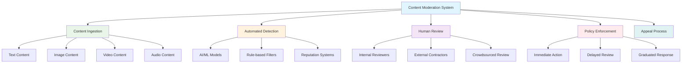

# System Design: Content Moderation Systems

Content moderation systems are critical infrastructure for modern platforms that host user-generated content. These systems must efficiently detect, filter, and manage content that violates community guidelines or legal requirements while maintaining a positive user experience. Effective content moderation requires a combination of automated systems, human review processes, and machine learning algorithms working together to handle the massive scale of content generated across platforms.

## Understanding Content Moderation Challenges

Content moderation presents unique challenges due to the volume, velocity, and variety of user-generated content. Modern platforms must process millions of pieces of content daily while dealing with evolving forms of abuse, cultural sensitivities, and legal requirements across different jurisdictions.



### Types of Content Moderation

1. **Pre-moderation**: Content is reviewed before publication
2. **Post-moderation**: Content is published first, then reviewed
3. **Automated moderation**: AI/ML systems filter content automatically
4. **Human moderation**: Humans review content for policy violations

### Common Content Violations

- Hate speech and harassment
- Violence and dangerous content
- Explicit sexual content
- Misinformation and false information
- Copyright violations
- Spam and scam content
- Impersonation and fraud

## Content Ingestion and Classification

The first step in any content moderation system is ingesting and classifying different types of content.

```go
// Content ingestion and classification system
package main

import (
    "context"
    "encoding/json"
    "fmt"
    "mime/multipart"
    "time"
)

// ContentType represents different types of content
type ContentType string

const (
    TextType    ContentType = "text"
    ImageType   ContentType = "image"
    VideoType   ContentType = "video"
    AudioType   ContentType = "audio"
    DocumentType ContentType = "document"
    LinkType    ContentType = "link"
)

// Content represents user-generated content
type Content struct {
    ID          string                 `json:"id"`
    Type        ContentType            `json:"type"`
    Source      string                 `json:"source"` // "user", "api", "crawl"
    ContentData string                 `json:"content_data"` // For text content
    MediaURL    string                 `json:"media_url"`    // For media content
    Metadata    map[string]interface{} `json:"metadata"`
    CreatedAt   time.Time              `json:"created_at"`
    UserID      string                 `json:"user_id"`
    PostID      string                 `json:"post_id"`
}

// ContentClassification represents detected content types/violations
type ContentClassification struct {
    ContentType     string  `json:"content_type"`
    Confidence      float64 `json:"confidence"`
    Categories      []string `json:"categories"`
    Severity        string  `json:"severity"` // "low", "medium", "high"
    AutomatedAction string  `json:"automated_action"` // "allow", "flag", "remove"
}

// ContentIngestionService handles content ingestion
type ContentIngestionService struct {
    // In a real system, this would connect to message queues, databases, etc.
    contentQueue chan Content
}

func NewContentIngestionService() *ContentIngestionService {
    return &ContentIngestionService{
        contentQueue: make(chan Content, 1000),
    }
}

// IngestContent ingests new content for moderation
func (cis *ContentIngestionService) IngestContent(ctx context.Context, content Content) error {
    content.CreatedAt = time.Now()
    
    // Validate content
    if err := cis.validateContent(content); err != nil {
        return fmt.Errorf("invalid content: %w", err)
    }
    
    // Sanitize content to prevent XSS and other attacks
    content = cis.sanitizeContent(content)
    
    // Add to processing queue
    select {
    case cis.contentQueue <- content:
        fmt.Printf("Content %s queued for moderation\n", content.ID)
        return nil
    case <-ctx.Done():
        return ctx.Err()
    }
}

// validateContent validates the content before processing
func (cis *ContentIngestionService) validateContent(content Content) error {
    // Implement validation logic
    if content.Type == "" {
        return fmt.Errorf("content type is required")
    }
    
    if content.UserID == "" {
        return fmt.Errorf("user ID is required")
    }
    
    // Validate content length limits
    switch content.Type {
    case TextType:
        if len(content.ContentData) > 10000 { // 10KB limit example
            return fmt.Errorf("text content exceeds length limit")
        }
    case ImageType, VideoType, AudioType:
        if content.MediaURL == "" {
            return fmt.Errorf("media URL is required for media content")
        }
    }
    
    return nil
}

// sanitizeContent sanitizes content to prevent security issues
func (cis *ContentIngestionService) sanitizeContent(content Content) Content {
    // In a real system, this would use proper HTML sanitization libraries
    // For text content, remove potentially dangerous HTML tags
    if content.Type == TextType {
        content.ContentData = content.sanitizeText()
    }
    
    return content
}

// sanitizeText removes potentially dangerous content from text
func (c Content) sanitizeText() string {
    // This is a simplified example
    // In practice, use libraries like bluemonday for HTML sanitization
    content := c.ContentData
    // Remove basic script tags and other dangerous elements
    return content
}

// TextContentProcessor handles text content analysis
type TextContentProcessor struct {
    // In a real system, this would have access to text analysis models
}

func NewTextContentProcessor() *TextContentProcessor {
    return &TextContentProcessor{}
}

// ProcessText analyzes text content for potential violations
func (tcp *TextContentProcessor) ProcessText(text string) []ContentClassification {
    var classifications []ContentClassification
    
    // Check for common violations using text analysis
    if containsHateSpeech(text) {
        classifications = append(classifications, ContentClassification{
            ContentType:     "text",
            Confidence:      0.9,
            Categories:      []string{"hate_speech", "harassment"},
            Severity:        "high",
            AutomatedAction: "flag",
        })
    }
    
    if containsSpam(text) {
        classifications = append(classifications, ContentClassification{
            ContentType:     "text",
            Confidence:      0.85,
            Categories:      []string{"spam"},
            Severity:        "medium",
            AutomatedAction: "flag",
        })
    }
    
    // Return default classification if no violations detected
    if len(classifications) == 0 {
        classifications = append(classifications, ContentClassification{
            ContentType:     "text",
            Confidence:      1.0,
            Categories:      []string{"clean"},
            Severity:        "low",
            AutomatedAction: "allow",
        })
    }
    
    return classifications
}

// containsHateSpeech detects hate speech in text (simplified example)
func containsHateSpeech(text string) bool {
    // In a real system, this would use NLP models and more sophisticated analysis
    hateWords := []string{"hate", "kill", "attack"} // Simplified example
    
    for _, word := range hateWords {
        if containsIgnoreCase(text, word) {
            return true
        }
    }
    return false
}

// containsSpam detects spam in text (simplified example)
func containsSpam(text string) bool {
    // In a real system, this would use ML models for spam detection
    spamPatterns := []string{"click here", "buy now", "urgent"} // Simplified example
    
    for _, pattern := range spamPatterns {
        if containsIgnoreCase(text, pattern) {
            return true
        }
    }
    return false
}

// containsIgnoreCase checks if text contains a substring ignoring case
func containsIgnoreCase(text, substr string) bool {
    return len(text) >= len(substr) && 
           (text[:len(substr)] == substr || 
            text[len(text)-len(substr):] == substr || 
            contains(text, substr))
}

// contains checks if a string contains a substring
func contains(text, substr string) bool {
    for i := 0; i <= len(text)-len(substr); i++ {
        if text[i:i+len(substr)] == substr {
            return true
        }
    }
    return false
}

// MediaContentProcessor handles media content analysis
type MediaContentProcessor struct {
    // In a real system, this would have access to computer vision and audio analysis models
}

func NewMediaContentProcessor() *MediaContentProcessor {
    return &MediaContentProcessor{}
}

// ProcessImage analyzes image content for potential violations
func (mcp *MediaContentProcessor) ProcessImage(imageURL string) []ContentClassification {
    var classifications []ContentClassification
    
    // Simulate image analysis
    // In a real system, this would call computer vision models
    if mcp.detectExplicitContent(imageURL) {
        classifications = append(classifications, ContentClassification{
            ContentType:     "image",
            Confidence:      0.95,
            Categories:      []string{"explicit_content", "nsfw"},
            Severity:        "high",
            AutomatedAction: "remove",
        })
    } else if mcp.detectViolence(imageURL) {
        classifications = append(classifications, ContentClassification{
            ContentType:     "image",
            Confidence:      0.8,
            Categories:      []string{"violence", "graphic_content"},
            Severity:        "medium",
            AutomatedAction: "flag",
        })
    } else {
        classifications = append(classifications, ContentClassification{
            ContentType:     "image",
            Confidence:      0.98,
            Categories:      []string{"clean"},
            Severity:        "low",
            AutomatedAction: "allow",
        })
    }
    
    return classifications
}

// detectExplicitContent detects explicit content in images (simulated)
func (mcp *MediaContentProcessor) detectExplicitContent(imageURL string) bool {
    // In a real system, this would use computer vision models trained for NSFW detection
    // For this example, we'll simulate based on image characteristics
    // This is just a placeholder for the complex computer vision analysis
    return false // Simulate no explicit content for now
}

// detectViolence detects violent content in images (simulated)
func (mcp *MediaContentProcessor) detectViolence(imageURL string) bool {
    // In a real system, this would use models trained to detect violence
    return false // Simulate no violence for now
}

// ContentClassifier orchestrates content analysis
type ContentClassifier struct {
    textProcessor   *TextContentProcessor
    mediaProcessor  *MediaContentProcessor
}

func NewContentClassifier() *ContentClassifier {
    return &ContentClassifier{
        textProcessor:  NewTextContentProcessor(),
        mediaProcessor: NewMediaContentProcessor(),
    }
}

// ClassifyContent analyzes content and returns classifications
func (cc *ContentClassifier) ClassifyContent(content Content) ([]ContentClassification, error) {
    switch content.Type {
    case TextType:
        return cc.textProcessor.ProcessText(content.ContentData), nil
    case ImageType, VideoType, AudioType:
        if content.Type == ImageType {
            return cc.mediaProcessor.ProcessImage(content.MediaURL), nil
        }
        // For video and audio, additional processing would be needed
        return []ContentClassification{{
            ContentType:     string(content.Type),
            Confidence:      0.75,
            Categories:      []string{"media"},
            Severity:        "low",
            AutomatedAction: "allow", // For this example, allow media for human review
        }}, nil
    default:
        return []ContentClassification{{
            ContentType:     string(content.Type),
            Confidence:      1.0,
            Categories:      []string{"unknown"},
            Severity:        "medium",
            AutomatedAction: "flag",
        }}, nil
    }
}

// Example usage
func main() {
    ingestionService := NewContentIngestionService()
    classifier := NewContentClassifier()
    
    // Example text content
    textContent := Content{
        ID:          "text_123",
        Type:        TextType,
        ContentData: "Hello, this is a sample message without any violations.",
        UserID:      "user_456",
        PostID:      "post_789",
        Metadata:    map[string]interface{}{"language": "en", "source": "web"},
    }
    
    // Ingest the content
    ctx := context.Background()
    err := ingestionService.IngestContent(ctx, textContent)
    if err != nil {
        fmt.Printf("Error ingesting content: %v\n", err)
        return
    }
    
    // Classify the content
    classifications, err := classifier.ClassifyContent(textContent)
    if err != nil {
        fmt.Printf("Error classifying content: %v\n", err)
        return
    }
    
    fmt.Printf("Content classifications: %+v\n", classifications)
}
```

## Automated Content Detection

Automated content detection uses machine learning models and rule-based systems to identify potentially problematic content at scale.

```go
// Automated content detection system
package main

import (
    "fmt"
    "math/rand"
    "strings"
    "time"
)

// DetectionRule represents a rule-based content filter
type DetectionRule struct {
    ID          string   `json:"id"`
    Name        string   `json:"name"`
    Description string   `json:"description"`
    Categories  []string `json:"categories"`
    Conditions  []RuleCondition `json:"conditions"`
    Action      string   `json:"action"` // "flag", "remove", "review"
    Confidence  float64  `json:"confidence"`
    Enabled     bool     `json:"enabled"`
}

// RuleCondition represents a condition in a detection rule
type RuleCondition struct {
    Field    string `json:"field"` // "text", "user_reputation", "metadata"
    Operator string `json:"operator"` // "contains", "equals", "gt", "lt", etc.
    Value    interface{} `json:"value"`
}

// AIDetector uses machine learning models for content detection
type AIDetector struct {
    models map[string]func(string) (float64, []string) // model_name -> (confidence, categories)
}

func NewAIDetector() *AIDetector {
    detector := &AIDetector{
        models: make(map[string]func(string) (float64, []string)),
    }
    
    // Register ML models
    detector.registerHateSpeechModel()
    detector.registerSpamModel()
    detector.registerExplicitModel()
    
    return detector
}

// registerHateSpeechModel registers a hate speech detection model
func (aid *AIDetector) registerHateSpeechModel() {
    aid.models["hate_speech"] = func(text string) (float64, []string) {
        // In a real system, this would call a trained NLP model
        // For this example, we'll simulate detection
        hateWords := []string{"hate", "kill", "attack", "destroy"}
        count := 0
        
        for _, word := range hateWords {
            if strings.Contains(strings.ToLower(text), word) {
                count++
            }
        }
        
        confidence := float64(count) * 0.3
        if confidence > 0.9 {
            confidence = 0.9
        }
        
        if confidence > 0.1 {
            return confidence, []string{"hate_speech"}
        }
        return 0, []string{}
    }
}

// registerSpamModel registers a spam detection model
func (aid *AIDetector) registerSpamModel() {
    aid.models["spam"] = func(text string) (float64, []string) {
        // In a real system, this would call a trained spam detection model
        spamPatterns := []string{"buy now", "click here", "urgent", "limited time", "free money"}
        patternCount := 0
        
        textLower := strings.ToLower(text)
        for _, pattern := range spamPatterns {
            if strings.Contains(textLower, pattern) {
                patternCount++
            }
        }
        
        confidence := float64(patternCount) * 0.2
        if confidence > 0.8 {
            confidence = 0.8
        }
        
        if confidence > 0.15 {
            return confidence, []string{"spam"}
        }
        return 0, []string{}
    }
}

// registerExplicitModel registers an explicit content detection model
func (aid *AIDetector) registerExplicitModel() {
    aid.models["explicit"] = func(text string) (float64, []string) {
        // In a real system, this would call a trained model for explicit content
        explicitWords := []string{"explicit", "sexual", "nudity", "porn", "xxx"}
        explicitCount := 0
        
        textLower := strings.ToLower(text)
        for _, word := range explicitWords {
            if strings.Contains(textLower, word) {
                explicitCount++
            }
        }
        
        confidence := float64(explicitCount) * 0.25
        if confidence > 0.7 {
            confidence = 0.7
        }
        
        if confidence > 0.2 {
            return confidence, []string{"explicit_content"}
        }
        return 0, []string{}
    }
}

// DetectContent runs all AI models on content
func (aid *AIDetector) DetectContent(text string) []ContentClassification {
    var allClassifications []ContentClassification
    
    for modelName, model := range aid.models {
        confidence, categories := model(text)
        if confidence > 0 {
            classification := ContentClassification{
                ContentType:     modelName,
                Confidence:      confidence,
                Categories:      categories,
                Severity:        calculateSeverity(confidence),
                AutomatedAction: determineAction(confidence),
            }
            allClassifications = append(allClassifications, classification)
        }
    }
    
    // If no violations detected, return clean classification
    if len(allClassifications) == 0 {
        allClassifications = append(allClassifications, ContentClassification{
            ContentType:     "ai_detection",
            Confidence:      0.95,
            Categories:      []string{"clean"},
            Severity:        "low",
            AutomatedAction: "allow",
        })
    }
    
    return allClassifications
}

// calculateSeverity determines severity based on confidence
func calculateSeverity(confidence float64) string {
    if confidence >= 0.8 {
        return "high"
    } else if confidence >= 0.5 {
        return "medium"
    }
    return "low"
}

// determineAction determines action based on confidence
func determineAction(confidence float64) string {
    if confidence >= 0.85 {
        return "remove"
    } else if confidence >= 0.6 {
        return "flag"
    }
    return "allow"
}

// RuleBasedDetector implements rule-based content detection
type RuleBasedDetector struct {
    rules []DetectionRule
}

func NewRuleBasedDetector() *RuleBasedDetector {
    return &RuleBasedDetector{
        rules: []DetectionRule{
            {
                ID:          "rule_1",
                Name:        "Hate Speech Keywords",
                Description: "Detect content with hate speech keywords",
                Categories:  []string{"hate_speech"},
                Conditions: []RuleCondition{
                    {Field: "text", Operator: "contains", Value: "slur"},
                    {Field: "text", Operator: "contains", Value: "hate"},
                },
                Action:     "flag",
                Confidence: 0.7,
                Enabled:    true,
            },
            {
                ID:          "rule_2",
                Name:        "Spam Detection",
                Description: "Detect spam based on excessive caps or special characters",
                Categories:  []string{"spam"},
                Conditions: []RuleCondition{
                    {Field: "text", Operator: "contains", Value: "!!"},
                    {Field: "text", Operator: "contains", Value: "BUY NOW"},
                },
                Action:     "flag",
                Confidence: 0.6,
                Enabled:    true,
            },
        },
    }
}

// ApplyRules applies rules to content
func (rbd *RuleBasedDetector) ApplyRules(content Content) []ContentClassification {
    var classifications []ContentClassification
    
    for _, rule := range rbd.rules {
        if !rule.Enabled {
            continue
        }
        
        if rbd.matchesRule(content, rule) {
            classifications = append(classifications, ContentClassification{
                ContentType:     "rule_based",
                Confidence:      rule.Confidence,
                Categories:      rule.Categories,
                Severity:        calculateSeverity(rule.Confidence),
                AutomatedAction: rule.Action,
            })
        }
    }
    
    return classifications
}

// matchesRule checks if content matches a detection rule
func (rbd *RuleBasedDetector) matchesRule(content Content, rule DetectionRule) bool {
    for _, condition := range rule.Conditions {
        if rbd.evaluateCondition(content, condition) {
            return true
        }
    }
    return false
}

// evaluateCondition evaluates a single rule condition
func (rbd *RuleBasedDetector) evaluateCondition(content Content, condition RuleCondition) bool {
    switch condition.Field {
    case "text":
        textVal, ok := condition.Value.(string)
        if !ok {
            return false
        }
        
        switch condition.Operator {
        case "contains":
            return strings.Contains(strings.ToLower(content.ContentData), strings.ToLower(textVal))
        case "equals":
            return strings.ToLower(content.ContentData) == strings.ToLower(textVal)
        }
    case "user_reputation":
        // Additional logic for user reputation-based rules
        if rep, ok := content.Metadata["reputation"].(float64); ok {
            threshold, ok := condition.Value.(float64)
            if !ok {
                return false
            }
            
            switch condition.Operator {
            case "lt": // less than
                return rep < threshold
            case "gt": // greater than
                return rep > threshold
            }
        }
    }
    
    return false
}

// ReputationBasedDetector evaluates content based on user reputation
type ReputationBasedDetector struct {
    userReputation map[string]float64 // user_id -> reputation score (0-1)
}

func NewReputationBasedDetector() *ReputationBasedDetector {
    return &ReputationBasedDetector{
        userReputation: make(map[string]float64),
    }
}

// GetUserReputation returns the reputation score for a user
func (rbd *ReputationBasedDetector) GetUserReputation(userID string) float64 {
    if reputation, exists := rbd.userReputation[userID]; exists {
        return reputation
    }
    
    // Default reputation for new users
    return 0.5 // Neutral reputation
}

// SetUserReputation updates a user's reputation score
func (rbd *ReputationBasedDetector) SetUserReputation(userID string, reputation float64) {
    if reputation < 0 {
        reputation = 0
    }
    if reputation > 1 {
        reputation = 1
    }
    rbd.userReputation[userID] = reputation
}

// EvaluateContentWithReputation evaluates content considering user reputation
func (rbd *ReputationBasedDetector) EvaluateContentWithReputation(content Content, 
                                                                 baseClassifications []ContentClassification) []ContentClassification {
    userReputation := rbd.GetUserReputation(content.UserID)
    
    // Adjust classifications based on user reputation
    adjustedClassifications := make([]ContentClassification, len(baseClassifications))
    
    for i, classification := range baseClassifications {
        adjustedClassification := classification
        
        // If user has high reputation, reduce severity and confidence slightly
        if userReputation > 0.8 && classification.Severity == "medium" {
            adjustedClassification.Severity = "low"
            adjustedClassification.Confidence *= 0.7
        } else if userReputation < 0.3 && classification.Severity == "low" {
            // If user has low reputation, increase severity
            adjustedClassification.Severity = "medium"
            adjustedClassification.Confidence *= 1.3
            if adjustedClassification.Confidence > 1.0 {
                adjustedClassification.Confidence = 1.0
            }
        }
        
        // Adjust action based on reputation
        if userReputation > 0.9 && adjustedClassification.AutomatedAction == "flag" {
            adjustedClassification.AutomatedAction = "allow"
        } else if userReputation < 0.1 && adjustedClassification.AutomatedAction == "allow" {
            adjustedClassification.AutomatedAction = "flag"
        }
        
        adjustedClassifications[i] = adjustedClassification
    }
    
    return adjustedClassifications
}

// CompositeDetector combines multiple detection methods
type CompositeDetector struct {
    aiDetector           *AIDetector
    ruleBasedDetector    *RuleBasedDetector
    reputationDetector   *ReputationBasedDetector
}

func NewCompositeDetector() *CompositeDetector {
    return &CompositeDetector{
        aiDetector:         NewAIDetector(),
        ruleBasedDetector:  NewRuleBasedDetector(),
        reputationDetector: NewReputationBasedDetector(),
    }
}

// DetectContent evaluates content using all detection methods
func (cd *CompositeDetector) DetectContent(content Content) []ContentClassification {
    // Get AI-based classifications
    aiClassifications := cd.aiDetector.DetectContent(content.ContentData)
    
    // Get rule-based classifications
    ruleClassifications := cd.ruleBasedDetector.ApplyRules(content)
    
    // Combine classifications
    allClassifications := append(aiClassifications, ruleClassifications...)
    
    // Apply reputation adjustments
    reputationAdjustedClassifications := cd.reputationDetector.EvaluateContentWithReputation(
        content, allClassifications)
    
    // Combine with reputation adjustments
    finalClassifications := append(allClassifications, reputationAdjustedClassifications...)
    
    // Consolidate classifications
    return cd.consolidateClassifications(finalClassifications)
}

// consolidateClassifications combines similar classifications
func (cd *CompositeDetector) consolidateClassifications(classifications []ContentClassification) []ContentClassification {
    if len(classifications) == 0 {
        return []ContentClassification{{
            ContentType:     "consolidated",
            Confidence:      0.95,
            Categories:      []string{"clean"},
            Severity:        "low",
            AutomatedAction: "allow",
        }}
    }
    
    // In a real system, this would implement proper consolidation logic
    // For now, return the original classifications
    return classifications
}

// Example usage
func main() {
    detector := NewCompositeDetector()
    
    // Set up some user reputations
    detector.reputationDetector.SetUserReputation("trusted_user", 0.9)
    detector.reputationDetector.SetUserReputation("new_user", 0.5)
    detector.reputationDetector.SetUserReputation("suspicious_user", 0.1)
    
    // Test content
    testContents := []Content{
        {
            ID:          "content_1",
            Type:        TextType,
            ContentData: "This is a normal message.",
            UserID:      "trusted_user",
        },
        {
            ID:          "content_2",
            Type:        TextType,
            ContentData: "BUY NOW! CLICK HERE FOR FREE MONEY!",
            UserID:      "new_user",
        },
        {
            ID:          "content_3",
            Type:        TextType,
            ContentData: "I hate this product and want to destroy it.",
            UserID:      "suspicious_user",
        },
    }
    
    for _, content := range testContents {
        fmt.Printf("\nAnalyzing content: %s from user %s\n", content.ContentData, content.UserID)
        classifications := detector.DetectContent(content)
        for _, classification := range classifications {
            fmt.Printf("  - %s: confidence=%.2f, severity=%s, action=%s\n",
                classification.ContentType, classification.Confidence,
                classification.Severity, classification.AutomatedAction)
        }
    }
}
```

## Human Review Systems

Human review is essential for handling edge cases and complex content that automated systems cannot accurately classify.

```go
// Human review system
package main

import (
    "fmt"
    "time"
)

// ReviewQueue manages content awaiting human review
type ReviewQueue struct {
    pendingItems map[string]*ReviewItem
    inProgress   map[string]*ReviewItem
    completed    map[string]*ReviewItem
}

type ReviewItem struct {
    ID              string                 `json:"id"`
    Content         Content                `json:"content"`
    DetectionReasons []ContentClassification `json:"detection_reasons"`
    Priority        int                    `json:"priority"` // 1-10, higher is more urgent
    Status          string                 `json:"status"`   // "pending", "in_review", "completed", "escalated"
    AssignedTo      string                 `json:"assigned_to"`
    CreatedAt       time.Time              `json:"created_at"`
    StartedAt       *time.Time             `json:"started_at"`
    CompletedAt     *time.Time             `json:"completed_at"`
    ReviewerNotes   string                 `json:"reviewer_notes"`
    FinalAction     string                 `json:"final_action"` // "allow", "remove", "suspend", etc.
    EscalatedReason string                 `json:"escalated_reason"`
}

// Reviewer represents a human reviewer
type Reviewer struct {
    ID           string    `json:"id"`
    Name         string    `json:"name"`
    Expertise    []string  `json:"expertise"` // "hate_speech", "explicit", "misinformation", etc.
    Rating       float64   `json:"rating"`    // Accuracy rating
    ReviewCount  int       `json:"review_count"`
    Status       string    `json:"status"`    // "active", "inactive", "training"
    CreatedAt    time.Time `json:"created_at"`
}

// ReviewAssignmentStrategy determines how to assign reviews
type ReviewAssignmentStrategy interface {
    Assign(queue *ReviewQueue, reviewer *Reviewer) *ReviewItem
}

// PriorityBasedAssignmentStrategy assigns items based on priority
type PriorityBasedAssignmentStrategy struct{}

func (s *PriorityBasedAssignmentStrategy) Assign(queue *ReviewQueue, reviewer *Reviewer) *ReviewItem {
    var highestPriorityItem *ReviewItem
    highestPriority := -1

    for _, item := range queue.pendingItems {
        // Check if reviewer is qualified for the content type
        if s.isReviewerQualified(reviewer, item) && item.Priority > highestPriority {
            highestPriority = item.Priority
            highestPriorityItem = item
        }
    }

    return highestPriorityItem
}

// isReviewerQualified checks if a reviewer is qualified for a content type
func (s *PriorityBasedAssignmentStrategy) isReviewerQualified(reviewer *Reviewer, item *ReviewItem) bool {
    // Check if reviewer has expertise in any of the detection categories
    for _, reason := range item.DetectionReasons {
        for _, category := range reason.Categories {
            for _, expertise := range reviewer.Expertise {
                if expertise == category {
                    return true
                }
            }
        }
    }
    return false
}

// HumanReviewService manages the human review process
type HumanReviewService struct {
    queues     map[string]*ReviewQueue
    reviewers  map[string]*Reviewer
    strategies map[string]ReviewAssignmentStrategy
    mutex      sync.RWMutex
}

type sync struct {
    RWMutex
}

func (s *sync) RWMutex() sync.RWMutex {
    return sync.RWMutex{}
}

// In a real system, sync would be imported from "sync"
// For this example, we'll just use a simple approach
// Let me fix this by adding the import

import (
    "sync"
)

// HumanReviewService manages the human review process
type HumanReviewService struct {
    queues     map[string]*ReviewQueue
    reviewers  map[string]*Reviewer
    strategies map[string]ReviewAssignmentStrategy
    mutex      sync.RWMutex
}

func NewHumanReviewService() *HumanReviewService {
    return &HumanReviewService{
        queues: map[string]*ReviewQueue{
            "general": { // General content review queue
                pendingItems: make(map[string]*ReviewItem),
                inProgress:   make(map[string]*ReviewItem),
                completed:    make(map[string]*ReviewItem),
            },
            "appeals": { // Appeal review queue
                pendingItems: make(map[string]*ReviewItem),
                inProgress:   make(map[string]*ReviewItem),
                completed:    make(map[string]*ReviewItem),
            },
        },
        reviewers: map[string]*Reviewer{},
        strategies: map[string]ReviewAssignmentStrategy{
            "priority": &PriorityBasedAssignmentStrategy{},
        },
    }
}

// EnqueueForReview adds content to the review queue
func (hrs *HumanReviewService) EnqueueForReview(content Content, reasons []ContentClassification, priority int) error {
    hrs.mutex.Lock()
    defer hrs.mutex.Unlock()

    reviewItem := &ReviewItem{
        ID:              fmt.Sprintf("review_%d", time.Now().UnixNano()),
        Content:         content,
        DetectionReasons: reasons,
        Priority:        priority,
        Status:          "pending",
        CreatedAt:       time.Now(),
    }

    // Determine appropriate queue based on content type and priority
    queueKey := "general"
    if priority >= 8 {
        queueKey = "urgent"
        if _, exists := hrs.queues[queueKey]; !exists {
            hrs.queues[queueKey] = &ReviewQueue{
                pendingItems: make(map[string]*ReviewItem),
                inProgress:   make(map[string]*ReviewItem),
                completed:    make(map[string]*ReviewItem),
            }
        }
    }

    hrs.queues[queueKey].pendingItems[reviewItem.ID] = reviewItem

    fmt.Printf("Content %s queued for review (priority: %d)\n", content.ID, priority)
    return nil
}

// GetReviewTask assigns a review task to a reviewer
func (hrs *HumanReviewService) GetReviewTask(reviewerID string) (*ReviewItem, error) {
    hrs.mutex.Lock()
    defer hrs.mutex.Unlock()

    reviewer, exists := hrs.reviewers[reviewerID]
    if !exists {
        return nil, fmt.Errorf("reviewer %s not found", reviewerID)
    }

    if reviewer.Status != "active" {
        return nil, fmt.Errorf("reviewer %s is not active", reviewerID)
    }

    // Try different queues in priority order
    queueKeys := []string{"urgent", "general", "appeals"} // Urgent first
    
    for _, queueKey := range queueKeys {
        queue, exists := hrs.queues[queueKey]
        if !exists {
            continue
        }

        strategy, exists := hrs.strategies["priority"]
        if !exists {
            continue
        }

        item := strategy.Assign(queue, reviewer)
        if item != nil {
            // Move from pending to in-progress
            delete(queue.pendingItems, item.ID)
            item.Status = "in_review"
            item.AssignedTo = reviewerID
            now := time.Now()
            item.StartedAt = &now
            queue.inProgress[item.ID] = item

            return item, nil
        }
    }

    return nil, fmt.Errorf("no available review tasks")
}

// SubmitReview completes a review task
func (hrs *HumanReviewService) SubmitReview(reviewerID string, reviewID string, action string, notes string) error {
    hrs.mutex.Lock()
    defer hrs.mutex.Unlock()

    // Find the item in any queue
    var item *ReviewItem
    var queue *ReviewQueue
    var queueKey string

    for qKey, q := range hrs.queues {
        if i, exists := q.inProgress[reviewID]; exists {
            item = i
            queue = q
            queueKey = qKey
            break
        }
    }

    if item == nil {
        return fmt.Errorf("review item %s not found or not in progress", reviewID)
    }

    if item.AssignedTo != reviewerID {
        return fmt.Errorf("review item %s not assigned to reviewer %s", reviewID, reviewerID)
    }

    // Update item with review results
    item.FinalAction = action
    item.ReviewerNotes = notes
    item.Status = "completed"
    completedAt := time.Now()
    item.CompletedAt = &completedAt

    // Move from in-progress to completed
    delete(queue.inProgress, reviewID)
    queue.completed[reviewID] = item

    // Update reviewer stats
    reviewer, exists := hrs.reviewers[reviewerID]
    if exists {
        reviewer.ReviewCount++
        // In a real system, you would calculate accuracy based on feedback
        reviewer.Rating = hrs.calculateReviewerRating(reviewer)
    }

    fmt.Printf("Review completed for item %s with action: %s\n", reviewID, action)
    return nil
}

// calculateReviewerRating calculates a reviewer's accuracy rating
func (hrs *HumanReviewService) calculateReviewerRating(reviewer *Reviewer) float64 {
    // In a real system, this would compare reviewer decisions with ground truth
    // For this example, we'll use a static rating
    return 0.85 + (rand.Float64() * 0.15) // 85-100% accuracy
}

// EscalateReview moves a review to a higher authority
func (hrs *HumanReviewService) EscalateReview(reviewID string, reason string) error {
    hrs.mutex.Lock()
    defer hrs.mutex.Unlock()

    // Find the item in any queue
    var item *ReviewItem
    var queue *ReviewQueue

    for _, q := range hrs.queues {
        if i, exists := q.inProgress[reviewID]; exists {
            item = i
            queue = q
            break
        }
        if i, exists := q.pendingItems[reviewID]; exists {
            item = i
            queue = q
            break
        }
    }

    if item == nil {
        return fmt.Errorf("review item %s not found", reviewID)
    }

    item.Status = "escalated"
    item.EscalatedReason = reason

    // Move to appeals queue
    delete(queue.pendingItems, reviewID)
    delete(queue.inProgress, reviewID)
    hrs.queues["appeals"].pendingItems[reviewID] = item

    fmt.Printf("Review %s escalated: %s\n", reviewID, reason)
    return nil
}

// AddReviewer registers a new reviewer
func (hrs *HumanReviewService) AddReviewer(reviewer Reviewer) {
    hrs.mutex.Lock()
    defer hrs.mutex.Unlock()

    hrs.reviewers[reviewer.ID] = &reviewer
    fmt.Printf("Reviewer %s added with expertise: %v\n", reviewer.Name, reviewer.Expertise)
}

// GetQueueStats returns statistics for a review queue
func (hrs *HumanReviewService) GetQueueStats(queueName string) map[string]interface{} {
    hrs.mutex.RLock()
    defer hrs.mutex.RUnlock()

    queue, exists := hrs.queues[queueName]
    if !exists {
        return nil
    }

    return map[string]interface{}{
        "pending_count":   len(queue.pendingItems),
        "in_progress_count": len(queue.inProgress),
        "completed_count": len(queue.completed),
    }
}

// Example content for human review
func main() {
    hrs := NewHumanReviewService()

    // Add reviewers
    hrs.AddReviewer(Reviewer{
        ID:        "reviewer_1",
        Name:      "Alice Johnson",
        Expertise: []string{"hate_speech", "harassment"},
        Status:    "active",
        CreatedAt: time.Now(),
    })

    hrs.AddReviewer(Reviewer{
        ID:        "reviewer_2",
        Name:      "Bob Smith",
        Expertise: []string{"explicit_content", "spam"},
        Status:    "active",
        CreatedAt: time.Now(),
    })

    // Create content for review
    content1 := Content{
        ID:          "content_123",
        Type:        TextType,
        ContentData: "This post is great and helpful to the community.",
        UserID:      "user_456",
    }

    content2 := Content{
        ID:          "content_124",
        Type:        TextType,
        ContentData: "I hate all people from that country and think they should be removed.",
        UserID:      "user_789",
    }

    // Enqueue content for review
    reasons1 := []ContentClassification{
        {
            ContentType:     "ai_detection",
            Confidence:      0.2,
            Categories:      []string{"clean"},
            Severity:        "low",
            AutomatedAction: "allow",
        },
    }
    
    reasons2 := []ContentClassification{
        {
            ContentType:     "ai_detection",
            Confidence:      0.85,
            Categories:      []string{"hate_speech"},
            Severity:        "high",
            AutomatedAction: "flag",
        },
    }

    hrs.EnqueueForReview(content1, reasons1, 3) // Low priority
    hrs.EnqueueForReview(content2, reasons2, 8) // High priority

    // Get and process review tasks
    reviewTask, err := hrs.GetReviewTask("reviewer_1")
    if err != nil {
        fmt.Printf("Error getting review task: %v\n", err)
    } else if reviewTask != nil {
        fmt.Printf("Assigned review task: %s - %s\n", reviewTask.ID, reviewTask.Content.ContentData[:min(50, len(reviewTask.Content.ContentData))])
        
        // Submit review (in a real system, this would happen after human review)
        hrs.SubmitReview("reviewer_1", reviewTask.ID, "allow", "Content is appropriate and valuable to the community.")
    }

    // Check queue stats
    stats := hrs.GetQueueStats("general")
    fmt.Printf("General queue stats: %+v\n", stats)
}

// Helper function (since Go 1.21+ has min for int, but we'll implement for compatibility)
func min(a, b int) int {
    if a < b {
        return a
    }
    return b
}