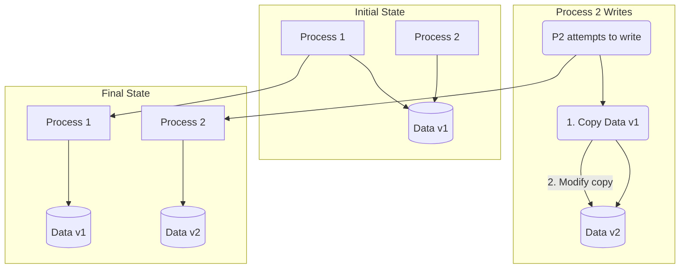

## Introduction: The Danger of Shared, Mutable State

In concurrent programming, one of the biggest sources of bugs and complexity is shared, mutable state. When multiple threads or processes try to modify the same piece of data at the same time, you need complex locking mechanisms to prevent race conditions and data corruption. These locks can be difficult to get right and can severely limit performance.

What if we could avoid this problem by simply not modifying data in place? This is the core idea behind **Copy-on-Write (COW)**, a powerful pattern that leverages immutability to provide safe and efficient data sharing.

## What is Copy-on-Write?

The COW pattern follows a simple rule: whenever you want to modify a piece of data, you don't change the original. Instead, you create a copy and apply your changes to the copy.

Here's the flow:
1.  **Sharing:** Multiple parties can safely share a pointer to the same data structure because they know it's immutable—it will never change. This is extremely efficient as it avoids unnecessary data duplication.
2.  **Write Attempt:** When one party wants to modify the data, it triggers the "copy-on-write" mechanism.
3.  **Copy:** The system creates a new copy of the data structure.
4.  **Modify:** The change is applied to the *new copy*.
5.  **Update Pointer:** The modifying party updates its pointer to point to the new, modified version. Other parties are unaffected and continue to see the original, unmodified version.



This pattern is used extensively in operating systems (e.g., for managing memory pages when a process forks), file systems (like ZFS and Btrfs), and software applications (like the string implementation in some programming languages).

## COW in Data Storage

Copy-on-Write is a foundational concept in many modern storage engines and databases, especially those that use log-structured designs.

Instead of overwriting data blocks in place (like a traditional B-Tree), a COW database writes a new version of the block to a different location on disk.

### B-Trees vs. COW B-Trees

*   **Traditional B-Tree:** When a page in the tree is modified, it is updated in-place. This requires locking and can lead to data corruption if a crash happens mid-write (which is why they rely on a Write-Ahead Log).
*   **COW B-Tree:** When a page needs to be modified, the database first copies the page to a new location, applies the change there, and then works its way up the tree, copying and modifying every parent page until it reaches the root. Finally, it atomically swaps a pointer to point to the new root.

This process creates a "snapshot" of the database. The old root and all its child pages are still intact and represent the state of the database before the transaction. This makes it incredibly easy to implement features like:
*   **Transactional Atomicity:** If the process crashes, the new, partially written tree is simply discarded. The database root pointer still points to the old, consistent version.
*   **Snapshots and Time Travel:** You can keep old root pointers around to maintain consistent, read-only snapshots of the database at different points in time with almost no overhead.

This is precisely how databases like LMDB and file systems like ZFS work.

## Benefits of Copy-on-Write

1.  **Concurrency and Safety:** Readers and writers don't block each other. Readers can traverse the old version of a data structure while a writer is busy creating a new one. No locks are needed for reading.
2.  **Durability and Atomicity:** Writes are atomic. The change only becomes "live" when a single pointer is swapped at the very end of the process. This eliminates many common sources of data corruption.
3.  **Efficient Snapshots:** Creating snapshots is virtually free, as it just involves preserving a pointer to an old version of the data.

## Drawbacks of Copy-on-Write

1.  **Write Amplification:** A small change can lead to a large amount of writing. In a COW B-Tree, changing a single leaf page requires copying and writing not just that page, but every parent page up to the root. This can be inefficient for write-heavy workloads and can wear out SSDs faster.
2.  **Data Locality:** Over time, related data that was once stored contiguously on disk can become fragmented as it's copied to new locations. This can degrade read performance for range scans. Background compaction or defragmentation processes are often needed to address this.

## Go Example: A Simple COW Data Structure

This example demonstrates the COW pattern with a simple slice. We create a `CowSlice` that allows multiple "readers" to share its data. When a writer wants to make a change, it gets its own private copy, leaving the original untouched.

```go
package main

import (
	"fmt"
	"sync"
)

// CowSlice is a simple Copy-on-Write slice.
type CowSlice struct {
	mu   sync.RWMutex
	data []int
}

func NewCowSlice(data []int) *CowSlice {
	return &CowSlice{data: data}
}

// Read returns a reference to the shared, immutable data.
// Multiple readers can call this concurrently without issue.
func (cs *CowSlice) Read() []int {
	cs.mu.RLock()
	defer cs.mu.RUnlock()
	return cs.data
}

// Write applies a function to a *copy* of the data.
func (cs *CowSlice) Write(modifier func(data []int)) {
	cs.mu.Lock()
	defer cs.mu.Unlock()

	// 1. Create a copy.
	newData := make([]int, len(cs.data))
	copy(newData, cs.data)

	// 2. Modify the copy.
	modifier(newData)

	// 3. Atomically swap the pointer.
	cs.data = newData
}

func main() {
	originalData := []int{1, 2, 3}
	cow := NewCowSlice(originalData)

	// Reader 1 sees the original data.
	reader1View := cow.Read()
	fmt.Printf("Reader 1 sees: %v\n", reader1View)

	// A writer comes along and modifies the data.
	fmt.Println("Writer is modifying the data...")
	cow.Write(func(data []int) {
		data[0] = 99
	})

	// Reader 2 sees the new data.
	reader2View := cow.Read()
	fmt.Printf("Reader 2 sees: %v\n", reader2View)

	// Crucially, Reader 1's view of the data has not changed!
	// It still holds a reference to the original, unmodified slice.
	fmt.Printf("Reader 1 still sees: %v\n", reader1View)
}
```
This example highlights the key benefit: `reader1View` remains unchanged because the write operation happened on a copy. This provides isolation and prevents race conditions without complex locks.

## Conclusion

Copy-on-Write is a powerful technique that trades some write performance and space for significant gains in concurrency, safety, and simplicity. By embracing immutability, it provides an elegant solution to the problem of managing shared state. While not suitable for every workload, it is a fundamental pattern in the design of reliable operating systems, file systems, and databases, offering atomic transactions and low-cost snapshots as natural side effects of its design.
