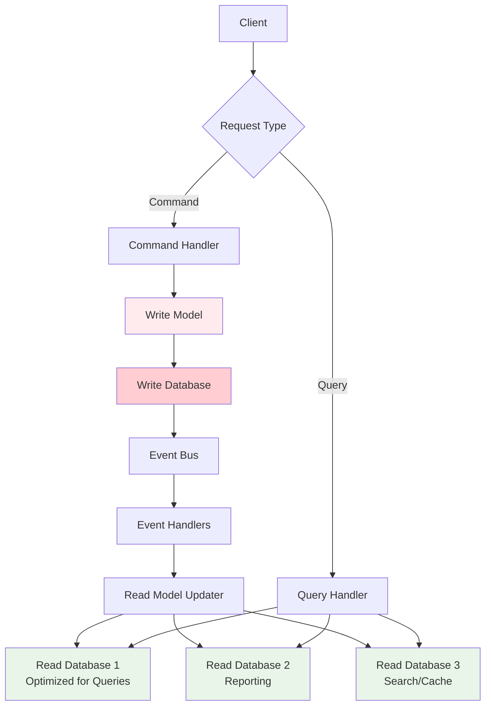

# System Design Fundamentals: CQRS (Command Query Responsibility Segregation)

CQRS separates read and write operations into different models, allowing independent scaling, optimization, and evolution of each side. This pattern is especially powerful when combined with Event Sourcing.

## CQRS Architecture



## Command Side

```go
package main

import (
    "fmt"
    "sync"
    "time"
)

// Command represents a write operation
type Command interface {
    GetCommandType() string
    Validate() error
}

// CreateOrderCommand
type CreateOrderCommand struct {
    OrderID    string
    CustomerID string
    Items      []OrderItem
}

type OrderItem struct {
    ProductID string
    Quantity  int
    Price     float64
}

func (c CreateOrderCommand) GetCommandType() string {
    return "CreateOrder"
}

func (c CreateOrderCommand) Validate() error {
    if c.OrderID == "" {
        return fmt.Errorf("order ID is required")
    }
    if c.CustomerID == "" {
        return fmt.Errorf("customer ID is required")
    }
    if len(c.Items) == 0 {
        return fmt.Errorf("order must have at least one item")
    }
    return nil
}

// UpdateOrderStatusCommand
type UpdateOrderStatusCommand struct {
    OrderID   string
    NewStatus string
}

func (c UpdateOrderStatusCommand) GetCommandType() string {
    return "UpdateOrderStatus"
}

func (c UpdateOrderStatusCommand) Validate() error {
    if c.OrderID == "" {
        return fmt.Errorf("order ID is required")
    }
    validStatuses := map[string]bool{
        "PENDING": true, "CONFIRMED": true, "SHIPPED": true,
        "DELIVERED": true, "CANCELLED": true,
    }
    if !validStatuses[c.NewStatus] {
        return fmt.Errorf("invalid status: %s", c.NewStatus)
    }
    return nil
}

// CancelOrderCommand
type CancelOrderCommand struct {
    OrderID string
    Reason  string
}

func (c CancelOrderCommand) GetCommandType() string {
    return "CancelOrder"
}

func (c CancelOrderCommand) Validate() error {
    if c.OrderID == "" {
        return fmt.Errorf("order ID is required")
    }
    return nil
}
```

## Command Handler

```go
// CommandHandler processes commands
type CommandHandler interface {
    Handle(command Command) error
}

// OrderCommandHandler handles order commands
type OrderCommandHandler struct {
    writeModel *OrderWriteModel
    eventBus   *EventBus
}

func NewOrderCommandHandler(writeModel *OrderWriteModel, eventBus *EventBus) *OrderCommandHandler {
    return &OrderCommandHandler{
        writeModel: writeModel,
        eventBus:   eventBus,
    }
}

func (h *OrderCommandHandler) Handle(command Command) error {
    // Validate command
    if err := command.Validate(); err != nil {
        return fmt.Errorf("validation failed: %w", err)
    }
    
    fmt.Printf("⚡ Handling command: %s\n", command.GetCommandType())
    
    // Process based on command type
    switch cmd := command.(type) {
    case CreateOrderCommand:
        return h.handleCreateOrder(cmd)
    case UpdateOrderStatusCommand:
        return h.handleUpdateOrderStatus(cmd)
    case CancelOrderCommand:
        return h.handleCancelOrder(cmd)
    default:
        return fmt.Errorf("unknown command type: %s", command.GetCommandType())
    }
}

func (h *OrderCommandHandler) handleCreateOrder(cmd CreateOrderCommand) error {
    // Business logic validation
    total := 0.0
    for _, item := range cmd.Items {
        if item.Quantity <= 0 {
            return fmt.Errorf("invalid quantity for product %s", item.ProductID)
        }
        total += item.Price * float64(item.Quantity)
    }
    
    // Create order in write model
    order := &Order{
        OrderID:    cmd.OrderID,
        CustomerID: cmd.CustomerID,
        Items:      cmd.Items,
        Status:     "PENDING",
        Total:      total,
        CreatedAt:  time.Now(),
    }
    
    if err := h.writeModel.CreateOrder(order); err != nil {
        return err
    }
    
    // Publish event
    event := OrderCreatedEvent{
        OrderID:    cmd.OrderID,
        CustomerID: cmd.CustomerID,
        Items:      cmd.Items,
        Total:      total,
        Timestamp:  time.Now(),
    }
    
    h.eventBus.Publish(event)
    
    fmt.Printf("✅ Order created: %s (total: $%.2f)\n", cmd.OrderID, total)
    
    return nil
}

func (h *OrderCommandHandler) handleUpdateOrderStatus(cmd UpdateOrderStatusCommand) error {
    // Get current order
    order, err := h.writeModel.GetOrder(cmd.OrderID)
    if err != nil {
        return err
    }
    
    // Validate state transition
    if !isValidStatusTransition(order.Status, cmd.NewStatus) {
        return fmt.Errorf("invalid status transition: %s -> %s", order.Status, cmd.NewStatus)
    }
    
    // Update order
    oldStatus := order.Status
    order.Status = cmd.NewStatus
    order.UpdatedAt = time.Now()
    
    if err := h.writeModel.UpdateOrder(order); err != nil {
        return err
    }
    
    // Publish event
    event := OrderStatusChangedEvent{
        OrderID:   cmd.OrderID,
        OldStatus: oldStatus,
        NewStatus: cmd.NewStatus,
        Timestamp: time.Now(),
    }
    
    h.eventBus.Publish(event)
    
    fmt.Printf("✅ Order status updated: %s (%s -> %s)\n", cmd.OrderID, oldStatus, cmd.NewStatus)
    
    return nil
}

func (h *OrderCommandHandler) handleCancelOrder(cmd CancelOrderCommand) error {
    order, err := h.writeModel.GetOrder(cmd.OrderID)
    if err != nil {
        return err
    }
    
    if order.Status == "DELIVERED" || order.Status == "CANCELLED" {
        return fmt.Errorf("cannot cancel order in status: %s", order.Status)
    }
    
    order.Status = "CANCELLED"
    order.UpdatedAt = time.Now()
    
    if err := h.writeModel.UpdateOrder(order); err != nil {
        return err
    }
    
    event := OrderCancelledEvent{
        OrderID:   cmd.OrderID,
        Reason:    cmd.Reason,
        Timestamp: time.Now(),
    }
    
    h.eventBus.Publish(event)
    
    fmt.Printf("✅ Order cancelled: %s (reason: %s)\n", cmd.OrderID, cmd.Reason)
    
    return nil
}

func isValidStatusTransition(from, to string) bool {
    validTransitions := map[string][]string{
        "PENDING":   {"CONFIRMED", "CANCELLED"},
        "CONFIRMED": {"SHIPPED", "CANCELLED"},
        "SHIPPED":   {"DELIVERED"},
    }
    
    allowed := validTransitions[from]
    for _, status := range allowed {
        if status == to {
            return true
        }
    }
    
    return false
}
```

## Write Model

```go
// Order represents the write model
type Order struct {
    OrderID    string
    CustomerID string
    Items      []OrderItem
    Status     string
    Total      float64
    CreatedAt  time.Time
    UpdatedAt  time.Time
}

// OrderWriteModel manages order persistence (write side)
type OrderWriteModel struct {
    orders map[string]*Order
    mutex  sync.RWMutex
}

func NewOrderWriteModel() *OrderWriteModel {
    return &OrderWriteModel{
        orders: make(map[string]*Order),
    }
}

func (wm *OrderWriteModel) CreateOrder(order *Order) error {
    wm.mutex.Lock()
    defer wm.mutex.Unlock()
    
    if _, exists := wm.orders[order.OrderID]; exists {
        return fmt.Errorf("order already exists: %s", order.OrderID)
    }
    
    wm.orders[order.OrderID] = order
    
    return nil
}

func (wm *OrderWriteModel) UpdateOrder(order *Order) error {
    wm.mutex.Lock()
    defer wm.mutex.Unlock()
    
    if _, exists := wm.orders[order.OrderID]; !exists {
        return fmt.Errorf("order not found: %s", order.OrderID)
    }
    
    wm.orders[order.OrderID] = order
    
    return nil
}

func (wm *OrderWriteModel) GetOrder(orderID string) (*Order, error) {
    wm.mutex.RLock()
    defer wm.mutex.RUnlock()
    
    order, exists := wm.orders[orderID]
    if !exists {
        return nil, fmt.Errorf("order not found: %s", orderID)
    }
    
    // Return copy
    orderCopy := *order
    return &orderCopy, nil
}
```

## Events

```go
// Event interface
type Event interface {
    GetEventType() string
    GetTimestamp() time.Time
}

// OrderCreatedEvent
type OrderCreatedEvent struct {
    OrderID    string
    CustomerID string
    Items      []OrderItem
    Total      float64
    Timestamp  time.Time
}

func (e OrderCreatedEvent) GetEventType() string {
    return "OrderCreated"
}

func (e OrderCreatedEvent) GetTimestamp() time.Time {
    return e.Timestamp
}

// OrderStatusChangedEvent
type OrderStatusChangedEvent struct {
    OrderID   string
    OldStatus string
    NewStatus string
    Timestamp time.Time
}

func (e OrderStatusChangedEvent) GetEventType() string {
    return "OrderStatusChanged"
}

func (e OrderStatusChangedEvent) GetTimestamp() time.Time {
    return e.Timestamp
}

// OrderCancelledEvent
type OrderCancelledEvent struct {
    OrderID   string
    Reason    string
    Timestamp time.Time
}

func (e OrderCancelledEvent) GetEventType() string {
    return "OrderCancelled"
}

func (e OrderCancelledEvent) GetTimestamp() time.Time {
    return e.Timestamp
}
```

## Event Bus

```go
// EventBus manages event publishing and subscription
type EventBus struct {
    subscribers map[string][]EventHandler
    mutex       sync.RWMutex
}

type EventHandler func(event Event) error

func NewEventBus() *EventBus {
    return &EventBus{
        subscribers: make(map[string][]EventHandler),
    }
}

func (eb *EventBus) Subscribe(eventType string, handler EventHandler) {
    eb.mutex.Lock()
    defer eb.mutex.Unlock()
    
    if eb.subscribers[eventType] == nil {
        eb.subscribers[eventType] = make([]EventHandler, 0)
    }
    
    eb.subscribers[eventType] = append(eb.subscribers[eventType], handler)
    
    fmt.Printf("🔔 Subscribed to event: %s\n", eventType)
}

func (eb *EventBus) Publish(event Event) {
    eb.mutex.RLock()
    handlers := eb.subscribers[event.GetEventType()]
    eb.mutex.RUnlock()
    
    fmt.Printf("📢 Publishing event: %s\n", event.GetEventType())
    
    // Handle events asynchronously
    for _, handler := range handlers {
        go func(h EventHandler) {
            if err := h(event); err != nil {
                fmt.Printf("❌ Error handling event: %v\n", err)
            }
        }(handler)
    }
}
```

## Query Side

```go
// Query represents a read operation
type Query interface {
    GetQueryType() string
}

// GetOrderByIDQuery
type GetOrderByIDQuery struct {
    OrderID string
}

func (q GetOrderByIDQuery) GetQueryType() string {
    return "GetOrderByID"
}

// GetOrdersByCustomerQuery
type GetOrdersByCustomerQuery struct {
    CustomerID string
}

func (q GetOrdersByCustomerQuery) GetQueryType() string {
    return "GetOrdersByCustomer"
}

// GetOrdersByStatusQuery
type GetOrdersByStatusQuery struct {
    Status string
}

func (q GetOrdersByStatusQuery) GetQueryType() string {
    return "GetOrdersByStatus"
}

// GetOrderStatisticsQuery
type GetOrderStatisticsQuery struct {
    FromDate time.Time
    ToDate   time.Time
}

func (q GetOrderStatisticsQuery) GetQueryType() string {
    return "GetOrderStatistics"
}
```

## Query Handler

```go
// QueryHandler processes queries
type QueryHandler interface {
    Handle(query Query) (interface{}, error)
}

// OrderQueryHandler handles order queries
type OrderQueryHandler struct {
    readModel *OrderReadModel
}

func NewOrderQueryHandler(readModel *OrderReadModel) *OrderQueryHandler {
    return &OrderQueryHandler{
        readModel: readModel,
    }
}

func (h *OrderQueryHandler) Handle(query Query) (interface{}, error) {
    fmt.Printf("🔍 Handling query: %s\n", query.GetQueryType())
    
    switch q := query.(type) {
    case GetOrderByIDQuery:
        return h.handleGetOrderByID(q)
    case GetOrdersByCustomerQuery:
        return h.handleGetOrdersByCustomer(q)
    case GetOrdersByStatusQuery:
        return h.handleGetOrdersByStatus(q)
    case GetOrderStatisticsQuery:
        return h.handleGetOrderStatistics(q)
    default:
        return nil, fmt.Errorf("unknown query type: %s", query.GetQueryType())
    }
}

func (h *OrderQueryHandler) handleGetOrderByID(query GetOrderByIDQuery) (interface{}, error) {
    order, err := h.readModel.GetOrderByID(query.OrderID)
    if err != nil {
        return nil, err
    }
    
    fmt.Printf("✅ Found order: %s\n", query.OrderID)
    
    return order, nil
}

func (h *OrderQueryHandler) handleGetOrdersByCustomer(query GetOrdersByCustomerQuery) (interface{}, error) {
    orders := h.readModel.GetOrdersByCustomer(query.CustomerID)
    
    fmt.Printf("✅ Found %d orders for customer: %s\n", len(orders), query.CustomerID)
    
    return orders, nil
}

func (h *OrderQueryHandler) handleGetOrdersByStatus(query GetOrdersByStatusQuery) (interface{}, error) {
    orders := h.readModel.GetOrdersByStatus(query.Status)
    
    fmt.Printf("✅ Found %d orders with status: %s\n", len(orders), query.Status)
    
    return orders, nil
}

func (h *OrderQueryHandler) handleGetOrderStatistics(query GetOrderStatisticsQuery) (interface{}, error) {
    stats := h.readModel.GetOrderStatistics(query.FromDate, query.ToDate)
    
    fmt.Printf("✅ Generated statistics for date range\n")
    
    return stats, nil
}
```

## Read Model

```go
// OrderReadDTO represents denormalized order data
type OrderReadDTO struct {
    OrderID      string
    CustomerID   string
    CustomerName string
    ItemCount    int
    Total        float64
    Status       string
    CreatedAt    time.Time
    UpdatedAt    time.Time
}

// OrderStatistics
type OrderStatistics struct {
    TotalOrders     int
    TotalRevenue    float64
    AverageOrderValue float64
    OrdersByStatus  map[string]int
}

// OrderReadModel manages denormalized read data
type OrderReadModel struct {
    orders         map[string]*OrderReadDTO
    customerIndex  map[string][]string // customerID -> orderIDs
    statusIndex    map[string][]string // status -> orderIDs
    mutex          sync.RWMutex
}

func NewOrderReadModel() *OrderReadModel {
    return &OrderReadModel{
        orders:        make(map[string]*OrderReadDTO),
        customerIndex: make(map[string][]string),
        statusIndex:   make(map[string][]string),
    }
}

func (rm *OrderReadModel) GetOrderByID(orderID string) (*OrderReadDTO, error) {
    rm.mutex.RLock()
    defer rm.mutex.RUnlock()
    
    order, exists := rm.orders[orderID]
    if !exists {
        return nil, fmt.Errorf("order not found: %s", orderID)
    }
    
    // Return copy
    orderCopy := *order
    return &orderCopy, nil
}

func (rm *OrderReadModel) GetOrdersByCustomer(customerID string) []*OrderReadDTO {
    rm.mutex.RLock()
    defer rm.mutex.RUnlock()
    
    orderIDs := rm.customerIndex[customerID]
    orders := make([]*OrderReadDTO, 0, len(orderIDs))
    
    for _, orderID := range orderIDs {
        if order, exists := rm.orders[orderID]; exists {
            orderCopy := *order
            orders = append(orders, &orderCopy)
        }
    }
    
    return orders
}

func (rm *OrderReadModel) GetOrdersByStatus(status string) []*OrderReadDTO {
    rm.mutex.RLock()
    defer rm.mutex.RUnlock()
    
    orderIDs := rm.statusIndex[status]
    orders := make([]*OrderReadDTO, 0, len(orderIDs))
    
    for _, orderID := range orderIDs {
        if order, exists := rm.orders[orderID]; exists {
            orderCopy := *order
            orders = append(orders, &orderCopy)
        }
    }
    
    return orders
}

func (rm *OrderReadModel) GetOrderStatistics(fromDate, toDate time.Time) *OrderStatistics {
    rm.mutex.RLock()
    defer rm.mutex.RUnlock()
    
    stats := &OrderStatistics{
        OrdersByStatus: make(map[string]int),
    }
    
    for _, order := range rm.orders {
        if order.CreatedAt.After(fromDate) && order.CreatedAt.Before(toDate) {
            stats.TotalOrders++
            stats.TotalRevenue += order.Total
            stats.OrdersByStatus[order.Status]++
        }
    }
    
    if stats.TotalOrders > 0 {
        stats.AverageOrderValue = stats.TotalRevenue / float64(stats.TotalOrders)
    }
    
    return stats
}

// Update methods (called by event handlers)

func (rm *OrderReadModel) AddOrder(order *OrderReadDTO) {
    rm.mutex.Lock()
    defer rm.mutex.Unlock()
    
    rm.orders[order.OrderID] = order
    
    // Update indexes
    rm.customerIndex[order.CustomerID] = append(
        rm.customerIndex[order.CustomerID], order.OrderID)
    rm.statusIndex[order.Status] = append(
        rm.statusIndex[order.Status], order.OrderID)
    
    fmt.Printf("📊 Read model updated: Added order %s\n", order.OrderID)
}

func (rm *OrderReadModel) UpdateOrderStatus(orderID, oldStatus, newStatus string, updatedAt time.Time) {
    rm.mutex.Lock()
    defer rm.mutex.Unlock()
    
    order, exists := rm.orders[orderID]
    if !exists {
        return
    }
    
    // Update order
    order.Status = newStatus
    order.UpdatedAt = updatedAt
    
    // Update status index
    rm.removeFromStatusIndex(orderID, oldStatus)
    rm.statusIndex[newStatus] = append(rm.statusIndex[newStatus], orderID)
    
    fmt.Printf("📊 Read model updated: Order %s status %s -> %s\n", orderID, oldStatus, newStatus)
}

func (rm *OrderReadModel) removeFromStatusIndex(orderID, status string) {
    orderIDs := rm.statusIndex[status]
    for i, id := range orderIDs {
        if id == orderID {
            rm.statusIndex[status] = append(orderIDs[:i], orderIDs[i+1:]...)
            break
        }
    }
}
```

## Read Model Updater

```go
// ReadModelUpdater updates read models based on events
type ReadModelUpdater struct {
    readModel *OrderReadModel
}

func NewReadModelUpdater(readModel *OrderReadModel) *ReadModelUpdater {
    return &ReadModelUpdater{
        readModel: readModel,
    }
}

func (rmu *ReadModelUpdater) HandleOrderCreated(event Event) error {
    e := event.(OrderCreatedEvent)
    
    order := &OrderReadDTO{
        OrderID:      e.OrderID,
        CustomerID:   e.CustomerID,
        CustomerName: "Customer-" + e.CustomerID, // Would fetch from customer service
        ItemCount:    len(e.Items),
        Total:        e.Total,
        Status:       "PENDING",
        CreatedAt:    e.Timestamp,
        UpdatedAt:    e.Timestamp,
    }
    
    rmu.readModel.AddOrder(order)
    
    return nil
}

func (rmu *ReadModelUpdater) HandleOrderStatusChanged(event Event) error {
    e := event.(OrderStatusChangedEvent)
    
    rmu.readModel.UpdateOrderStatus(e.OrderID, e.OldStatus, e.NewStatus, e.Timestamp)
    
    return nil
}

func (rmu *ReadModelUpdater) HandleOrderCancelled(event Event) error {
    e := event.(OrderCancelledEvent)
    
    // For cancelled orders, we might want to update differently
    // For now, treat as status change
    order, err := rmu.readModel.GetOrderByID(e.OrderID)
    if err != nil {
        return err
    }
    
    rmu.readModel.UpdateOrderStatus(e.OrderID, order.Status, "CANCELLED", e.Timestamp)
    
    return nil
}
```

## CQRS Facade

```go
// CQRSFacade provides unified interface for commands and queries
type CQRSFacade struct {
    commandHandler *OrderCommandHandler
    queryHandler   *OrderQueryHandler
}

func NewCQRSFacade(commandHandler *OrderCommandHandler, queryHandler *OrderQueryHandler) *CQRSFacade {
    return &CQRSFacade{
        commandHandler: commandHandler,
        queryHandler:   queryHandler,
    }
}

func (f *CQRSFacade) ExecuteCommand(command Command) error {
    return f.commandHandler.Handle(command)
}

func (f *CQRSFacade) ExecuteQuery(query Query) (interface{}, error) {
    return f.queryHandler.Handle(query)
}
```

## Complete Demo

```go
func main() {
    fmt.Println("🚀 Starting CQRS Demo\n")
    
    // Initialize write side
    writeModel := NewOrderWriteModel()
    eventBus := NewEventBus()
    commandHandler := NewOrderCommandHandler(writeModel, eventBus)
    
    // Initialize read side
    readModel := NewOrderReadModel()
    queryHandler := NewOrderQueryHandler(readModel)
    readModelUpdater := NewReadModelUpdater(readModel)
    
    // Subscribe read model updater to events
    eventBus.Subscribe("OrderCreated", readModelUpdater.HandleOrderCreated)
    eventBus.Subscribe("OrderStatusChanged", readModelUpdater.HandleOrderStatusChanged)
    eventBus.Subscribe("OrderCancelled", readModelUpdater.HandleOrderCancelled)
    
    // Create facade
    facade := NewCQRSFacade(commandHandler, queryHandler)
    
    fmt.Println("=== Executing Commands ===\n")
    
    // Create orders
    createCmd1 := CreateOrderCommand{
        OrderID:    "order-001",
        CustomerID: "customer-123",
        Items: []OrderItem{
            {ProductID: "prod-1", Quantity: 2, Price: 29.99},
            {ProductID: "prod-2", Quantity: 1, Price: 49.99},
        },
    }
    facade.ExecuteCommand(createCmd1)
    
    time.Sleep(100 * time.Millisecond)
    
    createCmd2 := CreateOrderCommand{
        OrderID:    "order-002",
        CustomerID: "customer-123",
        Items: []OrderItem{
            {ProductID: "prod-3", Quantity: 1, Price: 99.99},
        },
    }
    facade.ExecuteCommand(createCmd2)
    
    time.Sleep(100 * time.Millisecond)
    
    createCmd3 := CreateOrderCommand{
        OrderID:    "order-003",
        CustomerID: "customer-456",
        Items: []OrderItem{
            {ProductID: "prod-1", Quantity: 3, Price: 29.99},
        },
    }
    facade.ExecuteCommand(createCmd3)
    
    time.Sleep(100 * time.Millisecond)
    
    // Update order statuses
    fmt.Println("\n=== Updating Order Statuses ===\n")
    
    updateCmd1 := UpdateOrderStatusCommand{
        OrderID:   "order-001",
        NewStatus: "CONFIRMED",
    }
    facade.ExecuteCommand(updateCmd1)
    
    time.Sleep(100 * time.Millisecond)
    
    updateCmd2 := UpdateOrderStatusCommand{
        OrderID:   "order-001",
        NewStatus: "SHIPPED",
    }
    facade.ExecuteCommand(updateCmd2)
    
    time.Sleep(100 * time.Millisecond)
    
    // Cancel an order
    fmt.Println("\n=== Cancelling Order ===\n")
    
    cancelCmd := CancelOrderCommand{
        OrderID: "order-002",
        Reason:  "Customer requested cancellation",
    }
    facade.ExecuteCommand(cancelCmd)
    
    time.Sleep(100 * time.Millisecond)
    
    // Execute queries
    fmt.Println("\n=== Executing Queries ===\n")
    
    // Get order by ID
    result1, _ := facade.ExecuteQuery(GetOrderByIDQuery{OrderID: "order-001"})
    order := result1.(*OrderReadDTO)
    fmt.Printf("\n📋 Order Details:\n")
    fmt.Printf("  ID: %s\n", order.OrderID)
    fmt.Printf("  Customer: %s\n", order.CustomerName)
    fmt.Printf("  Items: %d\n", order.ItemCount)
    fmt.Printf("  Total: $%.2f\n", order.Total)
    fmt.Printf("  Status: %s\n", order.Status)
    
    // Get orders by customer
    result2, _ := facade.ExecuteQuery(GetOrdersByCustomerQuery{CustomerID: "customer-123"})
    customerOrders := result2.([]*OrderReadDTO)
    fmt.Printf("\n📋 Customer Orders (customer-123): %d orders\n", len(customerOrders))
    for i, order := range customerOrders {
        fmt.Printf("  %d. %s - $%.2f (%s)\n", i+1, order.OrderID, order.Total, order.Status)
    }
    
    // Get orders by status
    result3, _ := facade.ExecuteQuery(GetOrdersByStatusQuery{Status: "SHIPPED"})
    shippedOrders := result3.([]*OrderReadDTO)
    fmt.Printf("\n📋 Shipped Orders: %d orders\n", len(shippedOrders))
    for i, order := range shippedOrders {
        fmt.Printf("  %d. %s - Customer: %s\n", i+1, order.OrderID, order.CustomerID)
    }
    
    // Get statistics
    result4, _ := facade.ExecuteQuery(GetOrderStatisticsQuery{
        FromDate: time.Now().Add(-24 * time.Hour),
        ToDate:   time.Now().Add(24 * time.Hour),
    })
    stats := result4.(*OrderStatistics)
    fmt.Printf("\n📊 Order Statistics:\n")
    fmt.Printf("  Total Orders: %d\n", stats.TotalOrders)
    fmt.Printf("  Total Revenue: $%.2f\n", stats.TotalRevenue)
    fmt.Printf("  Average Order Value: $%.2f\n", stats.AverageOrderValue)
    fmt.Printf("  Orders by Status:\n")
    for status, count := range stats.OrdersByStatus {
        fmt.Printf("    %s: %d\n", status, count)
    }
    
    fmt.Println("\n✅ CQRS Demo completed!")
}
```

## CQRS Patterns Comparison

| Pattern | Use Case | Pros | Cons |
|---------|----------|------|------|
| **Simple CQRS** | Separate read/write logic | Easy to implement | Still shared database |
| **CQRS with Event Sourcing** | Full audit trail needed | Complete history | High complexity |
| **CQRS with Separate DBs** | Different read/write requirements | Independent scaling | Eventual consistency |
| **CQRS with Multiple Read Models** | Multiple query patterns | Optimized for each use case | Maintenance overhead |

## Benefits of CQRS

### 1. Independent Scaling
- Scale read and write sides independently
- Use different databases optimized for each operation
- Read replicas for query workloads

### 2. Optimized Data Models
- Write model: Normalized, transactional
- Read model: Denormalized, query-optimized
- Multiple read models for different use cases

### 3. Separation of Concerns
- Commands focus on business logic
- Queries focus on data retrieval
- Clear boundaries and responsibilities

### 4. Performance
- Optimized read models (denormalized)
- No complex joins for queries
- Caching strategies per read model

## Challenges and Solutions

### 1. Eventual Consistency
**Challenge**: Read models are eventually consistent

**Solution**:
- Provide user feedback about processing
- Use correlation IDs to track command-to-event flow
- Implement retry and idempotency

### 2. Complexity
**Challenge**: More moving parts than simple CRUD

**Solution**:
- Start simple, add complexity as needed
- Good tooling and frameworks
- Clear documentation

### 3. Data Synchronization
**Challenge**: Keeping read models in sync

**Solution**:
- Reliable event delivery (at-least-once)
- Idempotent event handlers
- Rebuild projections capability

## Best Practices

### 1. Command Naming
```go
// Good: Imperative, action-oriented
type PlaceOrderCommand struct {}
type CancelOrderCommand struct {}

// Bad: Generic or unclear
type OrderCommand struct { Action string }
type UpdateCommand struct {}
```

### 2. Query Optimization
```go
// Denormalize for common queries
type OrderSummaryReadModel struct {
    OrderID      string
    CustomerName string  // Denormalized from customer
    ProductNames []string // Denormalized from products
    Total        float64
    Status       string
}
```

### 3. Event Versioning
```go
// Include version in events
type OrderCreatedEvent struct {
    Version   int // Schema version
    OrderID   string
    // ... other fields
}
```

### 4. Idempotent Handlers
```go
// Track processed events
type EventProcessor struct {
    processedEvents map[string]bool
    mutex sync.RWMutex
}

func (ep *EventProcessor) Process(event Event) error {
    ep.mutex.Lock()
    defer ep.mutex.Unlock()
    
    eventID := fmt.Sprintf("%s-%s", event.GetEventType(), /* unique ID */)
    
    if ep.processedEvents[eventID] {
        return nil // Already processed
    }
    
    // Process event
    // ...
    
    ep.processedEvents[eventID] = true
    return nil
}
```

## When to Use CQRS

### Good Use Cases
- Complex domain logic with different read/write patterns
- High read/write throughput with different scaling needs
- Need for multiple read models (reporting, search, etc.)
- Event-driven architectures
- Microservices with separate concerns

### Not Recommended For
- Simple CRUD applications
- Small applications with limited complexity
- When team lacks experience with pattern
- When eventual consistency is not acceptable

## Conclusion

CQRS provides powerful separation of read and write concerns, enabling:

- **Independent Scaling**: Scale reads and writes separately
- **Optimized Models**: Different models for different needs
- **Flexibility**: Multiple read models for various use cases
- **Performance**: Denormalized, query-optimized read models
- **Maintainability**: Clear separation of concerns

Implement CQRS when you need these benefits and can handle the additional complexity. Start simple and add complexity as requirements demand. Combine with Event Sourcing for complete audit trails and temporal queries.
