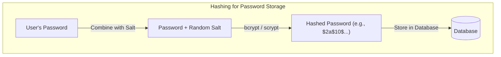
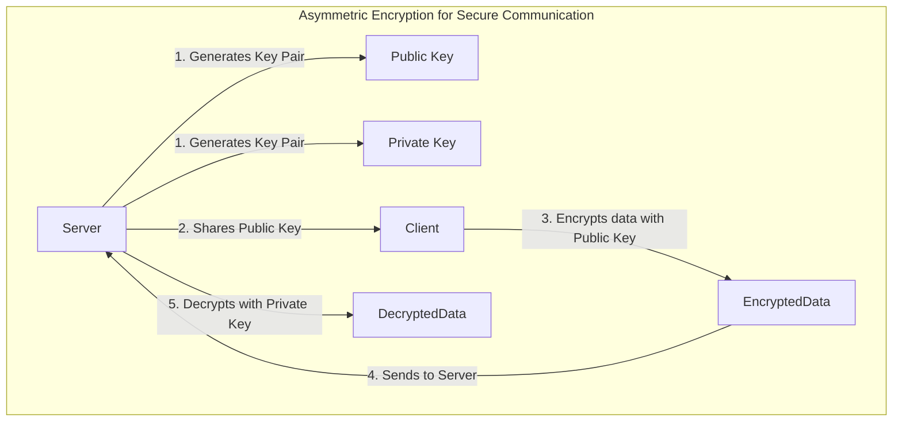

Cryptography is the science of securing communication and data. In system design, it's not just an abstract concept—it's a set of practical tools used to build secure, trustworthy systems. From protecting user passwords to ensuring data integrity and enabling secure communication, cryptographic primitives are fundamental building blocks.

This article provides a high-level overview of the three most important cryptographic concepts for system designers: **hashing**, **symmetric encryption**, and **asymmetric encryption**. We'll explore what they are, why they are different, and where to use them.

### 1. Hashing: The One-Way Street

Hashing is the process of transforming an input of any size into a fixed-size string of bytes, typically a "digest" or "hash." This process is **one-way**, meaning it's computationally infeasible to reverse the process and derive the original input from the hash.

**Key Properties of a Cryptographic Hash Function:**

1.  **Deterministic**: The same input will always produce the same output.
2.  **One-Way (Pre-image Resistance)**: Given a hash `H`, it's practically impossible to find the original input `M` such that `hash(M) = H`.
3.  **Collision Resistance**: It should be extremely difficult to find two different inputs `M1` and `M2` that produce the same hash.
4.  **Avalanche Effect**: A small change in the input (e.g., changing one bit) should result in a drastically different output hash.

**Common Algorithms**: SHA-256 (Secure Hash Algorithm 256-bit), SHA-3, bcrypt, scrypt.

**Primary Use Cases:**

*   **Password Storage**: This is the most common use case. When a user signs up, you don't store their password in the database. Instead, you store a hash of their password. When they log in, you hash the password they provide and compare it to the stored hash. This way, even if your database is breached, the attackers won't have the actual passwords.
    *   **Important Note**: For passwords, always use a **salted hash**. A salt is a random string added to the password before hashing. This ensures that even if two users have the same password, their stored hashes will be different, preventing rainbow table attacks. Functions like `bcrypt` and `scrypt` automatically handle salting.

*   **Data Integrity**: Hashing is used to verify that data has not been tampered with. For example, when you download a file, the provider often lists a checksum (hash) for it. You can run a hash function on the downloaded file and compare your result to the provided checksum. If they match, the file is intact.



### 2. Symmetric Encryption: The Shared Secret

Symmetric encryption uses a **single, shared secret key** to both encrypt and decrypt data. Both the sender and the receiver must have the same key. This method is very fast and is ideal for encrypting large amounts of data.

**How it works:**

1.  The sender and receiver agree on a secret key.
2.  The sender uses the key and an encryption algorithm to turn the plaintext data into ciphertext.
3.  The receiver uses the same key and the corresponding decryption algorithm to turn the ciphertext back into plaintext.

**Common Algorithms**: AES (Advanced Encryption Standard), ChaCha20.

**Primary Use Cases:**

*   **Encrypting Data at Rest**: Encrypting files on a hard drive, data in a database, or backups. The application or system holds the key to decrypt the data when needed.
*   **Bulk Data Encryption in Communication**: It's the workhorse behind protocols like TLS. Once a secure channel is established, symmetric encryption is used to encrypt the actual application data (e.g., the web page content, API calls) because it's much more performant than asymmetric encryption.

**The Challenge**: The biggest challenge with symmetric encryption is **key distribution**. How do you securely share the secret key between the sender and receiver in the first place? If you send it over an insecure channel, an attacker could intercept it. This is where asymmetric encryption comes in.

### 3. Asymmetric Encryption: The Public/Private Key Pair

Asymmetric encryption (also known as public-key cryptography) uses a **pair of keys**: a **public key** and a **private key**.

*   The **public key** can be shared with anyone. It's used for encryption.
*   The **private key** must be kept secret. It's used for decryption.

Anything encrypted with the public key can *only* be decrypted with the corresponding private key.

**How it works:**

1.  The receiver (e.g., a server) generates a public/private key pair. It keeps the private key secret and shares the public key with the sender (e.g., a client).
2.  The sender uses the server's public key to encrypt the data.
3.  The server uses its private key to decrypt the data.

**Common Algorithms**: RSA (Rivest-Shamir-Adleman), ECDSA (Elliptic Curve Digital Signature Algorithm).

**Primary Use Cases:**

*   **Secure Key Exchange**: This is its most important role. It solves the key distribution problem for symmetric encryption. In the TLS handshake, the client uses the server's public key to encrypt a temporary session key and send it to the server. The server then uses its private key to decrypt it. Now both have a shared secret and can switch to fast symmetric encryption.
*   **Digital Signatures**: Asymmetric encryption can also be used in reverse to prove identity. To "sign" a piece of data, you encrypt its hash with your **private key**. Anyone can then use your **public key** to decrypt the signature and verify that it matches the data's hash. This proves that the data came from you and hasn't been tampered with.



### Hashing vs. Encryption: What's the Difference?

| Feature | Hashing | Encryption |
| :--- | :--- | :--- |
| **Purpose** | Validate integrity (one-way) | Ensure confidentiality (two-way) |
| **Reversibility** | Not reversible | Reversible (with the correct key) |
| **Output Size** | Fixed size | Variable (usually larger than plaintext) |
| **Key** | No key | Requires a key (or key pair) |
| **Use Case** | Storing passwords, checksums | Securing data in transit or at rest |

### Go Example: Symmetric vs. Asymmetric Encryption

Here's a simplified Go example demonstrating the core difference between AES (symmetric) and RSA (asymmetric).

```go
package main

import (
	"crypto/aes"
	"crypto/cipher"
	"crypto/rand"
	"crypto/rsa"
	"crypto/sha256"
	"fmt"
	"io"
	"log"
)

func demonstrateSymmetric() {
	fmt.Println("--- Symmetric Encryption (AES) ---")
	plaintext := []byte("This is a secret message for AES.")

	// 1. Generate a 32-byte secret key (for AES-256)
	key := make([]byte, 32)
	if _, err := io.ReadFull(rand.Reader, key); err != nil {
		log.Fatal(err)
	}

	// 2. Encrypt the data
	block, _ := aes.NewCipher(key)
	gcm, _ := cipher.NewGCM(block)
	nonce := make([]byte, gcm.NonceSize())
	io.ReadFull(rand.Reader, nonce)
	
	ciphertext := gcm.Seal(nonce, nonce, plaintext, nil)
	fmt.Printf("Encrypted: %x\n", ciphertext)

	// 3. Decrypt the data (using the SAME key)
	nonce, ciphertext = ciphertext[:gcm.NonceSize()], ciphertext[gcm.NonceSize():]
	decrypted, err := gcm.Open(nil, nonce, ciphertext, nil)
	if err != nil {
		log.Fatal(err)
	}
	fmt.Printf("Decrypted: %s\n", decrypted)
}

func demonstrateAsymmetric() {
	fmt.Println("\n--- Asymmetric Encryption (RSA) ---")
	plaintext := []byte("This is a secret message for RSA.")

	// 1. Generate a public/private key pair
	privateKey, _ := rsa.GenerateKey(rand.Reader, 2048)
	publicKey := &privateKey.PublicKey

	// 2. Encrypt with the PUBLIC key
	ciphertext, _ := rsa.EncryptOAEP(sha256.New(), rand.Reader, publicKey, plaintext, nil)
	fmt.Printf("Encrypted: %x\n", ciphertext)

	// 3. Decrypt with the PRIVATE key
	decrypted, err := rsa.DecryptOAEP(sha256.New(), rand.Reader, privateKey, ciphertext, nil)
	if err != nil {
		log.Fatal(err)
	}
	fmt.Printf("Decrypted: %s\n", decrypted)
}

func main() {
	demonstrateSymmetric()
	demonstrateAsymmetric()
}
```

### Conclusion

Cryptography is a deep and complex field, but system designers can build robust systems by understanding these three core primitives. Use **hashing** for integrity checks and password storage. Use fast **symmetric encryption** for encrypting bulk data. And use slower **asymmetric encryption** to solve the key exchange problem and for digital signatures. By choosing the right tool for the job, you can effectively protect your data, your users, and your system's integrity.