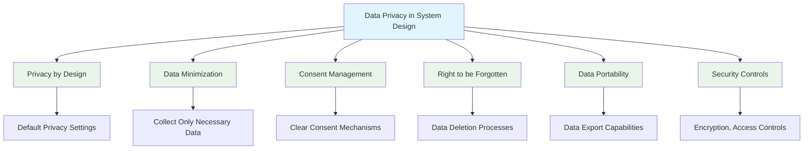

# System Design: Data Privacy & GDPR Compliance

Data privacy has become a critical concern in modern system design, with regulations like the General Data Protection Regulation (GDPR) setting strict requirements for how personal data is collected, processed, stored, and managed. GDPR compliance requires a comprehensive approach that encompasses technical implementations, organizational processes, and user experience considerations. Building privacy into your system from the ground up is essential for legal compliance and maintaining user trust.

## Understanding Data Privacy in System Design

Data privacy in system design involves creating systems that protect personal information throughout its lifecycle while enabling business operations. This requires implementing technical measures, access controls, and data handling procedures that meet regulatory requirements and user expectations.



### Key Privacy Principles

**Privacy by Design**: Privacy protection should be built into systems from the ground up, not added as an afterthought.

**Data Minimization**: Only collect and process the minimum amount of personal data necessary for the specified purpose.

**Purpose Limitation**: Personal data should only be collected for specified, explicit, and legitimate purposes.

**Data Accuracy**: Ensure personal data is accurate and kept up to date.

**Storage Limitation**: Personal data should not be kept longer than necessary for the specified purpose.

**Integrity and Confidentiality**: Personal data should be processed securely with appropriate technical and organizational measures.

## GDPR Requirements and Technical Implementation

### 1. Lawful Basis for Processing

GDPR requires a lawful basis for processing personal data. Common bases include consent, contract performance, legal obligation, vital interests, public task, and legitimate interests.

```go
// Legal basis management system
package main

import (
    "database/sql"
    "fmt"
    "time"

    _ "github.com/lib/pq" // PostgreSQL driver
)

type LegalBasis string

const (
    Consent         LegalBasis = "consent"
    Contract        LegalBasis = "contract"
    LegalObligation LegalBasis = "legal_obligation"
    VitalInterest   LegalBasis = "vital_interest"
    PublicTask      LegalBasis = "public_task"
    LegitimateInterest LegalBasis = "legitimate_interest"
)

type ConsentRecord struct {
    ID              int64
    UserID          string
    Purpose         string
    LegalBasis      LegalBasis
    GrantedAt       time.Time
    RevokedAt       *time.Time
    ConsentDetails  string
    Source          string // web, mobile, api, etc.
}

type ConsentManager struct {
    db *sql.DB
}

func NewConsentManager(db *sql.DB) *ConsentManager {
    return &ConsentManager{db: db}
}

// GrantConsent records consent for a specific purpose
func (cm *ConsentManager) GrantConsent(userID string, purpose string, legalBasis LegalBasis, details string, source string) error {
    query := `
        INSERT INTO user_consents (user_id, purpose, legal_basis, granted_at, consent_details, source)
        VALUES ($1, $2, $3, $4, $5, $6)
    `
    
    _, err := cm.db.Exec(query, userID, purpose, legalBasis, time.Now(), details, source)
    return err
}

// RevokeConsent revokes consent for a specific purpose
func (cm *ConsentManager) RevokeConsent(userID string, purpose string) error {
    query := `
        UPDATE user_consents 
        SET revoked_at = $3 
        WHERE user_id = $1 AND purpose = $2 AND revoked_at IS NULL
    `
    
    _, err := cm.db.Exec(query, userID, purpose, time.Now())
    return err
}

// HasValidConsent checks if user has valid consent for a purpose
func (cm *ConsentManager) HasValidConsent(userID string, purpose string) (bool, error) {
    query := `
        SELECT COUNT(*) 
        FROM user_consents 
        WHERE user_id = $1 AND purpose = $2 AND granted_at IS NOT NULL AND revoked_at IS NULL
    `
    
    var count int
    err := cm.db.QueryRow(query, userID, purpose).Scan(&count)
    if err != nil {
        return false, err
    }
    
    return count > 0, nil
}

// GetUserConsents returns all consents for a user
func (cm *ConsentManager) GetUserConsents(userID string) ([]ConsentRecord, error) {
    query := `
        SELECT id, user_id, purpose, legal_basis, granted_at, revoked_at, consent_details, source
        FROM user_consents 
        WHERE user_id = $1
        ORDER BY granted_at DESC
    `
    
    rows, err := cm.db.Query(query, userID)
    if err != nil {
        return nil, err
    }
    defer rows.Close()
    
    var consents []ConsentRecord
    for rows.Next() {
        var consent ConsentRecord
        var revokedAt *time.Time
        
        err := rows.Scan(
            &consent.ID,
            &consent.UserID,
            &consent.Purpose,
            &consent.LegalBasis,
            &consent.GrantedAt,
            &revokedAt,
            &consent.ConsentDetails,
            &consent.Source,
        )
        if err != nil {
            return nil, err
        }
        
        consent.RevokedAt = revokedAt
        consents = append(consents, consent)
    }
    
    return consents, nil
}

// Example usage
func main() {
    // In a real scenario, we would connect to a real database
    // For this example, we'll just show the structure
    
    fmt.Println("Consent management system initialized")
    fmt.Println("Available legal bases:", Consent, Contract, LegalObligation, VitalInterest, PublicTask, LegitimateInterest)
}
```

### 2. Data Subject Rights Implementation

GDPR grants individuals several rights regarding their personal data. Systems must be designed to support these rights effectively.

```go
// Data subject rights management
package main

import (
    "encoding/json"
    "fmt"
    "time"
)

type DataSubjectRight string

const (
    RightToAccess DataSubjectRight = "access"
    RightToRectification DataSubjectRight = "rectification"
    RightToErasure DataSubjectRight = "erasure"
    RightToDataPortability DataSubjectRight = "portability"
    RightToRestriction DataSubjectRight = "restriction"
    RightToObjection DataSubjectRight = "objection"
)

type RightRequest struct {
    RequestID     string
    UserID        string
    RightType     DataSubjectRight
    Status        string // pending, in_progress, completed, rejected
    RequestedAt   time.Time
    CompletedAt   *time.Time
    Details       map[string]interface{}
    ProcessedBy   string
}

type DataPortabilityData struct {
    UserData map[string]interface{} `json:"user_data"`
    ConsentHistory []ConsentRecord `json:"consent_history"`
    ActivityLog []ActivityRecord `json:"activity_log"`
}

type ActivityRecord struct {
    ID        int64     `json:"id"`
    Timestamp time.Time `json:"timestamp"`
    Action    string    `json:"action"`
    Details   string    `json:"details"`
}

type RightsManager struct {
    // In a real system, this would connect to various data stores
    requestQueue []RightRequest
}

func NewRightsManager() *RightsManager {
    return &RightsManager{
        requestQueue: make([]RightRequest, 0),
    }
}

// RequestRight creates a request for a data subject right
func (rm *RightsManager) RequestRight(userID string, rightType DataSubjectRight, details map[string]interface{}) (string, error) {
    request := RightRequest{
        RequestID:   fmt.Sprintf("req_%d", time.Now().UnixNano()),
        UserID:      userID,
        RightType:   rightType,
        Status:      "pending",
        RequestedAt: time.Now(),
        Details:     details,
    }
    
    rm.requestQueue = append(rm.requestQueue, request)
    
    // In a real system, this would notify the data protection officer
    // and create an entry in a tracking system
    
    return request.RequestID, nil
}

// ProcessRight processes a data subject right request
func (rm *RightsManager) ProcessRight(requestID string) error {
    for i, req := range rm.requestQueue {
        if req.RequestID == requestID {
            rm.requestQueue[i].Status = "in_progress"
            
            // Process based on right type
            switch req.RightType {
            case RightToAccess:
                // Gather all personal data for the user
                if err := rm.processAccessRequest(req.UserID); err != nil {
                    rm.requestQueue[i].Status = "rejected"
                    return err
                }
            case RightToErasure:
                // Delete all personal data for the user
                if err := rm.processErasureRequest(req.UserID); err != nil {
                    rm.requestQueue[i].Status = "rejected"
                    return err
                }
            case RightToDataPortability:
                // Prepare user data for export
                if err := rm.processDataPortabilityRequest(req.UserID); err != nil {
                    rm.requestQueue[i].Status = "rejected"
                    return err
                }
            // Additional cases for other rights
            }
            
            rm.requestQueue[i].Status = "completed"
            completedAt := time.Now()
            rm.requestQueue[i].CompletedAt = &completedAt
            
            return nil
        }
    }
    
    return fmt.Errorf("request not found: %s", requestID)
}

// processAccessRequest gathers all personal data for a user
func (rm *RightsManager) processAccessRequest(userID string) error {
    fmt.Printf("Processing access request for user %s\n", userID)
    
    // In a real system, this would query multiple data stores:
    // - User profiles
    // - Activity logs
    // - Preferences
    // - Consent records
    // - Third-party integrations
    
    // For this example, we'll just simulate
    fmt.Printf("Gathered personal data for user %s\n", userID)
    return nil
}

// processErasureRequest deletes all personal data for a user
func (rm *RightsManager) processErasureRequest(userID string) error {
    fmt.Printf("Processing erasure request for user %s\n", userID)
    
    // In a real system, this would:
    // 1. Mark user as deleted (soft delete)
    // 2. Anonymize or delete data according to retention policies
    // 3. Notify third-party services
    // 4. Update audit logs
    
    // For this example, we'll just simulate
    fmt.Printf("Marked all data for user %s for deletion\n", userID)
    return nil
}

// processDataPortabilityRequest prepares user data for export
func (rm *RightsManager) processDataPortabilityRequest(userID string) error {
    fmt.Printf("Processing data portability request for user %s\n", userID)
    
    // Create data export
    export := DataPortabilityData{
        UserData: map[string]interface{}{
            "id":    userID,
            "email": "user@example.com",
            "name":  "John Doe",
            "preferences": map[string]interface{}{
                "theme": "dark",
                "notifications": true,
            },
        },
        ConsentHistory: []ConsentRecord{
            {
                ID:         1,
                UserID:     userID,
                Purpose:    "marketing",
                LegalBasis: Consent,
                GrantedAt:  time.Now().AddDate(0, -1, 0),
            },
        },
        ActivityLog: []ActivityRecord{
            {
                ID:        1,
                Timestamp: time.Now().Add(-24 * time.Hour),
                Action:    "login",
                Details:   "User logged in from IP 192.168.1.1",
            },
        },
    }
    
    // Serialize and provide to user
    jsonData, err := json.MarshalIndent(export, "", "  ")
    if err != nil {
        return err
    }
    
    fmt.Printf("Prepared data export for user %s:\n%s\n", userID, string(jsonData))
    return nil
}

// GetRequestStatus returns the status of a specific request
func (rm *RightsManager) GetRequestStatus(requestID string) (*RightRequest, error) {
    for _, req := range rm.requestQueue {
        if req.RequestID == requestID {
            return &req, nil
        }
    }
    return nil, fmt.Errorf("request not found: %s", requestID)
}

// Example usage
func main() {
    manager := NewRightsManager()
    
    // User requests their data
    requestID, err := manager.RequestRight("user123", RightToAccess, map[string]interface{}{
        "reason": "user request",
    })
    if err != nil {
        fmt.Printf("Error creating request: %v\n", err)
        return
    }
    
    fmt.Printf("Created request: %s\n", requestID)
    
    // Process the request
    err = manager.ProcessRight(requestID)
    if err != nil {
        fmt.Printf("Error processing request: %v\n", err)
        return
    }
    
    // Check request status
    status, err := manager.GetRequestStatus(requestID)
    if err != nil {
        fmt.Printf("Error getting status: %v\n", err)
        return
    }
    
    fmt.Printf("Request status: %s, completed at: %v\n", status.Status, status.CompletedAt)
}
```

## Privacy-Enhancing Technologies

### 1. Data Encryption

Implementing strong encryption for data at rest and in transit is crucial for GDPR compliance.

```go
// Data encryption implementation
package main

import (
    "crypto/aes"
    "crypto/cipher"
    "crypto/rand"
    "database/sql"
    "encoding/base64"
    "fmt"
    "io"

    _ "github.com/lib/pq" // PostgreSQL driver
)

type EncryptionService struct {
    // In production, keys should be managed securely (e.g., with a KMS)
    key []byte
}

func NewEncryptionService(key []byte) *EncryptionService {
    if len(key) != 32 { // AES-256 requires 32-byte key
        panic("Encryption key must be 32 bytes")
    }
    return &EncryptionService{key: key}
}

// Encrypt encrypts data using AES-GCM
func (es *EncryptionService) Encrypt(plaintext []byte) ([]byte, error) {
    block, err := aes.NewCipher(es.key)
    if err != nil {
        return nil, err
    }

    gcm, err := cipher.NewGCM(block)
    if err != nil {
        return nil, err
    }

    nonce := make([]byte, gcm.NonceSize())
    if _, err = io.ReadFull(rand.Reader, nonce); err != nil {
        return nil, err
    }

    ciphertext := gcm.Seal(nonce, nonce, plaintext, nil)
    return ciphertext, nil
}

// Decrypt decrypts data using AES-GCM
func (es *EncryptionService) Decrypt(ciphertext []byte) ([]byte, error) {
    block, err := aes.NewCipher(es.key)
    if err != nil {
        return nil, err
    }

    gcm, err := cipher.NewGCM(block)
    if err != nil {
        return nil, err
    }

    nonceSize := gcm.NonceSize()
    if len(ciphertext) < nonceSize {
        return nil, fmt.Errorf("ciphertext too short")
    }

    nonce, ciphertext := ciphertext[:nonceSize], ciphertext[nonceSize:]
    plaintext, err := gcm.Open(nil, nonce, ciphertext, nil)
    if err != nil {
        return nil, err
    }

    return plaintext, nil
}

// FieldLevelEncryption handles encryption at the database field level
type FieldLevelEncryption struct {
    encryptionService *EncryptionService
}

func NewFieldLevelEncryption(key []byte) *FieldLevelEncryption {
    return &FieldLevelEncryption{
        encryptionService: NewEncryptionService(key),
    }
}

// EncryptField encrypts a specific field value
func (fle *FieldLevelEncryption) EncryptField(fieldValue string) (string, error) {
    encrypted, err := fle.encryptionService.Encrypt([]byte(fieldValue))
    if err != nil {
        return "", err
    }
    
    // Encode to base64 for storage
    return base64.StdEncoding.EncodeToString(encrypted), nil
}

// DecryptField decrypts a specific field value
func (fle *FieldLevelEncryption) DecryptField(encryptedValue string) (string, error) {
    // Decode from base64
    encrypted, err := base64.StdEncoding.DecodeString(encryptedValue)
    if err != nil {
        return "", err
    }
    
    decrypted, err := fle.encryptionService.Decrypt(encrypted)
    if err != nil {
        return "", err
    }
    
    return string(decrypted), nil
}

// Example: User data with encrypted fields
type EncryptedUser struct {
    ID           string `json:"id"`
    EncryptedEmail string `json:"encrypted_email"`
    EncryptedPhone string `json:"encrypted_phone"`
    EncryptedSSN string `json:"encrypted_ssn"`
    CreatedAt    string `json:"created_at"`
}

// UserRepository handles user data with encryption
type UserRepository struct {
    db      *sql.DB
    encrypt *FieldLevelEncryption
}

func NewUserRepository(db *sql.DB, encryptionKey []byte) *UserRepository {
    return &UserRepository{
        db:      db,
        encrypt: NewFieldLevelEncryption(encryptionKey),
    }
}

// SaveUser saves a user with encrypted sensitive fields
func (ur *UserRepository) SaveUser(user EncryptedUser) error {
    encryptedEmail, err := ur.encrypt.EncryptField(user.EncryptedEmail)
    if err != nil {
        return err
    }
    
    encryptedPhone, err := ur.encrypt.EncryptField(user.EncryptedPhone)
    if err != nil {
        return err
    }
    
    encryptedSSN, err := ur.encrypt.EncryptField(user.EncryptedSSN)
    if err != nil {
        return err
    }
    
    query := `
        INSERT INTO users (id, encrypted_email, encrypted_phone, encrypted_ssn, created_at)
        VALUES ($1, $2, $3, $4, $5)
    `
    
    _, err = ur.db.Exec(query, user.ID, encryptedEmail, encryptedPhone, encryptedSSN, user.CreatedAt)
    return err
}

// GetUser retrieves a user and decrypts sensitive fields
func (ur *UserRepository) GetUser(userID string) (*EncryptedUser, error) {
    query := `
        SELECT id, encrypted_email, encrypted_phone, encrypted_ssn, created_at
        FROM users WHERE id = $1
    `
    
    var encryptedEmail, encryptedPhone, encryptedSSN, createdAt string
    err := ur.db.QueryRow(query, userID).Scan(
        &userID, &encryptedEmail, &encryptedPhone, &encryptedSSN, &createdAt,
    )
    if err != nil {
        return nil, err
    }
    
    // Decrypt sensitive fields
    email, err := ur.encrypt.DecryptField(encryptedEmail)
    if err != nil {
        return nil, err
    }
    
    phone, err := ur.encrypt.DecryptField(encryptedPhone)
    if err != nil {
        return nil, err
    }
    
    ssn, err := ur.encrypt.DecryptField(encryptedSSN)
    if err != nil {
        return nil, err
    }
    
    return &EncryptedUser{
        ID:           userID,
        EncryptedEmail: email,
        EncryptedPhone: phone,
        EncryptedSSN: ssn,
        CreatedAt:    createdAt,
    }, nil
}

// Example usage
func main() {
    // Generate a 32-byte key (in production, use a proper KMS)
    key := make([]byte, 32) // Use proper key generation in real systems
    copy(key, "this-is-a-32-byte-key-for-demo-purposes")
    
    encService := NewEncryptionService(key)
    
    // Test encryption/decryption
    testMessage := "sensitive user data"
    encrypted, err := encService.Encrypt([]byte(testMessage))
    if err != nil {
        fmt.Printf("Encryption error: %v\n", err)
        return
    }
    
    decrypted, err := encService.Decrypt(encrypted)
    if err != nil {
        fmt.Printf("Decryption error: %v\n", err)
        return
    }
    
    fmt.Printf("Original: %s\n", testMessage)
    fmt.Printf("Decrypted: %s\n", string(decrypted))
    fmt.Printf("Match: %t\n", testMessage == string(decrypted))
}
```

### 2. Pseudonymization and Anonymization

Implement techniques to reduce the identifiability of personal data while preserving its utility for analysis.

```go
// Pseudonymization and anonymization service
package main

import (
    "crypto/sha256"
    "fmt"
    "math/rand"
    "strconv"
    "time"
)

type PrivacyProtectionService struct {
    salt string
}

func NewPrivacyProtectionService(salt string) *PrivacyProtectionService {
    return &PrivacyProtectionService{salt: salt}
}

// Pseudonymize creates a pseudonymous identifier that can be reversed with the original key
func (pps *PrivacyProtectionService) Pseudonymize(identifier string) string {
    hash := sha256.Sum256([]byte(pps.salt + identifier))
    return fmt.Sprintf("%x", hash[:8]) // Use first 8 bytes as hex string
}

// Anonymize replaces direct identifiers with non-identifiable data
func (pps *PrivacyProtectionService) Anonymize(userData map[string]interface{}) map[string]interface{} {
    anonymized := make(map[string]interface{})
    
    for key, value := range userData {
        switch {
        case isDirectIdentifier(key):
            // Replace with anonymized version or remove
            if key == "email" || key == "phone" {
                anonymized[key] = pps.Pseudonymize(fmt.Sprintf("%v", value))
            } else if key == "name" {
                anonymized[key] = pps.generateRandomName()
            } else if key == "ssn" {
                anonymized[key] = "ANONYMIZED"
            } else {
                anonymized[key] = pps.Pseudonymize(fmt.Sprintf("%v", value))
            }
        case isQuasiIdentifier(key):
            // Generalize or remove quasi-identifiers
            anonymized[key] = pps.generalizeQuasiIdentifier(key, value)
        default:
            // Keep other fields as-is if they're not identifiers
            anonymized[key] = value
        }
    }
    
    return anonymized
}

// isDirectIdentifier checks if a field name is a direct identifier
func isDirectIdentifier(fieldName string) bool {
    directIdentifiers := map[string]bool{
        "name": true, "email": true, "phone": true, "address": true,
        "ssn": true, "id": true, "username": true, "ip_address": true,
    }
    return directIdentifiers[fieldName]
}

// isQuasiIdentifier checks if a field name is a quasi-identifier
func isQuasiIdentifier(fieldName string) bool {
    quasiIdentifiers := map[string]bool{
        "age": true, "zip_code": true, "city": true, "gender": true,
        "date": true, "dob": true, "occupation": true, "income": true,
    }
    return quasiIdentifiers[fieldName]
}

// generalizeQuasiIdentifier provides generalized versions of quasi-identifiers
func (pps *PrivacyProtectionService) generalizeQuasiIdentifier(fieldName string, value interface{}) interface{} {
    switch fieldName {
    case "age":
        age, ok := value.(int)
        if !ok {
            return "ANONYMIZED"
        }
        // Generalize to age range
        return fmt.Sprintf("%d-%d", (age/10)*10, ((age/10)+1)*10)
    case "zip_code":
        zip, ok := value.(string)
        if !ok {
            return "ANONYMIZED"
        }
        // Generalize zip code (first 3 digits)
        if len(zip) >= 3 {
            return zip[:3] + "XXX"
        }
        return "ANONYMIZED"
    case "date", "dob":
        dateStr, ok := value.(string)
        if !ok {
            return "ANONYMIZED"
        }
        // Generalize to year only
        if len(dateStr) >= 4 {
            return dateStr[:4] + "-XX-XX"
        }
        return "ANONYMIZED"
    default:
        return "ANONYMIZED"
    }
}

// generateRandomName creates a random name for anonymization
func (pps *PrivacyProtectionService) generateRandomName() string {
    firstNames := []string{"Alice", "Bob", "Charlie", "Diana", "Eve", "Frank", "Grace", "Henry"}
    lastNames := []string{"Smith", "Johnson", "Williams", "Brown", "Jones", "Garcia", "Miller", "Davis"}
    
    firstName := firstNames[rand.Intn(len(firstNames))]
    lastName := lastNames[rand.Intn(len(lastNames))]
    
    return fmt.Sprintf("%s %s", firstName, lastName)
}

// DataMinimization removes unnecessary personal data
func (pps *PrivacyProtectionService) DataMinimization(userData map[string]interface{}, requiredFields []string) map[string]interface{} {
    minimized := make(map[string]interface{})
    
    // Create a set of required fields for quick lookup
    requiredSet := make(map[string]bool)
    for _, field := range requiredFields {
        requiredSet[field] = true
    }
    
    // Keep only required fields
    for field, value := range userData {
        if requiredSet[field] {
            minimized[field] = value
        }
    }
    
    return minimized
}

// Example usage
func main() {
    rand.Seed(time.Now().UnixNano())
    
    pps := NewPrivacyProtectionService("my-salt-key")
    
    // Original user data
    originalData := map[string]interface{}{
        "id":               "user123",
        "name":             "John Doe",
        "email":            "john@example.com",
        "phone":            "+1-555-123-4567",
        "age":              32,
        "zip_code":         "12345",
        "city":             "New York",
        "occupation":       "Engineer",
        "salary":           75000,
        "preferences":      map[string]interface{}{"theme": "dark", "notifications": true},
        "login_count":      15,
        "last_login":       "2023-10-15T10:30:00Z",
    }
    
    fmt.Println("Original Data:")
    printData(originalData)
    
    // Anonymize the data
    anonymizedData := pps.Anonymize(originalData)
    fmt.Println("\nAnonymized Data:")
    printData(anonymizedData)
    
    // Apply data minimization
    requiredFields := []string{"age_group", "city", "occupation", "login_count", "last_login"}
    minimizedData := pps.DataMinimization(anonymizedData, requiredFields)
    fmt.Println("\nMinimized Data:")
    printData(minimizedData)
    
    // Demonstrate pseudonymization
    originalID := "user123"
    pseudonymizedID := pps.Pseudonymize(originalID)
    fmt.Printf("\nPseudonymization example:\n  Original ID: %s\n  Pseudonym: %s\n", originalID, pseudonymizedID)
}

func printData(data map[string]interface{}) {
    for key, value := range data {
        fmt.Printf("  %s: %v\n", key, value)
    }
}
```

## Privacy by Design Implementation

### 1. Default Privacy Settings

Ensure that privacy-protective settings are enabled by default.

```go
// Default privacy settings implementation
package main

import (
    "encoding/json"
    "fmt"
    "time"
)

type PrivacySettings struct {
    // Data sharing preferences
    ShareDataForAnalytics   bool `json:"share_data_for_analytics"`
    ShareDataForMarketing   bool `json:"share_data_for_marketing"`
    ShareDataForResearch    bool `json:"share_data_for_research"`
    
    // Location data
    LocationTrackingEnabled bool `json:"location_tracking_enabled"`
    LocationPrecision       string `json:"location_precision"` // "full", "city", "region", "none"
    
    // Personalization
    PersonalizedAdsEnabled  bool `json:"personalized_ads_enabled"`
    PersonalizedContent     bool `json:"personalized_content"`
    
    // Data retention
    DataRetentionPeriod     int `json:"data_retention_period"` // days
    
    // Third-party sharing
    ShareWithThirdParties   bool `json:"share_with_third_parties"`
    
    // Data portability
    AllowDataExport         bool `json:"allow_data_export"`
    AllowDataDeletion       bool `json:"allow_data_deletion"`
    
    // Updates and notifications
    PrivacyPolicyUpdates    bool `json:"privacy_policy_updates"`
    SecurityAlerts          bool `json:"security_alerts"`
    
    // Timestamps
    CreatedAt               time.Time `json:"created_at"`
    UpdatedAt               time.Time `json:"updated_at"`
}

type PrivacySettingsManager struct {
    defaultSettings PrivacySettings
}

func NewPrivacySettingsManager() *PrivacySettingsManager {
    return &PrivacySettingsManager{
        defaultSettings: PrivacySettings{
            ShareDataForAnalytics:   false, // Default: no analytics sharing
            ShareDataForMarketing:   false, // Default: no marketing sharing
            ShareDataForResearch:    false, // Default: no research sharing
            LocationTrackingEnabled: false, // Default: no location tracking
            LocationPrecision:       "none", // Default: no location data
            PersonalizedAdsEnabled:  false, // Default: no personalized ads
            PersonalizedContent:     false, // Default: no personalization
            DataRetentionPeriod:     365,   // Default: 1 year
            ShareWithThirdParties:   false, // Default: no third-party sharing
            AllowDataExport:         true,  // Default: allow data export
            AllowDataDeletion:       true,  // Default: allow data deletion
            PrivacyPolicyUpdates:    true,  // Default: notify about updates
            SecurityAlerts:          true,  // Default: send security alerts
            CreatedAt:               time.Now(),
            UpdatedAt:               time.Now(),
        },
    }
}

// GetUserPrivacySettings returns user privacy settings, creating default if none exist
func (psm *PrivacySettingsManager) GetUserPrivacySettings(userID string, existingSettings *PrivacySettings) PrivacySettings {
    if existingSettings == nil {
        // Return default settings
        settings := psm.defaultSettings
        settings.CreatedAt = time.Now()
        settings.UpdatedAt = time.Now()
        return settings
    }
    
    // Apply defaults to any missing settings
    result := *existingSettings
    
    if result.DataRetentionPeriod == 0 {
        result.DataRetentionPeriod = psm.defaultSettings.DataRetentionPeriod
    }
    
    // Merge with defaults where not specified
    if !existingSettings.ShareDataForAnalytics {
        result.ShareDataForAnalytics = psm.defaultSettings.ShareDataForAnalytics
    }
    if !existingSettings.ShareDataForMarketing {
        result.ShareDataForMarketing = psm.defaultSettings.ShareDataForMarketing
    }
    
    // Only update UpdatedAt if there were changes
    result.UpdatedAt = time.Now()
    
    return result
}

// ValidateSettings validates privacy settings according to regulatory requirements
func (psm *PrivacySettingsManager) ValidateSettings(settings PrivacySettings) []string {
    var errors []string
    
    // Validate location precision
    validPrecision := map[string]bool{
        "none": true, "city": true, "region": true, "full": true,
    }
    if !validPrecision[settings.LocationPrecision] {
        errors = append(errors, "invalid location precision")
    }
    
    // Validate retention period
    if settings.DataRetentionPeriod < 1 || settings.DataRetentionPeriod > 7300 { // 20 years max
        errors = append(errors, "data retention period must be between 1 and 7300 days")
    }
    
    // Ensure data deletion is allowed if data is shared
    if settings.ShareDataForAnalytics || settings.ShareDataForMarketing || settings.ShareWithThirdParties {
        if !settings.AllowDataDeletion {
            errors = append(errors, "data deletion must be allowed when data sharing is enabled")
        }
    }
    
    return errors
}

// SerializeSettings converts settings to JSON for storage
func (psm *PrivacySettingsManager) SerializeSettings(settings PrivacySettings) (string, error) {
    data, err := json.Marshal(settings)
    if err != nil {
        return "", err
    }
    return string(data), nil
}

// DeserializeSettings converts JSON back to settings
func (psm *PrivacySettingsManager) DeserializeSettings(jsonStr string) (*PrivacySettings, error) {
    var settings PrivacySettings
    err := json.Unmarshal([]byte(jsonStr), &settings)
    if err != nil {
        return nil, err
    }
    return &settings, nil
}

// Example usage
func main() {
    manager := NewPrivacySettingsManager()
    
    // Get default privacy settings for a new user
    defaultSettings := manager.GetUserPrivacySettings("user123", nil)
    
    fmt.Println("Default Privacy Settings (Privacy by Design):")
    settingsJSON, _ := json.MarshalIndent(defaultSettings, "", "  ")
    fmt.Println(string(settingsJSON))
    
    // Validate settings
    errors := manager.ValidateSettings(defaultSettings)
    if len(errors) > 0 {
        fmt.Println("Validation errors:", errors)
    } else {
        fmt.Println("Settings are valid")
    }
    
    // Example of a user modifying settings
    userSettings := defaultSettings
    userSettings.ShareDataForAnalytics = true
    userSettings.LocationTrackingEnabled = true
    userSettings.LocationPrecision = "city" // Less precise than full GPS
    userSettings.UpdatedAt = time.Now()
    
    fmt.Println("\nUser-modified Settings:")
    userSettingsJSON, _ := json.MarshalIndent(userSettings, "", "  ")
    fmt.Println(string(userSettingsJSON))
    
    // Validate user settings
    userErrors := manager.ValidateSettings(userSettings)
    if len(userErrors) > 0 {
        fmt.Println("User settings validation errors:", userErrors)
    } else {
        fmt.Println("User settings are valid")
    }
}
```

### 2. Consent Management System

Implement a comprehensive consent management system that tracks and manages user consent preferences.

```go
// Advanced consent management system
package main

import (
    "database/sql"
    "fmt"
    "time"

    _ "github.com/lib/pq" // PostgreSQL driver
)

type ConsentPurpose string

const (
    PurposeAnalytics    ConsentPurpose = "analytics"
    PurposeMarketing    ConsentPurpose = "marketing"
    PurposePersonalization ConsentPurpose = "personalization"
    PurposeLocation     ConsentPurpose = "location"
    PurposeProfiling    ConsentPurpose = "profiling"
)

type ConsentStatus string

const (
    StatusGranted  ConsentStatus = "granted"
    StatusRevoked  ConsentStatus = "revoked"
    StatusExpired  ConsentStatus = "expired"
    StatusPending  ConsentStatus = "pending"
)

type ConsentRecord struct {
    ID            int64
    UserID        string
    Purpose       ConsentPurpose
    Status        ConsentStatus
    GrantedAt     *time.Time
    RevokedAt     *time.Time
    ExpirationAt  *time.Time
    ConsentDetails string
    Source        string // web, mobile, api, etc.
    Version       string // privacy policy version
}

type ConsentManagerAdvanced struct {
    db *sql.DB
    defaultConsentExpiry time.Duration
}

func NewConsentManagerAdvanced(db *sql.DB, defaultExpiry time.Duration) *ConsentManagerAdvanced {
    return &ConsentManagerAdvanced{
        db: db,
        defaultConsentExpiry: defaultExpiry,
    }
}

// GrantConsent grants consent for a specific purpose
func (cm *ConsentManagerAdvanced) GrantConsent(userID string, purpose ConsentPurpose, details string, source string, version string) error {
    now := time.Now()
    expiration := now.Add(cm.defaultConsentExpiry)
    
    query := `
        INSERT INTO user_consents (user_id, purpose, status, granted_at, revoked_at, expiration_at, consent_details, source, policy_version)
        VALUES ($1, $2, $3, $4, NULL, $5, $6, $7, $8)
        ON CONFLICT (user_id, purpose) 
        WHERE status != 'revoked'
        DO UPDATE SET 
            status = 'granted',
            granted_at = $4,
            revoked_at = NULL,
            expiration_at = $5,
            consent_details = $6,
            source = $7,
            policy_version = $8,
            updated_at = NOW()
    `
    
    _, err := cm.db.Exec(query, userID, purpose, StatusGranted, now, expiration, details, source, version)
    return err
}

// RevokeConsent revokes consent for a specific purpose
func (cm *ConsentManagerAdvanced) RevokeConsent(userID string, purpose ConsentPurpose) error {
    query := `
        UPDATE user_consents 
        SET status = 'revoked', revoked_at = $3 
        WHERE user_id = $1 AND purpose = $2 AND status = 'granted'
    `
    
    _, err := cm.db.Exec(query, userID, purpose, time.Now())
    return err
}

// GetUserConsent returns consent status for a user and purpose
func (cm *ConsentManagerAdvanced) GetUserConsent(userID string, purpose ConsentPurpose) (*ConsentRecord, error) {
    query := `
        SELECT id, user_id, purpose, status, granted_at, revoked_at, expiration_at, consent_details, source, policy_version
        FROM user_consents 
        WHERE user_id = $1 AND purpose = $2
        ORDER BY granted_at DESC
        LIMIT 1
    `
    
    var consent ConsentRecord
    var grantedAt, revokedAt, expirationAt *time.Time
    
    err := cm.db.QueryRow(query, userID, purpose).Scan(
        &consent.ID,
        &consent.UserID,
        &consent.Purpose,
        &consent.Status,
        &grantedAt,
        &revokedAt,
        &expirationAt,
        &consent.ConsentDetails,
        &consent.Source,
        &consent.Version,
    )
    if err != nil {
        if err == sql.ErrNoRows {
            return nil, nil // No consent record found
        }
        return nil, err
    }
    
    consent.GrantedAt = grantedAt
    consent.RevokedAt = revokedAt
    consent.ExpirationAt = expirationAt
    
    return &consent, nil
}

// IsConsentValid checks if consent is currently valid (granted and not expired)
func (cm *ConsentManagerAdvanced) IsConsentValid(userID string, purpose ConsentPurpose) (bool, error) {
    consent, err := cm.GetUserConsent(userID, purpose)
    if err != nil {
        return false, err
    }
    
    if consent == nil {
        return false, nil // No consent record
    }
    
    if consent.Status != StatusGranted {
        return false, nil // Not granted
    }
    
    if consent.ExpirationAt != nil && time.Now().After(*consent.ExpirationAt) {
        return false, nil // Expired
    }
    
    return true, nil
}

// GetUserConsents returns all consents for a user
func (cm *ConsentManagerAdvanced) GetUserConsents(userID string) ([]ConsentRecord, error) {
    query := `
        SELECT id, user_id, purpose, status, granted_at, revoked_at, expiration_at, consent_details, source, policy_version
        FROM user_consents 
        WHERE user_id = $1
        ORDER BY granted_at DESC
    `
    
    rows, err := cm.db.Query(query, userID)
    if err != nil {
        return nil, err
    }
    defer rows.Close()
    
    var consents []ConsentRecord
    for rows.Next() {
        var consent ConsentRecord
        var grantedAt, revokedAt, expirationAt *time.Time
        
        err := rows.Scan(
            &consent.ID,
            &consent.UserID,
            &consent.Purpose,
            &consent.Status,
            &grantedAt,
            &revokedAt,
            &expirationAt,
            &consent.ConsentDetails,
            &consent.Source,
            &consent.Version,
        )
        if err != nil {
            return nil, err
        }
        
        consent.GrantedAt = grantedAt
        consent.RevokedAt = revokedAt
        consent.ExpirationAt = expirationAt
        consents = append(consents, consent)
    }
    
    return consents, nil
}

// CleanupExpiredConsents removes or marks expired consents
func (cm *ConsentManagerAdvanced) CleanupExpiredConsents() error {
    query := `
        UPDATE user_consents 
        SET status = 'expired' 
        WHERE status = 'granted' AND expiration_at < $1 AND revoked_at IS NULL
    `
    
    _, err := cm.db.Exec(query, time.Now())
    return err
}

// Example usage
func main() {
    // In a real scenario, we would connect to a real database
    fmt.Println("Advanced Consent Management System initialized")
    
    // Example of consent flow
    fmt.Println("\nConsent Management Example:")
    
    // Simulate granting consent
    fmt.Println("1. User grants consent for analytics")
    fmt.Println("2. System records consent with default expiration")
    fmt.Println("3. System checks consent validity before processing data")
    fmt.Println("4. System provides UI for users to manage their consent preferences")
    
    // Example consent records
    consents := []ConsentRecord{
        {
            UserID: "user123",
            Purpose: PurposeAnalytics,
            Status: StatusGranted,
            GrantedAt: &time.Time{}, // Would be actual time
            ExpirationAt: &time.Time{}, // Would be actual time
        },
        {
            UserID: "user123",
            Purpose: PurposeMarketing,
            Status: StatusRevoked,
            GrantedAt: &time.Time{}, // Would be actual time
            RevokedAt: &time.Time{}, // Would be actual time
        },
    }
    
    fmt.Printf("\nExample consent records: %+v\n", consents)
}
```

## Data Retention and Deletion

Implement proper data retention policies and the right to erasure mechanisms.

```go
// Data retention and deletion manager
package main

import (
    "fmt"
    "time"
)

type DataRetentionPolicy struct {
    Category         string        // user_data, logs, analytics, etc.
    RetentionPeriod  time.Duration // How long to keep the data
    AutomaticDeletion bool        // Whether to delete automatically after period
    AnonymizationThreshold time.Duration // When to anonymize instead of delete
}

type DataDeletionManager struct {
    policies map[string]DataRetentionPolicy
}

func NewDataDeletionManager() *DataDeletionManager {
    return &DataDeletionManager{
        policies: map[string]DataRetentionPolicy{
            "user_profile": {Category: "user_data", RetentionPeriod: 7 * 24 * time.Hour, AutomaticDeletion: true},
            "activity_logs": {Category: "logs", RetentionPeriod: 30 * 24 * time.Hour, AutomaticDeletion: true},
            "analytics": {Category: "analytics", RetentionPeriod: 365 * 24 * time.Hour, 
                         AnonymizationThreshold: 90 * 24 * time.Hour, AutomaticDeletion: false},
            "session_data": {Category: "tmp_data", RetentionPeriod: 24 * time.Hour, AutomaticDeletion: true},
        },
    }
}

// ScheduleDataDeletion schedules data for deletion based on retention policy
func (ddm *DataDeletionManager) ScheduleDataDeletion(userID string, dataCategory string, createdAt time.Time) *ScheduledDeletion {
    policy, exists := ddm.policies[dataCategory]
    if !exists {
        // Use a default policy if category doesn't exist
        policy = DataRetentionPolicy{
            Category: "default",
            RetentionPeriod: 365 * 24 * time.Hour,
            AutomaticDeletion: true,
        }
    }
    
    deletionTime := createdAt.Add(policy.RetentionPeriod)
    anonymizationTime := createdAt.Add(policy.AnonymizationThreshold)
    
    return &ScheduledDeletion{
        UserID: userID,
        DataCategory: dataCategory,
        CreatedAt: createdAt,
        DeletionScheduledFor: deletionTime,
        AnonymizationScheduledFor: &anonymizationTime,
        Policy: policy,
    }
}

type ScheduledDeletion struct {
    UserID string
    DataCategory string
    CreatedAt time.Time
    DeletionScheduledFor time.Time
    AnonymizationScheduledFor *time.Time
    Policy DataRetentionPolicy
    Processed bool
}

// ProcessScheduledDeletions processes deletions that are due
func (ddm *DataDeletionManager) ProcessScheduledDeletions(deletions []ScheduledDeletion) []DeletionResult {
    var results []DeletionResult
    
    now := time.Now()
    
    for _, deletion := range deletions {
        if deletion.Processed {
            continue
        }
        
        result := DeletionResult{
            UserID: deletion.UserID,
            DataCategory: deletion.DataCategory,
            Action: "no_action",
        }
        
        // Check if anonymization is due
        if deletion.AnonymizationScheduledFor != nil && now.After(*deletion.AnonymizationScheduledFor) && 
           !now.After(deletion.DeletionScheduledFor) {
            result.Action = "anonymized"
            result.Timestamp = now
            // In a real system, this would call anonymization logic
            fmt.Printf("Anonymizing data for user %s in category %s\n", deletion.UserID, deletion.DataCategory)
        }
        
        // Check if deletion is due
        if now.After(deletion.DeletionScheduledFor) {
            if deletion.Policy.AutomaticDeletion {
                result.Action = "deleted"
                result.Timestamp = now
                // In a real system, this would call deletion logic
                fmt.Printf("Deleting data for user %s in category %s\n", deletion.UserID, deletion.DataCategory)
            } else {
                result.Action = "retained"
                result.Timestamp = now
                fmt.Printf("Data for user %s in category %s retained per policy\n", deletion.UserID, deletion.DataCategory)
            }
        }
        
        results = append(results, result)
    }
    
    return results
}

type DeletionResult struct {
    UserID string
    DataCategory string
    Action string // anonymized, deleted, retained, no_action
    Timestamp time.Time
}

// RightToErasure processes a user's request for data deletion
func (ddm *DataDeletionManager) RightToErasure(userID string) error {
    fmt.Printf("Processing right to erasure request for user %s\n", userID)
    
    // In a real system, this would:
    // 1. Identify all data categories for the user
    // 2. Schedule immediate deletion for all identified data
    // 3. Update user status to "erased"
    // 4. Notify relevant systems
    // 5. Maintain audit trail
    
    // For this example, we'll simulate the process
    categories := []string{"user_profile", "activity_logs", "analytics", "session_data"}
    
    for _, category := range categories {
        fmt.Printf("Scheduling deletion of %s data for user %s\n", category, userID)
    }
    
    fmt.Printf("Right to erasure request completed for user %s\n", userID)
    return nil
}

// DataPortability exports user data in a portable format
func (ddm *DataDeletionManager) DataPortability(userID string) ([]byte, error) {
    fmt.Printf("Processing data portability request for user %s\n", userID)
    
    // In a real system, this would:
    // 1. Gather all user data across all systems
    // 2. Format it in a standard, portable format (JSON, CSV, etc.)
    // 3. Ensure data is properly identified and linked
    
    // For this example, we'll simulate a JSON export
    exportData := fmt.Sprintf(`{
        "user_id": "%s",
        "export_timestamp": "%s",
        "data_categories": ["profile", "preferences", "activity"]
    }`, userID, time.Now().Format(time.RFC3339))
    
    return []byte(exportData), nil
}

// Example usage
func main() {
    manager := NewDataDeletionManager()
    
    // Example: Schedule deletion for user data
    createdAt := time.Now().Add(-24 * time.Hour) // Created 24 hours ago
    scheduled := manager.ScheduleDataDeletion("user123", "activity_logs", createdAt)
    
    fmt.Printf("Scheduled deletion: %+v\n", scheduled)
    
    // Example: Process right to erasure
    err := manager.RightToErasure("user123")
    if err != nil {
        fmt.Printf("Error processing erasure request: %v\n", err)
    }
    
    // Example: Data portability request
    export, err := manager.DataPortability("user123")
    if err != nil {
        fmt.Printf("Error processing portability request: %v\n", err)
    } else {
        fmt.Printf("Data portability export: %s\n", string(export))
    }
    
    // Example: Policy information
    fmt.Println("\nData Retention Policies:")
    for category, policy := range manager.policies {
        fmt.Printf("Category: %s, Retention: %v, Auto-delete: %t\n", 
                   category, policy.RetentionPeriod, policy.AutomaticDeletion)
    }
}
```

## Monitoring and Auditing

Implement comprehensive monitoring and auditing for privacy compliance.

```go
// Privacy compliance monitoring and auditing
package main

import (
    "fmt"
    "time"
)

type AuditEvent struct {
    ID          string
    Timestamp   time.Time
    EventType   string
    UserID      string
    Action      string
    Resource    string
    SourceIP    string
    UserAgent   string
    Result      string // success, failure, error
    Details     map[string]interface{}
}

type PrivacyAuditLogger struct {
    events []AuditEvent
}

func NewPrivacyAuditLogger() *PrivacyAuditLogger {
    return &PrivacyAuditLogger{
        events: make([]AuditEvent, 0),
    }
}

// LogPrivacyEvent logs a privacy-related event
func (pal *PrivacyAuditLogger) LogPrivacyEvent(eventType string, userID string, action string, resource string, details map[string]interface{}) {
    event := AuditEvent{
        ID:        fmt.Sprintf("audit_%d", time.Now().UnixNano()),
        Timestamp: time.Now(),
        EventType: eventType,
        UserID:    userID,
        Action:    action,
        Resource:  resource,
        Result:    "success", // Default success
        Details:   details,
    }
    
    pal.events = append(pal.events, event)
    fmt.Printf("Privacy audit event logged: %s for user %s\n", action, userID)
}

// LogDataAccess logs when personal data is accessed
func (pal *PrivacyAuditLogger) LogDataAccess(userID string, resource string, sourceIP string) {
    details := map[string]interface{}{
        "access_type": "read",
        "resource":    resource,
    }
    
    pal.LogPrivacyEvent("data_access", userID, "access_personal_data", resource, details)
}

// LogDataModification logs when personal data is modified
func (pal *PrivacyAuditLogger) LogDataModification(userID string, resource string, action string, changes map[string]interface{}) {
    details := map[string]interface{}{
        "action":  action,
        "changes": changes,
    }
    
    pal.LogPrivacyEvent("data_modification", userID, action, resource, details)
}

// LogConsentChange logs consent changes
func (pal *PrivacyAuditLogger) LogConsentChange(userID string, purpose string, action string, policyVersion string) {
    details := map[string]interface{}{
        "purpose":       purpose,
        "policy_version": policyVersion,
    }
    
    pal.LogPrivacyEvent("consent_change", userID, action, purpose, details)
}

// LogErasureRequest logs data erasure requests
func (pal *PrivacyAuditLogger) LogErasureRequest(userID string, categories []string) {
    details := map[string]interface{}{
        "categories": categories,
        "request_type": "right_to_erasure",
    }
    
    pal.LogPrivacyEvent("erasure_request", userID, "request_data_deletion", "all_user_data", details)
}

// GetPrivacyEvents returns audit events for a user
func (pal *PrivacyAuditLogger) GetPrivacyEvents(userID string) []AuditEvent {
    var userEvents []AuditEvent
    for _, event := range pal.events {
        if event.UserID == userID {
            userEvents = append(userEvents, event)
        }
    }
    return userEvents
}

// GeneratePrivacyReport generates a report of privacy events
func (pal *PrivacyAuditLogger) GeneratePrivacyReport(start time.Time, end time.Time) PrivacyReport {
    var report PrivacyReport
    report.StartDate = start
    report.EndDate = end
    
    for _, event := range pal.events {
        if event.Timestamp.Before(start) || event.Timestamp.After(end) {
            continue
        }
        
        switch event.EventType {
        case "data_access":
            report.DataAccessCount++
        case "data_modification":
            report.DataModificationCount++
        case "consent_change":
            report.ConsentChangeCount++
        case "erasure_request":
            report.ErasureRequestCount++
        }
        
        // Count by user
        report.UsersWithActivity[event.UserID] = true
    }
    
    report.UniqueUsers = len(report.UsersWithActivity)
    return report
}

type PrivacyReport struct {
    StartDate           time.Time
    EndDate             time.Time
    DataAccessCount     int
    DataModificationCount int
    ConsentChangeCount   int
    ErasureRequestCount  int
    UniqueUsers         int
    UsersWithActivity   map[string]bool
}

// Example usage
func main() {
    logger := NewPrivacyAuditLogger()
    
    // Simulate various privacy events
    logger.LogDataAccess("user123", "user_profile", "192.168.1.100")
    logger.LogDataModification("user123", "user_preferences", "update", 
                              map[string]interface{}{"theme": "dark", "lang": "en"})
    logger.LogConsentChange("user123", "analytics", "grant", "1.0.0")
    logger.LogErasureRequest("user456", []string{"profile", "activity", "preferences"})
    
    // Generate a report
    start := time.Now().Add(-24 * time.Hour)
    end := time.Now()
    report := logger.GeneratePrivacyReport(start, end)
    
    fmt.Printf("\nPrivacy Compliance Report:\n")
    fmt.Printf("Period: %v to %v\n", report.StartDate.Format("2006-01-02 15:04"), 
               report.EndDate.Format("2006-01-02 15:04"))
    fmt.Printf("Data Accesses: %d\n", report.DataAccessCount)
    fmt.Printf("Data Modifications: %d\n", report.DataModificationCount)
    fmt.Printf("Consent Changes: %d\n", report.ConsentChangeCount)
    fmt.Printf("Erasure Requests: %d\n", report.ErasureRequestCount)
    fmt.Printf("Unique Users: %d\n", report.UniqueUsers)
    
    // Get events for a specific user
    userEvents := logger.GetPrivacyEvents("user123")
    fmt.Printf("\nEvents for user user123:\n")
    for _, event := range userEvents {
        fmt.Printf("  %s - %s on %s\n", event.Timestamp.Format("15:04:05"), 
                   event.Action, event.Resource)
    }
}
```

## Conclusion

Implementing data privacy and GDPR compliance in system design requires a comprehensive approach that integrates privacy considerations throughout the development lifecycle. Key elements include:

1. **Privacy by Design**: Build privacy protection into systems from the ground up
2. **Data Minimization**: Collect and process only necessary personal data
3. **Transparency**: Provide clear information about data processing
4. **User Control**: Enable users to manage their privacy preferences
5. **Security**: Implement appropriate technical and organizational measures
6. **Accountability**: Maintain records of processing activities and demonstrate compliance

By implementing these practices, organizations can build systems that not only comply with regulations but also build user trust and protect personal information effectively. Privacy should be viewed not as a compliance burden but as a fundamental aspect of responsible system design that creates value for both users and the business.