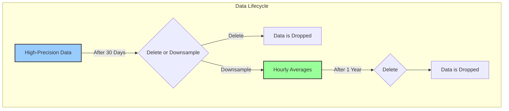

## Introduction: The Double-Edged Sword of Time-Series Data

Time-series data, by its nature, grows relentlessly. Every second, millions of new data points can be generated by servers, sensors, and applications. This high-volume ingestion is a sign of a healthy system, but it presents a significant challenge: **infinite data growth**.

If left unmanaged, your time-series database (TSDB) will grow indefinitely, leading to:
*   **Spiraling Storage Costs:** Storing high-precision data forever is prohibitively expensive.
*   **Degrading Query Performance:** The more data the database has to sift through, the slower your queries will become, even with optimizations.
*   **Increased Management Overhead:** Larger databases are more difficult to back up, restore, and manage.

The solution is to acknowledge a simple truth: **not all data is equally valuable over time**. The precise, second-by-second CPU usage from two years ago is far less important than the data from the last hour. This is where a **Data Retention Policy** comes in.

## What is a Data Retention Policy?

A data retention policy is a rule that automatically manages the lifecycle of your data. In its simplest form, it answers the question: **"How long should we keep our data?"**

For a TSDB, a retention policy typically defines a duration. Any data older than this duration is automatically deleted from the database.

For example, a policy might state:
*   "Retain high-precision (raw) metrics for 30 days."
*   "Retain downsampled (hourly average) metrics for 1 year."
*   "Delete all log data older than 7 days."

This ensures that the database only stores the data that is most relevant and valuable, keeping storage costs and query performance under control.



## How TSDBs Implement Retention Policies

Most time-series databases have built-in support for retention policies, and they implement them in a very efficient way.

TSDBs store data on disk in time-based chunks or blocks (often called `SSTables` in LSM-Tree architectures). For example, a single block might contain all the data for a specific day.

When a retention policy needs to delete data older than 30 days, it doesn't have to find and delete individual records, which would be a slow and expensive process. Instead, it can simply **drop the entire block(s)** that contain data from 31 days ago. Deleting a few large files from the filesystem is orders of magnitude faster than performing millions of small delete operations inside the database.

This block-based architecture is what makes automatic data retention feasible and efficient in a TSDB.

## Strategies for Data Retention

A good retention strategy is often more nuanced than just deleting old data. It usually involves a tiered approach combining retention with **downsampling**.

**Downsampling** is the process of creating aggregated, lower-precision data from your high-precision raw data. For example, you can take 3600 second-by-second data points and create a single data point representing the hourly average.

A common multi-tiered strategy looks like this:

1.  **Tier 1: Raw Data (Short-Term Retention):**
    *   **Data:** High-precision, raw data points.
    *   **Retention:** 7-30 days.
    *   **Use Case:** Real-time monitoring, immediate debugging, and high-resolution dashboards.

2.  **Tier 2: Downsampled Data (Mid-Term Retention):**
    *   **Data:** Hourly or daily aggregations (averages, max, min).
    *   **Retention:** 1-2 years.
    *   **Use Case:** Trend analysis, capacity planning, and long-term performance dashboards.

3.  **Tier 3: Cold Storage (Long-Term Archival):**
    *   **Data:** Monthly summaries or raw data backups.
    *   **Retention:** Indefinite (or as required by compliance).
    *   **Use Case:** Legal compliance, auditing, or machine learning model training. This data is often moved out of the TSDB into cheaper object storage like Amazon S3.

This tiered approach provides a balance between data granularity, query performance, and storage cost.

## Go Example: A Simple Retention Policy Service

Let's write a conceptual Go service that runs periodically and enforces a retention policy on a simulated database. This service will "delete" any data points that are older than a specified duration.

```go
package main

import (
	"fmt"
	"log"
	"sync"
	"time"
)

// Point represents a single time-series data point.
type Point struct {
	Timestamp time.Time
	Value     float64
}

// SimulatedTSDB is our in-memory mock database.
type SimulatedTSDB struct {
	sync.Mutex
	data []Point
}

// RetentionEnforcer is responsible for applying the retention policy.
type RetentionEnforcer struct {
	db         *SimulatedTSDB
	retention  time.Duration
	checkInterval time.Duration
}

// NewRetentionEnforcer creates a new enforcer.
func NewRetentionEnforcer(db *SimulatedTSDB, retention, checkInterval time.Duration) *RetentionEnforcer {
	return &RetentionEnforcer{
		db:         db,
		retention:  retention,
		checkInterval: checkInterval,
	}
}

// Start begins the periodic check to enforce the retention policy.
func (r *RetentionEnforcer) Start() {
	log.Printf("Retention policy started. Retaining data for %s. Checking every %s.", r.retention, r.checkInterval)
	ticker := time.NewTicker(r.checkInterval)
	go func() {
		for range ticker.C {
			r.applyPolicy()
		}
	}()
}

// applyPolicy finds and removes data older than the retention period.
func (r *RetentionEnforcer) applyPolicy() {
	r.db.Lock()
	defer r.db.Unlock()

	cutoffTime := time.Now().Add(-r.retention)
	log.Printf("Applying retention policy. Deleting data older than %s", cutoffTime.Format(time.RFC3339))

	// In a real TSDB, you'd drop whole blocks. Here, we'll find the first valid index.
	// We assume data is sorted by time.
	firstValidIndex := 0
	for i, p := range r.db.data {
		if !p.Timestamp.Before(cutoffTime) {
			firstValidIndex = i
			break
		}
	}

	if firstValidIndex > 0 {
		log.Printf("Deleted %d old data points.", firstValidIndex)
		r.db.data = r.db.data[firstValidIndex:]
	} else {
		log.Println("No old data to delete.")
	}
}

func main() {
	db := &SimulatedTSDB{}
	now := time.Now()

	// Add some data with varying timestamps
	db.data = append(db.data, Point{Timestamp: now.Add(-70 * time.Minute), Value: 10})
	db.data = append(db.data, Point{Timestamp: now.Add(-65 * time.Minute), Value: 11}) // Will be deleted
	db.data = append(db.data, Point{Timestamp: now.Add(-30 * time.Minute), Value: 12})
	db.data = append(db.data, Point{Timestamp: now.Add(-10 * time.Minute), Value: 13}) // Will be kept

	// Retain data for 1 hour, check every 10 seconds
	enforcer := NewRetentionEnforcer(db, 1*time.Hour, 10*time.Second)
	enforcer.Start()

	// Let the program run to see the policy in action
	log.Printf("Initial data count: %d", len(db.data))
	time.Sleep(12 * time.Second)
	log.Printf("Final data count: %d", len(db.data))
	fmt.Println("Final data:", db.data)
}
```

## Conclusion

A data retention policy is not an optional feature for a time-series database; it is a fundamental requirement for sustainable operation. By automatically pruning old and less valuable data, retention policies keep storage costs in check and ensure that query performance remains fast and predictable. When combined with a smart downsampling strategy, they provide a robust framework for managing the entire lifecycle of your time-series data, from high-precision real-time monitoring to long-term historical analysis.
