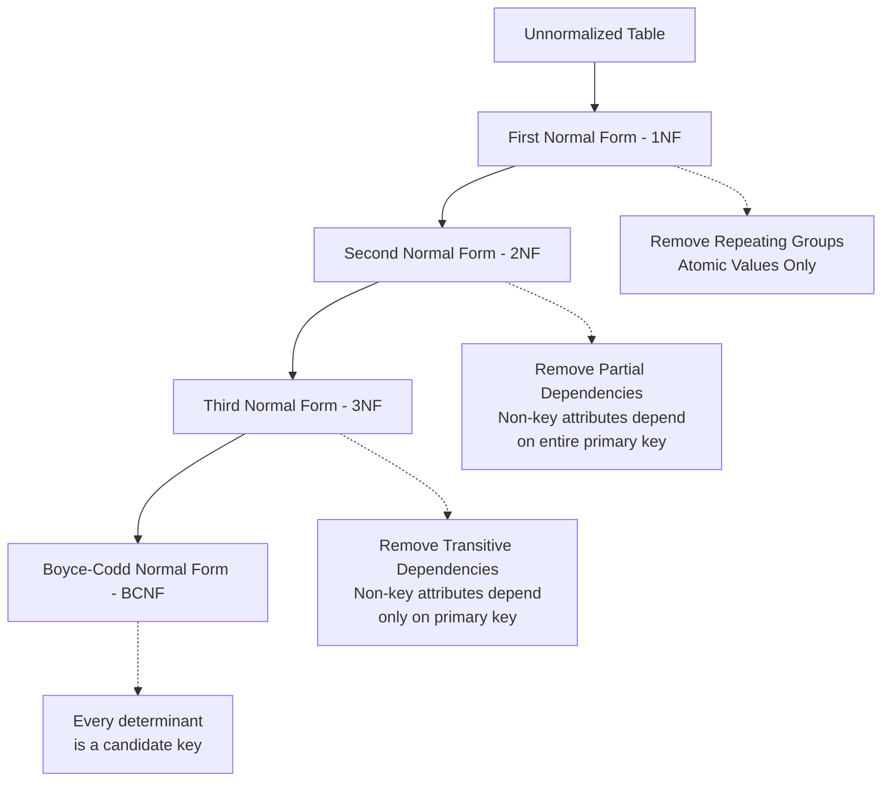
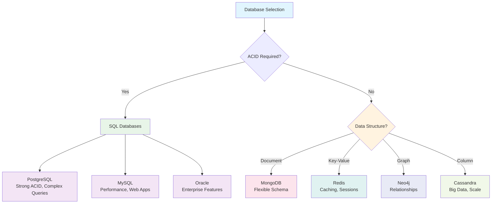

# System Design Fundamentals: Database Design

Database design is the foundation of any robust system. Poor database design can become a bottleneck that limits scalability, performance, and maintainability. This guide covers essential principles, patterns, and trade-offs in database design.

## Database Design Principles

### 1. ACID Properties

**Atomicity**: Transactions are all-or-nothing
**Consistency**: Database remains in valid state
**Isolation**: Concurrent transactions don't interfere
**Durability**: Committed changes persist

```python
# ACID transaction example in Python with SQLAlchemy
from sqlalchemy import create_engine, Column, Integer, String, Float, ForeignKey
from sqlalchemy.ext.declarative import declarative_base
from sqlalchemy.orm import sessionmaker, relationship
import contextlib

Base = declarative_base()

class Account(Base):
    __tablename__ = 'accounts'
    
    id = Column(Integer, primary_key=True)
    user_id = Column(String(50), nullable=False)
    balance = Column(Float, default=0.0)
    
    def __repr__(self):
        return f"<Account(id={self.id}, user_id='{self.user_id}', balance={self.balance})>"

class Transaction(Base):
    __tablename__ = 'transactions'
    
    id = Column(Integer, primary_key=True)
    from_account_id = Column(Integer, ForeignKey('accounts.id'))
    to_account_id = Column(Integer, ForeignKey('accounts.id'))
    amount = Column(Float, nullable=False)
    status = Column(String(20), default='pending')
    
    from_account = relationship("Account", foreign_keys=[from_account_id])
    to_account = relationship("Account", foreign_keys=[to_account_id])

class BankingService:
    def __init__(self, connection_string):
        self.engine = create_engine(connection_string)
        Base.metadata.create_all(self.engine)
        Session = sessionmaker(bind=self.engine)
        self.Session = Session
    
    @contextlib.contextmanager
    def transaction_scope(self):
        """Provide a transactional scope around operations"""
        session = self.Session()
        try:
            yield session
            session.commit()
        except Exception as e:
            session.rollback()
            raise e
        finally:
            session.close()
    
    def transfer_money(self, from_user_id: str, to_user_id: str, amount: float) -> bool:
        """ACID compliant money transfer"""
        if amount <= 0:
            raise ValueError("Transfer amount must be positive")
        
        with self.transaction_scope() as session:
            # Lock accounts to prevent concurrent modifications
            from_account = session.query(Account).filter(
                Account.user_id == from_user_id
            ).with_for_update().first()
            
            to_account = session.query(Account).filter(
                Account.user_id == to_user_id
            ).with_for_update().first()
            
            if not from_account or not to_account:
                raise ValueError("Account not found")
            
            if from_account.balance < amount:
                raise ValueError("Insufficient funds")
            
            # Create transaction record
            transaction = Transaction(
                from_account_id=from_account.id,
                to_account_id=to_account.id,
                amount=amount
            )
            session.add(transaction)
            
            # Perform the transfer
            from_account.balance -= amount
            to_account.balance += amount
            
            # Mark transaction as completed
            transaction.status = 'completed'
            
            print(f"Transferred ${amount:.2f} from {from_user_id} to {to_user_id}")
            return True
    
    def create_account(self, user_id: str, initial_balance: float = 0.0) -> Account:
        """Create new account"""
        with self.transaction_scope() as session:
            account = Account(user_id=user_id, balance=initial_balance)
            session.add(account)
            session.flush()  # Get the ID
            return account
    
    def get_account_balance(self, user_id: str) -> float:
        """Get account balance"""
        with self.transaction_scope() as session:
            account = session.query(Account).filter(Account.user_id == user_id).first()
            if not account:
                raise ValueError("Account not found")
            return account.balance

# Demonstration
def demonstrate_acid_transactions():
    banking = BankingService("sqlite:///banking.db")
    
    # Create accounts
    banking.create_account("alice", 1000.0)
    banking.create_account("bob", 500.0)
    
    print("Initial balances:")
    print(f"Alice: ${banking.get_account_balance('alice'):.2f}")
    print(f"Bob: ${banking.get_account_balance('bob'):.2f}")
    
    # Successful transfer
    try:
        banking.transfer_money("alice", "bob", 200.0)
        print("\nAfter successful transfer:")
        print(f"Alice: ${banking.get_account_balance('alice'):.2f}")
        print(f"Bob: ${banking.get_account_balance('bob'):.2f}")
    except Exception as e:
        print(f"Transfer failed: {e}")
    
    # Failed transfer (insufficient funds)
    try:
        banking.transfer_money("alice", "bob", 2000.0)
    except Exception as e:
        print(f"\nFailed transfer (insufficient funds): {e}")
        print("Balances remain unchanged:")
        print(f"Alice: ${banking.get_account_balance('alice'):.2f}")
        print(f"Bob: ${banking.get_account_balance('bob'):.2f}")
```

### 2. Normalization

Database normalization eliminates data redundancy and ensures data integrity.



```python
# Database schema design example with proper normalization
from sqlalchemy import Column, Integer, String, DateTime, ForeignKey, Float, Text, Boolean
from sqlalchemy.ext.declarative import declarative_base
from sqlalchemy.orm import relationship
from datetime import datetime

Base = declarative_base()

# 1NF: Each column contains atomic values
class User(Base):
    __tablename__ = 'users'
    
    id = Column(Integer, primary_key=True)
    email = Column(String(255), unique=True, nullable=False)
    first_name = Column(String(100), nullable=False)
    last_name = Column(String(100), nullable=False)
    created_at = Column(DateTime, default=datetime.utcnow)
    
    # Relationships
    addresses = relationship("Address", back_populates="user")
    orders = relationship("Order", back_populates="user")

# 2NF: Separate entity for addresses (removing partial dependency)
class Address(Base):
    __tablename__ = 'addresses'
    
    id = Column(Integer, primary_key=True)
    user_id = Column(Integer, ForeignKey('users.id'), nullable=False)
    address_type = Column(String(20), nullable=False)  # 'shipping', 'billing'
    street_address = Column(String(255), nullable=False)
    city = Column(String(100), nullable=False)
    state = Column(String(50), nullable=False)
    postal_code = Column(String(20), nullable=False)
    country = Column(String(50), nullable=False)
    
    # Relationship
    user = relationship("User", back_populates="addresses")

# 3NF: Product categories in separate table (removing transitive dependency)
class Category(Base):
    __tablename__ = 'categories'
    
    id = Column(Integer, primary_key=True)
    name = Column(String(100), unique=True, nullable=False)
    description = Column(Text)
    
    # Relationship
    products = relationship("Product", back_populates="category")

class Product(Base):
    __tablename__ = 'products'
    
    id = Column(Integer, primary_key=True)
    name = Column(String(255), nullable=False)
    description = Column(Text)
    price = Column(Float, nullable=False)
    category_id = Column(Integer, ForeignKey('categories.id'), nullable=False)
    stock_quantity = Column(Integer, default=0)
    is_active = Column(Boolean, default=True)
    
    # Relationship
    category = relationship("Category", back_populates="products")
    order_items = relationship("OrderItem", back_populates="product")

class Order(Base):
    __tablename__ = 'orders'
    
    id = Column(Integer, primary_key=True)
    user_id = Column(Integer, ForeignKey('users.id'), nullable=False)
    order_date = Column(DateTime, default=datetime.utcnow)
    status = Column(String(20), default='pending')
    total_amount = Column(Float, nullable=False)
    
    # Relationships
    user = relationship("User", back_populates="orders")
    items = relationship("OrderItem", back_populates="order")

# Junction table for many-to-many relationship (Orders ↔ Products)
class OrderItem(Base):
    __tablename__ = 'order_items'
    
    id = Column(Integer, primary_key=True)
    order_id = Column(Integer, ForeignKey('orders.id'), nullable=False)
    product_id = Column(Integer, ForeignKey('products.id'), nullable=False)
    quantity = Column(Integer, nullable=False)
    unit_price = Column(Float, nullable=False)
    
    # Relationships
    order = relationship("Order", back_populates="items")
    product = relationship("Product", back_populates="order_items")

# Example queries demonstrating normalized design benefits
class ECommerceService:
    def __init__(self, session):
        self.session = session
    
    def create_user_with_addresses(self, email, first_name, last_name, addresses_data):
        """Create user with multiple addresses (demonstrating 2NF benefits)"""
        user = User(email=email, first_name=first_name, last_name=last_name)
        self.session.add(user)
        self.session.flush()  # Get user ID
        
        for addr_data in addresses_data:
            address = Address(
                user_id=user.id,
                address_type=addr_data['type'],
                street_address=addr_data['street'],
                city=addr_data['city'],
                state=addr_data['state'],
                postal_code=addr_data['postal_code'],
                country=addr_data['country']
            )
            self.session.add(address)
        
        self.session.commit()
        return user
    
    def get_products_by_category(self, category_name):
        """Get products by category (demonstrating 3NF benefits)"""
        return self.session.query(Product).join(Category).filter(
            Category.name == category_name,
            Product.is_active == True
        ).all()
    
    def create_order_with_items(self, user_id, items_data):
        """Create order with items (demonstrating proper relationships)"""
        # Calculate total
        total_amount = 0
        order_items = []
        
        for item_data in items_data:
            product = self.session.query(Product).get(item_data['product_id'])
            if not product:
                raise ValueError(f"Product {item_data['product_id']} not found")
            
            quantity = item_data['quantity']
            unit_price = product.price
            total_amount += quantity * unit_price
            
            order_items.append({
                'product_id': product.id,
                'quantity': quantity,
                'unit_price': unit_price
            })
        
        # Create order
        order = Order(user_id=user_id, total_amount=total_amount)
        self.session.add(order)
        self.session.flush()
        
        # Add order items
        for item_data in order_items:
            order_item = OrderItem(
                order_id=order.id,
                product_id=item_data['product_id'],
                quantity=item_data['quantity'],
                unit_price=item_data['unit_price']
            )
            self.session.add(order_item)
        
        self.session.commit()
        return order
```

## Indexing Strategies

### 1. B-Tree Indexes

```go
// B-Tree index simulation in Go
package main

import (
    "fmt"
    "sort"
)

type BTreeNode struct {
    Keys     []int
    Values   []interface{}
    Children []*BTreeNode
    IsLeaf   bool
    Parent   *BTreeNode
}

type BTree struct {
    Root  *BTreeNode
    Degree int // Minimum degree (t)
}

func NewBTree(degree int) *BTree {
    return &BTree{
        Root:   &BTreeNode{IsLeaf: true},
        Degree: degree,
    }
}

func (bt *BTree) Search(key int) (interface{}, bool) {
    return bt.searchNode(bt.Root, key)
}

func (bt *BTree) searchNode(node *BTreeNode, key int) (interface{}, bool) {
    i := 0
    
    // Find the first key greater than or equal to target key
    for i < len(node.Keys) && key > node.Keys[i] {
        i++
    }
    
    // If key found
    if i < len(node.Keys) && key == node.Keys[i] {
        return node.Values[i], true
    }
    
    // If leaf node, key not found
    if node.IsLeaf {
        return nil, false
    }
    
    // Recurse to appropriate child
    return bt.searchNode(node.Children[i], key)
}

func (bt *BTree) Insert(key int, value interface{}) {
    root := bt.Root
    
    // If root is full, create new root
    if len(root.Keys) == 2*bt.Degree-1 {
        newRoot := &BTreeNode{IsLeaf: false}
        newRoot.Children = append(newRoot.Children, root)
        bt.splitChild(newRoot, 0)
        bt.Root = newRoot
    }
    
    bt.insertNonFull(bt.Root, key, value)
}

func (bt *BTree) insertNonFull(node *BTreeNode, key int, value interface{}) {
    i := len(node.Keys) - 1
    
    if node.IsLeaf {
        // Insert key in leaf node
        node.Keys = append(node.Keys, 0)
        node.Values = append(node.Values, nil)
        
        // Shift elements to make space
        for i >= 0 && node.Keys[i] > key {
            node.Keys[i+1] = node.Keys[i]
            node.Values[i+1] = node.Values[i]
            i--
        }
        
        node.Keys[i+1] = key
        node.Values[i+1] = value
    } else {
        // Find child to recurse
        for i >= 0 && node.Keys[i] > key {
            i--
        }
        i++
        
        // Split child if full
        if len(node.Children[i].Keys) == 2*bt.Degree-1 {
            bt.splitChild(node, i)
            if node.Keys[i] < key {
                i++
            }
        }
        
        bt.insertNonFull(node.Children[i], key, value)
    }
}

func (bt *BTree) splitChild(parent *BTreeNode, index int) {
    fullChild := parent.Children[index]
    newChild := &BTreeNode{IsLeaf: fullChild.IsLeaf}
    
    t := bt.Degree
    
    // Move half the keys to new node
    newChild.Keys = make([]int, t-1)
    newChild.Values = make([]interface{}, t-1)
    copy(newChild.Keys, fullChild.Keys[t:])
    copy(newChild.Values, fullChild.Values[t:])
    
    // If not leaf, move children too
    if !fullChild.IsLeaf {
        newChild.Children = make([]*BTreeNode, t)
        copy(newChild.Children, fullChild.Children[t:])
    }
    
    // Reduce full child size
    fullChild.Keys = fullChild.Keys[:t-1]
    fullChild.Values = fullChild.Values[:t-1]
    if !fullChild.IsLeaf {
        fullChild.Children = fullChild.Children[:t]
    }
    
    // Insert new child in parent
    parent.Children = append(parent.Children, nil)
    copy(parent.Children[index+2:], parent.Children[index+1:])
    parent.Children[index+1] = newChild
    
    // Move median key to parent
    parent.Keys = append(parent.Keys, 0)
    parent.Values = append(parent.Values, nil)
    copy(parent.Keys[index+1:], parent.Keys[index:])
    copy(parent.Values[index+1:], parent.Values[index:])
    parent.Keys[index] = fullChild.Keys[t-1]
    parent.Values[index] = fullChild.Values[t-1]
}

// Range query support
func (bt *BTree) RangeQuery(minKey, maxKey int) []interface{} {
    var results []interface{}
    bt.rangeQueryNode(bt.Root, minKey, maxKey, &results)
    return results
}

func (bt *BTree) rangeQueryNode(node *BTreeNode, minKey, maxKey int, results *[]interface{}) {
    i := 0
    
    for i < len(node.Keys) {
        // Recurse left child if exists and might contain values in range
        if !node.IsLeaf && i < len(node.Children) {
            bt.rangeQueryNode(node.Children[i], minKey, maxKey, results)
        }
        
        // Check if current key is in range
        if node.Keys[i] >= minKey && node.Keys[i] <= maxKey {
            *results = append(*results, node.Values[i])
        }
        
        // If key exceeds maxKey, no need to check further
        if node.Keys[i] > maxKey {
            return
        }
        
        i++
    }
    
    // Recurse rightmost child if exists
    if !node.IsLeaf && len(node.Children) > i {
        bt.rangeQueryNode(node.Children[i], minKey, maxKey, results)
    }
}

// Database table simulation using B-Tree index
type IndexedTable struct {
    PrimaryIndex *BTree                    // Primary key index
    Indexes      map[string]*BTree         // Secondary indexes
    Data         map[int]map[string]interface{} // Actual data storage
    NextID       int
}

func NewIndexedTable() *IndexedTable {
    return &IndexedTable{
        PrimaryIndex: NewBTree(3), // Degree 3 B-Tree
        Indexes:      make(map[string]*BTree),
        Data:         make(map[int]map[string]interface{}),
        NextID:       1,
    }
}

func (t *IndexedTable) CreateIndex(columnName string) {
    t.Indexes[columnName] = NewBTree(3)
    
    // Build index for existing data
    for id, row := range t.Data {
        if value, exists := row[columnName]; exists {
            if intValue, ok := value.(int); ok {
                t.Indexes[columnName].Insert(intValue, id)
            }
        }
    }
}

func (t *IndexedTable) Insert(row map[string]interface{}) int {
    id := t.NextID
    t.NextID++
    
    // Store data
    t.Data[id] = row
    
    // Update primary index
    t.PrimaryIndex.Insert(id, id)
    
    // Update secondary indexes
    for columnName, index := range t.Indexes {
        if value, exists := row[columnName]; exists {
            if intValue, ok := value.(int); ok {
                index.Insert(intValue, id)
            }
        }
    }
    
    return id
}

func (t *IndexedTable) FindByPrimaryKey(id int) (map[string]interface{}, bool) {
    if row, exists := t.Data[id]; exists {
        return row, true
    }
    return nil, false
}

func (t *IndexedTable) FindByIndex(columnName string, value int) []map[string]interface{} {
    var results []map[string]interface{}
    
    if index, exists := t.Indexes[columnName]; exists {
        if rowID, found := index.Search(value); found {
            if id, ok := rowID.(int); ok {
                if row, exists := t.Data[id]; exists {
                    results = append(results, row)
                }
            }
        }
    }
    
    return results
}

func (t *IndexedTable) FindByIndexRange(columnName string, minValue, maxValue int) []map[string]interface{} {
    var results []map[string]interface{}
    
    if index, exists := t.Indexes[columnName]; exists {
        rowIDs := index.RangeQuery(minValue, maxValue)
        for _, rowID := range rowIDs {
            if id, ok := rowID.(int); ok {
                if row, exists := t.Data[id]; exists {
                    results = append(results, row)
                }
            }
        }
    }
    
    return results
}

func main() {
    fmt.Println("=== B-Tree Index Demo ===")
    
    // Create table and indexes
    table := NewIndexedTable()
    table.CreateIndex("age")
    table.CreateIndex("salary")
    
    // Insert sample data
    employees := []map[string]interface{}{
        {"name": "Alice", "age": 30, "salary": 75000, "department": "Engineering"},
        {"name": "Bob", "age": 25, "salary": 65000, "department": "Marketing"},
        {"name": "Charlie", "age": 35, "salary": 85000, "department": "Engineering"},
        {"name": "Diana", "age": 28, "salary": 70000, "department": "Sales"},
        {"name": "Eve", "age": 32, "salary": 80000, "department": "Engineering"},
    }
    
    fmt.Println("Inserting employees...")
    for _, emp := range employees {
        id := table.Insert(emp)
        fmt.Printf("Inserted employee ID %d: %v\n", id, emp["name"])
    }
    
    // Query by primary key
    fmt.Println("\n=== Primary Key Lookup ===")
    if row, found := table.FindByPrimaryKey(3); found {
        fmt.Printf("Employee ID 3: %v\n", row)
    }
    
    // Query by index
    fmt.Println("\n=== Index Lookup (Age = 30) ===")
    results := table.FindByIndex("age", 30)
    for _, row := range results {
        fmt.Printf("Found: %v\n", row)
    }
    
    // Range query
    fmt.Println("\n=== Range Query (Salary 70000-80000) ===")
    salaryResults := table.FindByIndexRange("salary", 70000, 80000)
    for _, row := range salaryResults {
        fmt.Printf("Found: %s, Salary: %v\n", row["name"], row["salary"])
    }
    
    fmt.Printf("\nTotal employees: %d\n", len(table.Data))
}
```

### 2. Hash Indexes

```python
# Hash index implementation for exact match queries
import hashlib
from typing import Dict, List, Any, Optional

class HashBucket:
    def __init__(self):
        self.entries: List[tuple] = []  # (key, value) pairs
    
    def insert(self, key: Any, value: Any) -> None:
        # Check if key already exists
        for i, (k, v) in enumerate(self.entries):
            if k == key:
                self.entries[i] = (key, value)  # Update existing
                return
        
        # Add new entry
        self.entries.append((key, value))
    
    def search(self, key: Any) -> Optional[Any]:
        for k, v in self.entries:
            if k == key:
                return v
        return None
    
    def delete(self, key: Any) -> bool:
        for i, (k, v) in enumerate(self.entries):
            if k == key:
                del self.entries[i]
                return True
        return False
    
    def size(self) -> int:
        return len(self.entries)

class HashIndex:
    def __init__(self, initial_size: int = 16, load_factor: float = 0.75):
        self.size = initial_size
        self.buckets: List[HashBucket] = [HashBucket() for _ in range(initial_size)]
        self.count = 0
        self.load_factor = load_factor
    
    def _hash(self, key: Any) -> int:
        """Hash function using Python's built-in hash with custom implementation"""
        if isinstance(key, str):
            # Simple string hash
            hash_value = 0
            for char in key:
                hash_value = (hash_value * 31 + ord(char)) % self.size
            return hash_value
        elif isinstance(key, int):
            return key % self.size
        else:
            # Use built-in hash for other types
            return hash(key) % self.size
    
    def _resize(self) -> None:
        """Resize hash table when load factor is exceeded"""
        old_buckets = self.buckets
        old_size = self.size
        
        # Double the size
        self.size *= 2
        self.buckets = [HashBucket() for _ in range(self.size)]
        self.count = 0
        
        # Rehash all entries
        print(f"Resizing hash table from {old_size} to {self.size} buckets")
        
        for bucket in old_buckets:
            for key, value in bucket.entries:
                self.insert(key, value)
    
    def insert(self, key: Any, value: Any) -> None:
        """Insert key-value pair"""
        # Check if resize is needed
        if self.count >= self.size * self.load_factor:
            self._resize()
        
        hash_value = self._hash(key)
        old_size = self.buckets[hash_value].size()
        
        self.buckets[hash_value].insert(key, value)
        
        # Only increment count for new keys
        if self.buckets[hash_value].size() > old_size:
            self.count += 1
    
    def search(self, key: Any) -> Optional[Any]:
        """Search for key"""
        hash_value = self._hash(key)
        return self.buckets[hash_value].search(key)
    
    def delete(self, key: Any) -> bool:
        """Delete key"""
        hash_value = self._hash(key)
        if self.buckets[hash_value].delete(key):
            self.count -= 1
            return True
        return False
    
    def get_stats(self) -> Dict[str, Any]:
        """Get hash table statistics"""
        bucket_sizes = [bucket.size() for bucket in self.buckets]
        
        return {
            'total_entries': self.count,
            'table_size': self.size,
            'load_factor': self.count / self.size,
            'max_bucket_size': max(bucket_sizes),
            'min_bucket_size': min(bucket_sizes),
            'avg_bucket_size': sum(bucket_sizes) / len(bucket_sizes),
            'empty_buckets': bucket_sizes.count(0),
            'bucket_distribution': bucket_sizes
        }

# Database table with hash indexes
class HashIndexedTable:
    def __init__(self):
        self.data: Dict[int, Dict[str, Any]] = {}
        self.primary_key_index = HashIndex()
        self.secondary_indexes: Dict[str, HashIndex] = {}
        self.next_id = 1
    
    def create_hash_index(self, column_name: str) -> None:
        """Create hash index on specified column"""
        index = HashIndex()
        
        # Build index for existing data
        for row_id, row in self.data.items():
            if column_name in row:
                index.insert(row[column_name], row_id)
        
        self.secondary_indexes[column_name] = index
        print(f"Created hash index on column: {column_name}")
    
    def insert(self, row: Dict[str, Any]) -> int:
        """Insert row and update indexes"""
        row_id = self.next_id
        self.next_id += 1
        
        # Store data
        self.data[row_id] = row.copy()
        
        # Update primary key index
        self.primary_key_index.insert(row_id, row_id)
        
        # Update secondary indexes
        for column_name, index in self.secondary_indexes.items():
            if column_name in row:
                index.insert(row[column_name], row_id)
        
        return row_id
    
    def find_by_primary_key(self, row_id: int) -> Optional[Dict[str, Any]]:
        """Find by primary key (O(1) average case)"""
        return self.data.get(row_id)
    
    def find_by_column(self, column_name: str, value: Any) -> List[Dict[str, Any]]:
        """Find by indexed column (O(1) average case)"""
        results = []
        
        if column_name in self.secondary_indexes:
            row_id = self.secondary_indexes[column_name].search(value)
            if row_id is not None and row_id in self.data:
                results.append(self.data[row_id])
        else:
            # Fall back to table scan if no index
            print(f"No index on {column_name}, performing table scan...")
            for row in self.data.values():
                if row.get(column_name) == value:
                    results.append(row)
        
        return results
    
    def update(self, row_id: int, updates: Dict[str, Any]) -> bool:
        """Update row and maintain indexes"""
        if row_id not in self.data:
            return False
        
        old_row = self.data[row_id].copy()
        
        # Update data
        self.data[row_id].update(updates)
        
        # Update indexes for changed columns
        for column_name, new_value in updates.items():
            if column_name in self.secondary_indexes:
                index = self.secondary_indexes[column_name]
                
                # Remove old value from index
                if column_name in old_row:
                    index.delete(old_row[column_name])
                
                # Add new value to index
                index.insert(new_value, row_id)
        
        return True
    
    def delete(self, row_id: int) -> bool:
        """Delete row and update indexes"""
        if row_id not in self.data:
            return False
        
        row = self.data[row_id]
        
        # Remove from all secondary indexes
        for column_name, index in self.secondary_indexes.items():
            if column_name in row:
                index.delete(row[column_name])
        
        # Remove from primary key index
        self.primary_key_index.delete(row_id)
        
        # Remove data
        del self.data[row_id]
        
        return True
    
    def get_index_stats(self) -> Dict[str, Dict[str, Any]]:
        """Get statistics for all indexes"""
        stats = {
            'primary_key': self.primary_key_index.get_stats()
        }
        
        for column_name, index in self.secondary_indexes.items():
            stats[column_name] = index.get_stats()
        
        return stats

# Demonstration
def demonstrate_hash_indexes():
    print("=== Hash Index Demo ===\n")
    
    # Create table with hash indexes
    table = HashIndexedTable()
    table.create_hash_index("email")
    table.create_hash_index("department")
    
    # Insert sample data
    users = [
        {"name": "Alice", "email": "alice@company.com", "department": "Engineering", "salary": 75000},
        {"name": "Bob", "email": "bob@company.com", "department": "Marketing", "salary": 65000},
        {"name": "Charlie", "email": "charlie@company.com", "department": "Engineering", "salary": 85000},
        {"name": "Diana", "email": "diana@company.com", "department": "Sales", "salary": 70000},
        {"name": "Eve", "email": "eve@company.com", "department": "Engineering", "salary": 80000},
    ]
    
    print("1. Inserting users...")
    user_ids = []
    for user in users:
        user_id = table.insert(user)
        user_ids.append(user_id)
        print(f"Inserted user ID {user_id}: {user['name']}")
    
    # Demonstrate O(1) lookups
    print("\n2. Hash index lookups (O(1) average case)...")
    
    # Find by email
    email_results = table.find_by_column("email", "alice@company.com")
    print(f"Find by email 'alice@company.com': {email_results}")
    
    # Find by department
    dept_results = table.find_by_column("department", "Engineering")
    print(f"Find by department 'Engineering': {len(dept_results)} users found")
    for user in dept_results:
        print(f"  - {user['name']}: {user['email']}")
    
    # Update user and test index consistency
    print("\n3. Testing index updates...")
    table.update(user_ids[0], {"department": "Management", "salary": 90000})
    
    # Verify old department search
    old_dept_results = table.find_by_column("department", "Engineering")
    print(f"Engineering department after update: {len(old_dept_results)} users")
    
    # Verify new department search
    new_dept_results = table.find_by_column("department", "Management")
    print(f"Management department after update: {len(new_dept_results)} users")
    
    # Show index statistics
    print("\n4. Index statistics:")
    stats = table.get_index_stats()
    for index_name, index_stats in stats.items():
        print(f"\n{index_name} index:")
        print(f"  - Total entries: {index_stats['total_entries']}")
        print(f"  - Load factor: {index_stats['load_factor']:.2f}")
        print(f"  - Max bucket size: {index_stats['max_bucket_size']}")
        print(f"  - Empty buckets: {index_stats['empty_buckets']}")

if __name__ == "__main__":
    demonstrate_hash_indexes()
```

## Database Types and Selection

### SQL vs NoSQL Decision Matrix



### Database Schema Design Patterns

```python
# Different database schema patterns
from enum import Enum
from typing import Dict, List, Any, Optional
from dataclasses import dataclass
from datetime import datetime
import json

class SchemaPattern(Enum):
    SINGLE_TABLE = "single_table"
    CLASS_TABLE_INHERITANCE = "class_table_inheritance"
    CONCRETE_TABLE_INHERITANCE = "concrete_table_inheritance"
    DOCUMENT_EMBEDDING = "document_embedding"
    DOCUMENT_REFERENCING = "document_referencing"

# 1. Single Table Inheritance Pattern
@dataclass
class SingleTableUser:
    id: int
    email: str
    user_type: str  # 'customer', 'admin', 'employee'
    
    # Customer fields (nullable for non-customers)
    shipping_address: Optional[str] = None
    payment_method: Optional[str] = None
    
    # Employee fields (nullable for non-employees)
    employee_id: Optional[str] = None
    department: Optional[str] = None
    salary: Optional[float] = None
    
    # Admin fields (nullable for non-admins)
    permission_level: Optional[int] = None
    last_login: Optional[datetime] = None

# 2. Class Table Inheritance Pattern
@dataclass
class BaseUser:
    id: int
    email: str
    created_at: datetime

@dataclass
class Customer(BaseUser):
    shipping_address: str
    payment_method: str

@dataclass
class Employee(BaseUser):
    employee_id: str
    department: str
    salary: float

@dataclass
class Admin(BaseUser):
    permission_level: int
    last_login: datetime

# 3. Document Database Schema Patterns

# Embedding pattern (denormalized)
class EmbeddedOrderSchema:
    @staticmethod
    def create_order_document(order_data: Dict) -> Dict:
        return {
            "_id": order_data["order_id"],
            "customer": {
                "id": order_data["customer_id"],
                "name": order_data["customer_name"],
                "email": order_data["customer_email"],
                "address": {
                    "street": order_data["street"],
                    "city": order_data["city"],
                    "country": order_data["country"]
                }
            },
            "items": [
                {
                    "product_id": item["product_id"],
                    "name": item["product_name"],
                    "price": item["price"],
                    "quantity": item["quantity"],
                    "category": item["category"]
                }
                for item in order_data["items"]
            ],
            "total_amount": order_data["total_amount"],
            "order_date": order_data["order_date"],
            "status": order_data["status"]
        }

# Referencing pattern (normalized)
class ReferencedOrderSchema:
    @staticmethod
    def create_order_document(order_data: Dict) -> Dict:
        return {
            "_id": order_data["order_id"],
            "customer_id": order_data["customer_id"],  # Reference to customer collection
            "items": [
                {
                    "product_id": item["product_id"],  # Reference to product collection
                    "quantity": item["quantity"],
                    "unit_price": item["price"]
                }
                for item in order_data["items"]
            ],
            "total_amount": order_data["total_amount"],
            "order_date": order_data["order_date"],
            "status": order_data["status"]
        }
    
    @staticmethod
    def create_customer_document(customer_data: Dict) -> Dict:
        return {
            "_id": customer_data["customer_id"],
            "name": customer_data["name"],
            "email": customer_data["email"],
            "addresses": customer_data["addresses"],
            "created_at": customer_data["created_at"]
        }
    
    @staticmethod
    def create_product_document(product_data: Dict) -> Dict:
        return {
            "_id": product_data["product_id"],
            "name": product_data["name"],
            "price": product_data["price"],
            "category": product_data["category"],
            "description": product_data["description"],
            "stock_quantity": product_data["stock_quantity"]
        }

# Database pattern selector based on requirements
class DatabasePatternSelector:
    @staticmethod
    def recommend_sql_pattern(requirements: Dict[str, Any]) -> SchemaPattern:
        """Recommend SQL inheritance pattern based on requirements"""
        
        # Factors to consider
        query_complexity = requirements.get("query_complexity", "medium")
        storage_efficiency = requirements.get("storage_efficiency_priority", False)
        type_specific_queries = requirements.get("type_specific_queries_frequent", False)
        
        if storage_efficiency and not type_specific_queries:
            return SchemaPattern.SINGLE_TABLE
        elif query_complexity == "high" or type_specific_queries:
            return SchemaPattern.CLASS_TABLE_INHERITANCE
        else:
            return SchemaPattern.CONCRETE_TABLE_INHERITANCE
    
    @staticmethod
    def recommend_document_pattern(requirements: Dict[str, Any]) -> SchemaPattern:
        """Recommend document database pattern based on requirements"""
        
        # Factors to consider
        read_write_ratio = requirements.get("read_write_ratio", 1.0)  # reads/writes
        data_consistency = requirements.get("consistency_requirements", "eventual")
        query_patterns = requirements.get("query_patterns", [])
        document_size = requirements.get("avg_document_size_kb", 50)
        
        # Embedding is good for:
        # - Read-heavy workloads
        # - Documents that are often accessed together
        # - Smaller documents
        if (read_write_ratio > 3.0 and 
            "aggregate_queries" in query_patterns and 
            document_size < 100):
            return SchemaPattern.DOCUMENT_EMBEDDING
        
        # Referencing is good for:
        # - Write-heavy workloads
        # - Strong consistency requirements
        # - Large documents or frequently updated subdocuments
        else:
            return SchemaPattern.DOCUMENT_REFERENCING

# Performance comparison framework
class SchemaPerformanceAnalyzer:
    def __init__(self):
        self.metrics = {}
    
    def analyze_query_performance(self, pattern: SchemaPattern, query_type: str) -> Dict[str, float]:
        """Simulate query performance for different patterns"""
        
        # Simulated performance metrics (lower is better)
        performance_matrix = {
            SchemaPattern.SINGLE_TABLE: {
                "simple_select": 1.0,
                "type_specific_select": 2.0,  # Needs WHERE clause filtering
                "join_query": 0.8,  # No joins needed
                "insert": 1.0,
                "update": 1.2,  # May update irrelevant columns
            },
            SchemaPattern.CLASS_TABLE_INHERITANCE: {
                "simple_select": 1.5,  # Requires joins
                "type_specific_select": 1.0,  # Direct table access
                "join_query": 2.0,  # Multiple table joins
                "insert": 1.8,  # Multiple table inserts
                "update": 1.0,  # Updates only relevant table
            },
            SchemaPattern.DOCUMENT_EMBEDDING: {
                "simple_select": 0.8,  # Single document read
                "aggregate_query": 0.9,  # No joins needed
                "insert": 1.0,
                "update_subdocument": 1.5,  # Entire document rewrite
            },
            SchemaPattern.DOCUMENT_REFERENCING: {
                "simple_select": 1.2,  # May need multiple queries
                "aggregate_query": 2.0,  # Multiple document reads
                "insert": 0.8,  # Smaller documents
                "update_subdocument": 0.9,  # Update only changed document
            }
        }
        
        return {
            "response_time_ms": performance_matrix.get(pattern, {}).get(query_type, 1.0) * 10,
            "memory_usage_mb": performance_matrix.get(pattern, {}).get(query_type, 1.0) * 50,
            "storage_overhead": performance_matrix.get(pattern, {}).get(query_type, 1.0) * 0.1
        }

# Demonstration
def demonstrate_schema_patterns():
    print("=== Database Schema Pattern Selection Demo ===\n")
    
    selector = DatabasePatternSelector()
    analyzer = SchemaPerformanceAnalyzer()
    
    # Test scenarios
    scenarios = [
        {
            "name": "E-commerce User Management",
            "requirements": {
                "query_complexity": "medium",
                "storage_efficiency_priority": False,
                "type_specific_queries_frequent": True
            }
        },
        {
            "name": "Content Management System",
            "requirements": {
                "query_complexity": "low",
                "storage_efficiency_priority": True,
                "type_specific_queries_frequent": False
            }
        },
        {
            "name": "Product Catalog (Document DB)",
            "requirements": {
                "read_write_ratio": 5.0,
                "consistency_requirements": "eventual",
                "query_patterns": ["aggregate_queries", "text_search"],
                "avg_document_size_kb": 30
            }
        },
        {
            "name": "Real-time Analytics (Document DB)",
            "requirements": {
                "read_write_ratio": 0.5,
                "consistency_requirements": "strong",
                "query_patterns": ["time_series", "updates"],
                "avg_document_size_kb": 150
            }
        }
    ]
    
    for scenario in scenarios:
        print(f"Scenario: {scenario['name']}")
        print(f"Requirements: {scenario['requirements']}")
        
        if "read_write_ratio" in scenario["requirements"]:
            # Document database scenario
            recommended = selector.recommend_document_pattern(scenario["requirements"])
            print(f"Recommended pattern: {recommended.value}")
            
            # Analyze performance for common queries
            for query_type in ["simple_select", "aggregate_query"]:
                perf = analyzer.analyze_query_performance(recommended, query_type)
                print(f"  {query_type}: {perf['response_time_ms']:.1f}ms, "
                      f"{perf['memory_usage_mb']:.1f}MB")
        
        else:
            # SQL database scenario
            recommended = selector.recommend_sql_pattern(scenario["requirements"])
            print(f"Recommended pattern: {recommended.value}")
            
            # Analyze performance for common queries
            for query_type in ["simple_select", "type_specific_select", "join_query"]:
                perf = analyzer.analyze_query_performance(recommended, query_type)
                print(f"  {query_type}: {perf['response_time_ms']:.1f}ms, "
                      f"{perf['memory_usage_mb']:.1f}MB")
        
        print()

if __name__ == "__main__":
    demonstrate_acid_transactions()
    print("\n" + "="*50 + "\n")
    demonstrate_hash_indexes()
    print("\n" + "="*50 + "\n")
    demonstrate_schema_patterns()
```

## Conclusion

Database design is critical for system performance and scalability. Key principles:

- **Choose the right database type** based on ACID requirements, scalability needs, and query patterns
- **Normalize appropriately** to eliminate redundancy while maintaining query performance
- **Design effective indexes** using B-trees for range queries and hash indexes for exact matches
- **Consider schema patterns** that match your application's inheritance and relationship needs
- **Plan for scale** with proper indexing, partitioning, and caching strategies
- **Monitor performance** and optimize queries, indexes, and schema design based on real usage patterns

The choice between SQL and NoSQL, normalization levels, and indexing strategies should be driven by your specific requirements for consistency, scalability, query patterns, and performance characteristics.