## Introduction: Beyond the Single Database

As organizations grow, their data landscape often becomes fragmented. You might have:
*   A PostgreSQL database for user accounts.
*   A MySQL database for the product catalog.
*   A separate analytics database for business intelligence.
*   A legacy Oracle database from a company acquisition.

What happens when you need to run a query that combines data from these different sources? For example, "Show me the top 10 products purchased by users who signed up in the last month." This would require fetching data from the user database and the product database.

The traditional approach involves writing complex application code to query each database separately and then join the results in memory. This is cumbersome, inefficient, and hard to maintain.

**Database Federation** offers a more elegant solution. It's a form of "virtual database" that provides a unified query layer over multiple, independent, and often heterogeneous databases.

## What is Database Federation?

Database Federation (or a Federated Database System) is a system that maps multiple autonomous databases into a single, virtual database. The federated system does not have its own storage. Instead, it acts as a smart proxy.

1.  A user sends a single query to the federated system.
2.  The system's query processor analyzes the query and determines which underlying databases hold the required data.
3.  It breaks the query down into sub-queries, tailored for each specific database (e.g., one for PostgreSQL, one for MySQL).
4.  It sends these sub-queries to the respective databases.
5.  It receives the results, combines (joins, aggregates) them, and returns a single, unified result set to the user.

The entire process is transparent to the client application, which sees only a single database schema.

```mermaid
graph TB
    subgraph "Client Application"
        A["👤 Client Application"]
    end

    subgraph "Federated Query Engine"
        B["🔍 Query Analyzer & Planner"]
        B --> C["📋 Sub-query for PostgreSQL\n(SELECT * FROM users WHERE... )"]
        B --> D["📋 Sub-query for MySQL\n(SELECT * FROM products WHERE... )"]
        B --> E["📋 Sub-query for Oracle\n(SELECT * FROM inventory WHERE... )"]
    end

    subgraph "Autonomous Data Sources"
        F["🐘 PostgreSQL\n(Users Table)"]
        G["🐬 MySQL\n(Products Table)"]
        H["🛢 Oracle\n(Inventory Table)"]
    end

    subgraph "Result Aggregation"
        I["🔗 Result Merger &\n📊 Post-Processing Engine"]
    end

    subgraph "Query Flow"
        A -- "1. Single SQL Query" --> B
        C -->|"2. Execute"| F
        D -->|"2. Execute"| G
        E -->|"2. Execute"| H
        F -- "3. Results" --> I
        G -- "3. Results" --> I
        H -- "3. Results" --> I
        I -- "4. Unified Result Set" --> A
    end

    %% Styling
    style B fill:#f8d7da,stroke:#e63946,stroke-width:3px
    style I fill:#d0f0fd,stroke:#457b9d,stroke-width:3px
    style F fill:#e8f4f8,stroke:#2a9d8f,stroke-width:2px
    style G fill:#e8f4f8,stroke:#2a9d8f,stroke-width:2px
    style H fill:#e8f4f8,stroke:#2a9d8f,stroke-width:2px
```



## Key Differences: Federation vs. Replication

It's important not to confuse federation with replication.

*   **Replication** copies data. A read replica has a full copy of the primary's data.
*   **Federation** does not copy data. It's a query-time-only abstraction. The data remains in its original, independent source database.

| Feature | Database Replication | Database Federation |
| :--- | :--- | :--- |
| **Data Storage** | Duplicates data across nodes | Data remains in original sources |
| **Primary Goal** | Read scaling, high availability | Unified access to disparate data |
| **Consistency** | Eventual consistency (due to lag) | Real-time (queries hit live data) |
| **Use Case** | Scaling a single logical database | Integrating multiple different databases |

## Benefits of Database Federation

1.  **Unified View:** Provides a single, consistent interface to query data scattered across the organization.
2.  **Location Transparency:** Application developers don't need to know where the data lives. They just write standard SQL against the virtual schema.
3.  **Reduced Development Effort:** Eliminates the need for custom application-level code to join data from different sources.
4.  **Real-Time Access:** Queries are executed against the live source databases, providing up-to-the-minute data (unlike a data warehouse, which relies on periodic ETL jobs).
5.  **Preserves Autonomy:** The underlying databases remain independent and can be managed, scaled, and modified separately without affecting the federated system.

## Drawbacks and Challenges

1.  **Performance Bottlenecks:** The performance of a federated query is limited by the slowest underlying database. A cross-database join can be very expensive, as large amounts of data may need to be transferred over the network to the federation server for processing.
2.  **Query Optimization is Hard:** Optimizing a query across different database systems with different capabilities, data statistics, and index structures is extremely complex.
3.  **Transaction Management:** Distributed transactions across heterogeneous databases are notoriously difficult to manage and are often not fully supported, limiting the system's use for write operations.
4.  **Single Point of Failure:** The federation server itself can become a single point of failure and a performance bottleneck.
5.  **Cost and Complexity:** Implementing and managing a federated database system can be complex and may require specialized (and often expensive) software.

## Go Example: A Simple Federation Proxy

Let's simulate a very basic federation layer in Go. This proxy will receive a conceptual query, fetch data from two different "databases" (which we'll simulate with maps), and join the results in memory.

```go
package main

import (
	"fmt"
	"log"
)

// --- Simulated User Database (PostgreSQL) ---
type User struct {
	ID   int
	Name string
}
var userDB = map[int]User{
	1: {ID: 1, Name: "Alice"},
	2: {ID: 2, Name: "Bob"},
}

// --- Simulated Orders Database (MySQL) ---
type Order struct {
	ID     int
	UserID int
	Item   string
}
var orderDB = map[int]Order{
	101: {ID: 101, UserID: 1, Item: "Laptop"},
	102: {ID: 102, UserID: 2, Item: "Keyboard"},
	103: {ID: 103, UserID: 1, Item: "Mouse"},
}

// --- Federation Layer ---

// CombinedResult is the structure for our unified result set.
type CombinedResult struct {
	UserName string
	OrderItem string
}

// FederationProxy simulates the federated query engine.
type FederationProxy struct{}

// QueryUserOrders fetches data from both databases and joins them.
func (p *FederationProxy) QueryUserOrders(userID int) ([]CombinedResult, error) {
	log.Printf("Federated Query: Get orders for user ID %d", userID)

	// Step 1: Query the User Database
	log.Println("  -> Querying User DB...")
	user, ok := userDB[userID]
	if !ok {
		return nil, fmt.Errorf("user with ID %d not found", userID)
	}

	// Step 2: Query the Orders Database
	log.Println("  -> Querying Orders DB...")
	var userOrders []Order
	for _, order := range orderDB {
		if order.UserID == userID {
			userOrders = append(userOrders, order)
		}
	}

	// Step 3: Join results in the federation layer
	log.Println("  -> Joining results in memory...")
	var results []CombinedResult
	for _, order := range userOrders {
		results = append(results, CombinedResult{
			UserName: user.Name,
			OrderItem: order.Item,
		})
	}

	return results, nil
}

func main() {
	proxy := &FederationProxy{}

	fmt.Println("--- Running federated query for User 1 (Alice) ---")
	results, err := proxy.QueryUserOrders(1)
	if err != nil {
		log.Fatal(err)
	}

	for _, r := range results {
		fmt.Printf("Result: User '%s' ordered a '%s'\n", r.UserName, r.OrderItem)
	}
	
	fmt.Println("\n--- Running federated query for User 2 (Bob) ---")
	results, err = proxy.QueryUserOrders(2)
	if err != nil {
		log.Fatal(err)
	}

	for _, r := range results {
		fmt.Printf("Result: User '%s' ordered a '%s'\n", r.UserName, r.OrderItem)
	}
}
```
*This example performs the join in the application. A real federated system would have a sophisticated engine to optimize this, potentially by pushing down join logic to the source databases if possible.*

## When to Use Database Federation

Database federation is a specialized tool, not a general-purpose scaling solution. It shines in specific scenarios:

1.  **Data Integration for Analytics:** When you need to run read-only analytical queries across multiple, heterogeneous data sources without building a full data warehouse.
2.  **Legacy System Integration:** When you need to integrate a new application with multiple legacy databases without migrating all the data.
3.  **Phased Data Migration:** It can serve as an interim solution during a long-term migration project, providing a unified view while data is gradually moved from an old system to a new one.

It is generally **not** a good fit for high-throughput OLTP (Online Transaction Processing) workloads, especially those requiring complex writes or distributed transactions.

## Conclusion

Database federation is a powerful architectural pattern for creating a unified query interface over a distributed and heterogeneous data landscape. It allows applications to access data from multiple sources with simplicity and transparency. However, its power comes with significant challenges in performance, optimization, and transaction management. When used for its intended purpose—read-heavy integration and analytics—it can be an invaluable tool for unlocking insights from fragmented data.
