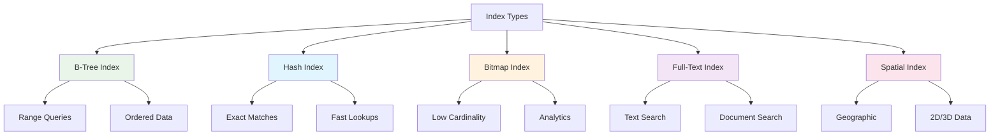

# System Design Fundamentals: Database Indexing & Query Optimization

Database indexing is crucial for query performance. Understanding index types, when to use them, and how they work internally is essential for building scalable systems.

## Index Types Overview



## B-Tree Index Implementation

```go
// B-Tree Index Implementation
package main

import (
    "fmt"
    "sort"
    "sync"
)

const BTreeOrder = 4 // Maximum children per node

type BTreeNode struct {
    keys     []int
    values   []interface{}
    children []*BTreeNode
    isLeaf   bool
    parent   *BTreeNode
}

type BTree struct {
    root  *BTreeNode
    mutex sync.RWMutex
    size  int
}

func NewBTree() *BTree {
    return &BTree{
        root: &BTreeNode{
            keys:     make([]int, 0),
            values:   make([]interface{}, 0),
            children: make([]*BTreeNode, 0),
            isLeaf:   true,
        },
    }
}

func (bt *BTree) Insert(key int, value interface{}) {
    bt.mutex.Lock()
    defer bt.mutex.Unlock()
    
    root := bt.root
    
    // If root is full, split it
    if len(root.keys) >= BTreeOrder-1 {
        newRoot := &BTreeNode{
            keys:     make([]int, 0),
            values:   make([]interface{}, 0),
            children: []*BTreeNode{root},
            isLeaf:   false,
        }
        
        bt.root = newRoot
        bt.splitChild(newRoot, 0)
        root = newRoot
    }
    
    bt.insertNonFull(root, key, value)
    bt.size++
    
    fmt.Printf("📊 Inserted into B-Tree: key=%d\n", key)
}

func (bt *BTree) insertNonFull(node *BTreeNode, key int, value interface{}) {
    i := len(node.keys) - 1
    
    if node.isLeaf {
        // Insert into leaf node
        node.keys = append(node.keys, 0)
        node.values = append(node.values, nil)
        
        for i >= 0 && key < node.keys[i] {
            node.keys[i+1] = node.keys[i]
            node.values[i+1] = node.values[i]
            i--
        }
        
        node.keys[i+1] = key
        node.values[i+1] = value
    } else {
        // Find child to insert into
        for i >= 0 && key < node.keys[i] {
            i--
        }
        i++
        
        // Split child if full
        if len(node.children[i].keys) >= BTreeOrder-1 {
            bt.splitChild(node, i)
            
            if key > node.keys[i] {
                i++
            }
        }
        
        bt.insertNonFull(node.children[i], key, value)
    }
}

func (bt *BTree) splitChild(parent *BTreeNode, index int) {
    fullChild := parent.children[index]
    mid := len(fullChild.keys) / 2
    
    newChild := &BTreeNode{
        keys:     make([]int, 0),
        values:   make([]interface{}, 0),
        children: make([]*BTreeNode, 0),
        isLeaf:   fullChild.isLeaf,
        parent:   parent,
    }
    
    // Move upper half to new child
    newChild.keys = append(newChild.keys, fullChild.keys[mid+1:]...)
    newChild.values = append(newChild.values, fullChild.values[mid+1:]...)
    
    if !fullChild.isLeaf {
        newChild.children = append(newChild.children, fullChild.children[mid+1:]...)
        fullChild.children = fullChild.children[:mid+1]
    }
    
    // Insert middle key into parent
    parent.keys = append(parent.keys, 0)
    parent.values = append(parent.values, nil)
    parent.children = append(parent.children, nil)
    
    for i := len(parent.keys) - 1; i > index; i-- {
        parent.keys[i] = parent.keys[i-1]
        parent.values[i] = parent.values[i-1]
        parent.children[i+1] = parent.children[i]
    }
    
    parent.keys[index] = fullChild.keys[mid]
    parent.values[index] = fullChild.values[mid]
    parent.children[index+1] = newChild
    
    // Truncate full child
    fullChild.keys = fullChild.keys[:mid]
    fullChild.values = fullChild.values[:mid]
}

func (bt *BTree) Search(key int) (interface{}, bool) {
    bt.mutex.RLock()
    defer bt.mutex.RUnlock()
    
    return bt.searchNode(bt.root, key)
}

func (bt *BTree) searchNode(node *BTreeNode, key int) (interface{}, bool) {
    i := 0
    
    // Find the first key greater than or equal to key
    for i < len(node.keys) && key > node.keys[i] {
        i++
    }
    
    // Check if key is found
    if i < len(node.keys) && key == node.keys[i] {
        fmt.Printf("✅ B-Tree search HIT: key=%d\n", key)
        return node.values[i], true
    }
    
    // If leaf node, key not found
    if node.isLeaf {
        fmt.Printf("❌ B-Tree search MISS: key=%d\n", key)
        return nil, false
    }
    
    // Recurse into appropriate child
    return bt.searchNode(node.children[i], key)
}

func (bt *BTree) RangeQuery(startKey, endKey int) []interface{} {
    bt.mutex.RLock()
    defer bt.mutex.RUnlock()
    
    results := make([]interface{}, 0)
    bt.rangeQueryNode(bt.root, startKey, endKey, &results)
    
    fmt.Printf("🔍 Range query [%d, %d]: %d results\n", startKey, endKey, len(results))
    
    return results
}

func (bt *BTree) rangeQueryNode(node *BTreeNode, startKey, endKey int, results *[]interface{}) {
    i := 0
    
    for i < len(node.keys) {
        // Recurse left child if not leaf
        if !node.isLeaf && node.children[i] != nil {
            bt.rangeQueryNode(node.children[i], startKey, endKey, results)
        }
        
        // Check current key
        if node.keys[i] >= startKey && node.keys[i] <= endKey {
            *results = append(*results, node.values[i])
        }
        
        // Stop if we've passed the range
        if node.keys[i] > endKey {
            return
        }
        
        i++
    }
    
    // Recurse rightmost child if not leaf
    if !node.isLeaf && len(node.children) > i {
        bt.rangeQueryNode(node.children[i], startKey, endKey, results)
    }
}

func (bt *BTree) Size() int {
    bt.mutex.RLock()
    defer bt.mutex.RUnlock()
    return bt.size
}
```

## Hash Index Implementation

```go
// Hash Index Implementation
package main

import (
    "fmt"
    "hash/fnv"
    "sync"
)

type HashIndex struct {
    buckets  [][]HashEntry
    numBuckets int
    mutex    sync.RWMutex
    size     int
}

type HashEntry struct {
    Key   string
    Value interface{}
}

func NewHashIndex(numBuckets int) *HashIndex {
    buckets := make([][]HashEntry, numBuckets)
    for i := range buckets {
        buckets[i] = make([]HashEntry, 0)
    }
    
    return &HashIndex{
        buckets:    buckets,
        numBuckets: numBuckets,
    }
}

func (hi *HashIndex) hash(key string) int {
    h := fnv.New32a()
    h.Write([]byte(key))
    return int(h.Sum32()) % hi.numBuckets
}

func (hi *HashIndex) Insert(key string, value interface{}) {
    hi.mutex.Lock()
    defer hi.mutex.Unlock()
    
    bucketIndex := hi.hash(key)
    bucket := hi.buckets[bucketIndex]
    
    // Check if key already exists
    for i, entry := range bucket {
        if entry.Key == key {
            bucket[i].Value = value
            fmt.Printf("📊 Updated hash index: key=%s (bucket=%d)\n", key, bucketIndex)
            return
        }
    }
    
    // Add new entry
    hi.buckets[bucketIndex] = append(bucket, HashEntry{
        Key:   key,
        Value: value,
    })
    
    hi.size++
    
    fmt.Printf("📊 Inserted into hash index: key=%s (bucket=%d)\n", key, bucketIndex)
}

func (hi *HashIndex) Search(key string) (interface{}, bool) {
    hi.mutex.RLock()
    defer hi.mutex.RUnlock()
    
    bucketIndex := hi.hash(key)
    bucket := hi.buckets[bucketIndex]
    
    for _, entry := range bucket {
        if entry.Key == key {
            fmt.Printf("✅ Hash index HIT: key=%s\n", key)
            return entry.Value, true
        }
    }
    
    fmt.Printf("❌ Hash index MISS: key=%s\n", key)
    return nil, false
}

func (hi *HashIndex) Delete(key string) bool {
    hi.mutex.Lock()
    defer hi.mutex.Unlock()
    
    bucketIndex := hi.hash(key)
    bucket := hi.buckets[bucketIndex]
    
    for i, entry := range bucket {
        if entry.Key == key {
            // Remove entry
            hi.buckets[bucketIndex] = append(bucket[:i], bucket[i+1:]...)
            hi.size--
            
            fmt.Printf("🗑️  Deleted from hash index: key=%s\n", key)
            return true
        }
    }
    
    return false
}

func (hi *HashIndex) Size() int {
    hi.mutex.RLock()
    defer hi.mutex.RUnlock()
    return hi.size
}

func (hi *HashIndex) GetBucketDistribution() map[int]int {
    hi.mutex.RLock()
    defer hi.mutex.RUnlock()
    
    distribution := make(map[int]int)
    
    for i, bucket := range hi.buckets {
        distribution[i] = len(bucket)
    }
    
    return distribution
}
```

## Composite Index

```go
// Composite Index (Multi-Column Index)
package main

import (
    "fmt"
    "sort"
    "sync"
)

type CompositeKey struct {
    Fields []interface{}
}

func (ck CompositeKey) Compare(other CompositeKey) int {
    for i := 0; i < len(ck.Fields) && i < len(other.Fields); i++ {
        switch v1 := ck.Fields[i].(type) {
        case int:
            v2 := other.Fields[i].(int)
            if v1 < v2 {
                return -1
            } else if v1 > v2 {
                return 1
            }
        case string:
            v2 := other.Fields[i].(string)
            if v1 < v2 {
                return -1
            } else if v1 > v2 {
                return 1
            }
        }
    }
    return 0
}

type CompositeIndexEntry struct {
    Key   CompositeKey
    Value interface{}
}

type CompositeIndex struct {
    entries []CompositeIndexEntry
    mutex   sync.RWMutex
}

func NewCompositeIndex() *CompositeIndex {
    return &CompositeIndex{
        entries: make([]CompositeIndexEntry, 0),
    }
}

func (ci *CompositeIndex) Insert(key CompositeKey, value interface{}) {
    ci.mutex.Lock()
    defer ci.mutex.Unlock()
    
    entry := CompositeIndexEntry{
        Key:   key,
        Value: value,
    }
    
    // Find insertion point
    index := sort.Search(len(ci.entries), func(i int) bool {
        return ci.entries[i].Key.Compare(key) >= 0
    })
    
    // Insert at position
    ci.entries = append(ci.entries, CompositeIndexEntry{})
    copy(ci.entries[index+1:], ci.entries[index:])
    ci.entries[index] = entry
    
    fmt.Printf("📊 Inserted into composite index: %v\n", key.Fields)
}

func (ci *CompositeIndex) Search(key CompositeKey) (interface{}, bool) {
    ci.mutex.RLock()
    defer ci.mutex.RUnlock()
    
    index := sort.Search(len(ci.entries), func(i int) bool {
        return ci.entries[i].Key.Compare(key) >= 0
    })
    
    if index < len(ci.entries) && ci.entries[index].Key.Compare(key) == 0 {
        fmt.Printf("✅ Composite index HIT: %v\n", key.Fields)
        return ci.entries[index].Value, true
    }
    
    fmt.Printf("❌ Composite index MISS: %v\n", key.Fields)
    return nil, false
}

func (ci *CompositeIndex) RangeSearch(startKey, endKey CompositeKey) []interface{} {
    ci.mutex.RLock()
    defer ci.mutex.RUnlock()
    
    results := make([]interface{}, 0)
    
    for _, entry := range ci.entries {
        if entry.Key.Compare(startKey) >= 0 && entry.Key.Compare(endKey) <= 0 {
            results = append(results, entry.Value)
        }
    }
    
    fmt.Printf("🔍 Composite range search: %d results\n", len(results))
    
    return results
}
```

## Covering Index

```go
// Covering Index - Index contains all columns needed for query
package main

import (
    "fmt"
    "sync"
)

type CoveringIndexEntry struct {
    IndexedColumns map[string]interface{} // Columns in WHERE clause
    CoveredColumns map[string]interface{} // Additional columns in SELECT
    RowID          int
}

type CoveringIndex struct {
    entries []CoveringIndexEntry
    columns []string // All columns in index
    mutex   sync.RWMutex
}

func NewCoveringIndex(columns []string) *CoveringIndex {
    return &CoveringIndex{
        entries: make([]CoveringIndexEntry, 0),
        columns: columns,
    }
}

func (ci *CoveringIndex) Insert(indexedCols, coveredCols map[string]interface{}, rowID int) {
    ci.mutex.Lock()
    defer ci.mutex.Unlock()
    
    entry := CoveringIndexEntry{
        IndexedColumns: indexedCols,
        CoveredColumns: coveredCols,
        RowID:          rowID,
    }
    
    ci.entries = append(ci.entries, entry)
    
    fmt.Printf("📊 Inserted into covering index: row=%d\n", rowID)
}

func (ci *CoveringIndex) SearchCovering(conditions map[string]interface{}) []map[string]interface{} {
    ci.mutex.RLock()
    defer ci.mutex.RUnlock()
    
    results := make([]map[string]interface{}, 0)
    
    for _, entry := range ci.entries {
        // Check if conditions match
        matches := true
        for key, value := range conditions {
            if entry.IndexedColumns[key] != value {
                matches = false
                break
            }
        }
        
        if matches {
            // Return all columns (indexed + covered)
            result := make(map[string]interface{})
            
            for k, v := range entry.IndexedColumns {
                result[k] = v
            }
            for k, v := range entry.CoveredColumns {
                result[k] = v
            }
            
            results = append(results, result)
        }
    }
    
    fmt.Printf("✅ Covering index search: %d results (no table access needed)\n", len(results))
    
    return results
}
```

## Query Optimizer

```go
// Simple Query Optimizer
package main

import (
    "fmt"
)

type QueryPlan struct {
    Steps       []string
    IndexUsed   string
    Estimated Cost int
}

type QueryOptimizer struct {
    availableIndexes map[string]bool
}

func NewQueryOptimizer() *QueryOptimizer {
    return &QueryOptimizer{
        availableIndexes: make(map[string]bool),
    }
}

func (qo *QueryOptimizer) RegisterIndex(indexName string) {
    qo.availableIndexes[indexName] = true
    fmt.Printf("📋 Registered index: %s\n", indexName)
}

func (qo *QueryOptimizer) OptimizeQuery(query Query) *QueryPlan {
    plan := &QueryPlan{
        Steps: make([]string, 0),
    }
    
    // Analyze query
    if query.Where != nil {
        // Check if index exists for WHERE clause
        if qo.canUseIndex(query.Where.Column) {
            plan.IndexUsed = fmt.Sprintf("idx_%s", query.Where.Column)
            plan.Steps = append(plan.Steps, fmt.Sprintf("Use index %s", plan.IndexUsed))
            plan.EstimatedCost = 10
        } else {
            plan.Steps = append(plan.Steps, "Full table scan")
            plan.EstimatedCost = 1000
        }
    }
    
    // Add additional steps
    if len(query.OrderBy) > 0 {
        if plan.IndexUsed != "" && query.OrderBy[0] == query.Where.Column {
            plan.Steps = append(plan.Steps, "Use index for sorting (no extra sort needed)")
        } else {
            plan.Steps = append(plan.Steps, "Sort results")
            plan.EstimatedCost += 100
        }
    }
    
    if query.Limit > 0 {
        plan.Steps = append(plan.Steps, fmt.Sprintf("Limit to %d rows", query.Limit))
    }
    
    fmt.Printf("\n📊 Query Plan:\n")
    fmt.Printf("  Index: %s\n", plan.IndexUsed)
    fmt.Printf("  Estimated Cost: %d\n", plan.EstimatedCost)
    fmt.Printf("  Steps:\n")
    for i, step := range plan.Steps {
        fmt.Printf("    %d. %s\n", i+1, step)
    }
    fmt.Println()
    
    return plan
}

func (qo *QueryOptimizer) canUseIndex(column string) bool {
    indexName := fmt.Sprintf("idx_%s", column)
    return qo.availableIndexes[indexName]
}

type Query struct {
    Select  []string
    From    string
    Where   *WhereClause
    OrderBy []string
    Limit   int
}

type WhereClause struct {
    Column   string
    Operator string
    Value    interface{}
}
```

## Index Statistics

```go
// Index Statistics and Analysis
package main

import (
    "fmt"
    "sync"
    "time"
)

type IndexStatistics struct {
    IndexName      string
    Lookups        int64
    Hits           int64
    Misses         int64
    RangeScans     int64
    AvgLookupTime  time.Duration
    Size           int
    LastUpdated    time.Time
    mutex          sync.RWMutex
}

func NewIndexStatistics(indexName string) *IndexStatistics {
    return &IndexStatistics{
        IndexName:   indexName,
        LastUpdated: time.Now(),
    }
}

func (is *IndexStatistics) RecordLookup(hit bool, duration time.Duration) {
    is.mutex.Lock()
    defer is.mutex.Unlock()
    
    is.Lookups++
    
    if hit {
        is.Hits++
    } else {
        is.Misses++
    }
    
    // Update average lookup time
    if is.Lookups == 1 {
        is.AvgLookupTime = duration
    } else {
        is.AvgLookupTime = (is.AvgLookupTime*time.Duration(is.Lookups-1) + duration) / time.Duration(is.Lookups)
    }
}

func (is *IndexStatistics) RecordRangeScan() {
    is.mutex.Lock()
    defer is.mutex.Unlock()
    
    is.RangeScans++
}

func (is *IndexStatistics) GetHitRate() float64 {
    is.mutex.RLock()
    defer is.mutex.RUnlock()
    
    if is.Lookups == 0 {
        return 0
    }
    
    return float64(is.Hits) / float64(is.Lookups) * 100
}

func (is *IndexStatistics) Print() {
    is.mutex.RLock()
    defer is.mutex.RUnlock()
    
    fmt.Printf("\n📊 Index Statistics: %s\n", is.IndexName)
    fmt.Printf("  Total Lookups: %d\n", is.Lookups)
    fmt.Printf("  Hits: %d\n", is.Hits)
    fmt.Printf("  Misses: %d\n", is.Misses)
    fmt.Printf("  Hit Rate: %.2f%%\n", is.GetHitRate())
    fmt.Printf("  Range Scans: %d\n", is.RangeScans)
    fmt.Printf("  Avg Lookup Time: %v\n", is.AvgLookupTime)
    fmt.Printf("  Index Size: %d entries\n", is.Size)
    fmt.Printf("  Last Updated: %s\n", is.LastUpdated.Format(time.RFC3339))
    fmt.Println()
}
```

## Complete Demo

```go
func main() {
    fmt.Println("🚀 Starting Database Indexing Demo\n")
    
    // 1. B-Tree Index
    fmt.Println("=== B-Tree Index ===")
    btree := NewBTree()
    
    // Insert data
    for i := 1; i <= 20; i++ {
        btree.Insert(i*10, fmt.Sprintf("value-%d", i))
    }
    
    // Point queries
    btree.Search(50)
    btree.Search(150)
    btree.Search(999)
    
    // Range query
    btree.RangeQuery(50, 150)
    
    fmt.Printf("B-Tree size: %d entries\n\n", btree.Size())
    
    // 2. Hash Index
    fmt.Println("=== Hash Index ===")
    hashIndex := NewHashIndex(10)
    
    // Insert data
    users := []string{"alice", "bob", "charlie", "david", "eve"}
    for i, user := range users {
        hashIndex.Insert(user, fmt.Sprintf("user-id-%d", i+1))
    }
    
    // Lookups
    hashIndex.Search("alice")
    hashIndex.Search("charlie")
    hashIndex.Search("unknown")
    
    // Show distribution
    distribution := hashIndex.GetBucketDistribution()
    fmt.Println("\nBucket distribution:")
    for bucket, count := range distribution {
        if count > 0 {
            fmt.Printf("  Bucket %d: %d entries\n", bucket, count)
        }
    }
    fmt.Println()
    
    // 3. Composite Index
    fmt.Println("=== Composite Index (Multi-Column) ===")
    compositeIndex := NewCompositeIndex()
    
    // Insert data (last_name, first_name, age)
    compositeIndex.Insert(CompositeKey{[]interface{}{"Smith", "John", 30}}, "user-1")
    compositeIndex.Insert(CompositeKey{[]interface{}{"Smith", "Jane", 25}}, "user-2")
    compositeIndex.Insert(CompositeKey{[]interface{}{"Doe", "John", 35}}, "user-3")
    compositeIndex.Insert(CompositeKey{[]interface{}{"Williams", "Alice", 28}}, "user-4")
    
    // Exact match
    compositeIndex.Search(CompositeKey{[]interface{}{"Smith", "John", 30}})
    
    // Range query
    startKey := CompositeKey{[]interface{}{"Doe", "A", 0}}
    endKey := CompositeKey{[]interface{}{"Smith", "Z", 100}}
    compositeIndex.RangeSearch(startKey, endKey)
    fmt.Println()
    
    // 4. Covering Index
    fmt.Println("=== Covering Index ===")
    coveringIndex := NewCoveringIndex([]string{"user_id", "email", "name", "age"})
    
    // Insert: index on user_id, email; cover name, age
    coveringIndex.Insert(
        map[string]interface{}{"user_id": 1, "email": "alice@example.com"},
        map[string]interface{}{"name": "Alice", "age": 25},
        1,
    )
    coveringIndex.Insert(
        map[string]interface{}{"user_id": 2, "email": "bob@example.com"},
        map[string]interface{}{"name": "Bob", "age": 30},
        2,
    )
    
    // Query with covering index (no table access needed)
    results := coveringIndex.SearchCovering(map[string]interface{}{
        "user_id": 1,
    })
    
    fmt.Println("Results:")
    for _, result := range results {
        fmt.Printf("  %v\n", result)
    }
    fmt.Println()
    
    // 5. Query Optimization
    fmt.Println("=== Query Optimizer ===")
    optimizer := NewQueryOptimizer()
    
    // Register indexes
    optimizer.RegisterIndex("idx_user_id")
    optimizer.RegisterIndex("idx_email")
    
    // Optimize queries
    query1 := Query{
        Select:  []string{"*"},
        From:    "users",
        Where:   &WhereClause{Column: "user_id", Operator: "=", Value: 1},
        OrderBy: []string{"user_id"},
    }
    optimizer.OptimizeQuery(query1)
    
    query2 := Query{
        Select: []string{"*"},
        From:   "users",
        Where:  &WhereClause{Column: "age", Operator: ">", Value: 25},
        Limit:  10,
    }
    optimizer.OptimizeQuery(query2)
    
    // 6. Index Statistics
    fmt.Println("=== Index Statistics ===")
    stats := NewIndexStatistics("idx_user_id")
    
    // Simulate lookups
    stats.RecordLookup(true, 1*time.Millisecond)
    stats.RecordLookup(true, 2*time.Millisecond)
    stats.RecordLookup(false, 50*time.Millisecond)
    stats.RecordLookup(true, 1*time.Millisecond)
    stats.RecordRangeScan()
    stats.RecordRangeScan()
    
    stats.Size = 10000
    stats.Print()
    
    fmt.Println("✅ Demo completed!")
}
```

## Index Selection Guidelines

| Query Type | Best Index | Reason |
|------------|-----------|--------|
| Exact match (=) | Hash | O(1) lookup |
| Range query | B-Tree | Ordered data |
| Prefix match | B-Tree | Can use leftmost columns |
| Full-text search | Full-text index | Tokenization |
| Low cardinality | Bitmap | Space efficient |
| Geo queries | Spatial index | 2D/3D support |

## Query Optimization Best Practices

### 1. Index Selection
```sql
-- Good: Uses index
SELECT * FROM users WHERE user_id = 123;

-- Bad: Can't use index (function on column)
SELECT * FROM users WHERE UPPER(email) = 'ALICE@EXAMPLE.COM';

-- Good: Composite index (last_name, first_name)
SELECT * FROM users WHERE last_name = 'Smith' AND first_name = 'John';

-- Bad: Can't use composite index efficiently
SELECT * FROM users WHERE first_name = 'John'; -- Skips last_name
```

### 2. Covering Indexes
```sql
-- Create covering index
CREATE INDEX idx_user_covering ON users(user_id, email, name, age);

-- This query uses only the index (no table access)
SELECT email, name, age FROM users WHERE user_id = 123;
```

### 3. Avoid Index Anti-Patterns
- Don't index columns with low cardinality (few distinct values)
- Avoid over-indexing (too many indexes slow down writes)
- Don't use functions on indexed columns
- Avoid OR conditions across different indexes

## Conclusion

Effective indexing requires:
- **Understanding workload**: Read-heavy vs write-heavy
- **Right index type**: Match query patterns
- **Monitoring**: Track index usage and performance
- **Maintenance**: Rebuild fragmented indexes

Well-designed indexes can improve query performance by 100-1000x, but poorly designed indexes waste space and slow down writes. Always measure and optimize based on actual query patterns.