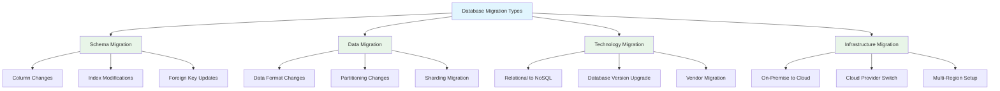

# System Design: Database Migration Strategies

Database migration is a critical operation that involves moving data from one database system to another or reorganizing data within the same system. This process is necessary for scaling applications, upgrading database versions, changing database technologies, or migrating to cloud platforms. Successful database migration requires careful planning, execution strategies that minimize downtime, and comprehensive validation procedures.

## Types of Database Migration

Database migrations can be categorized based on the scope and complexity of the operation:



### Schema Migration
Schema migration involves modifying the structure of the database without changing the underlying data. This includes adding, removing, or modifying columns, tables, indexes, and relationships.

### Data Migration
Data migration involves transforming and moving data from one format or location to another, often accompanying schema changes.

### Technology Migration
Technology migration involves switching to different database technologies, such as moving from MySQL to PostgreSQL or from relational to NoSQL databases.

### Infrastructure Migration
Infrastructure migration involves moving databases to different hosting environments, such as from on-premises to cloud platforms.

## Zero-Downtime Migration Approaches

### 1. Blue-Green Deployment Strategy

The blue-green deployment strategy maintains two identical production environments and switches traffic between them during migration.

```go
// Blue-Green Migration Controller
package main

import (
    "context"
    "database/sql"
    "fmt"
    "sync"
    "time"

    _ "github.com/lib/pq" // PostgreSQL driver
)

// DatabaseEnvironment represents a database environment (blue or green)
type DatabaseEnvironment struct {
    Name     string
    Host     string
    Port     int
    Database string
    Status   string // "active", "standby", "migrating", "ready"
    Version  string
}

// MigrationStep represents a step in the database migration process
type MigrationStep struct {
    ID          string
    Description string
    Action      func() error
    Rollback    func() error
    Status      string // "pending", "running", "completed", "failed"
    StartTime   time.Time
    EndTime     time.Time
}

// BlueGreenMigrator manages blue-green database migrations
type BlueGreenMigrator struct {
    blueEnv   *DatabaseEnvironment
    greenEnv  *DatabaseEnvironment
    current   *DatabaseEnvironment // Currently active environment
    mutex     sync.RWMutex
    steps     []MigrationStep
}

func NewBlueGreenMigrator(blueEnv, greenEnv DatabaseEnvironment) *BlueGreenMigrator {
    migrator := &BlueGreenMigrator{
        blueEnv:  &blueEnv,
        greenEnv: &greenEnv,
        current:  &blueEnv, // Start with blue as active
    }
    
    return migrator
}

// Migrate executes a blue-green migration
func (bgm *BlueGreenMigrator) Migrate(ctx context.Context) error {
    bgm.mutex.Lock()
    defer bgm.mutex.Unlock()
    
    fmt.Printf("Starting blue-green migration from %s to %s\n", bgm.current.Name, bgm.getInactiveEnv().Name)
    
    // Prepare inactive environment
    inactiveEnv := bgm.getInactiveEnv()
    inactiveEnv.Status = "migrating"
    
    // Execute migration steps
    steps := bgm.createMigrationSteps(inactiveEnv, bgm.current)
    for i := range steps {
        step := &steps[i]
        bgm.steps = append(bgm.steps, *step)
        
        fmt.Printf("Executing step: %s\n", step.Description)
        startTime := time.Now()
        step.StartTime = startTime
        
        if err := step.Action(); err != nil {
            step.Status = "failed"
            step.EndTime = time.Now()
            return fmt.Errorf("migration step failed: %w", err)
        }
        
        step.Status = "completed"
        step.EndTime = time.Now()
    }
    
    // Switch traffic to new environment
    bgm.current = inactiveEnv
    bgm.current.Status = "active"
    bgm.getInactiveEnv().Status = "standby"
    
    fmt.Printf("Migration completed. Active environment: %s\n", bgm.current.Name)
    return nil
}

// createMigrationSteps creates the steps for blue-green migration
func (bgm *BlueGreenMigrator) createMigrationSteps(targetEnv, sourceEnv *DatabaseEnvironment) []MigrationStep {
    return []MigrationStep{
        {
            ID:          "validate-source",
            Description: "Validate source database connectivity",
            Action: func() error {
                return bgm.validateDatabase(sourceEnv)
            },
            Status: "pending",
        },
        {
            ID:          "provision-target",
            Description: "Provision target database infrastructure",
            Action: func() error {
                return bgm.provisionDatabase(targetEnv)
            },
            Status: "pending",
        },
        {
            ID:          "schema-migration",
            Description: "Migrate database schema",
            Action: func() error {
                return bgm.migrateSchema(targetEnv, sourceEnv)
            },
            Status: "pending",
        },
        {
            ID:          "data-migration",
            Description: "Migrate database data",
            Action: func() error {
                return bgm.migrateData(targetEnv, sourceEnv)
            },
            Status: "pending",
        },
        {
            ID:          "validation",
            Description: "Validate migrated data",
            Action: func() error {
                return bgm.validateMigratedData(targetEnv, sourceEnv)
            },
            Status: "pending",
        },
    }
}

// validateDatabase validates database connectivity
func (bgm *BlueGreenMigrator) validateDatabase(env *DatabaseEnvironment) error {
    connString := fmt.Sprintf("host=%s port=%d dbname=%s sslmode=disable", 
                             env.Host, env.Port, env.Database)
    
    db, err := sql.Open("postgres", connString)
    if err != nil {
        return err
    }
    defer db.Close()
    
    return db.Ping()
}

// provisionDatabase provisions the target database
func (bgm *BlueGreenMigrator) provisionDatabase(env *DatabaseEnvironment) error {
    // In a real implementation, this would call infrastructure APIs
    // to provision the database instance
    fmt.Printf("Provisioning database at %s:%d/%s\n", env.Host, env.Port, env.Database)
    return nil
}

// migrateSchema migrates database schema
func (bgm *BlueGreenMigrator) migrateSchema(targetEnv, sourceEnv *DatabaseEnvironment) error {
    fmt.Printf("Migrating schema from %s to %s\n", sourceEnv.Name, targetEnv.Name)
    
    // In a real implementation, this would:
    // 1. Extract schema from source
    // 2. Apply schema to target
    // 3. Handle schema differences
    
    return nil
}

// migrateData migrates database data
func (bgm *BlueGreenMigrator) migrateData(targetEnv, sourceEnv *DatabaseEnvironment) error {
    fmt.Printf("Migrating data from %s to %s\n", sourceEnv.Name, targetEnv.Name)
    
    // In a real implementation, this would:
    // 1. Copy data from source to target
    // 2. Handle large datasets with chunking
    // 3. Maintain data consistency
    
    return nil
}

// validateMigratedData validates the migrated data
func (bgm *BlueGreenMigrator) validateMigratedData(targetEnv, sourceEnv *DatabaseEnvironment) error {
    fmt.Printf("Validating data consistency between %s and %s\n", sourceEnv.Name, targetEnv.Name)
    
    // In a real implementation, this would:
    // 1. Compare record counts
    // 2. Check data integrity
    // 3. Verify key constraints
    
    return nil
}

// getInactiveEnv returns the environment that is not currently active
func (bgm *BlueGreenMigrator) getInactiveEnv() *DatabaseEnvironment {
    if bgm.current == bgm.blueEnv {
        return bgm.greenEnv
    }
    return bgm.blueEnv
}

// GetStatus returns the current migration status
func (bgm *BlueGreenMigrator) GetStatus() map[string]interface{} {
    bgm.mutex.RLock()
    defer bgm.mutex.RUnlock()
    
    return map[string]interface{}{
        "active_environment": bgm.current.Name,
        "blue_status":        bgm.blueEnv.Status,
        "green_status":       bgm.greenEnv.Status,
        "steps_completed":    len(bgm.steps),
        "migration_steps":    bgm.steps,
    }
}

// Example usage
func main() {
    blueEnv := DatabaseEnvironment{
        Name:     "blue",
        Host:     "blue-db.example.com",
        Port:     5432,
        Database: "myapp_prod",
        Status:   "active",
        Version:  "12.4",
    }
    
    greenEnv := DatabaseEnvironment{
        Name:     "green", 
        Host:     "green-db.example.com",
        Port:     5432,
        Database: "myapp_prod",
        Status:   "standby",
        Version:  "13.2", // Newer version example
    }
    
    migrator := NewBlueGreenMigrator(blueEnv, greenEnv)
    
    ctx := context.Background()
    if err := migrator.Migrate(ctx); err != nil {
        fmt.Printf("Migration failed: %v\n", err)
        return
    }
    
    fmt.Println("Migration status:", migrator.GetStatus())
}
```

### 2. Dual-Write Strategy

The dual-write strategy involves writing data to both the old and new databases simultaneously during a transition period.

```go
// Dual-Write Migration Strategy
package main

import (
    "context"
    "database/sql"
    "fmt"
    "sync"
    "time"

    _ "github.com/lib/pq" // PostgreSQL driver
)

// DualWriteManager manages simultaneous writes to old and new databases
type DualWriteManager struct {
    oldDB    *sql.DB
    newDB    *sql.DB
    config   DualWriteConfig
    mutex    sync.RWMutex
    stats    DualWriteStats
}

type DualWriteConfig struct {
    EnableDualWrite  bool
    WriteTimeout     time.Duration
    Reconciliation   bool // Whether to reconcile differences
    ReconciliationWorker bool
}

type DualWriteStats struct {
    OldWriteSuccess int64
    NewWriteSuccess int64
    OldWriteFailures int64
    NewWriteFailures int64
    OldWriteCount   int64
    NewWriteCount   int64
}

// WriteResult represents the result of a dual-write operation
type WriteResult struct {
    OldSuccess bool
    NewSuccess bool
    Error      error
    Timestamp  time.Time
}

// WriteOperation represents a database write operation
type WriteOperation struct {
    Query     string
    Args      []interface{}
    TableName string
    ID        string
}

func NewDualWriteManager(oldDB, newDB *sql.DB) *DualWriteManager {
    return &DualWriteManager{
        oldDB: oldDB,
        newDB: newDB,
        config: DualWriteConfig{
            EnableDualWrite:    true,
            WriteTimeout:       5 * time.Second,
            Reconciliation:     true,
            ReconciliationWorker: true,
        },
        stats: DualWriteStats{},
    }
}

// ExecuteWriteWithDualWrite performs a write operation with dual-write support
func (dwm *DualWriteManager) ExecuteWriteWithDualWrite(ctx context.Context, operation WriteOperation) *WriteResult {
    result := &WriteResult{
        Timestamp: time.Now(),
    }
    
    dwm.mutex.Lock()
    dwm.stats.OldWriteCount++
    dwm.stats.NewWriteCount++
    dwm.mutex.Unlock()
    
    // Execute on old database
    oldCtx, oldCancel := context.WithTimeout(ctx, dwm.config.WriteTimeout)
    defer oldCancel()
    
    oldResult := make(chan error, 1)
    go func() {
        defer close(oldResult)
        _, err := dwm.oldDB.ExecContext(oldCtx, operation.Query, operation.Args...)
        oldResult <- err
    }()
    
    // Execute on new database
    newCtx, newCancel := context.WithTimeout(ctx, dwm.config.WriteTimeout)
    defer newCancel()
    
    newResult := make(chan error, 1)
    go func() {
        defer close(newResult)
        _, err := dwm.newDB.ExecContext(newCtx, operation.Query, operation.Args...)
        newResult <- err
    }()
    
    // Wait for results
    oldErr := <-oldResult
    newErr := <-newResult
    
    result.OldSuccess = oldErr == nil
    result.NewSuccess = newErr == nil
    
    if !result.OldSuccess {
        dwm.mutex.Lock()
        dwm.stats.OldWriteFailures++
        dwm.mutex.Unlock()
    } else {
        dwm.mutex.Lock()
        dwm.stats.OldWriteSuccess++
        dwm.mutex.Unlock()
    }
    
    if !result.NewSuccess {
        dwm.mutex.Lock()
        dwm.stats.NewWriteFailures++
        dwm.mutex.Unlock()
    } else {
        dwm.mutex.Lock()
        dwm.stats.NewWriteSuccess++
        dwm.mutex.Unlock()
    }
    
    // If new database failed, log for later reconciliation
    if !result.NewSuccess && dwm.config.Reconciliation {
        dwm.logFailedWrite(operation, newErr)
    }
    
    return result
}

// logFailedWrite logs failed writes for reconciliation
func (dwm *DualWriteManager) logFailedWrite(operation WriteOperation, err error) {
    // In a real implementation, this would log to a queue for reconciliation
    fmt.Printf("Failed write to new DB (will be reconciled): %s, Error: %v\n", operation.Query, err)
}

// MigrateReads gradually shifts reads from old to new database
func (dwm *DualWriteManager) MigrateReads(ctx context.Context, query string, args ...interface{}) (*sql.Rows, error) {
    // In a gradual migration, you might start with 100% reads from old DB
    // and gradually increase percentage to new DB
    
    // For this example, we'll implement a simple percentage-based approach
    readPercentage := 0.7 // 70% reads from new DB
    
    if rand.Float64() < readPercentage {
        // Read from new database
        return dwm.newDB.QueryContext(ctx, query, args...)
    } else {
        // Read from old database
        return dwm.oldDB.QueryContext(ctx, query, args...)
    }
}

// StartReconciliationWorker starts a background worker for data reconciliation
func (dwm *DualWriteManager) StartReconciliationWorker(ctx context.Context) {
    if !dwm.config.ReconciliationWorker {
        return
    }
    
    go func() {
        ticker := time.NewTicker(30 * time.Second)
        defer ticker.Stop()
        
        for {
            select {
            case <-ctx.Done():
                return
            case <-ticker.C:
                dwm.performReconciliation()
            }
        }
    }()
}

// performReconciliation attempts to reconcile data differences
func (dwm *DualWriteManager) performReconciliation() {
    fmt.Println("Performing reconciliation...")
    
    // In a real implementation, this would:
    // 1. Check for failed writes in the log
    // 2. Attempt to replay them
    // 3. Compare data between old and new databases
    // 4. Identify and resolve discrepancies
    
    // This is a simplified example
    fmt.Println("Reconciliation completed")
}

// GetStats returns migration statistics
func (dwm *DualWriteManager) GetStats() DualWriteStats {
    dwm.mutex.RLock()
    defer dwm.mutex.RUnlock()
    
    return dwm.stats
}

// SwitchReadsToNew switches all reads to the new database
func (dwm *DualWriteManager) SwitchReadsToNew() {
    dwm.mutex.Lock()
    defer dwm.mutex.Unlock()
    
    fmt.Println("Switching all reads to new database")
    // In a real system, this would update configuration to direct all reads to new DB
}

// DisableDualWrite disables dual-write, switching to new database only
func (dwm *DualWriteManager) DisableDualWrite() {
    dwm.mutex.Lock()
    defer dwm.mutex.Unlock()
    
    dwm.config.EnableDualWrite = false
    fmt.Println("Dual-write disabled, using new database only")
}

import "math/rand"

// Example usage
func main() {
    // In a real example, we would connect to actual databases
    fmt.Println("Dual-Write Migration Strategy Example")
    
    // Create dual write manager
    // For this example, we'll simulate
    manager := &DualWriteManager{
        config: DualWriteConfig{
            EnableDualWrite:    true,
            WriteTimeout:       5 * time.Second,
            Reconciliation:     true,
            ReconciliationWorker: true,
        },
        stats: DualWriteStats{},
    }
    
    // Perform some writes
    for i := 0; i < 5; i++ {
        operation := WriteOperation{
            Query:     "INSERT INTO users (id, name, email) VALUES ($1, $2, $3)",
            Args:      []interface{}{fmt.Sprintf("user_%d", i), fmt.Sprintf("User %d", i), fmt.Sprintf("user%d@example.com", i)},
            TableName: "users",
            ID:        fmt.Sprintf("user_%d", i),
        }
        
        result := manager.ExecuteWriteWithDualWrite(context.Background(), operation)
        fmt.Printf("Write result (user_%d): Old Success=%t, New Success=%t\n", 
                   i, result.OldSuccess, result.NewSuccess)
        
        time.Sleep(100 * time.Millisecond)
    }
    
    // Show stats
    stats := manager.GetStats()
    fmt.Printf("Migration Stats: %+v\n", stats)
    
    fmt.Println("Dual-write migration strategy example completed")
}
```

### 3. Log-Based Replication Strategy

Log-based replication uses database transaction logs to capture changes and replicate them to the target system.

```go
// Log-based replication implementation
package main

import (
    "context"
    "fmt"
    "sync"
    "time"
)

// ChangeEvent represents a database change event
type ChangeEvent struct {
    ID          string      `json:"id"`
    Operation   string      `json:"operation"`  // "INSERT", "UPDATE", "DELETE"
    TableName   string      `json:"table_name"`
    Keys        map[string]interface{} `json:"keys"`  // Primary key values
    OldValues   map[string]interface{} `json:"old_values"`
    NewValues   map[string]interface{} `json:"new_values"`
    Timestamp   time.Time   `json:"timestamp"`
    TransactionID string    `json:"transaction_id"`
    LSN         string      `json:"lsn"` // Log Sequence Number
}

// ChangeLog represents a collection of database changes
type ChangeLog struct {
    Events []ChangeEvent
    mutex  sync.RWMutex
}

// LogBasedReplicator handles log-based database replication
type LogBasedReplicator struct {
    sourceDB   *DatabaseConnection
    targetDB   *DatabaseConnection
    changeLog  *ChangeLog
    position   string // Current replication position (LSN or timestamp)
    mutex      sync.RWMutex
    callbacks  map[string]func(ChangeEvent)
}

// DatabaseConnection simulates a database connection
type DatabaseConnection struct {
    name string
    changes []ChangeEvent
}

func NewDatabaseConnection(name string) *DatabaseConnection {
    return &DatabaseConnection{
        name: name,
        changes: make([]ChangeEvent, 0),
    }
}

// AddChange simulates adding a change to the database log
func (dbc *DatabaseConnection) AddChange(event ChangeEvent) {
    dbc.changes = append(dbc.changes, event)
}

// GetChangesSince returns changes since a specific position
func (dbc *DatabaseConnection) GetChangesSince(position string) []ChangeEvent {
    // For this example, we'll return all changes
    // In a real implementation, this would filter by LSN or timestamp
    return dbc.changes
}

func NewLogBasedReplicator(sourceDB, targetDB *DatabaseConnection) *LogBasedReplicator {
    return &LogBasedReplicator{
        sourceDB:  sourceDB,
        targetDB:  targetDB,
        changeLog: &ChangeLog{Events: make([]ChangeEvent, 0)},
        callbacks: make(map[string]func(ChangeEvent)),
    }
}

// StartReplication begins continuous log-based replication
func (lbr *LogBasedReplicator) StartReplication(ctx context.Context) error {
    fmt.Println("Starting log-based replication")
    
    ticker := time.NewTicker(1 * time.Second)
    defer ticker.Stop()
    
    for {
        select {
        case <-ctx.Done():
            return ctx.Err()
        case <-ticker.C:
            if err := lbr.replicateChanges(); err != nil {
                fmt.Printf("Replication error: %v\n", err)
                // Continue replication despite errors
                continue
            }
        }
    }
}

// replicateChanges replicates changes from source to target database
func (lbr *LogBasedReplicator) replicateChanges() error {
    changes := lbr.sourceDB.GetChangesSince(lbr.position)
    
    if len(changes) == 0 {
        return nil
    }
    
    fmt.Printf("Replicating %d changes\n", len(changes))
    
    for _, change := range changes {
        if err := lbr.applyChangeToTarget(change); err != nil {
            return fmt.Errorf("failed to apply change %s: %w", change.ID, err)
        }
        
        // Update position
        lbr.position = change.LSN
    }
    
    return nil
}

// applyChangeToTarget applies a change event to the target database
func (lbr *LogBasedReplicator) applyChangeToTarget(change ChangeEvent) error {
    switch change.Operation {
    case "INSERT":
        return lbr.executeInsert(change)
    case "UPDATE":
        return lbr.executeUpdate(change)
    case "DELETE":
        return lbr.executeDelete(change)
    default:
        return fmt.Errorf("unsupported operation: %s", change.Operation)
    }
}

// executeInsert executes an insert operation on the target database
func (lbr *LogBasedReplicator) executeInsert(change ChangeEvent) error {
    // In a real implementation, this would construct and execute an INSERT statement
    fmt.Printf("Applying INSERT to %s: %v\n", change.TableName, change.NewValues)
    
    // Add to target database
    lbr.targetDB.AddChange(change)
    
    // Execute callback if registered
    if callback, exists := lbr.callbacks["INSERT_"+change.TableName]; exists {
        callback(change)
    }
    
    return nil
}

// executeUpdate executes an update operation on the target database
func (lbr *LogBasedReplicator) executeUpdate(change ChangeEvent) error {
    // In a real implementation, this would construct and execute an UPDATE statement
    fmt.Printf("Applying UPDATE to %s: %v\n", change.TableName, change.NewValues)
    
    // Add to target database
    lbr.targetDB.AddChange(change)
    
    // Execute callback if registered
    if callback, exists := lbr.callbacks["UPDATE_"+change.TableName]; exists {
        callback(change)
    }
    
    return nil
}

// executeDelete executes a delete operation on the target database
func (lbr *LogBasedReplicator) executeDelete(change ChangeEvent) error {
    // In a real implementation, this would construct and execute a DELETE statement
    fmt.Printf("Applying DELETE to %s: keys=%v\n", change.TableName, change.Keys)
    
    // Add to target database
    lbr.targetDB.AddChange(change)
    
    // Execute callback if registered
    if callback, exists := lbr.callbacks["DELETE_"+change.TableName]; exists {
        callback(change)
    }
    
    return nil
}

// RegisterCallback registers a callback for specific operation and table
func (lbr *LogBasedReplicator) RegisterCallback(operation, tableName string, callback func(ChangeEvent)) {
    lbr.callbacks[operation+"_"+tableName] = callback
}

// GetReplicationStats returns replication statistics
func (lbr *LogBasedReplicator) GetReplicationStats() map[string]interface{} {
    lbr.mutex.RLock()
    defer lbr.mutex.RUnlock()
    
    return map[string]interface{}{
        "source_changes": len(lbr.sourceDB.changes),
        "target_changes": len(lbr.targetDB.changes),
        "position":       lbr.position,
        "lag_seconds":    time.Since(time.Now()).Seconds(), // Simplified
    }
}

// Example usage
func main() {
    fmt.Println("Log-Based Replication Example")
    
    // Create source and target databases
    sourceDB := NewDatabaseConnection("source")
    targetDB := NewDatabaseConnection("target")
    
    replicator := NewLogBasedReplicator(sourceDB, targetDB)
    
    // Register a callback for user updates
    replicator.RegisterCallback("UPDATE", "users", func(change ChangeEvent) {
        fmt.Printf("User update replicated: %v\n", change.NewValues)
    })
    
    // Simulate some changes in source database
    go func() {
        for i := 0; i < 10; i++ {
            change := ChangeEvent{
                ID:          fmt.Sprintf("change_%d", i),
                Operation:   "INSERT",
                TableName:   "users",
                Keys:        map[string]interface{}{"id": fmt.Sprintf("user_%d", i)},
                NewValues:   map[string]interface{}{"id": fmt.Sprintf("user_%d", i), "name": fmt.Sprintf("User %d", i)},
                Timestamp:   time.Now().Add(time.Duration(i) * time.Second),
                TransactionID: fmt.Sprintf("txn_%d", i),
                LSN:         fmt.Sprintf("lsn_%d", i),
            }
            
            sourceDB.AddChange(change)
            fmt.Printf("Added change to source: %s\n", change.ID)
            
            time.Sleep(2 * time.Second)
        }
    }()
    
    // Start replication in background
    ctx, cancel := context.WithTimeout(context.Background(), 30*time.Second)
    defer cancel()
    
    go func() {
        if err := replicator.StartReplication(ctx); err != nil {
            fmt.Printf("Replication error: %v\n", err)
        }
    }()
    
    // Monitor replication stats
    statsTicker := time.NewTicker(5 * time.Second)
    go func() {
        for range statsTicker.C {
            stats := replicator.GetReplicationStats()
            fmt.Printf("Replication Stats: %+v\n", stats)
        }
    }()
    
    time.Sleep(25 * time.Second)
    statsTicker.Stop()
    
    fmt.Println("Log-based replication example completed")
}
```

## Data Validation and Consistency Verification

### Data Integrity Checks

```go
// Data validation and consistency verification
package main

import (
    "context"
    "database/sql"
    "fmt"
    "hash/fnv"
    "sync"
    "time"

    _ "github.com/lib/pq" // PostgreSQL driver
)

// DataValidator performs data validation and consistency checks
type DataValidator struct {
    sourceDB *sql.DB
    targetDB *sql.DB
    config   DataValidationConfig
    results  []ValidationResult
    mutex    sync.RWMutex
}

type DataValidationConfig struct {
    BatchSize    int
    Timeout      time.Duration
    Parallelism  int
    SampleSize   int  // Number of records to validate (0 for all)
    ValidationType string // "full", "sample", "checksum"
}

type ValidationResult struct {
    TableName    string
    ValidationType string
    RecordCount  int64
    MismatchCount int64
    Error        error
    StartTime    time.Time
    EndTime      time.Time
    Success      bool
}

func NewDataValidator(sourceDB, targetDB *sql.DB) *DataValidator {
    return &DataValidator{
        sourceDB: sourceDB,
        targetDB: targetDB,
        config: DataValidationConfig{
            BatchSize:    1000,
            Timeout:      30 * time.Second,
            Parallelism:  5,
            SampleSize:   0, // Validate all by default
            ValidationType: "full",
        },
        results: make([]ValidationResult, 0),
    }
}

// ValidateTable validates a specific table for data consistency
func (dv *DataValidator) ValidateTable(ctx context.Context, tableName string) (*ValidationResult, error) {
    result := &ValidationResult{
        TableName:    tableName,
        ValidationType: dv.config.ValidationType,
        StartTime:    time.Now(),
    }
    
    defer func() {
        result.EndTime = time.Now()
        dv.mutex.Lock()
        dv.results = append(dv.results, *result)
        dv.mutex.Unlock()
    }()
    
    switch dv.config.ValidationType {
    case "checksum":
        return dv.validateByChecksum(ctx, tableName, result)
    case "sample":
        return dv.validateBySampling(ctx, tableName, result)
    case "full":
        fallthrough
    default:
        return dv.validateFull(ctx, tableName, result)
    }
}

// validateFull performs full data validation by comparing records
func (dv *DataValidator) validateFull(ctx context.Context, tableName string, result *ValidationResult) (*ValidationResult, error) {
    // Count records in both databases
    sourceCount, err := dv.countRecords(ctx, dv.sourceDB, tableName)
    if err != nil {
        result.Error = err
        result.Success = false
        return result, err
    }
    
    targetCount, err := dv.countRecords(ctx, dv.targetDB, tableName)
    if err != nil {
        result.Error = err
        result.Success = false
        return result, err
    }
    
    result.RecordCount = sourceCount
    
    if sourceCount != targetCount {
        result.MismatchCount = abs(sourceCount - targetCount)
        result.Success = false
        return result, fmt.Errorf("record count mismatch: source=%d, target=%d", sourceCount, targetCount)
    }
    
    // If counts match, perform detailed record validation
    // In a real implementation, this would compare individual records
    fmt.Printf("Validating %d records in table %s\n", sourceCount, tableName)
    
    // For this example, we'll assume validation passes if counts match
    result.Success = true
    return result, nil
}

// validateByChecksum validates using checksums for efficiency
func (dv *DataValidator) validateByChecksum(ctx context.Context, tableName string, result *ValidationResult) (*ValidationResult, error) {
    // Calculate checksums for both databases
    sourceChecksum, err := dv.calculateChecksum(ctx, dv.sourceDB, tableName)
    if err != nil {
        result.Error = err
        result.Success = false
        return result, err
    }
    
    targetChecksum, err := dv.calculateChecksum(ctx, dv.targetDB, tableName)
    if err != nil {
        result.Error = err
        result.Success = false
        return result, err
    }
    
    result.RecordCount, _ = dv.countRecords(ctx, dv.sourceDB, tableName)
    
    if sourceChecksum != targetChecksum {
        result.MismatchCount = 1
        result.Success = false
        result.Error = fmt.Errorf("checksum mismatch: source=%d, target=%d", sourceChecksum, targetChecksum)
        return result, result.Error
    }
    
    result.Success = true
    return result, nil
}

// validateBySampling validates a sample of records
func (dv *DataValidator) validateBySampling(ctx context.Context, tableName string, result *ValidationResult) (*ValidationResult, error) {
    sampleSize := dv.config.SampleSize
    if sampleSize == 0 {
        // Default to 10% of records or 1000, whichever is smaller
        totalCount, err := dv.countRecords(ctx, dv.sourceDB, tableName)
        if err != nil {
            result.Error = err
            result.Success = false
            return result, err
        }
        
        sampleSize = int(min(int64(1000), totalCount/10))
        if sampleSize == 0 {
            sampleSize = 1
        }
    }
    
    result.RecordCount = int64(sampleSize)
    
    // In a real implementation, this would select random records for validation
    fmt.Printf("Validating %d samples from table %s\n", sampleSize, tableName)
    
    // For this example, we'll simulate sampling validation
    result.Success = true
    return result, nil
}

// countRecords returns the number of records in a table
func (dv *DataValidator) countRecords(ctx context.Context, db *sql.DB, tableName string) (int64, error) {
    query := fmt.Sprintf("SELECT COUNT(*) FROM %s", tableName)
    
    ctx, cancel := context.WithTimeout(ctx, dv.config.Timeout)
    defer cancel()
    
    var count int64
    err := db.QueryRowContext(ctx, query).Scan(&count)
    return count, err
}

// calculateChecksum calculates a simple checksum for a table
func (dv *DataValidator) calculateChecksum(ctx context.Context, db *sql.DB, tableName string) (uint64, error) {
    query := fmt.Sprintf("SELECT * FROM %s ORDER BY id", tableName) // Assumes id column exists
    
    ctx, cancel := context.WithTimeout(ctx, dv.config.Timeout)
    defer cancel()
    
    rows, err := db.QueryContext(ctx, query)
    if err != nil {
        return 0, err
    }
    defer rows.Close()
    
    hasher := fnv.New64a()
    
    for rows.Next() {
        // In a real implementation, we would read the actual row data and hash it
        // For simplicity, we're just hashing the row index
        rowData := fmt.Sprintf("%v", rows)
        hasher.Write([]byte(rowData))
    }
    
    return hasher.Sum64(), nil
}

// ValidateAllTables validates all tables in the database
func (dv *DataValidator) ValidateAllTables(ctx context.Context, tableNames []string) ([]ValidationResult, error) {
    results := make([]ValidationResult, 0)
    var wg sync.WaitGroup
    semaphore := make(chan struct{}, dv.config.Parallelism)
    
    resultChan := make(chan ValidationResult, len(tableNames))
    
    for _, tableName := range tableNames {
        wg.Add(1)
        go func(name string) {
            defer wg.Done()
            semaphore <- struct{}{}
            defer func() { <-semaphore }()
            
            result, err := dv.ValidateTable(ctx, name)
            if err != nil {
                fmt.Printf("Validation error for table %s: %v\n", name, err)
            }
            
            if result != nil {
                resultChan <- *result
            }
        }(tableName)
    }
    
    go func() {
        wg.Wait()
        close(resultChan)
    }()
    
    for result := range resultChan {
        results = append(results, result)
        fmt.Printf("Validation result for %s: Success=%t, Mismatches=%d\n", 
                   result.TableName, result.Success, result.MismatchCount)
    }
    
    return results, nil
}

// GetValidationReport generates a validation report
func (dv *DataValidator) GetValidationReport() ValidationReport {
    dv.mutex.RLock()
    defer dv.mutex.RUnlock()
    
    report := ValidationReport{
        TotalTables:        len(dv.results),
        SuccessfulValidations: 0,
        FailedValidations:    0,
        TotalMismatches:      0,
        StartTime:           time.Now(), // Would be actual start time in real implementation
        EndTime:             time.Now(),
    }
    
    for _, result := range dv.results {
        if result.Success {
            report.SuccessfulValidations++
        } else {
            report.FailedValidations++
        }
        report.TotalMismatches += result.MismatchCount
    }
    
    return report
}

type ValidationReport struct {
    TotalTables            int
    SuccessfulValidations  int
    FailedValidations      int
    TotalMismatches        int64
    StartTime             time.Time
    EndTime               time.Time
    Results               []ValidationResult
}

// Helper functions
func abs(x int64) int64 {
    if x < 0 {
        return -x
    }
    return x
}

func min(a, b int64) int64 {
    if a < b {
        return a
    }
    return b
}

// Example usage
func main() {
    fmt.Println("Data Validation and Consistency Verification Example")
    
    // In a real example, we would connect to actual databases
    // For this example, we'll simulate the validation process
    
    validator := &DataValidator{
        config: DataValidationConfig{
            BatchSize:    1000,
            Timeout:      30 * time.Second,
            Parallelism:  5,
            SampleSize:   0,
            ValidationType: "full",
        },
        results: make([]ValidationResult, 0),
    }
    
    // Simulate validating some tables
    tableNames := []string{"users", "orders", "products", "categories"}
    
    ctx, cancel := context.WithTimeout(context.Background(), 30*time.Second)
    defer cancel()
    
    results, err := validator.ValidateAllTables(ctx, tableNames)
    if err != nil {
        fmt.Printf("Validation failed: %v\n", err)
    }
    
    fmt.Printf("Validation completed with %d results\n", len(results))
    
    // Generate and print report
    report := validator.GetValidationReport()
    fmt.Printf("Validation Report: %d total, %d successful, %d failed, %d mismatches\n",
               report.TotalTables, report.SuccessfulValidations, report.FailedValidations, report.TotalMismatches)
}
```

## Migration Planning and Execution

### Migration Timeline and Phases

```go
// Migration Planning and Execution Framework
package main

import (
    "context"
    "fmt"
    "sync"
    "time"
)

// MigrationPhase represents a phase in the migration process
type MigrationPhase struct {
    ID           string
    Name         string
    Description  string
    Dependencies []string // Phase IDs that must complete before this phase
    Tasks        []MigrationTask
    Status       string // "pending", "in_progress", "completed", "failed"
    StartTime    *time.Time
    EndTime      *time.Time
    Error        string
}

// MigrationTask represents a specific task within a migration phase
type MigrationTask struct {
    ID          string
    Name        string
    Description string
    Action      func() error
    Rollback    func() error
    Priority    int // Lower numbers are higher priority
    Status      string // "pending", "running", "completed", "failed"
    Dependencies []string // Task IDs that must complete before this task
}

// MigrationPlan represents the complete migration plan
type MigrationPlan struct {
    ID            string
    Name          string
    Description   string
    Phases        []MigrationPhase
    CurrentPhase  int
    Status        string // "planned", "in_progress", "completed", "failed", "rolled_back"
    CreatedAt     time.Time
    StartedAt     *time.Time
    CompletedAt   *time.Time
    RollbackPlan  *RollbackPlan
    mutex         sync.RWMutex
}

// RollbackPlan contains information for rolling back a migration
type RollbackPlan struct {
    Steps []RollbackStep
    Status string // "available", "executing", "completed", "failed"
}

type RollbackStep struct {
    TaskID string
    Action func() error
    Status string // "pending", "completed", "failed"
}

// MigrationManager manages the execution of database migrations
type MigrationManager struct {
    plans  map[string]*MigrationPlan
    mutex  sync.RWMutex
}

func NewMigrationManager() *MigrationManager {
    return &MigrationManager{
        plans: make(map[string]*MigrationPlan),
    }
}

// CreatePlan creates a new migration plan
func (mm *MigrationManager) CreatePlan(plan MigrationPlan) error {
    mm.mutex.Lock()
    defer mm.mutex.Unlock()
    
    plan.ID = fmt.Sprintf("migration_%d", time.Now().UnixNano())
    plan.Status = "planned"
    plan.CreatedAt = time.Now()
    
    mm.plans[plan.ID] = &plan
    fmt.Printf("Migration plan created: %s - %s\n", plan.ID, plan.Name)
    
    return nil
}

// ExecutePlan executes a migration plan
func (mm *MigrationManager) ExecutePlan(ctx context.Context, planID string) error {
    mm.mutex.Lock()
    plan, exists := mm.plans[planID]
    if !exists {
        mm.mutex.Unlock()
        return fmt.Errorf("migration plan %s not found", planID)
    }
    
    if plan.Status != "planned" {
        mm.mutex.Unlock()
        return fmt.Errorf("migration plan %s is not in planned status", planID)
    }
    
    plan.Status = "in_progress"
    now := time.Now()
    plan.StartedAt = &now
    mm.mutex.Unlock()
    
    fmt.Printf("Starting migration plan execution: %s\n", planID)
    
    // Execute phases in order
    for i := range plan.Phases {
        phase := &plan.Phases[i]
        
        if err := mm.executePhase(ctx, plan, phase); err != nil {
            plan.Status = "failed"
            completedAt := time.Now()
            plan.CompletedAt = &completedAt
            return fmt.Errorf("phase %s failed: %w", phase.ID, err)
        }
    }
    
    mm.mutex.Lock()
    plan.Status = "completed"
    completedAt := time.Now()
    plan.CompletedAt = &completedAt
    mm.mutex.Unlock()
    
    fmt.Printf("Migration plan completed: %s\n", planID)
    return nil
}

// executePhase executes a single migration phase
func (mm *MigrationManager) executePhase(ctx context.Context, plan *MigrationPlan, phase *MigrationPhase) error {
    fmt.Printf("Executing phase: %s - %s\n", phase.ID, phase.Name)
    
    phase.Status = "in_progress"
    startTime := time.Now()
    phase.StartTime = &startTime
    
    // Execute tasks in this phase
    for i := range phase.Tasks {
        task := &phase.Tasks[i]
        
        if err := mm.executeTask(ctx, plan, phase, task); err != nil {
            phase.Status = "failed"
            phase.Error = err.Error()
            endTime := time.Now()
            phase.EndTime = &endTime
            return err
        }
    }
    
    phase.Status = "completed"
    endTime := time.Now()
    phase.EndTime = &endTime
    
    fmt.Printf("Phase completed: %s\n", phase.Name)
    return nil
}

// executeTask executes a single migration task
func (mm *MigrationManager) executeTask(ctx context.Context, plan *MigrationPlan, phase *MigrationPhase, task *MigrationTask) error {
    fmt.Printf("Executing task: %s - %s\n", task.Name, task.Description)
    
    task.Status = "running"
    
    if task.Action == nil {
        task.Status = "completed"
        return nil
    }
    
    err := task.Action()
    if err != nil {
        task.Status = "failed"
        return fmt.Errorf("task %s failed: %w", task.Name, err)
    }
    
    task.Status = "completed"
    return nil
}

// AddPhase adds a phase to an existing migration plan
func (mm *MigrationManager) AddPhase(planID string, phase MigrationPhase) error {
    mm.mutex.Lock()
    defer mm.mutex.Unlock()
    
    plan, exists := mm.plans[planID]
    if !exists {
        return fmt.Errorf("migration plan %s not found", planID)
    }
    
    if plan.Status != "planned" {
        return fmt.Errorf("cannot add phase to plan that is not in planned status")
    }
    
    phase.ID = fmt.Sprintf("phase_%d", len(plan.Phases))
    plan.Phases = append(plan.Phases, phase)
    
    fmt.Printf("Phase added to plan %s: %s\n", planID, phase.Name)
    return nil
}

// GetPlanStatus returns the status of a migration plan
func (mm *MigrationManager) GetPlanStatus(planID string) (*MigrationPlan, error) {
    mm.mutex.RLock()
    defer mm.mutex.RUnlock()
    
    plan, exists := mm.plans[planID]
    if !exists {
        return nil, fmt.Errorf("migration plan %s not found", planID)
    }
    
    return plan, nil
}

// CreateDatabaseMigrationPlan creates a standard database migration plan
func CreateDatabaseMigrationPlan() MigrationPlan {
    return MigrationPlan{
        Name:        "Database Migration to New System",
        Description: "Migrate database from old system to new system with zero downtime",
        Phases: []MigrationPhase{
            {
                Name:        "Preparation",
                Description: "Prepare environment and validate prerequisites",
                Tasks: []MigrationTask{
                    {
                        Name:        "Validate source database connectivity",
                        Description: "Ensure we can connect to source database",
                        Action: func() error {
                            fmt.Println("Validating source database connectivity...")
                            // In real implementation, connect to source DB
                            time.Sleep(1 * time.Second) // Simulate validation
                            return nil
                        },
                    },
                    {
                        Name:        "Validate target database connectivity",
                        Description: "Ensure we can connect to target database",
                        Action: func() error {
                            fmt.Println("Validating target database connectivity...")
                            time.Sleep(1 * time.Second) // Simulate validation
                            return nil
                        },
                    },
                    {
                        Name:        "Check available disk space",
                        Description: "Ensure sufficient space for migration",
                        Action: func() error {
                            fmt.Println("Checking available disk space...")
                            time.Sleep(500 * time.Millisecond)
                            return nil
                        },
                    },
                },
            },
            {
                Name:        "Schema Migration",
                Description: "Migrate database schema to target system",
                Tasks: []MigrationTask{
                    {
                        Name:        "Export schema from source",
                        Description: "Extract schema definition from source database",
                        Action: func() error {
                            fmt.Println("Exporting schema from source database...")
                            time.Sleep(2 * time.Second)
                            return nil
                        },
                    },
                    {
                        Name:        "Transform schema for target",
                        Description: "Convert schema to target database format",
                        Action: func() error {
                            fmt.Println("Transforming schema for target database...")
                            time.Sleep(1 * time.Second)
                            return nil
                        },
                    },
                    {
                        Name:        "Apply schema to target",
                        Description: "Apply transformed schema to target database",
                        Action: func() error {
                            fmt.Println("Applying schema to target database...")
                            time.Sleep(3 * time.Second)
                            return nil
                        },
                    },
                },
            },
            {
                Name:        "Data Migration",
                Description: "Migrate data from source to target database",
                Tasks: []MigrationTask{
                    {
                        Name:        "Estimate data size",
                        Description: "Calculate total data to be migrated",
                        Action: func() error {
                            fmt.Println("Estimating data size...")
                            time.Sleep(1 * time.Second)
                            return nil
                        },
                    },
                    {
                        Name:        "Migrate lookup tables",
                        Description: "Migrate static reference data first",
                        Action: func() error {
                            fmt.Println("Migrating lookup tables...")
                            time.Sleep(2 * time.Second)
                            return nil
                        },
                    },
                    {
                        Name:        "Migrate main tables",
                        Description: "Migrate core business data",
                        Action: func() error {
                            fmt.Println("Migrating main tables...")
                            time.Sleep(5 * time.Second)
                            return nil
                        },
                    },
                    {
                        Name:        "Migrate dependent tables",
                        Description: "Migrate tables that depend on others",
                        Action: func() error {
                            fmt.Println("Migrating dependent tables...")
                            time.Sleep(3 * time.Second)
                            return nil
                        },
                    },
                },
            },
            {
                Name:        "Validation",
                Description: "Validate migrated data and system functionality",
                Tasks: []MigrationTask{
                    {
                        Name:        "Run data integrity checks",
                        Description: "Verify data consistency between source and target",
                        Action: func() error {
                            fmt.Println("Running data integrity checks...")
                            time.Sleep(2 * time.Second)
                            return nil
                        },
                    },
                    {
                        Name:        "Validate business logic",
                        Description: "Test application functionality with new database",
                        Action: func() error {
                            fmt.Println("Validating business logic...")
                            time.Sleep(2 * time.Second)
                            return nil
                        },
                    },
                    {
                        Name:        "Performance testing",
                        Description: "Ensure new database meets performance requirements",
                        Action: func() error {
                            fmt.Println("Running performance tests...")
                            time.Sleep(3 * time.Second)
                            return nil
                        },
                    },
                },
            },
            {
                Name:        "Cutover",
                Description: "Switch traffic from old to new database",
                Tasks: []MigrationTask{
                    {
                        Name:        "Prepare cutover plan",
                        Description: "Finalize cutover procedures and rollback plans",
                        Action: func() error {
                            fmt.Println("Preparing cutover plan...")
                            time.Sleep(1 * time.Second)
                            return nil
                        },
                    },
                    {
                        Name:        "Execute final sync",
                        Description: "Synchronize any last-minute changes",
                        Action: func() error {
                            fmt.Println("Executing final data sync...")
                            time.Sleep(2 * time.Second)
                            return nil
                        },
                    },
                    {
                        Name:        "Switch application traffic",
                        Description: "Update application config to use new database",
                        Action: func() error {
                            fmt.Println("Switching application traffic to new database...")
                            time.Sleep(1 * time.Second)
                            return nil
                        },
                    },
                    {
                        Name:        "Monitor system health",
                        Description: "Verify system stability after cutover",
                        Action: func() error {
                            fmt.Println("Monitoring system health...")
                            time.Sleep(3 * time.Second)
                            return nil
                        },
                    },
                },
            },
        },
    }
}

// Example usage
func main() {
    fmt.Println("Database Migration Planning and Execution Example")
    
    manager := NewMigrationManager()
    
    // Create a migration plan
    plan := CreateDatabaseMigrationPlan()
    err := manager.CreatePlan(plan)
    if err != nil {
        fmt.Printf("Error creating plan: %v\n", err)
        return
    }
    
    // Get the plan ID
    var planID string
    for id := range manager.plans {
        planID = id
        break
    }
    
    fmt.Printf("Created migration plan: %s\n", planID)
    
    // Add an additional phase for post-migration cleanup
    cleanupPhase := MigrationPhase{
        Name:        "Post-Migration Cleanup",
        Description: "Clean up temporary resources and validate success",
        Tasks: []MigrationTask{
            {
                Name:        "Remove old database access",
                Description: "Disable access to old database",
                Action: func() error {
                    fmt.Println("Disabling access to old database...")
                    time.Sleep(1 * time.Second)
                    return nil
                },
            },
            {
                Name:        "Update documentation",
                Description: "Update system documentation with new configuration",
                Action: func() error {
                    fmt.Println("Updating documentation...")
                    time.Sleep(1 * time.Second)
                    return nil
                },
            },
        },
    }
    
    err = manager.AddPhase(planID, cleanupPhase)
    if err != nil {
        fmt.Printf("Error adding phase: %v\n", err)
        return
    }
    
    // Execute the migration plan
    ctx, cancel := context.WithTimeout(context.Background(), 60*time.Second)
    defer cancel()
    
    fmt.Println("Starting migration plan execution...")
    err = manager.ExecutePlan(ctx, planID)
    if err != nil {
        fmt.Printf("Migration plan execution failed: %v\n", err)
        return
    }
    
    // Get final status
    finalPlan, err := manager.GetPlanStatus(planID)
    if err != nil {
        fmt.Printf("Error getting plan status: %v\n", err)
        return
    }
    
    fmt.Printf("Migration plan completed with status: %s\n", finalPlan.Status)
    
    // Print phase results
    for _, phase := range finalPlan.Phases {
        fmt.Printf("Phase: %s - Status: %s\n", phase.Name, phase.Status)
    }
}
```

## Rollback Strategies

### Safe Rollback Procedures

```go
// Rollback strategies and procedures
package main

import (
    "context"
    "fmt"
    "sync"
    "time"
)

// RollbackManager handles rollback operations for failed migrations
type RollbackManager struct {
    activeRollbacks map[string]*RollbackOperation
    mutex          sync.RWMutex
}

type RollbackOperation struct {
    ID             string
    MigrationPlanID string
    Reason         string
    Steps          []RollbackStep
    CurrentStep    int
    Status         string // "initiated", "in_progress", "completed", "failed"
    StartTime      time.Time
    EndTime        *time.Time
    Error          string
}

type RollbackStep struct {
    ID          string
    Description string
    Action      func() error
    Status      string // "pending", "executing", "completed", "failed"
    ExecuteTime time.Time
}

func NewRollbackManager() *RollbackManager {
    return &RollbackManager{
        activeRollbacks: make(map[string]*RollbackOperation),
    }
}

// InitiateRollback starts a rollback operation
func (rm *RollbackManager) InitiateRollback(migrationPlanID, reason string, steps []RollbackStep) (*RollbackOperation, error) {
    rm.mutex.Lock()
    defer rm.mutex.Unlock()
    
    rollback := &RollbackOperation{
        ID:             fmt.Sprintf("rollback_%d", time.Now().UnixNano()),
        MigrationPlanID: migrationPlanID,
        Reason:         reason,
        Steps:          steps,
        Status:         "initiated",
        StartTime:      time.Now(),
    }
    
    rm.activeRollbacks[rollback.ID] = rollback
    
    fmt.Printf("Rollback initiated for plan %s: %s\n", migrationPlanID, reason)
    return rollback, nil
}

// ExecuteRollback executes the rollback steps
func (rm *RollbackManager) ExecuteRollback(ctx context.Context, rollbackID string) error {
    rm.mutex.Lock()
    rollback, exists := rm.activeRollbacks[rollbackID]
    if !exists {
        rm.mutex.Unlock()
    return fmt.Errorf("rollback %s not found", rollbackID)
}

rollback.Status = "in_progress"
rm.mutex.Unlock()

for i := len(rollback.Steps) - 1; i >= 0 i-- { // i-- { // Execute in reverse order
    step := &rollback.Steps[i]
    
    fmt.Printf("Executing rollback step: %s\n", step.Description)
    
    step.Status = "executing"
    step.ExecuteTime = time.Now()
    
    if step.Action != nil {
        if err := step.Action(); err != nil {
            step.Status = "failed"
            rollback.Status = "failed"
            rollback.Error = err.Error()
            rollback.EndTime = &step.ExecuteTime
            
            fmt.Printf("Rollback step failed: %v\n", err)
            return err
        }
    }
    
    step.Status = "completed"
    rollback.CurrentStep = len(rollback.Steps) - 1 - i
}

rm.mutex.Lock()
rollback.Status = "completed"
endTime := time.Now()
rollback.EndTime = &endTime
rm.mutex.Unlock()

fmt.Printf("Rollback completed for plan %s\n", rollback.MigrationPlanID)
return nil
}

// CreateRollbackSteps creates standard rollback steps for a database migration
func CreateRollbackSteps(migrationPlanID string, targetDBConfig interface{}) []RollbackStep {
    return []RollbackStep{
        {
            Description: "Switch traffic back to original database",
            Action: func() error {
                fmt.Println("Switching traffic back to original database...")
                time.Sleep(1 * time.Second)
                return nil
            },
        },
        {
            Description: "Verify original database connectivity",
            Action: func() error {
                fmt.Println("Verifying original database connectivity...")
                time.Sleep(500 * time.Millisecond)
                return nil
            },
        },
        {
            Description: "Verify application functionality",
            Action: func() error {
                fmt.Println("Verifying application functionality with original database...")
                time.Sleep(1 * time.Second)
                return nil
            },
        },
        {
            Description: "Clean up temporary resources",
            Action: func() error {
                fmt.Println("Cleaning up temporary migration resources...")
                time.Sleep(500 * time.Millisecond)
                return nil
            },
        },
        {
            Description: "Update monitoring and alerts",
            Action: func() error {
                fmt.Println("Updating monitoring to point to original database...")
                time.Sleep(500 * time.Millisecond)
                return nil
            },
        },
    }
}

// MigrationSafetyManager provides safety checks and procedures
type MigrationSafetyManager struct {
    config SafetyConfig
}

type SafetyConfig struct {
    EnablePrechecks      bool
    EnableHealthChecks   bool
    EnableRollback       bool
    HealthCheckInterval  time.Duration
    RollbackTimeout      time.Duration
    MaxDowntime          time.Duration
}

func NewMigrationSafetyManager() *MigrationSafetyManager {
    return &MigrationSafetyManager{
        config: SafetyConfig{
            EnablePrechecks:      true,
            EnableHealthChecks:   true,
            EnableRollback:       true,
            HealthCheckInterval:  10 * time.Second,
            RollbackTimeout:      5 * time.Minute,
            MaxDowntime:          30 * time.Second,
        },
    }
}

// PreMigrationChecks performs safety checks before starting migration
func (msm *MigrationSafetyManager) PreMigrationChecks(ctx context.Context) error {
    if !msm.config.EnablePrechecks {
        return nil
    }
    
    fmt.Println("Performing pre-migration safety checks...")
    
    // Check 1: Validate database connectivity
    fmt.Println("  - Validating database connectivity...")
    time.Sleep(1 * time.Second)
    
    // Check 2: Check available disk space
    fmt.Println("  - Checking available storage...")
    time.Sleep(500 * time.Millisecond)
    
    // Check 3: Validate backup status
    fmt.Println("  - Verifying backup status...")
    time.Sleep(500 * time.Millisecond)
    
    // Check 4: Check system health
    fmt.Println("  - Checking system health...")
    time.Sleep(500 * time.Millisecond)
    
    fmt.Println("Pre-migration checks completed successfully")
    return nil
}

// MonitorMigration monitors migration progress and triggers rollback if needed
func (msm *MigrationSafetyManager) MonitorMigration(ctx context.Context, 
                                                    migrationID string, 
                                                    healthCheck func() (bool, error)) {
    if !msm.config.EnableHealthChecks {
        return
    }
    
    ticker := time.NewTicker(msm.config.HealthCheckInterval)
    defer ticker.Stop()
    
    for {
        select {
        case <-ctx.Done():
            return
        case <-ticker.C:
            healthy, err := healthCheck()
            if err != nil {
                fmt.Printf("Health check error: %v\n", err)
                continue
            }
            
            if !healthy {
                fmt.Printf("Migration %s is unhealthy, considering rollback...\n", migrationID)
                // In a real implementation, this might trigger automated rollback
            } else {
                fmt.Printf("Migration %s health check: OK\n", migrationID)
            }
        }
    }
}

// Example usage
func main() {
    fmt.Println("Database Migration Rollback Strategies Example")
    
    // Create rollback manager
    rbManager := NewRollbackManager()
    
    // Create rollback steps
    steps := CreateRollbackSteps("migration_123", nil)
    
    // Initiate rollback
    rollback, err := rbManager.InitiateRollback("migration_123", "Migration failed due to data corruption", steps)
    if err != nil {
        fmt.Printf("Error initiating rollback: %v\n", err)
        return
    }
    
    fmt.Printf("Rollback created with ID: %s\n", rollback.ID)
    
    // Execute rollback
    ctx, cancel := context.WithTimeout(context.Background(), 30*time.Second)
    defer cancel()
    
    err = rbManager.ExecuteRollback(ctx, rollback.ID)
    if err != nil {
        fmt.Printf("Rollback execution failed: %v\n", err)
        return
    }
    
    // Create safety manager
    safetyManager := NewMigrationSafetyManager()
    
    // Perform pre-migration checks
    err = safetyManager.PreMigrationChecks(ctx)
    if err != nil {
        fmt.Printf("Pre-migration checks failed: %v\n", err)
        return
    }
    
    // Simulate migration monitoring
    go func() {
        healthCheck := func() (bool, error) {
            // Simulate health check that returns true 90% of the time
            return true, nil
        }
        
        safetyManager.MonitorMigration(ctx, "migration_123", healthCheck)
    }()
    
    time.Sleep(5 * time.Second)
    fmt.Println("Migration safety example completed")
}
```

## Conclusion

Database migration is a complex but necessary operation that requires careful planning, execution, and validation. The key to successful migrations is choosing the appropriate strategy based on your specific requirements:

1. **Blue-Green Deployment**: Best for zero-downtime migrations with sufficient infrastructure
2. **Dual-Write**: Suitable for gradual transitions with consistent data requirements
3. **Log-Based Replication**: Effective for continuous data synchronization

Successful database migration also requires:
- Comprehensive testing and validation procedures
- Robust rollback mechanisms
- Proper monitoring and alerting
- Thorough documentation and planning

By implementing these strategies and procedures, organizations can minimize risks and ensure smooth transitions during database migrations.