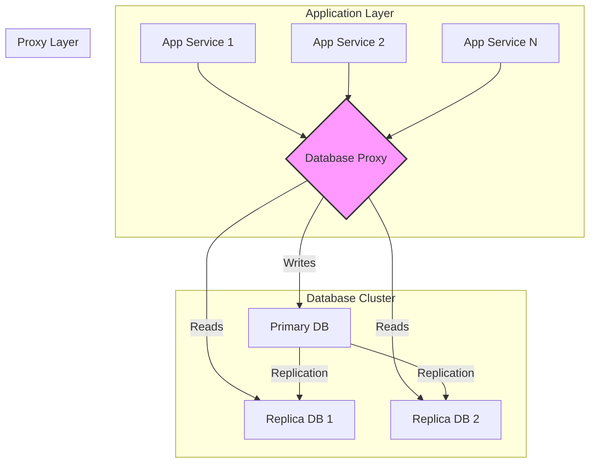

## Introduction: The Growing Pains of Direct Database Connections

In a simple application, your code connects directly to a single database. As you scale, you introduce read replicas, creating a primary-replica cluster. Suddenly, your application logic becomes more complex. It needs to:
*   Manage connection pools for multiple databases (one primary, many replicas).
*   Know which database to send queries to (writes to primary, reads to replicas).
*   Load balance reads across the replicas.
*   Handle a replica or primary failing.

This adds significant complexity and boilerplate code to every service that needs to talk to the database. What if you could abstract all of this logic away into a separate, centralized layer?

This is the role of a **Database Proxy**. A database proxy is a middleware server that sits between your application and your database cluster. Your application makes a single connection to the proxy, and the proxy intelligently manages the connections to the underlying databases.

## The Architecture: A Centralized Gateway

Instead of a web of connections from every application service to every database, the proxy provides a clean, single point of entry.



The application's view is simplified dramatically. It thinks it's talking to a single, powerful database, while the proxy handles all the messy details of the distributed cluster behind the scenes.

## Core Functions of a Database Proxy

Database proxies are powerful because they bundle several critical functions into one service.

### 1. Connection Pooling

Opening and closing database connections is an expensive operation. A connection pool maintains a set of open, ready-to-use connections. A proxy centralizes this function, offering a shared connection pool to all connected applications. This is far more efficient than each application instance managing its own pool, and it prevents overwhelming the database with thousands of individual connections.

### 2. Read/Write Splitting (Query Routing)

This is one of the most valuable features. The proxy can parse incoming SQL queries.
*   If it sees an `INSERT`, `UPDATE`, or `DELETE` statement, it routes the query to the **primary** database.
*   If it sees a `SELECT` statement, it routes the query to one of the **replica** databases.

This completely removes the read/write routing logic from the application code.

### 3. Load Balancing

When routing a read query, the proxy needs to choose which replica to send it to. It can employ various load balancing strategies:
*   **Round Robin:** Cycle through the replicas in order.
*   **Least Connections:** Send the query to the replica with the fewest active connections.
*   **Latency-Based:** Send the query to the replica with the lowest network latency.

This ensures that the read load is distributed evenly, preventing any single replica from becoming a bottleneck.

### 4. High Availability and Automatic Failover

A sophisticated proxy constantly monitors the health of the database nodes.
*   If a **replica** goes down, the proxy will detect this and automatically remove it from the load balancing pool.
*   If the **primary** goes down, an advanced proxy can initiate a failover sequence: automatically promote one of the replicas to be the new primary and reroute write traffic to it. This dramatically reduces downtime.

## Go Example: Simplified Application Logic with a Proxy

In previous articles, our Go application had to manage primary and replica connections itself. Let's see how much simpler the code becomes when we assume a database proxy is running at `proxy.local:5432`.

```go
package main

import (
	"database/sql"
	"fmt"
	"log"

	_ "github.com/lib/pq" // PostgreSQL driver
)

// The application now only needs one connection string: the proxy's address.
const proxyConnectionString = "user=app_user password=secret dbname=mydb host=proxy.local port=5432 sslmode=disable"

// SimplifiedRepository connects only to the database proxy.
type SimplifiedRepository struct {
	db *sql.DB
}

// NewSimplifiedRepository creates a new repository.
func NewSimplifiedRepository() (*SimplifiedRepository, error) {
	db, err := sql.Open("postgres", proxyConnectionString)
	if err != nil {
		return nil, fmt.Errorf("failed to connect to the database proxy: %w", err)
	}
	
	// It's good practice to configure the connection pool, even to a proxy.
	db.SetMaxOpenConns(100)
	db.SetMaxIdleConns(25)

	return &SimplifiedRepository{db: db}, nil
}

// GetUser fetches a user. This is a SELECT query.
// The application doesn't know or care that this goes to a replica.
// The proxy handles that routing.
func (r *SimplifiedRepository) GetUser(userID int) (string, error) {
	var userName string
	// This SELECT is automatically sent to a replica by the proxy.
	err := r.db.QueryRow("SELECT name FROM users WHERE id = $1", userID).Scan(&userName)
	if err != nil {
		return "", err
	}
	return userName, nil
}

// CreateUser creates a new user. This is an INSERT query.
// The application doesn't know or care that this goes to the primary.
// The proxy handles that routing.
func (r *SimplifiedRepository) CreateUser(userName string) error {
	// This INSERT is automatically sent to the primary by the proxy.
	_, err := r.db.Exec("INSERT INTO users (name) VALUES ($1)", userName)
	return err
}

func main() {
	log.Println("Application starting... Connecting to the database proxy.")
	repo, err := NewSimplifiedRepository()
	if err != nil {
		log.Fatalf("Initialization failed: %v", err)
	}
	log.Println("Connection to proxy successful.")

	// --- Simulate application logic ---
	// The code is now clean and simple. No more getReadDB() or manual routing.

	log.Println("Creating a new user 'Carlos'...")
	err = repo.CreateUser("Carlos")
	if err != nil {
		log.Printf("Error: %v", err)
	} else {
		log.Println("Success! The proxy routed the INSERT to the primary.")
	}

	log.Println("Fetching user 456...")
	userName, err := repo.GetUser(456)
	if err != nil {
		log.Printf("Error: %v", err)
	} else {
		log.Printf("Success! Fetched user '%s'. The proxy routed the SELECT to a replica.", userName)
	}
}
```
As you can see, the application code is blissfully unaware of the underlying database topology. It just executes queries, and the proxy takes care of the rest.

## Popular Database Proxies

*   **PgBouncer:** A lightweight and very popular connection pooler for PostgreSQL.
*   **ProxySQL:** A high-performance, advanced proxy for MySQL with rich features for query routing, caching, and rewriting.
*   **AWS RDS Proxy:** A fully managed proxy service for Amazon RDS that provides connection pooling and failover capabilities.
*   **HAProxy:** While a general-purpose TCP/HTTP proxy, it can be configured to provide basic load balancing for databases.

## Benefits and Drawbacks

### Benefits
*   **Simplified Application Logic:** Drastically reduces the complexity of database interaction code.
*   **Centralized Management:** Database topology, routing rules, and failover logic are managed in one place.
*   **Improved Performance & Scalability:** Efficient connection pooling and load balancing can significantly improve throughput.
*   **Increased Resilience:** Automatic failover capabilities minimize downtime.

### Drawbacks
*   **Additional Infrastructure:** It's another component to deploy, monitor, and manage.
*   **Single Point of Failure:** The proxy itself can become a bottleneck or a single point of failure if not made highly available (e.g., by running a cluster of proxies).
*   **Increased Latency:** It adds an extra network hop between your application and the database, which can slightly increase query latency.
*   **Cost:** Both in terms of infrastructure and potential software licensing.

## Conclusion

For any large-scale, distributed database architecture, a database proxy is not just a "nice-to-have"—it's a critical piece of infrastructure. It decouples the application from the database topology, allowing each to scale and evolve independently. By handling the complex but essential tasks of connection pooling, query routing, and failover, the database proxy acts as the unsung hero that enables robust, scalable, and maintainable data-driven applications.
