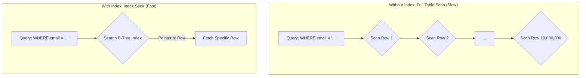

## System Design: Fundamentals of Database Query Optimization

Your application is only as fast as its slowest database query. As your dataset grows, queries that were once instantaneous can slow to a crawl, becoming a major performance bottleneck. **Database Query Optimization** is the art and science of improving the speed and efficiency of data retrieval operations.

At its core, optimization involves ensuring that the database can find the data it needs with the minimum amount of work. Instead of scanning millions of rows, a well-optimized query might only need to read a handful. This not only improves response times but also reduces the load on the database server, saving CPU, memory, and I/O resources.

### The Unoptimized Query: The Full Table Scan

The worst-case scenario for a database is a **full table scan**. This happens when the database has no better strategy than to read every single row in a table to find the ones that match your query's `WHERE` clause. On a small table, this is fine. On a table with millions or billions of rows, it's a disaster.

Consider this query on a `users` table with 10 million rows:
```sql
SELECT user_id, email, created_at
FROM users
WHERE email = 'jane.doe@example.com';
```
Without an index on the `email` column, the database has to inspect all 10 million rows one by one to find the single record for Jane Doe.

### 1. The Power of Indexes

The most important tool in query optimization is the **database index**. An index is a separate data structure (often a B-Tree) that stores a copy of a column's values in a sorted order, along with a pointer back to the original table row.

-   **How it works:** When you create an index on the `email` column, the database can now perform a highly efficient search on the sorted B-Tree structure to find 'jane.doe@example.com'. Instead of scanning 10 million rows, it can locate the record in just a few operations (logarithmic time complexity).



**Creating an index is simple:**
```sql
CREATE INDEX idx_users_email ON users(email);
```

**When to use indexes:**
-   On columns frequently used in `WHERE` clauses.
-   On columns used for `JOIN` operations (foreign keys are a prime candidate).
-   On columns used for `ORDER BY` clauses to speed up sorting.

**The Trade-off:** Indexes are not free. They consume disk space and add a small amount of overhead to write operations (`INSERT`, `UPDATE`, `DELETE`), as the database must update the index as well as the table. The key is to index strategically on columns that are critical for read performance.

### 2. Analyzing the Query Execution Plan

How do you know if your query is using an index? You ask the database! Every modern database provides a command, typically `EXPLAIN` or `EXPLAIN ANALYZE`, that shows you the **query execution plan**. This is the step-by-step plan the database's query planner has decided to use to execute your query.

```sql
EXPLAIN ANALYZE
SELECT user_id, email, created_at
FROM users
WHERE email = 'jane.doe@example.com';
```

The output of `EXPLAIN` will tell you everything:
-   Whether it's using an "Index Seek" (good) or a "Sequential Scan" / "Full Table Scan" (bad).
-   Which index it's using.
-   The estimated number of rows it expects to read.
-   The actual time taken for each step (`EXPLAIN ANALYZE`).

Learning to read execution plans is a critical skill for any developer working with databases. It's your window into the mind of the database.

### 3. Rewriting Inefficient Queries

Sometimes, the problem isn't a missing index but the way the query is written. The query planner is smart, but it can be confused by certain patterns.

-   **Avoid functions on indexed columns:**
    -   **Slow:** `WHERE LOWER(email) = 'jane.doe@example.com'` (This prevents the database from using a simple index on `email`).
    -   **Fast:** `WHERE email = 'jane.doe@example.com'` (Perform the `LOWER` operation in your application code before querying, or use a function-based index if your DB supports it).

-   **Be careful with `LIKE` and wildcards:**
    -   **Slow:** `WHERE name LIKE '%john%'` (A leading wildcard `*` prevents the use of a standard B-Tree index because the search isn't anchored to the start of the string).
    -   **Fast:** `WHERE name LIKE 'john%'` (A trailing wildcard is fine and can use the index).

-   **`SELECT *` is often wasteful:** Only select the columns you actually need. `SELECT *` can lead to fetching large amounts of unnecessary data, especially from wide tables, increasing I/O and network overhead.

### Go Example: Conceptual Querying

This Go example doesn't interact with a real database's query planner, but it conceptually demonstrates the difference between a full scan and using an index (simulated with a map for fast lookups).

```go
package main

import (
	"fmt"
	"log"
	"time"
)

type User struct {
	ID    int
	Email string
	Name  string
}

// Simulate a database table with a slice of structs.
var userTable = []User{
	{ID: 1, Email: "user1@example.com", Name: "Alice"},
	{ID: 2, Email: "user2@example.com", Name: "Bob"},
	// ... imagine millions more users
	{ID: 999999, Email: "jane.doe@example.com", Name: "Jane Doe"},
}

// Simulate a database index with a map.
var emailIndex = make(map[string]int)

func buildIndex() {
	log.Println("Building email index...")
	for i, user := range userTable {
		emailIndex[user.Email] = i // Map email to its position in the table slice
	}
	log.Println("Index build complete.")
}

// findUserByEmail_FullScan simulates a query without an index.
func findUserByEmail_FullScan(email string) (*User, bool) {
	start := time.Now()
	iterations := 0
	for _, user := range userTable {
		iterations++
		if user.Email == email {
			duration := time.Since(start)
			log.Printf("[Full Scan] Found user in %v after %d iterations.", duration, iterations)
			return &user, true
		}
	}
	duration := time.Since(start)
	log.Printf("[Full Scan] User not found in %v after %d iterations.", duration, iterations)
	return nil, false
}

// findUserByEmail_IndexSeek simulates a query using an index.
func findUserByEmail_IndexSeek(email string) (*User, bool) {
	start := time.Now()
	
	// The map lookup is incredibly fast, simulating an index seek.
	index, exists := emailIndex[email]
	if !exists {
		duration := time.Since(start)
		log.Printf("[Index Seek] User not found in %v after 1 iteration.", duration)
		return nil, false
	}

	user := userTable[index]
	duration := time.Since(start)
	log.Printf("[Index Seek] Found user in %v after 1 iteration.", duration)
	return &user, true
}

func main() {
	buildIndex()
	
	targetEmail := "jane.doe@example.com"
	fmt.Println("\n--- Searching without an index ---")
	findUserByEmail_FullScan(targetEmail)

	fmt.Println("\n--- Searching with an index ---")
	findUserByEmail_IndexSeek(targetEmail)
}
```
The output of this program will starkly contrast the number of iterations and time taken between the two methods, illustrating the power of an index.

### Conclusion

Database query optimization is a fundamental skill for building scalable applications. It starts with a proactive approach:
1.  **Identify slow queries** using monitoring tools.
2.  **Use `EXPLAIN`** to understand *why* they are slow.
3.  **Add strategic indexes** to columns used in `WHERE`, `JOIN`, and `ORDER BY` clauses.
4.  **Rewrite queries** to be more "index-friendly" when necessary.

By treating the database not as a black box but as a system you can understand and guide, you can ensure your application remains fast and responsive as it grows.
---
