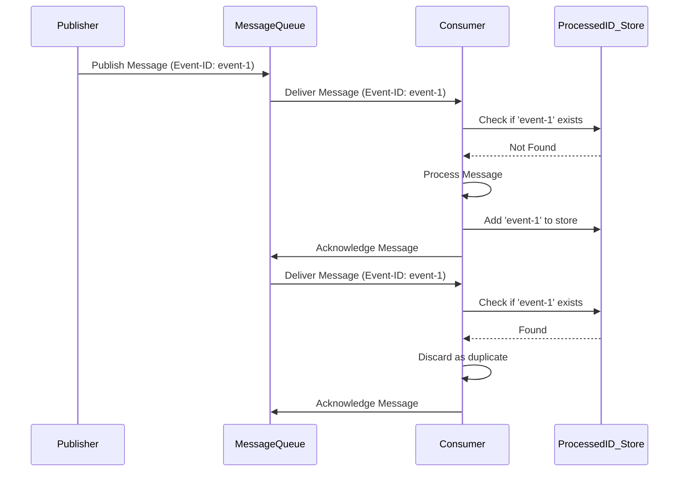

In distributed systems, messages and events are constantly flowing between services. While "exactly-once" delivery is the holy grail of messaging, it's notoriously difficult and often expensive to achieve. Most real-world systems settle for "at-least-once" delivery, which guarantees that a message will be delivered, but accepts that it might be delivered more than once. This is where **deduplication** becomes critical.

Without a robust deduplication strategy, duplicate messages can lead to incorrect calculations, duplicate orders, or inconsistent state. This post explores why deduplication is essential and dives into practical strategies for implementing it, complete with Go code examples and diagrams.

### Why is Deduplication Necessary?

At-least-once delivery is a common guarantee in message queues (like RabbitMQ, Kafka) and event streaming platforms. Duplicates can occur for several reasons:

-   **Publisher Retries**: A publisher sends a message but doesn't receive an acknowledgment due to a network timeout. It retries, sending the same message again.
-   **Consumer Failures**: A consumer successfully processes a message but fails before it can acknowledge the processing. The message broker, thinking the message was not processed, redelivers it.
-   **Broker Rebalancing**: During a rebalance or failover in a distributed message broker, a message might be delivered to a new consumer before the old one's acknowledgment is fully committed.

Deduplication is the process of identifying and discarding these duplicate messages to ensure that each unique message is processed only once.

### Core Strategies for Deduplication

Effective deduplication relies on having a unique identifier for each message or operation. Let's explore the most common strategies.

#### 1. Unique Message/Event ID

This is the most straightforward approach. The publisher assigns a unique ID (like a UUID) to every message it sends. The consumer then maintains a record of the IDs it has already processed.

**Workflow:**

1.  **Publisher**: Generates a unique `Event-ID` and includes it in the message header or body.
2.  **Consumer**:
    *   Receives a message.
    *   Checks if the `Event-ID` exists in its processed-ID store (e.g., Redis, a database table).
    *   If the ID exists, the message is a duplicate and is discarded.
    *   If the ID is new, the consumer processes the message and then adds the `Event-ID` to its store.

This process must be **atomic**. The consumer must both process the message and record its ID in a single, atomic transaction to prevent failures in between.

**Diagram: Deduplication with Event ID**



#### 2. Content-Based Hashing (Message Fingerprinting)

Sometimes, you can't rely on the publisher to provide a unique ID. In such cases, the consumer can generate a "fingerprint" of the message by hashing its content.

**Workflow:**

1.  **Consumer**:
    *   Receives a message.
    *   Normalizes the message content (e.g., by ordering JSON keys) to ensure consistency.
    *   Calculates a hash (e.g., SHA-256) of the normalized content. This hash becomes the unique identifier.
    *   Uses this hash to check for duplicates in its processed-ID store, following the same logic as the Unique Message ID pattern.

**Caveats:**

-   **Performance**: Hashing can be computationally expensive, especially for large messages.
-   **Brittleness**: Even a tiny, insignificant change in the message content (like a timestamp or whitespace) will produce a different hash, causing the system to treat it as a new message. This method is best for messages with truly immutable content.

### Go Example: Deduplication Middleware for a Message Consumer

Let's implement a deduplication layer in Go. We'll use an in-memory map as our processed-ID store for simplicity. In a production environment, this would be replaced by a distributed cache like Redis.

First, let's define our deduplicator.

```go
package main

import (
	"crypto/sha256"
	"encoding/hex"
	"encoding/json"
	"fmt"
	"sync"
	"time"
)

// Message represents a generic message from a queue.
type Message struct {
	ID      string          `json:"id"`
	Payload json.RawMessage `json:"payload"`
}

// Deduplicator checks for and stores message IDs.
type Deduplicator struct {
	processedIDs map[string]bool
	mu           sync.Mutex
}

func NewDeduplicator() *Deduplicator {
	return &Deduplicator{
		processedIDs: make(map[string]bool),
	}
}

// IsDuplicate checks if a message ID has been processed.
func (d *Deduplicator) IsDuplicate(messageID string) bool {
	d.mu.Lock()
	defer d.mu.Unlock()
	_, found := d.processedIDs[messageID]
	return found
}

// MarkAsProcessed stores a message ID.
func (d *Deduplicator) MarkAsProcessed(messageID string) {
	d.mu.Lock()
	defer d.mu.Unlock()
	d.processedIDs[messageID] = true
	fmt.Printf("Marked as processed: %s\n", messageID)
}
```

Now, let's create a message handler that uses the deduplicator.

```go
// MessageHandler defines the contract for processing a message.
type MessageHandler func(m Message) error

// WithDeduplication is a middleware that adds deduplication logic to a handler.
func WithDeduplication(deduplicator *Deduplicator, next MessageHandler) MessageHandler {
	return func(m Message) error {
		var messageID string
		if m.ID != "" {
			// Strategy 1: Use the provided message ID
			messageID = m.ID
		} else {
			// Strategy 2: Use a content-based hash as a fallback
			hash := sha256.Sum256(m.Payload)
			messageID = hex.EncodeToString(hash[:])
			fmt.Printf("Generated content hash for deduplication: %s\n", messageID)
		}

		if deduplicator.IsDuplicate(messageID) {
			fmt.Printf("Duplicate message detected and discarded: %s\n", messageID)
			return nil // Discard without error
		}

		// Process the message
		err := next(m)
		if err != nil {
			return err // Don't mark as processed if handler fails
		}

		// Mark as processed only after successful processing
		deduplicator.MarkAsProcessed(messageID)
		return nil
	}
}

// actualMessageHandler is our core business logic.
func actualMessageHandler(m Message) error {
	fmt.Printf("Processing message ID %s with payload: %s\n", m.ID, string(m.Payload))
	// Simulate work
	time.Sleep(500 * time.Millisecond)
	return nil
}
```

Finally, let's simulate a message queue delivering messages to our handler.

```go
func main() {
	deduplicator := NewDeduplicator()
	handler := WithDeduplication(deduplicator, actualMessageHandler)

	// --- Simulation ---
	fmt.Println("--- Round 1: Processing unique messages ---")
	msg1 := Message{ID: "uuid-1", Payload: json.RawMessage(`{"data":"first message"}`)}
	msg2 := Message{ID: "uuid-2", Payload: json.RawMessage(`{"data":"second message"}`)}
	
	handler(msg1)
	handler(msg2)

	fmt.Println("\n--- Round 2: Simulating redelivery of a duplicate message ---")
	// Redeliver msg1
	handler(msg1)

	fmt.Println("\n--- Round 3: Simulating a message without an ID (content hashing) ---")
	msg3 := Message{Payload: json.RawMessage(`{"data":"third message"}`)}
	handler(msg3)
	
	fmt.Println("\n--- Round 4: Simulating redelivery of the message without an ID ---")
	// Redeliver msg3
	handler(msg3)
}
```

### Key Considerations for Production

1.  **Persistent Store**: The list of processed IDs must be stored in a persistent and shared location, like Redis or a database. An in-memory store only works for a single, non-restarting consumer instance.
2.  **Atomicity**: As mentioned, processing the message and storing its ID must be atomic. If the consumer crashes after processing but before storing the ID, a redelivery will cause a duplicate operation.
    *   **Database**: Use a transaction to update business data and insert the message ID into a deduplication table.
    *   **Redis**: Use a `MULTI`/`EXEC` transaction or a Lua script to combine the business logic (if possible) and the ID storage.
3.  **ID Store Cleanup**: The store of processed IDs will grow indefinitely. You must implement a cleanup strategy, typically by setting a Time-To-Live (TTL) on each ID. The TTL should be longer than the maximum possible time a message can be redelivered (e.g., 24 hours).

### Conclusion

Deduplication is not an optional add-on; it's a fundamental requirement for building reliable systems that use at-least-once delivery semantics. By implementing robust deduplication strategies using unique message IDs or content-based hashing, you can achieve the effect of "exactly-once processing" and ensure data integrity. The key is to choose the right identification method, ensure atomicity in your consumer logic, and manage the lifecycle of your processed ID store. This investment in deduplication logic pays off by making your system more resilient, predictable, and correct.
