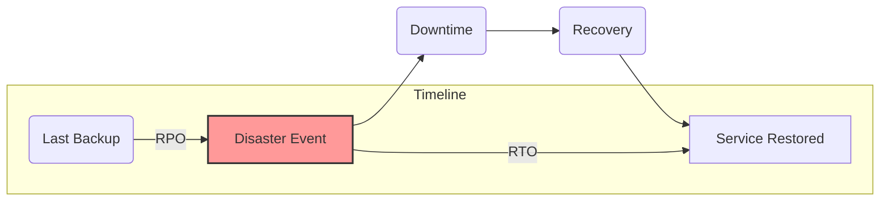

## System Design: A Guide to Disaster Recovery Planning

High availability strategies like [failover](/blog/system-design/system-design-automatic-failover-strategies) and [health checks](/blog/system-design/system-design-health-check-patterns) are excellent for handling small-scale, routine failures—a single server crashing or a process freezing. But what happens when an entire data center goes offline due to a power outage, a natural disaster, or a major network failure? This is where **Disaster Recovery (DR)** comes in.

Disaster Recovery Planning is about how you prepare for and recover from a large-scale failure that takes down an entire site or region. The goal is to restore your service to a functional state and ensure business continuity.

### Key Metrics: RPO and RTO

Before choosing a DR strategy, you must define two critical metrics for your business:

1.  **Recovery Point Objective (RPO):** How much data can you afford to lose? This is a measure of time. An RPO of 1 hour means that in a disaster, you could lose up to 1 hour's worth of data. An RPO of zero means no data loss is acceptable.
2.  **Recovery Time Objective (RTO):** How quickly must the service be back online? This is also a measure of time. An RTO of 15 minutes means your service must be fully functional again within 15 minutes of the disaster being declared.

Your RPO and RTO will determine the cost and complexity of your DR strategy. A lower RPO/RTO is more expensive.



### DR Strategies: From Cold to Hot

DR strategies exist on a spectrum, defined by their cost, complexity, and how quickly they can meet your RPO and RTO.

#### 1. Backup and Restore (Coldest)

This is the simplest and cheapest DR strategy.
-   **How it works:** You regularly take backups of your data (e.g., database dumps, file system snapshots) and store them in a separate, remote location. In a disaster, you provision new infrastructure from scratch and restore the data from the latest backup.
-   **RPO:** Depends on your backup frequency. If you back up daily, your RPO is 24 hours.
-   **RTO:** Very high. Can be hours or even days, as it involves manual steps to set up new servers, networks, and restore data.
-   **Best for:** Non-critical systems, development environments, or applications where significant downtime and some data loss are acceptable.

#### 2. Pilot Light (Warm)

The "pilot light" analogy refers to a gas heater where a small flame is always on, ready to ignite the main burner.
-   **How it works:** A minimal version of your core infrastructure runs in a standby DR region. This includes the most critical components, like a small database server receiving replicated data from the primary region. The application servers and other components are not running but are ready to be quickly started.
-   **RPO:** Can be low (minutes), as data is often replicated continuously.
-   **RTO:** Lower than Backup and Restore (minutes to hours). Recovery involves starting the application servers and scaling up the infrastructure to handle the full production load.
-   **Best for:** Applications that need a lower RPO and RTO than simple backup, but where some downtime for recovery is still acceptable.

```mermaid
graph TD
    subgraph Primary Region (Active)
        P_LB(Load Balancer) --> P_App[App Servers]
        P_App --> P_DB[(Database)]
    end

    subgraph DR Region (Standby)
        D_App_Template([App Server Template])
        D_DB[(Small DB Replica)]
    end
    
    P_DB -- "Data Replication" --> D_DB

    style D_DB fill:#ccf,stroke:#333,stroke-width:2px
```
*In a Pilot Light setup, only the core data is live in the DR region.*

#### 3. Warm Standby (Warmer)

This is a scaled-up version of the Pilot Light strategy.
-   **How it works:** A full, but scaled-down, version of the application runs in the DR region. It has all the necessary components (servers, databases, etc.) running, but at a reduced capacity. Data is actively replicated from the primary region.
-   **RPO:** Very low (seconds to minutes).
-   **RTO:** Low (minutes). Recovery involves rerouting traffic to the DR region (e.g., via a DNS change) and then scaling up the infrastructure to handle the full load.
-   **Best for:** Core business applications where downtime needs to be minimized.

#### 4. Multi-Site Active-Active (Hottest)

This is the most advanced and expensive DR strategy, providing near-zero downtime.
-   **How it works:** The application runs in two or more data centers simultaneously, with both regions actively serving traffic. [Global Server Load Balancing (GSLB)](/blog/system-design/system-design-global-server-load-balancing-gslb) distributes traffic between the regions. If one region fails, the GSLB automatically detects the failure and redirects all traffic to the remaining healthy region(s).
-   **RPO:** Near-zero. This requires synchronous or near-synchronous data replication between regions, which is a major technical challenge.
-   **RTO:** Near-zero. Failover is automatic and often seamless to the user.
-   **Best for:** Mission-critical applications where any amount of downtime or data loss is unacceptable (e.g., major financial systems, critical e-commerce platforms).

```mermaid
graph TD
    User --> GSLB{GSLB}
    
    subgraph Region A (Active)
        A_LB(Load Balancer) --> A_App[App Servers]
        A_App --> A_DB[(Database)]
    end

    subgraph Region B (Active)
        B_LB(Load Balancer) --> B_App[App Servers]
        B_App --> B_DB[(Database)]
    end

    GSLB --> A_LB
    GSLB --> B_LB
    
    A_DB <--> B_DB
    note right of A_DB : Two-Way Replication
```

### Comparison of DR Strategies

| Strategy                | RPO (Data Loss) | RTO (Downtime) | Cost      | Complexity |
|-------------------------|-----------------|----------------|-----------|------------|
| **Backup and Restore**  | Hours to Days   | Hours to Days  | **Low**   | **Low**    |
| **Pilot Light**         | Minutes         | Minutes to Hours| Medium    | Medium     |
| **Warm Standby**        | Seconds to Mins | Minutes        | High      | High       |
| **Multi-Site Active-Active** | **Near-Zero**   | **Near-Zero**  | **Very High** | **Very High** |

### Go Example: A Simple Backup "Script"

This conceptual Go program demonstrates the logic of a simple backup and restore process. It copies a "database" file to a backup location.

```go
package main

import (
	"fmt"
	"io"
	"os"
	"path/filepath"
	"time"
)

// createDummyDB creates a dummy database file for our example.
func createDummyDB(path string, content string) {
	f, err := os.Create(path)
	if err != nil {
		panic(err)
	}
	defer f.Close()
	f.WriteString(content)
}

// copyFile is a utility function to copy a file.
func copyFile(src, dst string) error {
	sourceFile, err := os.Open(src)
	if err != nil {
		return err
	}
	defer sourceFile.Close()

	destFile, err := os.Create(dst)
	if err != nil {
		return err
	}
	defer destFile.Close()

	_, err = io.Copy(destFile, sourceFile)
	return err
}

func main() {
	// --- Setup ---
	dbPath := "./production/data.db"
	backupDir := "./backups"
	os.MkdirAll(filepath.Dir(dbPath), 0755)
	os.MkdirAll(backupDir, 0755)

	// --- Simulate Application Running ---
	fmt.Println("Application running...")
	createDummyDB(dbPath, "Initial data.")
	time.Sleep(2 * time.Second)
	createDummyDB(dbPath, "Initial data.\nMore data added.")
	fmt.Println("Data updated in production.")

	// --- Perform Backup ---
	backupFileName := fmt.Sprintf("backup-%s.db", time.Now().Format("2006-01-02-15-04-05"))
	backupPath := filepath.Join(backupDir, backupFileName)
	
	fmt.Printf("\nStarting backup from %s to %s...\n", dbPath, backupPath)
	if err := copyFile(dbPath, backupPath); err != nil {
		panic(err)
	}
	fmt.Println("Backup complete.")

	// --- Simulate a Disaster ---
	fmt.Println("\n--- DISASTER! Production database lost! ---")
	os.Remove(dbPath)
	
	// --- Manual Recovery Process ---
	fmt.Println("\nStarting recovery process...")
	fmt.Printf("Restoring from backup file %s...\n", backupPath)
	if err := copyFile(backupPath, dbPath); err != nil {
		panic(err)
	}
	fmt.Println("Recovery complete. Application can be restarted.")

	// Verify restored data
	restoredData, _ := os.ReadFile(dbPath)
	fmt.Printf("Restored data: \n%s\n", string(restoredData))
}
```

### Conclusion

Disaster Recovery is a critical component of system design that goes beyond handling simple server failures. It's about ensuring business survival in the face of large-scale outages. The right strategy for your application depends on a careful balance between your business requirements (RPO and RTO) and your budget. By starting with a simple backup plan and evolving towards warmer strategies as your application's criticality grows, you can build a resilient system that is prepared for even the most unexpected events.
---
