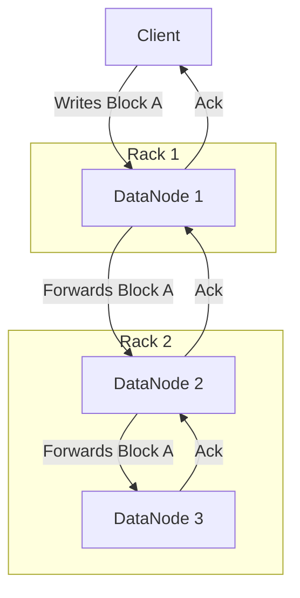
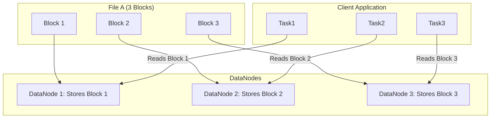

A traditional file system runs on a single server. If that server fails, the data becomes unavailable. If you run out of disk space, you have to add more disks to that specific machine. A **Distributed File System (DFS)** solves these problems by storing files across a network of multiple machines, making it appear to users as a single, unified file system.

A DFS is designed for two primary goals: **scalability** and **fault tolerance**. It allows you to create massive storage pools using commodity hardware and ensures that the failure of individual machines does not lead to data loss. The Hadoop Distributed File System (HDFS) is a canonical example and a cornerstone of the big data ecosystem.

### Core Architecture of a Distributed File System

Most distributed file systems, including HDFS, follow a master/slave architecture.

1.  **Metadata Server (The "Master")**: This server, called the **NameNode** in HDFS, is the brain of the system. It does *not* store the actual file data. Instead, it maintains the file system's metadata, including:
    *   The directory and file hierarchy (e.g., `/users/data/file.txt`).
    *   File permissions and ownership.
    *   A map of which file blocks are stored on which data nodes.
2.  **Data Nodes (The "Slaves")**: These are the worker machines that store the actual data. Data is broken down into large, fixed-size **blocks** (e.g., 128MB or 256MB in HDFS) and distributed across the data nodes. These nodes are constantly communicating with the metadata server, sending "heartbeats" to report their health and a list of the blocks they are storing.

**Diagram: High-Level DFS Architecture (HDFS)**

```mermaid
graph TD
    Client[Client Application]

    subgraph Master Node
        NameNode[NameNode (Metadata Server)]
    end

    subgraph Worker Nodes
        DataNode1[DataNode 1]
        DataNode2[DataNode 2]
        DataNode3[DataNode 3]
        DataNode4[...]
    end

    Client -- "1. Read /path/file.txt" --> NameNode
    NameNode -- "2. File is on DN1, DN2, DN3" --> Client
    Client -- "3. Reads data directly from DataNode" --> DataNode1

    DataNode1 -- "Heartbeats & Block Reports" --> NameNode
    DataNode2 -- "Heartbeats & Block Reports" --> NameNode
    DataNode3 -- "Heartbeats & Block Reports" --> NameNode

    style NameNode fill:#f99,stroke:#333,stroke-width:2px
```

This separation is key: the metadata operations are centralized for consistency, while the actual data I/O is distributed and happens in parallel, directly between the client and the data nodes.

### How DFS Achieves Fault Tolerance: Replication

To protect against data loss from disk or machine failure, a DFS replicates each data block across multiple data nodes. A typical replication factor is 3.

When a client writes a file:
1.  The file is broken into blocks.
2.  For each block, the NameNode provides the client with a list of three DataNodes.
3.  The client writes the block to the first DataNode.
4.  The first DataNode forwards the block to the second DataNode in the list.
5.  The second DataNode forwards it to the third.
This creates a replication pipeline, ensuring all three copies are written before the client receives a success acknowledgement.

**Diagram: Block Replication Pipeline**



The NameNode is also "rack-aware." It tries to place replicas on different physical server racks to protect against a rack-level failure (e.g., a top-of-rack switch failure). A common policy is to place the first replica on the local rack and the other two on a different rack.

If a DataNode fails, the NameNode detects the missing heartbeats. It then identifies which blocks were on the failed node and automatically creates new replicas of those blocks on other healthy DataNodes to bring the replication factor back to the desired level (e.g., 3).

### How DFS Achieves Scalability: Data Striping

A DFS is designed for high-throughput, sequential reads of very large files, which is a common pattern in big data processing (e.g., with MapReduce or Spark). It achieves this through **data striping**.

Because a large file is "striped" as blocks across many different machines, a client can read different parts of the file from multiple DataNodes in parallel. This allows the read throughput of the file system to scale with the number of DataNodes in the cluster.

**Diagram: Parallel Read from a Striped File**

A client application (like a MapReduce job) can have multiple tasks reading different blocks of the same file simultaneously.



This architecture is optimized for high throughput, not low latency. Reading a small file might actually be slower than on a traditional file system due to the initial network hop to the NameNode. DFS shines when dealing with files that are hundreds of gigabytes or terabytes in size.

### The Metadata Bottleneck

The centralized NameNode is both the strength (simplicity, strong consistency) and the weakness of this architecture.

*   **Single Point of Failure (SPOF)**: If the NameNode fails, the entire file system goes offline because clients can no longer locate their data. Modern DFS implementations solve this with a Hot Standby NameNode that maintains a synchronized copy of the metadata and can take over quickly in case of a failure.
*   **Scalability Limit**: The amount of metadata the NameNode can store in its memory limits the total number of files in the system. HDFS, for example, is great for storing a smaller number of very large files, but not for storing billions of tiny files.

Federation is a technique used to scale the metadata layer by adding multiple NameNodes, each responsible for a different part of the file system namespace (e.g., one for `/users`, another for `/apps`).

### Conclusion

A Distributed File System is a foundational technology for the world of big data. By separating metadata from data and distributing data blocks across a cluster of commodity machines, it provides a scalable and fault-tolerant storage solution for massive datasets. Its architecture, which prioritizes high throughput and resilience through replication and striping, makes it the ideal storage layer for parallel processing frameworks like Spark and MapReduce. While it has its limitations, particularly around the centralized metadata server, the DFS model has proven to be a robust and cost-effective way to manage data at a petabyte scale.