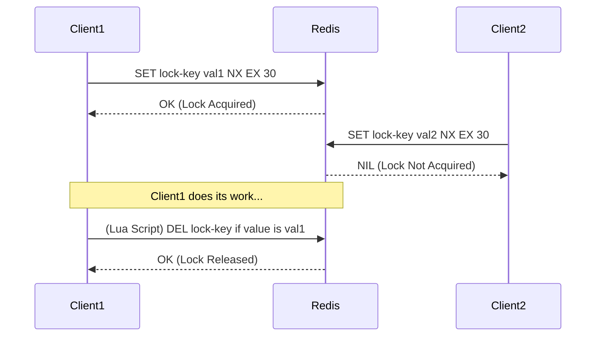

## Introduction: The Need for Distributed Locking

In a single-process application, we use mutexes and semaphores to protect shared resources. But what happens when your application is distributed across multiple servers? A standard in-memory mutex won't work, as it's only visible to threads within a single process.

This is where **distributed locks** come in. A distributed lock is a mechanism that can be used to synchronize access to a shared resource across multiple processes running on different machines. It ensures that only one process can hold the lock at any given time, preventing race conditions and data corruption in a distributed environment.

Common use cases include:
*   Ensuring a background job only runs on one server at a time.
*   Preventing multiple processes from making concurrent, conflicting updates to a database record.
*   Leader election.

In this post, we'll explore three common ways to implement distributed locks: using Redis, ZooKeeper, and a relational database.

## 1. Implementation with Redis

Redis is a popular choice for distributed locking due to its speed and the availability of atomic commands that are perfect for the job. The most common approach is to use the `SET` command with the `NX` (Not eXists) and `EX` (EXpire) options.

### How It Works

1.  **Acquire Lock:** A client tries to create a key in Redis using `SET my-lock-key random-value NX EX 30`.
    *   `my-lock-key`: The name of the lock.
    *   `random-value`: A unique value generated by the client. This is crucial to ensure that a client only deletes its own lock.
    *   `NX`: This option means "only set the key if it does not already exist." This is the atomic "test-and-set" operation.
    *   `EX 30`: This sets an expiration time of 30 seconds on the key. This is a safety measure to prevent deadlocks if a client crashes while holding the lock.
2.  **Check Result:** If the `SET` command returns `OK`, the client has successfully acquired the lock.
3.  **Release Lock:** To release the lock, the client must use a script (typically a Lua script executed by Redis) to atomically check if the key exists and if its value matches the client's unique `random-value`. If both are true, the key is deleted. This prevents a client from accidentally releasing a lock that was acquired by another client after the original lock expired.



### Go Example with Redis

```go
package main

import (
    "fmt"
    "github.com/go-redis/redis/v8"
    "context"
    "time"
    "github.com/google/uuid"
)

var ctx = context.Background()

func acquireLock(rdb *redis.Client, lockKey string, lockValue string, ttl time.Duration) (bool, error) {
    return rdb.SetNX(ctx, lockKey, lockValue, ttl).Result()
}

func releaseLock(rdb *redis.Client, lockKey string, lockValue string) error {
    script := `
    if redis.call("get", KEYS[1]) == ARGV[1] then
        return redis.call("del", KEYS[1])
    else
        return 0
    end
    `
    _, err := rdb.Eval(ctx, script, []string{lockKey}, lockValue).Result()
    return err
}

func main() {
    rdb := redis.NewClient(&redis.Options{
        Addr: "localhost:6379",
    })

    lockKey := "my-distributed-lock"
    lockValue := uuid.New().String()
    ttl := 10 * time.Second

    fmt.Println("Attempting to acquire lock...")
    acquired, err := acquireLock(rdb, lockKey, lockValue, ttl)
    if err != nil || !acquired {
        fmt.Println("Failed to acquire lock.")
        return
    }
    fmt.Println("Lock acquired!")

    // Simulate work
    time.Sleep(5 * time.Second)

    fmt.Println("Releasing lock...")
    err = releaseLock(rdb, lockKey, lockValue)
    if err != nil {
        fmt.Println("Error releasing lock:", err)
    } else {
        fmt.Println("Lock released.")
    }
}
```

## 2. Implementation with ZooKeeper

ZooKeeper was designed for coordination, making it a natural fit for distributed locks. The standard recipe uses **ephemeral sequential znodes**.

### How It Works

1.  **Create Parent Znode:** A persistent znode is created to act as the parent for the lock (e.g., `/locks`).
2.  **Acquire Lock:** Each client that wants the lock creates an ephemeral, sequential znode under the parent (e.g., `/locks/lock-0000000001`).
3.  **Check Position:** The client then gets a list of all children under `/locks` and checks if the znode it just created has the lowest sequence number.
4.  **Wait or Proceed:**
    *   If its znode has the lowest number, it has acquired the lock and can proceed.
    *   If not, it "watches" for the deletion of the znode with the next lowest sequence number. This avoids the "herd effect" where all waiting clients are notified at once.
5.  **Release Lock:** To release the lock, the client simply deletes its ephemeral znode (or the znode is deleted automatically if the client crashes). The next client in the queue is then notified and can acquire the lock.

## 3. Implementation with a Database

You can also implement a distributed lock using a relational database, although this is often less performant than using a dedicated tool like Redis or ZooKeeper.

### How It Works

1.  **Create a Lock Table:** Create a table (e.g., `distributed_locks`) with a unique column for the lock name (e.g., `lock_name`).
2.  **Acquire Lock:** A client tries to insert a row into this table with the desired lock name.
    ```sql
    INSERT INTO distributed_locks (lock_name, owner_id) VALUES ('my-resource-lock', 'process-123');
    ```
    Because of the unique constraint on `lock_name`, this `INSERT` will only succeed for one client at a time.
3.  **Check Result:** If the `INSERT` is successful, the client has the lock. If it fails with a unique constraint violation, the client knows the lock is held by someone else.
4.  **Release Lock:** To release the lock, the client deletes the row it inserted.
    ```sql
    DELETE FROM distributed_locks WHERE lock_name = 'my-resource-lock' AND owner_id = 'process-123';
    ```

**Alternative (Pessimistic Locking):** Some databases support advisory locks or pessimistic locking with `SELECT ... FOR UPDATE`. This can be an effective way to lock a specific row representing a resource, but it requires an active database transaction and can be more complex to manage.

## Comparison

| Feature | Redis | ZooKeeper | Database |
| :--- | :--- | :--- | :--- |
| **Performance** | Very High | High | Low to Medium |
| **Complexity** | Medium (Lua script for safe release) | High (client logic is complex) | Low (simple SQL) |
| **Fault Tolerance** | Good (with Sentinel/Cluster) | Very High (designed for this) | Depends on DB setup |
| **Deadlock Prevention** | Good (via TTL) | Excellent (via ephemeral nodes) | Poor (requires manual timeout logic) |
| **Fairness (Queuing)** | No (it's a race) | Yes (sequential nodes create a fair queue) | No (it's a race) |

## Conclusion

The best way to implement a distributed lock depends on your existing infrastructure and specific needs.

*   **Redis** is a fantastic choice if you need a high-performance, relatively simple lock and don't require fairness.
*   **ZooKeeper** is the most robust and "correct" solution, providing fairness and handling client failures gracefully, but it comes with higher operational and client-side complexity.
*   A **database** can be a pragmatic choice if you don't have Redis or ZooKeeper available and your performance requirements are not extreme.

Regardless of the tool you choose, the key is to handle edge cases carefully: ensure locks have a timeout or are automatically released on failure (like ZooKeeper's ephemeral nodes) to prevent your entire system from grinding to a halt due to a deadlocked resource.
