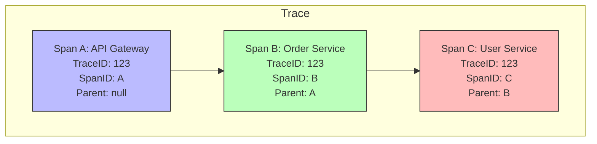

## System Design: An Introduction to Distributed Tracing

In a monolithic application, understanding a request's lifecycle is relatively straightforward. You can follow the code path, look at a single log file, and reason about performance. In a microservices architecture, this becomes exponentially harder. A single user action might trigger a cascade of calls across dozens of independent services. If that action is slow or fails, how do you pinpoint the source of the problem?

This is the challenge that **Distributed Tracing** solves. It's the second pillar of observability (along with metrics and logs) and provides a way to follow the entire journey of a request as it moves through a distributed system.

### What is a Trace?

A distributed trace is a complete record of a single request's journey. It's composed of a series of **spans**.

-   **Span:** A single unit of work within a request. A span represents a specific operation, like an API call, a database query, or a function execution. It has a start time, an end time, and a set of key-value tags (attributes) that provide context about the operation.
-   **Trace:** A collection of spans, linked together in a parent-child relationship, that represents the entire end-to-end request. Each trace is identified by a unique `TraceID`. Each span has its own `SpanID` and also includes the `ParentSpanID` of the span that called it.

This hierarchical structure allows you to visualize the request flow as a timeline or a flame graph, making it easy to see which operations are taking the most time and where errors are occurring.

### Visualizing a Trace

Imagine a user request that flows through three services: an API Gateway, an Order Service, and a User Service.



When visualized in a tracing tool like Jaeger or Zipkin, this would look like a waterfall diagram showing the duration and relationship of each span:

```
Request Timeline
|---------------------------------------------------------------------|
| Span A (API Gateway)                                                |
|---------------------------------------------------------------------|
    |-------------------------------------------------------------|
    | Span B (Order Service)                                      |
    |-------------------------------------------------------------|
        |---------------------------------|
        | Span C (User Service DB Query)  |
        |---------------------------------|
```
This view immediately tells you how much time was spent in each service and how they depended on each other.

### The Magic Ingredient: Context Propagation

How does the `TraceID` and `ParentSpanID` get passed from one service to another? This is done through **Context Propagation**.

When a service receives a request, it checks for tracing headers (like `traceparent`, defined by the W3C Trace Context standard).
1.  **If headers exist:** It extracts the `TraceID` and `ParentSpanID` and uses them to create a new child span. This links the new work to the existing trace.
2.  **If no headers exist:** It means this is the start of a new journey. The service generates a new `TraceID` and starts a new root span.

Before making an outbound call to another service, the current service **injects** the `TraceID` and its own `SpanID` into the outgoing request's headers. The next service then repeats the process. This ensures the chain is never broken.

### OpenTelemetry: The Standard for Instrumentation

In the past, tracing was often tied to specific vendors. **OpenTelemetry (OTel)** is a CNCF project that provides a single, open-standard set of APIs, libraries, and agents for collecting telemetry data (traces, metrics, and logs).

By instrumenting your code with OpenTelemetry, you can export your data to any OTel-compatible backend (like Jaeger, Datadog, Honeycomb, etc.) without changing your code.

### Go Example: Tracing Across Two Services with OpenTelemetry

This example demonstrates how to set up a basic tracer and propagate context between two services.

**Prerequisites:**
```bash
go get go.opentelemetry.io/otel
go get go.opentelemetry.io/otel/exporters/stdout/stdouttrace
go get go.opentelemetry.io/otel/sdk/trace
go get go.opentelemetry.io/otel/propagation
go get go.opentelemetry.io/contrib/instrumentation/net/http/otelhttp
```

**`tracer.go` (Shared tracer setup)**
```go
package main

import (
	"go.opentelemetry.io/otel"
	"go.opentelemetry.io/otel/exporters/stdout/stdouttrace"
	"go.opentelemetry.io/otel/propagation"
	"go.opentelemetry.io/otel/sdk/resource"
	sdktrace "go.opentelemetry.io/otel/sdk/trace"
	semconv "go.opentelemetry.io/otel/semconv/v1.4.0"
	"io"
	"log"
)

// initTracer creates and registers a basic tracer that prints to stdout.
// In a real app, you'd use a Jaeger or OTLP exporter.
func initTracer(serviceName string, writer io.Writer) (*sdktrace.TracerProvider, error) {
	exporter, err := stdouttrace.New(
		stdouttrace.WithWriter(writer),
		stdouttrace.WithPrettyPrint(),
	)
	if err != nil {
		return nil, err
	}

	tp := sdktrace.NewTracerProvider(
		sdktrace.WithBatcher(exporter),
		sdarange.WithResource(resource.NewWithAttributes(
			semconv.SchemaURL,
			semconv.ServiceNameKey.String(serviceName),
		)),
	)

	otel.SetTracerProvider(tp)
	otel.SetTextMapPropagator(propagation.NewCompositeTextMapPropagator(propagation.TraceContext{}, propagation.Baggage{}))

	return tp, nil
}
```

**`main.go` (Two services in one file for simplicity)**
```go
package main

import (
	"context"
	"log"
	"net/http"
	"os"
	"time"

	"go.opentelemetry.io/contrib/instrumentation/net/http/otelhttp"
	"go.opentelemetry.io/otel"
	"go.opentelemetry.io/otel/trace"
)

var tracer = otel.Tracer("example-tracer")

// service1Handler is the entry point. It receives a request and calls Service 2.
func service1Handler(w http.ResponseWriter, r *http.Request) {
	// The otelhttp middleware automatically starts a span for us.
	ctx := r.Context()

	// Create a new HTTP client that is instrumented with OpenTelemetry.
	// This client will automatically inject trace context headers into outgoing requests.
	client := http.Client{Transport: otelhttp.NewTransport(http.DefaultTransport)}

	req, _ := http.NewRequestWithContext(ctx, "GET", "http://localhost:8081/service2", nil)

	log.Println("Service 1: Calling Service 2")
	res, err := client.Do(req)
	if err != nil {
		http.Error(w, err.Error(), http.StatusInternalServerError)
		return
	}
	defer res.Body.Close()

	w.Write([]byte("Response from Service 1"))
}

// service2Handler is the downstream service.
func service2Handler(w http.ResponseWriter, r *http.Request) {
	// The otelhttp middleware also starts a span here, correctly parented to the span from Service 1.
	ctx := r.Context()

	// We can also create our own custom child spans.
	_, span := tracer.Start(ctx, "service2-custom-work")
	defer span.End()

	log.Println("Service 2: Doing some work")
	time.Sleep(100 * time.Millisecond)
	span.AddEvent("Finished work")

	w.Write([]byte("Response from Service 2"))
}

func main() {
	// Set up a tracer that prints to the console.
	tp, err := initTracer("example-app", os.Stdout)
	if err != nil {
		log.Fatal(err)
	}
	defer func() {
		if err := tp.Shutdown(context.Background()); err != nil {
			log.Printf("Error shutting down tracer provider: %v", err)
		}
	}()

	// --- Service 1 Setup ---
	// Wrap the handler with otelhttp middleware to automatically handle trace propagation.
	service1Mux := http.NewServeMux()
	handler1 := otelhttp.NewHandler(http.HandlerFunc(service1Handler), "Service1")
	service1Mux.Handle("/", handler1)
	go func() {
		log.Println("Service 1 listening on :8080")
		http.ListenAndServe(":8080", service1Mux)
	}()

	// --- Service 2 Setup ---
	service2Mux := http.NewServeMux()
	handler2 := otelhttp.NewHandler(http.HandlerFunc(service2Handler), "Service2")
	service2Mux.Handle("/service2", handler2)
	go func() {
		log.Println("Service 2 listening on :8081")
		http.ListenAndServe(":8081", service2Mux)
	}()

	// Wait a moment for servers to start, then make a request.
	time.Sleep(1 * time.Second)
	log.Println("Making initial request to Service 1...")
	http.Get("http://localhost:8080/")

	// Keep the main goroutine alive to see the trace output.
	select {}
}
```
When you run this, you'll see trace data printed to your console. You'll be able to see the `TraceID` is the same for all spans, and the `ParentSpanID` correctly links them, showing the call from Service 1 to Service 2.

### Conclusion

Distributed tracing is an indispensable tool for understanding and debugging microservices. It provides a clear, end-to-end view of how requests flow through your system, making it possible to identify bottlenecks, diagnose errors, and optimize performance. By leveraging OpenTelemetry, you can implement a standardized, vendor-neutral tracing solution that will be a cornerstone of your observability strategy.
---
