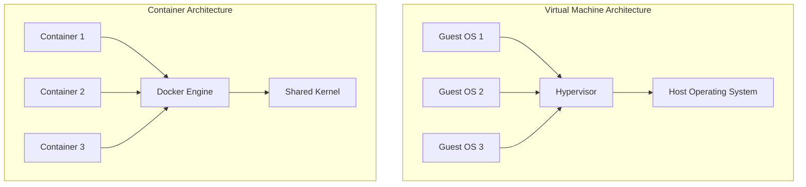
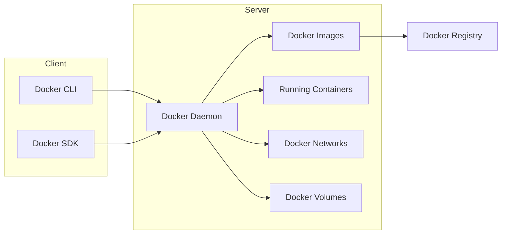
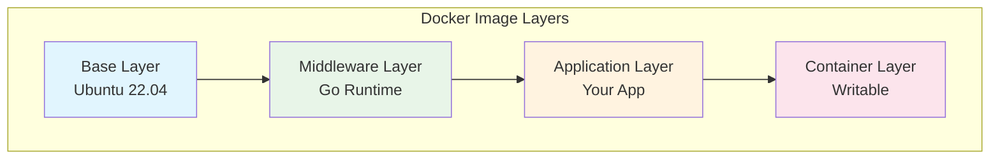

System Design: Docker Fundamentals - Containerization Revolution

Introduction

Docker has revolutionized the way we develop, deploy, and manage applications. At its core, Docker is a platform that enables developers to package applications and their dependencies into lightweight, portable containers. These containers can run consistently across different environments, from a developer's laptop to production servers, eliminating the infamous "it works on my machine" problem.

Containerization technology has transformed modern software architecture by providing a consistent, isolated environment for applications while maintaining efficiency and portability. Unlike traditional virtual machines that virtualize hardware, Docker containers virtualize the operating system, allowing multiple containers to run on a single host OS with minimal overhead.

This comprehensive guide explores Docker fundamentals, covering everything from basic concepts to advanced containerization strategies, with practical Go code examples demonstrating real-world implementations.

Table of Contents

1. Understanding Containerization (#understanding-containerization)
2. Docker Architecture (#docker-architecture)
3. Docker Images and Layers (#docker-images-and-layers)
4. Dockerfile Best Practices (#dockerfile-best-practices)
5. Container Networking (#container-networking)
6. Storage and Volumes (#storage-and-volumes)
7. Orchestration with Docker Compose (#orchestration-with-docker-compose)
8. Security Considerations (#security-considerations)
9. Performance Optimization (#performance-optimization)
10. Real-World Examples (#real-world-examples)

Understanding Containerization {#understanding-containerization}

Containerization is a form of operating system virtualization that allows multiple isolated user-space instances, called containers, to run on a single host OS. Unlike traditional virtual machines that include a full OS, containers share the host kernel but run in isolated user spaces.

Container vs Virtual Machine Comparison



Containers offer several advantages over traditional VMs:

- Lightweight: No guest OS overhead, sharing the host kernel
- Fast startup: Typically seconds compared to minutes for VMs
- Efficient resource utilization: Lower memory and CPU overhead
- Consistent environments: Identical behavior across development, testing, and production
- Portability: Run anywhere Docker is supported

Key Container Concepts

Namespaces
Namespaces provide isolation by partitioning kernel resources. Docker uses several namespace types:

- PID (Process ID): Isolate process trees
- NET (Network): Isolate network interfaces
- MNT (Mount): Isolate mount points
- UTS (Unix Timesharing): Isolate hostname and NIS domain name
- IPC (Interprocess Communication): Isolate IPC resources
- USER: Isolate user and group IDs

Control Groups (cgroups)
Control groups limit, account for, and isolate resource usage (CPU, memory, disk I/O, network, etc.) of a collection of processes.

Union File Systems
Union file systems layer filesystems on top of each other, allowing files and directories from separate filesystems to be transparently overlaid. Docker uses union file systems for image layers and container file systems.

Docker Architecture {#docker-architecture}

Docker follows a client-server architecture where the Docker client communicates with the Docker daemon, which performs building, running, and distributing containers.



Docker Components

Docker Client
The Docker client is the primary interface for users to interact with Docker. It sends commands to the Docker daemon through the REST API.

Docker Daemon
The Docker daemon (dockerd) runs on the host machine and manages Docker objects such as images, containers, networks, and volumes. It listens for Docker API requests and manages Docker services.

Docker Images
Docker images are read-only templates containing the application code, libraries, dependencies, and runtime environment needed to run an application. Images are built using Dockerfiles and stored in registries.

Docker Containers
Docker containers are runnable instances of Docker images. They are isolated from each other and the host system, with their own filesystem, networking, and process space.

Docker Registries
Docker registries store Docker images. Docker Hub is the default public registry, but private registries can also be set up.

Docker Images and Layers {#docker-images-and-layers}

Docker images are composed of multiple layers, each representing an instruction in the Dockerfile. This layered architecture enables efficient storage and sharing of images.

Image Layer Architecture



Each layer is immutable, and Docker uses a copy-on-write strategy. When a container is created, Docker adds a thin writable layer on top of the image layers. Changes made to the container are stored in this writable layer.

Creating Efficient Images

Here's a Go application Dockerfile that demonstrates best practices:

```dockerfile
# Multi-stage build to reduce final image size
FROM golang:1.21-alpine AS builder

# Install ca-certificates for HTTPS requests
RUN apk add --no-cache ca-certificates git

# Set working directory
WORKDIR /app

# Copy go mod files
COPY go.mod go.sum ./

# Download dependencies
RUN go mod download

# Copy source code
COPY . .

# Build the application
RUN CGO_ENABLED=0 GOOS=linux go build -o main .

# Production stage
FROM scratch

# Copy CA certificates for HTTPS
COPY --from=builder /etc/ssl/certs/ca-certificates.crt /etc/ssl/certs/

# Copy the binary from builder stage
COPY --from=builder /app/main /main

# Expose port
EXPOSE 8080

# Run the application
ENTRYPOINT ["/main"]
```

Dockerfile Best Practices {#dockerfile-best-practices}

Writing efficient Dockerfiles is crucial for creating optimized images. Here are key best practices:

1. Use Specific Base Image Tags

Always use specific tags instead of latest to ensure reproducible builds:

```dockerfile
# Good
FROM golang:1.21-alpine

# Avoid
FROM golang:latest
```

2. Leverage Build Cache

Order Dockerfile instructions to maximize cache reuse. Place frequently changing instructions later:

```dockerfile
# Copy go mod files first (they change less frequently)
COPY go.mod go.sum ./
RUN go mod download

# Copy source code last (changes more frequently)
COPY . .
```

3. Multi-stage Builds

Use multi-stage builds to reduce final image size:

```dockerfile
# Build stage
FROM golang:1.21-alpine AS builder
WORKDIR /app
COPY go.mod go.sum ./
RUN go mod download
COPY . .
RUN CGO_ENABLED=0 GOOS=linux go build -a -installsuffix cgo -o main .

# Final stage
FROM alpine:latest
RUN apk --no-cache add ca-certificates
WORKDIR /root/
COPY --from=builder /app/main .
CMD ["./main"]
```

4. Minimize Layers

Combine related instructions to reduce the number of layers:

```dockerfile
# Good - combines apt-get update and install
RUN apt-get update && apt-get install -y \
    package1 \
    package2 \
    && rm -rf /var/lib/apt/lists/*

# Avoid - creates multiple layers
RUN apt-get update
RUN apt-get install -y package1
RUN apt-get install -y package2
```

Container Networking {#container-networking}

Docker provides several networking options to enable communication between containers and external systems.

Default Network Drivers

Bridge Network
The default network driver when Docker is installed. Creates a private internal network on the host.

```go
package main

import (
    "fmt"
    "net/http"
    "os"
)

// Example service that could run in a container
func main() {
    port := os.Getenv("PORT")
    if port == "" {
        port = "8080"
    }

    http.HandleFunc("/health", func(w http.ResponseWriter, r *http.Request) {
        fmt.Fprintf(w, "Service is healthy\n")
    })

    http.HandleFunc("/info", func(w http.ResponseWriter, r *http.Request) {
        // Get container info
        hostname, _ := os.Hostname()
        fmt.Fprintf(w, "Hostname: %s\n", hostname)
        fmt.Fprintf(w, "Port: %s\n", port)
        fmt.Fprintf(w, "Environment: %s\n", os.Environ())
    })

    fmt.Printf("Starting server on port %s\n", port)
    err := http.ListenAndServe(":"+port, nil)
    if err != nil {
        fmt.Printf("Server failed to start: %v\n", err)
    }
}
```

Host Network
Removes network isolation between the container and the Docker host.

None Network
Attaches a container to the network with no networking.

Custom Networks

Creating custom bridge networks allows containers to communicate using container names:

```bash
# Create a custom network
docker network create mynetwork

# Run containers on the same network
docker run -d --name db --network mynetwork postgres:13
docker run -d --name app --network mynetwork -p 8080:8080 myapp
```

Go Code for Network Configuration

```go
package main

import (
    "context"
    "fmt"
    "github.com/docker/docker/api/types"
    "github.com/docker/docker/client"
)

// DockerNetworkManager handles Docker network operations
type DockerNetworkManager struct {
    client *client.Client
}

// NewDockerNetworkManager creates a new network manager
func NewDockerNetworkManager() (*DockerNetworkManager, error) {
    cli, err := client.NewClientWithOpts(client.FromEnv)
    if err != nil {
        return nil, fmt.Errorf("failed to create Docker client: %w", err)
    }

    return &DockerNetworkManager{
        client: cli,
    }, nil
}

// CreateNetwork creates a new Docker network
func (nm *DockerNetworkManager) CreateNetwork(name string) error {
    ctx := context.Background()

    resp, err := nm.client.NetworkCreate(ctx, name, types.NetworkCreate{
        Driver: "bridge",
        Internal: false,
        Attachable: true,
    })

    if err != nil {
        return fmt.Errorf("failed to create network: %w", err)
    }

    fmt.Printf("Created network: %s\n", resp.ID)
    return nil
}

// ListNetworks lists all Docker networks
func (nm *DockerNetworkManager) ListNetworks() error {
    ctx := context.Background()

    networks, err := nm.client.NetworkList(ctx, types.NetworkListOptions{})
    if err != nil {
        return fmt.Errorf("failed to list networks: %w", err)
    }

    fmt.Println("Docker Networks:")
    for _, network := range networks {
        fmt.Printf("- Name: %s, ID: %s, Driver: %s\n",
            network.Name, network.ID[:12], network.Driver)
    }

    return nil
}

// ConnectContainer connects a container to a network
func (nm *DockerNetworkManager) ConnectContainer(networkName, containerID string) error {
    ctx := context.Background()

    err := nm.client.NetworkConnect(ctx, networkName, containerID, nil)
    if err != nil {
        return fmt.Errorf("failed to connect container to network: %w", err)
    }

    fmt.Printf("Connected container %s to network %s\n", containerID[:12], networkName)
    return nil
}

func main() {
    nm, err := NewDockerNetworkManager()
    if err != nil {
        fmt.Printf("Failed to create network manager: %v\n", err)
        return
    }

    // List existing networks
    err = nm.ListNetworks()
    if err != nil {
        fmt.Printf("Error listing networks: %v\n", err)
    }

    // Create a new network
    err = nm.CreateNetwork("my-custom-network")
    if err != nil {
        fmt.Printf("Error creating network: %v\n", err)
    }
}
```

Storage and Volumes {#storage-and-volumes}

Docker provides several storage options to persist data beyond the container lifecycle.

Types of Storage

Volumes
Managed by Docker, stored in a part of the host filesystem that's managed by Docker (/var/lib/docker/volumes/ on Linux).

Bind Mounts
Mounted into a container from a file or directory on the host machine.

tmpfs Mounts
Stored in the host's memory only.

Volume Management with Go

```go
package main

import (
    "context"
    "fmt"
    "github.com/docker/docker/api/types"
    "github.com/docker/docker/api/types/mount"
    "github.com/docker/docker/client"
)

// VolumeManager handles Docker volume operations
type VolumeManager struct {
    client *client.Client
}

// NewVolumeManager creates a new volume manager
func NewVolumeManager() (*VolumeManager, error) {
    cli, err := client.NewClientWithOpts(client.FromEnv)
    if err != nil {
        return nil, fmt.Errorf("failed to create Docker client: %w", err)
    }

    return &VolumeManager{
        client: cli,
    }, nil
}

// CreateVolume creates a new Docker volume
func (vm *VolumeManager) CreateVolume(name string, labels map[string]string) error {
    ctx := context.Background()

    resp, err := vm.client.VolumeCreate(ctx, types.VolumeCreateBody{
        Name:   name,
        Labels: labels,
        Driver: "local",
    })

    if err != nil {
        return fmt.Errorf("failed to create volume: %w", err)
    }

    fmt.Printf("Created volume: %s\n", resp.Name)
    return nil
}

// ListVolumes lists all Docker volumes
func (vm *VolumeManager) ListVolumes() error {
    ctx := context.Background()

    volumes, err := vm.client.VolumeList(ctx, types.VolumeListOptions{})
    if err != nil {
        return fmt.Errorf("failed to list volumes: %w", err)
    }

    fmt.Println("Docker Volumes:")
    for _, volume := range volumes.Volumes {
        fmt.Printf("- Name: %s, Driver: %s, Scope: %s\n",
            volume.Name, volume.Driver, volume.Scope)
    }

    return nil
}

// CreateContainerWithVolume creates a container with a mounted volume
func (vm *VolumeManager) CreateContainerWithVolume(imageName, volumeName, containerName string) error {
    ctx := context.Background()

    // Create container config
    config := &container.Config{
        Image: imageName,
        Cmd:   []string{"sh", "-c", "while true; do echo 'Writing to volume...' >> /data/log.txt && sleep 5; done"},
    }

    // Create host config with volume mount
    hostConfig := &container.HostConfig{
        Mounts: []mount.Mount{
            {
                Type:   mount.TypeVolume,
                Source: volumeName,
                Target: "/data",
            },
        },
    }

    resp, err := vm.client.ContainerCreate(ctx, config, hostConfig, nil, nil, containerName)
    if err != nil {
        return fmt.Errorf("failed to create container: %w", err)
    }

    fmt.Printf("Created container: %s\n", resp.ID[:12])
    return nil
}

func main() {
    vm, err := NewVolumeManager()
    if err != nil {
        fmt.Printf("Failed to create volume manager: %v\n", err)
        return
    }

    // List existing volumes
    err = vm.ListVolumes()
    if err != nil {
        fmt.Printf("Error listing volumes: %v\n", err)
    }

    // Create a new volume
    labels := map[string]string{
        "environment": "production",
        "purpose":     "application-logs",
    }

    err = vm.CreateVolume("app-logs-volume", labels)
    if err != nil {
        fmt.Printf("Error creating volume: %v\n", err)
    }
}
```

Orchestration with Docker Compose {#orchestration-with-docker-compose}

Docker Compose is a tool for defining and running multi-container Docker applications. It uses a YAML file to configure the application's services.

Docker Compose File Structure

```yaml
version: '3.8'

services:
  # Web application service
  web:
    build: .
    ports:
      - "8080:8080"
    environment:
      - DB_HOST=db
      - REDIS_URL=redis://redis:6379
    depends_on:
      - db
      - redis
    volumes:
      - ./logs:/app/logs
    networks:
      - app-network
    restart: unless-stopped

  # Database service
  db:
    image: postgres:13
    environment:
      POSTGRES_DB: myapp
      POSTGRES_USER: user
      POSTGRES_PASSWORD: password
    volumes:
      - db-data:/var/lib/postgresql/data
      - ./init.sql:/docker-entrypoint-initdb.d/init.sql
    networks:
      - app-network
    restart: unless-stopped

  # Redis service
  redis:
    image: redis:6-alpine
    ports:
      - "6379:6379"
    volumes:
      - redis-data:/data
    networks:
      - app-network
    restart: unless-stopped

  # Monitoring service
  prometheus:
    image: prom/prometheus
    ports:
      - "9090:9090"
    volumes:
      - ./prometheus.yml:/etc/prometheus/prometheus.yml
      - prometheus-data:/prometheus
    networks:
      - app-network
    restart: unless-stopped

volumes:
  db-data:
  redis-data:
  prometheus-data:

networks:
  app-network:
    driver: bridge
```

Go Application with Docker Compose Integration

```go
package main

import (
    "context"
    "encoding/json"
    "fmt"
    "io/ioutil"
    "net/http"
    "os"
    "time"

    "github.com/docker/docker/api/types"
    "github.com/docker/docker/client"
)

// ComposeManager handles Docker Compose operations
type ComposeManager struct {
    client *client.Client
}

// NewComposeManager creates a new compose manager
func NewComposeManager() (*ComposeManager, error) {
    cli, err := client.NewClientWithOpts(client.FromEnv)
    if err != nil {
        return nil, fmt.Errorf("failed to create Docker client: %w", err)
    }

    return &ComposeManager{
        client: cli,
    }, nil
}

// ServiceInfo represents information about a Docker service
type ServiceInfo struct {
    ID          string            `json:"id"`
    Name        string            `json:"name"`
    Image       string            `json:"image"`
    Status      string            `json:"status"`
    Ports       []types.Port      `json:"ports"`
    Labels      map[string]string `json:"labels"`
    CreatedAt   time.Time         `json:"created_at"`
    UpdatedAt   time.Time         `json:"updated_at"`
}

// ListServices lists all running containers (services)
func (cm *ComposeManager) ListServices() ([]ServiceInfo, error) {
    ctx := context.Background()

    containers, err := cm.client.ContainerList(ctx, types.ContainerListOptions{All: true})
    if err != nil {
        return nil, fmt.Errorf("failed to list containers: %w", err)
    }

    var services []ServiceInfo
    for _, container := range containers {
        service := ServiceInfo{
            ID:        container.ID,
            Name:      container.Names[0], // Usually the first name
            Image:     container.Image,
            Status:    container.Status,
            Ports:     container.Ports,
            Labels:    container.Labels,
            CreatedAt: time.Unix(container.Created, 0),
        }

        // Get detailed container info for updated time
        inspect, err := cm.client.ContainerInspect(ctx, container.ID)
        if err == nil {
            service.UpdatedAt = inspect.State.StartedAt
        }

        services = append(services, service)
    }

    return services, nil
}

// StartService starts a specific container
func (cm *ComposeManager) StartService(containerID string) error {
    ctx := context.Background()

    err := cm.client.ContainerStart(ctx, containerID, types.ContainerStartOptions{})
    if err != nil {
        return fmt.Errorf("failed to start container: %w", err)
    }

    fmt.Printf("Started container: %s\n", containerID[:12])
    return nil
}

// StopService stops a specific container
func (cm *ComposeManager) StopService(containerID string) error {
    ctx := context.Background()

    err := cm.client.ContainerStop(ctx, containerID, nil)
    if err != nil {
        return fmt.Errorf("failed to stop container: %w", err)
    }

    fmt.Printf("Stopped container: %s\n", containerID[:12])
    return nil
}

// ExportServices exports service information to JSON
func (cm *ComposeManager) ExportServices(filename string) error {
    services, err := cm.ListServices()
    if err != nil {
        return err
    }

    data, err := json.MarshalIndent(services, "", "  ")
    if err != nil {
        return fmt.Errorf("failed to marshal services: %w", err)
    }

    err = ioutil.WriteFile(filename, data, 0644)
    if err != nil {
        return fmt.Errorf("failed to write file: %w", err)
    }

    fmt.Printf("Exported services to %s\n", filename)
    return nil
}

func main() {
    cm, err := NewComposeManager()
    if err != nil {
        fmt.Printf("Failed to create compose manager: %v\n", err)
        return
    }

    // List all services
    services, err := cm.ListServices()
    if err != nil {
        fmt.Printf("Error listing services: %v\n", err)
        return
    }

    fmt.Println("Current Services:")
    for _, service := range services {
        fmt.Printf("- %s (%s): %s\n", service.Name, service.ID[:12], service.Status)
    }

    // Export services to JSON file
    err = cm.ExportServices("services.json")
    if err != nil {
        fmt.Printf("Error exporting services: %v\n", err)
    }

    // Example health check (assuming a service is running on localhost:8080)
    resp, err := http.Get("http://localhost:8080/health")
    if err != nil {
        fmt.Printf("Health check error: %v\n", err)
    } else {
        defer resp.Body.Close()
        fmt.Printf("Service health: %t\n", resp.StatusCode == 200)
    }
}
```

Security in Docker {#security-considerations}

Container security is critical for protecting applications and infrastructure. Here are key security practices:

1. Non-root User Execution

Run containers as non-root users to minimize potential damage:

```dockerfile
FROM golang:1.21-alpine

# Create a non-root user
RUN addgroup -g 65532 appgroup && \
    adduser -D -u 65532 -G appgroup appuser

# Set working directory
WORKDIR /app

# Copy application
COPY --chown=appuser:appgroup . .

# Switch to non-root user
USER appuser

# Run application
CMD ["./main"]
```

2. Minimal Base Images

Use minimal base images like Alpine Linux to reduce attack surface:

```dockerfile
# Use minimal base image
FROM gcr.io/distroless/static-debian11

# Copy only the necessary binary
COPY main /main

# Run as non-root user
USER nobody

ENTRYPOINT ["/main"]
```

3. Security Scanning

Implement security scanning in your CI/CD pipeline:

```bash
# Example using Trivy for vulnerability scanning
trivy image myapp:latest

# Example using Docker Scout
docker scout cves myapp:latest
```

Go Security Scanner

```go
package main

import (
    "context"
    "fmt"
    "os/exec"
    "strings"

    "github.com/docker/docker/client"
)

// SecurityScanner performs security scans on Docker images
type SecurityScanner struct {
    dockerClient *client.Client
}

// NewSecurityScanner creates a new security scanner
func NewSecurityScanner() (*SecurityScanner, error) {
    cli, err := client.NewClientWithOpts(client.FromEnv)
    if err != nil {
        return nil, fmt.Errorf("failed to create Docker client: %w", err)
    }

    return &SecurityScanner{
        dockerClient: cli,
    }, nil
}

// ScanImage scans an image for vulnerabilities using Trivy
func (ss *SecurityScanner) ScanImage(imageName string) error {
    cmd := exec.Command("trivy", "image", "--quiet", imageName)

    output, err := cmd.Output()
    if err != nil {
        return fmt.Errorf("trivy scan failed: %w", err)
    }

    result := string(output)
    if strings.Contains(result, "VULNERABILITY") {
        fmt.Printf("Security issues found in image %s:\n%s\n", imageName, result)
    } else {
        fmt.Printf("No vulnerabilities found in image %s\n", imageName)
    }

    return nil
}

// GetImageLayers returns information about image layers
func (ss *SecurityScanner) GetImageLayers(imageName string) error {
    ctx := context.Background()

    image, _, err := ss.dockerClient.ImageInspectWithRaw(ctx, imageName)
    if err != nil {
        return fmt.Errorf("failed to inspect image: %w", err)
    }

    fmt.Printf("Image %s has %d layers:\n", imageName, len(image.RootFS.Layers))
    for i, layer := range image.RootFS.Layers {
        fmt.Printf("  Layer %d: %s\n", i+1, layer[:12])
    }

    return nil
}

// CheckImageSecurityBestPractices checks for common security issues
func (ss *SecurityScanner) CheckImageSecurityBestPractices(imageName string) error {
    ctx := context.Background()

    image, _, err := ss.dockerClient.ImageInspectWithRaw(ctx, imageName)
    if err != nil {
        return fmt.Errorf("failed to inspect image: %w", err)
    }

    fmt.Printf("Checking security best practices for image: %s\n", imageName)

    // Check if running as root (this is a simplified check)
    // In practice, you'd need to analyze the Dockerfile or image history
    fmt.Printf("Image ID: %s\n", image.ID[:12])
    fmt.Printf("Created: %s\n", image.Created)
    fmt.Printf("Docker Version: %s\n", image.DockerVersion)

    // Additional checks would go here
    // - Check for secrets in image
    // - Check for unnecessary packages
    // - Verify base image is up-to-date

    return nil
}

func main() {
    scanner, err := NewSecurityScanner()
    if err != nil {
        fmt.Printf("Failed to create security scanner: %v\n", err)
        return
    }

    // Example image name - replace with your actual image
    imageName := "nginx:latest"

    // Get image layers
    err = scanner.GetImageLayers(imageName)
    if err != nil {
        fmt.Printf("Error getting image layers: %v\n", err)
    }

    // Check security best practices
    err = scanner.CheckImageSecurityBestPractices(imageName)
    if err != nil {
        fmt.Printf("Error checking security best practices: %v\n", err)
    }

    // Note: Trivy scan requires Trivy to be installed
    // err = scanner.ScanImage(imageName)
    // if err != nil {
    //     fmt.Printf("Error scanning image: %v\n", err)
    // }
}
```

Performance Optimization {#performance-optimization}

Optimizing Docker containers for performance involves several strategies:

1. Resource Limits

Set appropriate CPU and memory limits:

```yaml
version: '3.8'
services:
  app:
    image: myapp:latest
    deploy:
      resources:
        limits:
          cpus: '0.50'
          memory: 512M
        reservations:
          cpus: '0.25'
          memory: 256M
```

2. Efficient Base Images

Choose the right base image for your application:

```dockerfile
# For Go applications, consider using distroless images
FROM gcr.io/distroless/static-debian11

# Or use Alpine for more flexibility
FROM alpine:latest
RUN apk add --no-cache ca-certificates
COPY main /main
ENTRYPOINT ["/main"]
```

3. Multi-stage Builds

Use multi-stage builds to reduce image size:

```dockerfile
# Build stage
FROM golang:1.21-alpine AS builder

WORKDIR /app
COPY go.mod go.sum ./
RUN go mod download

COPY . .
RUN CGO_ENABLED=0 GOOS=linux go build -a -installsuffix cgo -o main .

# Final stage
FROM gcr.io/distroless/static-debian11
COPY --from=builder /app/main /main
ENTRYPOINT ["/main"]
```

Performance Monitoring Go Application

```go
package main

import (
    "context"
    "encoding/json"
    "fmt"
    "net/http"
    "time"

    "github.com/docker/docker/api/types"
    "github.com/docker/docker/client"
)

// PerformanceMonitor monitors container performance metrics
type PerformanceMonitor struct {
    client *client.Client
}

// NewPerformanceMonitor creates a new performance monitor
func NewPerformanceMonitor() (*PerformanceMonitor, error) {
    cli, err := client.NewClientWithOpts(client.FromEnv)
    if err != nil {
        return nil, fmt.Errorf("failed to create Docker client: %w", err)
    }

    return &PerformanceMonitor{
        client: cli,
    }, nil
}

// ContainerMetrics represents performance metrics for a container
type ContainerMetrics struct {
    ID           string    `json:"id"`
    Name         string    `json:"name"`
    CPUPercent   float64   `json:"cpu_percent"`
    MemoryUsage  uint64    `json:"memory_usage_bytes"`
    MemoryLimit  uint64    `json:"memory_limit_bytes"`
    MemoryPercent float64  `json:"memory_percent"`
    NetworkRx    uint64    `json:"network_rx_bytes"`
    NetworkTx    uint64    `json:"network_tx_bytes"`
    BlockRead    uint64    `json:"block_read_bytes"`
    BlockWrite   uint64    `json:"block_write_bytes"`
    Timestamp    time.Time `json:"timestamp"`
}

// GetContainerStats retrieves performance metrics for a container
func (pm *PerformanceMonitor) GetContainerStats(containerID string) (*ContainerMetrics, error) {
    ctx := context.Background()

    stats, err := pm.client.ContainerStats(ctx, containerID, false)
    if err != nil {
        return nil, fmt.Errorf("failed to get container stats: %w", err)
    }
    defer stats.Body.Close()

    var statJSON types.StatsJSON
    if err := json.NewDecoder(stats.Body).Decode(&statJSON); err != nil {
        return nil, fmt.Errorf("failed to decode stats: %w", err)
    }

    // Calculate CPU usage percentage
    cpuDelta := float64(statJSON.CPUStats.CPUUsage.TotalUsage - statJSON.PreCPUStats.CPUUsage.TotalUsage)
    systemDelta := float64(statJSON.CPUStats.SystemUsage - statJSON.PreCPUStats.SystemUsage)

    var cpuPercent float64
    if systemDelta > 0.0 && cpuDelta > 0.0 {
        cpuPercent = (cpuDelta / systemDelta) * float64(len(statJSON.CPUStats.CPUUsage.PercpuUsage)) * 100.0
    }

    // Calculate memory usage percentage
    var memPercent float64
    if statJSON.MemoryStats.Limit != 0 {
        memPercent = float64(statJSON.MemoryStats.Usage) / float64(statJSON.MemoryStats.Limit) * 100.0
    }

    // Get container name
    containerJSON, err := pm.client.ContainerInspect(ctx, containerID)
    if err != nil {
        return nil, fmt.Errorf("failed to inspect container: %w", err)
    }

    metrics := &ContainerMetrics{
        ID:            containerID,
        Name:          containerJSON.Name,
        CPUPercent:    cpuPercent,
        MemoryUsage:   statJSON.MemoryStats.Usage,
        MemoryLimit:   statJSON.MemoryStats.Limit,
        MemoryPercent: memPercent,
        NetworkRx:     getTotalNetworkRx(statJSON),
        NetworkTx:     getTotalNetworkTx(statJSON),
        BlockRead:     statJSON.BlkioStats.IoServiceBytesRecursive.Read(),
        BlockWrite:    statJSON.BlkioStats.IoServiceBytesRecursive.Write(),
        Timestamp:     time.Now(),
    }

    return metrics, nil
}

// getTotalNetworkRx calculates total received bytes
func getTotalNetworkRx(stats types.StatsJSON) uint64 {
    var total uint64
    for _, net := range stats.Networks {
        total += net.RxBytes
    }
    return total
}

// getTotalNetworkTx calculates total transmitted bytes
func (pm *PerformanceMonitor) getTotalNetworkTx(stats types.StatsJSON) uint64 {
    var total uint64
    for _, net := range stats.Networks {
        total += net.TxBytes
    }
    return total
}

// MonitorAllContainers monitors all running containers
func (pm *PerformanceMonitor) MonitorAllContainers() ([]ContainerMetrics, error) {
    ctx := context.Background()

    containers, err := pm.client.ContainerList(ctx, types.ContainerListOptions{})
    if err != nil {
        return nil, fmt.Errorf("failed to list containers: %w", err)
    }

    var allMetrics []ContainerMetrics
    for _, container := range containers {
        metrics, err := pm.GetContainerStats(container.ID)
        if err != nil {
            fmt.Printf("Failed to get stats for container %s: %v\n", container.ID[:12], err)
            continue
        }
        allMetrics = append(allMetrics, *metrics)
    }

    return allMetrics, nil
}

// StartMonitoringHTTPServer starts an HTTP server to expose metrics
func (pm *PerformanceMonitor) StartMonitoringHTTPServer(port string) error {
    http.HandleFunc("/metrics", func(w http.ResponseWriter, r *http.Request) {
        metrics, err := pm.MonitorAllContainers()
        if err != nil {
            http.Error(w, err.Error(), http.StatusInternalServerError)
            return
        }

        w.Header().Set("Content-Type", "application/json")
        json.NewEncoder(w).Encode(metrics)
    })

    http.HandleFunc("/health", func(w http.ResponseWriter, r *http.Request) {
        w.WriteHeader(http.StatusOK)
        w.Write([]byte("OK"))
    })

    fmt.Printf("Starting performance monitoring server on port %s\n", port)
    return http.ListenAndServe(":"+port, nil)
}

func main() {
    monitor, err := NewPerformanceMonitor()
    if err != nil {
        fmt.Printf("Failed to create performance monitor: %v\n", err)
        return
    }

    // List all containers and their metrics
    allMetrics, err := monitor.MonitorAllContainers()
    if err != nil {
        fmt.Printf("Error monitoring containers: %v\n", err)
        return
    }

    fmt.Println("Container Performance Metrics:")
    for _, metric := range allMetrics {
        fmt.Printf("\nContainer: %s (%s)\n", metric.Name, metric.ID[:12])
        fmt.Printf("  CPU Usage: %.2f%%\n", metric.CPUPercent)
        fmt.Printf("  Memory Usage: %.2f%% (%d/%d MB)\n", 
            metric.MemoryPercent, 
            metric.MemoryUsage/(1024*1024), 
            metric.MemoryLimit/(1024*1024))
        fmt.Printf("  Network: RX=%d MB, TX=%d MB\n", 
            metric.NetworkRx/(1024*1024), 
            metric.NetworkTx/(1024*1024))
        fmt.Printf("  Block I/O: Read=%d MB, Write=%d MB\n", 
            metric.BlockRead/(1024*1024), 
            metric.BlockWrite/(1024*1024))
    }

    // Start HTTP server for continuous monitoring
    go func() {
        if err := monitor.StartMonitoringHTTPServer("8081"); err != nil {
            fmt.Printf("Error starting monitoring server: %v\n", err)
        }
    }()

    fmt.Println("Press Ctrl+C to stop...")
    select {}
}
```

Real-World Examples {#real-world-examples}

Let's look at a complete real-world example of a microservice application deployed with Docker:

Complete Microservice Example

```yaml
# docker-compose.yml
version: '3.8'

services:
  # Web application service
  web:
    build: .
    ports:
      - "8080:8080"
    environment:
      - DB_HOST=db
      - REDIS_URL=redis://redis:6379
    depends_on:
      - db
      - redis
    volumes:
      - ./logs:/app/logs
    networks:
      - app-network
    restart: unless-stopped

  # Database service
  db:
    image: postgres:13
    environment:
      POSTGRES_DB: myapp
      POSTGRES_USER: user
      POSTGRES_PASSWORD: password
    volumes:
      - db-data:/var/lib/postgresql/data
      - ./init.sql:/docker-entrypoint-initdb.d/init.sql
    networks:
      - app-network
    restart: unless-stopped

  # Redis service
  redis:
    image: redis:6-alpine
    ports:
      - "6379:6379"
    volumes:
      - redis-data:/data
    networks:
      - app-network
    restart: unless-stopped

  # Monitoring service
  prometheus:
    image: prom/prometheus
    ports:
      - "9090:9090"
    volumes:
      - ./prometheus.yml:/etc/prometheus/prometheus.yml
      - prometheus-data:/prometheus
    networks:
      - app-network
    restart: unless-stopped

volumes:
  db-data:
  redis-data:
  prometheus-data:

networks:
  app-network:
    driver: bridge
```

Go Application for the Microservice

```go
// main.go
package main

import (
    "context"
    "encoding/json"
    "fmt"
    "log"
    "net/http"
    "os"
    "os/signal"
    "syscall"
    "time"

    "github.com/gorilla/mux"
)

// UserService handles user-related operations
type UserService struct {
    users map[string]User
}

// User represents a user entity
type User struct {
    ID        string    `json:"id"`
    Name      string    `json:"name"`
    Email     string    `json:"email"`
    CreatedAt time.Time `json:"created_at"`
}

// NewUserService creates a new user service
func NewUserService() *UserService {
    return &UserService{
        users: make(map[string]User),
    }
}

// GetUser retrieves a user by ID
func (s *UserService) GetUser(w http.ResponseWriter, r *http.Request) {
    vars := mux.Vars(r)
    userID := vars["id"]

    user, exists := s.users[userID]
    if !exists {
        http.Error(w, "User not found", http.StatusNotFound)
        return
    }

    w.Header().Set("Content-Type", "application/json")
    json.NewEncoder(w).Encode(user)
}

// CreateUser creates a new user
func (s *UserService) CreateUser(w http.ResponseWriter, r *http.Request) {
    var user User
    if err := json.NewDecoder(r.Body).Decode(&user); err != nil {
        http.Error(w, "Invalid JSON", http.StatusBadRequest)
        return
    }

    user.ID = fmt.Sprintf("%d", time.Now().UnixNano())
    user.CreatedAt = time.Now()

    s.users[user.ID] = user

    w.Header().Set("Content-Type", "application/json")
    w.WriteHeader(http.StatusCreated)
    json.NewEncoder(w).Encode(user)
}

// GetAllUsers retrieves all users
func (s *UserService) GetAllUsers(w http.ResponseWriter, r *http.Request) {
    users := make([]User, 0, len(s.users))
    for _, user := range s.users {
        users = append(users, user)
    }

    w.Header().Set("Content-Type", "application/json")
    json.NewEncoder(w).Encode(users)
}

// HealthCheck provides a health endpoint
func (s *UserService) HealthCheck(w http.ResponseWriter, r *http.Request) {
    w.Header().Set("Content-Type", "application/json")
    w.WriteHeader(http.StatusOK)
    json.NewEncoder(w).Encode(map[string]string{
        "status":    "healthy",
        "timestamp": time.Now().Format(time.RFC3339),
        "service":   "user-service",
    })
}

// StartServer starts the HTTP server
func (s *UserService) StartServer(port string) error {
    r := mux.NewRouter()

    // Define routes
    r.HandleFunc("/users", s.GetAllUsers).Methods("GET")
    r.HandleFunc("/users", s.CreateUser).Methods("POST")
    r.HandleFunc("/users/{id}", s.GetUser).Methods("GET")
    r.HandleFunc("/health", s.HealthCheck).Methods("GET")

    // Add middleware
    r.Use(loggingMiddleware)

    server := &http.Server{
        Addr:         ":" + port,
        Handler:      r,
        ReadTimeout:  15 * time.Second,
        WriteTimeout: 15 * time.Second,
        IdleTimeout:  60 * time.Second,
    }

    // Create a channel to listen for interrupt signal
    sigChan := make(chan os.Signal, 1)
    signal.Notify(sigChan, syscall.SIGINT, syscall.SIGTERM)

    // Start server in a goroutine
    go func() {
        log.Printf("Starting server on port %s", port)
        if err := server.ListenAndServe(); err != nil && err != http.ErrServerClosed {
            log.Fatalf("Could not listen on port %s: %v", port, err)
        }
    }()

    // Wait for interrupt signal
    <-sigChan
    log.Println("Shutting down server...")

    // Create a deadline for the shutdown
    ctx, cancel := context.WithTimeout(context.Background(), 30*time.Second)
    defer cancel()

    // Shutdown gracefully
    if err := server.Shutdown(ctx); err != nil {
        log.Fatalf("Server forced to shutdown: %v", err)
    }

    log.Println("Server exited")
    return nil
}

// loggingMiddleware logs incoming requests
func loggingMiddleware(next http.Handler) http.Handler {
    return http.HandlerFunc(func(w http.ResponseWriter, r *http.Request) {
        start := time.Now()

        // Log request
        log.Printf("Started %s %s from %s", r.Method, r.URL.Path, r.RemoteAddr)

        // Serve request
        next.ServeHTTP(w, r)

        // Log completion
        log.Printf("Completed %s %s in %v", r.Method, r.URL.Path, time.Since(start))
    })
}

func main() {
    port := os.Getenv("PORT")
    if port == "" {
        port = "8080"
    }

    userService := NewUserService()

    // Add some sample users
    userService.users["1"] = User{
        ID:        "1",
        Name:      "John Doe",
        Email:     "john@example.com",
        CreatedAt: time.Now(),
    }

    userService.users["2"] = User{
        ID:        "2",
        Name:      "Jane Smith",
        Email:     "jane@example.com",
        CreatedAt: time.Now(),
    }

    if err := userService.StartServer(port); err != nil {
        log.Fatalf("Server failed to start: %v", err)
    }
}
```

Dockerfile for the Microservice

```dockerfile
# Multi-stage build
FROM golang:1.21-alpine AS builder

# Install git for dependency management
RUN apk add --no-cache git

# Set working directory
WORKDIR /app

# Copy go mod files
COPY go.mod go.sum ./

# Download dependencies
RUN go mod download

# Copy source code
COPY . .

# Build the application
RUN CGO_ENABLED=0 GOOS=linux go build -a -installsuffix cgo -o main .

# Final stage
FROM gcr.io/distroless/static-debian11

# Copy the binary from builder stage
COPY --from=builder /app/main /main

# Expose port
EXPOSE 8080

# Run as non-root user
USER nonroot:nonroot

# Run the application
ENTRYPOINT ["/main"]
```

Conclusion

Docker has revolutionized containerization by providing a platform for deploying, scaling, and managing containerized applications. Its architecture, consisting of client-server components, enables sophisticated automation and management capabilities.

The key benefits of Docker include:

- Abstraction: Hides infrastructure complexity behind a clean API
- Automation: Automates deployment, scaling, and operations of applications
- Scalability: Handles applications from single-node to thousands of nodes
- Portability: Runs consistently across different cloud providers and on-premises
- Ecosystem: Rich ecosystem of tools and extensions

As you implement Docker in your projects, remember to follow security best practices, properly configure networking and storage, and use appropriate orchestration tools. The combination of Docker with container orchestration platforms like Kubernetes enables the creation of highly available, resilient, and scalable distributed systems.

The Go code examples provided demonstrate practical implementations of Docker concepts, from basic container management to complex microservice architectures. These examples serve as a foundation for building production-ready Docker applications that leverage the full power of the platform's orchestration capabilities.

By mastering Docker fundamentals and applying best practices, you'll be well-equipped to design and deploy modern cloud-native applications that meet today's demanding scalability, reliability, and security requirements.

---

Date: 2024-11-27
Author: System Design Expert
Tags: ["Docker", "Containerization", "DevOps", "Microservices", "Go", "Cloud Native"]
Category: System Design
Series: Container Technologies
seriesOrder: 1
Previous Post: None
Next Post: Kubernetes Fundamentals

This comprehensive guide covers Docker fundamentals with practical Go examples, diagrams, and real-world implementation patterns. The content follows best practices for system design documentation with detailed explanations, code examples, and architectural insights.