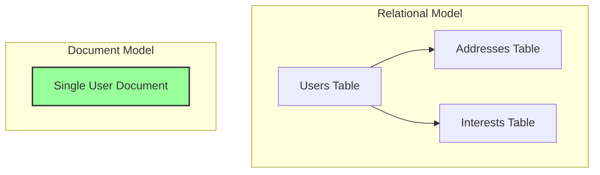

## Introduction: Data That Looks Like Your Code

For decades, the relational model, with its rigid tables, rows, and columns, has been the default choice for storing data. But what if your data doesn't fit neatly into a pre-defined table? What if different entities have different attributes, or your data structure evolves rapidly?

This is where **document databases** come in. A document database is a type of NoSQL database designed to store and query data as JSON-like documents. Instead of breaking an object down into multiple tables (like `users`, `user_profiles`, `user_addresses`), you store the entire object in a single, self-contained document.

This approach provides a more intuitive and developer-friendly way to work with data, as the database's data model closely mirrors the objects in your application code.

## The Core Concept: The Document

A document is a data structure composed of field-and-value pairs. It's analogous to an object in programming or a row in a relational table, but far more flexible. Documents are typically represented in formats like JSON, BSON (Binary JSON, used by MongoDB), or XML.

Here's an example of a user document:
```json
{
  "_id": "user123",
  "name": "Alice",
  "email": "alice@example.com",
  "interests": ["hiking", "reading", "coding"],
  "address": {
    "street": "123 Main St",
    "city": "Anytown"
  },
  "last_login": "2025-11-25T10:00:00Z"
}
```
This single document contains all the information about Alice. In a relational model, this would have required at least three tables (`users`, `user_interests`, `user_addresses`) and complex joins to reconstruct.



## Flexible Schema: The Key Advantage

The most significant feature of a document database is its **flexible schema** (sometimes called schema-on-read). Unlike a relational database where you must define your table structure upfront (schema-on-write), a document database allows documents in the same collection (the equivalent of a table) to have different structures.

For example, a second user document could include a `company` field that the first one didn't have:
```json
{
  "_id": "user456",
  "name": "Bob",
  "email": "bob@example.com",
  "interests": ["gaming"],
  "company": "Acme Corp"
}
```
The database handles this without any issues. This flexibility is incredibly powerful for:
*   **Evolving Applications:** You can add new fields to your data model without running complex `ALTER TABLE` migrations.
*   **Handling Diverse Data:** Perfect for storing data where each item might have a unique set of attributes, like products in a catalog.

## Common Use Cases

Document databases excel in scenarios where data is object-oriented and doesn't fit a rigid schema.

1.  **Product Catalogs:** An e-commerce site can store products as documents. A "laptop" document can have fields like `cpu` and `ram`, while a "shirt" document can have `size` and `color`, all within the same `products` collection.
2.  **Content Management Systems:** A blog post, its comments, tags, and author information can all be stored in a single document, making it incredibly fast to retrieve everything needed to render a page.
3.  **User Profiles:** User profiles often have a core set of data, but can also have many optional fields, nested objects, and lists. A document is a natural fit for this structure.
4.  **Real-Time Analytics:** Storing events or logs as documents allows for flexible querying and aggregation as new data points are added.

## Querying and Indexing

While you can't use SQL, document databases provide rich query languages that allow you to filter documents based on the values in their fields, including fields inside nested objects and arrays.

To ensure queries are fast, document databases support **indexes**. You can create indexes on any field within a document, just as you would on a column in a relational table. This is critical for performance. Without an index, a query would require a full scan of every document in the collection.

## Go Example: A Simple Product Catalog with MongoDB

Let's use Go and the official MongoDB driver to model a simple product catalog where different products have different attributes.

```go
package main

import (
	"context"
	"fmt"
	"log"

	"go.mongodb.org/mongo-driver/bson"
	"go.mongodb.org/mongo-driver/mongo"
	"go.mongodb.org/mongo-driver/mongo/options"
)

var ctx = context.Background()

// Product represents a generic product structure.
// We use `bson.M` for attributes to allow for a flexible structure.
type Product struct {
	ID         string  `bson:"_id"`
	Name       string  `bson:"name"`
	Category   string  `bson:"category"`
	Price      float64 `bson:"price"`
	Attributes bson.M  `bson:"attributes"`
}

func main() {
	// --- Connect to MongoDB ---
	clientOptions := options.Client().ApplyURI("mongodb://localhost:27017")
	client, err := mongo.Connect(ctx, clientOptions)
	if err != nil {
		log.Fatal(err)
	}
	defer client.Disconnect(ctx)

	collection := client.Database("storedb").Collection("products")

	// --- Insert Documents with Different Schemas ---
	
	// A laptop with specific tech attributes
	laptop := Product{
		ID:       "prod101",
		Name:     "DevBook Pro",
		Category: "Electronics",
		Price:    1299.99,
		Attributes: bson.M{
			"cpu":   "M5",
			"ram_gb": 16,
			"ssd_gb": 512,
		},
	}

	// A t-shirt with different attributes
	shirt := Product{
		ID:       "prod205",
		Name:     "Logo Tee",
		Category: "Apparel",
		Price:    24.99,
		Attributes: bson.M{
			"color": "blue",
			"size":  "L",
			"material": "cotton",
		},
	}

	// Clear previous data and insert new documents
	collection.DeleteMany(ctx, bson.M{})
	_, err = collection.InsertOne(ctx, laptop)
	if err != nil { log.Fatal(err) }
	_, err = collection.InsertOne(ctx, shirt)
	if err != nil { log.Fatal(err) }

	log.Println("Inserted 2 products with different attributes.")

	// --- Query for a specific product ---
	fmt.Println("\n--- Finding all 'Electronics' ---")
	
	// Create an index on the 'category' field for faster queries
	collection.Indexes().CreateOne(ctx, mongo.IndexModel{Keys: bson.M{"category": 1}})

	cursor, err := collection.Find(ctx, bson.M{"category": "Electronics"})
	if err != nil {
		log.Fatal(err)
	}
	defer cursor.Close(ctx)

	for cursor.Next(ctx) {
		var p Product
		if err = cursor.Decode(&p); err != nil {
			log.Fatal(err)
		}
		fmt.Printf("Found Product: %+v\n", p)
		fmt.Printf("  -> Specific attribute (CPU): %s\n", p.Attributes["cpu"])
	}
}
```

## Conclusion

Document databases offer a powerful and intuitive alternative to the relational model, especially for applications with evolving or semi-structured data. Their flexible schema accelerates development and simplifies the mapping between your application's objects and their stored representation. While they may not be the right fit for every problem (e.g., highly relational data requiring complex, multi-table transactions), they have rightfully earned their place as a first-class citizen in the modern developer's toolkit, powering everything from simple mobile apps to large-scale content platforms.
