## Introduction: The Needle in the Haystack

In the world of time-series data, you often have a "good problem": too much data. Your systems might be collecting metrics every second, resulting in billions of data points per day. While this high-resolution data is critical for real-time monitoring and immediate debugging, storing it forever is impractical and expensive.

Furthermore, when you're looking at a dashboard showing data from last year, you don't need to see second-by-second fluctuations. You're interested in the overall trend: the hourly, daily, or weekly patterns. Trying to render a chart with millions of raw data points would crash your browser and be visually useless.

This is where **downsampling** comes in. Downsampling is the process of reducing the resolution of your time-series data by aggregating it over a larger time interval. It's a powerful technique to make long-term data storage feasible while preserving the data's value for trend analysis.

## What is Downsampling?

Downsampling takes a set of high-resolution data points and replaces them with a smaller number of lower-resolution, aggregated points.

For example, you could take 60 data points, each representing one second of CPU usage, and aggregate them into a single data point representing the average CPU usage for that minute. You've just reduced your data volume by a factor of 60.

```mermaid
graph LR
    subgraph "High-Resolution Data (1 point/sec)"
        direction LR
        P1["📊 10:00:01"] 
        P2["📊 10:00:02"] 
        P3["📊 10:00:03"] 
        P4["📊 10:00:04"]
        P5["📊 10:00:05"]
        dots1["..."]
        P60["📊 10:00:60"]
        
        P1 --> P2 --> P3 --> P4 --> P5 --> dots1 --> P60
    end

    subgraph "Downsampling Process"
        Agg["🧮 Aggregation Function\n(AVG, SUM, MAX, MIN)"]
    end

    subgraph "Low-Resolution Data (1 point/min)"
        DP1["📈 10:01:00\n(Avg of 60 points)"]
    end

    P1 -.-> Agg
    P2 -.-> Agg
    P3 -.-> Agg
    P4 -.-> Agg
    P5 -.-> Agg
    dots1 -.-> Agg
    P60 -.-> Agg
    
    Agg --> DP1

    %% Styling
    style P1 fill:#e3f2fd,stroke:#1976d2,stroke-width:2px
    style P2 fill:#e3f2fd,stroke:#1976d2,stroke-width:2px
    style P3 fill:#e3f2fd,stroke:#1976d2,stroke-width:2px
    style P4 fill:#e3f2fd,stroke:#1976d2,stroke-width:2px
    style P5 fill:#e3f2fd,stroke:#1976d2,stroke-width:2px
    style dots1 fill:#e3f2fd,stroke:#1976d2,stroke-width:2px
    style P60 fill:#e3f2fd,stroke:#1976d2,stroke-width:2px
    style Agg fill:#f3e5f5,stroke:#7b1fa2,stroke-width:3px
    style DP1 fill:#e8f5e8,stroke:#388e3c,stroke-width:3px
```



This process is typically run automatically by the time-series database (TSDB) or a background job. It works hand-in-hand with data retention policies: as raw, high-precision data gets old, it is downsampled and then the original raw data is deleted.

## Common Downsampling Strategies

The key to effective downsampling is choosing the right **aggregation function**. The function you choose depends on what aspect of the data you want to preserve.

### 1. Average (`AVG`)
*   **What it does:** Calculates the arithmetic mean of the data points in the time window.
*   **When to use it:** This is the most common strategy. It's perfect for gauges and metrics that fluctuate around a central value, like temperature, CPU usage, or memory utilization. It gives you a smooth, representative view of the trend.

### 2. Sum (`SUM`)
*   **What it does:** Calculates the total of all data points in the window.
*   **When to use it:** For counters that only ever increase, like `requests_processed` or `bytes_sent`. Averaging a counter is meaningless; you want to know the total count over the larger time interval.

### 3. Maximum (`MAX`) and Minimum (`MIN`)
*   **What it does:** Records the highest or lowest value within the time window.
*   **When to use it:** For tracking peaks and troughs. `MAX` is crucial for metrics like `request_latency`, where you need to know if there were any significant spikes, even if the average was low. Storing `MIN`, `MAX`, and `AVG` together provides a much richer picture than `AVG` alone.

### 4. Count (`COUNT`)
*   **What it does:** Counts the number of data points that occurred in the window.
*   **When to use it:** To understand the frequency of events. For example, counting the number of `login_failures` per hour.

### 5. Last (or First)
*   **What it does:** Simply picks the last (or first) value recorded in the time window.
*   **When to use it:** For state changes or settings where you only care about the most recent value in a given period. For example, the status of a service (`up` or `down`).

## A Multi-Tiered Downsampling and Retention Plan

A robust strategy often involves multiple levels of downsampling.

*   **Raw Data:** Retained for **24 hours**. (For real-time dashboards and immediate debugging).
*   **1-Minute Averages:** Created from raw data. Retained for **30 days**. (For short-term trend analysis).
*   **1-Hour Averages:** Created from 1-minute averages. Retained for **1 year**. (For long-term capacity planning).
*   **1-Day Averages:** Created from 1-hour averages. Retained for **5 years**. (For historical reporting).

This creates a pyramid of data, with the most granular data being the most recent and the least granular data being the oldest, perfectly balancing storage cost with analytical value.

## Go Example: A Simple Downsampling Worker

Let's write a conceptual Go program that simulates a worker processing a stream of raw data points and creating 1-minute averages.

```go
package main

import (
	"fmt"
	"log"
	"time"
)

// RawPoint represents a high-resolution data point.
type RawPoint struct {
	Timestamp time.Time
	Value     float64
}

// DownsampledPoint represents an aggregated data point.
type DownsampledPoint struct {
	Timestamp time.Time // The start of the aggregation window
	AvgValue  float64
	Count     int
}

// Downsampler processes raw points and creates aggregated points.
type Downsampler struct {
	window      time.Duration
	windowData  []RawPoint
	windowStart time.Time
}

// NewDownsampler creates a new downsampler for a given window size.
func NewDownsampler(window time.Duration) *Downsampler {
	return &Downsampler{window: window}
}

// ProcessPoint adds a raw point to the downsampler.
// If a window is complete, it returns the aggregated point.
func (d *Downsampler) ProcessPoint(p RawPoint) *DownsampledPoint {
	if d.windowData == nil {
		// First point, start a new window
		d.windowStart = p.Timestamp.Truncate(d.window)
		d.windowData = append(d.windowData, p)
		return nil
	}

	if p.Timestamp.Before(d.windowStart.Add(d.window)) {
		// Point belongs to the current window
		d.windowData = append(d.windowData, p)
		return nil
	}

	// The point is in a new window, so we aggregate the old one first.
	aggregatedPoint := d.aggregateWindow()

	// Start the new window with the current point.
	d.windowStart = p.Timestamp.Truncate(d.window)
	d.windowData = []RawPoint{p}

	return aggregatedPoint
}

// aggregateWindow calculates the average for the current window.
func (d *Downsampler) aggregateWindow() *DownsampledPoint {
	if len(d.windowData) == 0 {
		return nil
	}

	var sum float64
	for _, p := range d.windowData {
		sum += p.Value
	}

	avg := sum / float64(len(d.windowData))

	return &DownsampledPoint{
		Timestamp: d.windowStart,
		AvgValue:  avg,
		Count:     len(d.windowData),
	}
}

func main() {
	downsampler := NewDownsampler(1 * time.Minute)
	now := time.Now().Truncate(time.Minute)

	// Simulate a stream of data points over ~2 minutes
	rawData := []RawPoint{
		{Timestamp: now.Add(10 * time.Second), Value: 15.0},
		{Timestamp: now.Add(30 * time.Second), Value: 20.0},
		{Timestamp: now.Add(50 * time.Second), Value: 10.0}, // End of first window
		{Timestamp: now.Add(70 * time.Second), Value: 30.0}, // Start of second window
		{Timestamp: now.Add(90 * time.Second), Value: 35.0},
	}

	log.Println("Processing raw data stream...")
	for _, p := range rawData {
		if aggregated := downsampler.ProcessPoint(p); aggregated != nil {
			fmt.Printf("--- New Downsampled Point ---\n")
			fmt.Printf("Window Start: %s\n", aggregated.Timestamp.Format(time.RFC3339))
			fmt.Printf("Average Value: %.2f\n", aggregated.AvgValue)
			fmt.Printf("Raw Point Count: %d\n", aggregated.Count)
		}
	}
}
```

## Conclusion

Downsampling is an essential technique for the long-term management of time-series data. It's a strategic trade-off, sacrificing high-frequency detail for massive gains in storage efficiency and long-range query performance. By thoughtfully choosing aggregation functions and implementing a tiered retention plan, you can build a data system that provides both the immediate, high-resolution insights needed for operations and the long-term, aggregated trends required for business intelligence, all in a cost-effective and scalable manner.
