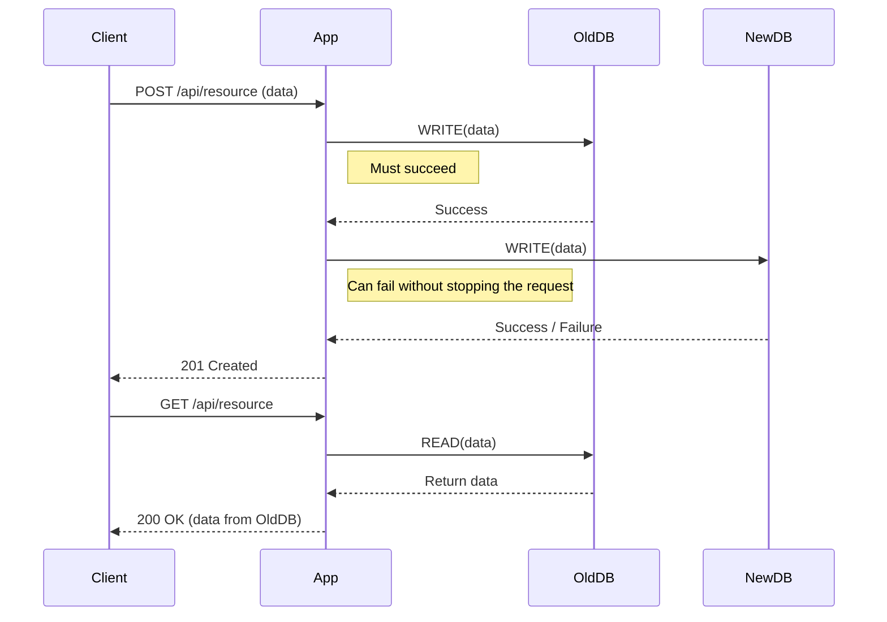

## System Design Deep Dive: The Dual-Write Pattern

In the world of zero-downtime migrations, ensuring data consistency between an old and a new system is paramount. The **Dual-Write Pattern** (also known as the Parallel Run pattern) is a common strategy to achieve this. It involves modifying an application to write data to two destinations simultaneously—typically a legacy database and a new, modern one.

While simple in concept, the dual-write pattern introduces significant complexity. A successful implementation requires a deep understanding of its trade-offs and robust handling of its failure modes.

### How Does the Dual-Write Pattern Work?

The core idea is to temporarily make your application responsible for keeping two data stores in sync.

1.  **Application Logic Change:** The application code is modified so that any data creation or update operation is performed against both the old and the new data store.
2.  **Old System as Source of Truth:** During the migration, the old system remains the authoritative source of truth for read operations. This ensures that the user-facing experience is consistent and stable.
3.  **New System Catches Up:** The new system receives all new and updated data in real-time, allowing it to build a current state that mirrors the old system.
4.  **Data Backfill:** This pattern only handles live traffic. A separate, one-time process is required to migrate all historical data that existed before the dual-write was enabled.



### Use Cases

-   **Database Migrations:** The most common use case. Migrating from a relational database to a NoSQL database (e.g., PostgreSQL to DynamoDB) or from a self-hosted instance to a cloud-managed one (e.g., on-premise MySQL to Amazon RDS).
-   **Microservice Extraction:** When a new microservice takes ownership of data that was previously managed by a monolith, dual-writing can keep the monolith's database and the new service's database in sync during the transition.
-   **Cache Hydration:** Keeping a cache and a primary database consistent. While not a migration, it uses the same underlying principle.

### The Biggest Challenge: Partial Failures

The dual-write pattern turns a single write operation into a distributed transaction, and with it comes the risk of partial failure. What happens if the write to the old database succeeds, but the write to the new one fails?

-   **Inconsistency:** The new database is now missing data, breaking the sync.
-   **User Impact:** If the application returns an error to the user, it creates a poor experience, especially if the primary system (the old one) is perfectly healthy.

Handling this is the most critical part of a dual-write implementation.

#### Strategies for Handling Failures:

1.  **Asynchronous Write to New System:** The write to the old system is performed synchronously. If it succeeds, the request is considered successful. The write to the new system is then performed asynchronously (e.g., in a separate goroutine or by publishing an event).
    -   **Pro:** The request latency is not impacted by the new system's performance.
    -   **Con:** If the async write fails, you need a mechanism to detect and reconcile the inconsistency.

2.  **Reconciliation Queue:** If the write to the new system fails, the application pushes the failed data or event into a reliable queue (like a Dead Letter Queue - DLQ). A separate background worker process can then retry writing this data to the new system.
    -   **Pro:** Highly resilient. It provides a durable log of failed writes that need to be fixed.
    -   **Con:** Adds operational complexity. You need to manage the queue and the worker process.

### Go Example: Robust Dual-Write with a Reconciliation Queue

This example shows a more robust implementation. If the write to the new database fails, the data is pushed to an in-memory "reconciliation queue" for a background worker to process. In a real-world scenario, this queue would be a durable system like RabbitMQ or AWS SQS.

```go
package main

import (
	"fmt"
	"log"
	"sync"
	"time"
)

// OldDB represents the legacy database.
type OldDB struct{}

func (db *OldDB) Save(data string) error {
	log.Printf("[OldDB] Saving: %s", data)
	time.Sleep(50 * time.Millisecond)
	return nil
}

// NewDB represents the new database.
type NewDB struct {
	isAvailable bool
	mu          sync.RWMutex
}

func (db *NewDB) Save(data string) error {
	db.mu.RLock()
	defer db.mu.RUnlock()
	if !db.isAvailable {
		return fmt.Errorf("new DB is offline")
	}
	log.Printf("[NewDB] Saving: %s", data)
	time.Sleep(70 * time.Millisecond)
	return nil
}

func (db *NewDB) SetAvailability(available bool) {
	db.mu.Lock()
	defer db.mu.Unlock()
	db.isAvailable = available
}

// ReconciliationQueue is a simple in-memory queue for failed writes.
// In production, use a persistent queue like RabbitMQ, Kafka, or SQS.
var ReconciliationQueue = make(chan string, 100)

// DataRepository handles the dual-write logic.
type DataRepository struct {
	oldDB *OldDB
	newDB *NewDB
}

func (r *DataRepository) SaveOrder(orderData string) error {
	// 1. Write to the primary (old) database. This is critical.
	if err := r.oldDB.Save(orderData); err != nil {
		log.Printf("CRITICAL: Failed to write to oldDB: %v", err)
		return err
	}

	// 2. Attempt to write to the secondary (new) database.
	if err := r.newDB.Save(orderData); err != nil {
		// If it fails, log it and push to the reconciliation queue.
		// The overall operation is still a success from the client's perspective.
		log.Printf("WARNING: Failed to write to newDB: %v. Enqueuing for reconciliation.", err)
		ReconciliationQueue <- orderData
	}

	return nil
}

// ReconciliationWorker processes the queue of failed writes.
func ReconciliationWorker(newDB *NewDB, wg *sync.WaitGroup) {
	defer wg.Done()
	log.Println("Reconciliation worker started.")
	for data := range ReconciliationQueue {
		log.Printf("[Worker] Attempting to reconcile data: %s", data)
		// Retry logic could be more sophisticated (e.g., exponential backoff)
		if err := newDB.Save(data); err != nil {
			log.Printf("[Worker] ERROR: Could not reconcile data: %s. Re-enqueuing.", data)
			// In a real system, you might re-enqueue or move to a final "failed" log.
			// For this example, we'll just try once.
		} else {
			log.Printf("[Worker] SUCCESS: Reconciled data: %s", data)
		}
	}
	log.Println("Reconciliation worker finished.")
}

func main() {
	repo := &DataRepository{
		oldDB: &OldDB{},
		newDB: &NewDB{},
	}

	var wg sync.WaitGroup
	wg.Add(1)
	go ReconciliationWorker(repo.newDB, &wg)

	// --- Phase 1: Both DBs are online ---
	fmt.Println("--- Both databases are available ---")
	repo.newDB.SetAvailability(true)
	repo.SaveOrder("Order #1") // Should succeed on both

	// --- Phase 2: New DB goes offline ---
	fmt.Println("\n--- New database goes offline ---")
	repo.newDB.SetAvailability(false)
	repo.SaveOrder("Order #2") // Fails on newDB, gets enqueued
	repo.SaveOrder("Order #3") // Fails on newDB, gets enqueued

	time.Sleep(200 * time.Millisecond)

	// --- Phase 3: New DB comes back online ---
	// The worker will now process the queue.
	fmt.Println("\n--- New database comes back online ---")
	repo.newDB.SetAvailability(true)

	// Give the worker time to process the queue
	time.Sleep(500 * time.Millisecond)

	// --- Phase 4: Normal operation resumes ---
	fmt.Println("\n--- Normal operation resumes ---")
	repo.SaveOrder("Order #4") // Should succeed on both

	close(ReconciliationQueue)
	wg.Wait()
}
```

### Pros and Cons of Dual-Write

**Pros:**
-   **Zero Downtime:** Allows the system to remain fully operational during the migration.
-   **Real-time Sync:** The new system is kept up-to-date with live data.
-   **Low-Risk Cutover:** Since the new system has been running in parallel and receiving traffic, you can be more confident when you finally switch reads over to it.

**Cons:**
-   **Increased Complexity:** The application logic becomes more complicated.
-   **Performance Overhead:** Writing to two systems increases latency and resource consumption.
-   **Data Inconsistency Risk:** The primary drawback. Requires careful engineering to manage partial failures.
-   **Temporary Solution:** It's a transitional pattern. The dual-write code must be removed once the migration is complete, adding to the engineering effort.

### Conclusion

The Dual-Write pattern is a powerful but sharp tool. It's an effective strategy for achieving zero-downtime data migrations, but it should not be underestimated. Success hinges on a solid plan for handling data inconsistency, including detection, alerting, and reconciliation. When implemented carefully, it provides a safe and gradual path from a legacy system to a modern one.
---
